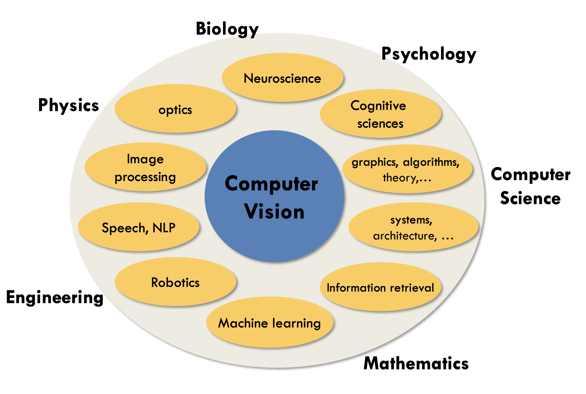

* [jiajunhua/ahong007007-Awesome_Computer_Vision](https://github.com/jiajunhua/ahong007007-Awesome_Computer_Vision)
* [jbhuang0604/awesome-computer-vision](https://github.com/jbhuang0604/awesome-computer-vision)

Compuet Vision and other subject

* Computer Vision
    *  visual recognition
        * image classification
            * object detection
            * image captioning
            * action classification

Convolutional Neural Networks (CNN) have
become an important tool for object recognition

