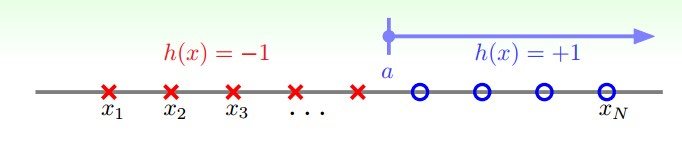
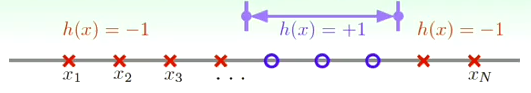
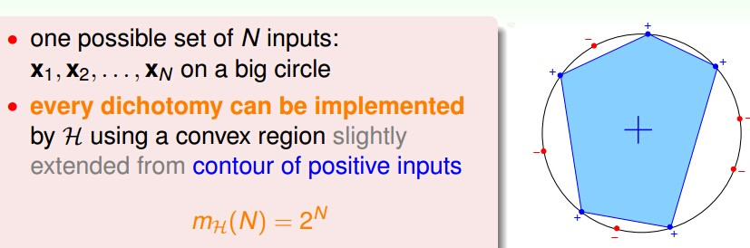

## Dichotomnies: Mini-hypotheses

在之前已经知道如果用线的话，在平面上到底有几种不一样的线，如
果以后我们用线以外的hypothesis set,例如hyperplane,高维度的曲线。那么到底有几种hypothesis set呢？

上一节讲的将无限的hypothesis set按照对训练数据的分类情况，有一个专有名词叫做Dichotomies(二分)。它就是指hypothesis set将大小为N的训练数据分成的不同情形的集合。本节主要想求出Dichotomies的大小，这样就可以用来替换原来Hoeffding不等式中无限的M了。

经过上一节的分析，我们发现Dichotomies的大小是依赖于训练数据的分布情况的。那么我们就定义Grow Function为所有训练数据的Dichotomies最大者好了。

那么先看一些简单的求Grow Function的例子。
案例一。x=R(one dimensional).H contains h,where each h(x) = sign(x - a) for threshold a 。那么这种情况下Dichotomies大小为N+1。

案例二。x=R(one dimensional).H contains h,where each h(x) = +1 iff x∈[l,r),-1 otherwise. 在一个凸形状中，否则=-1。

案例三：x=$$R^2$$ (two dimensional).H contains h,where h(x)=+1 iff x in a convex region,-1 otherwise.假设N个训练数据都分布在一个圆形上，任意选希望被分为+1的数据点连成一个凸多边形，只要将这个凸多边形稍微扩大一点点就达到了效果。这样看来Dichotomies大小为2^N，因为任何想要的分类情形都可以实现。
