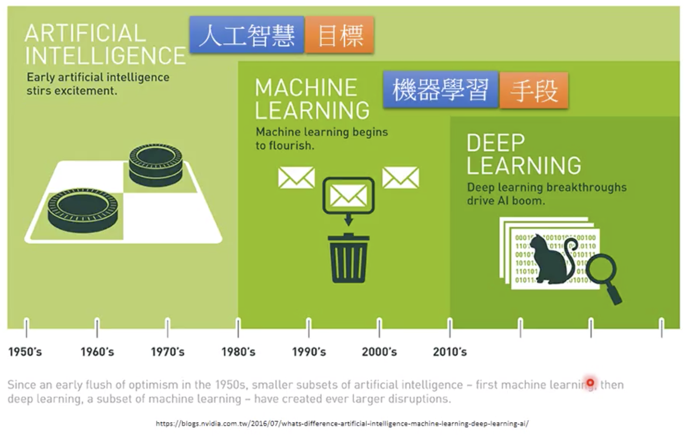

# Introduction

* 机器学习算法
  * 监督学习： 使用预定义的“训练示例”集合，训练系统，便于其在新数据被馈送时也能得出结论。系统一直被训练，直到达到所需的精度水平。
  * 无监督学习： 给系统一堆无标签数据，它必须自己检测模式和关系。 系统要用推断功能来描述未分类数据的模式。
  * 强化学习：强化学习其实是一个连续决策的过程，这个过程有点像有监督学习，只是标注数据不是预先准备好的，而是通过一个过程来回调整，并给出“标注数据”。

* 机器学习常用算法：
  * 线性回归
  * 逻辑回归
  * 决策树
  * 支持向量机
  * 朴素贝叶斯
  * KNN/K近邻
  * k-均值
  * 随机森林
  * 降维算法
  * 梯度提高和演算法

机器学习：机器通过分析大量数据来进行学习。比如说，不需要通过编程来识别猫或人脸，它们可以通过使用图片来进行训练，从而归纳和识别特定的目标。

机器学习是一种重在寻找数据中的模式并使用这些模式来做出预测的研究和算法的门类。机器学习是人工智能领域的一部分，并且和知识发现与数据挖掘有所交集

机器学习的工作方式

①选择数据：将你的数据分成三组：训练数据、验证数据和测试数据

②模型数据：使用训练数据来构建使用相关特征的模型

③验证模型：使用你的验证数据接入你的模型

④测试模型：使用你的测试数据检查被验证的模型的表现

⑤使用模型：使用完全训练好的模型在新数据上做预测

⑥调优模型：使用更多数据、不同的特征或调整过的参数来提升算法的性能表现

# Open courses
* [李宏毅2017机器学习](https://www.bilibili.com/video/av10590361?from=search&seid=8726738433477857991)
* [李宏毅2019机器学习](https://www.bilibili.com/video/av35932863?from=search&seid=8726738433477857991)

# Reference
[三张图读懂机器学习：基本概念、五大流派与九种常见算法](https://36kr.com/p/5072074.html)
[一文读懂机器学习、数据科学、人工智能、深度学习和统计学之间的区别](一文读懂机器学习、数据科学、人工智能、深度学习和统计学之间的区别)