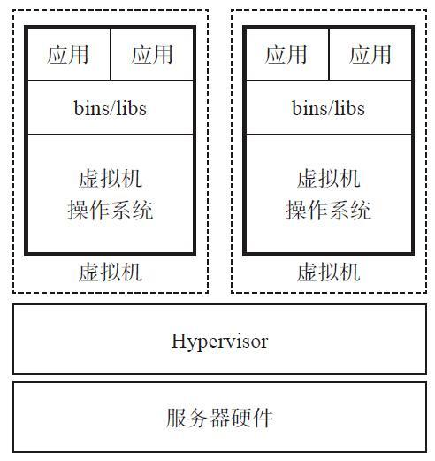
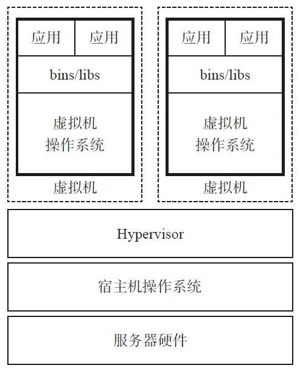
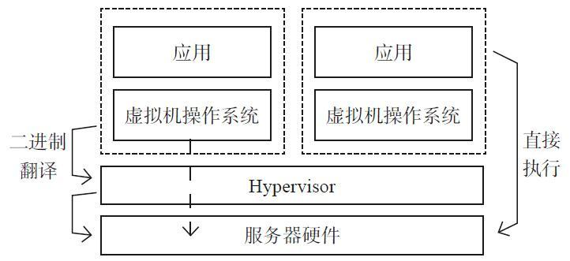
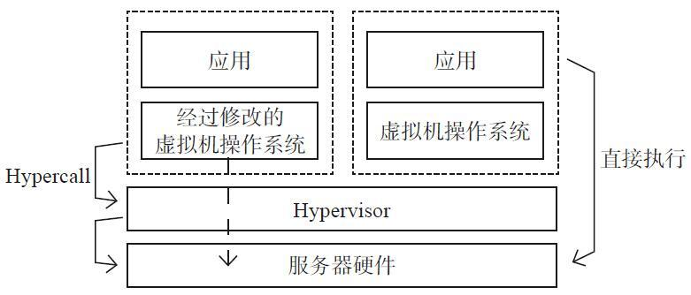
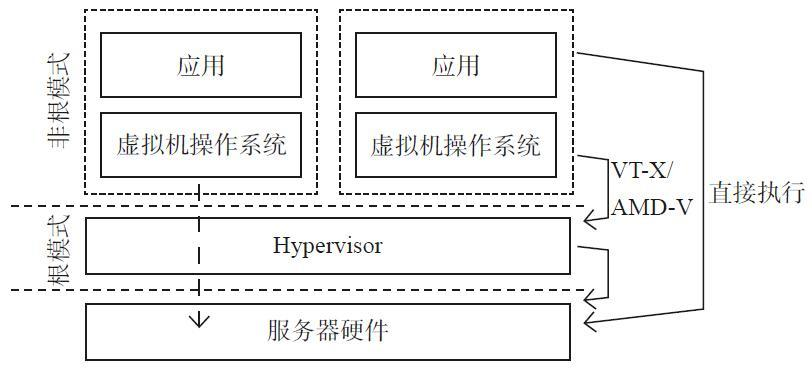
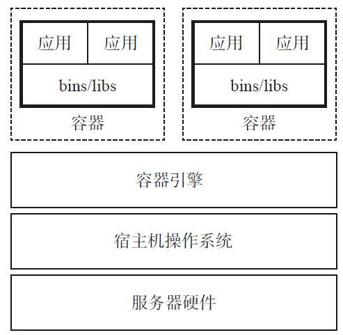
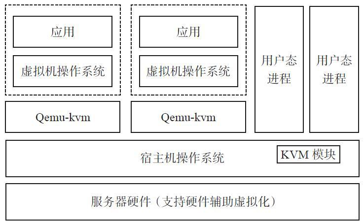
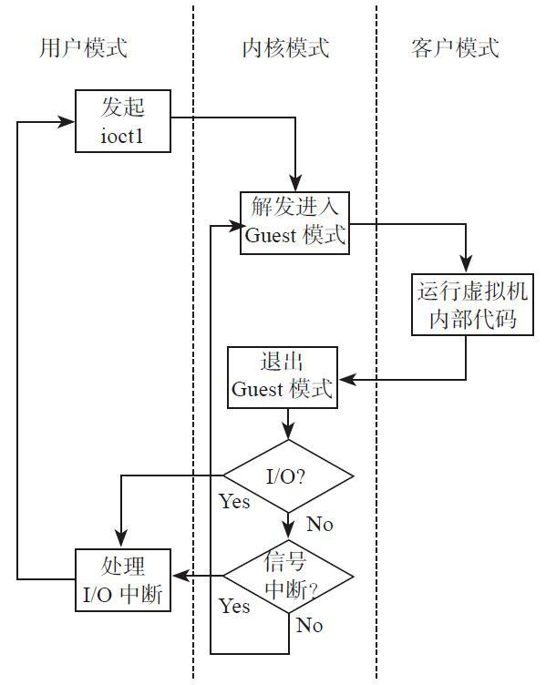
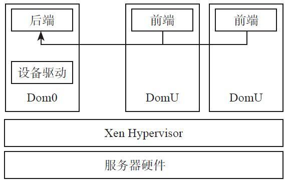

## 3.1 虚拟化技术：

### 3.1.1 计算虚拟化

#### 3.1.1.1 计算虚拟化介绍

计算虚拟化将一台计算机虚拟为多台逻辑计算机，每个逻辑计算机可运行不同的操作系统，并且应用程序可以在相互独立的空间内运行而互不影响，从而显著提高计算机的工作效率。CPU的虚拟化技术可以用单CPU模拟多CPU运行。

虚拟化技术的核心是运行在硬件服务器上的Hypervisor软件。Hypervisor是一种运行在物理服务器和操作系统之间的中间软件层，允许多个操作系统和应用共享一套基础物理硬件，因此也可以看作虚拟环境中的〃元"操作系统，它可以协调访问服务器上的所有物理设备和虚拟机，也叫虚拟机监视器(Virtual Machine Monitor) ₒ Hypervisor是所有虚拟化技术的核心，非中断地支持多工作负载迁移的能力是Hypervisor的基本功能。当服务器启动并执行Hypervisor时，它会给每一台虚拟机分配适量的内存、CPU.网络和磁盘，并加载所有虚拟机的客户操作系统。


虚拟化实现方式：

1. Hypervisor虚拟化

- ```
  Hypervisor虚拟化表达了服务请求与底层物理交付的分离。通过在物理硬件与操作
  系统间增加一层逻辑虚拟化层，计算机的各种实体资源，如CPU、内存、网络及存储
  等，得以被抽象分割，形成多个虚拟机实体。对于上层服务，虚拟机就是真实的计算
  机，它拥有独立的计算环境，拥有自己的虚拟硬件。
  ```

  

  Hypersisor 层负责服务器硬件和虚拟机操作系统之间的通信。

  对于x86系统，按照其虚拟化实现方式，可分为两种类型：

  1.1 裸金属架构

  ```
  裸金属架构的虚拟化是运行在服务器硬件之上，如图2-1所示。虚以机运行在Hypervisor层之上，而Hypervisor层直接安装在硬件之上。由于不需要通过操作系统就可以直接访问硬件资源，这种虚拟化类型更高效，并且具有更好的可扩展性和更高的安全性。目前在市场上使用这种虚拟化架构的产品有微软的Hyper-V、VMware vSphere的ESXi和Citrix的 XenServerₒ
  ```

  1.2 寄居架构

  寄居架构虚拟化层将虚拟化层以一种应用程序的方式运行在操作系统之上，只要是操作系统能支持的硬件，虚拟化层都能支持，具有很好的兼容性。

  

  无论采用裸金属架构还是寄居架构，虚拟化层都负责运行和管理所有虚拟机。虚拟化层为每个虚拟机实现虚拟机硬件抽象，并负责运行客户操作系统，通过分割和共享CPU、内存和I/O设备等来实现系统的虚拟化。因内部体系结构和具体实现不同，Hypervisor所呈现的功能会有很大的差异。以下从CPU、内存、设备虚拟化3个方面，简单介绍Hypervisor内部的实现方式。

  1.1 CPU虚拟化

  X86操祜系统被设计为直接在硬件上运行，很自然，操作系统会认为它们拥有硬件的所有控制权。x86架构为操作系统和应用程序提供了 4个权限级别（ring 0、ring，ring 2和ring 3）来管理对硬件的访问。用户程序一般运行在ring 3,而操作系统需要直接访问内存和硬件，所以必须在ring 0执行特权指令。虚拟化X86架构需要在操作系统（原本运行于最高权限ring 0）与硬件之间再增加一个虚拟层，用于为创建和管理虚拟机提供共享资源。某些敏感指令在非ringO下执行时具有不同的语义，而不能很好地被虚拟化，这使得x86虚拟化的实现更加复杂。运行时陷入并翻译这些敏感指令和特权指令是一个巨大的挑战，这使得X86架构的虚拟化起初看起来像是"不可完成的任务"。
  虚拟化发展多年，但业界还没有一个开放的标准来定义和管理虚拟化。每个公司可以根据自己的情况，设计不同的虚拟化方案来应对虚拟化的技术挑战。而处理敏感和特权指令，以实现X86架构上CPU虚拟化的技术，大体可归纳为以下3种：

  * 使用二进制翻译的全虚拟化

  * 操作系统辅助或半虚拟化

  * 硬件辅助的虚拟化

    （1）使用二进制翻译的全虚拟化
    这种方法对内核代码进行翻译，将不可虚拟化的指令替换为一串新的指令，而这串指令对虚拟化硬件可达到预期效果，如图2・3所示。同时，将用户级的代码直接运行在物理处理器上以保证虚拟化的高性能。虚拟机监控器为虚拟机提供真实的物理系统的所有服务，包括虚拟BIOS.虚拟设备和虚拟内存管理等。

    

    由于虚拟机操作系统被完全抽象，通过虚拟化层与底层硬件彻底解耦，所以，二进制翻译和直接指令执行的结合提供了全虚拟化。虚拟机操作系统完全意识不到虚拟化，不需要对虚拟机系统做任何的修改。Hypervisor在运行过程中动态翻译操作系统指令，并将结果缓存以备后续使用。而用户级指令无需修改就可以运行，具有和物理机一样的执行速度。

    全虚拟化为虚拟机提供最佳的隔离性和安全性。由于同样的虚拟机实例可以运行在虚拟化环境或真实物理硬件上，所以全虚拟化也简化了虚拟机的可移植性。VMware的虚拟化产品和微软的Virtual Server就采用了全虚拟化。

    (2)操作系统辅助虚拟化或半虚拟化

    相对于全虚拟化，半虚拟化是指通过虚拟机系统和Hypervisor间的交互来改善性能和效率。半虚拟化涉及修改虚拟机操作系统内核，将不可虚拟化的指令替换为超级调用Hypercall,以便直接与虚拟化层通信，如图2-4所示。Hypervisor也为其他关键的系统操作，如内存管理、中断处理、计时等，提供超级调用接口。

    

    在全虚拟化中，未经修改的虚拟机系统并不知道自身被虚拟化，敏感系统调用陷入进行二进制翻译。与全虚拟化不同，半虚拟化的价值在于减少了虚拟化开销。但是半虚拟化相对于全虚拟化的性能优势与工作负载有很大的关系。由于半虚拟化不支持未经修改的操作系统(如 Windows 2OOO/XP),它的兼容性和可移植性较差。由于需要对系统内核进行深度修改，很明显，在生产环境中半虚拟化在技术支持和维护上会引入很多问题。开源的Xen项目是半虚拟化的一个例子，它使用一个经过修改的Linux内核来虚拟化处理器，而用另外一个定制的虚拟机系统的设备驱动来虚拟化l/0ₒ

    (3)硬件辅助虚拟化

    硬件厂商也迅速拥抱虚拟化并开发出硬件的新特性来简化虚拟化技术，这其中包括Intel虚拟化技术(VT-x)和AMD的AMD-V两者都为特权指令增加了新的CPU执行模式，以允许VMM在ring 0新增根模式下运行。如图2-5所示，特权和敏感调用自动陷入Hypervisor,而不需要进行二进制翻译或半虚拟化。虚拟机状态保存在虚拟机控制结构(VMCS, VT-x)或虚拟机控制块(VMCB, AMD-V)中。支持VT-x和AMD-V特性的第一代硬件辅助特性处理器在2006年发布，但第一代硬件辅助的实现采用的编程模型僵化，导致Hypervisor到虚拟机的切换开销很高，以至于硬件辅助虚拟化性能低于某些优化后的二进制翻译性能。

    

    第二代硬件辅助技术做了很大的改进，包括硬件支持的内存虚拟化，如AMD的NPT(Nested Page Table)和 Intel 的 EPT (Extended Page Table),以及硬件支持的设备，和 I/O 虚拟化 Intel VT-d、AMD l0MMUₒ

  1.2 内存虚拟化

  内存虚拟化涉及共享系统物理内存和为虚拟机动态分配物理内存。内存虚拟化和现代操作系统对虚拟内存的支持很相似。应用程序看到的连续地址空间与底层真实物理内存并不一一对应，操作系统在页表中保存了虚拟页号与物理页号的映射关系。当前，所有的x86 CPU都采用内存管理单元(MMU)和页表缓存部件(TLB),以优化

  虚拟内存的性能。

  为了在一个系统上运行多个虚拟机，还需要另外一层内存虚拟化。换句话说，需要虚拟化MMU来支持虚拟机系统。虚拟机系统仍然控制虚拟机中虚拟地址到内存物理地址的映射，但虚拟机系统不能直接访问真实物理机器内存。

  在硬件辅助虚拟化出现之前，Hypervisor负责将虚拟机物理内存映射到真实的机器内存，并使用影子页表来加速映射过程。Hypervisor使用硬件中的TLB将虚拟内存直接映射到机器内存，以避免每次访问时所进行的两级转换。影子页表的引入意味着Hypervisor需要为每个客户机的每个进程的页表都维护一套相应的影子页表，这会带来内存上较大的额外开销。此外，客户机页表和和影子页表的同步也比较复杂。当虚拟机改变了虚拟内存到物理内存的映射时，Hypervisor需要更新影子页表，以备后续可以直接查找。

  Intel EPT技术和AMD NPT技术都对内存虚拟化提供了硬件支持。这两种技术原理类似，都是通过硬件方式加速客户机虚拟地址到宿主机物理地址之间的转换。以EPT为例，EPT页表实现客户机物理地址到宿主机物理地址的映射，这样就将客户机虚拟地址到宿主机物理地址的转换分解为客户机虚拟地址到客户机物理地址映射和客户机物理地址到宿主机物理地址的映射，而这两步映射都由硬件自动完成。当客户机运行时，客户机页表被载入CR3,而EPT页表被载入专门的EPT页表指针寄存器EPTPO EPT页表对地址的映射机制与客户机页表对地址的映射机制相同。EPT实现方式不需要为每个客户机的每个进程维护一套页表来进行转换映射，EPT比影子页表实现简单，且由于采用硬件实现，虚拟化性能、效率也得到大幅提升。

  1.3 设备虚拟化

  设备和I/O虚拟化涉及对虚拟设备和共享物理设备之间的I/O请求路径的管理。相较于物理硬件直通(direct pass-through),基于软件的I/O虚拟化和管理提供了更丰富的特性和更简化的管理方式。以网络为例，虚拟网卡和虚拟交换机在虚拟机之间创建虚拟网络，而不需要消耗物理网络的带宽。网卡绑定允许将多个物理网卡展现为一块网卡，在网卡故障时可以对虚拟机做到透明切换，并且，虚拟机可以通过热迁移在不同的系统间无缝迁移，而保持MAC地址不变。高效I/O虚拟化的关键是要在维持虚拟化优势的同时，最小化CPU消耗。

  Hypervisor虚拟化物理硬件为每个虚拟机呈现标准的虚拟设备。这些虚拟设备有效地模拟了所熟知的硬件，并将虚拟机的请求转换到系统物理硬件。所有虚拟机可以配置为运行在相同的虚拟硬件上，而与底层真实的系统物理硬件无关。设备驱动的一致性和标准化也进一步推动了虚拟机的标准化，增强了虚拟机在不同平台间的可移植性。

2. 容器虚拟化:充分利用操作系统自身机制和特性

   容器技术：新一代虚拟化技术

   - Docker(工具：Machine、Compose、Swarm，容器平台：Kubernetes，Mesos，CoreOS)
   - chroot(1982,UNIX) -> Linux Container(LXC,集成到Linux内核中) -> Docker(提供容器管理工具，分层文件系统，镜像；早起Docker完全基于LXC，之后开发了libcontainer，之后Dokcer推动runC项目，使容器不局限于Linux操作系统，而是更安全、更具扩展性。)

   容器也是对服务器资源进行隔离，包括CPU份额、网络I/O、带宽、存储I/O、内存等。同一台主机上的多台容器之间可以公平友好地共享资源，而不互相影响。

   如今，容器是云计算的一个热门话题。在同一台服务器上部署容器，其密度相较于虚拟机可以提升约10倍。但是容器并不是一个新的技术，它至少可以追溯到2000年FreeBSD jails 的出现，而 FreeBSD jails 则是基于 1982 年 BSD UNIX 的 chroot C 命令。再往前，chroot最早源于1979年UNIX7版本。通过chroot可以改变进程和子

   进程所能看到的根目录，这意味着可以在指定的根目录下独立运行程序，所以说从早期的chroot中就可以看出容器的踪迹。但是chroot仅适合于运行简单的应用，往往只是一个shell程序。虽然chroot会为程序创造一个jail, jail通过虚拟对文件系统、网络等的访问，限制用户的行为，但是还是有些方法很容易发生"越狱"这使得chroot很难应用于大型复杂系统。

   SUN利用了 jail的概念，将其演化成Solaris Zones。但这一技术是Solaris特有的，所以虽然我们可以在Zone中运行Solaris应用或者一个更早版本的Solaris,但是无法在AIX或者Linux中运用这一技术。

   在 Solaris 基于 FreeBSD jail 开发 Solaris Zone 的同时，Google、RedHat、 Canonical等公司也基于Linux进行了容器的相关研究。Parallels在2001年研发了 Virtuozzo,并获得了一定的商业成功。Parallels Virtuozzo在2005年演变为OpenVZ 其后又作为LXC开源进入Linux内核。而Google于2013年开源了 Imctfy项目，虽然Google容器项目开源得很晚，但事实上，Parallels. RedHat以及Google自身的Imctfy项目都是依托于Google的cgroup技术。cgroup技术使得开发者可以进一步抽象系统资源，增强了 Linux系统安全性。Google内部也一直在使用容器支持日常的公司运作，甚至支持Google Doc、Gmailₛ Google Search等商业应用。Google每周要运行约20亿个容器。

   但是，对于大部分公司，容器还是一个神秘甚至有些令人畏惧的技术。直到Docker的出现才改变了业界开发、运维模式。Docker使得人们认识了又一个开源容器项目libcontainer, Docker自身也成为了 Linux容器的事实标准。

   容器虚拟化和Hypervisor虚拟化的差别在于，容器虚拟化没有Hypervisor层，容器间相互隔离，但是容器共享操作系统，甚至bins/libs,如图2·6所示。每个容器不是独立的操作系统，所以容器虚拟化没有冗余的操作系统内核及相应的二进制库等，这使得容器部署、启动的开销几乎为零，且非常迅速。

   

   容器是非常轻量的。容器内进程可以是一个Linux操作系统，可以是一个三层架构的Web应用，也可以是一个数据库后端，甚至是一个简单的hello world程序。

   容器使用的主要内核特性如下。

   (1) namespace

   容器虚拟化利用namespace提供容器间的隔离。当运行容器时，容器虚拟化为容器创建一组namespaceₒ容器在namespace中运行，不会超出namespace指定的范围。

   容器使用了以下namespaceₒ

   1) Pid namespace：提供进程隔离。

   2) Net namespace：管理容器网络接口，实现网络隔离。

   3) IPC namespace：提供容器进程间通信隔离，例如不同的容器采用不同的消息队列。

   4) Mnt namespace：允许不同的容器看到的文件目录不同。

   5) Uts namespace：允许容器有独立的hostname和domain nmme,这使得容器在网络上可以作为一个独立节点而非一个进程呈现。

   (2) cgroup

   cgroup是Google贡献的一个项目，目的是通过内核技术对共享资源进行分配、限制及管理。容器利用cgroup为每个容器分配CPU、内存以及blkio等资源，并对其使用容量进行限制。通过引入cgroup,可以在同一主机的多台容器间公平、友好地共享资源，避免了因某些容器资源滥用而导致其他虚拟机甚至主机性能受到显著影响。

   容器得到了一些初创公司的关注，如Docker. CoreOS. Shippable等公司，同时也受到了很多大公司的热捧。Google基于之前Borg系统的经验开发了 Kubernetes容器管理系统，IBM在其BlueMix PaaS平台支持Docker, Amazon在其弹性云上开放容器服务，HP、微软、RedHat也在容器领域做了相应工作。

   容器面临的最大的挑战是安全问题。目前已经有一些安全产品，如RedHat的SELinux增强Linux安全级别，Ubuntu的AppArmor针对应用设定访问控制属性。但是还需要进一步加强内核安全，在多租户环境中将入侵者阻挡在容器外。

3. 大型主机虚拟化：IBM

#### 3.1.1.2 KVM

KVM最初是由一个名为Qumranet的以色列小公司开发的，2008年9月由RedHat收购。但当时的虚拟化市场上主要以VMware为主，KVM没有受到太多关注。2011年，为了避免VMware 一家独大, IBM和RedHat,联合惠普和英特尔成立了开放虚拟化联盟(Open Virtualization Alliance),使得KVM快速发展起来。 

KVM全称为Kernel based virtual machine,如图2-7所示。从命名可以看出，KVM采用的是裸金属架构，并且是基于Linux内核的。KVM利用Linux操作系统 并在其上扩展了一个kvm.ko内核模块，由它提供虚拟化能力。            

通过KVM可以创建和运行多个虚拟机。而在KVM架构中，虚拟机被实现为一个普通的Qemu-kvm进程，由Linux标准调度器进行调度。事实上每个虚拟CPU都呈现为一个常规Linux进程，这就使得KVM可以使用Linux内核的所有特性。

设备模拟通过一个修改后的Qemu提供，包括对BIOS. PCI总线、USB总线，以及标准设备集如IDE和SCSI磁盘控制器、网卡等的模拟。

在KVM中通过用户态与内核协作完成虚拟化。从用户角度看，KVM是一个典型的Linux字符设备。用户可以通过ioctl函数对/dev/kvm设备节点进行操作，如创建、运行虚拟机。



通过/dev/kvm提供的操作如下：

* 创建虚拟机。
* 为虚拟机分配内存。
* 读写虚拟CPU寄存器。
* 向虚拟CPU注入中断。
* 运行虚拟机。

KVM采用硬件辅助虚拟化技术，CPU运行时有3种模式：用户模式、内核模式和客户模式。

客户操作流程如图2-8所示。描述如下：



1） 在最外层，用户首先通过ioctl （）调用内核，触发CPU进入客户（Guest）模式，执行客户机代码，直到I/O指令或者外部事件（如网络包到达、定时器超时等）发生。对于CPU,外部事件表现为中断。

2） 在内核层，内核引起硬件进入客户模式。如果由于外部中断、影子页表缺失等事件，CPU退出客户模式，内核执行必要的处理，之后继续客户机执行。如果退出原因为I/O指令或者队列中断信号，则内核退出到用户态。

3） 在最内层，CPU执行客户代码，直到由于指令退出客户态。

KVM在Linux内核的基础上添加了虚拟机管理模块，由于借用原生Linux CPU调度和内存管理机制，KVM实现非常轻量。并且在kernel机制向前发展的同时，KVM也能获益。由于采用了最新的Linux机制，并且依赖于x86硬件辅助虚拟化，通过CPU vt-x、内存ept技术等，KVM的性能也呈现出了较好的表现。

#### 3.1.1.3 Xen

Xen最初由英国剑桥大学的研究人员以GNU的GPL授权发布的开源软件，其架构如图2-9所示。



Xen虚拟化环境由以下组件组成。

(1) Xen Hypervisor

Xen Hypervisor直接部署在硬件上，负责服务器上多台虚拟机的CPU调度和内存分配。由于所有虚拟机共享同一个处理环境，所以Hypervisor不仅为虚拟机抽象硬件，还控制虚拟机的执行。Hypervisor不负责网络、外部存储设备和其他I/O功能。

⑵Dom0虚拟机

Dom0是一个以经过修改的以Linux内核作为操作系统的特权虚拟机。Dom0虚拟机运行在Xen Hypervisor ±ₒ Dom0拥有访问物理I/O资源的特权，和同一服务器上的其他虚拟机进行交互。所有Xen虚拟化环境，在启动其他虚拟机前，需要保证Dom0处于运行态。

⑶DomU虚拟机

DomU虚拟机不是特权虚拟机，没有访问物理I/O资源的权限。DomU虚拟机对I/O资源的访问必须通过Dom0虚拟机。DomU支持半虚拟化和全虚拟化，目前主要采用全虚拟化，以保障虚拟机性能。

处理器半虚拟化最大的问题在于它需要修改虚拟机操作系统，这使得虚拟机系统的运行依赖于特定的Hypervisor。例如，Xen接口实现的深度半虚拟化对Hypervisor有很强的依赖性。虚拟机操作系统和Hypervisor实现舸譽纟吉构有强耦合。Xen的Linux内核不能运行在裸机或其他的Hypervisor上，这带来了不兼容性，使kernel的发布和需要维护的版本数增加了 2倍。另外，对新的开源操纵系统来说有限制，因为对虚拟机操作系统的修改需要得到操作系统厂商的支持。最后，对Hypervisor的强依赖性阻碍了内核的独立进化。

#### 3.1.1.4 VMware

#### 3.1.1.5 Docker

#### 3.1.1.6 计算虚拟化技术对比

### 3.1.2 网络虚拟化

* SDN: 软件定义网络
* NFV：网络功能虚拟化


* 网络设备虚拟化
  * 网卡虚拟化

* 链路虚拟化

* 虚拟网络

### 3.1.3 存储虚拟化

存储虚拟化(Storage VIrtualizaton) 对存储硬件资源进行抽象化，将底层存储设备统一管理，为用户提供一个统一的存储空间。

存储虚拟化特点：

* 集中存储
* 分布式扩展
* 按需分配
* 节能减排
* 虚拟本地硬盘
* 安全认证
* 数据加密
* 级层管理

#### 3.1.3.1 分布式文件系统（如HDFS）

#### 3.1.3.2 分布式块存储（如Ceph）

#### 3.1.3.3 存储网关（如IBM的SVC）