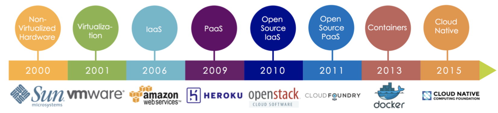

# Cloud Computing
[SUMMARY](SUMMARY.md)

[Technical Skill Development Recommendation - Cloud](https://w3-connections.ibm.com/forums/html/topic?id=6552b0a7-a559-4766-ae63-a9df2b839488&ps=)

技术
* openstack：IaaS云平台
* Docker：容器引擎，https://docs.docker.com/
* Kubernetes：容器云平台，https://kubernetes.io/docs/

Book：  
《云计算 从基础架构到最佳实践》 齐伟 刘冰 路士华 冯德林 著  
《云计算网络珠玑》 李俊武 著  
《云计算通俗讲义》 王良明 著  
《云计算-概念、技术与架构》 （美）埃尔 著  
《让云落地：云计算服务模式（SaaS、PaaS和IaaS）设计决策》 Michael J. Kavis 著  
《云计算基础架构及关键应用》 陆平 著
《云计算和大数据时代网络技术揭秘》徐立冰著
《云计算基础架构及关键应用》

kuberbetes
ansible
Docker
Microservices
Security Certification

[云计算十年发展](https://www.infoq.cn/article/ykDsBz7LFvFz-BQfs3IP)

云计算目标：对资源对管理（计算资源[CPU,内存]、网络资源[路由器，交换机，IP]、存储资源）

云计算本质：资源到架构到全面弹性(时间灵活性、空间灵活性)

云计算已多特指提供各类云端服务与组件的软硬一体化技术资源平台
大数据则是技术上处理大体量数据的方法论和实现，主要是一种技术体系——所以两者各自独立又可互相依存，比如各云计算厂商都陆续推出了云上大数据分析服务

计算资源分布式协作和统一管理： 网格计算理论(太学术)、云计算

云计算诞生及蓬勃发展的原因？
* 软硬件技术成熟：构建云计算平台的条件具备：
    * 超大规模数据中心建设
    * 高速互联网络
    * 计算资源虚拟化(Hypervisor) [闭源：VMware；开源：Xen, KVM]
    * 软件定义网络(SDN)
* 巨大的社会价值：
    * 使任意组织和个人得以站在巨人的肩膀上开展业务，避免重复造轮，极大提高了软件与服务构建各环节效率，加速了各类应用的架构和落地，而云端按需启用和随意扩展的资源弹性，也能够为企业节省巨大成本
* 伟大的商业模式：
    * 云计算的产品和服务形态非常适合新时代的 B 端需要，订阅制和 Pay-as-you-go 的计费方式大幅降低了客户的进入门槛，而技术基础设施架构方面的稳定性需要又带来了较高的客户粘性，再加上多租户高密度数据中心所能带来的规模效应，这些因素使得云计算能够成为一门好的生意，对应着一个极佳的 B 端商业模式。这三者缺一不可，共同促成了云计算的兴起与繁荣，也吸引了不计其数的业界精英投入其中，是为云计算取之不竭的源动力

A short history of cloud
  
