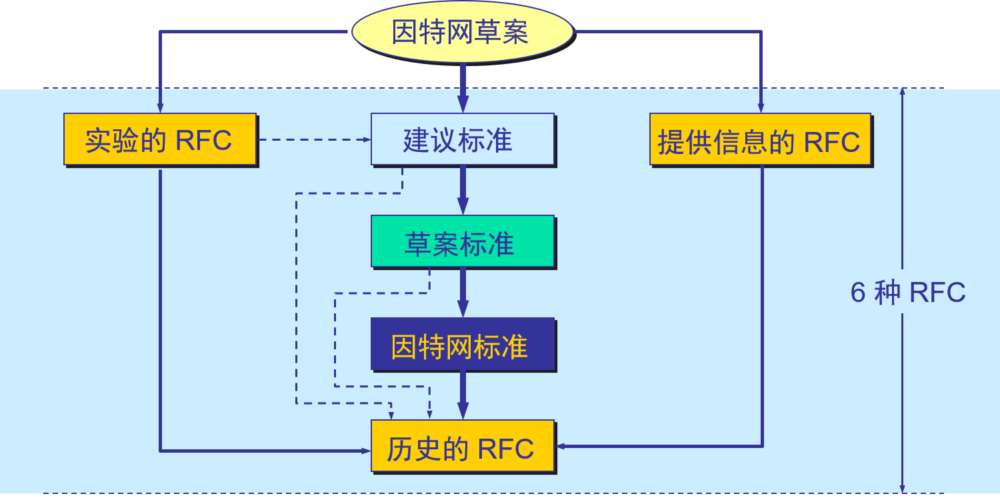

# 1.3.1 因特网概述-&gt;Internet

* **网络(network)：许多计算机连接在一起。**由若干**结点(node)**和连接这些结点的**链路(link)**组成；(网络中的node译为结点，数据结构的树(tree)中的node译为“节点”)。一般不超过100米，例如学校机房。**结点：**可以是计算机、集线器、交换机、路由器等；

* **互联网(internet)：许多网络**使用路由器**连接在一起**形成互联网。网络的网络(network of networks)

* **因特网(Internet)**

  * 起源于美国，前身为ARPNRT，第一个

  * 已成为世界上最大的国际性互联网

  * 连接在因特网上的计算机都称为**主机**(host)

* **网络与因特网之间的关系：**网络将计算机连在一起；互联网将许多网络连在一起

* internet和Internet的区别：

  | internet 互联网 | Internet 因特网 |
  | :--- | :--- |
  | internet是一个通用名词，泛指由多个计算机网络互联而成的网络。 | Internet是专用名词，它指当前全球最大的、开放的、由众多网络互联而成的特点计算机网络，采用**TCP/IP**协议族作为通信的规则，其前身是美国的**ARPANET**。 |

# 1.3.2 因特网发展的三个阶段

* 第一阶段：从单个网络 ARPANET 向互联网发展的过程\(大约1969年开始\)。

  * 计算机技术与通信技术相结合产生了第一个ARPANET网络 --&gt; **里程碑**
  * 1969: 分组交换 ；1975:互联网；1983 TCP/IP
  * 1983 年 TCP/IP 协议成为 ARPANET 上的标准协议， TCP/IP产生时没想过对外开放，所以产生很多安全问题。IPv6考虑了安全问题。人们把 1983 年作为因特网的诞生时间；

* 第二阶段的特点是建成了**三级结构的因特网**。（开始于1985）

  * 三级计算机网络，分为主干网、地区网和校园网（或企业网）。
  * 1985年开始美国国家基金会NSF着手构建三级计算机网络，即美国国家科学基金网NSFNET；

* 第三阶段的特点是逐渐形成了**多层次 ISP 结构的因特网\(大约1993年开始\)**。

  * 1993年美国政府不再自己运营而交给因特网服务提供商运营，出现了因特网服务提供者 ISP \(Internet Service Provider\)。各运营商的IP地址不是自己随便定义的，由因特网管理机构统一安排。所以根据IP可以知道是哪个国家哪个运营商的。

    

  * 根据提供服务的覆盖面积大小以及所拥有的  
    IP 地址数目的不同，ISP 也分成为不同的层次。  
    网站放在哪个地方的服务器看这个网站所服务的群体范围。

### 万维网的问世

* 因特网已经成为世界上规模最大和增长速率最快的计算机网络，没有人能够准确说出因特网究竟有多大。

* 因特网的迅猛发展始于 20 世纪 90 年代。由欧洲原子核研究组织 CERN 开发的**万维网** WWW \(World Wide Web\)被广泛使用在因特网上，大大方便了广大非网络专业人员对网络的使用，成为因特网的这种指数级增长的主要驱动力。

### 因特网的发展情况

|  | 网络数 | 主机数 | 用户数 | 管理机构数 |
| --- | --- | --- | --- | --- |
| 1980 | 10 | 102 | 102 | 100 |
| 1990 | 103 | 105 | 106 | 101 |
| 2000 | 105 | 107 | 108 | 102 |
| 2005 | 106 | 108 | 109 | 103 |

不同运营商之间访问速度会慢，所以网站经营商会将网站部署在不同运营商中，让用户能够选择属于自己的运营商来访问和下载。双线机房：该机房既连网通也连电信，这样两个不同ISP的用户互相访问时会加快访问速度。

# 1.3.3 因特网标准化工作

1. 1992年因特网不再由美国管辖，并形成国际性组织“因特网协会ISOC”：

   所有因特网标准都以RFC文档形成在Internet上发表:  
   因特网研究部：[http://www.isoc.org](http://www.isoc.org)  
   因特网工程部：[http://www.IAB.org](http://www.IAB.org)  
   

2. 制订因特网的正式标准要经过以下的四个阶段 ：

   1. 因特网草案\(Internet Draft\) ——在这个阶段还不是 RFC 文档。

   2. 建议标准\(Proposed Standard\) ——从这个阶段开始就成为 RFC 文档。

   3. 草案标准\(Draft Standard\)

   4. 因特网标准\(Internet Standard\) 

3. 各种RFC之间的关系  
       

### 1.3.4 因特网(Internet)的发展

① 进入 20 世纪 90 年代以后，以因特网为代表的计算机网络得到了飞速的发展。

② 已从最初的教育科研网络逐步发展成为商业网络。

③ 已成为仅次于全球电话网的世界第二大网络。

### 1.3.5 因特网的意义

① 因特网是自印刷术以来人类通信方面最大的变革。

② 现在人们的生活、工作、学习和交往都已离不开因特网。

