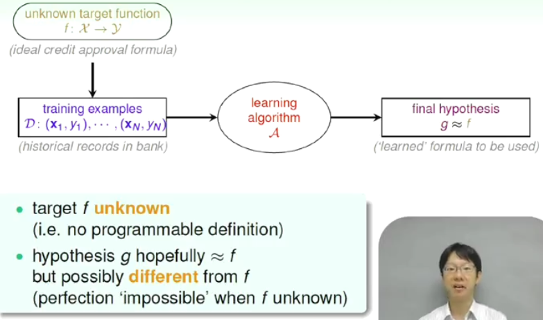
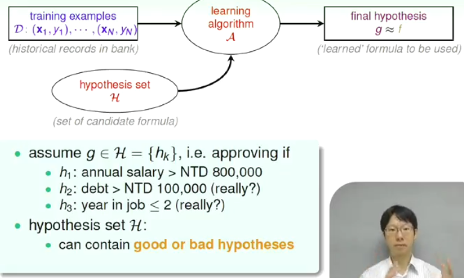

# 1.3 Components of machine learning 
定义： 利用Data和hypothesis set H得到g，使得g尽可能地接近真实的target f。 

举例：银行需要根据一系列信用卡申请者的个人资料，决定能否发放信用卡。在这里：

input： x (申请者信息)

output： y (要不要发信用卡)

data：训练数据，D={(x1,y1),(x2,y2),...,(xn,yn)}。银行中的历史数据，申请人资料，信用卡是否发放，信用卡使用情况等；

target f：x->y.理想的信用卡发放的condition，这个我们是不知道的。我们只有一系列的信用卡发放历史记录，以及他们是否正常还款等等的信息，需要从这些历史data中学出来这个target function；

hypothesis：我们假定的一些可能与真实的target f很接近的条件。譬如个人年薪>80W、债务>10W、或者工龄<2年等的情况下可以发放信用卡。这一系列的hypothesis构成了hypothesis set H；包含好的或坏的hypothesis.

g: x->y  学到的方程，现实学到的，g属于H，从H中选择最好的，即为g

Learning model = A and H (A=learning algorithms H=hypothesis)

