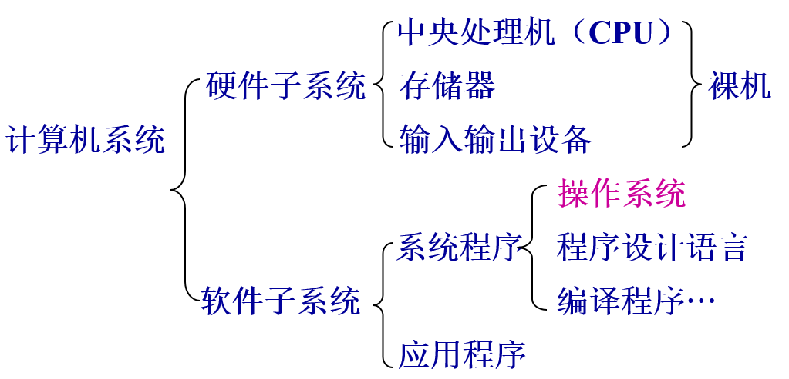
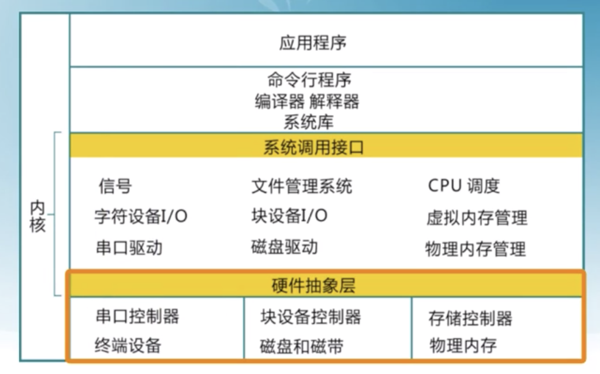
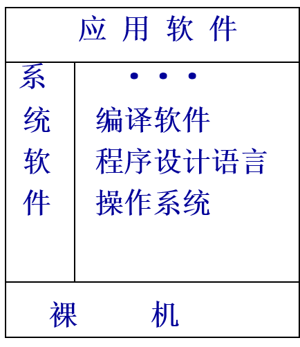
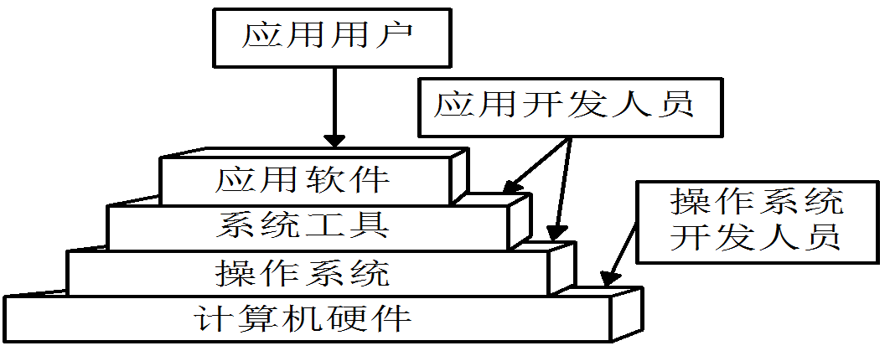
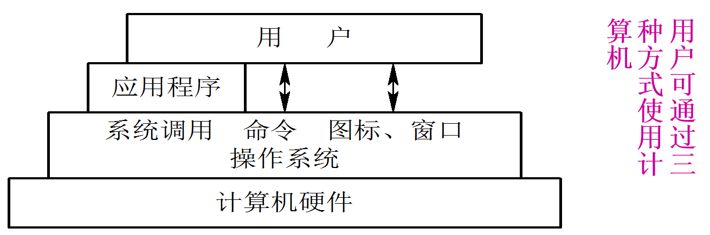
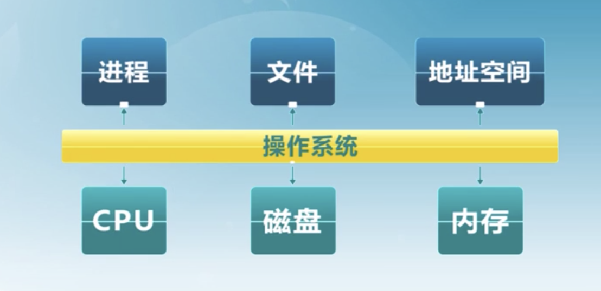
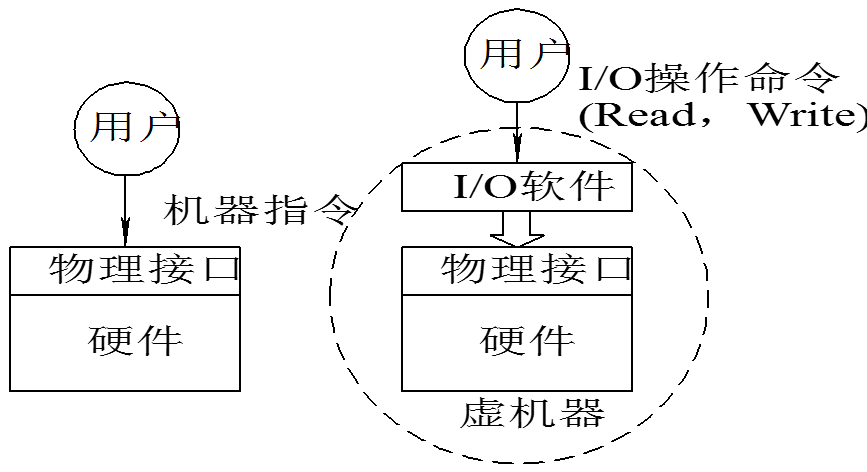

# 一、计算机系统的组成

### 1．计算机系统是由硬件和软件两部分组成。

* 硬件部分：构成了系统本身和用户作业赖以活动的物质基础和环境。

* 软件部分：
  * 系统软件：主要管理计算机系统本身的操作；
    * 操作系统：系统软件中最重要、最基本的就是操作系统。
      * shell——命令行接口
        * 通过键盘操纵
        * 方便用户进行命令输入
      * GUI ———图形用户接口
        * WIMP：window，Icon，Menu，Pointer
        * 直接操作和所见即所得
      * Kernel——操作系统内核
        * 执行各种资源管理等功能
    * 系统应用：
  * 应用软件: 主要解决用户的问题。

  

  
### 2．操作系统在计算机系统中的地位

* 计算机系统由硬件和软件组成。

* 操作系统在硬件基础上的第一层软件。

* 是其他软件和硬件之间的接口。
  

### 3．计算机系统的层次结构

* 操作系统的地位：是系统硬件之上的第一层软件，为其他软件提供单向支撑作用。

* 裸机：没有任何软件支持的计算机。

* 虚拟机：对裸机功能的首次扩充，把裸机改造成功能更强、使用更方便的机器。

# 二、操作系统的定义

操作系统是一个控制程序
* 一个系统软件
* 控制程序执行过程，防止错误和计算机的不当使用
* 执行用户程序，给用户程序提供各种服务
* 方便用户使用计算机系统

# 三、操作系统的目标

目前存在着多种类型的OS，不同类型的OS，其目标各有所侧重。通常在计算机硬件上配置的OS，其目标有以下几点：

1. 方便性：提供一个计算机用户与计算机硬件系统之间的接口，使计算机系统更易于使用。

2. 有效性：有效地控制和管理计算机系统中的各种硬件和软件资源，提高计算机系统资源利用率。

3. 可扩充性：随计算机网络，特别是Internet的发展，要求OS具有很好的可扩充性，适应计算机硬件、体系结构以及应用发展的要求。

4. 开放性 :指系统能遵循世界标准规范，特别是遵循开放系统互连\(OSI\)国际标准。凡遵循国际标准所开发的硬件和软件，均能彼此兼容，可方便地实现互连。

# 四、操作系统的作用

1. OS作为用户与计算机硬件系统之间的接口

  OS处于用户与计算机硬件系统之间，用户通过OS来使用计算机系统。或者说，用户在OS帮助下，能够方便、快捷、安全、可靠地操纵计算机硬件和运行自己的程序。
  

2. OS作为计算机系统资源的管理者

    计算机系统四类资源:

      * 处理器、存储器、I/O设备以及信息(数据和程序)。

   OS的主要功能也正是针对这四类资源进行有效的管理。
   

3. OS实现了对计算机资源的抽象

    * 裸机: 用户必须对物理接口的实现细节有充分的了解，该物理机器是难以使用的。

    * 为了方便用户使用I\/O设备，人们在裸机上覆盖上一层I\/O设备管理软件。

    - 用户所看到的机器将是一台比裸机功能更强、使用更方便的机器。这就是说，在裸机上铺设的I\/O软件隐藏了对I\/O设备操作的具体细节，向上提供了一组抽象的I/O设备。

    - 通常把覆盖了上述软件的机器称为扩充机器或虚机器。它向用户\(进程\)提供了一个对硬件操作的抽象模型，用户可利用抽象模型提供的接口使用计算机。

    - 为了方便用户使用文件系统，人们又在第一层软件上再覆盖上一层用于文件的管理软件。

    - OS是铺设在计算机硬件上的多层系统软件，它们不仅增强了系统的功能，而且还隐藏了对硬件操作的细节，由它们实现了对计算机硬件操作的多个层次的抽象。

# 五、推动操作系统发展的主要动力

1. 不断提高计算机资源的利用率

2. 方便用户

3. 器件的不断更新换代

4. 计算机体系结构的不断发展

