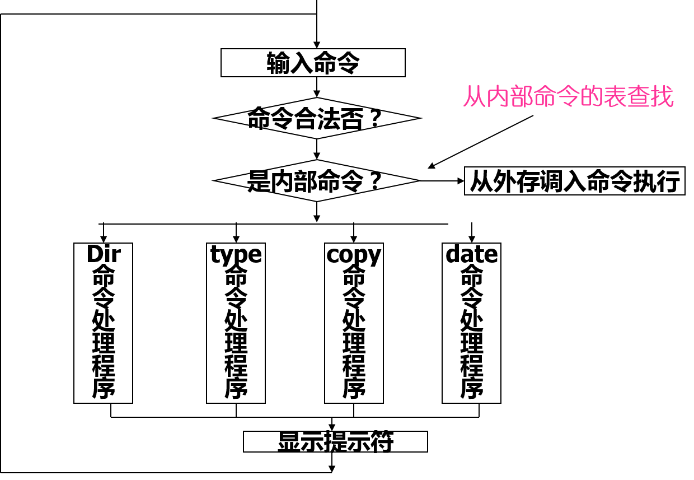

命令接口：OS向用户提供的 “用户与操作系统的接口”，该接口以命令形式呈现在用户面前，直接提供给用户在键盘终端上使用。

* 联机命令接口：分时、个人OS中，通过终端键入命令，以取得OS的服务，并控制自己作业的运行。该接口包括：

  * 一组联机命令（格式、类型）

  * 终端处理程序

  * 命令解释程序

* 脱机命令接口：用于批处理系统中，由作业控制语言JCL组成，对作业的控制和干预，事先写在作业说明上，然后将作业说明及作业提交系统，照说明上执行，若出现异常，则照说明上进行干预。

# 7.1.1 联机命令接口

## 命令格式

为了能向用户提供多方面的服务，OS通常向用户提供了众多的命令，命令格式和条数与实际的操作系统有关，命令格式分成：

* 命令行方式（一般形式）

  command arg1,arg2,…,\[option 1,…,option m\]

  * MS-DOS操作系统中的命令格式

    1、dir \[驱动器名\]\[\/p\]\[\/w\]

    2、type file1

    3、copy source target

    4、mkdir \[驱动器名\]\[\路径名\新目录名\]

* 批命令方式

  允许用户预先把一系列命令组织在一种称为批命令文件的文件中，一次建立，多次执行。如MS-DOS系统的 .BAT文件。

## 命令类型

根据联机命令的功能，可分为以下几类：

* 系统访问类:包括注册login,注销logout，常用于多用户系统中，以验证用户身份的合法性，从而保证整个系统的安全性。

* 磁盘操作类：包括format,diskcopy,backup,…，常用于微机OS中。

  * Format：磁盘格式化命令。

  * Diskcopy：复制整个软盘命令。

  * Diskcomp：软盘比较命令。

  * Backup：备份命令。

  * 硬盘上的文件复制到软盘上，RESTORE命令则完成相反的操作。

* 文件操作类：包括type,copy,cmp,rename,erase,…常用于微机OS中。

  * type： 将指定文件内容显示在屏幕上。

  * copy： 实现文件的拷贝。

  * comp： 对两个指定文件进行比较。

  * Rename：重新命名。

  * erase： 删除一个或一组文件。

* 目录操作类：包括md,dir,rd,tree,cd,…常用于微机OS中。

  * mkdir： 建立指定名字的新目录。

  * dir： 显示指定磁盘中的目录项。

  * rmdir： 删除子目录命令

  * tree： 显示指定盘上的所有目录路径及其层次关系。

  * chdir： 改变当前目录。

* 其它命令：包括输出重定向&gt;，输入重定向&lt;,批命令，管道连接“\|”，常用于微机OS中。

  \(1\) 输入输出重定向命令。OS中定义了两个标准I\/O设备。命令的输入取自键盘；而命令的输出送往显示终端。在命令中设置输出重定向“&gt;”符，其后接文件名或设备名，表示将命令的输出改向，送到指定文件或设备上。

  \(2\) 管道连接。指把第一条命令的输出信息作为第二条命令的输入信息；与此类推；格式为：

  Command1 \| Command2 \| … \| Commandn;

  \(3\) 过滤命令。

  例如，MS-DOS中用命令 ：find \/N “erase” \(路径名\)

# 7.1.2 终端处理程序

负责接收用户键入的终端命令，并将它显示在终端屏幕上，主要具有以下功能：

* 接收字符：接收用户从终端键入的字符，并将它传送给命令解释程序或用户进程，有两种方式来实现此功能（面向字符方式和面向行方式）。

  * 面向字符方式: 驱动程序只接收从终端打入的字符，并且不加修改地将它传送给用户程序。

  * 面向行方式: 终端处理程序将所接收的字符暂存在行缓冲中，并可对行内字符进行编辑。仅在收到行结束符后，才将一行正确的信息送命令解释程序。

* 字符缓冲：暂存用户键入的字符，该功能可采用两种方式（公用缓冲池方式，专用缓冲方式）。

  * 专用缓冲区方式: 系统为每个终端设置一个缓冲区，长度200字符左右。适合单用户微机或终端很少的多用户机，但利用率低。

  * 公用缓冲池方式：设置一个由多个缓冲区构成的公用缓冲池，缓冲区大小相同，利用率高。所有的空缓冲区链接成一个空缓冲区链（从终端输入数据），装有输入数据的缓冲区链接成一条输入链（向用户程序传送数据）。
    

* 回送显示：将用户每键入的一个字符送屏幕显示，此功能可由硬件实现，但多用软件更灵活。

* 屏幕编辑：方便用户对键入的字符进行编辑，提供了若干编辑键，如backspace,insert,­上下左右方向键,Pgup,Pgdn…。

* 特殊字符处理：提供了对中断字符，停止上卷字符，恢复上卷字符等特殊字符的识别和处理。

  * 中断字符: 程序在运行中出现异常情况时，用户可通过键入中断字符的办法来中止当前程序的运行。在许多系统中是利用Break或Delete或Ctrl+C键作为中断字符。

  * 停止上卷字符：用户键入此字符后，终端处理程序应使正在上卷的屏幕暂停上卷，以便用户仔细观察屏幕内容。在有的系统中，是利用Ctrl+S键来停止屏幕上卷的。

  * 恢复上卷字符：有的系统利用Ctrl+Q键使停止上卷的屏幕恢复上卷。

# 7.1.3 命令解释程序

 主要负责对用户输入的命令进行识别，然后去调用相应命令的处理程序，以完成请求的任务，位于OS的最高层。如：MS-DOS(COMMAND.COM),UNIX(SHELL).
- MS-DOS(COMMAND.COM)

    - 命令解释程序的作用

    - 命令解释程序的工作流程

    - 命令解释程序的组成

        - 常驻部分：中断服务子程序；如：int 20 正常退出。

        - 初始化部分：跟随常驻内存部分之后，还包括AUTOEXEC.BAT。

        - 暂存部分：主要是命令解释程序。包括：内部命令处理程序、批文件处理程序，以及装入和执行外部命令的程序。

### 命令解释程序的作用 
- 等待用户输入命令。命令解释程序获CPU控制权后，在屏幕上产生提示符，等待用户输入命令。

= 接收并识别命令。当用户输入完一条命令并以回车结束，终端处理程序就将该命令提交命令解释程序，并对此命令进行分析。若命令非法，则产生错误信息。否则转相应的命令处理程序。

- 执行相应的命令处理程序。转到相应的命令处理程序入口地址，再把控制权交给该处理程序去执行。（对内部命令，其命令处理程序就含在解释程序内，所以由解释程序直接执行）。

- 处理结果送屏幕上显示。并将处理结果送屏幕上显示，或显示某些出错信息。

### 命令解释程序的工作流程 

