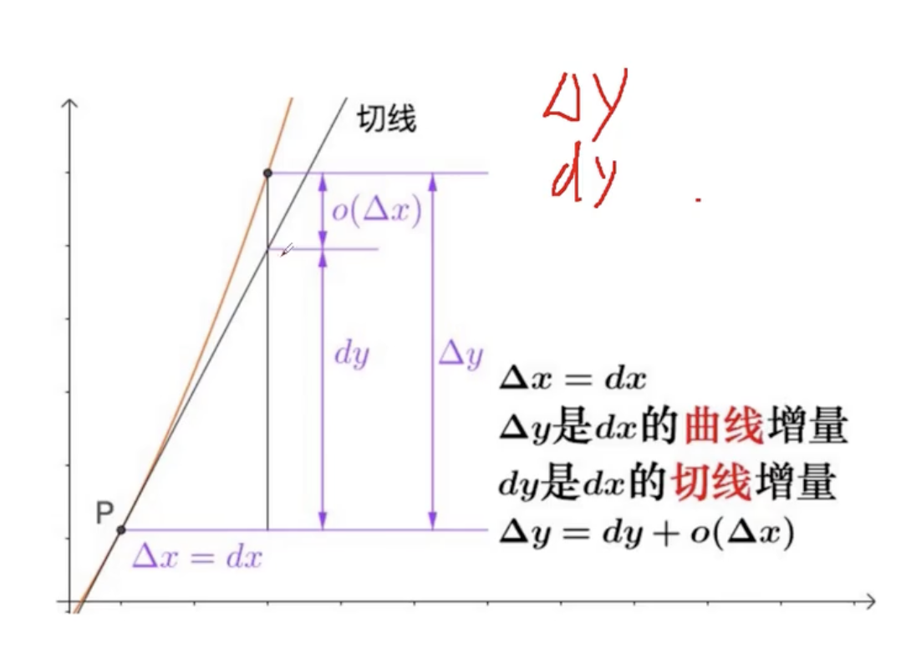

机器学习数学基础：
https://www.bilibili.com/video/BV1s14y1D7zD?p=21&spm_id_from=pageDriver&vd_source=50ac7e35d44afea54a236dfa228f618f
# Mathematics for Computer Science

* 导数(微商)：
	* 数学表示：$f'(x)=\frac{dy}{dx}=\lim\limits_{\Delta\,x\to0}\frac{\Delta\,y}{\Delta\,x}=\lim\limits_{\Delta\,x\to0}\frac{\Delta\,y}{\Delta\,x}=\sum_{i=1}^nf(\xi_i)\Delta\,x_i$  ;$f'(x_0)=\frac{dy}{dx}|_{x=x_0}=y'|_{x=x_0}=\frac{df(x)}{dx}|_{x=x_0}=\lim\limits_{\Delta\,x\to0}\frac{\Delta\,y}{\Delta\,x}=\lim\limits_{\Delta\,x\to0}\frac{f(x_0+\Delta\,x)-f(x_0)}{\Delta\,x}$
	* 几何意义：函数在某一点上的瞬时变化率，即切线的斜率。dy,dx组成的微分直角三角形其斜边就是切线，切线的斜率是导数
	* 物理意义：一个函数在某一点的导数描述了这个函数在这一点附近的变化率。
* 偏导数：数学表示：
	* $z_x|_{x=x_0y=y_0}=f_x(x_0,y_0)=\frac{\partial\,z}{\partial\,x}|_{x=x_0y=y_0}=\frac{\partial\,f}{\partial\,x}|_{x=x_0y=y_0}$ ;几何意义：在点$M_0$处切线$M_0T_x$对x轴的斜率
	* $z_y|_{x=x_0y=y_0}=f_y(x_0,y_0)=\frac{\partial\,z}{\partial\,y}|_{x=x_0y=y_0}=\frac{\partial\,f}{\partial\,y}|_{x=x_0y=y_0}$;几何意义：在点$M_0$处切线$M_0T_y$对y轴的斜率
	* 应用：机器学习中损失函数进行优化，沿着x轴y轴都可以进行优化，沿x轴目标会变，沿y轴目标也会变，现在想要目标变小需要求出沿x轴走多少沿y轴走多少，就需要对x，y求偏导
* 方向导数：
	* 函数$z=f(x,y)$在一点$P(x,y)$沿任一方向$l$的方向导数为$\frac{\partial\,f}{\partial\,l}=\lim\limits_{\rho\to0}\frac{f(x+\Delta\,x,y+\Delta\,y)-f(x,y)}{\rho}=\frac{\partial\,f}{\partial\,x}cos\phi+\frac{\partial\,f}{\partial\,y}sin\phi=\{\frac{\partial\,f}{\partial\,x},\frac{\partial\,f}{\partial\,y}\}*\{cos\phi,sin\phi\}$, $\phi$ 为x轴到$l$的角度
* **梯度**：
	* 机器学习中通常不是直接求解，有时候求不出解，只能通过**优化**一步步逼近最优点，不同点点梯度变化都不一样，对每个梯度进行小步优化，每次优化的方向不一样，朝梯度下降的方向走。
	* $grad\,f(x,y)=\frac{\partial\,f}{\partial\,x}\,\overrightarrow{i}+\frac{\partial\,f}{\partial\,y}\,\overrightarrow{j}$
	* 函数z=f(x,y)在平面域内有连续的一阶偏导数，对其中每一个点P(x,y)都有向量$\frac{\partial\,f}{\partial\,x}\,\overrightarrow{i}+\frac{\partial\,f}{\partial\,y}\,\overrightarrow{j}$, 则其称为函数在点P的梯度。
	* 梯度与方向导数的关系是$\frac{\partial\,f}{\partial\,l}=grad\,f(x,y)*\overrightarrow{e}$，其中$\overrightarrow{e}=cos\phi*\overrightarrow{i}+sin\phi*\overrightarrow{j}$ , 为$l$ 方向上的单位向量
	* 方向导数各个方向都有，但是梯度是比较唯一的
	* 下山最快的方向，则找梯度值最大的方向
	* $\frac{\partial\,f}{\partial\,l}=\frac{\partial\,f}{\partial\,x}cos\phi+\frac{\partial\,f}{\partial\,y}sin\phi=\{\frac{\partial\,f}{\partial\,x},\frac{\partial\,f}{\partial\,y}\}*\{cos\phi,sin\phi\}=grad\,f(x,y)*\overrightarrow{e}=grad\,f(x,y)|cos\theta$ , $\theta=(grad\,f(x,y)\overrightarrow{e})$
	* 只有当$cos(grad\,f(x,y),\overrightarrow{e})=1$ , $\frac{\partial\,f}{\partial\,l}$ 才有最大值
	* 函数在某一点的梯度是一个向量，它的方向与方向导数最大值取得的方向一致，其大小正好是最大的方向导数
	* 梯度为等高线上的法向量
	* 梯度下降：通常优化是找最小值，所以要求梯度下降，即梯度上升的反方向
* 微分：
	* 数学表示：dy=df(x)=f'(x)dx ，函数在某一点的微小变化量，它的值取决于x的微小变化量dx
	* 几何意义：对函数进行导数运算，表示函数在某一点的瞬时(微小)变化量
* 微积分：把所有微分积起来
	* 数学表示：$\int_a^b\,f(x)dx$ ,dx 表示对自变量x的积分
		* $\int\,f(x)dx=\lim\limits_{\lambda\to0}\sum_{i=1}^nf(\xi_i)\Delta\,x_i$
	* 几何意义：对函数进行反导数运算，描述函数在一个区间内的总变化量
	* 物理意义：函数下方与x轴之间的面积或体积
	* 定积分：$\int_a^bf(x)dx=\lim\limits_{\lambda\to0}\sum_{i=1}^nf(\xi_i)\Delta\,x_i$
* 第一中值定理(积分中值定理)：$\int_a^bf(x)dx=f(\xi)(b-a)$
* 微分中值定理：$F'(\xi)(b-a)=F(b)-F(a)$
* 牛顿莱布尼兹公式：$\int_a^bf(x)dx=F(b)-F(a)$
* 泰勒公式：用简单熟悉的多项式来近似代替复杂的函数；以直代曲，一点一世界
	* 一阶导数只帮我们定位了下一个点是上升还是下降对之后的趋势就很把控了
	* 二阶导数描述了一阶导接下来变化的趋势 .....
	* 用下一阶导数描述前一阶导数的变化趋势
	* 阶数越高增长速度越快，越高次项在越偏右侧影响越大，越低次项在越偏左侧影响越大
	* 阶乘：
	* 泰勒多项式：$P_n(x)=f(x_0)+f'(x_0)(x-x_0)+\frac{f''(x_0)}{2!}(x-x_0)^2+...+\frac{f^ (n)(x_0)}{n!}(x-x_0^n)$ 称为f(x)在$x_0$关于$(x-x_0)$的n阶泰勒多项式
	* 麦克劳林公式：
	* 计算机中是使用逼近方式求sinx的
* 拉格朗日乘子法：求约束条件下的极值
	* 求极值：求偏导； 
* 方程与矩阵的关系：

* 矩阵的秩：
	* 如果一个矩阵的秩为3，表示所有的行向量或列向量中的极大线性无关组有3个是线性无关的。
	* 矩阵中最大不相关向量的个数就是秩
* 矩阵的特征向量：矩阵中信息的主要描述工具，特征向量描述方向。一个矩阵不止一个特征向量。应用于降维操作
* 矩阵的特征值：矩阵中信息的主要描述工具，特征值描述这个方向的重要程度。应用于降维，特征值大的就是主要信息，可用于提取有价值信息，从而做到图像压缩。
* SVD推导
* 离散型随机变量：概率分布；连续型随机变量：概率密度函数
* 分布函数：F(x), 描述随机变量取值的概率分布的函数,分布函数可用来计算随机变量在某一取值范围内的概率
* 概率密度：f(x), 描述连续随机变量在某一取值范围内的概率分布的函数
* 联合分布函数: f(x,y)
* 联合概率密度: 
* 密度函数：关于x的函数
* 似然函数：关于$\theta$ 的函数，找历史数据的规律。描述在已知随机变量X的观察数据x1,x2,...,xn的情况下，参数$\theta$ 的可能性大函数，它是在给定数据的情况下，参数$\theta$ 的函数，表示为L($\theta$ |x1,x2,...xn)
* 极大似然估计
* N重伯努利试验： 事件A发生k次的概率为 $P_n(k)=C_n^kp^kq^(n-k)$ 其中q=1-p，每次试验中A发生的概率为p
* 联合分布：多个随机变量的情况下，描述这些随机变量的概率分布。它给出每个可能的随机变量组合的概率
* 边缘分布: 联合分布的情况下，描述随机变量X和Y在单个变量取值时的概率分布，可以通过将联合分布函数关于另一个变量取极值来得到。
* 期望：描述随机变量取值的平均值 $E[X]$
* 方差：描述随机变量取值的分散程度，偏离期望的程度
* 马尔可夫不等式：用于估计随机变量的取值范围, 它表明对于任意随机变量X和任意正数$\lambda$, 有$P(X>=\lambda)<=\frac{E[X]}{\lambda}$
* 切比雪夫不等式：用于估计随机变量的取值范围，它表明对于任意随机变量X和任意正数$\epsilon$,有$P(|X-E[X]|>=\epsilon)<=\frac{Var[X]}{\epsilon^2}$
* 后验概率估计
* 正态分布，二项式分布，泊松分布，均匀分布，卡方分布，beta分布
* 核函数

编程的基础是计算机科学，计算机科学的基础是数学

* Linear Algebra
    * MIT 18.06  Linear Algebra, Spring 2005: [MIT](https://ocw.mit.edu/courses/mathematics/18-06sc-linear-algebra-fall-2011/);[bilibili](https://www.bilibili.com/video/av15463995?from=search&seid=13397969681830042332) ;[网易公开课](http://open.163.com/special/opencourse/daishu.html) ;[Youtube](https://www.youtube.com/watch?v=ZK3O402wf1c&list=PLE7DDD91010BC51F8)
    * [Linear Algebra: spring 2010](https://ocw.mit.edu/courses/mathematics/18-06-linear-algebra-spring-2010/index.htm)
    * [Immersive linear algebra](http://immersivemath.com/ila/index.html)
    
    * [MIT Linear Algebra: spring 2010](https://ocw.mit.edu/courses/mathematics/18-06-linear-algebra-spring-2010/index.htm)
* Probability and Information Theory
* Numerical Computation

计算机中的数学

* [MIT 6.042 Mathematics for Computer Science](http://courses.csail.mit.edu/6.042/spring18/) 

Book
* Deep Learning by MIT: [official website](http://www.deeplearningbook.org); [中文](https://github.com/exacity/deeplearningbook-chinese); [英文](https://github.com/daviddao/deep-learning-book)
* 计算机科学的数学 
* 具体数学 第2版
* 离散数学及其应用 第6版
* 线性代数及应用
* 程序员的数学1 2 3 

[如何自学MIT的应用数学课程？这里有个参照给你](https://mbd.baidu.com/newspage/data/landingsuper?context=%7B%22nid%22%3A%22news_9318032385943426035%22%7D&n_type=0&p_from=1)

video

* 数学地图：[bilibili](https://www.bilibili.com/video/av9208524?from=search&seid=15485865071546240272)，[youtube](https://www.youtube.com/watch?v=OmJ-4B-mS-Y&list=PLOYRlicwLG3St5aEm02ncj-sPDJwmojIS&index=2)
* 物理地图：[bilibili](https://www.bilibili.com/video/av9206164?from=search&seid=8874245310149466695)，[youtube](https://www.youtube.com/watch?v=ZihywtixUYo&list=PLOYRlicwLG3St5aEm02ncj-sPDJwmojIS&index=1)

Content

微积分——我的微积分很好，所以我只需要复习笔记，然后完成单变量和多变量微积分相关课程的考试即可。资料如下： 18.01：https://ocw.mit.edu/courses/mathematics/18-01sc-single-variable-calculus-fall-2010/18.02：https://ocw.mit.edu/courses/mathematics/18-02sc-multivariable-calculus-fall-2010/

微分方程——虽然我本科期间学过微分方程，但是那时没真正集中注意力好好学。所以这门课我要好好夯实基础。18.03：https://ocw.mit.edu/courses/mathematics/18-03-differential-equations-spring-2010/

线性代数——我的线性代数也比较好，所以这门课主要也是复习和参加考试。18.06：https://ocw.mit.edu/courses/mathematics/18-06sc-linear-algebra-fall-2011/

复变函数及其应用——这是一门必修核心课，包含了复代数和函数、解析性、围道积分、柯西定理、奇异性、泰勒－罗朗级数（Taylor and Laurent series）、残差、积分计算、多值函数、二维位势论、傅立叶分析和拉普拉斯变换。听起来很有趣。18.04：https://ocw.mit.edu/courses/mathematics/18-04-complex-variables-with-applications-fall-2003/

离散应用数学原理——我从来没有学过离散数学。我之前自学编程和算法时缺乏一种强烈的数学直觉，希望通过这门课能够开发出来。18.200：https://ocw.mit.edu/courses/mathematics/18-310-principles-of-discrete-applied-mathematics-fall-2013/

连续体应用数学原理（Continuum Applied Mathematics）——这门课涵盖了连续体应用数学中的基本概念，包括交通流、流体、弹性、颗粒流等等的应用。看起来非常有用，而且也是一门必修课，所以我决定参加！18.300：https://ocw.mit.edu/courses/mathematics/18-311-principles-of-applied-mathematics-spring-2014/限选课除了核心课，课程还提供给学生两组可选课：1. 组合数学、计算机科学、概率和统计；2. 数值分析、物理数学、非线性动力学。要求必须选择4门课，其中每组至少一门课。鉴于我已经从第1组的一些课程中获得了一定的计算背景，我打算从中间划分。我暂时计划完成的课程如下：第一组：

概率论18.650：https://ocw.mit.edu/courses/mathematics/18-650-statistics-for-applications-fall-2016/

统计学18.650：https://ocw.mit.edu/courses/mathematics/18-650-statistics-for-applications-fall-2016/

偏微分方程18.303：https://ocw.mit.edu/courses/mathematics/18-303-linear-partial-differential-equations-fall-2006/

数值分析18.330：https://ocw.mit.edu/courses/mathematics/18-330-introduction-to-numerical-analysis-spring-2012/

好了，这就是我的计划。这个夏天我会在完成研究奖学金的同时积极地见教授和参加旁听课，但我不打算在规定的时间里硬塞这个计划。我十分期待探索和理解数学，我计划在这里分享我的更新、学习过程和直觉，它们也许会转变成一些有趣的东西！或许在这之后，我还会尝试纯粹数学课程：http://math.mit.edu/academics/undergrad/major/course18/pure.php以上，便是我的数学学习计划了，希望能对大家有所帮助！

原文链接：https://www.harshsikka.me/self-studying-the-mit-applied-math-curriculum/
