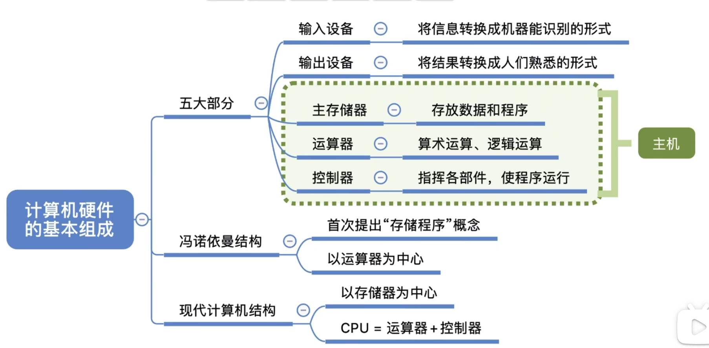
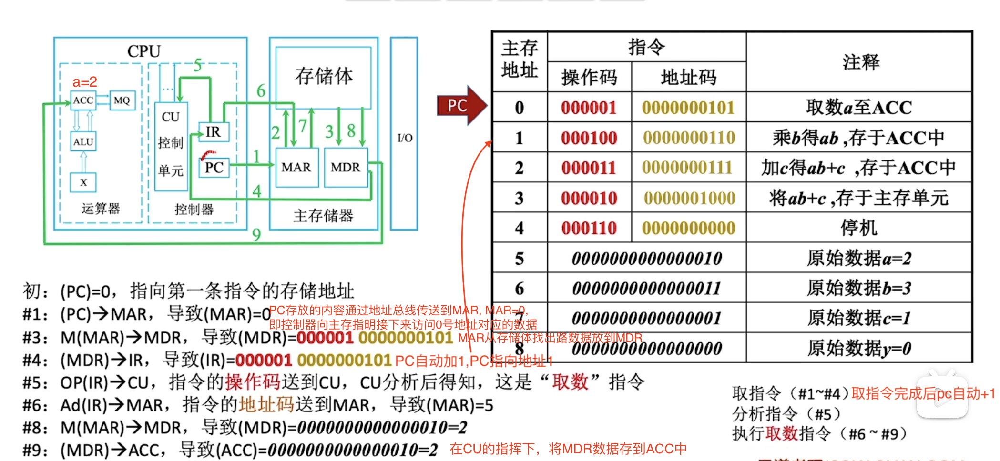

# 计算机系统
Computer System
* Computer System Organization
	* In general terms, the architecture of a computer system can be considered as a catalogue of tools or attributes that are visible to the user such as instruction sets, number of bits used for data, addressing techniques, etc.
	* build it using design; "how to do"; method；实现计算机体系结构所体现的属性，具体指令的实现；如何用硬件实现所定义的接口(如何实现乘法指令)
* Computer System Architecture
	* Whereas, Organization of a computer system defines the way system is structured so that all those catalogued tools can be used. The significant components of Computer organization are ALU, CPU, memory and memory organization.
	* abstract--> logical thinking; design; "what to do"；讨论指令系统，数据类型，熏制技术，I/O机理的设计，如何设计硬件与软件之间的接口(有无乘法指令)

| Computer Architecture                                                                                                 | Computer Organization                                                                                         |
| :-------------------------------------------------------------------------------------------------------------------- | :------------------------------------------------------------------------------------------------------------ |
| Computer Architecture is concerned with the way hardware components are connected together to form a computer system. | Computer Organization is concerned with the structure and behaviour of a computer system as seen by the user. |
| It acts as the interface between hardware and software.                                                               | It deals with the components of a connection in a system.                                                     |
| Computer Architecture helps us to understand the functionalities of a system.                                         | Computer Organization tells us how exactly all the units in the system are arranged and interconnected.       |
| A programmer can view architecture in terms of instructions, addressing modes and registers.                          | Whereas Organization expresses the realization of architecture.                                               |
| While designing a computer system architecture is considered first.                                                   | An organization is done on the basis of architecture.                                                         |
| Computer Architecture deals with high-level design issues.                                                            | Computer Organization deals with low-level design issues.                                                     |
| Architecture involves Logic (Instruction sets, Addressing modes, Data types, Cache optimization)                      | Organization involves Physical Components (Circuit design, Adders, Signals, Peripherals)                      |

## 计算机三大基本原则

软件：即程序的基础。
指令：控制计算机进行输入、运算、输出的命令。
把向计算机发出的指令一条条列出来，就得到了程序。

在程序设计中，会为一组指令赋予一个名字，可以称之为 函数、语句、方法、子例程、子程序。

程序中数据分为两类，一类是作为指令执行对象的输入数据，一类是从指令的执行结果得到的输出数据。
在编程时程序员会为数据赋予名字，称其为 变量。

用数字表示所有信息，是一个很具有代表性的计算机式处理方法，这一点正是和人类的思维习惯最不一样的地方。

计算机内部先把文字转换尘封相应的数字再处理，这样的数字叫“字符编码”，总之计算机会把什么都用数字来表示。

# 1. 计算机系统组成

^f31a1b

Computer System Organization

计算机系统 = 计算机硬件(物理系统) + 计算机软件 (逻辑系统)
* 硬件：计算机硬件由大量的IC(Integrated Circuit, 集成电路)组成，每块IC上带有许多引脚。这些引脚由的用于输入有的用于输出。IC会在其内部对外部输入对信息进行运算，并把运算结果输出到外部。决定了计算机的瓶颈天花板 
	* 主机/机箱：系统单元
		* CPU，内存，电源，声卡，显卡，调制解调器，网卡，存储器
		* 主板
			* 桥接器：桥接器：主機板上面溝通各部元件的晶片組，其設計優劣，就會影響效能。
			* 北桥：
			* 南桥：负责连接速度较慢的装置介面，包括硬盘、USB、网卡等
			* 总线
	* 输入单元：键盘，鼠标，读卡器，扫描仪，手写板，触控屏幕
	* 输出单元：屏幕，打印机
* 软件： software = Tested programs + documentation，决定了把硬件的性能发挥到什么程度
	* 系统软件：管理整个计算机系统；System software, operates computer hardware, provide platform fpr application software to run
		* 操作系统：(DOS, Windows, UNIX, Linux等)；管理整个计算机系统，监视服务，使系统资源得到合理调度，高效运行。批处理系统，分时系统，实时系统;
		* 数据库管理系统DBMS,
		* 标准程序库：编程时使用的库函数
		* 网络软件：实现tcp/ip协议的软件模块
		* 语言处理系统：编译程序，汇编程序；将汇编语言翻译成机器语言的汇编程序，将高级语言翻译成机器语言的编译程序
		* 服务程序：(调试代码的程序)，诊断程序，调试程序，连接程序
	* 应用软件：按任务需要编制的各种程序；如微信，QQ，Application software.

### 1.1 计算机硬件组成

早期冯诺依曼机结构：
1946年第一台电子管计算机ENIAC，虽然计算机执行计算速度很快，但是每次执行什么指令都需要程序员手动接线来告诉计算机，ENIAC的速度被手工操作的速度抵消。
为了解决这个问题，冯诺基曼提出“存储程序”的概念，将指令以二进制代码的形式事先输入计算机的主存储器，然后按其在存储器中的首地址执行程序的第一条指令，以后按该程序的规定顺序执行其他指令 ，直至程序执行结束。
由此出现第一台采用冯诺依曼结构的计算机EDVAC诞生了(Electronic Discerte Variable Automatic Computer)。

现代计算机结构: 
由于运算器和控制器之间的逻辑关系十分紧密，所以在大规模集成电路工艺出现后，这两个部件通常被集成在同一芯片，即CPU

[现代计算机硬件组成](./现代计算机硬件组成.md)

## 1.2 计算机系统层次结构

^a8d5b5

传统意义上的机器只能识别机器语言

## 1.3 三种级别语言

**机器码&汇编语言&高级语言**

计算机上执行的代码表示为二进制0和1组成的串，被称作机器码，每种计算机只能执行一种特定的**机器码**

人类可读的机器码叫做**汇编语言**

能在类型完全不同的计算机上运行，与底层计算机体系结构几乎没关系的代码叫**高级语言**，在执行之前，高级语言程序必须先被编译为计算机的本地机器码。

# 2. 计算机发展历程

摩尔定律

## 2.1 硬件发展

第一代：电子管计算机
1946-1957：电子管作为开关元件，使用机器语言，可以存储信息，输入输出很慢。
最初计算机发明是解决第二次世界大战时美国国防部弹道研究室开发新武器射程和检测模拟元算表的难题。
虽然当时电子管计算机耗电高，占地面积大，使用不方便，但比当时任何机械计算机快得多，每秒5000多次加法运算。

第二代：晶体管计算机

1958-1964: 晶体管替代电子管，采用磁芯存储器，汇编语言取代机器语言

1947年在贝尔实验室用半导体硅作为基片，制成第一个晶体管，它的体积小，低耗电，载流子高速运行的特点，使真空管望尘莫及。

第三代：中小规模集成电路计算机

1965-1971: 中小规模集成电路
1972-1977：大规模集成电路 （采用集成度很高的电路，出现了微处理器等）
1977-now：超大规模集成电路（采用集成度很高的电路，出现了微处理器等）

光刻技术和设备成熟

冯诺依曼机结构---> 现代计算机结构

1.3.1 机械计算机

1.3.2 机电式计算机

1.3.3 早期的电子计算机

1.3.4 微机和PC革命

1.3.5 摩尔定律和进步的历程

**乱序执行**：改变指令的执行顺序提高计算机的速度。

1.3.6 存储技术发展

覆盖着电容的旋转的磁鼓 --> 阴极射线管 --> 铁氧体磁芯存储器 --> 磁盘 --> 光存储器(DVD等)

成本越来越低，存储的数据量和传输性能越来越高，

1.3.7 普适计算：计算是无处不在的

1.3.8 多媒体计算机: 处理音频，视频。需要很大的存储容量以及完成大量简单重复操作的事实处理声音样本的图像像素的能力。

## 2.2 软件发展

# 3. 计算机系统体系结构
Computer System Architecture
讨论指令系统，数据类型，熏制技术，I/O机理的设计

Computer Architecture: design of computers

* ISA: Instruction Set Architecture
* HSA: Hardware System Architecture

Computer Architecture classification

* classification 1
  * Von Newmann Architecture: CPU, I/O, memory
  * Non-Von Newmann Architecture
    * Harvard Architecture
    * MOdified Harvard Architecture
* classification
  * SISD
  * SIMD
  * MISD
  * MIMD

## 1.1 什么是计算机体系结构

**体系结构**：
* **指令集体系结构**(**ISA**)：描述**程序员**看到的计算机的**抽象视图**，并定义汇编语言和编程模型，之所以说它是抽象的，是因为它没有考虑计算机的实现
* **微体系结构**：描述一种指令集体系结构的实现方式，微体系结构关注计算机的**内部设计**
* **系统体系结构**：关注包括处理器、存储器、总线和外设在内的整个系统。

**信息**：即**程序**和**数据**，保存在存储器中，为实现不同目的，计算机使用不同类型的存储器，如cache，主存(内存)，辅存等多个存储层次，大多数处理器在CPU内集成片上cache。

**Cache**(2M)是存放常用数据的高速、专业存储器，**主存**(2G,8G,16G)中存放了大量工作数据，**辅存**(500G,1T)指磁盘和CD-ROM、能存海量数据。

可编程计算机接收两种类型的输入：要处理的数据，以及要如何处理输入数据的程序。程序不过是计算机所执行的完成给定任务的操作序列。

数字计算机的结构：分为两部分：CPU和存储器系统，cpu读程序并完成指定操作，存储器系统保存两类信息：程序，程序处理或产生 的数据。

寄存器是CPU内部用来存放数据的存储单元

**计算机指令**：有上百种不同指令。6条基本指令

* MOVE A,B :将B的值复制到A
* LOAD A,B ：将存储单元B的值复制到寄存器A中
* STORE A,B ：将寄存器B的值复制到存储单元A中
* ADD A,B ：A与B相加，结果保存到A中
* TEST A ：测试A的值是否为0
* BEQ Z ：若最后一次测试结果为TRUE，执行地址Z处的代码，否则继续执行。

## 1.2 体系结构和组成

计算机体系结构含有结构(structure)的意思，描述了一些与计算机组成方式有关的内容。之所以定义计算机体系结构，是因为不同的用户会从完全不同的角度看待计算机。**计算机体系结构**通常被认为是**程序员视角中的计算机**。程序员看到的是计算机的抽象视图，计算机的实际硬件和实现被隐藏起来了，这个抽象视图现在通常被称作**指令集体系结构**(ISA, instruction set architecture)。

计算机组成表示其体系结构的**具体实现**，计算机组成是计算机体系结构的实例化。即**抽象变为具体**。

用“**体系结构(System Architecture)**”代表计算机的抽象指令集体系结构(它的指令集)，用“**组成**”代表计算机的实际硬件实现。

**寄存器**：存放**一个单位**的数据或字数据的存储单元。寄存器通常用它所保存数据的位数来描述。典型的有8位，16位，32位，64位

寄存器与存储器中的字存储单元无本质区别。二者的实际差别在于寄存器**位于CPU内**，它的**访问速度**远快于访问CPU外的存储器。

**时钟**：绝大多数数字电子电路都带有一个时钟，用以生成连续的间隔固定的**电脉冲流**，之所以成为时钟，是因为可用这些电脉冲来计时或确定计算机内所有事件的顺序，如处理器可能会在每一个时钟脉冲到来时执行一条新指令。
时钟提供了脉冲流，所以内部操作都在时钟脉冲的触发下进行，时钟频率是决定计算机速度的一个因素。

RISC和CISC

RISC(精简指令集计算机)体系结构

* 设计策略：是使用少量的指令完成最少的简单操作
* 缺点：程序设计更难，复杂指令需要用简单指令模拟
* 应用：ARM处理器

CISC(复杂指令集)体系结构

* 设计策略：使用大量的指令，包括复杂指令
* 优点：程序设计更容易，每个简单或复杂的任务都有一条对应的指令，不需要写一大堆复杂的指令去完成任务。
* 缺点：指令集的复杂性使CPU和控制单元电路非常复杂
* 应用：Intel处理器

# 4 计算机性能指标
Computer Performance

计算机性能好坏取决于软硬件功能的总和，硬件决定了计算机的瓶颈天花板 ，软件决定了把硬件的性能发挥到什么程度。

与**计算机性能**相关：CPU， 内存，cache，外部设备
https://www.bilibili.com/video/BV1ps4y1d73V?p=7&spm_id_from=pageDriver&vd_source=50ac7e35d44afea54a236dfa228f618f

存储器性能指标
CPU性能指标
系统整体性能指标

吞吐量
响应时间
利用率
总线宽度
存储器带宽
CPU时钟周期
主频
cpu执行时间
	主频
	外频
	信频
	基本字长
	地址总线宽度
	数据总线宽度
CPI
MIPS
FLOPS
硬件指标
	处理机字长|机器字长
	存储容量
	运算速度

## 常用计算单位

    容量
		bit, byte; GB为10进位, GiB为2进位
	速度
		Hz：CPU运算速度，Hz: 秒分之一
		Mbps：网络每秒传输的字节数 Mbps = Mbits per second，

cpu执行时间

1. 不同的微指令集會導致CPU工作效率的優劣
2. CPU时脉：CPU每秒钟可以进行的工作次数。Intel的 i7-4790 CPU時脈為3.6GHz， 表示這顆CPU在一秒內可以進行3.6x109次工作，每次工作都可以進行少數的指令運作。不同的CPU之間不能單純的以時脈來判斷運算效能喔！這是因為每顆CPU的微指令集不相同，架構也不見得一樣。所以，時脈目前僅能用來比較同款CPU的速度！

https://www.youtube.com/watch?v=L9X7XXfHYdU&list=PLxCzCOWd7aiHMonh3G6QNKq53C6oNXGrX

https://www.youtube.com/watch?v=6_PHIL4LZEU&list=PLBlnK6fEyqRgLLlzdgiTUKULKJPYc0A4q&index=3

计算机硬件如何识别数据：
计算机硬件唯一能识别的数据：二进制0/1；用高低电平分别表示0/1
数字 文字 图像如何用二进制表示
CPU如何对二进制数进行加减乘除
如何存储这些二进制数
如何从内存中取出想要的数据
cpu如何识别和执行我们写的程序

\1. 如何进行输入
\2. 如何获取输出
\3. 进行怎样的运算才能从输入得到输出

