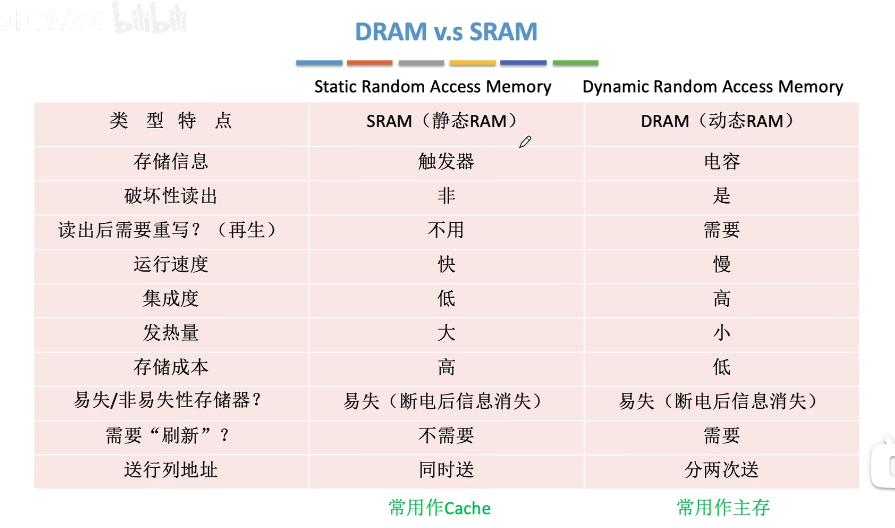

现代计算机基于冯诺依曼结构的思想设计的。

## 计算机工作过程

计算机硬件之间的配合

# 1. 中央处理器 cpu
【电脑DIY】从萌新入门到开窍——cpu篇：
https://zhuanlan.zhihu.com/p/449476618

CPU： Central Processing Unit，CPU为一个具有特定功能的晶片，里面含有微指令集。
CPU读取的资料都是从内存来的。内存内的资料从输入单元传输来的，CPU处理完的资料也必须先写回内存，最后从内存输到输出单元。

多核心：則是在一顆CPU封裝當中嵌入了兩個以上的運算核心， 簡單的說，就是一個實體的CPU外殼中，含有兩個以上的CPU單元就是了。

不同的CPU型號大多具有不同的腳位(CPU上面的插腳)，能夠搭配的主機板晶片組也不同， 所以當你想要將你的主機升級時，不能只考慮CPU，你還得要留意你的主機板上面所支援的CPU型號喔！ 不然買了最新的CPU也不能夠安插在你的舊主機板上頭的！

## 1.1 CPU功能
* 指令控制：完成取指令，分析指令，执行指令的操作，即程序的顺序控制
* 操作控制：一条指令的功能往往由若干操作信号的组合来实现，CPU管理并产生由内存取出的每条指令的操作信号，把各种操作信号送往相应的部件，从而控制这些部件按指令的要求进行动作
* 时间控制：对各种操作加以时间上的控制，时间控制要为每条指令按时间顺序提供应有的控制信号
* 数据加工：对数据进行算术和逻辑运算
* 中断处理：对计算机运行过程中出现的异常情况和特殊请求进行处理

## 1.2 CPU组成

### 1.2.1 运算器组成

​		

运算器/算术逻辑单元：负责程序运算与逻辑判断
* ALU: Arithmetic and Logic Unit，算术逻辑单元,是一个组合逻辑电路，主要功能是进行算术/逻辑运算。功能：
	* 算数运算：加，减，乘，除等
	* 逻辑运算：与，或，非，异或等
	* 辅助功能：移位，求补等
* 通用寄存器组：用于存放操作数(包括源操作数。目的操作数及中间结果和各种地址信息等)。为了实现算术运算和逻辑运算，运算器内部必须提供一组通用寄存器，任何一个通用寄存器里的数据都有可能作为ALU的一个输入，如果R0存储16位数据，应该分别有16根线连到ALU的A，B输入口。对x86架构来说，寄存器通常为AX，BX，CX，DX，SP等，SP是堆栈寄存器，保存堆栈指针，用于指示栈顶的地址。
* 暂存寄存器：用于暂存从主存读来的数据，这个数据不能存放在通用寄存器中，否则会破坏其原有内容
* 累加寄存器ACC：是一个通用寄存器，用于暂存ALU运算的结果信息，用于实现加法运算
* 程序状态字寄存器PSW；或称标志寄存器；保留由算术逻辑运算指令或测试指令的结果而建立的各种状态信息，如溢出标志(OP), 符号标志(SF啊，结果的正负), 零标志(ZF), 进位标志(CF)等。PSW中的这些位参与并决定微操作的形成
* 移位器：对运算结果进行移位运算。二进制乘法就是加法操作和移位操作交替执行
* 计数器CT：控制乘除运算的操作步数。二进制乘除本质是进行多次二进制加减，到底执行了几次加几次减需要计数器记录
* 管理多条通路：多路选择器MUX或三态门

加法器实现

串行加法器
并行加法器

### 1.2.2 控制器组成

控制器/控制单元：主要负责协调各周边元件与各单元间的工作。硬布线控制器和微程序控制器，时标发生器
* 程序计数器PC: 用于指出下一条指令在主存中的存放地址。CPU就是根据PC的内容去主存中取指令的。因程序中指令(通常)是顺序执行的，所以PC有自增功能。
* 指令寄存器IR： 用于保存当前正在执行的那条指令；一条指令分为操作码和地址码两部分，
	* OP：操作码，操作码会送给控制单元CU
	* AD：地址码，地址码可能有多个，地址码会送到内部总线上
* 指令译码器ID：仅对操作码字段进行译码，向控制器提供特定的操作信号
* 微操作信号发生器：根据IR的内容(指令)，PSW的内容(状态信息)及时序信号，产生控制整个计算机系统所需的各种控制信号，其结构有组合逻辑型和存储逻辑型两种
* 时序系统：用于产生各种时序信号，他们都是由统一时钟(clock)分频得到
* 存储器地址寄存器MAR：用于存放所需访问的主存单元的地址
* 存储器数据寄存器MDR：用于存放向主存写入的信息或从主存中读出的信息
* 
​			主脉冲振荡器
​			地址形成器	
​			

## 1.1 CPU架构

​精简指令集RISC系统：微指令集較為精簡，每個指令的執行時間都很短，完成的動作也很單純，指令的執行效能較佳； 但是若要做複雜的事情，就要由多個指令來完成。	
* Oracle的SPARC系列：常用於學術領域的大型工作站中，包括銀行金融體系的主要伺服器也都有這類的電腦架構
* IBM的Power Architecture,包括PowerPC：新力(Sony)公司出產的Play Station 3(PS3)就是使用PowerPC架構的Cell處理器
* ARM Holdings的ARM CPU：你常使用的各廠牌手機、PDA、導航系統、網路設備(交換器、路由器等)等，幾乎都是使用 ARM 架構的 CPU 		
复杂指令集CISC系统：CISC在微指令集的每個小指令可以執行一些較低階的硬體操作，指令數目多而且複雜， 每條指令的長度並不相同。因為指令執行較為複雜所以每條指令花費的時間較長， 但每條個別指令可以處理的工作較為豐富
* 常見的CISC微指令集CPU主要有AMD，Intel，VIA等的x86架構的CPU。那為何稱為x86架構(註8)呢？ 這是因為最早的那顆Intel發展出來的CPU代號稱為8086，後來依此架構又開發出80286, 80386...， 因此這種架構的CPU就被稱為x86架構了。

我們所使用的軟體都要經過 CPU 內部的微指令集來達成才行。 那這些指令集的設計主要又被分為兩種設計理念，這就是目前世界上常見到的兩種主要 CPU 架構。

在2003年以前由Intel所開發的x86架構CPU由8位元升級到16、32位元，後來AMD依此架構修改新一代的CPU為64位元， 為了區別兩者的差異，因此64位元的個人電腦CPU又被統稱為x86_64的架構喔！
所謂的位元指的是CPU一次資料讀取的最大量！64位元CPU代表CPU一次可以讀寫64bits這麼多的資料，32位元CPU則是CPU一次只能讀取32位元的意思。 因為CPU讀取資料量有限制，因此能夠從記憶體中讀寫的資料也就有所限制。所以，一般32位元的CPU所能讀寫的最大資料量，大概就是4GB左右。

那麼不同的x86架構的CPU有什麼差異呢？除了CPU的整體結構(如第二層快取、每次運作可執行的指令數等)之外， 主要是在於微指令集的不同。新的x86的CPU大多含有很先進的微指令集， 這些微指令集可以加速多媒體程式的運作，也能夠加強虛擬化的效能，而且某些微指令集更能夠增加能源效率， 讓CPU耗電量降低呢！

# 2. 存储器

## 2.1 存储器层次结构

实际上，cache被集成在CPU内部，cache用SRAM实现，速度快，成本高

## 2.2 存储器分类
存储器功能：存放二进制信息
* 按层次分类
	* 高速缓存(Cache)：可直接被CPU读写
	* 主存储器(主存，内存)：可直接被CPU读写
	* 辅助存储器(辅存，外存)： 如磁盘，磁带，光盘，软盘，固态硬盘SSD
* 按存储介质分类
	* 半导体存储器：以半导体器件存储信息；读写速度快；如主存，Cache， 
	* 磁表面存储器：以磁性材料存储信息；软盘，磁盘(机械硬盘)，磁带，
	* 光存储器：以光介质存储信息；光盘，DVD，VCD
* 按存取方式分类
	* 随机存取存储器 RAM：Random Access Memory；只有在通电时才能记录与使用，断电后资料就消失了。读写任何一个存储单元所需时间相同，与存储单元所在物理位置无关。
		* SRAM触发器 Static Random Access Memory: 静态RAM；用于cache
		* DRAM电容。Dynamic Random Access Memory: 动态RAM；用于主存
	* 顺序存取存储器 SAM: Sequential Access Memory; 读写一个存储单元所需时间取决于存储单元所在物理位置；如磁带
	* 直接存取存储器 DAM：Direct Access Memory; 既有随机存取特性又有顺序存取特性；先直接选取信息所在区域，然后按顺序方式存取；如机械硬盘
	* 相联存储器(Associative Memory) CAM: 即按内容访问的存储器 Content Addressed Memory; 可以按照内容检索到存储位置进行读写；“快表”就是一种相联存储器。
  * 按信息可更改性分类
	  * 读写存储器：Read/Write Memory；可读可写；如磁盘，内存，cache
	  * 只读存储器 ROM: Read Only Memory; 只能读不能写；实体音乐专辑通常用CD-ROM，实体电影用蓝光光碟；BIOS通常写在ROM中，这个芯片集成在主板上；事实上很多ROM也可多次读写，只是很麻烦，需先擦除
		  * MROM不可编程
		  * PROM一次编程
* 按信息的可保存性
	* 易失性存储器：断电后，存储信息消失的存储器；如主存cache
	* 非易失性存储器：断电后，存储信息依然保持的存储器；如磁盘，光盘
	* 破坏性读出：信息读出后，原存储信息被破坏；如DRAM芯片，读出数据后要进行重写
	* 非破坏性读出：信息读出后，原存储信息不被破坏；如SRAM芯片，磁盘，光盘
按存储连接方式
* 内置存储
	* 内存
	* 磁表面存储器：机械硬盘（磁盘）
	* 固态硬盘
* 外挂存储
	* 直连式存储DAS (Direct attached storage): 一般是使用专用线缆（例如SCSI），与存储设备（例如磁盘阵列）进行直连。
	* 网络存储FAS（Fabric attached storage）:是一种多点连接式的存储
		* NAS (Network-attached Storage，网络接入存储）
		* SAN（Storage Area Network，存储区域网络）

    * 静态存储器
    * 动态存储器：按刷新方式分
      * 集中刷新方式
      * 分散刷新方式
      * 异步刷新方式
* 按读写特性
  * 只读型
  * 一次写入型
  * 可擦除/重写型
* 按在计算机中的作用	
  * 主存储器/内存储器
    * RAM随机存储器
      * SRAM触发器
      * DRAM电容
        * SDRAM
        * DDR SDRAM
          * DDR
          * DDR2
          * DDR3
          * DDR4
    * ROM只读存储器

      * 多次编程
        * EPROM紫外线擦洗
        * EEPROM电擦洗
  * 快擦型存储器
    * Flash Memory

## 2.3 存储器性能指标

* 存储容量：存储字数x字长(如1Mx8位)；数据寄存器MDR位数反映存储字长，MAR位数反映存储字数
* 单位成本：每个bit位价格=总成本/总容量
* 存储速度(主存带宽)：数据传输率=数据的宽度/存储周期；数据宽度即存储字长
	* 存取时间TA
	* 存取周期TM=存取时间+恢复时间
	* 主存带宽
* 数据传输率DTR=WIDTH/TM（bps）

## 2.4 主存储器组成

MAR，MDR逻辑上属于主存，但现代计算机通常将这俩集成在CPU中

### 2.4.1 半导体元件的原理

### 2.4.2 存储芯片的基本原理
如何根据地址决定要读/写哪个存储字

给出n位二进制地址，这n位二进制地址对应2^n个存储单元
译码器根据地址寄存器MAR给出的地址把它转变成某一条选通线的高电平信号
如CPU给MAR送过来000，000表示十进制0，译码器把第0根字选线给一个高电平，然后第一个存储字对应的存储元件都被选通，就可读出每一位二进制数据。
每个地址对应译码器的一条输出线，总共2^3=8个地址，因此译码器的输出端有8条线
当字选线(红色)接通后，可以通过数据线(绿色)，把每一位二进制信息传送到MDR中。

控制电路：用于控制译码器，MAR和MDR。由于使用电信号传送数据，MAR中的电信号存在不稳定情况，在MAR电信号稳定之前，不能传送到译码器中。通用数据输出时，只有输出电信号稳定，控制电路认为此时数据正确，控制电路才会控制MDR给数据总线送出数据

存储芯片需对外提供其他的线路：片选线(芯片选择信号，芯片使能信号)

### 2.4.3 如何实现不同的寻址方式
现代计算机通常按字节编址(每个字节),即每个字节对应一个地址。

当指明要读第几个字时，只需把字地址算术左移两位，就得到字节地址

## 2.5 SRAM和DRAM

SRAM Static Random Access Memory: 静态RAM；用于cache；使用栅极电容存储信息
DRAM Dynamic Random Access Memory: 动态RAM；用于主存；使用双稳态触发器存储信息

## 2.6 辅存存储器

【电脑DIY】从萌新入门到开窍——硬盘篇： 
https://zhuanlan.zhihu.com/p/448923178

计算机辅存/外存：
* 内置存储
	* 磁表面存储器：机械硬盘（磁盘）
	* 固态硬盘
* 外挂存储
	* 直连式存储DAS (Direct attached storage): 一般是使用专用线缆（例如SCSI），与存储设备（例如磁盘阵列）进行直连。
	* 网络存储FAS（Fabric attached storage）:是一种多点连接式的存储
		* NAS (Network-attached Storage，网络接入存储）：通过IP网络，实现多台主机与存储设备之间的连接。
		* SAN（Storage Area Network，存储区域网络）

虽然数据存储设备看似在外部，但直接挂接在服务器内部总线上，是整个服务器结构的一部分。DAS的缺点是存储设备只能连接到一台主机使用，无法共享，成本较高，且安全性可靠性较低。

NAS大大提高了存储的安全性、共享性和成本。但是I/O（输入输出）渐渐成为性能瓶颈。随着应用服务器的不断增加，网络系统效率会急剧下降。为了解决这个问题，出现了SAN存储方案。SAN是在NAS基础上做的演进。它通过专用光纤通道交换机访问数据，采用ISCSI、FC协议。SAN和NAS的关键区别，就在于文件系统的位置。画个图就明白了：
  

如果说SAN是一块网络硬盘的话，NAS基本上已经像一台独立的服务器了。NAS拥有文件系统，用户可以通过TCP/IP协议直接访问上面的数据。

现在很多家庭都开始使用小型NAS设备，相当于一个小型服务器。在NAS的模式下，不同的客户端可以使用网络文件系统（Network File System）访问NAS上的文件。常见的网络文件系统有Windows网络的CIFS（也叫SMB）、类Unix系统网络的NFS等。FTP、HTTP其实也算是文件存储的某种特殊实现，它们通过某个URL地址来访问一个文件。

### 2.5.1 磁盘存储器
机械硬盘，磁表面存储器

### 2.5.2 固态硬盘SSD
SSD：solid state disk
SSD组成：
* 控制单元
* 存储单元：按存储介质分为
	* 闪存(flash芯片)作为存储介质
	* DRAM作为存储介质
	* Intel的Xpoint颗粒技术

## 2.6 Cache
工作原理
局部性原理
性能分析
cache与主存的映射方式
cache替换算法

## 虚拟存储系统

# 3. 输入输出系统I/O

输入设备：
* 读卡器，手写板， 触控荧幕，体感装置，
* 字符：键盘（  PS/2接口的，USB接口的，无线）
* 图形：鼠标。操纵杆， 光笔，模拟（语音，模数转化）
* 图像：摄影机，扫描仪，传真机，数码相机
* 光学阅读：光学标记阅读机，光学字符阅读机
输出设备：音箱，显示器，打印机，投影机，蓝牙耳机， HDMI电视
即可输入也可输出：磁盘，

I/O控制方式
## 3.1 输入单元

## 3.2 输出单元

# 4. 总线 Bus
总线：一组能为多个部件分时共享的公共信息传送线路。

## 4.1 Bus Types
* 按数据传输格式分类
	* 串行总线：USB，每次传输一个bit数据
		* 优点：只需一条传输线，成本低，多用于长距离传输，用于计算机内部，可节省布线空间
		* 缺点：数据收发时候进行拆卸和装配需考虑串行并行转换问题
	* 并行总线：CPU与主存间传输数据的数据总线
		* 优点：总线的逻辑时序较简单，电路实现较容易
		* 缺点：信号线数量多，占用更多布线空间，远距离传输成本高
* 按总线功能(连接的部件)分类
	* 片内总线：**芯片内部**的总线，如CPU芯片内部，寄存器与寄存器之间，寄存器与与算逻单元ALU之间都由片内总线连接。
	* 系统总线：系统总线是指**计算机系统内各功能**(CPU，主存、I/O设备各大部件之间)的信息传输线。这些部件通常安在主板或各个插板上，又称板级总线或板间总线。按系统总线传输信息内容不同，可分为数据总线，地址总线，控制总线
		* 数据总线DBUS：ISA、EISA、VESA、PCI, PCI-e
			* 用来传输各功能部件间的数据信息。是双向传输总线，其位数与机器字长，存储字长有关。
		* 地址总线ABUS
			* 专门用来传送地址的
			* 总是单向三态的，地址只能从CPU传向外部存储器或I/O端口
			* 地址总线的位数决定了CPU可直接寻址的内存空间大小
		* 控制总线CBUS
			* 用来传送控制信号和时序信号
			* 控制信号中，有的是微处理器送往存储器和I/O接口电路的
			* 也有是其它部件反馈给CPU的，比如：中断申请信号、复位信号、总线请求信号、设备就绪信号等
	* 通信总线：连接不**同计算机之间**的总线
* 按时序控制方式
	* 同步总线
	* 异步总线

https://mp.weixin.qq.com/s?__biz=MzI1OTExNzkzNw==&mid=2650457527&idx=2&sn=953f947e20f93ef44042dc5cd02d0b7d&chksm=f273a3a9c5042abf6d9908884dcd51b0c8d97f16925c779751c91f671e24cff636507c60909e&scene=27

## 4.2 总线的组成

    总线的物理连接和逻辑连接
	结构
		单总线结构
		多总线结构
		三总线结构
## 4.3 Bus performance
* 总线的传输周期(总线周期)
* 总线时钟周期
* 总线的工作频率
* 总线的时钟频率
* 总线宽度
* 总线带宽
* 总线复用
* 信号线数
* 
	寻址能力
	
	负载能力
	是否支持并行传输

## 4.4 总线仲裁
	
	主设备
	从设备

## 4.4 总线标准

根据总线在计算机系统中的位置，分为
* 系统总线：通常与CPU直接相连，用于连接CPU与北桥芯片，或CPU与主存等
* 局部总线：没有直接与CPU连接，通常是连接高速的北桥芯片，用于连接很多重要的硬件部件，如显卡，声卡，高速网卡
* 设备总线，通信总线：通常由南桥芯片控制，用于连接计算机与计算机，或连接计算机与外部I/O设备
总线标准：
* 系统总线标准:用于连接CPU，主存或直连I/O设备
|总线标准|全称|工作频率|数据线|最大速度|现状|时间|厂商|
|-- |--|--|--|--|--|--|--|
| ISA|Industry Standard Architecture|8MHz|8bit/16|16MB/s|淘汰|1981(8bit),1984(16bit)|IBM|
|EISA|Extended ISA|8MHz|32|32MB/s|淘汰|1988, 在20世纪90年代初被PCI取代|康柏 惠普等|
|FBS|前端总线|
|QPI|||||在用|

* 局部总线标准：在ISA总线和CPU总线之间增加的一级总线或管理层，可以节省系统的总带宽。与高速的北桥芯片相连，用于连接显卡，高速网卡
|总线标准|全称|工作频率|数据线|最大速度|现状|时间|厂商|特点|
|-- |--|--|--|--|--|--|--|--|
|VESA|Video Electronics Standard Architecture|33MHz|32|132MB/s|淘汰|1991||传输图像数据，当时苹果微软出了操作系统图像界面|
|PCI|Peripheral Component Interconnect|33/66MHz|32/64|528MB/s|淘汰|1992|Intel|即插即用,用于北桥芯片与显卡网卡连接|
|AGP| Acce;erated Graphics Port|-|-||淘汰|||并行总线|
|PCI-E|PCI-Express|-|-|10GB/s以上||2001|Intel|串行,热插拔|

* 设备总线
|总线标准|全称|工作频率|数据线|最大速度|现状|时间|厂商|特点|
|-- |--|--|--|--|--|--|--|--|
|RS-232C|Recommedned Standard|-|-|20kbps|淘汰|70年代||串行通信总线,连接老式针式打印机|
|SCSI|Small Computer System Interface|||640MB/s|淘汰|||连接打印机扫描仪|
|PCMCIA||||90Mbps||||用于连接便携设备,即插即用|
|USB|Universal Serial Bus|||1280MB/s|在用|||串行，热插拔，即插即用,连接鼠标,键盘,打印机,扫描仪,摄像头,充电器,闪存盘,MP3,手机,数码相机,移动硬盘,外置光软盘,USB网卡,Cable Modem,ADSL Modem等几乎所有外部设备|
|IDE(ATA)|Integrated Drive Electronics|||100MB/s|90年代|淘汰||并行,连接硬盘|
|SATA|Serial Advanced Technology Attachment|||600MB/s||在用||串行,连硬盘|

* 视频线标准
	* VGA：传输模拟信号
	* DVI：传输数字信号
	* HDMI：传输影音信号

Basics of Bus
	波特率
	比特率

# 5. Number System

数据如何在计算机中表示？
运算器如何实现数据的算数，逻辑运算？

编码：		通常将为了便于计算机处理而经过数字化处理的信息称作编码。计算机内部会把所有信息当成数字处理，尽管有些信息本来不是数字。用于表示字符的数字是“字符编码”，用来表述颜色的数字是“颜色编码”。

## 5.1 进位计数制

十进制计数：975.36 = 9 * 10^2 + 7 * 10^1 + 5 * 10^0 + 3 * 10^-1 + 6 * 10^-2 ；

十进制是最符合人类计数习惯的方式，因为人有十个手指
二进制最适合用计算机存储和处理的计数方式，
1. 可使用两种稳定状态的物理器件表示，可以用高电平，低电平，在电容中用电荷正负性表示0/1
2. 0/1正好对应逻辑值真，假。方便实现逻辑运算
3. 可方便使用逻辑门电路(数字电路)实现算术运算
八进制和十六进制能够很好地与二进制对应，为方便程序员看，一般会将二进制转为八进制，十六进制

## 5.2 BCD码

计算机中数据用二进制表示，人类习惯用十进制表示，二进制转十进制又很麻烦，于是出现了BCD码，用二进制表示十进制码
## 5.3 数据在计算机中的表示和运算

### 5.3.1 无符号整数
https://www.bilibili.com/video/BV1ps4y1d73V?p=10&vd_source=50ac7e35d44afea54a236dfa228f618f
无符号整数：即自然数 0，1，2，3，4 .....

### 5.3.2 带符号整数
https://www.bilibili.com/video/BV1ps4y1d73V?p=11&vd_source=50ac7e35d44afea54a236dfa228f618f
表示：
原反补三种编码方式

### 5.3.3 定点小数

### 奇偶校验码
https://www.bilibili.com/video/BV1ps4y1d73V?p=15&vd_source=50ac7e35d44afea54a236dfa228f618f

## 5.4 数据的存储和排列

# 7. 主板
https://www.zhihu.com/search?type=content&q=%E7%94%B5%E8%84%91diy%20%E4%B8%BB%E6%9D%BF%E7%AF%87

pcie插槽，俗名显卡插槽，用来插独立显卡的,不光这根，下面几根平行的接口都叫pcie插槽. pcie插槽只有最长的两根才能接显卡。其他短的基本是用来接无线网卡、蓝牙、声卡、采集卡等设备。**主板越高端、pcie插槽越多、代表主板的扩展性越丰富**

**主板的m.2接口是用来接m.2接口的固态硬盘**, **主板越高端，其m.2接口就越多，**意味着你能安装更多m.2接口的固态硬盘

装sata硬盘要用到sata数据线，一头连主板，一头连硬盘：sata数据线，一般主板或硬盘附赠,该主板有6个sata接口，意味着你能接6块sata接口的硬盘。同m.2接口，**主板越高端，支持的sata接口数量就越多**

**主板左侧的键鼠usb、音频视频、网口这些接口，统称为I/O接口**这儿补充一下，现在**主板基本自带集成网卡（有线）声卡，所以不用单独买：**

传统来说，主板上两个主要芯片，靠上方的叫北桥，靠下方的叫南桥。以前的老式电脑中，CPU是通过南桥和北桥连接其它设备的。其中北桥连接高速设备(CPU、主存与显卡等元件)和南桥，南桥连接低速设备。

北桥负责和cpu交换数据，cpu所有数据都要从北桥走，包括内存和pci总线，显卡通过pci总线接入系统。

南桥也是通过北桥和cpu交换数据，然后南桥连接其他设备，包括硬盘、usb设备等。

由於北橋最重要的就是 CPU 與主記憶體之間的橋接，因此目前的主流架構中， 大多將北橋記憶體控制器整合到 CPU 封裝當中了。所以上圖你只會看到 CPU 而沒有看到以往的北橋晶片喔！ CPU 要讀寫到主記憶體的動作，還需要北橋的支援，也就是 CPU 與主記憶體的交流， 會瓜分掉北橋的總可用頻寬，真浪費！因此目前將記憶控制器整合到 CPU 後，CPU與主記憶體之間的溝通是直接交流，速度較快之外，也不會消耗更多的頻寬！

cpu暂时不太可能整合南桥，毕竟每个客户都有自己的外设需求，cpu要满足所有的接口，就得不偿失，而如果从cpu层次区分各种需求，型号又太多，生产成本下不来。

AMD 64位化后，都是CPU整合掉高速IO，也就是传统意义上的北桥消失掉。

cpu内部的总线有好多种类，每一代都不同，但是都保证了核心与核心与内存直接的沟通顺畅不绕路子，内存控制器集成在cpu内部，pci-e也随cpu往出引，芯片组就开始负责了速度较慢的设备，usb3.0 2.0 网卡声卡等，此时你叫南桥，大部分人也可以理解。

现在只有单桥了，其实就是剩下南桥。因为北桥功能被CPU代替了，内存、PCIE总线、显卡插槽等已经被CPU直接管理了，连PCIE总线有部分都会被南桥管理了。所以北桥现在已经看不到了。