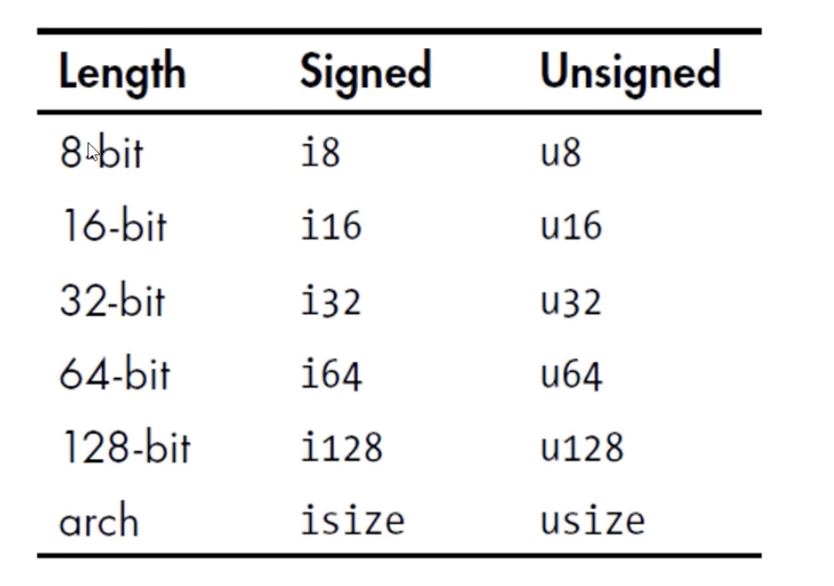

# Rust

Rust是静态编译 语言

擅长领域：
* 构建高性能web service
* webassembly
* 命令行工具
* 网络编程
* 嵌入式设备
* 系统编程

与其他语言比较，优点：
* C/C++：性能非常好，但类型系统和内存都不太安全
* Java/C#：拥有GC，能保证内存安全，也有很多优秀特性，但性能不行
* Rust：性能好，无需GC；安全性；无所畏惧的并发；易于维护，调试


官网：https://www.rust-lang.org/
Install Rust: https://www.rust-lang.org/tools/install
开发工具：Visual Studio Code + Rust 插件

## Rustc & rustup

```
rustup update         //更新 rust
rustup self uninstall //卸载 rust
rustc --version    // 查看版本
rustup doc         // 运行本地文档


rustc main.rs   // 编译
./main        // 运行


// rustc 只适合简单的rust程序
```
 
## Cargo

Cargo: Rust的构建系统和包管理工具。 构建代码，下载依赖库，构建这些库。安装rust的时候会自动安装cargo
```rust
cargo --version
cargo new hello_cargo //创建项目
* 项目名称为 hello_cargo
* 创建一个新目录 hello_cargo
	* Cargo.toml
	* src       // 放所有源代码
		* main.rs
	* .gitignore // 初始化一个新的git仓库
	* README, 许可信息，配置文件，和其他与源代码无关的文件

cargo build // 构建项目，用于开发调试时
* 创建可执行文件：target/debug/hello_cargo 或target/debug/hello_cargo.exe(Windows)
* 运行可执行文件：./target/debug/hello_cargo 或 ./target/debug/hello_cargo.exe
* 第一次运行cargo build会在顶层目录生成cargo.lock文件
	* cargo.lock负责追踪项目依赖的精确版本
	* 不需要手动修改该文件

cargo run //构建且运行项目，编译代码+执行结果

cargo check //检查代码，确保编译通过，但不产生任何可执行文件；cargo check 比cargo build快的多，写代码时可连续反复执行cargo check检查代码，提高效率

cargo build --release // 构建项目，用于发布时；编译时会进行优化，编译时间更长，会在target/release 而不是target/debug生产可执行文件
```


Cargo.toml
TOML（Tom's Obvious, Minimal Language）格式，是cargo的配置格式
```toml
[package]     # 一个区域标题，表示下方内容是用来配置package的     
name = "hello_cargo" # 项目名
version = "0.1.0"    # 项目版本
authors = "xxxx@qq.com" # 项目作者
edition = "2021"       # 使用的rust版本

# See more keys and their definitions at https://doc.rust-lang.org/cargo/reference/manifest.html

[dependencies] # 另一个区域的开始，列出项目的依赖项

```


## 变量
```rust
let <变量名> = <值>  // 变量是不可变的
let mut <变量名> = <值> //变量是可变的
```
shadowing 
可用相同名字声明新变量，新变量会shadow之前声明的变量，后续代码中这个变量名代表新的变量

## 常量
```
const MAX_POINTS:u32 = 100_000; // 常量永远是不可变的
```

## 数据类型
标量类型
* 整数
* 浮点
* 布尔
* 字符
复合类型
* 元组 Tuple
* 数组


### 整数类型
无符号整数以u开头
有符号整数以i开头

### 浮点类型

### 字符类型

### 布尔类型

### 元组
### 数组

## 函数

## 注释


