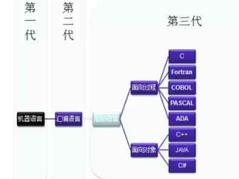

#历史

- 所有计算机都基于冯诺依曼体系结构。
- 贝尔实验室发明了C语言,c++,晶体管。
- 硬件公司：intel,AMD
- SUN公司：java
- Java核心优势：跨平台

[编程语言](https://www.wikiwand.com/en/Programming_language)：一组用来定义计算机程序的语法规则。它是一种被标准化的交流语言，用来向计算机发出指令。一种计算机语言 让程序员能够准确地 定义计算机所需要使用的数据，并精确地定义在不同情况下所应当采取的行动。

Programming  Language enable users to write programs for specific computations/algorithms.

尽管人们多次试图创造一种通用的程序设计语言，却没有一次尝试是成功的。之所以有那么多种不同的编程语言存在的原因是设计程序语言的初衷不同，对语言学习曲线的追求不同，不同程序之间的运行成本差异等。

编程语言的历史早于真正意义的计算机的出现。19世纪就有“可编程的”织布机和钢琴弹奏装置出现，它们都是领域特定语言(DSL)的样例。

* 偏性能敏感的编译型语言：C C++ Java C# Delphi Objective-C

* 偏快速业务开发的动态解析型语言： PHP Python Perl Ruby JavaScript Lua

* 面向特定领域的语言：Erlang R MATLAB

编程思想：

* 面向过程
* 面向对象 Object-oriented programming https://www.wikiwand.com/en/Object-oriented_programming
* 函数式编程
* 面向消息编程

[语言类型](https://www.wikiwand.com/en/Type_system#/Dynamic_type_checking_and_runtime_type_information)

* [静态类型开发语言](https://zhuanlan.zhihu.com/p/66383937): 编译时变量的数据类型就可以确定的语言
* 动态类型开发语言: 运行时才确定数据类型的语言
* [编译型语言](https://www.wikiwand.com/en/Compiled_language):  其实现通常是编译器(从源代码生成机器码的翻译器)，而不是解释器(源代码的逐步执行器，其中不发生运行前翻译)。
* [解析型语言](https://www.wikiwand.com/zh/%E7%9B%B4%E8%AD%AF%E8%AA%9E%E8%A8%80)

[盘点最常见的5个编程语言排行榜、排名逻辑&最新榜单](https://blog.csdn.net/MOY37RQW1JarN33BgZk/article/details/83044275)

* Tobie排行榜: https://www.tiobe.com/tiobe-index/

动态语言和静态语言：

单机时代：C语言，随着**机器性能的提升、软件规模与复杂度的提高**，Java逐步取代了C的位置。尽管看起来Java已经深获人心，但Java编程的体验并未尽如人意。

互联网时代：Go，Go语言希望取代C和Java的地位，成为最流行的通用开发语言。Go希望成为互联网时代的C语言

多数系统级语言（包括Java和C#）的根本编程哲学来源于C++，将C++面向对象进一步发扬光大。

C语言经久不衰的根源是它**足够简单**。

互联网时代的语言需要考虑的关键问题：1.并行与分布式支持(容易地操作多核计算机和计算机集群) 2. 软件工程支持 3. 编程哲学的重塑

语言层面解决软件工程问题的设计哲学

### 编程语言发展的编年史

从1951年至今，人类一共发明了256种编程语言，每一种语言的出现都带有某些新特征。编程语言不断的在革新，很快就会有超出这个清单的新编程语言出现。当然，这么多的语言中只有一些是常用的或实用的。

---

* 1951 – Regional Assembly Language
* 1952 – Autocode
* 1954 – IPL (LISP语言的祖先)
* 1955 – FLOW-MATIC (COBOL语言的祖先)

---

* 1957 – FORTRAN (第一个编译型语言)( FORMULA TRANSLATION)
* 1957 – COMTRAN (COBOL语言的祖先)
* 1958 – LISP (LIST PROCESSOR)
* 1958 – ALGOL 58
* 1959 – FACT (COBOL语言的祖先)
* 1959 – COBOL (COMMON BUSINESS-ORIENTED LANGUAGE) 1959 – RPG

---

* 1962 – APL
* 1962 – Simula
* 1962 – SNOBOL
* 1963 – CPL (C语言的祖先)
* 1964 – BASIC
* 1964 – PL/I
* 1966 – JOSS
* 1967 – BCPL (C语言的祖先)
* 1968 – Logo
* 1969 – B (C语言的祖先) 
* 1970 – Pascal 
* 1970 – Forth

---

* 1972 – C  (2000年前单机时代的编程之王)
* 1972 – Smalltalk
* 1972 – Prolog
* 1973 – ML
* 1975 – Scheme
* 1978 – SQL

---

* 1980 – C++ (既有类的C语言，更名于1983年7月)
* 1983 – Ada
* 1984 – Common Lisp
* 1984 – MATLAB
* 1985 – Eiffel
* 1986 – Objective-C
* 1986 – Erlang
* 1987 – Perl
* 1988 – Tcl
* 1988 – Mathematica
* 1989 – FL
* 1990 – Haskell
* 1991 – Python
* 1991 – Visual Basic
* 1993 – Ruby
* 1993 – Lua
* 1994 – CLOS (ANSI Common Lisp的一部分)
* 1995 – Java
* 1995 – Delphi (Object Pascal)
* 1995 – JavaScript
* 1995 – PHP
* 1996 – WebDNA
* 1997 – Rebol
* 1999 – D
* 2000 – ActionScript
* 2001 – C#
* 2001 – Visual Basic .NET
* 2002 – F#
* 2003 – Groovy
* 2003 – Scala
* 2007 – Clojure
* 2009 – Go
* 2011 – Dart

---

---

## Comparison of pargrammong languages

## The security of programming languages

## Tips for Secure Programming

* Always check for OWASP top ten vulnerabilities

* Ensure that sensitve data is properly encoded and encrypted

* Use access control and permissions to protect resources and limit application/user capabilities

* Validate all imput and output

* Store data securely

* Write code that is capable of handling exceptions (errors) securely

* Write code that is free of hardcoded credentials or cryptographic keys

* Use passwords and session management practices to verfy users

* Implement comprehensive yet realistic security policies

---

* CRLF Injection

* SQL Injection

* Buffer Management Errors

* Buffer Overflow

* Insufficient Input Validation

