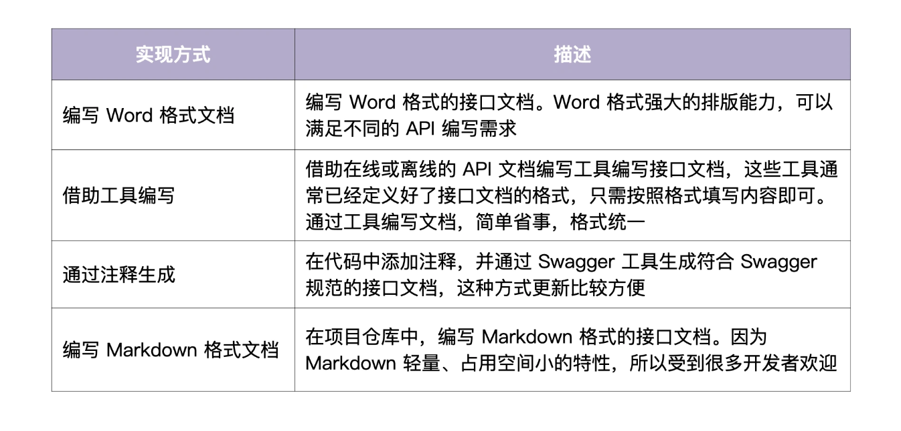
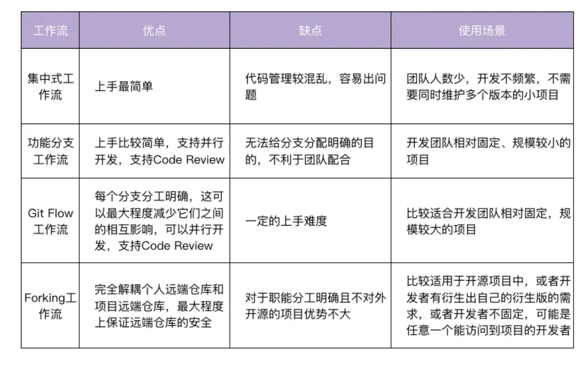

参考项目：https://github.com/marmotedu/iam

笔记简化版：https://ppd0705.github.io/post/go_develop_in_action/

完整笔记：https://github.com/cubxxw/awesome-cs-cloudnative-blockchain/blob/master/awesome-golang/projects/README.md

[Go 语言项目开发实战](https://time.geekbang.org/column/intro/100079601) 补充教程: https://github.com/marmotedu/geekbang-go/blob/master/README.md

## 1. 环境搭建

### Linux  服务器申请

阿里云，腾讯云，华为云

推荐使用CentOS系统

```

root@cubmaster01:/# uname -va
Linux cubmaster01 5.4.0-135-generic #152-Ubuntu SMP Wed Nov 23 20:19:22 UTC 2022 x86_64 x86_64 x86_64 GNU/Linux
root@cubmaster01:/# go version 
go version go1.19.3 linux/amd64
root@cubmaster01:/# git version
git version 2.25.1
```

### linux 环境搭建

```bash
# 以root用户登录创建普通用户
$ useradd going # 创建 going 用户，通过 going 用户登录开发机进行开发
$ passwd going # 设置密码
Changing password for user going.
New password:
Retype new password:
passwd: all authentication tokens updated successfully.

# 将普通用户加入到 sudoers 中,这样普通用户就可以通过 sudo 命令来暂时获取 Root 的权限
sed -i '/^root.*ALL=(ALL).*ALL/a\going\tALL=(ALL) \tALL' /etc/sudoers 


# local host创建sshkey
ssh-keygen -t rsa -b 2048 -C "your_email@example.com"
ssh-keygen -t ed25519 -C "your_email@example.com"
# 普通用户登录服务器
添加 public key 到 服务器的.ssh/authorized_keys 文件中
chmod 700 .ssh
chmod 600 .ssh/authorized_keys

cat /proc/version # 查询操作系统版本


切换成root用户
su -
sudo su # 如果现在用户被配置为sudoers文件的一部分(即允许执行sudo命令的用户)


```

### 安装git

```
sudo yum -y install git


# 配置git
git config --global user.name "Xinwei Xiong"    # 用户名改成自己的
git config --global user.email "3293172751nss@gmail.com"    # 邮箱改成自己的
git config --global credential.helper store    # 设置 Git，保存用户名和密码
git config --global core.longpaths true # 解决 Git 中 'Filename too long' 的错误


```

### 安装go

```
# Go 安装包下载: https://studygolang.com/dl
wget https://studygolang.com/dl/golang/go1.22.4.linux-amd64.tar.gz -O /tmp/go1.22.4.linux-amd64.tar.gz
mkdir -p $HOME/go
tar -xvzf /tmp/go1.22.4.linux-amd64.tar.gz -C $HOME/go
mv $HOME/go/go $HOME/go/go1.22.4

tee -a $HOME/.bashrc <<'EOF'
# Go envs
export GOVERSION=go1.22.4 # Go 版本设置
export GO_INSTALL_DIR=$HOME/go # Go 安装目录
export GOROOT=$GO_INSTALL_DIR/$GOVERSION # GOROOT 设置
# export GOPATH=$HOME/workspace # GOPATH 设置
export GOPATH=$$WORKSPACE/golang # GOPATH 设置
export PATH=$GOROOT/bin:$GOPATH/bin:$PATH # 将 Go 语言自带的和通过 go install 安装
export GO111MODULE="on" # 开启 Go moudles 特性
export GOPROXY=https://goproxy.cn,direct # 安装 Go 模块时，代理服务器设置
export GOPRIVATE=
export GOSUMDB=off # 关闭校验 Go 依赖包的哈希值
EOF
```

### go IDE安装和配置

VSCode安装和配置：https://learn.microsoft.com/zh-cn/azure/developer/go/configure-visual-studio-code


### 安装docker

```


# 更新 yum 包
yum -y update # 这个命令不是必须执行的，看个人情况，后面出现不兼容的情况的话就必须update了
# yum -y update：升级所有包同时也升级软件和系统内核； 
# yum -y upgrade：只升级所有包，不升级软件和系统内核

# 卸载旧版本（如果之前安装过的话）
yum remove docker  docker-common docker-selinux docker-engine

# 设置 docker yum 源
yum install -y yum-utils
yum-config-manager --add-repo https://download.docker.com/linux/centos/docker-ce.repo （中央仓库）
yum-config-manager --add-repo http://mirrors.aliyun.com/docker-ce/linux/centos/docker-ce.repo （阿里仓库）

# 安装 docker 社区版、docker-compose 等
yum install docker-ce docker-ce-cli containerd.io \
    docker-buildx-plugin docker-compose-plugin -y

# 启动 docker 服务
systemctl enable docker
systemctl start docker

# 安装制定版本 
yum list docker-ce --showduplicates | sort -r # 选择docker版本
yum -y install docker-ce-18.03.1.ce  # 选择一个版本并安装


# 安装docker-compose
sudo curl -L "https://github.com/docker/compose/releases/download/1.24.1/docker-compose-$(uname -s)-$(uname -m)" -o /usr/local/bin/docker-compose
$ sudo chmod +x /usr/local/bin/docker-compose
$ sudo ln -s /usr/local/bin/docker-compose /usr/bin/docker-compose
$ docker-compose version
```

Issue 1 ： ERROR: permission denied while trying to connect to the Docker daemon socket at unix:///var/run/docker.sock: Head "http://%2Fvar%2Frun%2Fdocker.sock/_ping": dial unix /var/run/docker.sock: connect: permission denied

```
su - # 切换到root用户
sudo groupadd docker     #添加docker用户组
sudo gpasswd -a $USER docker     #将登陆用户加入到docker用户组中
newgrp docker     #更新用户组
关闭窗口重新等登录
docker ps    #测试docker命令是否可以使用sudo正常使用
```

Issue2: => ERROR [internal] load metadata for docker.io/library/ubuntu:22.04                                                                          32.6s

ERROR: failed to solve: ubuntu:22.04: failed to resolve source metadata for docker.io/library/ubuntu:22.04: failed to copy: httpReadSeeker: failed open: failed to do request: Get "https://production.cloudflare.docker.com/registry-v2/docker/registry/v2/blobs/sha256/67/67c845845b7de8024a1ad9f6e7fd08964502a0b423aa8de631ef521863873884/data?verify=1719157202-vZZnH%2FEYJbxoYxkZf%2FFbtUsxcJs%3D": dial tcp 104.244.46.17:443: i/o timeout

```
[root@iZf8ziznc480ufao5wesaaZ ~]# cat /etc/docker/daemon.json
{
    "registry-mirrors":[
        "https://registry.hub.docker.com",
        "https://docker.mirrors.ustc.edu.cn",
        "https://hub-mirror.c.163.com",
        "https://registry.docker-cn.com"
    ]
}


systemctl restart docker

```

2024/06/23 后可用的dockerhub

```
[root@iZf8ziznc480ufao5wesaaZ ~]# cat /etc/docker/daemon.json
{
    "registry-mirrors": ["https://dockerhub.icu"]
}
```


```
        "https://ustc-edu-cn.mirror.aliyuncs.com/",
        "https://ccr.ccs.tencentyun.com/",
        "https://docker.m.daocloud.io/"
```


## ProtoBuf 编译环境安装


接着，我们再来安装 `protobuf`的编译器 `protoc`。`protoc` 需要 `protoc-gen-go` 来完成 Go 语言的代码转换，因此我们需要安装 `protoc`和 `protoc-gen-go` 这 2 个工具。它们的安装方法比较简单，你直接看我下面给出的代码和操作注释就可以了。

> Protocol Buffers（缩写为 protobuf）是 Google 开发的一种数据交换格式。它是一种结构化数据存储格式，可用于结构化数据串行化，或者说把数据从程序中“变成”字节流，又可以把字节流重新“变成”程序中的数据。由于 protobuf 是跨语言的，所以它可以被多种语言的程序使用。

```shell

# 第一步：安装 protobuf
$ cd /tmp/
$ git clone -b v3.21.1 --depth=1 https://github.com/protocolbuffers/protobuf
$ cd protobuf
$ ./autogen.sh
$ ./configure
$ make
$ sudo make install
$ protoc --version # 查看 protoc 版本，成功输出版本号，说明安装成功
libprotoc 3.21.1

# 第二步：安装 protoc-gen-go
$ go install github.com/golang/protobuf/protoc-gen-go@v1.5.2
```


## 2. 规范设计

### 2.1 开源规范

#### 开源协议

MIT是相对自由开发的协议, 最宽松的协议

Apache 是对商业应用友好的协议，使用者也可以在需要的时候修改代码来满足需要，并作为开源或商业产品发布 / 销售，所以大型公司的开源项目通常会采用Apache 2.0 开源协议。

各种开源协议介绍：https://www.runoob.com/w3cnote/open-source-license.html，

常用的6 种开源协议： GPL、MPL、LGPL、Apache、BSD 和 MIT

> * **GPL：** General Public License，开源项目最常用的许可证，衍生代码的分发需开源并且也要遵守此协议。该协议也有很多变种，不同变种要求会略微不同。
> * **MPL：** MPL 协议允许免费重发布、免费修改，但要求修改后的代码版权归软件的发起者，这种授权维护了商业软件的利益，它要求基于这种软件的修改无偿贡献版权给该软件。
> * **LGPL：** Lesser General Public Licence，是 GPL
>   的一个为主要为类库使用设计的开源协议。LGPL 允许商业软件通过类库引用的方式使用 LGPL 类库而不需要开源商业软件的代码。但是如果修改
>   LGPL 协议的代码或者衍生，则所有修改的代码，涉及修改部分的额外代码和衍生的代码都必须采用 LGPL 协议。
> * **Apache：** Apache 协议是 Apache 软件基金会发布的一个自由软件许可证，Apache 2.0 协议除了为用户提供版权许可之外，还有专利许可，非常适合涉及专利内容的项目。
> * **BSD：** BSD（Berkeley Software Distribution，伯克利软件发行版）。BSD 协议在软件分发方面，除需要包含一份版权提示和免责声明之外，没有任何限制，该协议还禁止用开源代码的作者/机构名字和原来产品的名字做市场推广。
> * **MIT：** 协议的主要内容为：该软件及其相关文档对所有人免费，可以任意处置，包括使用，复制，修改，合并，发表，分发，再授权，或者销售。唯一的限制是，软件中必须包含上述版权和许可提示。MIT 协议是所有开源许可中最宽松的一个，除了必须包含许可声明外，再无任何限制。

如何选择开源协议：


#### 开源规范详细列表

* 项目结构：一个开源项目应该有一个合理、专业的、符合语言特色的项目结构。
* 严格遵循代码规范：开源的代码，面向的人群是所有的开发者，一个不规范的代码，可读性差，不利于其他开发者阅读和贡献代码。
* 代码质量：开源的代码，一定要保证代码的质量，一个低质量的代码，不仅隐藏了很多性能和功能缺陷，而且还会影响开源项目的品牌，进而影响开源效果。
* 单元测试覆盖率：一个开源的 Go 项目，要保证整个项目的单元测试覆盖率，这样一方面可以保证代码的质量，另一方面可以使开源项目更专业，也能让你更加安心的发布版本。如 60%
* 版本发布规范：开源项目要遵循既定的版本规范，整个项目的更新迭代，要有版本号，目前用的比较多的是语义化的版本规范。
* 向下兼容：代码要做到向下兼容，这样可以尽可能减少发布变更的影响，遵循语义化的版本规范，可以在一定程度上保证代码的向下兼容能力。
* 详细的文档说明：要保证代码能够被其他开发者很容易的阅读和贡献代码，所以不仅要保证文档的质量和数量，还要确保有某些需要的文档：
  * LICENSE（如果是开源项目，LICENSE 是必选的）：软件协议，声明该开源项目遵循什么软件协议。
  * README.md：README 文件，放在项目的根目录下，包含项目的描述、依赖项、安装方法、使用方法、贡献方法、作者和遵循的软件协议等。
  * CHANGELOG：目录，用来存放版本的变更历史，方便其他开发者了解新版本或旧版本的变更内容。
  * Makefile：对于一个复杂的项目，通常也会包含一个 Makefile 文件，用来对项目进行构建、测试、安装等操作。
  * CONTRIBUTING.md：用来说明如何给本项目贡献代码，包含贡献流程和流程中每个环节的详细操作。
  * docs：目录，用来存放本项目所有文档，例如：安装文档、使用文档、开发文档等。一些重要的文档，可以链接到项目根目录的 README.md 文档中。这些文档要确保开发者能够轻松的理解、部署和使用该项目。
  * examples：存放一些示例代码。
* 安全：开源的代码，要保证整个代码库和提交记录中，不能出现类似内部 IP、内部域名、密码、密钥这类信息。
* 完善的 examples：完善的 examples，可以帮助用户快速学习和使用开源项目。
* 好的 Commit Message 记录：开源项目在 commit 时，要遵循一定的规范，这样其他开发者才能够快速浏览和理解变更历史，减小学习成本，本项目遵循 Angular commit message 规范。
* 发布可用的版本：要确保每一次发布都经过充分的测试，每一个发布的版本都是可用的。
* 持续的更新：一个好的开源项目，应该能够持续的更新功能，修复 Bug。对于一些已经结项、不维护的开源项目，需要及时的对项目进行归档，并在项目描述中加以说明。
* 及时的处理 pull request、issue、评论等：当项目被别的开发者提交 pull request、issue、评论时，要及时的处理，一方面可以确保项目不断被更新，另一方面也可以激发其他开发者贡献代码的积极性。
* 建立讨论小组：如果条件允许，最好和贡献者建立讨论小组，每周或每月组织讨论，共同维护。
* 做好推广：如果有条件，可以宣传运营开源项目，让更多的人知道，更多的人用，更多的人贡献代码。例如：在掘金、简书等平台发表文章，创建 QQ、微信交流群等。
* Git 工作流：选择合适的 Git 工作流，并遵循 GIt 工作流使用规范，例如 Gitflow 工作流。

### 2.2 文档规范

最重要的三类文档：README文档、项目文档和API文档

#### README文档规范

主要用来介绍项目的功能、安装、部署和使用

范例参考：https://github.com/marmotedu/iam

**推荐一个在线的 README 文档生成网站：**[readme.so](https://readme.so)

```bash
# 项目名称

<!-- 写一段简短的话描述项目 -->

## 功能特性

<!-- 描述该项目的核心功能点 -->

## 软件架构(可选)

<!-- 可以描述下项目的架构 -->

## 快速开始

### 依赖检查

<!-- 描述该项目的依赖，比如依赖的包、工具或者其他任何依赖项 -->

### 构建

<!-- 描述如何构建该项目 -->

### 运行

<!-- 描述如何运行该项目 -->

## 使用指南

<!-- 描述如何使用该项目 -->

## 如何贡献

<!-- 告诉其他开发者如果给该项目贡献源码 -->

## 社区(可选)

<!-- 如果有需要可以介绍一些社区相关的内容 -->

## 关于作者

<!-- 这里写上项目作者 -->

## 谁在用(可选)

<!-- 可以列出使用本项目的其他有影响力的项目，算是给项目打个广告吧 -->

## 许可证

<!-- 这里链接上该项目的开源许可证 -->
```

#### 项目文档规范

通常放在 `/docs`目录下，包含开发文档和用户文档

项目文档包括一切需要文档化的内容，它们通常集中放在 /docs目录下。当我们在创建团队的项目文档时，通常会预先规划并创建好一些目录，用来存放不同的文档。因此，在开始 Go项目开发之前，我们也要制定一个软件文档规范。好的文档规范有 2 个优点：易读和可以快速定位文档。

不同项目有不同的文档需求，在制定文档规范时，你可以考虑包含两类文档。

* 开发文档：用来说明项目的开发流程，比如如何搭建开发环境、构建二进制文件、测试、部署等。
* 用户文档：软件的使用文档，对象一般是软件的使用者，内容可根据需要添加。比如，可以包括 API 文档、SDK 文档、安装文档、功能介绍文档、最佳实践、操作指南、常见问题等。

为了方便全球开发者和用户使用，开发文档和用户文档，可以预先规划好英文和中文 2 个版本。

为了加深你的理解，这里我们来看下实战项目的文档目录结构：

```bash

docs
├── devel                            # 开发文档，可以提前规划好，英文版文档和中文版文档
│   ├── en-US/                       # 英文版文档，可以根据需要组织文件结构
│   └── zh-CN                        # 中文版文档，可以根据需要组织文件结构
│       └── development.md           # 开发手册，可以说明如何编译、构建、运行项目
├── guide                            # 用户文档
│   ├── en-US/                       # 英文版文档，可以根据需要组织文件结构
│   └── zh-CN                        # 中文版文档，可以根据需要组织文件结构
│       ├── api/                     # API文档
│       ├── best-practice            # 最佳实践，存放一些比较重要的实践文章
│       │   └── authorization.md
│       ├── faq                      # 常见问题
│       │   ├── iam-apiserver
│       │   └── installation
│       ├── installation             # 安装文档
│       │   └── installation.md
│       ├── introduction/            # 产品介绍文档
│       ├── operation-guide          # 操作指南，里面可以根据RESTful资源再划分为更细的子目录，用来存放系统核心/全部功能的操作手册
│       │   ├── policy.md
│       │   ├── secret.md
│       │   └── user.md
│       ├── quickstart               # 快速入门
│       │   └── quickstart.md
│       ├── README.md                # 用户文档入口文件
│       └── sdk                      # SDK文档
│           └── golang.md
└── images                           # 图片存放目录
    └── 部署架构v1.png
```

#### API 接口文档规范

接口文档又称为 API 文档，一般由后台开发人员编写，用来描述组件提供的 API 接口，以及如何调用这些 API 接口。

在项目初期，接口文档可以解耦前后端，让前后端并行开发：前端只需要按照接口文档实现调用逻辑，后端只需要按照接口文档提供功能。

当前后端都开发完成之后，我们就可以直接进行联调，提高开发效率。在项目后期，接口文档可以提供给使用者，不仅可以降低组件的使用门槛，还能够减少沟通成本。

接口文档有四种编写方式，包括编写 Word 格式文档、借助工具编写、通过注释生成和编写 Markdown 格式文档。具体的实现方式见下表：



**其中，通过注释生成和编写 Markdown 格式文档这 2 种方式用得最多。**

* 相比通过注释生成的方式，编写 Markdown 格式的接口文档，能表达更丰富的内容和格式，不需要在代码中添加大量注释。
* 相比 Word 格式的文档，Markdown 格式文档占用的空间更小，能够跟随代码仓库一起发布，方便 API 文档的分发和查找。
* 相比在线 API 文档编写工具，Markdown 格式的文档免去了第三方平台依赖和网络的限制。

API 接口文档又要遵循哪些规范呢？

其实，一个规范的 API 接口文档，通常需要包含一个完整的 API接口介绍文档、API 接口变更历史文档、通用说明、数据结构说明、错误码描述和 API 接口使用文档。API接口使用文档中需要包含接口描述、请求方法、请求参数、输出参数和请求示例。

接口文档拆分为以下几个 Markdown 文件，并存放在目录 `docs/guide/zh-CN/api` 中：https://github.com/marmotedu/iam/tree/master/docs/guide/zh-CN/api

* README.md ：API 接口介绍文档，会分类介绍 IAM 支持的 API 接口，并会存放相关 API 接口文档的链接，方便开发者查看。
* CHANGELOG.md ：API 接口文档变更历史，方便进行历史回溯，也可以使调用者决定是否进行功能更新和版本更新。
* generic.md ：用来说明通用的请求参数、返回参数、认证方法和请求方法等。
* struct.md ：用来列出接口文档中使用的数据结构。这些数据结构可能被多个 API 接口使用，会在 user.md、secret.md、policy.md 文件中被引用。
* user.md 、 secret.md 、 policy.md ：API 接口文档，相同 REST 资源的接口会存放在一个文件中，以 REST 资源名命名文档名。
* error_code.md ：错误码描述，通过程序自动生成。

这里我拿 user.md 接口文档为例，和你解释下接口文档是如何写的。user.md 文件记录了用户相关的接口，每个接口按顺序排列，包含如下 5 部分。

* 接口描述：描述接口实现了什么功能。
* 请求方法：接口的请求方法，格式为 HTTP 方法 请求路径，例如 POST /v1/users。在 通用说明中的请求方法部分，会说明接口的请求协议和请求地址。
* 输入参数：接口的输入字段，它又分为 Header 参数、Query 参数、Body 参数、Path 参数。每个字段通过：参数名称、必选、类型 和 描述 4 个属性来描述。如果参数有限制或者默认值，可以在描述部分注明。
* 输出参数：接口的返回字段，每个字段通过 参数名称、类型 和 描述 3 个属性来描述。
* 请求示例：一个真实的 API 接口请求和返回示例。如果掌握了这些内容之后，

你还想了解更详细的 API 接口文档规范，可以参考这个 [链接](https://github.com/marmotedu/iam/tree/master/docs/guide/zh-CN/api)

### 2.3 版本规范

语义化版本规范（SemVer，Semantic Versioning）是 GitHub 起草的一个具有指导意义的、统一的版本号表示规范。

版本格式为：主版本号.次版本号.修订号（X.Y.Z）.其中 X、Y 和 Z 为非负的整数，且禁止在数字前方补零。

版本号递增规则:

* 主版本（major）: 当做了不兼容的 API 修改。
* 次版本（minor）: 当做了向下兼容的新增功能及修改（一般偶数为稳定版，奇数为开发版本）
* 修订版本（PATCH）：当做了向下兼容的问题修正。

版本号建议

* 开始开发时，以0.1.0作为第一个开发版本号，后续发行时递增次版本号
* 发布第一个稳定版时定为1.0.0
* 后续迭代
  * fix commit将修订版本+1
  * feat commit将次版本号+1
  * BREAKING CHANGE commit将主版本号+1

例如，v1.2.3 是一个语义化版本号

还有： `v1.2.3-alpha.1+001,`   这其实是把先行版本号（Pre-release）和版本编译元数据，作为延伸加到了主版本号.次版本号.修订号的后面，格式为 `X.Y.Z[-先行版本号][+版本编译元数据]`

先行版本号意味着，该版本不稳定，可能存在兼容性问题，格式为：`X.Y.Z-[一连串以句点分隔的标识符] `，比如下面这几个例子：

```shell
1.0.0-alpha
1.0.0-alpha.1
1.0.0-0.3.7
1.0.0-x.7.z.92
```

编译版本号，一般是编译器在编译过程中自动生成的，**我们只定义其格式，并不进行人为控制。**下面是一些编译版本号的示例：

```shell
1.0.0-alpha+001
1.0.0+20130313144700
1.0.0-beta+exp.sha.5114f85
  
```

注意，先行版本号和编译版本号只能是字母、数字，且不可以有空格。

语义化版本控制规范: 语义化版本控制规范比较多，这里我给你介绍几个比较重要的。如果你需要了解更详细的规范，可以参考 [这个链接](https://semver.org/lang/zh-CN/) 的内容。

* 标记版本号的软件发行后，禁止改变该版本软件的内容，任何修改都必须以新版本发行。
* 主版本号为零（0.y.z）的软件处于开发初始阶段，一切都可能随时被改变，这样的公共 API 不应该被视为稳定版。1.0.0 的版本号被界定为第一个稳定版本，之后的所有版本号更新都基于该版本进行修改。
* 修订号 Z（x.y.Z | x > 0）必须在只做了向下兼容的修正时才递增，这里的修正其实就是 Bug 修复。
* 次版本号 Y（x.Y.z | x > 0）必须在有向下兼容的新功能出现时递增，在任何公共 API 的功能被标记为弃用时也必须递增，当有改进时也可以递增。其中可以包括修订级别的改变。每当次版本号递增时，修订号必须归零。
* 主版本号 X（X.y.z | X > 0）必须在有任何不兼容的修改被加入公共 API 时递增。其中可以包括次版本号及修订级别的改变。每当主版本号递增时，次版本号和修订号必须归零。

### 2.4 Commit规范

社区有多种 Commit Message 的规范


推荐采用Angular风格的Commit Message, 其包含三个部分：Header、Body和Footer，具体格式如下：

```fallback
<type>[optional scope]: <description>
// 空行
[optional body]
// 空行
[optional footer]
```

其中，Header 是必需的，Body 和 Footer 可以省略。在以上规范中，必须用括号()括起来，`<type>`[`<scope>`]后必须紧跟冒号 ，冒号后必须紧跟空格，2 个空行也是必需的。在实际开发中，为了使 Commit Message 在 GitHub 或者其他 Git 工具上更加易读，我们往往会限制每行 message 的长度。根据需要，可以限制为 50/72/100 个字符，这里我将长度限制在 72 个字符以内（也有一些开发者会将长度限制为 100，你可根据需要自行选择）。

**以下是一个符合 Angular 规范的 Commit Message：**

```shell
fix($compile): couple of unit tests for IE9
# Please enter the Commit Message for your changes. Lines starting
# with '#' will be ignored, and an empty message aborts the commit.
# On branch master
# Changes to be committed:
# ...

Older IEs serialize html uppercased, but IE9 does not...
Would be better to expect case insensitive, unfortunately jasmine does
not allow to user regexps for throw expectations.

Closes #392
Breaks foo.bar api, foo.baz should be used instead
```


#### Header

`<type>`[optional scope]: `<description>`

`type`说明commit类型，主要分为Development和Production两大类

* Development类别修改的是项目管理类的变更，如CI流程、构建方式等，不会影响到最终用户，具体类型
  * style：代码格式类的变更，如格式化代码gofmt、删除空行等
  * test： 增加或更新测试用例
  * ci：持续集成和部署相关的改动,如修改jenkins，GitLab CI等CI配置文件或更新systemd unit文件
  * docs：更新文档
  * chore：其他类型，如构建流程、依赖管理或辅助工具的变更等
* Production类别会影响到最终用户，提交前需要做好充分的测试
  * feat: 新增功能
  * fix: bug修复
  * perf: 提高代码性能的变更
  * refactor: 不属于上面三类的其他类型，如简化代码、重命名变量等

`scope`用来说明影响范围，必须是名词，应根据项目情况设计大类如api、pkg、docs等。scope 不适合设置太具体的值。例[IAM commit message scope](https://github.com/marmotedu/iam/blob/master/docs/devel/zh-CN/scope.md)

`descrption`是对commit的简单描述，必须以动词开头，, 动词的第一个字母必须是小写, 使用现在时态，结尾不加句号


#### Body

body是对commit的详细描述，同样以动词开头，使用现在时态，内容包含改动的原因和跟上一版本相比的改动点,例：

```
The body is mandatory for all commits except for those of scope "docs". When the body is required it must be at least 20 characters long.
```

#### Footer

不是必选的，主要用来说明本次 commit 导致的后果。在实际应用中，Footer 通常用来说明不兼容的改动和关闭的 Issue 列表，格式如下：

```fallback
BREAKING CHANGE: <breaking change summary>
// 空行
<breaking change description + migration instructions>
// 空行
// 空行
Fixes #<issue number>
```

**接下来，我给你详细说明下这两种情况：**

* 不兼容的改动：如果当前代码跟上一个版本不兼容，需要在 Footer 部分，以 BREAKING CHANG: 开头，后面跟上不兼容改动的摘要。Footer 的其他部分需要说明变动的描述、变动的理由和迁移方法，例如：
  ```shell
  BREAKING CHANGE: isolate scope bindings definition has changed and
      the inject option for the directive controller injection was removed.

      To migrate the code follow the example below:

      Before:

      scope: {
        myAttr: 'attribute',
      }

      After:

      scope: {
        myAttr: '@',
      }
      The removed `inject` wasn't generaly useful for directives so there should be no code using it.

  ```

关闭的 Issue 列表：关闭的 Bug 需要在 Footer 部分新建一行，并以 Closes 开头列出，例如：`Closes #123`。如果关闭了多个 Issue，可以这样列出：`Closes #123, #432, #886`。例如:

```shell
 Change pause version value to a constant for image
  
    Closes #1137
```

#### Revert Commit

除了 Header、Body 和 Footer 这 3 个部分，Commit Message 还有一种特殊情况：如果当前 commit 还原了先前的 commit，则应以 `revert:` 开头，后跟还原的 commit 的 Header。而且，在 Body 中必须写成 This reverts commit ，其中 hash 是要还原的 commit 的 SHA 标识。例如：

```shell
revert: feat(iam-apiserver): add 'Host' option

This reverts commit 079360c7cfc830ea8a6e13f4c8b8114febc9b48a.
  
```

为了更好地遵循 Angular 规范，建议你在提交代码时养成不用 `git commit -m`，即不用 -m 选项的习惯，而是直接用 `git commit` 或者 `git commit -a` 进入交互界面编辑 Commit Message。这样可以更好地格式化 Commit Message。

#### 其他

合并提交： 对于过多的commit使用 `git rebase -i`  进行合并 ， 示例：https://github.com/cubxxw/awesome-cs-cloudnative-blockchain/blob/284249003ca8ec9ac1469d8b25e9cb902c9fdec0/awesome-golang/projects/projects/3.md#commit-%E7%9B%B8%E5%85%B3%E7%9A%84-3-%E4%B8%AA%E9%87%8D%E8%A6%81%E5%86%85%E5%AE%B9

修改message: 使用 `git rebase`(注：修改message会将导致当前及置换的hash变更)

* `git commit --amend`：修改最近一次 commit 的 message；
* `git rebase -i`：修改某次 commit 的 message。

Commit Message规范自动化工具:

* [commitizen-go](https://github.com/lintingzhen/commitizen-go)：格式化填充commit message,提示生成 Commit Message，然后提
  交。
* commit-msg：githooks，在 commit-msg 中，指定检查的规则，commit-msg 是个
  脚本，可以根据需要自己写脚本实现。这门课的 commit-msg 调用了 go-gitlint 来进
  行检查。
* [gitlint](https://github.com/llorllale/go-gitlint): 检查commit message是否符合 Angular 规范，可以将该工具添加在 CI 流程中，确保 Commit Message 都是符合规范的。
* [git-changelog](https://github.com/git-chglog/git-chglog): 根据 Commit Message自动生成change log
* [gmemver](https://github.com/arnaud-deprez/gsemver): 语义化版本自动生成工具


## 3. 目录结构设计

**目录结构分为结构化目录结构和平铺式目录结构两种。** 结构化目录结构主要用在 Go 应用中，相对来说比较复杂；而平铺式目录结构主要用在 Go 包中，相对来说比较简单。

**在 Go 项目中，要避免使用带复数的目录或者包。建议统一使用单数。**

文件夹单词之间需要加分隔符，具体加什么分隔符还是要分情况。如果是组件名目录可以用-，
其它可以选择_，其实这里没有标准答案，可以根据需要需要自己选择，并形成规范即可。
文件夹名建议全小写

### 3.1 平铺式结构

一个 Go 项目可以是一个应用，也可以是一个代码  **框架 / 库** ，当项目是代码 **框架 / 库** 时，比较适合采用平铺式目录结构。

平铺方式就是在项目的根目录下存放项目的代码，整个目录结构看起来更像是一层的，这种方式在很多框架 /
库中存在，使用这种方式的好处是引用路径长度明显减少，比如 github.com/marmotedu/log/pkg/options，可缩短为github.com/marmotedu/log/options。例如 log 包 github.com/golang/glog 就是平铺式的，目录如下：

```shell
$ ls glog/
glog_file.go  glog.go  glog_test.go  LICENSE  README
```

### 3.2 结构式结构

当前 Go 社区比较推荐的结构化目录结构是 [project-layout](https://github.com/golang-standards/project-layout) 。虽然它并不是官方和社区的规范，但因为组织方式比较合理，被很多 Go 开发人员接受。所以，我们可以把它当作是一个事实上的规范。

开发一个Go语言项目，应该包含哪些功能：

* 项目介绍：README.md。
* 客户端：xxxctl。
* API 文档。
* 构建配置文件，CICD 配置文件。
* CHANGELOG。
* 项目配置文件。
* kubernetes 部署定义文件（未来容器化是趋势，甚至会成为服务部署的事实标准，所以目录结构中需要有存放 kubernetes 定义文件的目录）。
* Dockerfile 文件。
* systemd/init 部署配置文件（物理机/虚拟机部署方式需要）。
* 项目文档。
* commit message 格式检查或者其他 githook。
* 请求参数校验。
* 命令行 flag。
* 共享包：
  * 外部项目可导入。
  * 只有子项目可导入。
* storage 接口。
* 项目管理：Makefile，完成代码检查、构建、打包、测试、部署等。
* 版权声明。
* _output 目录（编译、构建产物）。
* 引用的第三方包。
* 脚本文件（可能会借助脚本，实现一些源码管理、构建、生成等功能）。
* 测试文件。

**IAM 项目规范：**

```

├── api
│   ├── openapi
│   └── swagger
├── build
│   ├── ci
│   ├── docker
│   │   ├── iam-apiserver
│   │   ├── iam-authz-server
│   │   └── iam-pump
│   ├── package
├── CHANGELOG
├── cmd
│   ├── iam-apiserver
│   │   └── apiserver.go
│   ├── iam-authz-server
│   │   └── authzserver.go
│   ├── iamctl
│   │   └── iamctl.go
│   └── iam-pump
│       └── pump.go
├── configs
├── CONTRIBUTING.md
├── deployments
├── docs
│   ├── devel
│   │   ├── en-US
│   │   └── zh-CN
│   ├── guide
│   │   ├── en-US
│   │   └── zh-CN
│   ├── images
│   └── README.md
├── examples
├── githooks
├── go.mod
├── go.sum
├── init
├── internal
│   ├── apiserver
│   │   ├── api
│   │   │   └── v1
│   │   │       └── user
│   │   ├── apiserver.go
│   │   ├── options
│   │   ├── service
│   │   ├── store
│   │   │   ├── mysql
│   │   │   ├── fake
│   │   └── testing
│   ├── authzserver
│   │   ├── api
│   │   │   └── v1
│   │   │       └── authorize
│   │   ├── options
│   │   ├── store
│   │   └── testing
│   ├── iamctl
│   │   ├── cmd
│   │   │   ├── completion
│   │   │   ├── user
│   │   └── util
│   ├── pkg
│   │   ├── code
│   │   ├── options
│   │   ├── server
│   │   ├── util
│   │   └── validation
├── LICENSE
├── Makefile
├── _output
│   ├── platforms
│   │   └── linux
│   │       └── amd64
├── pkg
│   ├── util
│   │   └── genutil
├── README.md
├── scripts
│   ├── lib
│   ├── make-rules
├── test
│   ├── testdata
├── third_party
│   └── forked
└── tools
```


#### 目录介绍

##### 前后端代码相关

1. **/web**

前端代码存放目录,web目录主要存放web静态资源, 服务端模板和单页应用（SPAs）。

2. **/cmd**

一个项目可能有多个组件，每个组件的main函数所在文件夹放在该目录,例：

```
$ ls cmd/
gendocs  geniamdocs  genman  genswaggertypedocs  genyaml  iam-apiserver  iam-authz-server  iamctl  iam-pump

$ ls cmd/iam-apiserver/
apiserver.go
```

每个组件的目录名应该跟你期望的可执行文件名是一致的。这里要保证 /cmd/<组件名> 目录下不要存放太多的代码，如果你认为代码可以导入并在其他项目中使用，那么它应该位于 /pkg 目录中。如果代码不是可重用的，或者你不希望其他人重用它，请将该代码放到 /internal 目录中。

3. **/internal**

存放私有应用和库的代码，不能被其他项目导入

项目内应用之间共享代码存放于/internal/pkg

开发建议：最开始将共享代码都放/internal/pkg，做好对外发布的准备时再转到/pkg目录

IAM项目internal目录结构如下：

```fallback
├── apiserver
│   ├── api
│   │   └── v1
│   │       └── user
│   ├── options
│   ├── config
│   ├── service
│   │   └── user.go
│   ├── store
│   │   ├── mysql
│   │   │   └── user.go
│   │   ├── fake
│   └── testing
├── authzserver
│   ├── api
│   │   └── v1
│   ├── options
│   ├── store
│   └── testing
├── iamctl
│   ├── cmd
│   │   ├── cmd.go
│   │   ├── info
└── pkg
    ├── code
    ├── middleware
    ├── options
    └── validation
```

主要分为三大类

* /internal/pkg: 内部共享包存放目录，这些包提供了比较基础、通用的功能，例如工具、错误码、用户验证等功能。
* /internal/iamctl: 对于大型项目，可能会存在客户端工具
* /internal/apiserver: 存放真实的应用代码。这些应用的共享代码存放在/internal/pkg 目录下。

针对具体的应用目录，也会根据功能来划分：

* /internal/apiserver/api/v1: HTTP API接口具体实现，主要用来做 HTTP 请求的解包、参数校验、业务逻辑处理、返回。注意这里的业务逻辑处理应该是轻量级的，如果业务逻辑比较复杂，代码量比较多，建议放到 /internal/apiserver/service 目录下。该源码文件主要用来串流程。
* /internal/apiserver/options: command flag
* `/internal/apiserver/config`：根据命令行参数创建应用配置。
* /internal/apiserver/service: 业务逻辑代码
* /internal/apiserver/store/mysql: 数据库交互，比如 Create、Update、Delete、Get、List 等。

/internal/pkg通常也会划分：

* /internal/pkg/code: 业务Code码
* /internal/pkg/validation: 通用验证函数
* /internal/pkg/code: HTTP处理链

**4. /pkg**

pkg目录存放外部应用可以使用的代码库，应谨慎考虑。其他项目可以直接通过 import 导入这里的代码。所以，我们在将代码库放入该目录时一定要慎重。

**5. /vendor**

项目依赖，通过 `go mod vendor`创建。需要注意的是，如果是一个 Go 库，不要提交 vendor 依赖包。

**6. /third_party**

外部帮助工具，分支代码或其他第三方应用（例如 Swagger UI）。比如fork了一个第三方go包，并做了小改动，可以放置该目录/third_party/forked 下。一方面可以很清楚的知道该包是 fork 第三方的，另一方面又能够方便地和 upstream 同步。

##### 测试相关

**7. /test**

存放其他外部测试应用和测试数据

test 目录的构建方式比较灵活：对于大的项目，有一个数据子目录是有意义的。例如，如果需要 Go 忽略该目录中的内容，可以使用 /test/data 或 /test/testdata 目录。

需要注意的是，Go 也会忽略以“.”或 “_” 开头的目录或文件。这样在命名测试数据目录方面，可以具有更大的灵活性。

##### 应用部署相关

**8. /configs**

存放配置文件模板或默认配置。例如，可以在这里存放 confd 或 consul-template 模板文件。这里有一点要注意，配置中不能携带敏感信息，这些敏感信息，我们可以用占位符来替代，例如：

```shell
apiVersion: v1  
user:  
  username: ${CONFIG_USER_USERNAME} # iam 用户名  
  password: ${CONFIG_USER_PASSWORD} # iam 密码
```

**9. /deployments**

存放IaaS，PaaS系统和容器编排部署模板和配置模板（Docker-Compose，Kubernetes/Helm，Mesos，Terraform，Bosh）

在一些项目，特别是用 Kubernetes 部署的项目中，这个目录可能命名为 deploy。

为什么要将这类跟 Kubernetes 相关的目录放到目录结构中呢？主要是因为当前软件部署基本都在朝着容器化的部署方式去演进。

**10. /init**

存放初始化系统和进程管理配置文件，如systemd、supervisord等

存放初始化系统（systemd，upstart，sysv）和进程管理配置文件（runit，supervisord）。比如 sysemd 的 unit 文件。这类文件，在非容器化部署的项目中会用到。

##### 项目管理相关

**11. /Makefile**

项目管理文件

Makefile 通常用来执行静态代码检查、单元测试、编译等功能。其他常见功能，你可以参考这里：

> * 静态代码检查(lint)：推荐用 golangci-lint。
> * 单元测试(test)：运行 go test ./...。
> * 编译(build)：编译源码，支持不同的平台，不同的 CPU 架构。
> * 镜像打包和发布(image/image.push)：现在的系统比较推荐用 Docker/Kubernetes 进行部署，所以一般也要有镜像构建功能。
> * 清理（clean）:清理临时文件或者编译后的产物。
> * 代码生成（gen）：比如要编译生成 protobuf pb.go 文件。
> * 部署（deploy，可选）：一键部署功能，方便测试。
> * 发布（release）：发布功能，比如：发布到 Docker Hub、github 等。
> * 帮助（help）:告诉 Makefile 有哪些功能，如何执行这些功能。
> * 版权声明（add-copyright）：如果是开源项目，可能需要在每个文件中添加版权头，这可以通过 Makefile 来添加。
> * API 文档（swagger）：如果使用 swagger 来生成 API 文档，这可以通过 Makefile 来生成。

我还有一条建议：直接执行 make 时，执行如下各项 `format -> lint -> test -> build`，如果是有代码生成的操作，还可能需要首先生成代码 `gen -> format -> lint -> test -> build`。

在实际开发中，我们可以将一些重复性的工作自动化，并添加到 Makefile 文件中统一管理。

**12. /scripts**

存放脚本文件，通常可能分为三个目录

* /scripts/make-rules: 存放makefile文件，实现Makerfile文件中的各个功能。Makefile 有很多功能，为了保持它的简洁，我建议你将各个功能的具体实现放在/scripts/make-rules 文件夹下。
* /scripts/lib: 存放shell脚本。一个大型项目中有很多自动化任务，比如发布、更新文档、生成代码等，所以要写很多 shell 脚本，这些 shell 脚本会有一些通用功能，可以抽象成库，存放在/scripts/lib 目录下，比如 logging.sh，util.sh 等。
* /scripts/intall: 如果项目支持自动化部署，可以将部署脚本放在该目录。如果部署脚本简单，也可以直接放在 /scripts 目录下。

另外，shell 脚本中的函数名，建议采用语义化的命名方式，例如 iam::log::info 这种语义化的命名方式，可以使调用者轻松的辨别出函数的功能类别，便于函数的管理和引用。在 Kubernetes 的脚本中，就大量采用了这种命名方式。

**13. /build**

存放安装包和持续集成相关的文件，通常可能包含三个目录

* /build/package: 存放容器（Docker）、系统(deb,rpm,pkg)的包配置和脚本
* /build/ci: 存放CI（travis，circle, drone）的配置文件和脚本
* /build/docker: 存放子项目各个组件的Dockerfile文件

**14. /tools**

存放这个项目的支持工具，这些工具可导入来自/pkg和/internal目录的代码

**15. /githooks**

git钩子。比如，我们可以将 commit-msg 存放在该目录。

**16. /assets**

项目使用的其他资源（图片、CSS、Javascript等）

**17. /website**

放置项目网站相关的数据

如果你不使用 GitHub 页面，那么可以在这里放置项目网站相关的数据。

##### 文档相关

**18. /README.md**

一般包含项目介绍、功能介绍、快速按照、使用指引、详细文档连接和开发指引等
文件较长时可以用[tocenize](https://github.com/nochso/tocenize)加目录

**19. /docs**

存放设计文档、开放文档和用户文档等，可能包含下面几个目录

/docs/devel/{en-US, zh-CN}: 存放开发文档、hack 文档等。
/docs/guide/{en-US, zh-CN}: 存放用户手册，安装、quickstart、产品文档等，分为中文文档和英文文档。
/docs/images: 存放图片文件

**20. /CONTRIBUTING.md**

用来说明如何贡献代码，规范协同流程

如果是一个开源就绪的项目，最好还要有一个 CONTRIBUTING.md 文件，用来说明如何贡献代码，如何开源协同等等。CONTRIBUTING.md 不仅能够规范协同流程，还能降低第三方开发者贡献代码的难度。

**21. /api**

存放项目提供的各种不同类型的API接口定义文件，可能有openapi、swagger等目录

其中可能包含类似 /api/protobuf-spec、/api/thrift-spec、/api/http-spec、openapi、swagger 的目录，这些目录包含了当前项目对外提供和依赖的所有 API 文件

```fallback
├── openapi/
│   └── README.md
└── swagger/
    ├── docs/
    ├── README.md
    └── swagger.yaml

```

**22. /LICENSE**

版权文件

如果需要给源码文件加license头时，可以使用[addlicense](https://github.com/marmotedu/addlicense)

项目依赖第三方包使用的license检查使用[glice](https://github.com/ribice/glice)

**23. /CHANGELOG**

项目更新日志，可结合Angular规范和git-chglog自动生成内容

**24. /examples**

存放代码示例

#### 其他建议

* 不使用src目录
* 不使用/model目录，按功能拆分到使用的模块中
* 目录和包尽量使用单数
* 小项目可以先包含cmd、pkg、internal三个目录

```
$ tree --noreport -L 2 tms
tms
├── cmd
├── internal
├── pkg
└── README.md
```

## 4. 工作流设计

在使用 Git 开发时，有 4 种常用的工作流，也叫开发模式，按演进顺序分为集中式工作流、功能分支工作流、Git Flow 工作流和 Forking 工作流

- 集中式工作流：开发者直接在本地 master 分支开发代码，开发完成后 push 到远端仓库 master 分支。
- 功能分支工作流：开发者基于 master 分支创建一个新分支，在新分支进行开发，开发完成后合并到远端仓库 master 分支。
- Git Flow 工作流：Git Flow 工作流为不同的分支分配一个明确的角色，并定义分支之间什么时候、如何进行交互，比较适合大型项目的开发。
- Forking 工作流：开发者先 fork 项目到个人仓库，在个人仓库完成开发后，提交 pullrequest 到目标远程仓库，远程仓库 review 后，合并 pull request 到 master 分支。

非开源项目推荐采用 Git Flow 工作流。
开源项目推荐采用 Forking 工作流。



### 4.1 集中式工作流

所有开发人员都往同一个分支master上提交代码，会使日志混杂在一起，难以定位问题，代码之间互相影响，产生代码冲突。适合**团队人数少、开发不频繁、不需要同时维护多个版本的小项目**

### 4.2 功能分支工作流

开发新功能时，基于master分支新建一个功能分支，在功能分支上进行开发，开发完之后合并到master

**该模式适合小规模、人员固定的项目**


功能分支工作流具体的开发流程:

1. 基于 master 分支新建一个功能分支，功能分支可以取一些有意义的名字，便于理解，例如 feature/rate-limiting。

```shell
$ git checkout -b feature/rate-limiting
  
```

2. 在功能分支上进行代码开发，开发完成后 commit 到功能分支。

```shell
$ git add limit.go
$ git commit -m "add rate limiting"
```

3. 将本地功能分支代码 push 到远程仓库。

```shell
$ git push origin feature/rate-limiting
```

4. 在远程仓库上创建 PR（例如：GitHub）。
5. 代码管理员收到PR后对代码进行Code Review。CR通过后点击Merger pull request将PR合并到master。

**“Merge pull request” 提供了 3 种 merge 方法：**

1. Create a merge commit：GitHub 的底层操作是 git merge --no-ff。feature 分支上所有的commit 都会加到 master 分支上，并且会生成一个 mergecommit。这种方式可以让我们清晰地知道是谁做了提交，做了哪些提交，回溯历史的时候也会更加方便。
2. Squash and merge：GitHub 的底层操作是 git merge --squash。Squash and merge
   会使该 pull request 上的所有 commit 都合并成一个 commit ，然后加到 master 分支上，但原来的 commit历史会丢失。如果开发人员在 feature 分支上提交的 commit 非常随意，没有规范，那么我们可以选择这种方法来丢弃无意义的commit。但是在大型项目中，每个开发人员都应该是遵循 commit 规范的，因此我不建议你在团队开发中使用 Squash andmerge。
3. Rebase and merge：GitHub 的底层操作是 git rebase。这种方式会将 pull request上的所有提交历史按照原有顺序依次添加到 master 分支的头部（HEAD）。因为 git rebase 有风险，在你不完全熟悉 Git
   工作流时，我不建议 merge 时选择这个。通过分析每个方法的优缺点，在实际的项目开发中，我比较推荐你使用 Create a mergecommit 方式。

**实际开发中，推荐使用Create a merge commit**

### 4.3 Git Flow工作流

Git Flow 工作流是一个非常成熟的方案，**也是非开源项目中最常用到的工作流**

**比较适合人员固定，大型的项目或者迭代速度快的项目**

Git Flow定义了5种分支： master、develop、release、 feature、hotfix，其中master和develop为常驻分支，其他为非常驻分支，不同研发阶段会用到不同分支。详细介绍如下


git flow开发流程：

1 创建常驻分支：develop

```
$ git checkout -b develop master

```

2 基于 develop 分支，新建一个功能分支：feature/print-hello-world。

```
$ git checkout -b feature/print-hello-world develop
```

3 feature/print-hello-world 分支中，在 main.go 文件中添加一行代码fmt.Println("Hello")，

4 紧急修复bug,假设当前在一个future分支开发，突然发现了线上bug，需要hotfix

```
$ git stash # 1. 开发工作只完成了一半，还不想提交，可以临时保存修改至堆栈区
$ git checkout -b hotfix/print-error master # 2. 从 master 建立 hotfix 分支
$ vi main.go # 3. 修复 bug，callmainfunction -> call main function
$ git commit -a -m 'fix print message error bug' # 4. 提交修复
$ git checkout develop # 5. 切换到 develop 分支
$ git merge --no-ff hotfix/print-error # 6. 把 hotfix 分支合并到 develop 分支
$ git checkout master # 7. 切换到 master 分支
$ git merge --no-ff hotfix/print-error # 8. 把 hotfix 分支合并到 master
$ git tag -a v0.9.1 -m "fix log bug" # 9. master 分支打 tag
$ go build -v . # 10. 编译代码，并将编译好的二进制更新到生产环境
$ git branch -d hotfix/print-error # 11. 修复好后，删除 hotfix/xxx 分支
$ git checkout feature/print-hello-world # 12. 切换到开发分支下
$ git merge --no-ff develop # 13. 因为 develop 有更新，这里最好同步更新下
$ git stash pop # 14. 恢复到修复前的工作状态

```

5 继续开发

6 提交代码到feature/print-hello-world分支

```
git commit -a -m "print 'hello world'"
```

7 在 feature/print-hello-world 分支上做 code review。

```
$ git push origin feature/print-hello-world

```

8 code review 过后，代码仓库maintainer将功能分支合并到develop分支

```

$gitcheckoutdevelop
$gitmerge--no-fffeature/print-hello-world
```

9 基于develop 创建release分支，测试代码

```

$ git checkout -b release/1.0.0 develop
$ go build -v . # 构建后，部署二进制文件，并测试
```

10 测试失败需要修复，直接在release/1.0.0 修改代码，修改完后提交并编译部署

```

$ git commit -a -m "fix bug"
$ go build -v .
```

11 测试通过后，将功能分支合并到master和develop分支

```
$ git checkout develop
$ git merge --no-ff release/1.0.0
$ git checkout master
$ git merge --no-ff release/1.0.0
$ git tag -a v1.0.0 -m "add print hello world" # master 分支打 tag
```

12 删除feature/print-hello-world分支，也可选择性删除release/1.0.0分支

```
git branch -d feature/print-hello-world
```

### 4.4 Forking工作流

**开源项目最常用模式**

**Forking 工作流比较适用于以下三种场景：（1）开源项目中；（2）开发者有衍生出自己的衍生版的需求；（3）开发者不固定，可能是任意一个能访问到项目的开发者**


Forking工作流步骤：

1. Fork 远程仓库到自己的账号下。将[https://github.com/marmotedu/iam](https://github.com/marmotedu/iam) 项目 Fork 到自己的仓库 [https://github.com/cubxxw/iam](https://github.com/cubxxw/iam)
2. 克隆 fork 的仓库到本地

```shell
$ git clone https://github.com/cubxxw/iam
$ cd gitflow-demo
$ git remote add upstream https://github.com/marmotedu/iam
$ git remote set-url --push upstream no_push # Never push to upstream master
$ git remote -v # Confirm that your remotes make sense
origin  https://github.com/cubxxw/iam (fetch)
origin  https://github.com/cubxxw/iam (push)
upstream  https://github.com/marmotedu/iam (fetch)
upstream  https://github.com/marmotedu/iam (push)
  
```

3. **创建功能分支**

首先，要同步本地仓库的 master 分支为最新的状态（跟 upstream master 分支一致）。

```shell
$ git fetch upstream
$ git checkout master
$ git rebase upstream/master
  
```

然后，创建功能分支。

```shell
$ git checkout -b feature/add-function
  
```

**4. 提交 commit**

在 feature/add-function 分支上开发代码，开发完代码后，提交 commit。

```shell
$ git fetch upstream # commit 前需要再次同步 feature 跟 upstream/master
$ git rebase upstream/master
$ git add <file>
$ git status
$ git commit
  
```

分支开发完成后，可能会有一堆commit，但是合并到主干时，我们往往希望只有一个（或最多两三个）commit，这可以使功能修改都放在一个或几个 commit中，便于后面的阅读和维护。这个时候，我们可以用 git rebase 来合并和修改我们的 commit，操作如下：

```shell
$ git rebase -i origin/master
```

另一种合并commit简便方法，就是先撤销过去 5 个 commit，然后再建一个新的：

```
$ git reset HEAD~5
$ git add .
$ git commit -am "Here's the bug fix that closes #28"
$ git push --force
```

squash 和 fixup 命令，还可以当作命令行参数使用，自动合并 commit。

```
$ git commit --fixup
$ git rebase -i --autosquash
```

5. push功能分支到个人远程仓库

在完成了开发，并 commit 后，需要将功能分支 push 到个人远程代码仓库，代码如下：

```
$ git push -f origin feature/add-function
```

6. 在个人远程仓库创建PR，请求reviewers进行代码review，确认后合并到master，

## 5. 研发流程设计

研发流程：可以确保我们高效地开发出一个优秀的 Go 项目

研发模式：管理我们的 Go 项目，也就是说采用一些好的工具或方法在应用的整个生命周期中对应用进行管理，以提高应用的研发效率和质量。

### 5.1 研发流程

通常研发流程包括6个阶段

1. 需求阶段: 参与产品讨论，详细了解需求，为后面开发打下基础
2. 设计阶段：做好调研，设计具有领先性的技术架构，技术方案也要获得团队一致通过
3. 开发阶段：遵循开发规范，go开发最佳实践，保质高效地完成项目开发
4. 测试阶段：协助测试部署环境，解决卡点问题，及时修复bug
5. 发布阶段：遵循发布规范，谨慎发布到现网，做好现网验证
6. 运营阶段：协助运维快速定位并恢复系统，协助 运营开发运营类功能接口

研发流程也是一种规范，很难靠开发者的自觉性去遵守。为了让项目参与人员尽可能地遵守规范，需要借助一些工具、系统来对他们进行强约束。所以，在我们设计完整个研发流程之后，需要认真思考下，有哪些地方可以实现自动化，有哪些地方可以靠工具、系统来保障规范的执行。这些自动化工具会在第16 讲中详细介绍。


每个阶段结束时，需要一个最终产物，可以是文档、代码或者部署组件，这个产物是下一个阶段的输入

**设计阶段：**


对于后端开发人员，在设计技术方案之前，要做好充足的调研。一个技术方案，不仅要调研业界优秀的实现，还要了解友商相同技术的实现。只有这样，才可以确保我们的技术用最佳的方式实现。

**开发阶段：**

为了提高开发效率，越来越多的开发者采用生成代码的方式来生成一部分代码，所以在真正编译之前可能还需要先生成代码，比如生成.pb.go 文件、API 文档、测试用例、错误码
等。我的建议是，在项目开发中，你要思考怎么尽可能自动生成代码。这样不仅能提高研发效率，还能减少错误。

整个开发阶段步骤很多，而且都是高频的操作。那怎么提高效率呢？这里我推荐你两种方法

- 将开发阶段的步骤通过 Makefile 实现集中管理；
- 将构建阶段的步骤通过 CI/CD 平台实现自动化

你还需要特别注意这一点：在最终合并代码到 master 之前，要确保代码是经过充分测试的。这就要求我们一定要借助代码管理平台提供的 Webhook 能力，在代码提交时触发CI/CD 作业，对代码进行扫描、测试，最终编译打包，并以整个作业的成功执行作为合并代码的先决条件。

**测试阶段：**

研发人员在交付给测试时，要提供自测报告、自测用例和安装部署文档。

**发布阶段：**

进入到发布审批阶段。首先需要申请资源，资源申请周期可能会比较久，所以申请得越早越好，甚至资源申请可以在测试阶段发起。在资源申请阶段，可以申请诸如服务器、MySQL、Redis、Kafka 之类资源。

资源申请通常是开发人员向运维人员提需求，由运维人员根据需求，在指定的时间前准备好各类资源。如果是物理机通常申请周期会比较久，但当前越来越多的项目选择容器化部署，这可以极大地缩短资源的申请周期。如果在像腾讯云弹性容器这类 Serverless 容器平台上部署业务，甚至可以秒申请资源。所以这里，我也建议优先采用容器化部署。

发布之前需要创建发布计划，里面需要详细描述本次的变更详情，例如变更范围、发布方案、测试结果、验证和回滚方案等。这里需要你注意，在创建发布计划时，一定要全面梳理这次变更的影响点。例如，是否有不兼容的变更，是否需要变更配置，是否需要变更数据库等。任何一个遗漏，都可能造成现网故障，影响产品声誉和用户使用

接下来，需要创建发布单，在发布单中可以附上发布计划，并根据团队需求填写其它发布内容，发布计划需要跟相关参与者对齐流程、明确职责。发布单最终提交给审批人（通常是技术 leader）对本次发布进行审批，审批通过后，才可以进行部署。

最后，就可以进入到服务发布阶段，将服务发布到现网。在正式部署的时候，应用需要先部署到预发环境。在预发环境，产品人员、测试人员和研发人员会分别对产品进行验证。其中，产品人员主要验证产品功能的体验是否流畅，开发和测试人员主要验证产品是否有Bug。预发环境验证通过，产品才能正式发布到现网。

develop -> pre-integration -> integration -> staging -> production

开发，测试，生产都需要在不同环境部署

这里，我强烈建议，编写一些自动化的测试用例，在服务发布到现网之后，对现网服务做一次比较充分的回归测试。通过这个自动化测试，可以以最小的代价，最快速地验证现网功能，从而保障发布质量。

我们还要注意，现网可能有多个地域，每个地域发布完成之后都要进行现网验证。

发布阶段的产出物是正式上线的软件。

**运营阶段:**

研发流程的最后一个阶段是运营阶段，该阶段主要分为产品运营和运维两个部分。运维属于技术类，运营属于产品类。

产品运营：通过一系列的运营活动，比如线下的技术沙龙、线上的免费公开课、提高键词排名或者输出一些技术推广文章等方式，来推高整个产品的知名度，提高产品的用户数量，并提高月活和日活。
运维：由运维工程师负责，核心目标是确保系统稳定的运行，如果系统异常，能够及时发现并修复问题。长期目标是通过技术手段或者流程来完善整个系统架构，减少人力投入、提高运维效率，并提高系统的健壮性和恢复能力


QE主要职责是测试。但质量保障不仅仅只有测试，比如发布流程规范，故障复盘，质量指标的建立等，都需要建立起来，这些一般会通过QA来建立。小公司区别倒不用
这么清晰。

### 5.2 应用生命周期管理

采用一些好的工具或方法在应用的整个生命周期中对应用进行管理，以提高应用的研发效率和质量。

我们可以从两个维度来理解应用生命周期管理技术。

* 第一个维度是演进维度。应用生命周期，最开始主要是通过研发模式来管理的，按时间线先后出现了瀑布模式、迭代模式、敏捷模式。接着，为了解决研发模式中的一些痛点出现了另一种管理技术，也就是CI/CD 技术。随着 CI/CD 技术的成熟，又催生了另一种更高级的管理技术 DevOps。
* 第二个维度是管理技术的类别。应用生命周期管理技术可以分为两类：
  * 研发模式，用来确保整个研发流程是高效的。
  * DevOps，主要通过协调各个部门之间的合作，来提高软件的发布效率和质量。DevOps 中又包含了很多种技术，主要包括 CI/CD和多种 Ops，例如 AIOps、ChatOps、GitOps、NoOps 等。其中，CI/CD 技术提高了软件的发布效率和质量，而 Ops技术则提高了软件的运维和运营效率。

尽管这些应用生命周期管理技术有很多不同，但是它们彼此支持、相互联系。研发模式专注于**开发过程**，DevOps 技术里的 CI/CD 专注于**流程**，Ops 则专注于**实战**。


为了能够逻辑清晰地给你讲解明白这些技术，我会从演进维度来展开，也就是按照这样的顺序：`研发模式（瀑布模式 -> 迭代模式 -> 敏捷模式） -> CI/CD -> DevOps`

**研发模式建议选择敏捷模式，因为它更能胜任互联网时代快速迭代的诉求。DevOps 则要优先确保落地 CI/CD 技术，接着尝试落地 ChatOps 技术，如果有条件可以积极探索 AIOps 和 GitOps**

大厂普遍采用敏捷开发的模式，来适应互联网对应用快速迭代的诉求。例如，腾讯的TAPD、Coding的 Scrum 敏捷管理就是一个敏捷开发平台。CI/CD 强制落地，
ChatOps 已经广泛使用，AIOps 也有很多落地案例，GitOps 目前还在探索阶段，NoOps 还处在理论阶段。

关于如何管理应用的生命周期，建议是：研发模式建议选择敏捷模式，因为它更能胜任互联网时代快速迭代的诉求。DevOps 则要优先确保落地 CI/CD 技术，接
着尝试落地 ChatOps 技术，如果有条件可以积极探索 AIOps 和 GitOps

#### 研发模式

研发模式主要有三种，演进顺序为瀑布模式 -> 迭代模式 -> 敏捷模式

##### 瀑布模式

瀑布模式按照预先规划好的阶段来推进研发进度，流程清晰,但研发周期长，交付后变更困难。我们熟知的 RHEL、Fedora 等系统就是采用瀑布模式


##### 迭代模式

研发任务被切分为一系列轮次，先把主要功能搭建起来，在通过客户反馈不断完善

##### 敏捷模式

敏捷模式把大需求分成多个、可分阶段完成的小迭代，每个迭代交付都是一个可用的软件，开发过程中，软件一直处于可用状态

迭代模式关注研发流程。而敏捷模式不仅会关注研发流程，还会关注之外的一些东西，例如：团队协作，需求拆分.

在敏捷模式中，我们会把一个大的需求拆分成很多小的迭代，这意味着开发过程中会有很多个开发、构建、测试、发布和部署的流程。这种高频度的操作会给研发、运维和测试人员带来很大的工作量，降低了工作效率。为了解决这个问题，CI/CD 技术诞生了。

#### CI/CD

CI/CD: 自动化构建和部署应用

CI/CD 技术通过自动化的手段，来快速执行代码检查、测试、构建、部署等任务，从而提高研发效率，解决敏捷模式带来的弊端。

CI/CD 包含了 3 个核心概念。

* CI：Continuous Integration，持续集成。
* CD：Continuous Delivery，持续交付。
* CD：Continuous Deployment，持续部署。


持续集成、持续交付和持续部署强调的是持续性，也就是能够支持频繁的集成、交付和部署，这离不开自动化工具的支持，离开了这些工具，CI/CD 就不再具有可实施性。**持续集成的核心点在代码，持续交付的核心点在可交付的产物，持续部署的核心点在自动部署。**

##### 持续集成

它的含义为：频繁地（一天多次）将开发者的代码合并到主干上。它的流程为：在开发人员完成代码开发，并 push 到 Git 仓库后，CI 工具可以立即对代码进行扫描、（单元）测试和构建，并将结果反馈给开发者。持续集成通过后，会将代码合并到主干。

CI 流程可以使应用软件的问题在开发阶段就暴露出来，这会让开发人员交付代码时更有信心。因为 CI 流程内容比较多，而且执行比较频繁，所以 CI 流程需要有自动化工具来支撑。

##### 持续交付

它指的是一种能够使软件在较短的循环中可靠发布的软件方法。

持续交付在持续集成的基础上，将构建后的产物自动部署在目标环境中。这里的目标环境，可以是测试环境、预发环境或者现网环境。

通常来说，持续部署可以自动地将服务部署到测试环境或者预发环境。因为部署到现网环境存在一定的风险，所以如果部署到现网环境，需要手工操作。手工操作的好处是，可以使相关人员评估发布风险，确保发布的正确性。

##### **持续部署**

持续部署在持续交付的基础上，将经过充分测试的代码自动部署到生产环境，整个流程不再需要相关人员的审核。持续部署强调的是自动化部署，是交付的最高阶段。

持续集成、持续交付和持续部署强调的是持续性，也就是能够支持频繁的集成、交付和部署，这离不开自动化工具的支持，离开了这些工具，CI/CD 就不再具有可实施性。持续集成的核心点在代码，持续交付的核心点在可交付的产物，持续部署的核心点在自动部署。

#### DevOps

DevOps：研发运维一体化. CI/CD 技术的成熟，加速了 DevOps 这种应用生命周期管理技术的成熟和落地。

DevOps（Development 和 Operations 的组合）是一组过程、方法和系统的统称，用于促进开发、运维、质量部门之间的协作整合。技术运营和质量保障（QA）部门之间的沟通、协作与整合。这 3 个部门的相互协作，可以提高软件质量、快速发布软件

**DevOps ！= CI/CD。DevOps 是一组过程、方法和系统的统称，而 CI/CD 只是一种软件构建和发布的技术。**


DevOps 技术之前一直有，但是落地不好，因为没有一个好的工具来实现 DevOps 的理念。但是随着容器、CI/CD 技术的诞生和成熟，DevOps 变得更加容易落地。也就是说，这几年越来越多的人采用 DevOps 手段来提高研发效能。

目前常用的Ops手段： AIOps、ChatOps、GitOps,

##### ChatOps

聊着天就把事情给办了

通过发送指令给聊天机器人，执行某个任务ChatOps对操作者友好，信息透明可追溯

随着企业微信、钉钉等企业内通讯工具的兴起，最近几年出现了一个新的概念 ChatOps。

简单来说，ChatOps 就是在一个聊天工具中，发送一条命令给 ChatBot 机器人，然后 ChatBot 会执行预定义的操作。这些操作可以是执行某个工具、调用某个接口等，并返回执行结果。

这种新型智能工作方式的优势是什么呢？它可以利用 ChatBot 机器人让团队成员和各项辅助工具连接在一起，以沟通驱动的方式完成工作。ChatOps 可以解决人与人、人与工具、工具与工具之间的信息孤岛，从而提高协作体验和工作效率。

[](https://camo.githubusercontent.com/711dc645d0d6e3d907e357c23f4e43ce60ad0fd09af36181dd715952d6e9a588/687474703a2f2f736d2e6e736464642e746f702f736d3230323330323137313535373633302e706e67)

开发 / 运维 / 测试人员通过 @聊天窗口中的机器人 Bot 来触发任务，机器人后端会通过 API
接口调用等方式对接不同的系统，完成不同的任务，例如持续集成、测试、发布等工作。机器人可以是我们自己研发的，也可以是开源的。目前，业界有很多流行的机器人可供选择，常用的有 Hubot、Lita、Errbot、StackStorm 等。

##### GitOps

基于Git和K8S实现云原生的持续交付

一种实现云原生的持续交付模型
gitops 是一种持续交付的方式。它的核心思想是将应用系统的声明性基础架构（YAML）和应用程序存放在 Git 版本库中。将 Git作为交付流水线的核心，每个开发人员都可以提交拉取请求（Pull Request），并使用 Git 来加速和简化 Kubernetes的应用程序部署和运维任务。

通过 Git 这样的工具，开发人员可以将精力聚焦在功能开发，而不是软件运维上，以此提高软件的开发效率和迭代速度。

使用 GitOps 可以带来很多优点，其中最核心的是：当使用 Git 变更代码时，GitOps可以自动将这些变更应用到程序的基础架构上。因为整个流程都是自动化的，所以部署时间更短；又因为 Git代码是可追溯的，所以我们部署的应用也能够稳定且可重现地回滚。

**我们可以从概念和流程上来理解 GitOps，它有 3 个关键概念:**

* 声明性容器编排：通过 Kubernetes YAML 格式的资源定义文件，来定义如何部署应用。
* 不可变基础设施：基础设施中的每个组件都可以自动的部署，组件在部署完成后，不能发生变更。如果需要变更，则需要重新部署一个新的组件。例如，Kubernetes 中的 Pod 就是一个不可变基础设施。
* 连续同步：不断地查看 Git 存储库，将任何状态更改反映到 Kubernetes 集群中。


**GitOps 的工作流程如下：**

1. 首先，开发人员开发完代码后推送到 Git 仓库，触发 CI 流程，CI 流程通过编译构建出 Docker 镜像，并将镜像 push 到Docker 镜像仓库中。Push 动作会触发一个 push 事件，通过 webhook 的形式通知到 Config Updater服务，Config Updater 服务会从 webhook 请求中获取最新 push 的镜像名，并更新 Git 仓库中的 Kubernetes
   YAML 文件。
2. 然后，GitOps 的 Deploy Operator 服务，检测到 YAML 文件的变动，会重新从 Git仓库中提取变更的文件，并将镜像部署到 Kubernetes 集群中。Config Updater 和 Deploy Operator两个组件需要开发人员设计开发。

##### AIOps

智能运维: 利用AI技术来智能化运维IT系统

在 2016 年，Gartner 提出利用 AI 技术的新一代 IT 运维，即 AIOps（智能运维）。通过 AI 手段，来智能化地运维 IT 系统。AIOps 通过搜集海量的运维数据，并利用机器学习算法，智能地定位并修复故障。

也就是说，AIOps 在自动化的基础上，增加了智能化，从而进一步推动了 IT 运维自动化，减少了人力成本。

随着 IT 基础设施规模和复杂度的倍数增长，企业应用规模、数量的指数级增长，传统的人工 /
自动化运维，已经无法胜任愈加沉重的运维工作，而 AIOps 提供了一个解决方案。在腾讯、阿里等大厂很多团队已经在尝试和使用
AIOps，并享受到了 AIOps 带来的红利。例如，故障告警更加灵敏、准确，一些常见的故障，可以自动修复，无须运维人员介入等。

#### NoOps

NoOps：无运维

NoOps 即无运维，完全自动化的运维。在 NoOps 中不再需要开发人员、运营运维人员的协同，把微服务、低代码、无服务全都结合了起来，开发者在软件生命周期中只需要聚焦业务开发即可，所有的维护都交由云厂商来完成。

毫无疑问，NoOps 是运维的终极形态，在我看来它像 DevOps一样，更多的是一种理念，需要很多的技术和手段来支撑。当前整个运维技术的发展，也是朝着 NoOps 的方向去演进的，例如 GitOps、AIOps 可以使我们尽可能减少运维，Serverless 技术甚至可以使我们免运维。相信未来 NoOps 会像现在的 Serverless一样，成为一种流行的、可落地的理念。

## 6. 设计方法:设计并实现优雅go项目

编写优雅的go项目：

1. 编写高质量的 Go 应用、
2. 高效管理项目
3. 编写高质量的项目文档


### 6.1 代码结构

按功能拆分目录而非按MVC等模块拆封

1. 好的目录结构
2. 好的模块拆分达到高内聚低耦合：
   1. 按层拆分：MVC，Model、View 和 Controller 三层
   2. 按功能拆分：**在 Go 项目中我建议你使用的是按功能拆分的方法，这也是 Go 项目中最常见的拆分方法**

比如，一个订单系统，我们可以根据不同功能将其拆分成用户（user）、订单（order）和计费（billing）3 个模块，每一个模块提供独立的功能，功能更单一：
下面是该订单系统的代码目录结构：

```
$ tree pkg
$ tree --noreport -L 2 pkg
pkg
├── billing
├── order
│   └── order.go
└── user
```

相较于按层拆分，按功能拆分模块带来的好处也很好理解：

* 不同模块，功能单一，可以实现高内聚低耦合的设计哲学。
* 因为所有的功能只需要实现一次，引用逻辑清晰，会大大减少出现循环引用的概率。

### 6.2 代码规范

可参考Uber的规范：[Go Style Guide](https://github.com/uber-go/guide/blob/master/style.md)

可使用惊呆检查工具：[golangcli-lint](https://github.com/golangci/golangci-lint)

官方CodeReview实践：[Go Code Review Comments](https://github.com/golang/go/wiki/CodeReviewComments)

Go 社区有很多这类规范可供参考，其中，比较受欢迎的是[Uber Go 语言编码规范](https://github.com/xxjwxc/uber_go_guide_cn)。

**使用静态代码检查工具来约束开发者的行为：**

有了静态代码检查工具后，不仅可以确保开发者写出的每一行代码都是符合 Go 编码规范的，还可以将静态代码检查集成到 CI/CD 流程中。这样，在代码提交后自动地检查代码，就保证了只有符合编码规范的代码，才会被合入主干。

Go 语言的静态代码检查工具有很多，目前用的最多的是 [golangci-lint](https://github.com/golangci/golangci-lint)。

**Go语言最佳实践文章：**

* [Effective Go](https://golang.org/doc/effective_go)：高效 Go 编程，由 Golang 官方编写，里面包含了编写 Go 代码的一些建议，也可以理解为最佳实践。
* [Go Code Review Comments](https://github.com/golang/go/wiki/CodeReviewComments)：Golang 官方编写的 Go 最佳实践，作为 Effective Go 的补充。
* Style guideline for Go packages[：包含了如何组织 Go 包、如何命名 Go 包、如何写 Go](https://rakyll.org/style-packages/) 包文档的一些建议。

### 6.3 代码质量

代码质量可以通过单元测试和 Code Review 来实现。

#### 单元测试

进行单元测试，不仅需要编写单元测试用例，还需要我们确保代码是可测试的，以及具有一个高的单元测试覆盖率。

**可测试代码编写：**

如果我们要对函数 A 进行测试，并且 A 中的所有代码均能够在单元测试环境下按预期被执行，那么函数 A 的代码块就是可测试的。我们来看下一般的单元测试环境有什么特点：

* 可能无法连接数据库。
* 可能无法访问第三方服务。

如果函数 A 依赖数据库连接、第三方服务，那么在单元测试环境下执行单元测试就会失败，函数就没法测试，函数是不可测的。

解决方法也很简单：将依赖的数据库、第三方服务等抽象成接口，在被测代码中调用接口的方法，在测试时传入 mock 类型，从而将数据库、第三方服务等依赖从具体的被测函数中解耦出去。

为了提高代码的可测性，降低单元测试的复杂度，对 function 和 mock 的要求是：

* 要尽可能减少 function 中的依赖，让 function 只依赖必要的模块。编写一个功能单一、职责分明的函数，会有利于减少依赖。
* 依赖模块应该是易 Mock 的。

为了协助你理解，我们先来看一段不可测试的代码：

```go
package post

import "google.golang.org/grpc"

type Post struct {
  Name    string
  Address string
}

func ListPosts(client *grpc.ClientConn) ([]*Post, error) {
  return client.ListPosts()
}
  
```

这段代码中的 `ListPosts` 函数是不可测试的。因为 `ListPosts` 函数中调用了 `client.ListPosts()`方法，该方法依赖于一个 `gRPC` 连接。而我们在做单元测试时，可能因为没有配置 `gRPC` 服务的地址、网络隔离等原因，导致没法建立 `gRPC` 连接，从而导致 `ListPosts` 函数执行失败。

**我们将这段代码改成可依赖的：**

```go
package main

type Post struct {
  Name    string
  Address string
}

type Service interface {
  ListPosts() ([]*Post, error)
}

func ListPosts(svc Service) ([]*Post, error) {
  return svc.ListPosts()
}
  
```

上面代码中，ListPosts 函数入参为 Service
接口类型，只要我们传入一个实现了 Service 接口类型的实例，ListPosts
函数即可成功运行。因此，我们可以在单元测试中可以实现一个不依赖任何第三方服务的 fake 实例，并传给
ListPosts。上述可测代码的单元测试代码如下：

```go
package main

import "testing"

type fakeService struct {
}

func NewFakeService() Service {
  return &fakeService{}
}

func (s *fakeService) ListPosts() ([]*Post, error) {
  posts := make([]*Post, 0)
  posts = append(posts, &Post{
    Name:    "colin",
    Address: "Shenzhen",
  })
  posts = append(posts, &Post{
    Name:    "alex",
    Address: "Beijing",
  })
  return posts, nil
}

func TestListPosts(t *testing.T) {
  fake := NewFakeService()
  if _, err := ListPosts(fake); err != nil {
    t.Fatal("list posts failed")
  }
}
```

当我们的代码可测之后，就可以借助一些工具来 Mock 需要的接口了。常用的 Mock 工具，有这么几个：

* golang/mock，是官方提供的 Mock 框架。它实现了基于 interface 的 Mock 功能，能够与 Golang 内置的testing 包做很好的集成，是最常用的 Mock 工具。golang/mock 提供了 mockgen 工具用来生成 interface对应的 Mock 源文件。
* sqlmock，可以用来模拟数据库连接。数据库是项目中比较常见的依赖，在遇到数据库依赖时都可以用它。
* httpmock，可以用来 Mock HTTP 请求。
* bouk/monkey，猴子补丁，能够通过替换函数指针的方式来修改任意函数的实现。如果 golang/mock、sqlmock 和httpmock 这几种方法都不能满足我们的需求，我们可以尝试通过猴子补丁的方式来 Mock 依赖。可以这么说，猴子补丁提供了单元测试 Mock依赖的最终解决方案。

测试相关工具：

* 官方Mock框架： [golang/mock](https://github.com/golang/mock)
* 数据库Mock： [golang/mock](https://github.com/DATA-DOG/go-sqlmock)
* HTTP Mock： [golang/mock](https://github.com/jarcoal/httpmock)
* 万能Mock： [golang/mock](https://github.com/bouk/monkey)

#### 单元测试覆盖率

覆盖率检查

$ go test -race -cover  -coverprofile=./coverage.out -timeout=10m -short -v ./...
$ go tool cover -func ./coverage.out

接下来，我们再一起看看如何提高我们的单元测试覆盖率。

当我们编写了可测试的代码之后，接下来就需要编写足够的测试用例，用来提高项目的单元测试覆盖率。这里我有以下两个建议供你参考：

* 使用 [gotests](https://github.com/cweill/gotests) 工具自动生成单元测试代码，减少编写单元测试用例的工作量，将你从重复的劳动中解放出来。
* 定期检查单元测试覆盖率。你可以通过以下方法来检查：

```shell
$ go test -race -cover  -coverprofile=./coverage.out -timeout=10m -short -v ./...
$ go tool cover -func ./coverage.out
  
```

**🚀 编译结果如下：**

在提高项目的单元测试覆盖率时，我们可以先提高单元测试覆盖率低的函数，之后再检查项目的单元测试覆盖率；如果项目的单元测试覆盖率仍然低于期望的值，可以再次提高单元测试覆盖率低的函数的覆盖率，然后再检查。以此循环，最终将项目的单元测试覆盖率优化到预期的值为止。

这里要注意，对于一些可能经常会变动的函数单元测试，覆盖率要达到 100%。

#### Code Review

Code Review 可以提高代码质量、交叉排查缺陷，并且促进团队内知识共享，是保障代码质量非常有效的手段。在我们的项目开发中，一定要建立一套持久可行的 Code Review 机制。

但在我的研发生涯中，发现很多团队没有建立有效的 Code Review 机制。这些团队都认可 Code Review 机制带来的好处，但是因为流程难以遵守，慢慢地 Code Review 就变成了形式主义，最终不了了之。其实，建立 Code Review机制很简单，主要有 3 点：

* 首先，确保我们使用的代码托管平台有 Code Review 的功能。比如，GitHub、GitLab 这类代码托管平台都具备这种能力。
* 接着，建立一套 Code Review 规范，规定如何进行 Code Review。
* 最后，也是最重要的，每次代码变更，相关开发人员都要去落实 Code Review 机制，并形成习惯，直到最后形成团队文化。

### 6.4 编程哲学

* 面向接口编程
* 面向对象编程

#### 面向接口编程

Go 接口是一组方法的集合。任何类型，只要实现了该接口中的方法集，那么就属于这个类型，也称为实现了该接口。

接口的作用，其实就是为不同层级的模块提供一个定义好的中间层。这样，上游不再需要依赖下游的具体实现，充分地对上下游进行了解耦。很多流行的 Go 设计模式，就是通过面向接口编程的思想来实现的。

我们看一个面向接口编程的例子。下面这段代码定义了一个Bird接口，Canary 和 Crow 类型均实现了Bird接口。

```go
package main

import "fmt"

// 定义了一个鸟类
type Bird interface {
  Fly()
  Type() string
}

// 鸟类：金丝雀
type Canary struct {
  Name string
}

func (c *Canary) Fly() {
  fmt.Printf("我是%s，用黄色的翅膀飞\n", c.Name)
}
func (c *Canary) Type() string {
  return c.Name
}

// 鸟类：乌鸦
type Crow struct {
  Name string
}

func (c *Crow) Fly() {
  fmt.Printf("我是%s，我用黑色的翅膀飞\n", c.Name)
}

func (c *Crow) Type() string {
  return c.Name
}

// 让鸟类飞一下
func LetItFly(bird Bird) {
  fmt.Printf("Let %s Fly!\n", bird.Type())
  bird.Fly()
}

func main() {
  LetItFly(&Canary{"金丝雀"})
  LetItFly(&Crow{"乌鸦"})
}
package main

import "fmt"

// 定义了一个鸟类
type Bird interface {
  Fly()
  Type() string
}

// 鸟类：金丝雀
type Canary struct {
  Name string
}

func (c *Canary) Fly() {
  fmt.Printf("我是%s，用黄色的翅膀飞\n", c.Name)
}
func (c *Canary) Type() string {
  return c.Name
}

// 鸟类：乌鸦
type Crow struct {
  Name string
}

func (c *Crow) Fly() {
  fmt.Printf("我是%s，我用黑色的翅膀飞\n", c.Name)
}

func (c *Crow) Type() string {
  return c.Name
}

// 让鸟类飞一下
func LetItFly(bird Bird) {
  fmt.Printf("Let %s Fly!\n", bird.Type())
  bird.Fly()
}

func main() {
  LetItFly(&Canary{"金丝雀"})
  LetItFly(&Crow{"乌鸦"})
}
  
```

这段代码中，因为 Crow 和 Canary 都实现了 Bird 接口声明的
Fly、Type 方法，所以可以说 Crow、Canary 实现了 Bird 接口，属于 Bird 类型。在函数调用时，可以传入 Bird
类型，并在函数内部调用 Bird 接口提供的方法，以此来解耦 Bird 的具体实现。

**好了，我们总结下使用接口的好处吧：**

* 代码扩展性更强了。例如，同样的 Bird，可以有不同的实现。在开发中用的更多的是，将数据库的 CURD 操作抽象成接口，从而可以实现同一份代码对接不同数据库的目的。
* 可以解耦上下游的实现。例如，LetItFly 不用关注 Bird 是如何 Fly 的，只需要调用 Bird 提供的方法即可。
* 提高了代码的可测性。因为接口可以解耦上下游实现，我们在单元测试需要依赖第三方系统 / 数据库的代码时，可以利用接口将具体实现解耦，实现 fake 类型。
* 代码更健壮、更稳定了。例如，如果要更改 Fly 的方式，只需要更改相关类型的 Fly 方法即可，完全影响不到 LetItFly 函数。

所以，我建议你，在 Go 项目开发中，一定要多思考，那些可能有多种实现的地方，要考虑使用接口。

#### **面向对象编程**

面向对象编程（OOP）有很多优点，例如可以使我们的代码变得易维护、易扩展，并能提高开发效率等，所以一个高质量的 Go

应用在需要时，也应该采用面向对象的方法去编程。那什么叫“在需要时”呢？就是我们在开发代码时，如果一个功能可以通过接近于日常生活和自然的思考方式来实现，这时候就应该考虑使用面向对象的编程方法。

Go 语言不支持面向对象编程，但是却可以通过一些语言级的特性来实现类似的效果。

面向对象编程中，有几个核心特性：类、实例、抽象，封装、继承、多态、构造函数、析构函数、方法重载、this 指针。在 Go 中可以通过以下几个方式来实现类似的效果：

* 类、抽象、封装通过结构体来实现。
* 实例通过结构体变量来实现。
* 多态通过接口来实现。
* 继承通过组合来实现。

> 这里解释下什么叫组合：一个结构体嵌到另一个结构体，称作组合。例如一个结构体包含了一个匿名结构体，就说这个结构体组合了该匿名结构体。


### 6.5 软件设计方法

优秀的软件设计方法有很多，其中有两类方法对我们代码质量的提升特别有帮助，分别是设计模式（Design pattern）和 SOLID 原则。

在我看来，设计模式可以理解为业界针对一些特定的场景总结出来的最佳实现方式。它的特点是解决的场景比较具体，实施起来会比较简单；而 SOLID 原则更侧重设计原则，需要我们彻底理解，并在编写代码时多思考和落地。

如果说设计模式解决的是具体的场景，那么 SOLID 原则就是我们设计应用代码时的指导方针。

#### 6.5.1 设计模式

在软件领域，沉淀了一些比较优秀的设计模式，

设计模式是啥呢？简单来说，就是将软件开发中需要重复性解决的编码场景，按最佳实践的方式抽象成一个模型，模型描述的解决方法就是设计模式。使用设计模式，可以使代码更易于理解，保证代码的重用性和可靠性。

其中最受欢迎的是 GOF 设计模式。 **GOF 设计模式中包含了 3 大类（创建型模式、结构型模式、行为型模式）** ，共 25 种经典的、可以解决常见软件设计问题的设计方案。这 25 种设计方案同样也适用于 Go 语言开发的项目。


##### 创建型模式

首先来看创建型模式（Creational Patterns），它提供了一种在创建对象的同时隐藏创建逻辑的方式，而不是使用 new 运算符直接实例化对象。

这种类型的设计模式里，单例模式和工厂模式（具体包括简单工厂模式、抽象工厂模式和工厂方法模式三种）在 Go 项目开发中比较常用。我们先来看单例模式。

###### 单例模式

单例模式（Singleton Pattern），是最简单的一个模式。在 Go 中，单例模式指的是全局只有一个实例，并且它负责创建自己的对象。单例模式不仅有利于减少内存开支，还有减少系统性能开销、防止多个实例产生冲突等优点。

**因为单例模式保证了实例的全局唯一性，而且只被初始化一次，所以比较适合全局共享一个实例，且只需要被初始化一次的场景，例如数据库实例、全局配置、全局任务池等。**

单例模式又分为 **饿汉方式** 和 **懒汉方式** 。饿汉方式指全局的单例实例在包被加载时创建，而懒汉方式指全局的单例实例在第一次被使用时创建。你可以看到，这种命名方式非常形象地体现了它们不同的特点。

**饿汉方式：**

```go
package singleton

type singleton struct {
}

var ins *singleton = &singleton{}

func GetInsOr() *singleton {
    return ins
}
  
```

你需要注意，因为实例是在包被导入时初始化的，所以如果初始化耗时，会导致程序加载时间比较长。

**懒汉方式是开源项目中使用最多的，但它的缺点是非并发安全，在实际使用时需要加锁。以下是懒汉方式不加锁的一个实现：**

```go
package singleton

type singleton struct {
}

var ins *singleton

func GetInsOr() *singleton {
    if ins == nil {
        ins = &singleton{}
    }
  
    return ins
}
  
```

可以看到，在创建 ins 时，如果 `ins==nil`，就会再创建一个 ins 实例，这时候单例就会有多个实例。

为了解决懒汉方式非并发安全的问题，需要对实例进行加锁，下面是带检查锁的一个实现：

```go
import "sync"

type singleton struct {
}

var ins *singleton
var mu sync.Mutex

func GetIns() *singleton {
  if ins == nil {
    mu.Lock()
    if ins == nil {
      ins = &singleton{}
    }
        mu.Unlock()
  }
  return ins
}
  
```

上述代码只有在创建时才会加锁，既提高了代码效率，又保证了并发安全。

除了饿汉方式和懒汉方式，在 Go 开发中，还有一种更优雅的实现方式，我建议你采用这种方式，代码如下：

```go
package singleton

import (
    "sync"
)

type singleton struct {
}

var ins *singleton
var once sync.Once

func GetInsOr() *singleton {
    once.Do(func() {
        ins = &singleton{}
    })
    return ins
}
  
```

使用once.Do可以确保 ins 实例全局只被创建一次，once.Do 函数还可以确保当同时有多个创建动作时，只有一个创建动作在被执行。

另外，IAM 应用中大量使用了单例模式，如果你想了解更多单例模式的使用方式，可以直接查看 IAM 项目代码。IAM 中单例模式有[GetStoreInsOr](https://github.com/colin404test/iam/blob/IAMTAG/internal/authzserver/store/store.go#L45)、[GetEtcdFactoryOr](https://github.com/colin404test/iam/blob/IAMTAG/internal/apiserver/store/etcd/etcd.go#L83)、[GetMySQLFactoryOr](https://github.com/colin404test/iam/blob/IAMTAG/internal/apiserver/store/mysql/mysql.go#L55)、[GetCacheInsOr](https://github.com/colin404test/iam/blob/IAMTAG/internal/apiserver/api/v1/cache/cache.go#L33)等。

###### 工厂模式

工厂模式（Factory Pattern）是面向对象编程中的常用模式。在 Go 项目开发中，你可以通过使用多种不同的工厂模式，来使代码更简洁明了。Go 中的结构体，可以理解为面向对象编程中的类，例如 Person 结构体（类）实现了 Greet 方法。

```shell
type Person struct {
  Name string
  Age int
}

func (p Person) Greet() {
  fmt.Printf("Hi! My name is %s", p.Name)
}
  
```

有了 Person“类”，就可以创建 Person 实例。我们可以通过简单工厂模式、抽象工厂模式、工厂方法模式这三种方式，来创建一个 Person 实例。

这三种工厂模式中，简单工厂模式是最常用、最简单的。它就是一个接受一些参数，然后返回 Person 实例的函数：

```go
type Person struct {
  Name string
  Age int
}

func (p Person) Greet() {
  fmt.Printf("Hi! My name is %s", p.Name)
}

func NewPerson(name string, age int) *Person {
  return &Person{
    Name: name,
    Age: age,
  }
}
  
```

和 `p：=＆Person {}`这种创建实例的方式相比，简单工厂模式可以确保我们创建的实例具有需要的参数，进而保证实例的方法可以按预期执行。例如，通过NewPerson创建 Person 实例时，可以确保实例的 name 和 age 属性被设置。

再来看**抽象工厂模式，它和简单工厂模式的唯一区别，就是它返回的是接口而不是结构体。**

通过返回接口，可以在你不公开内部实现的情况下，让调用者使用你提供的各种功能，例如：

```go
type Person interface {
  Greet()
}

type person struct {
  name string
  age int
}

func (p person) Greet() {
  fmt.Printf("Hi! My name is %s", p.name)
}

// Here, NewPerson returns an interface, and not the person struct itself
func NewPerson(name string, age int) Person {
  return person{
    name: name,
    age: age,
  }
}
  
```

上面这个代码，定义了一个不可导出的结构体person，在通过 NewPerson 创建实例的时候返回的是接口，而不是结构体。

通过返回接口，我们还可以实现多个工厂函数，来返回不同的接口实现，例如：

```go
// We define a Doer interface, that has the method signature
// of the `http.Client` structs `Do` method
type Doer interface {
  Do(req *http.Request) (*http.Response, error)
}

// This gives us a regular HTTP client from the `net/http` package
func NewHTTPClient() Doer {
  return &http.Client{}
}

type mockHTTPClient struct{}

func (*mockHTTPClient) Do(req *http.Request) (*http.Response, error) {
  // The `NewRecorder` method of the httptest package gives us
  // a new mock request generator
  res := httptest.NewRecorder()

  // calling the `Result` method gives us
  // the default empty *http.Response object
  return res.Result(), nil
}

// This gives us a mock HTTP client, which returns
// an empty response for any request sent to it
func NewMockHTTPClient() Doer {
  return &mockHTTPClient{}
}
  
```

`NewHTTPClient`和 `NewMockHTTPClient`都返回了同一个接口类型 `Doer`，这使得二者可以互换使用。当你想测试一段调用了 `Doer` 接口 `Do` 方法的代码时，这一点特别有用。因为你可以使用一个 `Mock` 的 `HTTP` 客户端，从而避免了调用真实外部接口可能带来的失败。

```go
func QueryUser(doer Doer) error {
  req, err := http.NewRequest("Get", "http://iam.api.marmotedu.com:8080/v1/secrets", nil)
  if err != nil {
    return err
  }

  _, err := doer.Do(req)
  if err != nil {
    return err
  }

  return nil
}
  
```

其测试用例为：

```go
func TestQueryUser(t *testing.T) {
  doer := NewMockHTTPClient()
  if err := QueryUser(doer); err != nil {
    t.Errorf("QueryUser failed, err: %v", err)
  }
}
  
```

另外，在使用简单工厂模式和抽象工厂模式返回实例对象时，都可以返回指针。例如，简单工厂模式可以这样返回实例对象：

```go
return &Person{
  Name: name,
  Age: age
}
  
```

抽象工厂模式可以这样返回实例对象：

```go
return &person{
  name: name,
  age: age
}
  
```

在实际开发中，我建议返回非指针的实例，因为我们主要是想通过创建实例，调用其提供的方法，而不是对实例做更改。如果需要对实例做更改，可以实现SetXXX的方法。通过返回非指针的实例，可以确保实例的属性，避免属性被意外 / 任意修改。

在简单工厂模式中，依赖于唯一的工厂对象，如果我们需要实例化一个产品，就要向工厂中传入一个参数，获取对应的对象；如果要增加一种产品，就要在工厂中修改创建产品的函数。这会导致耦合性过高，这时我们就可以使用工厂方法模式。

在工厂方法模式中，依赖工厂函数，我们可以通过实现工厂函数来创建多种工厂，将对象创建从由一个对象负责所有具体类的实例化，变成由一群子类来负责对具体类的实例化，从而将过程解耦。

**下面是工厂方法模式的一个代码实现：**

```go
type Person struct {
  name string
  age int
}

func NewPersonFactory(age int) func(name string) Person {
  return func(name string) Person {
    return Person{
      name: name,
      age: age,
    }
  }
}
  
```

然后，我们可以使用此功能来创建具有默认年龄的工厂：

```go
newBaby := NewPersonFactory(1)
baby := newBaby("john")

newTeenager := NewPersonFactory(16)
teen := newTeenager("jill")
  
```

##### 结构型模式

结构型模式（Structural Patterns），它的特点是关注类和对象的组合。这一类型里，我想详细讲讲策略模式和模板模式。

###### 策略模式

策略模式（Strategy Pattern）定义一组算法，将每个算法都封装起来，并且使它们之间可以互换。

在项目开发中，我们经常要根据不同的场景，采取不同的措施，也就是不同的策略。比如，假设我们需要对 a、b
这两个整数进行计算，根据条件的不同，需要执行不同的计算方式。我们可以把所有的操作都封装在同一个函数中，然后通过 if ... else ...
的形式来调用不同的计算方式，这种方式称之为[硬编码](https://zh.wikipedia.org/zh-cn/%E5%AF%AB%E6%AD%BB)。

> **硬编码** （ **hard-coding** ）是指在[软件](https://zh.wikipedia.org/wiki/%E8%BB%9F%E9%AB%94)实现上，将输出或输入的相关参数（例如：路径、输出的形式或格式）直接以[常量](https://zh.wikipedia.org/wiki/%E5%B8%B8%E6%95%B8)的方式撰写在[源代码](https://zh.wikipedia.org/wiki/%E5%8E%9F%E5%A7%8B%E7%A2%BC)中，而非在执行期间由外界指定的设置、资源、[资料](https://zh.wikipedia.org/wiki/%E8%B3%87%E6%96%99)或格式做出适当回应。一般被认定是种[反模式](https://zh.wikipedia.org/wiki/%E5%8F%8D%E6%A8%A1%E5%BC%8F)或不完美的实现，因为软件受到输入资料

在实际应用中，随着功能和体验的不断增长，我们需要经常添加 /
修改策略，这样就需要不断修改已有代码，不仅会让这个函数越来越难维护，还可能因为修改带来一些
bug。所以为了解耦，需要使用策略模式，定义一些独立的类来封装不同的算法，每一个类封装一个具体的算法（即策略）。

下面是一个实现策略模式的代码：

```go
package strategy

// 策略模式

// 定义一个策略类
type IStrategy interface {
  do(int, int) int
}

// 策略实现：加
type add struct{}

func (*add) do(a, b int) int {
  return a + b
}

// 策略实现：减
type reduce struct{}

func (*reduce) do(a, b int) int {
  return a - b
}

// 具体策略的执行者
type Operator struct {
  strategy IStrategy
}

// 设置策略
func (operator *Operator) setStrategy(strategy IStrategy) {
  operator.strategy = strategy
}

// 调用策略中的方法
func (operator *Operator) calculate(a, b int) int {
  return operator.strategy.do(a, b)
}
  
```

在上述代码中，我们定义了策略接口 IStrategy，还定义了 add 和 reduce 两种策略。最后定义了一个策略执行者，可以设置不同的策略，并执行，例如：

```go
func TestStrategy(t *testing.T) {
  operator := Operator{}

  operator.setStrategy(&add{})
  result := operator.calculate(1, 2)
  fmt.Println("add:", result)

  operator.setStrategy(&reduce{})
  result = operator.calculate(2, 1)
  fmt.Println("reduce:", result)
}
  
```

###### 模板模式

模板模式 (Template Pattern) 定义一个操作中算法的骨架，而将一些步骤延迟到子类中。这种方法让子类在不改变一个算法结构的情况下，就能重新定义该算法的某些特定步骤。

简单来说，模板模式就是将一个类中能够公共使用的方法放置在抽象类中实现，将不能公共使用的方法作为抽象方法，强制子类去实现，这样就做到了将一个类作为一个模板，让开发者去填充需要填充的地方。

 **以下是模板模式的一个实现** ：

```go
package template

import "fmt"

type Cooker interface {
  fire()
  cooke()
  outfire()
}

// 类似于一个抽象类
type CookMenu struct {
}

func (CookMenu) fire() {
  fmt.Println("开火")
}

// 做菜，交给具体的子类实现
func (CookMenu) cooke() {
}

func (CookMenu) outfire() {
  fmt.Println("关火")
}

// 封装具体步骤
func doCook(cook Cooker) {
  cook.fire()
  cook.cooke()
  cook.outfire()
}

//西红柿
type XiHongShi struct {
  CookMenu
}

func (*XiHongShi) cooke() {
  fmt.Println("做西红柿")
}

//鸡蛋
type ChaoJiDan struct {
  CookMenu
}

func (ChaoJiDan) cooke() {
  fmt.Println("做炒鸡蛋")
}
  
```

这里来看下测试用例：

```go
func TestTemplate(t *testing.T) {
  // 做西红柿
  xihongshi := &XiHongShi{}
  doCook(xihongshi)

  fmt.Println("\n=====> 做另外一道菜")
  // 做炒鸡蛋
  chaojidan := &ChaoJiDan{}
  doCook(chaojidan)

}
  
```

##### 行为型模式

然后，让我们来看最后一个类别，行为型模式（Behavioral Patterns），它的特点是关注对象之间的通信。这一类别的设计模式中，我们会讲到代理模式和选项模式。

###### 代理模式

代理模式 (Proxy Pattern)，可以为另一个对象提供一个替身或者占位符，以控制对这个对象的访问。

 **以下代码是一个代理模式的实现** ：

```go
package proxy

import "fmt"

type Seller interface {
  sell(name string)
}

// 火车站
type Station struct {
  stock int //库存
}

func (station *Station) sell(name string) {
  if station.stock > 0 {
    station.stock--
    fmt.Printf("代理点中：%s买了一张票,剩余：%d \n", name, station.stock)
  } else {
    fmt.Println("票已售空")
  }

}

// 火车代理点
type StationProxy struct {
  station *Station // 持有一个火车站对象
}

func (proxy *StationProxy) sell(name string) {
  if proxy.station.stock > 0 {
    proxy.station.stock--
    fmt.Printf("代理点中：%s买了一张票,剩余：%d \n", name, proxy.station.stock)
  } else {
    fmt.Println("票已售空")
  }
}
  
```

上述代码中，StationProxy 代理了 Station，代理类中持有被代理类对象，并且和被代理类对象实现了同一接口。

###### 选项模式

选项模式（Options Pattern）也是 Go 项目开发中经常使用到的模式，例如，grpc/grpc-go 的[NewServer](https://github.com/grpc/grpc-go/blob/v1.37.0/server.go#L514)函数，uber-go/zap 包的[New](https://github.com/uber-go/zap/blob/v1.16.0/logger.go#L65)函数都用到了选项模式。使用选项模式，我们可以创建一个带有默认值的 struct 变量，并选择性地修改其中一些参数的值。

而在 Go 语言中，因为不支持给参数设置默认值，为了既能够创建带默认值的实例，又能够创建自定义参数的实例，不少开发者会通过以下两种方法来实现：

第一种方法，我们要分别开发两个用来创建实例的函数，一个可以创建带默认值的实例，一个可以定制化创建实例。

```go
package options

import (
  "time"
)

const (
  defaultTimeout = 10
  defaultCaching = false
)

type Connection struct {
  addr    string
  cache   bool
  timeout time.Duration
}

// NewConnect creates a connection.
func NewConnect(addr string) (*Connection, error) {
  return &Connection{
    addr:    addr,
    cache:   defaultCaching,
    timeout: defaultTimeout,
  }, nil
}

// NewConnectWithOptions creates a connection with options.
func NewConnectWithOptions(addr string, cache bool, timeout time.Duration) (*Connection, error) {
  return &Connection{
    addr:    addr,
    cache:   cache,
    timeout: timeout,
  }, nil
}
  
```

使用这种方式，创建同一个 Connection 实例，却要实现两个不同的函数，实现方式很不优雅。

另外一种方法相对优雅些。我们需要创建一个带默认值的选项，并用该选项创建实例：

```go
package options

import (
  "time"
)

const (
  defaultTimeout = 10
  defaultCaching = false
)

type Connection struct {
  addr    string
  cache   bool
  timeout time.Duration
}

type ConnectionOptions struct {
  Caching bool
  Timeout time.Duration
}

func NewDefaultOptions() *ConnectionOptions {
  return &ConnectionOptions{
    Caching: defaultCaching,
    Timeout: defaultTimeout,
  }
}

// NewConnect creates a connection with options.
func NewConnect(addr string, opts *ConnectionOptions) (*Connection, error) {
  return &Connection{
    addr:    addr,
    cache:   opts.Caching,
    timeout: opts.Timeout,
  }, nil
}
  
```

使用这种方式，虽然只需要实现一个函数来创建实例，但是也有缺点：为了创建 `Connection` 实例，每次我们都要创建 `ConnectionOptions`，操作起来比较麻烦。

那么有没有更优雅的解决方法呢？答案当然是有的，就是使用选项模式来创建实例。以下代码通过选项模式实现上述功能：

```go
package options

import (
  "time"
)

type Connection struct {
  addr    string
  cache   bool
  timeout time.Duration
}

const (
  defaultTimeout = 10
  defaultCaching = false
)

type options struct {
  timeout time.Duration
  caching bool
}

// Option overrides behavior of Connect.
type Option interface {
  apply(*options)
}

type optionFunc func(*options)

func (f optionFunc) apply(o *options) {
  f(o)
}

func WithTimeout(t time.Duration) Option {
  return optionFunc(func(o *options) {
    o.timeout = t
  })
}

func WithCaching(cache bool) Option {
  return optionFunc(func(o *options) {
    o.caching = cache
  })
}

// Connect creates a connection.
func NewConnect(addr string, opts ...Option) (*Connection, error) {
  options := options{
    timeout: defaultTimeout,
    caching: defaultCaching,
  }

  for _, o := range opts {
    o.apply(&options)
  }

  return &Connection{
    addr:    addr,
    cache:   options.caching,
    timeout: options.timeout,
  }, nil
}
  
```

在上面的代码中，首先我们定义了options结构体，它携带了 timeout、caching 两个属性。接下来，我们通过NewConnect创建了一个连接，NewConnect函数中先创建了一个带有默认值的options结构体变量，并通过调用

```go
for _, o := range opts {
    o.apply(&options)
}
  
```

来修改所创建的options结构体变量。

需要修改的属性，是在NewConnect时，通过 Option 类型的选项参数传递进来的。可以通过WithXXX函数来创建 Option 类型的选项参数：WithTimeout、WithCaching。

Option 类型的选项参数需要实现apply(*options)函数，结合
WithTimeout、WithCaching 函数的返回值和 optionFunc 的 apply
方法实现，可以知道o.apply(&options)其实就是把 WithTimeout、WithCaching 传入的参数赋值给
options 结构体变量，以此动态地设置 options 结构体变量的属性。

这里还有一个好处：我们可以在 apply 函数中自定义赋值逻辑，例如o.timeout = 100 * t。通过这种方式，我们会有更大的灵活性来设置结构体的属性。

选项模式有很多优点，例如：支持传递多个参数，并且在参数发生变化时保持兼容性；支持任意顺序传递参数；支持默认值；方便扩展；通过 WithXXX 的函数命名，可以使参数意义更加明确，等等。

不过，为了实现选项模式，我们增加了很多代码，所以在开发中，要根据实际场景选择是否使用选项模式。选项模式通常适用于以下场景：

* 结构体参数很多，创建结构体时，我们期望创建一个携带默认值的结构体变量，并选择性修改其中一些参数的值。
* 结构体参数经常变动，变动时我们又不想修改创建实例的函数。例如：结构体新增一个 retry 参数，但是又不想在 NewConnect 入参列表中添加retry int这样的参数声明。

如果结构体参数比较少，可以慎重考虑要不要采用选项模式。

#### 6.5.2 SOLID 原则

SOLID 原则，是由罗伯特·C·马丁在 21 世纪早期引入的，包括了面向对象编程和面向对象设计的五个基本原则：


遵循 SOLID 原则可以确保我们设计的代码是易维护、易扩展、易阅读的。SOLID 原则同样也适用于 Go 程序设计。

如果你需要更详细地了解 SOLID 原则，可以参考下[SOLID](https://github.com/marmotedu/geekbang-go/blob/master/SOLID%E5%8E%9F%E5%88%99%E4%BB%8B%E7%BB%8D.md) 原则介绍这篇文章。

到这里，我们就学完了“编写高质量的 Go 应用”这部分内容。接下来，我们再来学习下如何高效管理 Go
项目，以及如何编写高质量的项目文档。这里面的大部分内容，之前我们都有学习过，因为它们是“如何写出优雅的 Go
项目”的重要组成部分，所以，这里我仍然会简单介绍下它们。

### 6.6 高效管理项目

不同团队、不同项目会采用不同的方法来管理项目，在我看来比较重要的有 3 点，分别是：

1. 制定一个高效的开发流程、
2. 使用 Makefile 管理项目和将项目管理自动化
3. 通过自动生成代码、借助工具、对接 CI/CD 系统等方法来将项目管理自动化。

#### 高效的开发流程

高效管理项目的第一步，就是要有一个高效的开发流程，这可以提高开发效率、减少软件维护成本。

5.1 研发流程

你可以回想一下设计开发流程的知识，如果印象比较模糊了，一定要回去复习下 08 讲的内容，因为这部分很重要 。

#### 使用Makefile管理项目

Makefile 可以将项目管理的工作通过 Makefile 依赖的方式实现自动化，除了可以提高管理效率之外，还能够减少人为操作带来的失误，并统一操作方式，使项目更加规范。

IAM 项目的所有操作均是通过 Makefile 来完成的，具体 Makefile 完成了如下操作：

```makefile
 build              Build source code for host platform.
  build.multiarch    Build source code for multiple platforms. See option PLATFORMS.
  image              Build docker images for host arch.
  image.multiarch    Build docker images for multiple platforms. See option PLATFORMS.
  push               Build docker images for host arch and push images to registry.
  push.multiarch     Build docker images for multiple platforms and push images to registry.
  deploy             Deploy updated components to development env.
  clean              Remove all files that are created by building.
  lint               Check syntax and styling of go sources.
  test               Run unit test.
  cover              Run unit test and get test coverage.
  release            Release iam
  format             Gofmt (reformat) package sources (exclude vendor dir if existed).
  verify-copyright   Verify the boilerplate headers for all files.
  add-copyright      Ensures source code files have copyright license headers.
  gen                Generate all necessary files, such as error code files.
  ca                 Generate CA files for all iam components.
  install            Install iam system with all its components.
  swagger            Generate swagger document.
  serve-swagger      Serve swagger spec and docs.
  dependencies       Install necessary dependencies.
  tools              install dependent tools.
  check-updates      Check outdated dependencies of the go projects.
  help               Show this help info.
  
```

#### 自动生成代码（低代码）

低代码的理念现在越来越流行。虽然低代码有很多缺点，但确实有很多优点，例如：

1. 自动化生成代码，减少工作量，提高工作效率。
2. 代码有既定的生成规则，相比人工编写代码，准确性更高、更规范。

目前来看，自动生成代码现在已经成为趋势，比如 Kubernetes 项目有很多代码都是自动生成的。我认为，想写出一个优雅的 Go 项目，你也应该认真思考哪些地方的代码可以自动生成。在这门课的 IAM 项目中，就有大量的代码是自动生成的，放在这里供你参考：

1. 错误码、错误码说明文档。
2. 自动生成缺失的 doc.go 文件。
3. 利用 gotests 工具，自动生成单元测试用例。
4. 使用 Swagger 工具，自动生成 Swagger 文档。
5. 使用 Mock 工具，自动生成接口的 Mock 实例。

#### 善于借助工具

在开发 Go 项目的过程中，我们也要善于借助工具，来帮助我们完成一部分工作。利用工具可以带来很多好处：

1. 解放双手，提高工作效率。
2. 利用工具的确定性，可以确保执行结果的一致性。例如，使用 golangci-lint 对代码进行检查，可以确保不同开发者开发的代码至少都遵循 golangci-lint 的代码检查规范。
3. 有利于实现自动化，可以将工具集成到 CI/CD 流程中，触发流水线自动执行。


所有这些工具都可以通过下面的方式安装。

```shell
$ cd $IAM_ROOT
$ make tools.install
  
```

IAM 项目使用了上面这些工具的绝大部分，用来尽可能提高整个项目的自动化程度，提高项目维护效率。

#### 对接CICD

代码在合并入主干时，应该有一套 CI/CD 流程来自动化地对代码进行检查、编译、单元测试等，只有通过后的代码才可以并入主干。通过 CI/CD流程来保证代码的质量。当前比较流行的 CI/CD 工具有 Jenkins、GitLab、Argo、Github Actions、JenkinsX 等。

#### 编写高质量的项目文档

最后，一个优雅的项目，还应该有完善的文档。例如 README.md、安装文档、开发文档、使用文档、API 接口文档、设计文档等等。

2.2 文档规范

## 7. 基础功能设计与开发

### 7.1 API风格

目前业界常用的 API 风格有三种：REST、RPC 和 GraphQL。我们需要根据项目需求，并结合 API 风格的特点，确定使用哪种 API 风格，这对以后的编码实现、通信方式和通信效率都有很大的影响。

在 Go 项目开发中，用得最多的是 REST 和 RPC, 如果你对 GraphQL 感兴趣，GraphQL 中文官网有很多文档和代码示例，[GraphQL 风格](https://graphql.cn/)

#### RESTful API

REST 代表的是表现层状态转移（REpresentational State Transfer），由 Roy Fielding 在他的论文[《Architectural Styles and the Design of Network-based Software Architectures》](https://www.ics.uci.edu/~fielding/pubs/dissertation/top.htm)里提出。REST 本身并没有创造新的技术、组件或服务，它只是一种软件架构风格，是一组架构约束条件和原则，而不是技术框架。

 **REST 有一系列规范，满足这些规范的 API 均可称为 RESTful API** 。REST规范把所有内容都视为资源，也就是说网络上一切皆资源。REST 架构对资源的操作包括获取、创建、修改和删除，这些操作正好对应 HTTP协议提供的 GET、POST、PUT 和 DELETE 方法。HTTP 动词与 REST 风格 CRUD 的对应关系见下表：


REST 风格虽然适用于很多传输协议，但在实际开发中，由于 REST 天生和 HTTP 协议相辅相成，**因此 HTTP 协议已经成了实现 RESTful API 事实上的标准。**所以，REST 具有以下核心特点：

* **以资源 (resource) 为中心，所有的东西都抽象成资源**，所有的行为都应该是在资源上的 CRUD 操作。
  * 资源对应着面向对象范式里的对象，面向对象范式以对象为中心。
  * 资源使用 URI 标识，每个资源实例都有一个唯一的 URI 标识。例如，如果我们有一个用户，用户名是 admin，那么它的 URI 标识就可以是 /users/admin。
* 资源是有状态的，使用 JSON/XML 等在 HTTP Body 里表征资源的状态。
* 客户端通过四个 HTTP 动词，对服务器端资源进行操作，实现“表现层状态转化”。
* 无状态，这里的无状态是指每个 RESTful API 请求都包含了所有足够完成本次操作的信息，服务器端无须保持 `session`。无状态对于服务端的弹性扩容是很重要的。

**REST 和 RESTful API 的区别：** REST 是一种规范，而 RESTful API 则是满足这种规范的 API 接口。

**RESTful API 设计七种原则:**

##### URI 设计

资源都是使用 URI 标识的，我们应该按照一定的规范来设计 URI，通过规范化可以使我们的 API 接口更加易读、易用。以下是 URI 设计时，应该遵循的一些规范：

* 资源名使用名词而不是动词， **并且用名词复数表示** 。资源分为 Collection 和 Member 两种。

  * **Collection** ：一堆资源的集合。例如我们系统里有很多用户（User）, 这些用户的集合就是 Collection。Collection 的 URI 标识应该是 `域名/资源名复数`, 例如[https://iam.api.marmotedu.com/users。](https://iam.api.marmotedu.com/users%E3%80%82)
  * **Member** ：单个特定资源。例如系统中特定名字的用户，就是 Collection 里的一个 Member。Member 的 URI 标识应该是 `域名/资源名复数/资源名称`, 例如[https://iam.api.marmotedu/users/admin。](https://iam.api.marmotedu/users/admin%E3%80%82)
* URI 结尾不应包含 `/`
* URI 中不能出现下划线 `_`，必须用中杠线 `-`代替（有些人推荐用 `_`，有些人推荐用 `-`，统一使用一种格式即可，我比较推荐用 `-`）。
* URI 路径用小写，不要用大写。
* 避免层级过深的 URI。超过 2 层的资源嵌套会很乱，建议将其他资源转化为 `?参数`，比如：

  ```shell
  /schools/tsinghua/classes/rooma/students/zhang # 不推荐
  /students?school=qinghua&class=rooma # 推荐

  ```
* 这里有个地方需要注意：在实际的 API 开发中，可能你会发现有些操作不能很好地映射为一个 REST 资源，这时候，你可以参考下面的做法。
* 将一个操作变成资源的一个属性，比如想在系统中暂时禁用某个用户，可以这么设计 URI：`/users/zhangsan?active=false`。
* 将操作当作是一个资源的嵌套资源，比如一个 GitHub 的加星操作：

  ```shell
  PUT /gists/:id/star # github star action
  DELETE /gists/:id/star # github unstar action

  ```
* 如果以上都不能解决问题，有时可以打破这类规范。比如登录操作，登录不属于任何一个资源，URI 可以设计为：`/login`。

在设计 URI 时，如果你遇到一些不确定的地方，推荐你参考 [Github REST API](https://docs.github.com/en/rest)

##### REST 资源操作映射为 HTTP 方法

基本上 RESTful API 都是使用 HTTP 协议原生的 GET、PUT、POST、DELETE 来标识对资源的 CRUD 操作的，形成的规范如下表所示：

[](https://camo.githubusercontent.com/deed227e6ef1bbf6c9efe03042db52a3f07b1cdb5daa7aa8b1e6c07680d34bb0/687474703a2f2f736d2e6e736464642e746f702f736d3230323330323138313133313437362e706e67)

**对资源的操作应该满足安全性和幂等性：**

* 安全性：不会改变资源状态，可以理解为只读的。
* 幂等性：执行 1 次和执行 N 次，对资源状态改变的效果是等价的。

> 幂等性是指一个操作或者函数，无论被调用多少次，其结果都是一样的。举个例子来说，假设你有一个函数可以返回当前日期，那么不管你调用它多少次，它都会返回当前日期：2023-02-18

**使用不同 HTTP 方法时，资源操作的安全性和幂等性对照见下表：**

[](https://camo.githubusercontent.com/682c7a2bd8d6eacb2261bea5351d3e05fec814e21d737704735ca301ecfe7345/687474703a2f2f736d2e6e736464642e746f702f736d3230323330323138313133333631382e706e67)

> 💡 POST方法不是幂等的，因为它会在服务器上创建新资源。这意味着，如果你多次发送相同的POST请求，服务器会创建多个资源，导致每次的结果都不一样。

**在使用 HTTP 方法的时候，有以下两点需要你注意：**

* GET 返回的结果，要尽量可用于 PUT、POST 操作中。例如，用 GET 方法获得了一个 user 的信息，调用者修改 user 的邮件，然后将此结果再用 PUT 方法更新。这要求 GET、PUT、POST 操作的资源属性是一致的。
* 如果对资源进行 **状态 / 属性** 变更，要用 PUT 方法，POST 方法仅用来创建或者批量删除这两种场景。

在设计 API 时，经常会有批量删除的需求，需要在请求中携带多个需要删除的资源名，但是 HTTP 的 DELETE 方法不能携带多个资源名，这时候可以通过下面三种方式来解决：

* 发起多个 DELETE 请求。
* 操作路径中带多个 id，id 之间用分隔符分隔, 例如：`DELETE /users?ids=1,2,3`
* 直接使用 POST 方式来批量删除，body 中传入需要删除的资源列表。

推荐第二种方式，三种方式都有自己的场景，根据自己的需要选择。

**如果选择了某一种方式，那么整个项目都需要统一用这种方式。**

##### 统一的返回格式

一般来说，一个系统的 RESTful API 会向外界开放多个资源的接口，每个接口的返回格式要保持一致。另外，每个接口都会返回成功和失败两种消息，这两种消息的格式也要保持一致。不然，客户端代码要适配不同接口的返回格式，**每个返回格式又要适配成功和失败两种消息格式，会大大增加用户的学习和使用成本。**

##### API 版本管理

随着时间的推移、需求的变更，一个 API 往往满足不了现有的需求，这时候就需要对 API 进行修改。**对 API 进行修改时，不能影响其他调用系统的正常使用，这就要求 API 变更做到向下兼容，也就是新老版本共存。**

但在实际场景中，很可能会出现同一个 API 无法向下兼容的情况。这时候最好的解决办法是从一开始就引入 API 版本机制，当不能向下兼容时，就引入一个新的版本，老的版本则保留原样。这样既能保证服务的可用性和安全性，同时也能满足新需求。

**API 版本有不同的标识方法，在 RESTful API 开发中，通常将版本标识放在如下 3 个位置：**

* URL 中，比如 `/v1/users`。
* HTTP Header 中，比如 `Accept: vnd.example-com.foo+json; version=1.0`。
* Form 参数中，比如 `/users?version=v1`。

我们通常把版本标识是放在 URL 中的，比如 `/v1/users`，这样做的好处是很直观，GitHub、Kubernetes、Etcd 等很多优秀的 API 均采用这种方式。

> 这里要注意，有些开发人员不建议将版本放在 URL 中，因为他们觉得不同的版本可以理解成同一种资源的不同表现形式，所以应该采用同一个 URI。对于这一点，没有严格的标准，根据项目实际需要选择一种方式即可。

##### API 命名

API 通常的命名方式有三种，分别是驼峰命名法 (serverAddress)、蛇形命名法 (server_address) 和脊柱命名法 (server-address)。

驼峰命名法和蛇形命名法都需要切换输入法，会增加操作的复杂性，也容易出错，所以这里**建议用脊柱命名法。**GitHub API 用的就是脊柱命名法，例如 `selected-actions`。

> **驼峰命名法(serverAddress)**
>
> * 字母首字母大写
> * [http://xxxx/getUser](http://xxxx/getUser)
>
> **蛇形命名法(server_address)**
>
> * 下划线“_”分隔
> * [http://xxxx/get_user](http://xxxx/get_user)
>
> **脊柱命名法(server-address)**
>
> * “-”分隔
> * [http://xxxx/get-user](http://xxxx/get-user)

##### 统一分页 / 过滤 / 排序 / 搜索功能

REST 资源的查询接口，通常情况下都需要实现分页、过滤、排序、搜索功能，因为这些功能是每个 REST 资源都能用到的，所以可以实现为一个公共的 API 组件。下面来介绍下这些功能。

* 分页：在列出一个 Collection 下所有的 Member 时，应该提供分页功能，例如 `/users?offset=0&limit=20`（limit，指定返回记录的数量；offset，指定返回记录的开始位置）。引入分页功能可以减少 API 响应的延时，同时可以避免返回太多条目，导致服务器 / 客户端响应特别慢，甚至导致服务器 / 客户端 crash 的情况。
* 过滤：如果用户不需要一个资源的全部状态属性，可以在 URI 参数里指定返回哪些属性，例如 `/users?fields=email,username,address`。
* 排序：用户很多时候会根据创建时间或者其他因素，列出一个 Collection 中前 100 个 Member，这时可以在 URI 参数中指明排序参数，例如 `/users?sort=age,desc`。
* 搜索：当一个资源的 Member 太多时，用户可能想通过搜索，快速找到所需要的 Member，或着想搜下有没有名字为 xxx 的某类资源，这时候就需要提供搜索功能。搜索建议按 **模糊匹配** 来搜索。

##### 域名

**API 的域名设置主要有两种方式：**

* [https://marmotedu.com/api，这种方式适合](https://marmotedu.com/api%EF%BC%8C%E8%BF%99%E7%A7%8D%E6%96%B9%E5%BC%8F%E9%80%82%E5%90%88) API 将来不会有进一步扩展的情况，比如刚开始 marmotedu.com 域名下只有一套 API 系统，未来也只有这一套 API 系统。
* [https://iam.api.marmotedu.com，如果](https://iam.api.marmotedu.com%EF%BC%8C%E5%A6%82%E6%9E%9C) marmotedu.com 域名下未来会新增另一个系统 API，这时候最好的方式是每个系统的 API 拥有专有的 API 域名，比如：`storage.api.marmotedu.com`，`network.api.marmotedu.com`。腾讯云的域名就是采用这种方式。

**不同公司、不同团队、不同项目可能采取不同的 REST 设计原则，以上所列的基本上都是大家公认的原则。**

REST 设计原则中，还有一些原则因为内容比较多，并且可以独立成模块，所以放在后面来讲。比如 RESTful API 安全性、状态返回码和认证等。

##### REST 示例

上面介绍了一些概念和原则，这里我们通过一个“Hello World”程序，来教你用 Go 快速启动一个 RESTful API 服务，示例代码存放在 [gopractise-demo/apistyle/ping/main.go](https://github.com/marmotedu/gopractise-demo/blob/main/apistyle/ping/main.go)。

```go
package main

import (
	"log"
	"net/http"
)

func main() {
	http.HandleFunc("/ping", pong)
	log.Println("Starting http server ...")
	log.Fatal(http.ListenAndServe(":50052", nil))
}

func pong(w http.ResponseWriter, r *http.Request) {
	w.Write([]byte("pong"))
}
  
```

在上面的代码中，我们通过 `http.HandleFunc`，向 HTTP 服务注册了一个 pong handler，在 pong handler 中，我们编写了真实的业务代码：返回 pong 字符串。

创建完 main.go 文件后，在当前目录下执行 `go run main.go` 启动 HTTP 服务，在一个新的 Linux 终端下发送 HTTP 请求，进行使用 curl 命令测试：

```shell
$ curl http://127.0.0.1:50052/ping
pong
  
```

总结

在 REST 规范中，资源通过 URI 来标识，资源名使用名词而不是动词，并且用名词复数表示，资源都是分为 Collection 和 Member
 两种。RESTful API 中，分别使用 POST、DELETE、PUT、GET 来表示 REST 资源的增删改查，HTTP
方法、Collection、Member 不同组合会产生不同的操作。

为了方便用户使用和理解，每个 RESTful API
的返回格式、错误和正确消息的返回格式，都应该保持一致。RESTful API 需要支持 API
版本，并且版本应该能够向前兼容，我们可以将版本号放在 URL 中、HTTP Header 中、Form 参数中，但这里我建议将版本号放在 URL
 中，例如 `/v1/users`，这种形式比较直观。

另外，我们可以通过脊柱命名法来命名 API 接口名。对于一个 REST 资源，其查询接口还应该支持分页 / 过滤 / 排序 / 搜索功能，这些功能可以用同一套机制来实现。 API 的域名可以采用 [https://marmotedu.com/api](https://marmotedu.com/api) 和 [https://iam.api.marmotedu.com](https://iam.api.marmotedu.com) 两种格式。

#### RPC API

在 Go 项目开发中，如果业务对性能要求比较高，并且需要提供给多种编程语言调用，这时候就可以考虑使用 RPC API 接口。RPC 在 Go 项目开发中用得也非常多。

##### RPC 介绍

**Wikipedia：**

[分布式计算](https://zh.wikipedia.org/wiki/%E5%88%86%E5%B8%83%E5%BC%8F%E8%AE%A1%E7%AE%97)中， **远程过程调用** （英语：**R**emote **P**rocedure **C**all， **RPC** ）是一个计算机通信[协议](https://zh.wikipedia.org/wiki/%E7%B6%B2%E7%B5%A1%E5%82%B3%E8%BC%B8%E5%8D%94%E8%AD%B0)。该协议允许运行于一台计算机的[程序](https://zh.wikipedia.org/wiki/%E7%A8%8B%E5%BA%8F)调用另一个[地址空间](https://zh.wikipedia.org/wiki/%E5%9C%B0%E5%9D%80%E7%A9%BA%E9%97%B4)（通常为一个开放网络的一台计算机）的[子程序](https://zh.wikipedia.org/wiki/%E5%AD%90%E7%A8%8B%E5%BA%8F)，而程序员就像调用本地程序一样，无需额外地为这个交互作用编程（程序员无需关注细节）。RPC是一种  **服务器-客户端** （Client/Server）模式，经典实现是一个通过**发送请求-接受回应**进行信息交互的系统。

如果涉及的软件采用[面向对象编程](https://zh.wikipedia.org/wiki/%E9%9D%A2%E5%90%91%E5%AF%B9%E8%B1%A1%E7%BC%96%E7%A8%8B)，那么远程过程调用亦可称作**远程调用**或 **远程方法调用** ，例：[Java RMI](https://zh.wikipedia.org/wiki/Java_RMI)。

RPC是一种[进程间通信](https://zh.wikipedia.org/wiki/%E8%BF%9B%E7%A8%8B%E9%97%B4%E9%80%9A%E4%BF%A1)的模式，程序分布在不同的[地址空间](https://zh.wikipedia.org/wiki/%E5%9C%B0%E5%9D%80%E7%A9%BA%E9%97%B4)里。如果在同一主机里，RPC可以通过不同的虚拟地址空间（即便使用相同的物理地址）进行通讯，而在不同的主机间，则通过不同的物理地址进行交互。许多技术（通常是不兼容）都是基于这种概念而实现的。

通俗来讲，**就是服务端实现了一个函数，客户端使用 RPC
框架提供的接口，像调用本地函数一样调用这个函数，并获取返回值。**RPC
屏蔽了底层的网络通信细节，使得开发人员无需关注网络编程的细节，可以将更多的时间和精力放在业务逻辑本身的实现上，从而提高开发效率。

[](https://camo.githubusercontent.com/97f72126bf25276c047c9a4ecf4fafbb5103e9e22db45888e2e2441000afecfe/687474703a2f2f736d2e6e736464642e746f702f736d3230323330323138313232313034302e706e67)

**RPC 调用具体流程如下：**

1. Client 通过本地调用，调用 Client Stub。
2. Client Stub 将参数打包（也叫 Marshalling）成一个消息，然后发送这个消息。
3. Client 所在的 OS 将消息发送给 Server。
4. Server 端接收到消息后，将消息传递给 Server Stub。
5. Server Stub 将消息解包（也叫 Unmarshalling）得到参数。
6. Server Stub 调用服务端的子程序（函数），处理完后，将最终结果按照相反的步骤返回给 Client。

这里需要注意，**Stub 负责调用参数和返回值的流化（serialization）、参数的打包和解包，以及网络层的通信。Client 端一般叫 Stub，Server 端一般叫 Skeleton。**

目前，业界有很多优秀的 RPC 协议，例如腾讯的 Tars、阿里的 Dubbo、微博的 Motan、Facebook 的 Thrift、RPCX，等等。但使用最多的还是 [gRPC](https://github.com/grpc/grpc-go)。

##### gRPC

gRPC 是由 Google 开发的高性能、开源、跨多种编程语言的通用 RPC 框架，基于 HTTP 2.0 协议开发，默认采用 Protocol Buffers 数据序列化协议。gRPC 具有如下特性：

* 支持多种语言，例如 Go、Java、C、C++、C#、Node.js、PHP、Python、Ruby 等。
* 基于 IDL（Interface Definition Language）文件定义服务，通过 proto3 工具生成指定语言的数据结构、服务端接口以及客户端 Stub。通过这种方式，也可以将服务端和客户端解耦，使客户端和服务端可以并行开发。
* 通信协议基于标准的 HTTP/2 设计，支持双向流、消息头压缩、单 TCP 的多路复用、服务端推送等特性。
* 支持 Protobuf 和 JSON 序列化数据格式。Protobuf 是一种语言无关的高性能序列化框架，可以减少网络传输流量，提高通信效率。

这里要注意的是，gRPC 的全称不是 golang Remote Procedure Call，而是 google Remote Procedure Call 🤔。

**gRPC 的调用如下图所示：**

[](https://camo.githubusercontent.com/557e49520a0c9f3e9a0fe68528b990e3fb5814b8353d09ee732bab99a1a1a6f8/687474703a2f2f736d2e6e736464642e746f702f736d3230323330323138313233303533362e706e67)

**在 gRPC 中，客户端可以直接调用部署在不同机器上的 gRPC 服务所提供的方法，调用远端的 gRPC 方法就像调用本地的方法一样，非常简单方便，通过 gRPC 调用，我们可以非常容易地构建出一个分布式应用。**

##### gRPC 特点

像很多其他的
 RPC 服务一样，gRPC 也是通过 IDL 语言(IDL是交互式数据语言的缩写，是一种用于数据分析的编程语言)，预先定义好接口（接口的名字、传入参数和返回参数等）。在服务端，gRPC服务实现我们所定义的接口。在客户端，gRPC 存根提供了跟服务端相同的方法。

gRPC 支持多种语言，比如**我们可以用 Go 语言实现 gRPC 服务，并通过 Java 语言客户端调用 gRPC 服务所提供的方法。** 通过多语言支持，我们编写的 gRPC 服务能满足客户端多语言的需求。

gRPC API 接口通常使用的数据传输格式是 Protocol Buffers。接下来，我们就一起了解下 Protocol Buffers。

##### Protocol Buffers

* [github project address](https://github.com/protocolbuffers/protobuf)

Protocol Buffers（ProtocolBuffer/ protobuf）是 Google
开发的一套对数据结构进行序列化的方法，可用作（数据）通信协议、数据存储格式等，也是一种更加灵活、高效的数据格式，与 XML、JSON
类似。它的传输性能非常好，所以常被用在一些对数据传输性能要求比较高的系统中，作为数据传输格式。

> 维基百科： **Protocol Buffers** （简称：ProtoBuf）是一种开源跨平台的[序列化](https://zh.wikipedia.org/wiki/%E5%BA%8F%E5%88%97%E5%8C%96)数据结构的协议。其对于存储资料或在网络上进行通信的程序是很有用的。这个方法包含一个[接口描述语言](https://zh.wikipedia.org/wiki/%E6%8E%A5%E5%8F%A3%E6%8F%8F%E8%BF%B0%E8%AF%AD%E8%A8%80)，描述一些数据结构，并提供程序工具根据这些描述产生代码，这些代码将用来生成或解析代表这些数据结构的字节流。

Protocol Buffers 的主要特性有下面这几个。

* 更快的数据传输速度：protobuf 在传输时，会将数据序列化为二进制数据，和 XML、JSON 的文本传输格式相比，这可以节省大量的 IO 操作（更少的内存），从而提高数据传输速度。
* 跨平台多语言：protobuf 自带的编译工具 protoc 可以基于 protobuf 定义文件，编译出不同语言的客户端或者服务端，供程序直接调用，因此可以满足多语言需求的场景。
* 具有非常好的扩展性和兼容性，可以更新已有的数据结构，而不破坏和影响原有的程序。
* 基于 IDL 文件定义服务，通过 proto3 工具生成指定语言的数据结构、服务端和客户端接口。

**在 gRPC 的框架中，Protocol Buffers 主要有三个作用。**

**第一，可以用来定义数据结构。**

```proto
// SecretInfo contains secret details.
message SecretInfo {
    string name = 1;
    string secret_id  = 2;
    string username   = 3;
    string secret_key = 4;
    int64 expires = 5;
    string description = 6;
    string created_at = 7;
    string updated_at = 8;
}
  
```

第二，可以用来定义服务接口。下面的代码定义了一个 Cache 服务，服务包含了 ListSecrets 和 ListPolicies 两个 API 接口。

```proto
// Cache implements a cache rpc service.
service Cache{
  rpc ListSecrets(ListSecretsRequest) returns (ListSecretsResponse) {}
  rpc ListPolicies(ListPoliciesRequest) returns (ListPoliciesResponse) {}
}
  
```

第三，可以通过 protobuf 序列化和反序列化，提升传输效率。

##### gRPC 示例

[](https://github.com/cubxxw/awesome-cs-cloudnative-blockchain/blob/284249003ca8ec9ac1469d8b25e9cb902c9fdec0/awesome-golang/projects/projects/6.md#grpc-示例)

运行本示例需要在 Linux 服务器上安装 Go 编译器、Protocol buffer 编译器（protoc，v3）和 protoc 的 Go 语言插件。

**这个示例分为下面几个步骤：**

1. 定义 gRPC 服务。
2. 生成客户端和服务器代码。
3. 实现 gRPC 服务。
4. 实现 gRPC 客户端。

**位置在：[https://github.com/marmotedu/gopractise-demo/tree/main/apistyle/greeter](https://github.com/marmotedu/gopractise-demo/tree/main/apistyle/greeter)**

```shell
$ tree
├── client
│   └── main.go
├── helloworld
│   ├── helloworld.pb.go
│   └── helloworld.proto
└── server
    └── main.go
  
```

client 目录存放 Client 端的代码，helloworld 目录用来存放服务的 IDL 定义，server 目录用来存放 Server 端的代码。

###### 定义 gRPC 服务

[](https://github.com/cubxxw/awesome-cs-cloudnative-blockchain/blob/284249003ca8ec9ac1469d8b25e9cb902c9fdec0/awesome-golang/projects/projects/6.md#定义-grpc-服务)

首先，需要定义我们的服务。进入 helloworld 目录，新建文件 `helloworld.proto`：

```shell
$ cd helloworld
$ touch helloworld.proto
  
```

**输入以下内容：**

```proto
$ cat >> phelloworld.proto <<EOF

syntax = "proto3";

option go_package = "github.com/marmotedu/gopractise-demo/apistyle/greeter/helloworld";

package helloworld;

// The greeting service definition.
service Greeter {
  // Sends a greeting
  rpc SayHello (HelloRequest) returns (HelloReply) {}
}

// The request message containing the user's name.
message HelloRequest {
  string name = 1;
}

// The response message containing the greetings
message HelloReply {
  string message = 1;
}
EOF
  
```

在 `helloworld.proto` 定义文件中，option 关键字用来对 `.proto` 文件进行一些设置，其中 `go_package` 是必需的设置，而且 `go_package` 的值必须是包导入的路径。package 关键字指定生成的 `.pb.go` 文件所在的包名。我们通过 service 关键字定义服务，然后再指定该服务拥有的 RPC 方法，并定义方法的请求和返回的结构体类型：

```proto
service Greeter {
  // Sends a greeting
  rpc SayHello (HelloRequest) returns (HelloReply) {}
}
  
```

gRPC 支持定义 4 种类型的服务方法，分别是简单模式、服务端数据流模式、客户端数据流模式和双向数据流模式。

* 简单模式（Simple RPC）：是最简单的 gRPC 模式。客户端发起一次请求，服务端响应一个数据。定义格式为 `rpc SayHello (HelloRequest) returns (HelloReply) {}`。
* 服务端数据流模式（Server-side streaming RPC）：客户端发送一个请求，服务器返回数据流响应，客户端从流中读取数据直到为空。定义格式为 `rpc SayHello (HelloRequest) returns (stream HelloReply) {}`。
* 客户端数据流模式（Client-side streaming
  RPC）：客户端将消息以流的方式发送给服务器，服务器全部处理完成之后返回一次响应。定义格式为 rpc SayHello (stream
  HelloRequest) returns (HelloReply) {}。
* 双向数据流模式（Bidirectional streaming RPC）：客户端和服务端都可以向对方发送数据流，这个时候双方的数据可以同时互相发送，也就是可以实现实时交互 RPC 框架原理。定义格式为 `rpc SayHello (stream HelloRequest) returns (stream HelloReply) {}`。

本示例使用了简单模式。`.proto` 文件也包含了 Protocol Buffers 消息的定义，包括请求消息和返回消息。例如请求消息：

```proto
// The request message containing the user's name.
message HelloRequest {
  string name = 1;
}
  
```

###### 生成客户端和服务器代码

[](https://github.com/cubxxw/awesome-cs-cloudnative-blockchain/blob/284249003ca8ec9ac1469d8b25e9cb902c9fdec0/awesome-golang/projects/projects/6.md#生成客户端和服务器代码)

接下来，我们需要根据 `.proto` 服务定义生成 gRPC 客户端和服务器接口。我们可以使用 `protoc` 编译工具，并指定使用其 Go 语言插件来生成：

```shell
$ protoc -I. --go_out=plugins=grpc:$GOPATH/src helloworld.proto
$ ls
helloworld.pb.go  helloworld.proto
  
```

你可以看到，新增了一个 `helloworld.pb.go` 文件。

###### 实现 gRPC 服务

[](https://github.com/cubxxw/awesome-cs-cloudnative-blockchain/blob/284249003ca8ec9ac1469d8b25e9cb902c9fdec0/awesome-golang/projects/projects/6.md#实现-grpc-服务)

接着，我们就可以实现 gRPC 服务了。进入 server 目录，新建 main.go 文件：

```shell
$ cd ../server
$ vi main.go
  
```

main.go 内容如下：

```go
// Package main implements a server for Greeter service.
package main

import (
  "context"
  "log"
  "net"

  pb "github.com/marmotedu/gopractise-demo/apistyle/greeter/helloworld"
  "google.golang.org/grpc"
)

const (
  port = ":50051"
)

// server is used to implement helloworld.GreeterServer.
type server struct {
  pb.UnimplementedGreeterServer
}

// SayHello implements helloworld.GreeterServer
func (s *server) SayHello(ctx context.Context, in *pb.HelloRequest) (*pb.HelloReply, error) {
  log.Printf("Received: %v", in.GetName())
  return &pb.HelloReply{Message: "Hello " + in.GetName()}, nil
}

func main() {
  lis, err := net.Listen("tcp", port)
  if err != nil {
    log.Fatalf("failed to listen: %v", err)
  }
  s := grpc.NewServer()
  pb.RegisterGreeterServer(s, &server{})
  if err := s.Serve(lis); err != nil {
    log.Fatalf("failed to serve: %v", err)
  }
}
  
```

上面的代码实现了我们上一步根据服务定义生成的 Go 接口。

我们先定义了一个 Go 结构体 server，并为 server 结构体添加 `SayHello(context.Context, pb.HelloRequest) (pb.HelloReply, error)`方法，也就是说 server 是 GreeterServer 接口（位于 `helloworld.pb.go` 文件中）的一个实现。

在我们实现了 gRPC 服务所定义的方法之后，就可以通过 `net.Listen(...)` 指定监听客户端请求的端口；接着，通过 `grpc.NewServer()` 创建一个 gRPC Server 实例，并通过 `pb.RegisterGreeterServer(s, &server{})` 将该服务注册到 gRPC 框架中；最后，通过 `s.Serve(lis)` 启动 gRPC 服务。

创建完 main.go 文件后，在当前+ 下执行 `go run main.go` ，启动 gRPC 服务。

###### 实现 gRPC 客户端

[](https://github.com/cubxxw/awesome-cs-cloudnative-blockchain/blob/284249003ca8ec9ac1469d8b25e9cb902c9fdec0/awesome-golang/projects/projects/6.md#实现-grpc-客户端)

打开一个新的 Linux 终端，进入 client 目录，新建 main.go 文件：

```shell
$ cd ../client
$ vi main.go
$ cd ../client
$ vi main.go
  
```

main.go 内容如下：

```go
// Package main implements a client for Greeter service.
package main

import (
  "context"
  "log"
  "os"
  "time"

  pb "github.com/marmotedu/gopractise-demo/apistyle/greeter/helloworld"
  "google.golang.org/grpc"
)

const (
  address     = "localhost:50051"
  defaultName = "world"
)

func main() {
  // Set up a connection to the server.
  conn, err := grpc.Dial(address, grpc.WithInsecure(), grpc.WithBlock())
  if err != nil {
    log.Fatalf("did not connect: %v", err)
  }
  defer conn.Close()
  c := pb.NewGreeterClient(conn)

  // Contact the server and print out its response.
  name := defaultName
  if len(os.Args) > 1 {
    name = os.Args[1]
  }
  ctx, cancel := context.WithTimeout(context.Background(), time.Second)
  defer cancel()
  r, err := c.SayHello(ctx, &pb.HelloRequest{Name: name})
  if err != nil {
    log.Fatalf("could not greet: %v", err)
  }
  log.Printf("Greeting: %s", r.Message)
}
// Package main implements a client for Greeter service.
package main

import (
  "context"
  "log"
  "os"
  "time"

  pb "github.com/marmotedu/gopractise-demo/apistyle/greeter/helloworld"
  "google.golang.org/grpc"
)

const (
  address     = "localhost:50051"
  defaultName = "world"
)

func main() {
  // Set up a connection to the server.
  conn, err := grpc.Dial(address, grpc.WithInsecure(), grpc.WithBlock())
  if err != nil {
    log.Fatalf("did not connect: %v", err)
  }
  defer conn.Close()
  c := pb.NewGreeterClient(conn)

  // Contact the server and print out its response.
  name := defaultName
  if len(os.Args) > 1 {
    name = os.Args[1]
  }
  ctx, cancel := context.WithTimeout(context.Background(), time.Second)
  defer cancel()
  r, err := c.SayHello(ctx, &pb.HelloRequest{Name: name})
  if err != nil {
    log.Fatalf("could not greet: %v", err)
  }
  log.Printf("Greeting: %s", r.Message)
}
  
```

在上面的代码中，我们通过如下代码创建了一个 gRPC 连接，用来跟服务端进行通信：

```go
// Set up a connection to the server.
conn, err := grpc.Dial(address, grpc.WithInsecure(), grpc.WithBlock())
if err != nil {
    log.Fatalf("did not connect: %v", err)
}
defer conn.Close()
  
```

在创建连接时，我们可以指定不同的选项，用来控制创建连接的方式，例如 `grpc.WithInsecure()`、`grpc.WithBlock()` 等。gRPC 支持很多选项，更多的选项可以参考 grpc 仓库下dialoptions.go文件中以 With 开头的函数。

连接建立起来之后，我们需要创建一个客户端 stub，用来执行 RPC 请求 `c := pb.NewGreeterClient(conn)`。创建完成之后，我们就可以像调用本地函数一样，调用远程的方法了。例如，下面一段代码通过 c.SayHello 这种本地式调用方式调用了远端的 SayHello 接口：

```go
r, err := c.SayHello(ctx, &pb.HelloRequest{Name: name})
if err != nil {
    log.Fatalf("could not greet: %v", err)
}
log.Printf("Greeting: %s", r.Message)
  
```

从上面的调用格式中，我们可以看到 RPC 调用具有下面两个特点。

* 调用方便：RPC 屏蔽了底层的网络通信细节，使得调用 RPC 就像调用本地方法一样方便，调用方式跟大家所熟知的调用类的方法一致：`ClassName.ClassFuc(params)`。
* 不需要打包和解包：RPC 调用的入参和返回的结果都是 Go 的结构体，不需要对传入参数进行打包操作，也不需要对返回参数进行解包操作，简化了调用步骤。

最后，创建完 main.go 文件后，在当前目录下，执行 go run main.go 发起 RPC 调用：

```shell
$ go run main.go
2020/10/17 07:55:00 Greeting: Hello world
  
```

至此，我们用四个步骤，创建并调用了一个 gRPC 服务。接下来我再给大家讲解一个在具体场景中的注意事项。

在做服务开发时，我们经常会遇到一种场景：**定义一个接口，接口会通过判断是否传入某个参数，决定接口行为。例如，我们想提供一个
 GetUser 接口，期望 GetUser 接口在传入 username 参数时，根据 username 查询用户的信息，如果没有传入
username，则默认根据 userId 查询用户信息。**

这时候，我们需要判断客户端有没有传入 username 参数。我们不能根据 username
是否为空值来判断，因为我们不能区分客户端传的是空值，还是没有传 username 参数。这是由 Go 语言的语法特性决定的：如果客户端没有传入
username 参数，Go 会默认赋值为所在类型的零值，而字符串类型的零值就是空字符串。

那我们怎么判断客户端有没有传入 username 参数呢？最好的方法是通过指针来判断，如果是 nil 指针就说明没有传入，非 nil 指针就说明传入，具体实现步骤如下：

编写 protobuf 定义文件。

**新建 user.proto 文件，内容如下:**

```proto
syntax = "proto3";

package proto;
option go_package = "github.com/marmotedu/gopractise-demo/protobuf/user";

//go:generate protoc -I. --experimental_allow_proto3_optional --go_out=plugins=grpc:.

service User {
  rpc GetUser(GetUserRequest) returns (GetUserResponse) {}
}

message GetUserRequest {
  string class = 1;
  optional string username = 2;
  optional string user_id = 3;
}

message GetUserResponse {
  string class = 1;
  string user_id = 2;
  string username = 3;
  string address = 4;
  string sex = 5;
  string phone = 6;
}
  
```

你需要注意，这里我们在需要设置为可选字段的前面添加了 optional 标识。

使用 protoc 工具编译 protobuf 文件。

在执行 protoc 命令时，需要传入 `--experimental_allow_proto3_optional`参数以打开 optional 选项，编译命令如下：

```shell
$ protoc --experimental_allow_proto3_optional --go_out=plugins=grpc:. user.proto
  
```

上述编译命令会生成 `user.pb.go` 文件，其中的 GetUserRequest 结构体定义如下：

```go
type GetUserRequest struct {
    state         protoimpl.MessageState
    sizeCache     protoimpl.SizeCache
    unknownFields protoimpl.UnknownFields

    Class    string  `protobuf:"bytes,1,opt,name=class,proto3" json:"class,omitempty"`
    Username *string `protobuf:"bytes,2,opt,name=username,proto3,oneof" json:"username,omitempty"`
    UserId   *string `protobuf:"bytes,3,opt,name=user_id,json=userId,proto3,oneof" json:"user_id,omitempty"`
}
  
```

通过 `optional + --experimental_allow_proto3_optional` 组合，我们可以将一个字段编译为指针类型。

编写 gRPC 接口实现。

新建一个 user.go 文件，内容如下：

```go
package user

import (
    "context"

    pb "github.com/marmotedu/api/proto/apiserver/v1"

    "github.com/marmotedu/iam/internal/apiserver/store"
)

type User struct {
}

func (c *User) GetUser(ctx context.Context, r *pb.GetUserRequest) (*pb.GetUserResponse, error) {
    if r.Username != nil {
        return store.Client().Users().GetUserByName(r.Class, r.Username)
    }

    return store.Client().Users().GetUserByID(r.Class, r.UserId)
}
  
```

总之，在 GetUser 方法中，我们可以通过判断 r.Username 是否为 nil，来判断客户端是否传入了 Username 参数。

##### 执

[](https://github.com/cubxxw/awesome-cs-cloudnative-blockchain/blob/284249003ca8ec9ac1469d8b25e9cb902c9fdec0/awesome-golang/projects/projects/6.md#执)

在编写完上面的内容后，在 helloworld/proto 目录中执行如下命令：

```shell
protoc --go_out=. helloworld. proto #java : --java_ouot
protoc --go-grpc_out=. helloworld.proto
protoc -I. --go_out=. helloworld.proto
  
```

[](https://camo.githubusercontent.com/84db1b4c35f49c3cd898345b0a522f5873f34b0a33a471a00b7c096661973ff1/687474703a2f2f736d2e6e736464642e746f702f736d3230323330323139313430383139342e706e67)

##### 演练

[](https://github.com/cubxxw/awesome-cs-cloudnative-blockchain/blob/284249003ca8ec9ac1469d8b25e9cb902c9fdec0/awesome-golang/projects/projects/6.md#演练)

**总结一下，一共就两部：**

写一个 proto 的约束：

```proto
syntax = "proto3";

// go_package 这部分的内容是关于最后生成的Go语言代码的包名和路径的设置，这里的意思是生成的Go语言代码的包名是server，路径是当前目录。
option go_package = ".;server";

package helloworld;

// The greeting service definition.
// 在这里定义了一个服务 Greeter，这个服务有一个方法 SayHello，这个方法的请求参数是 HelloRequest，返回值是 HelloReply。
service Greeter {
  // Sends a greeting
  rpc SayHello (HelloRequest) returns (HelloReply) {}
}

// The request message containing the user's name.
// 在这里定义了一个请求参数 HelloRequest，这个参数只有一个字段 name，类型是 string，这个字段的标号是 1。
message HelloRequest {
  string name = 1;
  //int64 age = 2;
}

// The response message containing the greetings
// 在这里定义了一个返回值 HelloReply，这个参数只有一个字段 message，类型是 string，这个字段的标号是 1。
message HelloReply {
  string message = 1;
}

  
```

使用命令生成代码：

```shell
protoc --go_out=. helloworld. proto #java : --java_ouot
protoc -I. --go_out=. helloworld.proto
  
```

**远程过程调用实现一般使用的是 `_grpc. pb. go` 文件中的代码。**

##### gRPC 原理

###### Proto 文件

[](https://github.com/cubxxw/awesome-cs-cloudnative-blockchain/blob/284249003ca8ec9ac1469d8b25e9cb902c9fdec0/awesome-golang/projects/projects/6.md#proto-文件)

Proto 文件是 gRPC 中的一种文件类型，用于定义数据结构和服务的接口。Proto 文件使用 Protocol Buffers 语言编写，它是一种轻量级的数据序列化格式和协议，可用于在不同的平台和语言之间进行数据交换。

Proto
文件通常包含两个主要部分：**消息定义和服务定义。**消息定义描述了数据结构，它们类似于在其他编程语言中使用的结构体或类。**服务定义描述了在
gRPC 中使用的 RPC 服务的接口。**服务定义由一个或多个 RPC 方法组成，每个 RPC 方法指定了请求和响应消息类型以及其它选项。

```proto
syntax = "proto3";

message HelloRequest {
  string name = 1;
}

message HelloResponse {
  string message = 1;
}

service Greeter {
  rpc SayHello (HelloRequest) returns (HelloResponse);
}

  
```

该 Proto 文件定义了一个包含一个服务的简单示例。该服务名为 `Greeter`，其中包含一个 RPC 方法 `SayHello`，该方法将接受 `HelloRequest` 消息并返回 `HelloResponse` 消息。`HelloRequest` 消息包含一个字符串字段 `name`，`HelloResponse` 消息包含一个字符串字段 `message`。

要使用该 `Proto` 文件创建 `gRPC` 客户端和服务器，可以使用 `Protocol Buffers` 编译器将其编译成客户端和服务器代码的实现，该实现将在指定的编程语言中生成。生成的代码包含所需的客户端和服务器代码，使它们能够相互通信，并且生成的代码的 `API` 与所选的编程语言的语法和风格相符。

###### massage

[](https://github.com/cubxxw/awesome-cs-cloudnative-blockchain/blob/284249003ca8ec9ac1469d8b25e9cb902c9fdec0/awesome-golang/projects/projects/6.md#massage)

在 gRPC 中，message 是指 Proto 文件中定义的数据结构。类似于在其他编程语言中使用的类或结构体，它是一个包含多个字段的结构。每个字段包含一个名称和一个类型，并且可以有一个或多个修饰符，如可选或必需。

在 Proto 文件中，message 的语法如下所示：

```proto
message MessageName {
  field_type1 field_name1 = field_number1 [field_options1];
  field_type2 field_name2 = field_number2 [field_options2];
  // ...
}
  
```

其中，MessageName 是 message 的名称，field_name1 和
 field_name2 是字段的名称，field_type1 和 field_type2 是字段的类型，而 field_number1 和
field_number2 则是字段的数字标识符**。字段数字标识符必须是 message 中唯一的，并且在 1 到 2^29-1
的范围内。**方括号中的 field_options 是可选的字段选项，用于指定字段的特定行为。

在消息定义中，可以使用以下几种字段类型：

* 基本数据类型，如 int32、bool、string 等。
* 枚举类型，用于枚举一组可选值。
* 其他自定义 message 类型，用于在消息中嵌套使用其他消息类型。
* 重复类型，如 repeated int32，用于定义一个包含多个相同类型的值的数组。

下面是一个示例 message 定义：

```proto
message Person {
  string name = 1;
  int32 id = 2;
  string email = 3;
}
  
```

该 message 定义了一个包含三个字段的结构，分别是 name、id 和
email。name 和 email 字段是字符串类型，id 字段是 int32 类型。它们分别使用数字标识符 1、2 和 3 进行标识。在编写
 message 定义时，应该根据消息的具体内容选择合适的字段类型和选项。

###### 字段规则

[](https://github.com/cubxxw/awesome-cs-cloudnative-blockchain/blob/284249003ca8ec9ac1469d8b25e9cb902c9fdec0/awesome-golang/projects/projects/6.md#字段规则)

在 gRPC 中，字段规则用于指定字段的行为方式，包括可选、必需和重复三种规则。

**可选字段（Optional Fields）**

可选字段表示该字段不需要在每个消息中都存在。如果消息中缺少该字段，则 gRPC 库将使用默认值填充该字段。在 Proto 文件中，可选字段使用方括号包含数字标识符。

例如，以下是一个可选字段的示例：

```proto
message Person {
  string name = 1;
  int32 id = 2 [default = 0];
  string email = 3;
}
  
```

在这个例子中，id 字段是一个可选字段，并且具有默认值 0。如果消息中未指定 id 字段的值，则默认为 0。

**必需字段（Required Fields）:**

必需字段表示该字段必须在每个消息中都存在，并且没有默认值。**如果消息中缺少必需字段，则 gRPC 库将抛出一个异常。**在 Proto 文件中，必需字段不使用任何方括号。

例如，以下是一个必需字段的示例：

```proto
message Person {
  string name = 1;
  required int32 id = 2;
  string email = 3;
}
  
```

**重复字段（Repeated Fields）**

重复字段表示该字段可以在消息中出现多次，形成一个数组。在 Proto 文件中，重复字段使用关键字 repeated。

```proto
message Person {
  string name = 1;
  repeated PhoneNumber phone = 2;
}

message PhoneNumber {
  string number = 1;
  string type = 2;
}
  
```

在这个例子中，phone 字段是一个重复字段，它可以包含多个 PhoneNumber 类型的值。每个 PhoneNumber 类型的值包含 number 和 type 两个字段。重复字段在处理消息中包含多个值的情况时非常有用。

###### 信息号

[](https://github.com/cubxxw/awesome-cs-cloudnative-blockchain/blob/284249003ca8ec9ac1469d8b25e9cb902c9fdec0/awesome-golang/projects/projects/6.md#信息号)

在 gRPC 中，信息号用于标识消息中的字段。每个字段都有一个唯一的信息号，用于在消息中标识该字段。信息号必须是在消息中唯一的，并且在 1 到 2^29-1 的范围内。

在 Proto 文件中，信息号是在字段名称和字段类型之间使用等号（=）指定的，如下所示：

```proto
message Person {
  string name = 1;
  int32 id = 2;
  string email = 3;
}
  
```

在这个例子中，name 字段的信息号为 1，id 字段的信息号为 2，email 字段的信息号为 3。当编写 Proto 文件时，应该使用具有描述性的信息号名称来标识字段，以便其他人可以轻松地理解消息结构。

在使用 gRPC 库时，应该使用相应语言的 API 来访问消息中的字段。API 通常会使用与消息定义中相同的名称来标识字段，而不是使用信息号。因此，即使消息的定义更改了，API 也可以保持不变。

###### 嵌套信息

[](https://github.com/cubxxw/awesome-cs-cloudnative-blockchain/blob/284249003ca8ec9ac1469d8b25e9cb902c9fdec0/awesome-golang/projects/projects/6.md#嵌套信息)

在 gRPC 中，可以在消息中嵌套其他消息。嵌套信息是一个包含其他消息的消息，它在消息结构中有助于组织数据和将数据分组到逻辑单元中。

在 Proto 文件中，可以通过在消息中定义其他消息来创建嵌套消息。以下是一个示例，其中 PhoneNumber 是一个嵌套在 Person 消息中的消息：

```proto
message Person {
  string name = 1;
  int32 id = 2;
  string email = 3;
  message PhoneNumber {
    string number = 1;
    string type = 2;
  }
}
message Person {
  string name = 1;
  int32 id = 2;
  string email = 3;
  message PhoneNumber {
    string number = 1;
    string type = 2;
  }
}

  
```

在这个例子中，PhoneNumber 消息是嵌套在 Person 消息中的，它具有 number 和 type 两个字段。在使用 gRPC 库时，可以使用适当的 API 来访问嵌套消息中的字段。

嵌套信息可以嵌套在其他信息中，形成更复杂的数据结构。在使用嵌套消息时，应该使用具有描述性的名称和良好的组织结构来使消息定义易于理解和维护。

###### Server main

[](https://github.com/cubxxw/awesome-cs-cloudnative-blockchain/blob/284249003ca8ec9ac1469d8b25e9cb902c9fdec0/awesome-golang/projects/projects/6.md#server-main)

```
/*
 * @Description: my first grpc server
 * @Author: Xinwei Xiong 3293172751nss@gmail.com
 * @Date: 2023-02-18 15:36:08
 * @LastEditTime: 2023-02-19 06:41:42
 * @FilePath: /test/server/main.go
 * @Github_Address: https://github.com/cubxxw/awesome-cs-cloudnative-blockchain
 * Copyright (c) 2023 by ${git_name_email}, All Rights Reserved. @blog: http://nsddd.top
 */
// Package main implements a server for Greeter service.
package main

import (
	"context"
	"log"
	"net"

	pb "github.com/marmotedu/gopractise-demo/apistyle/greeter/helloworld"
	"google.golang.org/grpc"
)

const (
	port = ":50051"
)

// server is used to implement helloworld.GreeterServer.
type server struct {
	pb.UnimplementedGreeterServer
}

// SayHello implements helloworld.GreeterServer
func (s *server) SayHello(ctx context.Context, in *pb.HelloRequest) (*pb.HelloReply, error) {
	log.Printf("Received: %v", in.GetName())
	return &pb.HelloReply{Message: "Hello " + in.GetName()}, nil
}

func main() {
	// 开启端口
	lis, err := net.Listen("tcp", port)
	if err != nil {
		log.Fatalf("failed to listen: %v", err)
	}

	// 创建grpc服务
	s := grpc.NewServer()

	// 注册服务
	pb.RegisterGreeterServer(s, &server{})
	if err := s.Serve(lis); err != nil {
		log.Fatalf("failed to serve: %v", err)
	}
}
```

###### client main

[](https://github.com/cubxxw/awesome-cs-cloudnative-blockchain/blob/284249003ca8ec9ac1469d8b25e9cb902c9fdec0/awesome-golang/projects/projects/6.md#client-main)

```
// Package main implements a client for Greeter service.
package main

import (
	"context"
	"log"
	"os"
	"time"

	pb "github.com/marmotedu/gopractise-demo/apistyle/greeter/helloworld"
	"google.golang.org/grpc"
)

const (
	address     = "localhost:50051"
	defaultName = "world"
)

func main() {
	// Set up a connection to the server.
	conn, err := grpc.Dial(address, grpc.WithInsecure(), grpc.WithBlock())
	if err != nil {
		log.Fatalf("did not connect: %v", err)
	}
	defer conn.Close()
	c := pb.NewGreeterClient(conn)

	// Contact the server and print out its response.
	name := defaultName
	if len(os.Args) > 1 {
		name = os.Args[1]
	}
	ctx, cancel := context.WithTimeout(context.Background(), time.Second)
	defer cancel()
	r, err := c.SayHello(ctx, &pb.HelloRequest{Name: name})
	if err != nil {
		log.Fatalf("could not greet: %v", err)
	}
	log.Printf("Greeting: %s", r.Message)
}
```

###### 认证-安全传输

[](https://github.com/cubxxw/awesome-cs-cloudnative-blockchain/blob/284249003ca8ec9ac1469d8b25e9cb902c9fdec0/awesome-golang/projects/projects/6.md#认证-安全传输)

gRPC 认证

**认证不是说的是用户身份认证，而是多个server和client之间，如何辨别对方是谁，并且可以安全的进行数据传输的认证：**

* SSL / TLS 认证方式（采用 http2）
* 基于 Token 的认证方式 （基于安全连接）
* 不采用任何措施的连接，这是不安全的连接（默认采用 http1 )
* 自定义身份认证

[](https://camo.githubusercontent.com/303d3dc3ac251e1fd45f4d1e86c9ba0fdcae8d438059350f16dc2395009cb7f1/687474703a2f2f736d2e6e736464642e746f702f736d3230323330323139313435383130352e706e67)

#### RESTful VS gRPC

[](https://camo.githubusercontent.com/19e4deb23bcac529072d483517b0e74476b224d16c9a85a14ab5dc2616a1fb5f/687474703a2f2f736d2e6e736464642e746f702f736d3230323330323139303030343733302e706e67)

当然，更多的时候，RESTful API 和 gRPC API 是 一种合作的关系，对内业务使用 gRPC API，对外业务使用 RESTful API，如下图所示：

[](https://camo.githubusercontent.com/44b9a0b6f48609a29e4c93ccc851ceda3ad6088e821c3fdd528e92b36317b255/687474703a2f2f736d2e6e736464642e746f702f736d3230323330323139303030343430352e706e67)

#### 总结

在
 Go 项目开发中，我们可以选择使用 RESTful API 风格和 RPC API 风格，这两种服务都用得很多。其中，RESTful API
风格因为规范、易理解、易用，所以适合用在需要对外提供 API 接口的场景中。而 RPC API 因为性能比较高、调用方便，更适合用在内部业务中。

RESTful API 使用的是 HTTP 协议，而 RPC API 使用的是 RPC 协议。目前，有很多 RPC
协议可供你选择，而我推荐你使用 gRPC，因为它很轻量，同时性能很高、很稳定，是一个优秀的 RPC 框架。所以目前业界用的最多的还是 gRPC
协议，腾讯、阿里等大厂内部很多核心的线上服务用的就是 gRPC。

除了使用 gRPC 协议，在进行 Go 项目开发前，你也可以了解业界一些其他的优秀 Go RPC 框架，比如腾讯的
tars-go、阿里的 dubbo-go、Facebook 的 thrift、rpcx 等，你可以在项目开发之前一并调研，根据实际情况进行选择。

#### 补充 Kite X

[](https://github.com/cubxxw/awesome-cs-cloudnative-blockchain/blob/284249003ca8ec9ac1469d8b25e9cb902c9fdec0/awesome-golang/projects/projects/6.md#补充-kite-x)

KiteX
 是字节跳动框架组研发的下一代高性能、强可扩展性的 Go RPC 框架。除具备丰富的服务治理特性外，相比其他框架还有以下特点：集成了自研的网络库
 Netpoll；支持多消息协议（Thrift、Protobuf）和多交互方式（Ping-Pong、Oneway、
Streaming）；提供了更加灵活可扩展的代码生成器。

它是一个 **支持多协议的 Golang RPC 框架** ，从网络库、序列化库到框架的实现**基本完全自研**的。特别地，Kitex 对 gRPC 协议的支持使用了 gRPC 官方的源码，但是我们对 gRPC 的实现做了 **深度且定制的优化** ，所以
 Kitex 支持的 gRPC 协议性能优于 gRPC 官方框架。同时这也是 Kitex 与目前已经开源的、支持 gRPC 协议的其他
Golang 框架的主要差异。如果用户想使用 gRPC 又对性能有很高的要求，那么 Kitex 框架将会是一个很不错的选择。

继 Kitex 开源后，今年 CloudWeGo 又陆续开源了 Golang HTTP 框架 Hertz，Rust
RPC 框架 Volo，同时围绕这些微服务框架和微服务的一些通用能力，我们还开源了一些高性能的基础库。关于更多 CloudWeGo
开源的子项目，可以进入 CloudWeGo 官网详细了解。

### 7.2 Makefile

## 流程管理

## 错误处理

## 日志包设计

## 日志包实现

## web服务核心功能

## 认证机制

## IAM认证功能设计
