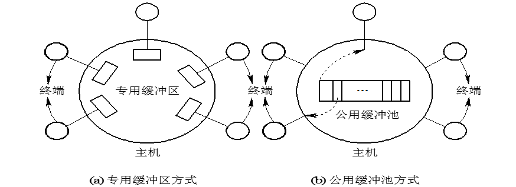
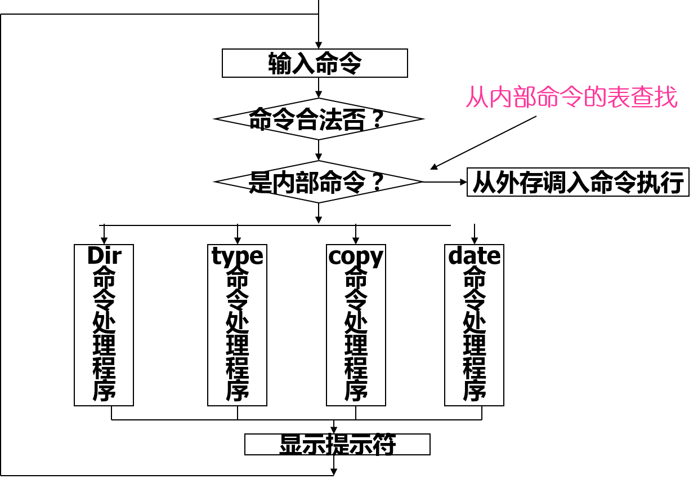
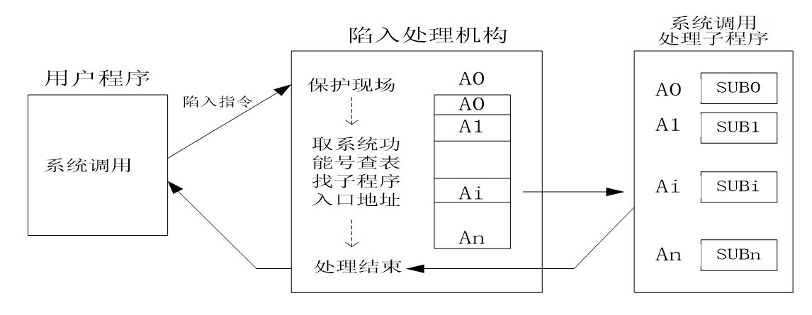

# 操作系统接口
为了使用户能方便地通过操作系统使用计算机，OS向用户提供了各种接口，具体有：
- 命令接口: 命令行
- 系统功能调用（程序接口）
- 图形用户接口

## 1.命令接口
* 联机命令接口：分时、个人OS中，通过终端键入命令，以取得OS的服务，并控制自己作业的运行。该接口包括：
	* 一组联机命令（格式、类型）
	* 终端处理程序
	* 命令解释程序
* 脱机命令接口：用于批处理系统中，由作业控制语言JCL组成，对作业的控制和干预，事先写在作业说明上，然后将作业说明及作业提交系统，照说明上执行，若出现异常，则照说明上进行干预。
### 7.1.1 联机命令接口

## 命令格式

为了能向用户提供多方面的服务，OS通常向用户提供了众多的命令，命令格式和条数与实际的操作系统有关，命令格式分成：

* 命令行方式（一般形式）

  command arg1,arg2,…,\[option 1,…,option m\]

  * MS-DOS操作系统中的命令格式

    1、dir \[驱动器名\]\[\/p\]\[\/w\]

    2、type file1

    3、copy source target

    4、mkdir \[驱动器名\]\[\路径名\新目录名\]

* 批命令方式

  允许用户预先把一系列命令组织在一种称为批命令文件的文件中，一次建立，多次执行。如MS-DOS系统的 .BAT文件。

## 命令类型

根据联机命令的功能，可分为以下几类：

* 系统访问类:包括注册login,注销logout，常用于多用户系统中，以验证用户身份的合法性，从而保证整个系统的安全性。

* 磁盘操作类：包括format,diskcopy,backup,…，常用于微机OS中。

  * Format：磁盘格式化命令。

  * Diskcopy：复制整个软盘命令。

  * Diskcomp：软盘比较命令。

  * Backup：备份命令。

  * 硬盘上的文件复制到软盘上，RESTORE命令则完成相反的操作。

* 文件操作类：包括type,copy,cmp,rename,erase,…常用于微机OS中。

  * type： 将指定文件内容显示在屏幕上。

  * copy： 实现文件的拷贝。

  * comp： 对两个指定文件进行比较。

  * Rename：重新命名。

  * erase： 删除一个或一组文件。

* 目录操作类：包括md,dir,rd,tree,cd,…常用于微机OS中。

  * mkdir： 建立指定名字的新目录。

  * dir： 显示指定磁盘中的目录项。

  * rmdir： 删除子目录命令

  * tree： 显示指定盘上的所有目录路径及其层次关系。

  * chdir： 改变当前目录。

* 其它命令：包括输出重定向&gt;，输入重定向&lt;,批命令，管道连接“\|”，常用于微机OS中。

  \(1\) 输入输出重定向命令。OS中定义了两个标准I\/O设备。命令的输入取自键盘；而命令的输出送往显示终端。在命令中设置输出重定向“&gt;”符，其后接文件名或设备名，表示将命令的输出改向，送到指定文件或设备上。

  \(2\) 管道连接。指把第一条命令的输出信息作为第二条命令的输入信息；与此类推；格式为：

  Command1 \| Command2 \| … \| Commandn;

  \(3\) 过滤命令。

  例如，MS-DOS中用命令 ：find \/N “erase” \(路径名\)

## 7.1.2 终端处理程序

负责接收用户键入的终端命令，并将它显示在终端屏幕上，主要具有以下功能：

* 接收字符：接收用户从终端键入的字符，并将它传送给命令解释程序或用户进程，有两种方式来实现此功能（面向字符方式和面向行方式）。

  * 面向字符方式: 驱动程序只接收从终端打入的字符，并且不加修改地将它传送给用户程序。

  * 面向行方式: 终端处理程序将所接收的字符暂存在行缓冲中，并可对行内字符进行编辑。仅在收到行结束符后，才将一行正确的信息送命令解释程序。

* 字符缓冲：暂存用户键入的字符，该功能可采用两种方式（公用缓冲池方式，专用缓冲方式）。

  * 专用缓冲区方式: 系统为每个终端设置一个缓冲区，长度200字符左右。适合单用户微机或终端很少的多用户机，但利用率低。

  * 公用缓冲池方式：设置一个由多个缓冲区构成的公用缓冲池，缓冲区大小相同，利用率高。所有的空缓冲区链接成一个空缓冲区链（从终端输入数据），装有输入数据的缓冲区链接成一条输入链（向用户程序传送数据）。
    

* 回送显示：将用户每键入的一个字符送屏幕显示，此功能可由硬件实现，但多用软件更灵活。

* 屏幕编辑：方便用户对键入的字符进行编辑，提供了若干编辑键，如backspace,insert,­上下左右方向键,Pgup,Pgdn…。

* 特殊字符处理：提供了对中断字符，停止上卷字符，恢复上卷字符等特殊字符的识别和处理。

  * 中断字符: 程序在运行中出现异常情况时，用户可通过键入中断字符的办法来中止当前程序的运行。在许多系统中是利用Break或Delete或Ctrl+C键作为中断字符。

  * 停止上卷字符：用户键入此字符后，终端处理程序应使正在上卷的屏幕暂停上卷，以便用户仔细观察屏幕内容。在有的系统中，是利用Ctrl+S键来停止屏幕上卷的。

  * 恢复上卷字符：有的系统利用Ctrl+Q键使停止上卷的屏幕恢复上卷。

## 7.1.3 命令解释程序

 主要负责对用户输入的命令进行识别，然后去调用相应命令的处理程序，以完成请求的任务，位于OS的最高层。如：MS-DOS(COMMAND.COM),UNIX([SHELL](https://www.wikiwand.com/en/Shell_(computing))).
- MS-DOS(COMMAND.COM)

    - 命令解释程序的作用

    - 命令解释程序的工作流程

    - 命令解释程序的组成

        - 常驻部分：中断服务子程序；如：int 20 正常退出。
        - 初始化部分：跟随常驻内存部分之后，还包括AUTOEXEC.BAT。
        - 暂存部分：主要是命令解释程序。包括：内部命令处理程序、批文件处理程序，以及装入和执行外部命令的程序。
- UNIX(Shell)：[sh](https://www.wikiwand.com/en/Bourne_shell), [ksh](https://www.wikiwand.com/en/KornShell), [csh](https://www.wikiwand.com/en/C_shell), [tcsh](https://www.wikiwand.com/en/Tcsh), [zsh](https://www.wikiwand.com/en/Z_shell), [bash](https://www.wikiwand.com/en/Bash_(Unix_shell)),

### 命令解释程序的作用 
- 等待用户输入命令。命令解释程序获CPU控制权后，在屏幕上产生提示符，等待用户输入命令。

= 接收并识别命令。当用户输入完一条命令并以回车结束，终端处理程序就将该命令提交命令解释程序，并对此命令进行分析。若命令非法，则产生错误信息。否则转相应的命令处理程序。

- 执行相应的命令处理程序。转到相应的命令处理程序入口地址，再把控制权交给该处理程序去执行。（对内部命令，其命令处理程序就含在解释程序内，所以由解释程序直接执行）。

- 处理结果送屏幕上显示。并将处理结果送屏幕上显示，或显示某些出错信息。

### 命令解释程序的工作流程 

## 2.系统调用接口

### 7.2.1 系统调用简介

系统调用(SYSTEM CALL)，也称程序接口

- 操作系统提供给编程人员的唯一接口，编程人员利用系统调用，完成与机器硬件部分相关的工作。用户得以在程序中调用操作系统所提供的一些子功能。

- OS核心中都有一组实现系统功能的过程（子程序），系统调用就是对上述过程的调用。编程人员利用系统调用，向OS提出服务请求，由OS代为完成。

- 每个系统都有上百种系统调用，涉及进程、文件和设备控制等。

- 系统调用是由特殊的机器指令实现的。

- 系统的系统调用越多，功能就越强，使用更加灵活。

### 7.2.2 系统调用的类型（UNIX） 

不同的操作系统有一定的差异.

- 进程控制

    - 创建一进程（fork）

    - 结束进程（exit）

    - 等待子进程结束（wait）

    - 执行一个文件(exec)

- 文件操纵

    - 创建文件(creat)

    - 打开文件(open)

    - 关闭文件(close)

    - 读文件(read)

    - 写文件(write)
- 进程通信

    - 建立消息队列（msgget）

    - 发送消息（msgsend）

    - 接收消息（msgrcv）)

- 系统维护

    - 设置时间（stime）

    - 获得时间（time）

    - 获得进程和子进程时间（times）

    - 设置文件访问和修改时间（Utime）

    - 获得当前unix系统的名称（Uname）

### 7.2.3 系统调用的实现

#### 7.2.3.1 系统调用的实现-实现机制 

- 当编程人员给定了系统调用名和参数之后，由陷入处理机构（类似于硬件中断处理机构)完成。陷入处理机构是系统专门为控制系统调用服务设立的。

- 当用户使用系统调用时，产生一条相应的指令（陷入指令，trap指令），CPU在执行到该指令时发生相应的中断，发出有关信号给该处理机构，并启动相应的处理程序来完成该系统调用所要求的功能。

- 陷入指令（或访管指令）:由于系统调用引起处理机中断的指令。

- 在陷入中断发生时，从用户态－>核心态。这一转换在发生访管中断时由硬件自动实现。

- 系统调用语句本身是硬件提供的（机器指令），但其所调用的功能是操作系统提供的。每种机器的机器指令集中都有一条系统调用指令。（IBM个人计算机INT指令，SUN工作站上的TRAP，SGI工作站上SYSCALL指令）。

#### 7.2.3.2 执行过程

- 保护用户程序的现场；

- 执行相应功能：根据系统调用提供的功能号，访问系统功能入口地址表，得到相应功能的人口地址，然后转去执行；

- 返回处理：在系统调用处理结束之后，还要恢复处理器现场。在操作系统中，处理器的现场一般被保护在特定的内存区或寄存器中。

#### 7.2.3.3 参数传递
- 目的：实现用户程序和系统程序间的参数传递。

- 常用实现方法：

    - 由陷入指令自带参数：陷入指令的长度有限的，且还要携带系统调用功能号，只能自带有限的参数。

    - 通过有关通用寄存器来传递参数：这些寄存器应是系统程序和用户程序都能访问，由于寄存器长度较短，无法传递较多的参数。

    - 更为常见的是在内存中开辟专用堆栈区来传递参数。

#### 7.2.3.4 系统调用与过程调用的区别

- 相同点：

    - 改变指令流程

    - 重复执行和公用

    - 改变指令流程后需要返回原处

- 不同点：

    - 运行在不同的系统状态

        - 一般过程调用，其调用程序和被调用程序都运行在相同状态：核心态或用户态。

        - 系统调用：调用程序在用户态，被调用程序在系统态。

    - 进入方式不同，状态的转换

        - 通常利用call 或jump 指令进入普通的过程调用，而进行系统调用则需要利用int或trap指令通过软中断进入 。

        - 一般的过程调用不涉及系统状态的转换，可直接由调用过程转向被调用过程。

        - 运行系统调用时，调用和被调用过程在不同系统状态，不允许由调用过程直接转向被调用过程。

        - 通过软中断机制先由用户态转换为核心态。

        - 在OS核心分析后，转向相应的系统调用处理子程序。
    - 返回方式不尽相同

        - 一般过程调用在被调用过程执行完后，返回调用过程。

        - 抢占式调度的系统中，被调用过程执行完后，系统将对所有要求运行的进程进行优先级分析。如果调用进程仍有最高优先级，则返回到调用进程执行。

        - 否则，引起重新调度，让优先级最高的进程优先执行。此时，系统把调用进程放入就绪队列。

    - 被调用代码的位置也有所不同

        - 系统调用是动态调用，其调用位置和返回位置都是不固定的。由于同一程序中不包含被调用代码 。

        - 一般过程调用属静态调用，被调用代码与调用代码在同一程序之内。

    - 注意：系统调用也允许嵌套调用，但每个系统对嵌套调用的深度会有限制。

#### 7.2.3.5 win32应用程序接口

- 在Windows中，定义了一系列程序(应用程序接口Win32 API) ，提供OS服务。

- 该接口（部分）支持Win95 以后的Windows版本Win32 API调用的种类非常多，以千计算。

- 在Windows中不好分辨哪些是系统调用（被内核执行），哪些是用户空间的库调用。

- 事实上，一个Windows版本中的系统调用也许在另一个Windows版本中会在用户空间执行。

- 由于图形子系统在内核中运行（在某些Windows版本中），它们也是系统调用，否则是库调用。

## 3.图形用户接口

图形接口：该接口采用了图形化的操作界面，它用图标将系统的各项功能 、各种应用程序和文件直观、逼真地表示出来。用户可通过图标、菜单、对话框及鼠标和键盘，轻松地完成对应用程序和文件的操作。

## 图形用户接口元素 
- 图标 ：是代表一个对象的小图像，可表示一个程序、文件或文件夹。对图标的点击可启动相应的程序（文件、文件夹）。
- 菜单：有菜单栏、弹出式菜单和下拉式菜单三种类型。每种菜单常含有若干个菜单项，而每个菜单项对应于相关的命令或功能。
- 对话框：是一种特殊的窗口，其大小是固定的，无工具栏，主要用于实现人机对话。各对话框大小、形状各异 
- 窗口：由边框、标题栏、菜单栏、工具栏、控制菜单按钮、最小（大）按钮、关闭按钮、滚动条和工作区组成。

    - 双击可打开相应窗口。允许同时打开多个窗口，但只有一个处于激活状态（最后打开的窗口），在前台运行。

    - 窗口的大小可改变

## 图形用户接口的基本操作 
- 菜单操作

    - 选择和关闭程序菜单

    - 选择菜单命令

    - 对控制菜单的操作

- 窗口操作

    - 移动窗口和图标

    - 改变窗口的多种操作

    - 使用滚动条

    - 关闭窗口

- 对话框操作

    - 选择对话框

    - 移动对话框

    - 列表框操作

    - 按钮操作

# 7.1-联机命令接口

