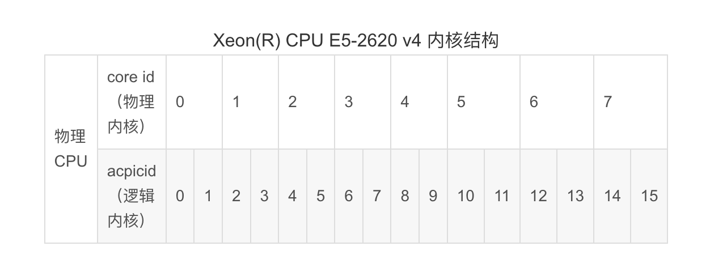

Linux里是“命令行+文件”模式


自己知道想干什么，但不知道哪个命令可以干怎么办？我们可以通过man -k key1|grep key2| grep key...进行搜索，man -k 或apropos是我认为学习linux命令优先掌握的命令，这样你就可以自己搜索了，相当于google,baidu, 大家可以参考【别出心裁的Linux命令学习法】(https://www.cnblogs.com/rocedu/p/4902411.html)

推荐一个工具给大家：https://github.com/tldr-pages/tldr
tl;dr 的意思是 too long; dont read，这个工具可以用来查常用的linux命令，比man更友好一些，大多数时候用这个就够了，找不到再man或者google。

环境变量不是写在 .bash_profile里面吗？和.bashrc有区别吗？

.bash_profile是系统配置信息存储文件，写在里面的系统变量是所有用户共用的，而.bashrc是个人的配置信息存储文件，只是单用户有效。也就是说，配置了.bashrc后切换用户可能需要重新配置系统变量。

/etc/profile是干嘛的


## LINUX命令

linux命令大全: [http://man.linuxde.net/](http://man.linuxde.net/)

命令基本格式

```shell
cmd [options][arguements]
```

- cmd: 命令名
- options: 选项
- argumenrs :参数

通配符

| *  | 匹配任何字符和任何数目的字符 | ls*.conf               ls /home/*.txt  ls h*.config |
| -- | ---------------------------- | ----------------------------------------------------------------- |
| ？ | 匹配单一数目的任何数目的字符 | ls test?.aa                                                       |
| [] | 匹配中括号之内的任意一个字符 | ls [abc]*                                                         |

获得命令帮助

| 通过命令参数直接查看帮助 | ls --help |
| ------------------------ | --------- |
| 使用main命令获得帮助     | main ls   |
| 使用info命令获得帮助     | info ls   |

基本命令操作

| 注销用户 | Logout   |
| -------- | -------- |
| 关机     | Shutdown |
| 重启     | reboot   |

命令补全：

    table键

    命令补全

    目录名称补全（目录名称都有/标识：sysconfig/） cd e -> cd etc/sys

    文件补全 cat h -> cat h1.txt

    实例

    cd h

    若按两次`<tab><tab>`按后，系统发出蜂鸣声无法补齐，通常是已经输入的部分有错误。

命令历史

    上下方向键

    用history命令来显示历史命令

    用！！执行最近执行过的命令 （执行上一次输入的命令）

    用！执行已经执行过的命令 （）


# Linux命令

linux命令大全: [http://man.linuxde.net/](http://man.linuxde.net/)

# 系统监视
* 系统监控命令top：能显示实时的进程列表，而且还能实时监视系统资源，包括内存、交换分区和CPU的使用率等。
* 内存查看命令free
* 磁盘空间用量查看命令df


## top

linux下的任务管理器

   top命令是Linux下常用的性能分析工具，能够实时显示系统中各个进程的资源占用状况，类似于Windows的任务管理器。top是一个动态显示过程,即可以通过用户按键来不断刷新当前状态.如果在前台执行该命令,它将独占前台,直到用户终止该程序为止.比较准确的说,top命令提供了实时的对系统处理器的状态监视.它将显示系统中CPU最“敏感”的任务列表.该命令可以按CPU使用.内存使用和执行时间对任务进行排序；而且该命令的很多特性都可以通过交互式命令或者在个人定制文件中进行设定。

```sh
 $top
   top - 09:14:56 up 264 days, 20:56, 1 user, load average: 0.02, 0.04, 0.00
   Tasks:  87 total,  1 running, 86 sleeping,  0 stopped,  0 zombie
   Cpu(s): 0.0%us, 0.2%sy, 0.0%ni, 99.7%id, 0.0%wa, 0.0%hi, 0.0%si, 0.2%st
   Mem:    377672k total,  322332k used,  55340k free,  32592k buffers
   Swap:   397308k total,  67192k used,  330116k free,  71900k cached
   PID USER   PR NI VIRT RES SHR S %CPU %MEM  TIME+   COMMAND
     1 root   20  0 2856 656 388 S  0.0  0.2  0:49.40 init
     2 root   20  0   0   0   0  S  0.0  0.0  0:00.00 kthreadd
     3 root   20  0   0   0   0  S  0.0  0.0  7:15.20 ksoftirqd/0
     4 root   RT  0   0   0   0  S  0.0  0.0  0:00.00 migration/0
```

**第一行**

* 09:14:56 ： 系统当前时间
* 264 days, 20:56 ： 系统开机到现在经过了多少时间
* 1 users ： 当前2用户在线
* load average: 0.02, 0.04, 0.00： 系统1分钟、5分钟、15分钟的CPU负载信息

**第二行**

* Tasks：任务;
* 87 total：很好理解，就是当前有87个任务，也就是87个进程。
* 1 running：1个进程正在运行
* 86 sleeping：86个进程睡眠
* 0 stopped：停止的进程数
* 0 zombie：僵死的进程数

**第三行**

* Cpu(s)：表示这一行显示CPU总体信息
* 0.0%us：用户态进程占用CPU时间百分比，不包含renice值为负的任务占用的CPU的时间。
* 0.7%sy：内核占用CPU时间百分比
* 0.0%ni：改变过优先级的进程占用CPU的百分比
* 99.3%id：空闲CPU时间百分比
* 0.0%wa：等待I/O的CPU时间百分比
* 0.0%hi：CPU硬中断时间百分比
* 0.0%si：CPU软中断时间百分比
* 注：这里显示数据是所有cpu的平均值，如果想看每一个cpu的处理情况，按1即可；折叠，再次按1；

**第四行**

* Men：内存的意思
* 8175320kk total：物理内存总量
* 8058868k used：使用的物理内存量
* 116452k free：空闲的物理内存量
* 283084k buffers：用作内核缓存的物理内存量

**第五行**

* Swap：交换空间
* 6881272k total：交换区总量
* 4010444k used：使用的交换区量
* 2870828k free：空闲的交换区量
* 4336992k cached：缓冲交换区总量

**进程信息**: 再下面就是进程信息：

* PID：进程的ID
* USER：进程所有者
* PR：进程的优先级别，越小越优先被执行
* NInice：值
* **VIRT：进程占用的虚拟内存**
* **RES： 进程占用的物理内存**
* SHR：进程使用的共享内存
* S：进程的状态。S表示休眠，R表示正在运行，Z表示僵死状态，N表示该进程优先值为负数
* %CPU：进程占用CPU的使用率
* %MEM：进程使用的物理内存和总内存的百分比
* TIME+：该进程启动后占用的总的CPU时间，即占用CPU使用时间的累加值。
* COMMAND：进程启动命令名称

**top命令交互操作指令**:下面列出一些常用的 top命令操作指令

* q：退出top命令
* `<Space>`：立即刷新
* s：设置刷新时间间隔
* c：显示命令完全模式
* t:：显示或隐藏进程和CPU状态信息
* m：显示或隐藏内存状态信息
* l：显示或隐藏uptime信息
* f：增加或减少进程显示标志
* S：累计模式，会把已完成或退出的子进程占用的CPU时间累计到父进程的MITE+
* P：按%CPU使用率排行
* T：按MITE+排行
* **M：按%MEM排行**
* e: 调整内存显示单位m/G
* **u：指定显示用户进程**
* r：修改进程renice值
* kkill：进程
* i：只显示正在运行的进程
* W：保存对top的设置到文件^/.toprc，下次启动将自动调用toprc文件的设置。
* h：帮助命令。

注：强调一下，使用频率最高的是P、T、M，因为通常使用top，我们就想看看是哪些进程最耗cpu资源、占用的内存最多； 注：通过”shift + >”或”shift + <”可以向右或左改变排序列

如果只需要查看内存：可用free命令。

只查看uptime信息（第一行），可用uptime命令；


## 1. 进程管理命令

#### 6.1进程查看命令 ps

```shell
ps [选项]
```

主要选项的含义如下：

```shell
-e：显示所有进程；

-h：不显示标题；

-l ：采用详细的格式来显示进程；

-a：显示所有终端上的进程，包括其他用户的进程；

-r ：只显示当前终端上正在运行的进程；

-x：显示所有进程，不以终端来区分；

-u：以用户为主的格式来显示进程； 

-f 显示完整格式程序信息

-F 显示完整格式的进程信息

-H以进程层级格式显示进程相关信息

-aux  包括了cpu,内存等使用率  （常用）

-ef （常用）

-eFH （常用）
```

#### 6.2删除进程命令kill

```shell
kill [-s <信号>| -p] <进程号> ...
kill -l [信号]
```

选项的含义如下：

```shell
-s：指定需要送出的信号。既可以是信号名也可以是信号名对应的数字。

-p：指定kill命令只显示命名进程的pid， 并不真正送出任何信号。

-l： 显示信号名称列表，该列表也可以在/usr/include/linux/signal.h文件中找到。
```

常用信号：

1) SIGHUP: 无须关闭进程而让其重读配置文件；
2) SIGINT: 中止正在运行的进程；相当于Ctrl+c；
3) SIGKILL: 杀死正在运行的进程；
4) SIGTERM：终止正在运行的进程；
5) SIGCONT：
6) SIGSTOP：

指定信号的方法：

(1) 信号的数字标识；1, 2, 9

(2) 信号完整名称；SIGHUP

(3) 信号的简写名称；HUP

 

来自[[http://www.178linux.com/48528](http://www.178linux.com/48528)](%5Bhttp://www.178linux.com/48528%5D(http://www.178linux.com/48528))

 

#### 6.3删除进程killall

#### 6.4 总结Linux中用于终结进程的kill和pikill及killall命令用法

[http://www.jb51.net/LINUXjishu/420508.html](http://www.jb51.net/LINUXjishu/420508.html)

 

 


#### 4、进程管理命令之pstree

   pstree – display a tree of processes

   显示进程数

#### 6、进程管理命令之pkill

   pkill [options] pattern    

        -u uid: effective user

        -U uid: real user

        -t terminal: 与指定终端相关的进程

        -l: 显示进程名

        -a: 显示完整格式的进程名

        -P pid: 显示其父进程为此处指定的进程的进程列表

#### 7、进程管理命令之pidof

   根据进程名获取其PID

#### 8、进程管理命令之top

系统监控命令top ：
  能显示实时的进程列表，而且还能实时监视系统资源，包括内存、交换分区和CPU的使用率等。

top命令的一般格式是：
```
top [d <间隔秒数>] [n <执行次数>]
```


Tasks

| total    | 进程总数     |
| -------- | ------------ |
| running  | 运行进程数   |
| sleeping | 休眠态进程数 |
| stopped  | 停止态进程数 |
| zobie    | 僵死态进程数 |

%Cpu(s)

| us(user space)         | 用户空间占用CPU百分比                            |
| ---------------------- | ------------------------------------------------ |
| sy(system)             | 内核空间占用CPU百分比   注：高负载时：us:sy=7:3 |
| ni(nice)               | 修改nice值占用的CPU百分比                        |
| id(idle)               | 空闲的CPU百分比                                  |
| wa(wait)               | 等待IO完成占用的CPU百分比                        |
| hi(hardware interrupt) | 硬中断占用CPU百分比                              |
| si(software interrupt) | 软中断占用CPU百分比                              |
| st(stole)              | 被偷走的CPU，比如VMware                          |

| buffer(缓冲) | 元数据 |
| ------------ | ------ |
| cache(缓存)  | 数据   |

| PID          | 进程号     |
| ------------ | ---------- |
| USER         | 进程发起者 |
| PR(priority) | 优先级     |
| NI(Nice)     | nice值     |
| VIRT         | 虚拟内存集 |
| RES          | 常驻内存集 |
| SHR          | 共享内存集 |
| S(status)    | 状态       |
| %CPU         | CPU占用比  |
| %MEM         | 内存占用比 |
| TIME+        | 运行时长   |
| COMMAND      | 启动进程   |

对显示排序的方法：

| P | 占据的CPU百分比 |
| - | --------------- |
| M | 占据内存百分比  |
| T | 累积占据CPU时长 |

首部信息显示：

| l     | uptime信息       |
| ----- | ---------------- |
| t     | tasks及cpu信息   |
| `#数字` | cpu分别显示      |
| m     | memory信息       |
| s     | 修改刷新时间间隔 |
| Esc   | 退出             |
| k     | 终止指定进程     |
| W     | 保存文件         |
| q     | 退出命令         |

#### 9、进程管理命令之htop   

比top更加高级的进程管理软件

f1帮助

f2切换CPU、mem、swap显示方式

f10退出

    常用选项：

       -d #: 指定延迟时间；

       -u UserName:仅显示指定用户的进程；

       -s COLOMN:以指定字段进行排序；

   命令：

       s: 跟踪选定进程的系统调用；

       l: 显示选定进程打开的文件列表；

       a：将选定的进程绑定至某指定CPU核心；

       t: 显示进程树

   注意：Fedora-EPEL源

 

#### 10、进程管理命令之vmstat 

vmstat-s: 内存的汇总信息

| procs | 项目                                             |
| ----- | ------------------------------------------------ |
| r     | 等待运行的进程的个数，和核心数有关               |
| b     | 处于不可中断睡眠态的进程个数(被阻塞的队列的长度) |

| swap | 项目                             |
| ---- | -------------------------------- |
| si   | 从磁盘交换进内存的数据速率(kb/s) |
| so   | 从内存交换至磁盘的数据速率(kb/s) |

| io | 项目                                           |
| -- | ---------------------------------------------- |
| bi | 从块设备读入数据到内存的速率(kb/s)    读     |
| bo | 从内存写入磁盘的速率(kb/s)            写 |

| memory | 项目                 |
| ------ | -------------------- |
| swad   | 交换内存的使用总量   |
| free   | 空闲物理内存总量     |
| buffer | 用于buffer的内存总量 |
| cache  | 用于cache的内存总量  |

| system             | 项目         |
| ------------------ | ------------ |
| in: interrupts     | 中断速率     |
| cs: context switch | 进程切换速率 |

| cpu | 项目                       |
| --- | -------------------------- |
| us  | 用户空间占用的比例         |
| sy  | 内核空间占用的比例         |
| id  | 空闲空间占用的比例         |
| wa  | 等待IO完成所消耗的时间比例 |
| st  | 被虚拟化技术偷走的时间比例 |

 

来自[[http://www.178linux.com/48528](http://www.178linux.com/48528)](%5Bhttp://www.178linux.com/48528%5D(http://www.178linux.com/48528))

 

 

#### 11、进程管理命令之glances

glances [-bdehmnrsvyz1][-B bind] [-c server][-C conffile] [-p port][-P password] [–password][-t refresh] [-f file][-ooutput]

内建命令：

  a  Sort processesautomatically     l  Show/hide logs

  c  Sort processes by CPU%          b  Bytes or bits for network I/O

  m  Sort processes by MEM%          w  Delete warning logs

  p  Sort processes by name          x  Delete warning and critical logs

  i  Sort processes by I/O rate      1  Global CPU or per-CPU stats

  d  Show/hide disk I/O stats        h  Show/hide this help screen

  f  Show/hide file system stats     t  View network I/O as combination

  n  Show/hide network stats         u  View cumulative network I/O

  s  Show/hide sensors stats         q  Quit (Esc and Ctrl-C also work)

  y  Show/hide hddtemp stats

常用选项：

-b: 以Byte为单位显示网卡数据速率；

-d: 关闭磁盘I/O模块；

-f /path/to/somefile: 设定输入文件位置；

-o {HTML|CSV}：输出格式；

-m: 禁用mount模块

-n: 禁用网络模块

-t #: 延迟时间间隔

-1：每个CPU的相关数据单独显示；

C/S模式下运行glances命令：

服务模式：

glances -s -B IPADDR

IPADDR: 指明监听于本机哪个地址

客户端模式：

glances -c IPADDR

IPADDR：要连入的服务器端地址

 

来自[[http://www.178linux.com/48528](http://www.178linux.com/48528)](%5Bhttp://www.178linux.com/48528%5D(http://www.178linux.com/48528))

 

 

#### 12、进程管理命令之dstat

      dstat [-afv][options..] [delay [count]]

-c: 显示cpu相关信息；

-C #,#,…,total

-d: 显示disk相关信息；

-D total,sda,sdb,…

-g：显示page相关统计数据；

-m: 显示memory相关统计数据；

-n: 显示network相关统计数据；

-p: 显示process相关统计数据；

-r: 显示io请求相关的统计数据；

-s: 显示swapped相关的统计数据；

–top-cpu：显示最占用CPU的进程；

–top-io: 显示最占用io的进程；

–top-mem: 显示最占用内存的进程；

–top-lantency: 显示延迟最大的进程；

 

 

来自[[http://www.178linux.com/48528](http://www.178linux.com/48528)](%5Bhttp://www.178linux.com/48528%5D(http://www.178linux.com/48528))

 

## CPU

在linux系统中，提供了/proc目录下文件，显示系统的软硬件信息

物理CPU、核数、逻辑cpu数的概念:

①物理CPU数（physical id）：主板上实际插入的cpu数量，可以数不重复的 physical id 有几个

②CPU核心数（cpu cores）：单块CPU上面能处理数据的芯片组的数量，如双核、四核等

③逻辑CPU数：一般情况下，

　　逻辑CPU=物理CPU个数×每颗核数   　# 不支持超线程技术或没有开启次技术

　　逻辑CPU=物理CPU个数×每颗核数 *2 　 # 表示服务器的CPU支持超线程技术（简单来说，它可使处理器中的1 颗内核如2 颗内核那样在操作系统中发挥作用。这样一来，操作系统可使用的执行资源扩大了一倍，大幅提高了系统的整体性能）




### 查看cpu相关信息 `cat /proc/cpuinfo`

**1)查看cpu信息**

```
[root@fp-web-126 ~]# cat /proc/cpuinfo 
信息包括有 cpu型号 Intel(R) Xeon(R) CPU E5-2660 v3 @ 2.60GHz，2个cpu，8核
指令集是64bit
机器配置8核、16G
```

```sh
[root@fp-web-126 ~]cat /proc/cpuinfo # 查看cpu相关信息
-------------------------------------cpu1,4核------------------------------------------------------------
processor : 0 # 系统中逻辑处理核的编号,从0开始排序。
vendor_id : GenuineIntel # CPU制造商
cpu family : 6 # CPU产品系列代号
model : 63 # CPU属于其系列中的哪一代的代号
model name : Intel(R) Xeon(R) CPU E5-2660 v3 @ 2.60GHz 英特尔至强处理器,主频:2.6 GHz, 产品型号 E5-2660 # CPU属于的名字及其编号、标称主频
stepping : 2 # CPU属于制作更新版本
microcode : 0x38
cpu MHz : 2593.993 # CPU的实际使用主频
cache size : 25600 KB # CPU二级缓存大小
physical id : 0 # 单个物理CPU的标号
siblings : 4 # 单个物理CPU的逻辑CPU数。siblings=cpu cores [*2], 可理解为同一时刻最大并发线程数
core id : 0 #当前物理核在其所处CPU中的编号，这个编号不一定连续
cpu cores : 4 # 该逻辑核所处CPU的物理核数。比如此处cpu cores 是4个，那么对应core id 可能是 1、3、4、5
apicid : 0 # 用来区分不同逻辑核的编号，系统中每个逻辑核的此编号必然不同，此编号不一定连续
initial apicid : 0
fpu : yes # 是否具有浮点运算单元（Floating Point Unit）
fpu_exception : yes # 是否支持浮点计算异常
cpuid level : 15 # 执行cpuid指令前，eax寄存器中的值，根据不同的值cpuid指令会返回不同的内容
wp : yes # 表明当前CPU是否在内核态支持对用户空间的写保护（Write Protection）
flags : fpu vme de pse tsc msr pae mce cx8 apic sep mtrr pge mca cmov pat pse36 clflush dts mmx fxsr sse sse2 ss ht syscall nx pdpe1gb rdtscp lm constant_tsc arch_perfmon pebs bts nopl xtopology tsc_reliable nonstop_tsc aperfmperf eagerfpu pni pclmulqdq ssse3 fma cx16 pcid sse4_1 sse4_2 x2apic movbe popcnt tsc_deadline_timer aes xsave avx f16c rdrand hypervisor lahf_lm abm arat epb pln pts dtherm fsgsbase tsc_adjust bmi1 avx2 smep bmi2 invpcid xsaveopt # 当前CPU支持的功能
bogomips : 5187.98 # 在系统内核启动时粗略测算的CPU速度（Million Instructions Per Second
clflush size : 64 # 每次刷新缓存的大小单位
cache_alignment : 64 # 缓存地址对齐单位
address sizes : 42 bits physical, 48 bits virtual # 可访问地址空间位数
power management: # 对能源管理的支持

processor : 1 ####逻辑id
vendor_id : GenuineIntel ###因特尔原装CPU
cpu family : 6
model : 63
model name : Intel(R) Xeon(R) CPU E5-2660 v3 @ 2.60GHz
stepping : 2
microcode : 0x38
cpu MHz : 2593.993

cache size : 25600 KB
physical id : 0
siblings : 4
core id : 1
cpu cores : 4
apicid : 1
initial apicid : 1
fpu : yes
fpu_exception : yes
cpuid level : 15
wp : yes
flags : fpu vme de pse tsc msr pae mce cx8 apic sep mtrr pge mca cmov pat pse36 clflush dts mmx fxsr sse sse2 ss ht syscall nx pdpe1gb rdtscp lm constant_tsc arch_perfmon pebs bts nopl xtopology tsc_reliable nonstop_tsc aperfmperf eagerfpu pni pclmulqdq ssse3 fma cx16 pcid sse4_1 sse4_2 x2apic movbe popcnt tsc_deadline_timer aes xsave avx f16c rdrand hypervisor lahf_lm abm arat epb pln pts dtherm fsgsbase tsc_adjust bmi1 avx2 smep bmi2 invpcid xsaveopt
bogomips : 5187.98
clflush size : 64
cache_alignment : 64
address sizes : 42 bits physical, 48 bits virtual
power management:

processor : 2 #系统中逻辑处理核的编号
vendor_id : GenuineIntel
cpu family : 6
model : 63
model name : Intel(R) Xeon(R) CPU E5-2660 v3 @ 2.60GHz
stepping : 2
microcode : 0x38
cpu MHz : 2593.993
cache size : 25600 KB
physical id : 0
siblings : 4
core id : 2
cpu cores : 4
apicid : 2
initial apicid : 2
fpu : yes
fpu_exception : yes
cpuid level : 15
wp : yes
flags : fpu vme de pse tsc msr pae mce cx8 apic sep mtrr pge mca cmov pat pse36 clflush dts mmx fxsr sse sse2 ss ht syscall nx pdpe1gb rdtscp lm constant_tsc arch_perfmon pebs bts nopl xtopology tsc_reliable nonstop_tsc aperfmperf eagerfpu pni pclmulqdq ssse3 fma cx16 pcid sse4_1 sse4_2 x2apic movbe popcnt tsc_deadline_timer aes xsave avx f16c rdrand hypervisor lahf_lm abm arat epb pln pts dtherm fsgsbase tsc_adjust bmi1 avx2 smep bmi2 invpcid xsaveopt
bogomips : 5187.98
clflush size : 64
cache_alignment : 64
address sizes : 42 bits physical, 48 bits virtual
power management:

processor : 3 #系统中逻辑处理核的编号
vendor_id : GenuineIntel
cpu family : 6
model : 63
model name : Intel(R) Xeon(R) CPU E5-2660 v3 @ 2.60GHz
stepping : 2
microcode : 0x38
cpu MHz : 2593.993
cache size : 25600 KB
physical id : 0
siblings : 4
core id : 3
cpu cores : 4
apicid : 3
initial apicid : 3
fpu : yes
fpu_exception : yes
cpuid level : 15
wp : yes
flags : fpu vme de pse tsc msr pae mce cx8 apic sep mtrr pge mca cmov pat pse36 clflush dts mmx fxsr sse sse2 ss ht syscall nx pdpe1gb rdtscp lm constant_tsc arch_perfmon pebs bts nopl xtopology tsc_reliable nonstop_tsc aperfmperf eagerfpu pni pclmulqdq ssse3 fma cx16 pcid sse4_1 sse4_2 x2apic movbe popcnt tsc_deadline_timer aes xsave avx f16c rdrand hypervisor lahf_lm abm arat epb pln pts dtherm fsgsbase tsc_adjust bmi1 avx2 smep bmi2 invpcid xsaveopt
bogomips : 5187.98
clflush size : 64
cache_alignment : 64
address sizes : 42 bits physical, 48 bits virtual
power management:

-------------------------------------cpu2,4核------------------------------------------------------------
processor : 4 #系统中逻辑处理核的编号
vendor_id : GenuineIntel
cpu family : 6
model : 63
model name : Intel(R) Xeon(R) CPU E5-2660 v3 @ 2.60GHz
stepping : 2
microcode : 0x38
cpu MHz : 2593.993
cache size : 25600 KB
physical id : 1 ##单个CPU的标号
siblings : 4 ##单个CPU逻辑物理核数
core id : 0 ##当前物理核在其所处CPU中的编号，这个编号不一定连续
cpu cores : 4 ##该逻辑核所处CPU的物理核数
apicid : 4 ##用来区分不同逻辑核的编号，系统中每个逻辑核的此编号必然不同，此编号不一定连续
initial apicid : 4
fpu : yes ##是否具有浮点运算单元
fpu_exception : yes ##是否支持浮点计算异常
cpuid level : 15 ##执行cpuid指令前，eax寄存器中的值，根据不同的值cpuid指令会返回不同的内容
wp : yes
flags : fpu vme de pse tsc msr pae mce cx8 apic sep mtrr pge mca cmov pat pse36 clflush dts mmx fxsr sse sse2 ss ht syscall nx pdpe1gb rdtscp lm constant_tsc arch_perfmon pebs bts nopl xtopology tsc_reliable nonstop_tsc aperfmperf eagerfpu pni pclmulqdq ssse3 fma cx16 pcid sse4_1 sse4_2 x2apic movbe popcnt tsc_deadline_timer aes xsave avx f16c rdrand hypervisor lahf_lm abm arat epb pln pts dtherm fsgsbase tsc_adjust bmi1 avx2 smep bmi2 invpcid xsaveopt
bogomips : 5187.98
clflush size : 64
cache_alignment : 64
address sizes : 42 bits physical, 48 bits virtual
power management:

processor : 5 #系统中逻辑处理核的编号
vendor_id : GenuineIntel
cpu family : 6
model : 63
model name : Intel(R) Xeon(R) CPU E5-2660 v3 @ 2.60GHz
stepping : 2
microcode : 0x38
cpu MHz : 2593.993
cache size : 25600 KB
physical id : 1
siblings : 4
core id : 1
cpu cores : 4
apicid : 5
initial apicid : 5
fpu : yes
fpu_exception : yes
cpuid level : 15
wp : yes
flags : fpu vme de pse tsc msr pae mce cx8 apic sep mtrr pge mca cmov pat pse36 clflush dts mmx fxsr sse sse2 ss ht syscall nx pdpe1gb rdtscp lm constant_tsc arch_perfmon pebs bts nopl xtopology tsc_reliable nonstop_tsc aperfmperf eagerfpu pni pclmulqdq ssse3 fma cx16 pcid sse4_1 sse4_2 x2apic movbe popcnt tsc_deadline_timer aes xsave avx f16c rdrand hypervisor lahf_lm abm arat epb pln pts dtherm fsgsbase tsc_adjust bmi1 avx2 smep bmi2 invpcid xsaveopt
bogomips : 5187.98
clflush size : 64
cache_alignment : 64
address sizes : 42 bits physical, 48 bits virtual
power management:

processor : 6 #系统中逻辑处理核的编号
vendor_id : GenuineIntel
cpu family : 6
model : 63
model name : Intel(R) Xeon(R) CPU E5-2660 v3 @ 2.60GHz
stepping : 2
microcode : 0x38
cpu MHz : 2593.993
cache size : 25600 KB
physical id : 1
siblings : 4
core id : 2
cpu cores : 4
apicid : 6
initial apicid : 6
fpu : yes
fpu_exception : yes
cpuid level : 15
wp : yes
flags : fpu vme de pse tsc msr pae mce cx8 apic sep mtrr pge mca cmov pat pse36 clflush dts mmx fxsr sse sse2 ss ht syscall nx pdpe1gb rdtscp lm constant_tsc arch_perfmon pebs bts nopl xtopology tsc_reliable nonstop_tsc aperfmperf eagerfpu pni pclmulqdq ssse3 fma cx16 pcid sse4_1 sse4_2 x2apic movbe popcnt tsc_deadline_timer aes xsave avx f16c rdrand hypervisor lahf_lm abm arat epb pln pts dtherm fsgsbase tsc_adjust bmi1 avx2 smep bmi2 invpcid xsaveopt
bogomips : 5187.98
clflush size : 64
cache_alignment : 64
address sizes : 42 bits physical, 48 bits virtual
power management:

processor : 7 #系统中逻辑处理核的编号
vendor_id : GenuineIntel
cpu family : 6 #CPU产品系列代号
model : 63 #CPU属于其系列中的哪一代的代号
model name : Intel(R) Xeon(R) CPU E5-2660 v3 @ 2.60GHz
stepping : 2 #CPU属于制作更新版本
microcode : 0x38
cpu MHz : 2593.993 ##CPU的实际使用主频
cache size : 25600 KB ##CPU二级缓存大小
physical id : 1 ##单个CPU的标号
siblings : 4
core id : 3
cpu cores : 4
apicid : 7
initial apicid : 7
fpu : yes
fpu_exception : yes
cpuid level : 15
wp : yes
flags : fpu vme de pse tsc msr pae mce cx8 apic sep mtrr pge mca cmov pat pse36 clflush dts mmx fxsr sse sse2 ss ht syscall nx pdpe1gb rdtscp lm constant_tsc arch_perfmon pebs bts nopl xtopology tsc_reliable nonstop_tsc aperfmperf eagerfpu pni pclmulqdq ssse3 fma cx16 pcid sse4_1 sse4_2 x2apic movbe popcnt tsc_deadline_timer aes xsave avx f16c rdrand hypervisor lahf_lm abm arat epb pln pts dtherm fsgsbase tsc_adjust bmi1 avx2 smep bmi2 invpcid xsaveopt
bogomips : 5187.98
clflush size : 64
cache_alignment : 64
address sizes : 42 bits physical, 48 bits virtual
power management:

------------------------------------------------------------------------------------------------------------------------------------------------------------------------------------

以上输出项的含义如下：
processor　：系统中逻辑处理核的编号。对于单核处理器，则课认为是其CPU编号，对于多核处理器则可以是物理核、或者使用超线程技术虚拟的逻辑核
vendor_id　：CPU制造商 
cpu family　：CPU产品系列代号
model　　　：CPU属于其系列中的哪一代的代号
model name：CPU属于的名字及其编号、标称主频
stepping　 ：CPU属于制作更新版本
cpu MHz　 ：CPU的实际使用主频
cache size ：CPU二级缓存大小
physical id ：单个CPU的标号
siblings ：单个CPU逻辑物理核数
core id ：当前物理核在其所处CPU中的编号，这个编号不一定连续
cpu cores ：该逻辑核所处CPU的物理核数
apicid ：用来区分不同逻辑核的编号，系统中每个逻辑核的此编号必然不同，此编号不一定连续
fpu ：是否具有浮点运算单元（Floating Point Unit）
fpu_exception ：是否支持浮点计算异常
cpuid level ：执行cpuid指令前，eax寄存器中的值，根据不同的值cpuid指令会返回不同的内容
wp ：表明当前CPU是否在内核态支持对用户空间的写保护（Write Protection）
flags ：当前CPU支持的功能
bogomips ：在系统内核启动时粗略测算的CPU速度（Million Instructions Per Second）
clflush size ：每次刷新缓存的大小单位
cache_alignment ：缓存地址对齐单位
address sizes ：可访问地址空间位数
power management ：对能源管理的支持
```

### **查看cpu信息概要** `lscpu`

```sh
[root@ht2 src]# lscpu
Architecture:          x86_64  #x86架构下的64位
CPU op-mode(s):        32-bit, 64-bit  #表示支持运行模式，getconf LONG_BIT 命令可以得到当前CPU运行在什么模式下，如果是64，但不代表CPU不支持32bi
Byte Order:            Little Endian #Intel的机器（X86平台）一般都采用小端,Little Endian代表小段字节对齐
CPU(s):                80  #逻辑cpu颗数
On-line CPU(s) list:   0-79 #正在运行的cpu逻辑内核
Thread(s) per core:    2   #每个核的线程数(每个 Core 的硬件线程数)
Core(s) per socket:    10  #多少核
Socket(s):             4   #服务器面板上有4个cpu槽位
NUMA node(s):          4   #numa nodes的数量
Vendor ID:             GenuineIntel    #cpu厂商ID
CPU family:            6   #CPU产品系列代号
Model:                 62  #CPU属于其系列中的哪一代的代号
Model name:            Intel(R) Xeon(R) CPU  #cpu型号
E7-4830 v2 @ 2.20GHz  //型号
Stepping:              7  　　　　     #步长
CPU MHz:               2180.664      #CPU的时钟频率（主频），是指CPU运算时的工作的频率，决定计算技术的运行速度，单位是Hz
CPU max MHz:           2700.0000     #cpu时钟最大频率
CPU min MHz:           1200.0000     #cpu时钟最小频率
BogoMIPS:              4389.73 　　　　 #BogoMips 是衡量 CPU 速度的方法,它衡量的是“ CPU 每秒钟什么都不能做的百万次数”
Virtualization:        VT-x    　　　　 #cpu支持的虚拟化技术,需要进入进入bios设置
//要结合着理解L1d cache和L1i cache，他们两个差一个字母d和i
L1d cache:             32K   　　　　   #ld cache 内容缓存
L1i cache:             32K   　　　　　　#li cache 指令缓存，L1是最靠近CPU核心的缓存。
L2 cache: 256K                         #CPU未命中L1的情况下继续在L2寻求命中,L2二级缓存比L1一级缓存的容量要更大，但是L2的速率要更慢,离cpu远
L3 cache:              20480K 　　　　  #  
#这里看到，cpu是采用numa硬件体系架构，首先确认看到cpu硬件是否支持numa的.
#通过lscpu 、numactl  --hardware、grep -i numa  /var/log/dmesg等命令可以看到相关配置。
#缓存速度上 L1 > L2 > L3 > DDR
NUMA node0 CPU(s):     0-9,40-49     #0-9和40-49 是由numa node0 来管理的
NUMA node1 CPU(s):     10-19,50-59   #...
NUMA node2 CPU(s):     20-29,60-69   #...
NUMA node3 CPU(s):     30-39,70-79   #...
Flags: fpu .....                     #cpu支持的技术特征 这里省略了.另外章节介绍
```

### **查看cpu是否支持64bit**

```
[root@fp-web-126 ~]# cat /proc/cpuinfo | grep flags | grep ' lm ' | wc -l
8 
(结果大于0, 说明支持64bit计算. lm指long mode, 支持lm则是64bit)
```

### 查看cpu运行模式

```
[root@fp-web-126 ~]# getconf LONG_BIT
64
```

查询系统有几颗物理CPU：cat /proc/cpuinfo | grep "physical id" |sort |uniq

查询系统每颗物理CPU的核心数：cat /proc/cpuinfo | grep "cpu cores" | uniq

查询系统的每颗物理CPU核心是否启用超线程技术。如果启用此技术那么，每个物理核心又可分为两个逻辑处理器。

　　cat /proc/cpuinfo | grep -e "cpu cores" -e "siblings" | sort | uniq

如果cpu cores数量和siblings数量一致，则没有启用超线程，否则超线程被启用。

④查询系统具有多少个逻辑CPU：cat /proc/cpuinfo | grep "processor" | wc -l

## 内存命令


### 内存查看命令 free

```sh
[ / home / weber #]free
                 total           used         free         shared      buffers       cached
Mem :         501820     452028      49792      37064       5056        136732
-/+ buffers / cache :      310240     191580
Swap : 0 0 0
```

```sh
[ / home / weber #]
top top - 17 : 52 : 17 up 42 days , 7 : 10 , 1 user , load average : 0.02 , 0.02 , 0.05
Tasks : 80 total , 1 running , 79 sleeping , 0 stopped , 0 zombie
% Cpu ( s ): 0.0 us , 0.0 sy , 0.0 ni , 100.0 id , 0.0 wa , 0.0 hi , 0.0 si , 0.0 st
KiB Mem : 501820 total , 452548 used , 49272 free , 5144 buffers
KiB Swap : 0 total , 0 used , 0 free . 136988 cached Mem
```

top工具显示了free工具的第一行所有信息，但真实可用的内存，还需要自己计算才知道; 系统实际可用的内存为free工具输出第二行的free+buffer+cached；也就是第三行的free值191580；关于free命令各个值的详情解读，请参考这篇文章  free 查询可用内存  ;

在 Linux 下 free 命令可以看出系统当前内存状况。以某台 Linux Ecs 为例，运行 free -m 后的输出如下：

```sql
root@localhost ~]# free -m
              total        used        free      shared  buff/cache   available
Mem:           3789         229         621           0        2937        3261
Swap:             0           0           0
```

1. 首先看行：

   * Mem ：表示物理内存统计
   * **-/+ buffers/cache看作两部分：**

     * -buffers/cache：正在使用的内存大小（注意不是used部分，因为buffers和cached并不是正在使用的，组织和人民需要是它们是可以释放的），其值=used-buffers-cached。
     * +buffers/cache：可用的内存大小（同理也不是free表示的部分），其值=free+buffers+cached。
   * Swap ：表示硬盘上交换分区的使用情况。设计的目的就是当上面提到的+buffers/cache表示的可用内存都已使用完，新的读写请求过来后，会把内存中的部分数据写入磁盘，从而把磁盘的部分空间当做虚拟内存来使用。
   * 注意：系统的总物理内存：3789M，但系统当前真正可用的内存并不是第一行 free 标记的 621M，它仅代表未被分配的内存。
2. 接下来看列：

   * total ：总计物理内存的大小。
   * used ：已使用内存大小。（这里面包含cached和buffers和shared部分）
   * free ：可用有多少。空闲的内存大小。
   * Shared ：多个进程共享的内存总额。一般不会用，可以忽略）现在已经deprecated，其值总是0（当然在一些系统上也可能不是0，主要取决于free命令是怎么实现的）。
   * Buffers/cached ：磁盘缓存的大小。A buffer is something that has yet to be "written" to disk. A cache is something that has been "read" from the disk and stored for later use. 也就是说buffer是用于存放要输出到disk（块设备）的数据的，而cache是存放从disk上读出的数据。这二者是为了提高IO性能的，并由OS管理。

     * **buffers：内存中写完的东西缓存起来，这样快速响应请求，后面数据再定期刷到磁盘上。**
     * **cached：内存中读完缓存起来内容占的大小（这部分是为了下次查询时快速返回）。**

### vmstat

```
nafeiy@pok1-qz1-sr1-rk010-s20:~$ vmstat
procs -----------memory---------- ---swap-- -----io---- -system-- ------cpu-----
 r  b   swpd   free   buff  cache   si   so    bi    bo   in   cs us sy id wa st
 0  0   2076 203852 2884752 11011788    0    0     0     4    1    1  0  0 100  0  0
```

### /proc/meminfo

/proc/meminfo是了解Linux系统内存使用状况的主要接口，我们最常用的”free”、”vmstat”等命令就是通过它获取数据的 ，/proc/meminfo所包含的信息比”free”等命令要丰富得多。负责输出/proc/meminfo的源代码是：fs/proc/meminfo.c : meminfo_proc_show()

通过cat /proc/meminfo取得物理内存信息

/proc/meminfo信息打印的地方在[kernel/msm-5.4/fs/proc/meminfo.c]的meminfo_proc_show函数当中；其中主要是调用show_val_kb()函数将字符串和具体的数值凑成一个字符串，然后把这些字符串打印出来。


我们还可以查看Linux内存更加复杂的东西，例如：

```sh
cat /proc/meminfo

MemTotal:        3880404 kB      //总内存
MemFree:          637548 kB      //空闲内存
MemAvailable:    3340664 kB
Buffers:          178760 kB      //给文件的缓冲大小
Cached:          2535436 kB      //高速缓冲存储器使用的大小
SwapCached:            0 kB      //被高速缓冲存储用的交换空间大小
Active:          1370440 kB      //活跃使用中的高速缓冲存储器页面文件大小
Inactive:        1506936 kB      //不经常使用的高速缓冲存储器页面文件大小
Active(anon):     163452 kB
Inactive(anon):      216 kB
Active(file):    1206988 kB
Inactive(file):  1506720 kB
Unevictable:           0 kB
Mlocked:               0 kB
SwapTotal:             0 kB      //交换空间总大小
SwapFree:              0 kB      //空闲交换空间
Dirty:                76 kB      //等待被写回到磁盘的大小
Writeback:             0 kB      //正在被写回的大小
AnonPages:        163320 kB      //未映射的页的大小
Mapped:            65100 kB      //设备和文件映射的大小
Shmem:               492 kB   
Slab:             294180 kB      //内核数据结构缓存的大小，可减少申请和释放内存带来的消耗
SReclaimable:     278620 kB      //可收回slab的大小
SUnreclaim:        15560 kB      //不可收回的slab的大小15560 + 278620 = 294180
KernelStack:        2624 kB
PageTables:         5720 kB       //管理内存分页的索引表的大小
NFS_Unstable:          0 kB       //不稳定页表的大小
Bounce:                0 kB
WritebackTmp:          0 kB
CommitLimit:     1940200 kB
Committed_AS:     586464 kB
VmallocTotal:   34359738367 kB    //虚拟内存大小
VmallocUsed:       14160 kB       //已经被使用的虚拟内存大小
VmallocChunk:   34359715580 kB
HardwareCorrupted:     0 kB
AnonHugePages:     10240 kB
CmaTotal:              0 kB
CmaFree:               0 kB
HugePages_Total:       0         //大页面的分配
HugePages_Free:        0
HugePages_Rsvd:        0
HugePages_Surp:        0
Hugepagesize:       2048 kB
DirectMap4k:       98176 kB
DirectMap2M:     4096000 kB
DirectMap1G:     2097152 kB
```

1、MemTotal：内存总数

系统从加电开始到引导完成，firmware/BIOS要保留一些内存，kernel本身要占用一些内存，最后剩下可供kernel支配的内存就是MemTotal。这个值在系统运行期间一般是固定不变的。可参阅解读DMESG中的内存初始化信息。

2、MemFree：空闲内存数

表示系统尚未使用的内存。**MemUsed=MemTotal-MemFree** 就是已被用掉的内存。

3、MemAvailable：可用内存数

应用程序可用内存数。有些应用程序会根据系统的可用内存大小自动调整内存申请的多少，所以需要一个记录当前可用内存数量的统计值，MemFree并不适用，因为MemFree不能代表全部可用的内存。系统中有些内存虽然已被使用但是可以回收的，比如cache/buffer、slab都有一部分可以回收，所以MemFree不能代表全部可用的内存，这部分可回收的内存加上MemFree才是系统可用的内存，即：**MemAvailable≈MemFree+Buffers+Cached**，它是内核使用特定的算法计算出来的，是一个估计值。它与MemFree的关键区别点在于，MemFree是说的系统层面，MemAvailable是说的应用程序层面。

```bash
MemTotal
物理内存大小。MemTotal并不等于所有内存条内存容量之和，是因为在系统加电之后，firmware和kernel本身需要占用一些内存，这些占用的内存不会被统计到meminfo文件当中，因此MemTotal表示的内存大小是去掉了这些内存之后剩余可供系统使用的物理内存总大小，在系统运行过程中，MemTotal的值固定不变。
 
MemFree
当前系统的空闲内存大小，是完全没有被使用的内存
 
MemAvailable
可用内存大小。MemFree表示的是当前系统的空闲内存大小，而MemAvailable表示的是当前系统的可用内存大小，这两个的含义是不同的。MemFree表示完全没有被使用的内存。但是实际上来说我们能够使用的内存不仅仅是现在还没有被使用的内存，还包括目前已经被使用但是可以被回收的内存，这部分内存加上MemFree才是我们实际可用的内存，cache、buffer、slab等其中都有一部分内存可以被回收，MemAvailable就是MemFree加上这部分可回收的内存之后的结果，当然因为这部分可回收的内存当前还没有被回收，因此只能够通过算法来估算出这部分内存的大小，所以MemAvailable是一个估算值，并不是真实的统计值。
 
Buffers
直接对块设备进行读写操作使用的缓存。主要包括：直接读写块设备，文件系统元数据（比如superblock，不包括文件系统中文件的元数据）。它与Cached的区别在于，Cached表示的普通文件的缓存。
Buffers占用的内存存在于lru list中，会被统计到Active(file)或者Inactive(file)中。
 
Cached
Cached是所有的文件缓存，Cached是Mapped的超集。Cached中不仅包含了mapped的页面，也包含了unmapped的页面。当一个文件不再和进程关联之后，在pagecache中的页面不会被马上回收，仍然存在于Cached中，还保留在lru list上，但是Mapped不再统计这部分内存。
Cached还包含tmpfs中文件，以及shared memory，因为shared memory在内核中也是基于tmpfs来实现的。
 
SwapCached
匿名页在必要的情况下，会被交换到Swap中，shared memory和tmpfs虽然不是匿名页，但是它们没有磁盘文件，所以也是需要交换分区的，为了方便说明，在这里我们将匿名页、shared memory和tmpfs统称为匿名页。因此SwapCached中可能包含有AnonPages和Shmem。SwapCached可以理解为是交换区设备的page cache，只不过page cache对应的是一个个的文件，而swapcached对应的是一个个交换区设备。
并不是每一个匿名也都在swap cache中，只有以下情况中匿名页才在swap cache中：
1）匿名页即将被交换到swap分区上，这只存在于很短的一个时间段中，因为紧接着就会发生pageout将匿名页写入交换分区，并且从swap cache中删除；
2）曾经被写入到swap分区现在又被加载到内存中的页会存在与swap cache，直到页面中的内容发生变化，或者原来用过的交换分区空间被回收。
SwapCached实际的含义是：系统中有多少匿名页曾经被swap-out，现在又被swap-in并且swap-in之后页面中的内容一直没有发生变化。也就是说，如果这些页需要被重新swap-out的话，是不需要进行IO操作的。
需要注意的是，SwapCached和Cache是互斥的，二者没有交叉。当然SwapCached也是存在于lru list中的，它和AnonPages或者Shmem有交集。
 
Active
lru list组中active list对应的内存大小，这主要包括pagecache和用户进程的内存，不包括kernel stack和hugepages。active list中是最近被访问的内存页。
Active(anon)和Active(file)分别对应LRU_ACTIVE_ANON和LRU_ACTIVE_FILE这两个lru list，分别表示活跃的文件内存页和匿名页，它们的加和等于Active。文件页对应着进程的代码、映射的文件，匿名页对应的是如进程的堆、栈等内存。文件页在内存不足的情况下可以直接写入到磁盘上，直接进行pageout，不需要使用到交换分区swap，而匿名页在内存不足的情况下因为没有硬盘对应的文件，所以只能够写入到交换区swap中，称为swapout。
 
Inactive
lru list组中inactive list对应的内存大小，也是包括pagecache和用户进程使用的内存，不包括kernel stack和hugepages。Inactive list中是最近没有被访问的内存页，也是内存自动回收机制能够回收的部分。
Inactive(anon)和Inactive(file)分别对应LRU_INACTIVE_ANON和LRU_INACTIVE_FILE这两个例如list，分别表示最近一段时间没有被访问的匿名页和文件页内存，他们的加和等于Inactive。
Unevictable
Unevictable对应的是LRU_UNEVICTABLE链表中内存的大小，unevictable lru list上是不能够pageout和swapout的内存页。
 
Mlocked
Mlocked统计的是被mlock()系统调用锁定的内存大小，被锁定的内存因为不能够pageout/swapout，它是存在于LRU_UNEVICTABLE链表上。当然LRU_UNEVICTABLE链表上不仅包含Mlocked的内存。
Dirty
Dirty并未完全包括系统中所有的dirty pages，系统上所有的dirty pages应该还包括NFS_Unstable和Writeback，NFS_Unstable是发送给了NFS Server当时没有写入磁盘的缓存页，Writeback是正准备写磁盘的缓存。
 
AnonPages
AnonPages统计了匿名页。需要注意的是，shared memory和tmpfs不属于匿名页，而是属于Cached。Anonymous pages是和用户进程相关联的，一旦进程退出了，匿名页也就被释放了，不像是page cache，进程退出后仍然可以存在于缓存中。
AnonPages中包含了THP使用的内存。
 
Mapped
Mapped是Cached的一个子集。Cache中包含了文件的缓存页，这些缓存页有一些是与正在运行的进程相关联的，如共享库、可执行文件等，有一些是当前不在使用的文件。与进程相关联的文件使用的缓存页就被统计到Mapped中。
进程所占的内存分为anonymous pages和file backed pages，所以理论上来讲：
所有进程占用的PSS之和 = Mapped + AnonPages
 
Shmem
Shmem统计中的内存是shared memory和tmpfs、devtmpfs之和，所有的tmpfs文件系统使用的空间都算入共享内存中。devtmpfs是/dev文件系统类型，也属于一种内存文件系统。
shared memory存在于shmget、shm_open和mmap(…MAP_ANONYMOUS|MAP_SHARED…)系统调用。
由于shared memory也是基于tmpfs实现的，所以这部分内存不算是匿名内存，虽然mmap使用了匿名内存标识符，因此shmem这部分内存被统计到了Cached或者Mapped中。但是shmem这部分内存存在于anon lru list中或者在unevictable lru list中，而不是在file lru list中，这一点需要注意。
 
Slab
Slab是分配块内存时使用的，详细的slab信息可以在/proc/slabinfo中看到，SReclaimable和SUnreclaim中包含了slab中可回收内存和不可回收内存，它们的加和应该等于Slab的值。
KernelStack
KernelStack是操作系统内核使用的栈空间，每一个用户线程都会被分配一个内核栈，内核栈是属于用户线程的，但是只有通过系统调用进入内核态之后才会使用到。KernelStack的内存不在LRU list中管理，也没有包含进进程的RSS和PSS中进行统计。
 
PageTables
PageTables用于记录虚拟地址和物理地址的对应关系，随着内存地址分配的增多，PageTables占用的内存也会增加。
NFS_Unstable
NFS_Unstable记录了发送给NFS server但是还没有写入硬盘的缓存。
 
Bounce
有些老设备只能够访问低端内存，比如16M以下的内存，当应用程序发出一个IO请求，DMA的目的地址却是高端内存时，内核将低端内存中分配一个临时buffer作为跳转，把位于高端内存的缓存数据复制到bounce中，这种额外的数据拷贝会降低性能，同时也会占用额外的内存。
 
AnonHugePages
AnonHugePages统计的是THP内存，而不是Hugepages内存。AnonHugePages占用的内存是被统计到进程的RSS和PSS中的。
 
CommitLimit
Commit相关内存涉及到进程申请虚拟内存溢出的问题。
当进程需要使用物理内存的时候，实际上内核给分配的仅仅是一段虚拟内存，只有当进程需要对内存进行操作的时候才会在缺页中断处理中对应分配物理内存，进程使用的物理内存是有限的，虚拟内存也是有限的，当操作系统使用了过多的虚拟内存的时候，也会差生问题，这个时候需要通过overcommit机制来判断。在/proc/sys/vm/下面有几个相关的参数：
overcommit_memory：overcommit情况发生时的处理策略，可以设置为0,1,2
0：OVERCOMMIT_GUESS 根据具体情况进行处理
1：OVERCOMMIT_ALWAYS 无论进程使用了多少虚拟内存都不进行控制，即允许overcommit出现
2：OVERCOMMIT_NEVER 不允许overcommit出现
在overcommit_memory中如果设置为2，那么系统将不会允许overcommit存在，如何判断当前是否发生了overcommit呢？就是判断当前使用内存是否超过了CommitLimit的限制。
当用户进程在申请内存的时候，内核会调用__vm_enough_memory函数来验证是否允许分配这段虚拟内存
Committed_AS
当前已经申请的虚拟内存的大小。
VmallocTotal：可用虚拟内存总大小，内核中常量
VmallocUsed：内核常量0
VmallocChunk：内核常量0
可以在/proc/vmallocinfo中看到所有的vmalloc操作。一些驱动或者模块都有可能会使用vmalloc来分配内存。
grep vmalloc /proc/vmallocinfo | awk ‘{total+=$2}; END {print total}’
HardwareCorrupted
当系统检测到内存的硬件故障时，会把有问题的页面删除掉，不再使用，/proc/meminfo中的HardwareCorrupted统计了删除掉的内存页的总大小。相应的代码参见 mm/memory-failure.c: memory_failure()
 
AnonHugePages
AnonHugePages统计的是透明大页的使用。它和大页不同，大页不会被统计到RSS/PSS
中，而AnonHugePages则存在于RSS/PSS中，并且它完全包含在AnonPages中
HugePages_Total、HugePages_Free、HugePages_Rsvd、HugePages_Surp
Hugepages在/proc/meminfo中是独立统计的，既不会进入rss/pss中，也不计入lru active/inactive， 也不会被计入cache/buffer。如果进程使用hugepages，它的rss/pss也不增加。
THP和hugepages是不同的，THP的统计值是在/proc/meminfo中的AnonHugePages，在/proc/pid/smaps中也有单个进程的统计，这个统计值和进程的rss/pss是有重叠的，如果用户进程使用了THP，那么进程的RSS/PSS也会增加，这和Hugepages是不同的。
HugePages_Total对应内核参数vm.nr_hugepages，也可以在运行的系统之上直接修改，修改的结果会立即影响到空闲内存的大小，因为HugePages在内核上是独立管理的，只要被定义，无论是否被使用，都不再属于free memory。当用户程序申请Hugepages的时候，其实是reserve了一块内存，并没有被真正使用，此时/proc/meminfo中的HugePages_Rsvd会增加，并且HugePages_Free不会减少。只有当用户程序真正写入Hugepages的时候，才会被消耗掉，此时HugePages_Free会减少，HugePages_Rsvd也会减少。

```

简要说明：

```

（1）MemTotal: 所有可用RAM大小。（即物理内存减去一些预留位和内核的二进制代码大小） 
（2）MemFree: LowFree与HighFree的总和，被系统留着未使用的内存。 
（3）Buffers: 用来给文件做缓冲大小。 
（4）Cached: 被高速缓冲存储器（cache memory）用的内存的大小（等于diskcache minus SwapCache）。 
（5）SwapCached:被高速缓冲存储器（cache memory）用的交换空间的大小。已经被交换出来的内存，仍然被存放在swapfile中，用来在需要的时候很快的被替换而不需要再次打开I/O端口。 
（6）Active: 在活跃使用中的缓冲或高速缓冲存储器页面文件的大小，除非非常必要，否则不会被移作他用。 
（7）Inactive: 在不经常使用中的缓冲或高速缓冲存储器页面文件的大小，可能被用于其他途径。 
（8）SwapTotal: 交换空间的总大小。 
（9）SwapFree: 未被使用交换空间的大小。 
（10）Dirty: 等待被写回到磁盘的内存大小。 
（11）Writeback: 正在被写回到磁盘的内存大小。 
（12）AnonPages：未映射页的内存大小。 
（13）Mapped: 设备和文件等映射的大小。 
（14）Slab: 内核数据结构缓存的大小，可以减少申请和释放内存带来的消耗。 
（15）SReclaimable:可收回Slab的大小。 
（16）SUnreclaim：不可收回Slab的大小（SUnreclaim+SReclaimable＝Slab）。 
（17）PageTables：管理内存分页页面的索引表的大小。 

```

***\**\*问题：Buffer与Cache的区别？\*\**\***

这里说下buffer与cache的区别，首先，从字面意义上讲，buffer是缓冲的意思，cache是缓存的意思。举个现实中的例子，比说铁道头上像弹簧一样的东西，就叫缓冲；部署在森林里的存应急物资的保管箱，名叫“Food Cache”，类似一种保存箱。其次，常见的说法，叫write-buffer和read-cache，buffer一般用作写操作上，cache一般用在读操作上，不过也不是一成不变的； 举例说明，每秒要写100次硬盘，对系统冲击很大，浪费了大量时间在忙着处理开始写和结束写这两件事嘛。用buffer暂存起来，变成每10秒写一次硬盘，对系统的冲击就很小，写入效率高了；Cache 是为了弥补高速设备和低速设备的鸿沟而引入的中间层，最终起到加快取速度的作用。比如你一个很复杂的计算做完了，下次还要用结果，就把结果放手边一个好拿的地方存着，下次不用再算了，加快了数据取用的速度。

三、Linux内存计算公式：

参照 free 的输出结果，这里有几个计算公式：

````
[root@localhost ~]# free
 
            total       used       free     shared    buffers     cached
 
Mem:      16433020    1827360   14605660        740     203540    1051400
 
-/+ buffers/cache:     572420   15860600
 
Swap:      8388604          0    8388604
````

为了直观说明，简述：

第2行，Mem 行，这里称作 OS Mem；

第3行，buffers/cache 行，称作 APP buffer/cache：

```
OS Mem total = OS Mem used + OS Mem free

APP buffers/cache used = OS Mem used - OS Mem buffers - OS Mem cached

APP buffers/cache free = OS Mem free + OS Mem buffers + OS Mem cached

APP buffers/cache total = APP buffers/cache used + APP buffers/cache free = OS Mem total

```

举例：系统设置可用为52.11GB


可知：52.11*1024*1024=54641295.36(kb)

结果参考cat /proc/meminfo值，对应项。

## disk

### disk管理

#### df -h

英文全称：disk free. 列出文件系统的整体硬盘使用量，也可以用来列出系统中挂载的硬盘，使用 `-h`选项可以以人类可读的格式输出硬盘使用状况：    `df`命令无法显示未挂载的硬盘。

```sh
~$ df -h
文件系统         容量    已用  可用  已用% 挂载点
/dev/sda2        55G  3.7G   49G    8% /
udev            2.0G  4.0K  2.0G    1% /dev
tmpfs           394M  776K  394M    1% /run
none            5.0M     0  5.0M    0% /run/lock
none            2.0G  220K  2.0G    1% /run/shm
/dev/sda1       487M  3.3M  483M    1% /boot/efi
```

```sh
将 /etc 底下的可用的磁盘容量以易读的容量格式显示

[root@www ~]# df -h /etc
Filesystem            Size  Used Avail Use% Mounted on
/dev/hdc2             9.5G  3.7G  5.4G  41% /
```

#### du -h

（英文全称：disk used）：检查磁盘空间使用量. Linux du 命令也是查看使用空间的，但是与 df 命令不同的是 Linux du 命令是对文件和目录磁盘使用的空间的查看，还是和df命令有一些区别的，与 df 不一样的是，du 这个命令其实会直接到文件系统内去搜寻所有的文件数据。

```
只列出当前目录下的所有文件夹容量（包括隐藏文件夹）:

[root@www ~]# du -h
8       ./test4     <==每个目录都会列出来
8       ./test2
....中间省略....
12      ./.gconfd   <==包括隐藏文件的目录
220     .           <==这个目录(.)所占用的总量
```

#### fdisk

fdisk 是 Linux 的磁盘分区表操作工具。

```sh
列出所有分区信息

[root@AY120919111755c246621 tmp]# fdisk -l

Disk /dev/xvda: 21.5 GB, 21474836480 bytes
255 heads, 63 sectors/track, 2610 cylinders
Units = cylinders of 16065 * 512 = 8225280 bytes
Sector size (logical/physical): 512 bytes / 512 bytes
I/O size (minimum/optimal): 512 bytes / 512 bytes
Disk identifier: 0x00000000

    Device Boot      Start         End      Blocks   Id  System
/dev/xvda1   *           1        2550    20480000   83  Linux
/dev/xvda2            2550        2611      490496   82  Linux swap / Solaris

Disk /dev/xvdb: 21.5 GB, 21474836480 bytes
255 heads, 63 sectors/track, 2610 cylinders
Units = cylinders of 16065 * 512 = 8225280 bytes
Sector size (logical/physical): 512 bytes / 512 bytes
I/O size (minimum/optimal): 512 bytes / 512 bytes
Disk identifier: 0x56f40944

    Device Boot      Start         End      Blocks   Id  System
/dev/xvdb2               1        2610    20964793+  83  Linux
```

#### mkfs

执行完这个命令后，vdc会建立一个分区，格式化硬盘为ext4文件系统的格式
```sh
mkfs.ext4 /dev/vdc
```

### 磁盘挂载与卸除

Linux 的磁盘挂载使用 `mount` 命令，卸载使用 `umount` 命令。

磁盘挂载语法：

```
mount [-t 文件系统] [-L Label名] [-o 额外选项] [-n]  装置文件名  挂载点
```

用默认的方式，将刚刚创建的 /dev/hdc6 挂载到 /mnt/hdc6 上面！

```
[root@www ~]# mkdir /mnt/hdc6
[root@www ~]# mount /dev/hdc6 /mnt/hdc6
[root@www ~]# df
Filesystem           1K-blocks      Used Available Use% Mounted on
.....中间省略.....
/dev/hdc6              1976312     42072   1833836   3% /mnt/hdc6
```

磁盘卸载命令 `umount` 语法：

```
umount [-fn] 装置文件名或挂载点
```

选项与参数：

- -f ：强制卸除！可用在类似网络文件系统 (NFS) 无法读取到的情况下；
- -n ：不升级 /etc/mtab 情况下卸除。

卸载/dev/hdc6

```
[root@www ~]# umount /dev/hdc6   
```

### blkid

`blkid`命令可以打印块设备的一些信息：

```
$ sudo blkid 
/dev/sda1: UUID="AB45-3BA0" TYPE="vfat" 
/dev/sda2: UUID="802daf3d-fe98-4f0c-a9a8-b02e6fa83f2d" TYPE="ext4" 
/dev/sda3: UUID="e313a026-1e9b-4b5d-87ca-f604199984c4" TYPE="swap"
```

# lsscsi

`lsscsi`工具可以打印 `SCSI`硬盘信息，这个工具在 `Ubuntu12.04`中默认没有安装，需要自行安装：

```
$ lsscsi 
[3:0:0:0]    cd/dvd  NECVMWar VMware SATA CD01 1.00  /dev/sr0
[32:0:0:0]   disk    VMware,  VMware Virtual S 1.0   /dev/sda
[32:0:1:0]   disk    VMware,  VMware Virtual S 1.0   /dev/sdb
```


# 打包、解压缩、压缩

## tar

Linux下最常用的打包程序就是tar了，使用tar程序打出来的包我们常称为tar包，tar包文件的命令通常都是以.tar结尾的。生成tar包后，就可以用其它的程序来进行压缩了，所以首先就来讲讲tar命令的基本用法： 

tar命令的选项有很多(用man tar可以查看到)，但常用的就那么几个选项，下面来举例说明一下： 

```shell
# 将所有.jpg的文件打成一个名为all.tar的包。-c是表示产生新的包 ，-f指定包的文件名
tar -cf all.tar *.jpg 

# 将所有.gif的文件增加到all.tar的包里面去。-r是表示增加文件的意思
tar -rf all.tar *.gif 

# 更新原来tar包all.tar中logo.gif文件，-u是表示更新文件的意思
tar -uf all.tar logo.gif 

# 列出all.tar包中所有文件，-t是列出文件的意思
tar -tf all.tar 

# 解出all.tar包中所有文件，-x是解开的意思 
tar -xf all.tar 
```

以上就是tar的最基本的用法。为了方便用户在打包解包的同时可以压缩或解压文件，tar提供了一种特殊的功能。这就是tar可以在打包或解包的同时调用其它的压缩程序，比如调用gzip、bzip2等。 

- tar调用gzip 

  gzip是GNU组织开发的一个压缩程序，.gz结尾的文件就是gzip压缩的结果。与gzip相对的解压程序是gunzip。tar中使用-z这个参数来调用gzip。下面来举例说明一下： 

  ```shell
  # 这条命令是将所有.jpg的文件打成一个tar包，并且将其用gzip压缩，生成一个gzip压缩过的包，包名为all.tar.gz 
  tar -czf all.tar.gz *.jpg 

  # 将上面产生的包解开
  tar -xzfall.tar.gz 
  ```
- tar调用bzip2 

  bzip2是一个压缩能力更强的压缩程序，.bz2结尾的文件就是bzip2压缩的结果。与bzip2相对的解压程序是bunzip2。tar中使用-j这个参数来调用gzip。下面来举例说明一下： 

  ```shell
  # 将所有.jpg的文件打成一个tar包，并且将其用bzip2压缩，生成一个bzip2压缩过的包，包名为all.tar.bz2 
  tar -cjfall.tar.bz2 *.jpg 

  # 将上面产生的包解开。 
  tar -xjfall.tar.bz2 
  ```
- tar调用compress 

  compress也是一个压缩程序，但是好象使用compress的人不如gzip和bzip2的人多。.Z结尾的文件就是bzip2压缩的结果。与 compress相对的解压程序是uncompress。tar中使用-Z这个参数来调用compress。下面来举例说明一下： 

  ```shell
  # 将所有.jpg的文件打成一个tar包，并且将其用compress压缩，生成一个uncompress压缩过的包，包名为all.tar.Z 
  tar -cZf all.tar.Z*.jpg 

  # 将上面产生的包解开 
  tar -xZfall.tar.Z 
  ```

有了上面的知识，你应该可以解开多种压缩文件了，下面对于tar系列的压缩文件作一个小结： 

- 对于.tar结尾的文件

  tar -xfall.tar
- 对于.gz结尾的文件

  gzip -d all.gz 

  gunzip all.gz 
- 对于.tgz或.tar.gz结尾的文件 

  tar -xzfall.tar.gz 

  tar -xzfall.tgz 
- 对于.bz2结尾的文件 

  bzip2 -dall.bz2 

  bunzip2all.bz2 
- 对于tar.bz2结尾的文件 

  tar -xjfall.tar.bz2 
- 对于.Z结尾的文件 

  uncompressall.Z 
- 对于.tar.Z结尾的文件 

  tar -xZfall.tar.z 

**另外对于Window下的常见压缩文件.zip和.rar，Linux也有相应的方法来解压它们： **

## .zip 

linux下提供了zip和unzip程序，zip是压缩程序，unzip是解压程序。它们的参数选项很多，这里只做简单介绍，依旧举例说明一下其用法： 

```shell
# 将所有.jpg的文件压缩成一个zip包 
zip all.zip *.jpg 

# 将all.zip中的所有文件解压出来 
unzip all.zip 
```

## .rar 

要在linux下处理.rar文件，需要安装RAR for Linux，可以从网上下载，但要记住，RAR for Linux 不是免费的；可从[http://www.rarsoft.com/download.htm](http://www.rarsoft.com/download.htm)下载RARfor Linux 3.2. 0，然后安装： 

```shell
 tar -xzpvfrarlinux-3.2.0.tar.gz 
 cd rar 
 make 
```

这样就安装好了，安装后就有了rar和unrar这两个程序，rar是压缩程序，unrar 是解压程序。它们的参数选项很多，这里只做简单介绍，依旧举例说明一下其用法： 

```shell
# 将所有.jpg的文件压缩成一个rar包，名为all.rar，该程序会将.rar扩展名将自动附加到包名后。 
rar a all *.jpg 

# 将all.rar中的所有文件解压出来 
unrar eall.rar 
```

 

---

到此为至，我们已经介绍过linux下的tar、gzip、gunzip、bzip2、bunzip2、compress 、 uncompress、 zip、unzip、rar、unrar等程式，你应该已经能够使用它们对.tar 、.gz、.tar.gz、.tgz、.bz2、.tar.bz2、. Z、.tar.Z、.zip、.rar这10种压缩文件进行解压了，以后应该不需要为下载了一个软件而不知道如何在Linux下解开而烦恼了。而且以上方法对于Unix也基本有效。 

本文介绍了linux下的压缩程式tar、gzip、gunzip、bzip2、bunzip2、compress 、uncompress、 zip、 unzip、rar、unrar等程式，以及如何使用它们对.tar、.gz 、.tar.gz、.tgz、.bz2、.tar.bz2、.Z、. tar.Z、.zip、.rar这10种压缩文件进行 

操作。 

 

## 以下补充tar 

```shell
-c: 建立压缩档案 

-x：解压 

-t：查看内容 

-r：向压缩归档文件末尾追加文件 

-u：更新原压缩包中的文件 
 
```

这五个是独立的命令，压缩解压都要用到其中一个，可以和别的命令连用但只能用其中一个。下面的参数是根据需要在压缩或解压档案时可选的。 

```shell
-z：有gzip属性的 

-j：有bz2属性的 

-Z：有compress属性的 

-v：显示所有过程 

-O：将文件解开到标准输出 
```

下面的参数-f是必须的

```shell
-f: 使用档案名字，切记，这个参数是最后一个参数，后面只能接档案名。 s
```

 

```shell
# tar-cf all.tar *.jpg
这条命令是将所有.jpg的文件打成一个名为all.tar的包。-c是表示产生新的包，-f指定包的文件名。 

# tar -rf all.tar*.gif 
这条命令是将所有.gif的文件增加到all.tar的包里面去。-r是表示增加文件的意思。 

# tar -uf all.tarlogo.gif 
这条命令是更新原来tar包all.tar中logo.gif文件，-u是表示更新文件的意思。 

# tar -tfall.tar 
这条命令是列出all.tar包中所有文件，-t是列出文件的意思 

# tar -xfall.tar 
这条命令是解出all.tar包中所有文件，-x是解开的意思 
```

## 压缩 

```shell
tar–cvf jpg.tar *.jpg 
//将目录里所有jpg文件打包成tar.jpg 

tar–czf jpg.tar.gz *.jpg 
//将目录里所有jpg文件打包成jpg.tar后，并且将其用gzip压缩，生成一个gzip压缩过的包，命名为jpg.tar.gz 

tar–cjf jpg.tar.bz2 *.jpg 
//将目录里所有jpg文件打包成jpg.tar后，并且将其用bzip2压缩，生成一个bzip2压缩过的包，命名为jpg.tar.bz2 

tar–cZf jpg.tar.Z *.jpg 
//将目录里所有jpg文件打包成jpg.tar后，并且将其用compress压缩，生成一个umcompress压缩过的包，命名为jpg.tar.Z 

rar ajpg.rar *.jpg 
//rar格式的压缩，需要先下载rar for linux 

zipjpg.zip *.jpg 
//zip格式的压缩，需要先下载zip for linux 
 
```

## 解压 

```shell
tar–xvf file.tar 
//解压 tar包 

tar-xzvf file.tar.gz 
//解压tar.gz 

tar-xjvf file.tar.bz2 
//解压 tar.bz2 

tar–xZvf file.tar.Z 
//解压tar.Z 

unrare file.rar 
//解压rar 

unzipfile.zip 
//解压zip 
 
```

## 总结 

- *.tar用 tar –xvf 解压 
- *.gz用 gzip -d或者gunzip 解压 
- *.tar.gz和*.tgz用 tar –xzf 解压 
- *.bz2用 bzip2 -d或者用bunzip2 解压 
- *.tar.bz2用tar–xjf 解压 
- *.Z用 uncompress 解压 
- *.tar.Z用tar –xZf 解压 
- *.rar用 unrar e解压 
- *.zip用 unzip 解压


# 文本编辑器vi

附： [http://wiki.dzsc.com/info/7313.html](http://wiki.dzsc.com/info/7313.html)

---

文本编辑器

| 文本编辑器 | 说明                                                                         |
| :--------: | ---------------------------------------------------------------------------- |
|     vi     | linux学习者需要掌握的第一个文本编辑器  大多数linux系统中缺省使用的文本编辑器 |
|   Emacs   | 用于编辑程序源代码文件的文本编辑器                                           |
|    nano    | 在字符界面提供了菜单操作，易用性较好                                         |
|   gedit   | GNOME图形环境中的文本编辑器                                                  |
|    vim    | vi的增强版                                                                   |

vi是Linux/Unix世界里最常用的全屏编辑器，所有的Linux系统都提供该编辑器，而Linux也提供了vi的加强版——vim，同vi是完全兼容，存放路径为/usr/bin/vim

Vi编辑器是一个命令行编辑器，类似于Windows下的记事本。

它有三种基本的操作模式：

1. 指令模式：是vi的默认模式，该状态等待用户输入命令
2. 文本输入模式（编辑模式）：该状态可以编辑文本
3. 末行模式：该状态光标处于文本最末行，以“：”打头 

各个模式之间的切换规则：

1. 输入vi 文件名.后缀名,首先进入指令模式。
2. 在指令模式下输入a/i/o进入文本输入模式。
3. 文本编辑模式下按Esc键进入末行模式。

各个模式下可以进行的操作：

1. 指令模式下可以输入：移动光标功能键0/h/j/k/l$+A/PageDown/PageUp；进入文本编辑模式功能键a/i/o
2. 文本编辑模式下可以输入：任何内容
3. 末行模式下可以输入：q/:q!/:wq

  

命令行模式 （command mode/一般模式）

任何时候，不管用户处于何种模式，只要按一下“ESC”键，即可使Vi进入命令行模式；我们在shell环境（提示符为$）下输入启动Vi命令，进入编辑器时，也是处于该模式下。 

在该模式下，用户可以输入各种合法的Vi命令，用于管理自己的文档。此时从键盘上输入的任何字符都被当做编辑命令来解释，若输入的字符是合法的Vi命令，则Vi在接受用户命令之后完成相应的动作。但需注意的是，所输入的命令并不在屏幕上显示出来。若输入的字符不是Vi的合法命令，Vi会响铃报警。

 

文本输入模式 （input mode/编辑模式）

在命令模式下输入插入命令i（insert）、附加命令a （append）、打开命令o（open）、修改命令c（change）、取代命令r或替换命令s都可以进入文本输入模式。在该模式下，用户输入的任何字符都被Vi当做文件内容保存起来，并将其显示在屏幕上。在文本输入过程中，若想回到命令模式下，按"ESC"键即可。 

 

末行模式 （last line mode/指令列命令模式）

末行模式也称ex转义模式。 

Vi和Ex编辑器的功能是相同的，二者主要区别是用户界面。在Vi中，命令通常是单个键，例如i、a、o等；而在Ex中，命令是以按回车键结束的正文行。Vi有一个专门的“转义”命令，可访问很多面向行的Ex命令。在命令模式下，用户按“:”键即可进入末行模式下，此时Vi会在显示窗口的最后一行（通常也是屏幕的最后一行）显示一个“:”作为末行模式的提示符，等待用户输入命令。多数文件管理命令都是在此模式下执行的（如把编辑缓冲区的内容写到文件中等）。末行命令执行完后，Vi自动回到命令模式。

## 1 vi编辑器的基本使用

vi编辑器是Linux系统下的标准编辑器。虽然命令繁多复杂，并且绝大多数功能的输入都依靠键盘来完成，但如果我们熟悉掌握之后就会发现vi编辑器的功能、效率等都是其他图形界面编辑器无法比拟的，下面让我们来揭开它的神秘面纱。

### 1.1 vi的启动

在终端输入命令vi，后面接着输入想要创建或编辑的文件名，即可进入vi编辑器。

命令的结果如图1-1所示：

 

图1-1 vi编辑器新建文件

如果vi命令后面所输入的文件不存在，则系统会自动创建一个以该字符串命名的文本文件。如上图，光标停留在左上方，由于新建文件中没有任何内容，所以每一行的开头都为波浪线。窗口的底部为状态栏，显示当前编辑文件的相关信息。

打开文件后，光标停留在屏幕左上方。状态栏显示了当前编辑文件的文件名、行数以及字符数等信息，如图1-2所示。

vi命令打开文件时还可以带参数，这些参数用于修正vi的打开方式，主要包括如下：

如果只需阅读文件内容而不想对其进行修改时，可以使用这个参数，以防对文件的误操作，如下：

运行命令如图1-3所示。

 

 图1-2vi编辑器打开文件 

 

 图1-3 以只读方式打开文件

该参数可以在保存文件时对其进行加密，以后每次打开都需要输入密钥，否则将出现乱码。

如果在打开vi时，没有给出文件名，也没有给出任何参数，即：

命令结果如图1-4所示：

 

 图1-4 直接打开vi编辑器

此时，vi编辑器中所有行都为空，窗口中央给出的是vi编辑器的使用帮助，当用户在vi中输入文本或执行命令时，该帮助信息会自动消失。另外，如果以这种方式打开vi编辑器，在保存文件时，需要指定文件名。

### 1.2 vi的工作模式

vi有3种工作模式：普通模式、编辑模式和命令模式，这3种模式之间可以相互切换，如图1-5所示。

 

 图1-5 vi编辑器的工作模式

1.普通模式

    由Shell进入vi编辑器时，首先进入普通模式。在普通模式下，从键盘输入任何字符都被当作命令来解释。普通模式下没有任何提示符，当输入命令时立即执行，不需要回车，而且输入的字符不会在屏幕上显示出来。

    普通模式下可以输入命令进行光标的移动，字符、单词、行的复制、粘帖以及删除等操作。

2.编辑模式

    编辑模式主要用于文本的输入。在该模式下，用户输入的任何字符都被作为文件的内容保存起来，并在屏幕上显示出来。在普通模式下， 输入a（附加命令）、c（修改命令）、i（插入命令）、o（另起新行）、r（取代命令）以及s（替换命令）都将进入编辑模式，此时vi窗口的最后一行会显示“插入”。输入i命令时屏幕上并无变化，但是通过执行i命令，编辑器由普通模式切换为编辑模式，如图1-6所示。

 

图1-6 编辑器由普通模式切换为编辑模式

接着输入x=，屏幕显示如图1-7所示。

要返回到普通模式，只需按键Esc即可。

 

 图1-7 在编辑模式下输入字符

3.命令模式

    命令模式下，用户可以对文件进行一些附加处理。尽管普通模式下的命令可以完成很多功能，但要执行一些如字符串查找、替换、显示行号等操作还是必须要进入命令模式的。

    在普通模式下输入冒号即可进入命令模式，此时vi窗口的状态行会显示出冒号，等待用户输入命令。用户输入完成后，按回车执行，之后vi编辑器又返回到普通模式下。

### 1.3 文件的保存和退出

当编辑完毕，需要退出vi编辑器时，可以在命令模式下(esc键由输入模式变成命令模式)使用命令退出vi，返回到Shell。

1.保存退出

保存退出是指将缓冲区中的内容写入文件，可以使用的命令为:wq和x，如图1-8所示。

 

 图1-8 vi编辑器的保存退出

2.强行退出

    强行退出是指无条件退出，不把缓冲区中的内容写入文件，所使用的命令为:q!。其中感叹号“!”表示不管文件是否被修改，放弃所修改的内容强行退出。

3.直接退出

直接退出和强行退出的区别是如果文件内容有修改则给出提示，如图1-9所示，否则直接退出。直接退出使用的命令为:q。

 

图1-9 vi编辑器的直接退出

    应该要注意一点，vi编辑器编辑文件时，用户的操作都是基于缓冲区中的副本进行的。如果退出时没有保存到磁盘，则缓冲区中的内容就会被丢失。所以，在退出vi编辑器时应该考虑是否需要保存所编辑的内容，然后再选择执行合适的退出命令。保存命令为w，如果打开vi时没有给出文件名，这时还需要给相互文件名。

### 1.4 光标移动

vi编辑器中的很多命令都是基于光标当前位置的，因此，如何移动光标定位到所需要的位置是一项十分重要的工作，下面进行详细介绍（如无特别说明，下面所讲的命令都是在普通模式下执行）。

\1. 向前移动字符

将光标向前移动一个字符可以使用命令为：l、Space键或方向键→。如果在命令前加一个数字n，就是将光标向前移动n个字符，例如：

\#include<stdio.h>

假设当前光标在include中的字符c上，则使用5l后，光标将移动到e处。但是要注意：光标的移动不能超过当前行的末尾，当然如果给出的数字超过当前光标到行末尾的字符个数，那么也只能移到行尾。

\2. 向后移动字符

将光标向后移动一个字符可以使用命令为：h、空格键或方向键←。同上面类似，如果在命令前加一个数字n，就将光标向后移动n个字符，而且光标不能超出行首。

\3. 移到下一行

将光标移到下一行可以用的命令：+、Enter键、j、Ctrl+n或方向键↓。这些命令之间是有差别的，+和Enter键是将光标移到下一行的行首，其余命令仅是移到下一行，所在的列不变。如果下一行比当前光标所在位置还短，则下标到行尾。

\4. 移到上一行

将光标上移一行可以使用的命令：-、k、Ctrl+p或方向键↑。同上面的命令类似，-命令将光标移到上一行行首，而另外3个保持在同一列。

\5. 移至行首

将光标移到当前行的行首使用的命令为0和^。这两个命令在使用时的差别在于命令0是将光标移到当前行的第一个字符，不管它是否为空白符，而命令^将光标移到当前行的第一个非空白符。

\6. 移至行尾

将光标移到当前行的行尾使用的命令为$。光标移至行尾后，停留在最后一个字符上，如果在该命令前加数字n，则光标将下移到n-1行的行尾。

\7. 按词前移

将光标按词前移使用的命令为w和W。这两个命令都是将光标向前移至下一个单词的开头，它们的区别在：命令w搜索词被定义为以标点符号或空白符（如制表符、换行符或空格符）分隔的字母或数字串；而命令W搜索的词被定义为非空白符字符串。例如有字符串：

echo l> /proc/sys/net/ipv4/conf/default/rp_filter

连续输入命令w，光标从行首移动的位置为：e、l、>、/、p、s、…、/、r、r。

而命令W，光标从行首移动的位置为：e、l、>、/、r。

\8. 按词后移

将光标后移的命令是b和B，这两个命令都是将光标后移至上一个单词的开头，同样，他们对词的定义是有区别的。

\9. 移至词尾

将光标移至当前字符所在词尾的命令是e和E。它们对词的定义与上面的类似。

\10. 移至指定行

将光标移至指定行的开头可以用命令如下：

- ：行号
- 行号G

注意：第一个命令是在命令模式下执行的，而非普通模式。如果没给出行号要显示行号可以用如下命令显示行号：

：set number

：ser nu：

如图1-11所示。

 

图1-11 在vi编辑器中显示行号

将行号去掉可以使用命令：

：set nonumber

：set nonu

1.4（2）编辑模式下（光标位置与屏幕滚动）

方向键：进行上下左右方向光标移动

Home：快速定位光标到行首

End：快速定位光标到行尾

PageUp：进行文本的向上翻页

PageDown：进行文本向下翻页

Backspace：删除光标左侧字符

Del：删除光标位置字符

### 1.5 屏幕滚动

在文件的编辑查看过程中经常涉及屏幕的滚动问题。

在vi编辑器中，尽管可以使用键盘上的Page Up键和Page Dawn键来完成这些操作，甚至使用方向键↑和↓，但是效率比较低，下面来看看相关屏幕滚动的命令。

\1. 向后滚动一屏

使用的命令为：Ctrl+f （滚屏后保留上一屏的最后两行）

\2. 向后滚动半屏

使用的命令为：Ctrl+d

\3. 向前滚动一屏

使用的命令为：Ctrl+b

\4. 向前滚动半屏

使用的命令为：Ctrl+u

\5. 屏幕定位

使用命令zz将当前行置为屏幕正中央，使用命令zt会将当前行置为屏幕顶端，命令zb则会将当前行置于屏幕底端。

将屏幕直接定位于文件第一屏或最后一屏也是经常遇到的问题，命令gg和G可以完成这样的功能，使用完这些命令后，光标会定位到第一屏的第一行或最后一屏的最后一行上。

### 1.6 文本输入、删除与修改

文本的输入、删除与修改是文件编辑的基本操作，其中大部分命令会将vi编辑器由普通模式切换为编辑模式，下面来介绍这些命令。

\1. 插入命令

文本的插入命令为i和I。其中i是将其后输出的字符插入到当前光标位置之前。命令I是将其后输入的字符插入到当前光标所在行的行首。

\2. 附加命令

附加文本的命令为a和A，其中命令a是将其后输入的字符插入到当前光标位置之后，而命令A则是将其后输入的字符追加到当前光标所在行的行尾。

\3. 另起新行

另起新行的命令为o和O，其中命令o是在当前行的下面另起一行，命令O是在当前行的上面另起一行。新行创建完后，光标停留在新行行首，等待输入文字。

\4. 删除字符

删除字符的命令为x和X。其中命令x删除光标所在处的字符，而命令X删除光标前面的那个字符。如果之前给出一个数字n，则删除由光标所在字符开始向右的n个字符。

\5. 删除文本对象

命令dd删除光标所在的行，命令D删除从光标所在位置开始到行尾的所有字符。

字母d可以与光标移动命令组合，例如：

- d^：从光标位置删至行首，不包括光标位。
- d$：从光标位置删至行尾，包括光标位，与D作用相同。
- dG：删除当前行至文件尾的内容。
- Dgg：删除当前行至文件头的内容。
- dw：删除当前字符到单词尾

J  删除光标所在行行尾的换行符，相当于合并当前行和下一行的内容

\6. 修改命令

修改文本的命令为c、C和cc，它们的作用是用新输入的文本取代原来的文本，这等价于将原来的文本删除后，利用命令i插入新的文本。

例如有一字符串：Hello World!

假设光标当前处在e处，输入命令cw后，屏幕显示如下：

H World!

此时光标处在H后的空格处，接着输入文本i后按Esc键，屏幕显示如下：

Hi World!

从上面可以看出，cw只是修改光标当前位置到词尾的字符，如果要修改整个单词，可以使用命令caw。

C命令用来修改从光标位置到行尾的文本。如果在前面加一个数字n，那么会把从当前光标位置至当前行下面的n-1行的内容都删除。

命令cc的功能和C相同，只是修改的范围不同，它修改光标所在的整行内容。

cw  删除当前光标到所在单词尾部的字符，并进入插入状态

c$  删除当前光标到行尾的字符，并进入插入状态

c^  命令删除当前光标之前（不包括光标上的字符，到行首的字符，并进入插入状态）

 

\7. 取代命令

取代文本的命令为r和R。其中命令r是用其后输入的单个字符取代光标所在的字符，如果在r前加一个数字n，则用其后输入的单个字符取代光标所在处开始向后的n个字符。

R命令用其后输入的文本取代光标所在处开始的若干个字符，每输入一个字符就取代原有的一个字符，多出的部分附加在后面。

8.撤销操作

u：取消最近一次的操作，并恢复操作结果，可以多次使用u命令恢复已进行的多步操作

U：取消对当前进行的所有操作

ctrl+r：对使用u命令撤销的操作进行恢复

### 1.7 复制与粘帖

vi编辑器中的缓冲区分为无名缓冲区和命名缓冲区。无名缓冲区以数字编号，一共有9个。前面讲过可以使用删除命令x和dd来删除文本，其实被删除的内容还保存在缓冲区中，最近一次删除的内容被保存在缓冲区1中，次近的在缓冲区2中，以此类推，我们可以使用命令把他们提取回来。

\1. 粘帖

粘帖缓冲区内容的命令是p和P，这两个命令的区别是：命令p将文本放在当前行之下或当前光标之后，而命令P将文本放在当前行之上或光标之前。

例：使用vi编辑器打开如下文件，然后进行删除和粘帖操作。

| 1  2  3  4  5  6 | case 5：  case 4：  case 3：  case 2：  case 1：  case 0： |
| ---------------- | ---------------------------------------------------------------- |
|                  |                                                                  |

假设光标当前出在第2行，连续执行dd命令4次，屏幕如下：

| 1  2 | case 5：  case 0： |
| ---- | -------------------- |
|      |                      |

输入命令p，则在屏幕显示如下：

| 1  2  3 | case 5：  case 0：  case 1： |
| ------- | ------------------------------- |
|         |                                 |

输入命令”3p，则屏幕显示如下：

| 1  2  3  4 | case 5：  case 0：  case 1：  case 3： |
| ---------- | ------------------------------------------ |
|            |                                            |

注意：”3用来引用缓冲区3，单个双引号后紧跟缓冲区的编号。

\2. 复制

命名缓冲区是以字母a~z命名的，利用命名缓冲区可以很好地保存若干文本段，便于以后存取、移动或者重排。访问这些缓冲区时，和前面一样，使用单个双引号。

复制文本的命令有如下两种格式：

yy

y<光标移动命令>

其中yy表示复制整行内容，而后者则通过光标移动命令来限定被复制的文本，如果没有指定缓冲区的名字，文本就被插入到无名缓冲区中。如果用大写字母表示缓冲区，则文本就附加到该缓冲区中，缓冲区中原有的内容不会被覆盖。

yw  复制当前光标到单词尾字符的内容到vi缓冲区

y$  复制当前光标到行尾的内容到vi缓冲区

y^复制当前光标到行首的内容到vi缓冲区

 

\3. 不使用缓冲区的复制与移动

使用的命令为co，它的基本格式如下：

:<开始行>,<结束行> co <目标行>

这个命令在命令模式下执行，其中开始行和结束行标识了文本复制的范围，而目标行则是文本粘帖的位置。

### 1.8 查找与替换

\1. 查找

/str向前查找字符串str，并将光标定位在str的第一个字母上，方便继续操作，按下“/”键后光标跳到vi窗口的最后一行，然后等待输入要查找的字符串，输入完成后按Enter键开始搜索，这时编辑器会高亮显示搜索结果。接下来可以使用命令n来实现光标在搜索结果中移动。

命令?与/的工作方式相同，只有搜索方向相反。

使用上面介绍的命令，例如/the来查找时，可能需要搜索匹配单词soothe和there，这时需要使用如下的形式：

/\<the\>

同理，要匹配一行的开头与结尾需要使用^和$字符，例如：

big$

这个命令只能匹配到一行末尾的单词big。

:set ignorecase

如果不关心目标字符串中的大小写，可以用上面的命令来设置。

:set nowrapscan

上面的命令是在输入目标字符串的过程中vi就开始搜索工作，即就是未完成输入事就能找到目标。

 

/word  从上而下在文件查找字符串“word”

?word  从下而上在文件查找字符串“word”

n定位下一个匹配的被查找字符串

N  定位上一个匹配的被查找字符串

\2. 替换命令

使用的命令为s和S，其中命令s用随后输入的文本替换光标所在处的字符。命令S将新输入的文本替换当前整行。

:s/old/new      将当前行中查找到的第一个字符old串替换尾new

:s/old/new/g      将当前行中查找到的所有字符old串替换尾new

:#,#s/old/new/g 在行号”#，#“范围内替换所有的字符串old为new

:%s/old/new/g  在整个文件范围内替换所有的字符串old为new

:s/old/new/c 在替换命令末尾加入c命令，将对每个替换动作提示用户进行确认

\3. 全局替换

全局替换命令有几种常用的格式：

g/s1/s//s2/

将包含字符串s1的所有行中用字符串s2替换s1的首次出现，即就是将所有行中第一次出现的s1替换为s2。

例如程序如下：

| 1  2  3  4  5  6  7 | int main()  {      int x;      for(x=1;x<=10;x++)          printf(“%d\n”,x);      return 0;  } |
| ------------------- | ----------------------------------------------------------------------------------------------------------------------- |
|                     |                                                                                                                         |

输入命令g/x/s//abc/后，上面的程序变为：

| 1  2  3  4  5  6  7 | int main()  {      int abc;      for(abc=1;x<=10;x++)          printf(“%d\n”,abc);      return 0;  } |
| ------------------- | ----------------------------------------------------------------------------------------------------------------------------- |
|                     |                                                                                                                               |

可以看到每行中存在x的第一次出现处都被换为abc。

如果要将文件中的所有字符串s1都替换为字符串s2，则使用如下命令：

g/s1/s//s2/g

例如程序如下：

| 1  2  3  4  5  6  7 | int main()  {      int x;      for(x=1;x<=10;x++)          printf(“%d\n”,x);      return 0;  } |
| ------------------- | ----------------------------------------------------------------------------------------------------------------------- |
|                     |                                                                                                                         |

输入命令g/x/s//abc/g后，上面的程序变为：

| 1  2  3  4  5  6  7 | int main()  {      int abc;      for(abc =1; abc <=10;  abc ++)          printf(“%d\n”,  abc);      return 0;  } |
| ------------------- | ----------------------------------------------------------------------------------------------------------------------------------------- |
|                     |                                                                                                                                           |

可以看到所有的x都被替换为abc了。

| 1 | g/s1/s//s2/gc |
| - | ------------- |
|   |               |

该命令基本与上面的功能相同，只是在替换之前给出提示要求确认，如果回答y则进行替换，否则不作替换。

### 1.9 在输入vi命令时使用多个文件名作为参数

vifile1 file2 file3…

vi多文件操作命令 

:args  显示多文件信息

:next  向后切换文件

:prew  向前切换文件

:first  定位首文件

:last  定位尾文件

ctrl+^ 快速切换到编辑器中切换前的文件

## 2. vi编辑器之程序编辑

本小节主要介绍vi编辑器在程序设计中可以提高效率的几项操作，包括光标的跳转、关键字补全以及源代码缩进等。

### 2.1程序中光标的跳转

1.括号之间的跳转

命令%可以实现括号之间的跳转，转到与当前光标下的括号相匹配的一个括号上，如果光标在“(”上，就会跳到与它匹配的“)”上，如果当前在“)”上，就向前自动跳到匹配的“(”上。看下面的例子：

| 1  2  3  4  5  6  7 | int main ()  {      int x;      for(x=1;x<=10;x++)          printf("%d\n",x);      return 0;  } |
| ------------------- | ---------------------------------------------------------------------------------------------------------------------- |
|                     |                                                                                                                        |

假设光标处在第2行的行首，输入命令%后，光标将跳到第7行的行首。

如果当前光标没有停留在任何一个可用的括号字符上，命令%也会向前为它找到一个，但只会在当前行内查找，所以如果当前光标位于上例中第4行的x<=10上时，命令%还是会向前先找到第一个“(”的。

2.局部变量和函数名的跳转

命令gd可以在当前文件中对局部变量名或函数名进行搜索，并将光标定位在第一次出现的位置上，如图1-13所示，在代码第12行的sum变量上使用命令gd后，光标将定位在第4行的sum上。

 

这项功能对查找一些静态的变量或函数比较有用。

3.查找全局标识符

当在编辑程序时，经常会想知道一个变量是被声明为int型还是unsigned。解决这个问题的快速办法就是使用命令[I，命令会列出所有包含该标识符的行，不光在当前文件中，也查找当前文件所包含的头文件，以及被头文件所包含的文件，以此类推。看下面例子：

| 1  2  3  4  5  6  7  8  9  10 | 
```
/*file1.c*/  

#include<stdio.h>  #include"yanyb.h"  int main ()  {      int x;      x=a;      printf("%d\n",x);      return 0;  } 
```


|
| ----------------------------- | ----------------------------------------------------------------------------------------------------------------------------------------------------- |
|                               |                                                                                                                                                       |

file1.c中包含了头文件yanyb.h文件。

| 1  2 | /*yanyb.h*/  int a=1; |
| ---- | ------------------------ |
|      |                          |

在file1.c中的a上使用命令[I，会在窗口下方给出如下信息。

| 1  2  3  4 | yanyb.h      1:   1 int a=1;  file1.c      2:   6 x=a; |
| ---------- | ----------------------------------------------------------------- |
|            |                                                                   |

上面列出的列表中每一行都有一个标号，如果要跳转到某一项只要先输入对应的标号即可：

3[`<Tab>`

### 2.2程序编辑过程中的关键字补全

很多的程序编辑器都提供了关键字补全功能，vi编辑器也不例外，相应的命令为Ctrl+p和Ctrl+n，这两个命令之间的差别只是在于搜索的顺序。

在源程序中输入printf函数时，只输入其中一部分，如图1-14所示。

 

此时输入Ctrl+n，屏幕中会出现相应的函数选项，此时可以使用上下方向键进行选择，如下图：

 

除了关键字补全外，还可以补全前面定义的变量或函数名。

### 2.3源代码的缩进

缩进不仅可以增强代码的可读性，也利于错误的排除，vi编辑器中提供了自动缩进和手动缩进两种功能，请看下面。

1.自动缩进

vi编辑器默认情况下可以自动完成缩进功能，对于缩进量可以在命令模式下使用如下命令进行设置。

: setcindent shiftwidth=2

这里将缩进设置为2个空格，即输出的文件格式如下。

| 1  2  3  4  5  6  7 | int main()  {    int x;    for(x=1;x<=10;x++)      printf("%d\n",x);    return 0;  } |
| ------------------- | ------------------------------------------------------------------------------------------------- |
|                     |                                                                                                   |

如果设置为4，则输出结果如下：

| 1  2  3  4  5  6  7 | int main()  {      int x;      for(x=1;x<=10;x++)          printf("%d\n",x);      return 0;  } |
| ------------------- | --------------------------------------------------------------------------------------------------------------------- |
|                     |                                                                                                                       |

2.手动缩进

如果接手一些缩进格式相当槽糕的代码，或者要已有的代码里增删修补时，可能需要重新对代码的缩进进行整理，这时可以使用命令“=”来实现。

看下面的例子：

| 1  2  3  4  5  6  7 | int main()  {  int x;  for(x=1;x<=10;x++)  printf("%d\n",x);  return 0;  } |
| ------------------- | ----------------------------------------------------------------------------- |
|                     |                                                                               |

对于上面的代码，可以在光标所在行执行==操作，对该行进行缩进。也可以使用命令=G，对当前所在行到文件底部所有进行缩进，输出结果如下：

| 1  2  3  4  5  6  7 | int main()  {      int x;      for(x=1;x<=10;x++)          printf("%d\n",x);      return 0;  } |
| ------------------- | --------------------------------------------------------------------------------------------------------------------- |
|                     |                                                                                                                       |

可以看到，整段代码实现了良好的缩进。