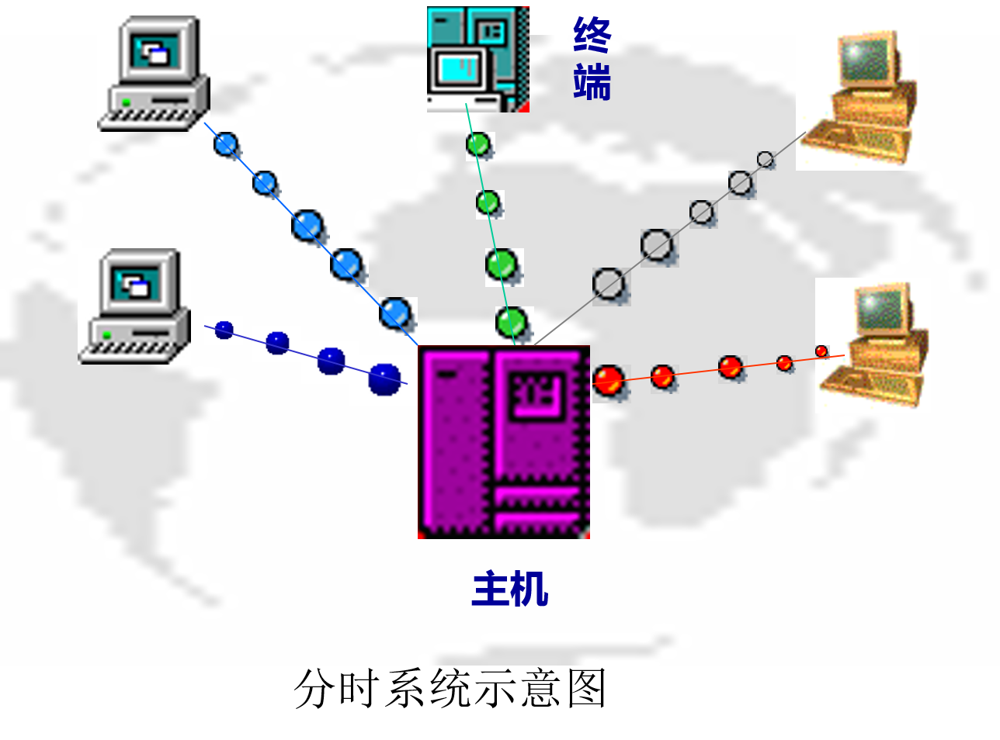

## 1.1 操作系统概念目标和作用

操作系统的工作：
* 程序的执行 
  * 负责启动每个程序，以及结束程序的工作。
* 完成与硬件有关的工作。
* 完成与应用无关的工作。
  * 易于使用，基本服务，统一性
* 计算机系统的效率与安全问题
* 高级程序设计语言的编译不是OS关心的主要问题

### 1.1.1 计算机系统的层次结构

[计算机系统组成](../1.Computer_System/Computer_System.md#^f31a1b)
[计算机系统层次结构](../1.Computer_System/Computer_System.md#^a8d5b5)
**计算机系统**由硬件和软件以及数据组成:

  * 系统软件
    * 操作系统
      * Kernel：操作系统内核,执行各种资源管理等功能
      * shell：命令行接口, 通过键盘操纵, 方便用户进行命令输入
      * GUI：图形用户接口, WIMP：window，Icon，Menu，Pointer 直接操作和所见即所得
    * 程序设计语言
    * 编译语言
    * 命令解释器
  * 应用软件

---

* 操作系统的地位：系统硬件之上的第一层软件，是其他软件和硬件之间的接口。
* 裸机：没有任何软件支持的计算机。为计算机提供基本的计算机资源
* 虚拟机：对裸机功能的首次扩充，把裸机改造成功能更强、使用更方便的机器。

### 1.1.2 操作系统的定义

操作系统是一个控制程序, 通常称为内核**kernel**

* 一个系统软件
* 控制程序执行过程，防止错误和计算机的不当使用
* 执行用户程序，给用户程序提供各种服务
* 方便用户使用计算机系统

### 1.1.3 操作系统的目标

目前存在着多种类型的OS，不同类型的OS，其目标各有所侧重。通常在计算机硬件上配置的OS，其目标有以下几点：

1. 方便性：提供一个计算机用户与计算机硬件系统之间的接口，**使计算机系统更易于使用**。
2. 有效性：有效地控制和管理计算机系统中的各种硬件和软件资源，**提高计算机系统资源利用率**。
3. 可扩充性：随计算机网络，特别是Internet的发展，要求OS具有很好的**可扩充性**，适应计算机硬件、体系结构以及应用发展的要求。
4. 开放性 :指系统能遵循世界标准规范，特别是遵循开放系统互连(OSI)国际标准。凡遵循国际标准所开发的硬件和软件，均能**彼此兼容**，可**方便地实现互连**。

### 1.1.4 操作系统的作用

1. OS作为用户与计算机硬件系统之间的接口

   OS处于用户与计算机硬件系统之间，用户通过OS来使用计算机系统。或者说，用户在OS帮助下，能够**方便、快捷、安全、可靠**地操纵计算机硬件和运行自己的程序。
2. OS作为计算机系统资源的管理者

   计算机系统四类资源: 处理器、存储器、I/O设备以及信息(数据和程序)。OS的主要功能也正是针对这四类资源进行有效的管理。
   
3. OS实现了对计算机资源的抽象

   * 裸机: 用户必须对物理接口的实现细节有充分的了解，该物理机器是难以使用的。
   * 为了方便用户使用I/O设备，人们在裸机上覆盖上一层I/O设备管理软件。

   - 用户所看到的机器将是一台比裸机功能更强、使用更方便的机器。这就是说，在裸机上铺设的I/O软件隐藏了对I/O设备操作的具体细节，向上提供了一组抽象的I/O设备。
     `
   - 通常把覆盖了上述软件的机器称为扩充机器或虚机器。它向用户(进程)提供了一个对硬件操作的抽象模型，用户可利用抽象模型提供的接口使用计算机。
   - 为了方便用户使用文件系统，人们又在第一层软件上再覆盖上一层用于文件的管理软件。
   - OS是铺设在计算机硬件上的多层系统软件，它们不仅增强了系统的功能，而且还隐藏了对硬件操作的细节，由它们实现了对计算机硬件操作的多个层次的抽象。
4. 大型机的操作系统主要用于优化硬件使用率
5. 个人计算机PC的操作系统支持复杂游戏，商业应用和这两者之间的其他应用。
# 1.3 操作系统特征

## 1.3.1 并发性

### 1.并发和并行
并发性：是指两个或多个事件在同一时间间隔内发生。

并行性： 是指两个或多个事件在同一时间发生。 
 在多道程序环境下，并发性是指宏观上在一段时间内有多道程序在同时运行。但在单处理机系统中，每一时刻仅能执行一道程序，故微观上这些程序是在处理机上交替执行。

 程序的并发执行，有效地改善了系统资源的利用率和提高了系统的吞吐量，但它使系统复杂化，操作系统必须具有控制和管理各种并发活动的能力。

### 2.引入进程
 通常的程序是静态实体(Passive Entity)，在多道程序系统中，它们是不能独立运行的，更不能和其它程序并发执行。

 在操作系统中引入进程的目的，就是为了使多个程序能并发执行。

 例如，在一个未引入进程的系统中，在属于同一个应用程序的计算程序和I/O程序之间，两者只能是顺序执行，即只有在计算程序执行告一段落后，才允许I/O程序执行；反之，在程序执行I/O操作时，计算程序也不能执行，这意味着处理机处于空闲状态 。但在引入进程后，若分别为计算程序和I/O程序各建立一个进程，则这两个进程便可并发执行。

 为使多个程序能并发执行，系统必须分别为每个程序建立进程(Process)。

### 3.引入线程
 一个进程中可以包含若干个线程，它们可以利用进程所拥有的资源。在引入线程的OS中，通常都是把进程作为分配资源的基本单位，而把线程作为独立运行和独立调度的基本单位。由于线程比进程更小，基本上不拥有系统资源，故对它的调度所付出的开销就会小得多，能更高效地提高系统内多个程序间并发执行的程度。因而近年来推出的通用操作系统都引入了线程，以便进一步提高系统的并发性，并把它视作现代操作系统的一个重要标致。

## 1.3.2 共享性

 从资源使用的角度来讲，所谓共享性是指操作系统程序与多个用户程序共同使用系统中的各种资源。

 资源共享是指系统中的硬件和软件资源不再为某个程序所独占，而是供多个用户共同使用。

 并发和共享是操作系统两个最基本的特征，这两者之间又是互为存在条件的。

 资源共享是以程序的并发为条件的，若系统不允许程序并发执行，自然不存在资源共享问题。

 若系统不能对资源共享实施有效的管理，也必将影响到程序的并发执行，甚至根本无法并发执行。

### 1.互斥共享方式
 系统中的某些资源，如打印机、磁带机，虽然它们可以提供给多个进程(线程)使用，但为使所打印或记录的结果不致造成混淆，应规定在一段时间内只允许一个进程(线程)访问该资源。

 我们把这种资源共享方式称为互斥式共享，而把在一段时间内只允许一个进程访问的资源称为临界资源或独占资源。计算机系统中的大多数物理设备，以及某些软件中所用的栈、变量和表格，都属于临界资源，它们要求被互斥地共享。

### 2.同时访问方式

 系统中还有另一类资源，允许在一段时间内由多个进程“同时”对它们进行访问。这里所谓的“同时”，在单处理机环境下往往是宏观上的，而在微观上，这些进程可能是交替地对该资源进行访问。典型的可供多个进程“同时”访问的资源是磁盘设备，一些用重入码编写的文件也可以被“同时”共享，即若干个用户同时访问该文件。

## 1.3.3 虚拟性

 指把一个物理上的实体，变为若干个逻辑上的对应物。前者是实际存在的；而后者是虚的，只是用户的一种感觉。

 例如：虚拟处理机、虚拟存储器、虚拟I/O设备。

### 1.时分复用技术
 时分复用，亦即分时使用方式，它最早用于电信业中。在计算机领域中，广泛利用该技术来实现虚拟处理机、虚拟设备等，以提高资源的利用率。

 1) 虚拟处理机技术

 在虚拟处理机技术中，利用多道程序设计技术，为每道程序建立一个进程，让多道程序并发地执行，以此来分时使用一台处理机。

  

2) 虚拟设备技术

 可以通过虚拟设备技术，将一台物理I/O设备虚拟为多台逻辑上的I/O设备，并允许每个用户占用一台逻辑上的I/O设备。

### 2.空分复用技术

 早在上世纪初，电信业中就使用频分复用技术来提高信道的利用率。它是将一个频率范围非常宽的信道，划分成多个频率范围较窄的信道，其中的任何一个频带都只供一对用户通话。之后，在计算机中也使用了空分复用技术来提高存储空间的利用率。

 1) 虚拟磁盘技术

 通常在一台机器上只配置一台硬盘。我们可以通过虚拟磁盘技术将一台硬盘虚拟为多台虚拟磁盘，这样使用起来既方便又安全。

 2) 虚拟存储器技术

 虚拟存储技术在本质上就是使内存分时复用。它可以使一道程序通过时分复用方式，在远小于它的内存空间中运行。

## 1.3.4 异步性（不确定性）
 在多道程序环境下，程序以异步方式执行。即每道程序在何时执行、各自执行的顺序、完成每道程序所需要的时间都是不确定的，也是不可预知的。

 在多道程序环境下，允许多个进程并发执行， 但由于竞争资源等因素的限制，使进程的执行不是“一气呵成，而是以“走走停停”的方式运行。
# 1.4 操作系统功能

**功能：硬件抽象和协调管理**

## 1.4.1 处理器管理
 **处理器管理**的主要任务是对中央处理器的分配和运行实施有效的管理。 在传统的多道程序系统中，处理器的分配和运行都是以进程为基本单位，因而对处理机的管理可归结为对**进程的管理**； 在引入了线程的OS中，也包含对**线程的管理**。

* 1.进程控制
  *  为作业创建进程，撤消已结束的进程以及控制进程在运行过程中的状态转换。
  * 在现代OS中，进程控制还应具有为一个进程创建若干个线程的功能和撤消(终止)已完成任务的线程的功能。

* 2.进程同步

  * 进程是以异步方式运行的,为使多个进程能有条不紊地运行，系统中必须设置进程同步机制。

  * 进程同步的主要任务是为多个并发进程(含线程)的运行进行协调。有两种协调方式：
    *  (1) 进程互斥方式: 对临界资源访问时
    *  (2) 进程同步方式: 相互合作去完成共同任务的诸进程(线程)间，同步机构对它们的执行次序加以协调。

* 3.进程通信
  *  对于相互合作的进程，在它们运行期间，彼此之间往往要交换一定量的信息，进程通信将负责完成进程间的信息交换。 例如，有三个相互合作的进程，它们是输入进程、计算进程和打印进程。

* 4.调度：在后备队列上等待的每个作业都需经过调度才能执行。在传统的操作系统中，包括作业调度和进程调度两步。
  * (1) 作业调度
    
  * (2) 进程调度
    

## 1.4.2 存储器管理
 存储器的存储调度应和处理机的调度结合起来，只有程序在主存时才有可能被处理机执行，而且仅当它可以到处理机上执行时才把它调入主存。

### 1．内存分配

 存储管理的基本功能是为每道程序分配内存空间，在作业结束时收回作业所占空间,提高存储器的利用率。

 (1) 内存分配数据结构。该结构用于记录内存空间的使用情况，作为内存分配的依据；

 (2) 内存分配功能。系统按照一定的内存分配算法为用户程序分配内存空间；

 (3) 内存回收功能。系统对于用户不再需要的内存，通过用户的释放请求去完成系统的回收功能。

### 2．内存保护

 保证各程序在自己的存储区域内运行而不相互干扰。

 绝不允许用户程序访问操作系统的程序和数据；也不允许用户程序转移到非共享的其它用户程序中去执行。

 设置内存保护机制，一种比较简单的内存保护机制是设置上界和下界限寄存器。

### 3．内存扩充

 由于物理内存的大小可能限制了大型作业或多个作业的并发执行，因此，存储管理借助于虚拟存储技术来获得增加内存的效果，使系统能运行内存需求量远比物理内存大得多的作业，或让更多的作业并发执行。

 功能：

 (1) 请求调入功能。 (2) 置换功能。

### 4．地址映射

## 1.4.3 设备管理
### 1．缓冲管理

 解决CPU运行的高速性和I/O低速性间的矛盾。

 在I/O设备和CPU之间引入缓冲，则可有效地缓和CPU与I/O设备速度不匹配的矛盾，提高CPU的利用率，进而提高系统吞吐量。

### 2．设备分配

 当用户程序提出输入输出请求后，设备管理根据一定的设备分配原则和系统中设备情况对设备进行分配。

 为了实现设备分配，系统中应设置设备控制表、控制器控制表等数据结构，用于记录设备及控制器的标识符和状态。

### 3．设备处理

 设备处理程序又称为设备驱动程序。其基本任务是用于实现CPU和设备控制器之间的通信，即由CPU向设备控制器发出I/O命令，要求它完成指定的I/O操作；反之，由CPU接收从控制器发来的中断请求，并给予迅速的响应和相应的处理

 启动指定的输入输出设备，完成用户规定的输入输出操作，并对由设备发来的中断请求进行响应，根据中断类型进行相应的处理。

### 4、设备无关性。

 即用户向系统申请的设备与实际使用的设备无关。（即使用设备的逻辑名）

## 1.4.4 文件管理
### 1．文件存储空间的管理

 负责为新建文件分配存储空间，回收已撤消文件所占用的空间，以提高文件存储空间的利用率和文件系统的工作速度。

 系统应设置相应的数据结构，用于记录文件存储空间的使用情况，以供分配存储空间时参考。

### 2. 目录管理 
主要负责为每一个文件建立其目录项，并通过对目录项的有效组织和管理，实现为用户按名存取的功能。

目录项包括文件名、文件属性、文件在磁盘上的物理位置等。

### 3. 文件保护 
为了防止文件被窃取和破坏，文件系统必须提供有效的保护机制，以保证文件系统的安全性。

### 4. 文件操作管理。
用于实现文件的操作，负责完成数据的读写。

## 1.4.5 提供接口

 提供(操作系统与用户之间的)接口

 操作系统提供两种形式的接口供用户使用。操作提供的服务：

 (1) 用户接口 提供给用户使用的接口，通过该接口取得操作系统的服务；

 联机用户接口: 它由一组键盘操作命令及命令解释程序所组成。用户直接控制自己的作业.

 脱机用户接口(批处理用户接口): 接口由一组作业控制语言(JCL)组成。用户不能直接与自己的作业交互作用，只能委托系统代替用户对作业进行控制和干预。

 图形用户接口: 采用了图形化的操作界面。

 (2) 程序接口 提供一组系统调用供用户应用程序和其他系统程序调用操作系统的功能。它是提供给程序员在编程时使用的接口，是用户程序取得操作系统服务的惟一途径。
# 1.2 操作系统发展和分类

## 1.2.0 推动操作系统发展的主要动力

1. 不断提高计算机资源的利用率

2. 方便用户

3. 器件的不断更新换代

4. 计算机体系结构的不断发展

## 1.2.1 无操作系统的计算机系统

### 1. 人工操作方式

电子管时代，计算机的运算速度较慢，没有操作系统， 人们采用人工操作方式使用计算机。 

特点:

(1)用户独占全机
(2)CPU等待人工操作
(3)独占性 
(4)串行性

缺点:

(1)计算机的有效机时严重浪费
(2)效率低

### 2. 脱机输入/输出方式

为了解决人机矛盾及CPU和I/O设备之间速度不匹配的矛盾，20世纪50年代末出现了脱机输入/输出(Off-Line I/O)技术。 
 在采用脱机输入输出方式时，程序和数据的输入输出都是在外围计算机的控制下完成的，即它们是脱离主机进行的，故称之为脱机输入输出操作。

脱机I/O方式的主要优点如下：

1） 减少了CPU的空闲时间 
2 ）提高I/O速度 

## 1.2.2 单道批处理系统

### 1.单道批处理系统的处理过程

晶体管时代，随着中央处理机速度的大幅度提高，人工操作的慢速度和中央处理机运算的高速度之间出现了矛盾，即所谓人机矛盾。为解决这一矛盾，只有设法去掉人工操作，实现作业的自动过渡，这样就出现了成批处理。

批处理：指计算机系统对一批作业自动进行处理的一种技术。单道批处理在内存中仅有一道作业。

监控程序：是一个常驻内存的小的核心代码，用于实现各作业之间的自动转接，提高了系统效率。

### 2.单道批处理系统的特征

单道批处理系统是最早出现的一种OS。严格地说，它只能算作是OS的前身而并非是现在人们所理解的OS。尽管如此，该系统比起人工操作方式的系统已有很大进步。

主要特征：

* 自动性: 自动地逐个依次运行，无需人工干预。

* 顺序性: 作业是顺序地进入内存，顺序完成。

* 单道性: 内存中仅有一道程序运行。

## 1.2.3 多道批处理系统

### 1.多道程序设计的基础概念
 在单道批处理系统中，内存中仅有一道作业，它无法充分利用系统中的所有资源，致使系统性能较差。

 在20世纪60年代中期又引入了多道程序设计技术。

 多道程序设计技术是指在计算机内存中同时存放多个作业，它们在管理程序控制之下交替执行，共享系统中的各种资源。

 在该系统中， 用户所提交的作业都先存放在外存上并排成一个队列，称为“后备队列”；然后，由作业调度程序按一定的算法从后备队列中选择若干个作业调入内存，使它们共享CPU和系统中的各种资源。

### 2.多道批处理系统的特征
多道：在内存中可同时驻留多道程序，并容许它们并发执行，有效提高资源的利用率和系统吞吐率。宏观上并行,微观上串行。

成批处理：用户自己不能干预自己作业的运行，一旦发现作业错误不能及时改正，并延长开发软件时间，所以适用于成熟的程序。

无序性 : 进入的顺序与完成的顺序可能不一致。

调度性 : 作业提交给系统直到完成需要两次调度。

一次作业调度：从外存后备作业队列，选择若个作业调入内存。

二次进程调度: 从内存的作业中选择一个作业，将处理机分配给它，使之执行。

### 3.多道批处理系统的优缺点
- 资源利用率高；

- 系统吞吐量大；系统吞吐量是指系统在单位时间内所完成的总工作量。

- 可提高内存和I/O设备利用率；

- 平均周转时间长；作业的周转时间是指从作业进入系统开始，直至其完成并退出系统为止所经历的时间。

- 无交互能力；

- 适合大型科学计算、数据处理。

### 4.多道批处理系统需要解决的问题
 多道批处理系统是一种有效、但十分复杂的系统。为使系统中的多道程序间能协调地运行，必须解决下述一系列问题：

 (1) 处理机管理问题。

 (2) 内存管理问题。

 (3) I/O设备管理问题。

 (4) 文件管理问题。

 (5) 作业管理问题。

 操作系统是计算机系统中的一个大型的系统软件，它管理和控制计算机系统中的全部软、硬件资源，合理地组织计算机的工作流程，为用户应用程序的运行提供一个友好的界面和良好的工作环境。

## 1.2.4 分时系统

### 1.分时系统的产生
 分时系统是为了满足用户需求所形成的一种新型OS。它与多道批处理系统之间，有着截然不同的性能差别。用户的需求具体表现在以下几个方面：

 (1) 人－机交互

 (2) 共享主机

 (3) 便于用户上机

 多用户交互式系统: 多个用户通过交互方式分享使用同一台计算机。

### 2.分时系统的思想

- 采用时间片轮的方法，同时为许多终端用户服务，对每个用户能保证足够快的响应时间，并提供交互会话的功能。

- 时间片：将CPU的时间划分成若干个片段,称为时间片，操作系统以时间片为单位,轮流为每个终端用户服务。

 假设用户数目为100，为保证系统响应时间不超过2s，时间片最大应为20ms。

- 设计目标：对用户的请求及时响应，并在可能条件下尽量提高系统资源的利用率。

 分时系统的响应（及时性）主要是根据用户的所能接受的等待时间。

 适合办公自动化、教学及事务处理等要求人机会话的场合。

 

### 3.分时操作系统工作方式

- 一台主机连接了若干个终端

- 每个终端有一个用户在使用

- 交互式的向系统提出命令请求

- 系统接受每个用户的命令

- 采用时间片轮转方式处理服务请求

- 并通过交互方式在终端上向用户显示结果

- 用户根据上步结果发出下道命令

### 4.分时系统实现中的关键问题
 为实现分时系统，其中，最关键的问题是如何使用户能与自己的作业进行交互，即当用户在自己的终端上键入命令时， 系统应能及时接收并及时处理该命令，再将结果返回给用户。

 (1) 及时接收。

 实现：配置一个多路卡

 (2) 及时处理。

 人机交互的关键；

 用户及时控制自己作业的运行。

 用户的作业都必须驻留在内存中。

### 5.分时系统的特征
(1) 多路性：指一台计算机与若干台终端相连，各终端用户可以同时操作，共同使用同一系统的资源。

(2) 独占性：由于分时操作系统采用时间片轮转的办法使一台计算机同时为多个终端用户服务，因而每个终端用户彼此之间都感觉不到别人也在使用这台计算机，好像自己独占整个计算机系统。

(3) 及时性：用户的请求能在较短的时间内得到及时响应。

(4) 交互性：分时操作系统支持联机操作方式。用户可以通过终端，采用人机会话的方式直接控制程序运行，同程序进行会话。

## 1.2.5 实时系统

实时是指计算机系统要能够及时响应外部事件的请求，并以足够快的速度完成对事件的处理。

实时操作系统按其用途的不同可分为两种类型：实时控制系统和实时信息处理系统。

### 1.实时控制系统

通常是指以计算机为中心的生产过程控制系统。

实时控制系统的应用：对导弹发射、飞机飞行、钢铁生产、电力生产、石油化工生产过程的自动控制等。

### 2.实时信息处理系统。

在这类系统中，用户通过终端提出服务请求，计算机系统根据用户提出的问题对信息进行检索和处理，并在很短的时间内通过终端对用户作出回答。

实时信息处理系统的应用：情报检索系统、航空订票系统、银行系统和图书管理系统等。

### 3.实时任务

1. 按任务执行时是否呈现周期性来划分

	* 周期性实时任务。外部设备周期性地发出激励信号给计算机，要求它按指定周期循环执行，以便周期性地控制某外部设备。

	* 非周期性实时任务。外部设备所发出的激励信号并无明显的周期性，但都必须联系着一个截止时间(Deadline)。它又可分为开始截止时间(某任务在某时间以前必须开始执行)和完成截止时间(某任务在某时间以前必须完成)两部分。

2. 根据对截止时间的要求来划分

	* 硬实时任务(Hard real-time Task)。系统必须满足任务对截止时间的要求，否则可能出现难以预测的结果。

	* 软实时任务(Soft real-time Task)。它也联系着一个截止时间，但并不严格，若偶尔错过了任务的截止时间，对系统产生的影响也不会太大。

### 4.实时操作系统的主要特点

(1) 即时响应：系统必须保证对实时信息的分析和处理的速度比其进入系统的速度要快。

(2) 高可靠性：与其它类型系统相比，实时操作系统更注重其稳定性和可靠性。

(3) 专业性

[双工系统]：一台做为主机，另一台作为后备机与主机并行运行。一旦主机发生故障，后备机便立即代替主机继续工作，以保证系统不间断运行。

## 六、微机操作系统的发展

### 1.单用户单任务操作系统

只允许一个用户上机，且只允许用户程序作为一个任务运行。这是最简单的微机操作系统，主要配置在8位和16位微机上。最有代表性的单用户单任务微机操作系统是CP\/M和MS-DOS。

1) CP/M

1974年第一代通用8位微处理机芯片Intel 8080出现后的第二年，Digital Research公司就开发出带有软盘系统的8位微机操作系统。

2) MS-DOS

1981年IBM公司首次推出了IBM-PC个人计算机(16位微机)，在微机中采用了微软公司开发的MS-DOS(Disk Operating System)操作系统，该操作系统在CP\/M的基础上进行了较大的扩充，使其在功能上有很大的增强。

### 2.单用户多任务操作系统

只允许一个用户上机，但允许用户把程序分为若干个任务，使它们并发执行，从而有效地改善了系统的性能。

最有代表性的是由微软公司推出的Windows。

Windows 1.0和Windows 2.0版本操作系统， 1985年和1987年。

Windows 3.0版本，1990年，386，486等32位微机开发的。

1995年微软公司推出了Windows 95

Windows 98, 1998年

32位版本的Windows XP，2001年

### 3.多用户多任务操作系统

允许多个用户通过各自的终端使用同一台机器，共享主机系统中的各种资源，而每个用户程序又可进一步分为几个任务，使它们能并发执行，从而可进一步提高资源利用率和系统吞吐量。

在大、中和小型机中所配置的大多是多用户多任务操作系统，而在32位微机上也有不少是配置的多用户多任务操作系统，其中最有代表性的是UNIX OS。

UNIX OS是美国电报电话公司的Bell实验室在1969～1970年期间开发的，1979年推出来的UNIX V.7已被广泛应用于多种中、小型机上，人们又将UNIX移植到微机上。

Solaris OS：SUN公司于1982 年推出的SUN OS 1.0是一个运行在Motorola 680x0平台上的UNIX OS。

Linux OS：Linux 是UNIX的一个重要变种，最初是由芬兰学生Linus Torvalds针对Intel 80386开发的。1991年在Internet网上发布第一个Linux版本，由于源代码公开，因此有很多人通过Internet与之合作，使Linux的性能迅速提高，其应用范围也日益扩大。

## 七、网络操作系统

* **计算机网络**是通过通信设备和通信线路将地理上分散的多个计算机系统相互连接起来，实现信息交换、资源共享、可互操作和协作处理的系统。

* **网络环境下的操作系统**是网络用户和网络之间的接口，它除了具有通常操作系统的资源管理功能外，还具有网络管理、网络通信、网络资源共享、系统安全和多种网络应用服务的功能。

* 网络操作系统既要为**本机用户**提供使用网络资源的手段，又要为**网络用户**使用本机资源提供服务。

## 八、分布式操作系统

* 分布式计算机系统是由多台计算机组成的一种特殊的计算机网络。该网络中的各台计算机没有主次之分；网络中任意两台计算机之间可以通过通信交换信息；网络中的资源供各用户共享。分布式计算机系统是一个一体化的系统（统一的界面，标准的接口），在整个系统中有一个全局的操作系统，称为分布式操作系统。

* 分布式操作系统能使系统中若干台计算机相互协作完成一个共同的任务。它负责全系统的资源分配和调度、任务的划分、信息的传输控制协调等工作，为用户提供一个统一的界面和标准的接口。
  
### 基本特征：
（1）统一性：逻辑上的统一系统，使用户感觉不到系统是由多台计算机构成的，系统能够自动的实施任务分配和协调。

（2）坚强性：当系统中的部分计算机或通路发生故障时，其余部分可自动重构成为一个新的系统。

### 网络和分布式的区别

(1)分布具有各个计算机间相互通讯，无主从关系； 网络有主从关系

(2) 分布式系统资源为所有用户共享；而网络有限制地共享。

(3) 分布式系统中若干个计算机可相互协作共同完成一项任务。强项：分布式计算。

## 九、嵌入式操作系统

### 什么是嵌入式系统？

* 在各种设备、装置或系统中，完成特定功能的软硬件系统

* 它们是一个大设备、装置或系统中的一部分，这个大设备、装置或系统可以不是“计算机”。

* 通常工作在反应式或对处理时间有较严格要求环境中。

* 由于它们被嵌入在各种设备、装置或系统中，因此称为嵌入式系统。

* 在嵌入式系统中的OS，称为嵌入式操作系统。

* 嵌入式操作系统，是运行在嵌入式智能芯片环境中，对整个智能芯片以及它所操作、控制的各种部件装置等等资源进行统一协调、调度、指挥和控制的系统软件。
  

## 十、操作系统领域中新的操作系统

* 有线电视机顶盒领域，PowerTV

* 移动通信领域，EPOC、移动PDA

* 掌上计算机领域，Palm OS

* 数字影像领域， Digita

## 十一、操作系统演变过程中的计算机系统

## 十二、多机系统

# 1.5 操作系统结构设计

## 1.5.1 传统的操作系统结构

### 1.无结构操作系统
 在早期开发操作系统时，设计者只是把他的注意力放在功能的实现和获得高的效率上，缺乏首尾一致的设计思想。这种OS是无结构的。

 主要是编制紧凑程序，便于利用内存，对go to无限制，缺乏清晰的程序结构，难以维护和理解，增加了维护人员的负担。

### 2.模块化结构OS
 模块化程序设计技术，是基于“分解”和“模块化”原则来控制大型软件的复杂度的。将OS按其功能划分为若干个具有一定独立性和大小的模块。并规定好各模块间的接口， 各模块之间能通过该接口实现交互。

模块接口法的优缺点:

 - 优点：

     - 提高设计的正确性；

     - 增强可适应性；

     - 加速开发过程；

 - 缺点：

     - 难保证模块完全正确；

     - 模块设计的无序性；

     - 未区分独占与共享资源；

### 3.分层式结构(有序)OS
 分层法的设计任务是，在目标系统An和裸机系统(又称宿主系统)A0之间，铺设若干个层次的软件A1、A2、A3、…、An－1，使An通过An－1、An－2、…、A2、A1层，最终能在A0上运行。

 采用自底向上法来铺设这些中间层。

 调用原则：

     - 高层只能调用低层功能和服务。

 层次的设置:

     - 关键：几层；各层顺序；
    
     - 考虑因素：
    
        - a.程序嵌套 b.运行频率 c.公用模块 d.用户接口

分层结构的优缺点

 - 优点：

    -  (1) 易保证系统的正确性。（有序）

    -  (2) 易扩充和易维护性。增、修或替的一个模块或整个层次，只要    不改变相应层次间的接口，就不会影响其它层次。

- 缺点：

    - (1) 系统效率降低。

    - (2)分层单向依赖，多个层次间建立通信机制。

## 1.5.2 客户/服务器模式

 客户/服务器(Client/Server)模式可简称为C/S模式。

### 1．客户/服务器模式的组成

 由客户机、服务器和网络系统三个部分组成。

 (1) 客户机：一个LAN网络上连接有多台网络工作站(简 称客户机)。自主计算机，一定的处理能力，完成本地业务，发送一个消息给服务器，请求服务。

 (2) 服务器：一台规模较大的机器，驻留有网络文件系统或数据库系统等，它应能为网上所有的用户提供一种或多种服务。

 (3) 网络系统：连接所有客户机和服务器，实现它们之间通信和网络资源共享的系统。
### 2．客户/服务器之间的交互

 在采用客户/服务器的系统中，通常是客户机和服务器共同完成对应用(程序)的处理。一次完整的交互过程可分成以下四步：

 (1) 客户发送请求消息。 (2) 服务器接收消息。

 (3) 服务器回送消息。 (4) 客户机接收消息。

### 3．客户/服务器模式的优点

 C/S模式成为分布式系统和网络环境下软件的主要工作模式。优点：

 (1) 数据的分布处理和存储。由于客户机具有相当强的处理和存储能力，可进行本地处理和数据的分布存储，从而摆脱了由于把一切数据都存放在主机中而造成的既不可靠又容易产生瓶颈现象的困难局面。

 (2) 便于集中管理。尽管C/S模式具有分布处理功能，但公司(单位)中的有关全局的重要信息、机密资料、重要设备以及网络管理等，仍可采取集中管理方式。这样可较好地保障系统的“可靠”与“安全”。

 (3) 灵活性和可扩充性。C/S模式非常灵活，极易扩充。理论上，客户机和服务器的数量不受限制。其灵活性还表现在可以配置多种类型的客户机和服务器。

 (4) 易于改编应用软件。在客户/服务器模式中，对于客户机程序的修改和增删，比传统集中模式要容易得多，必要时也允许由客户进行修改。

## 1.5.3 面向对象的程序设计
### 1．面向对象技术的基本概念

 面向对象技术是20世纪80年代初提出并很快流行起来的。该技术是基于“抽象”和“隐蔽”原则来控制大型软件的复杂度的。OS中的各类实体如进程、线程、消息、存储器等，都使用了对象这一概念，相应地，便有进程对象、线程对象、 存储器对象等。

### 2．面向对象技术的优点

 (1) 通过“重用”提高产品质量和生产率。

 通过“重用”以前项目中经过精心测试的对象，或由其他人编写、测试和维护的对象类，来构建新的系统，大大降低开发成本，获得更好的系统质量。

 (2) 使系统具有更好的易修改性和易扩展性。

 通过封装，隐蔽对象中的变量和方法，当改变对象中的变量和方法时，不会影响到其它部分，从而可方便地修改老的对象类。

 (3) 更易于保证系统的“正确性”和“可靠性”。

 对象是构成操作系统的基本单元，由于可以独立地对它进行测试。

## 1.5.4 微内核OS结构
### 1．微内核操作系统的基本概念

 为了OS的“正确性”、“灵活性”、“易维护性”和”可扩充性”，现代OS结构设计时,大多采用基于客户/服务器模式的微内核结构，将OS划分为两大部分：微内核和多个服务器。

 主要思想：

 在OS内核中只留下一些最基本的功能，而将其他服务尽可能地从内核中分离出去，用若干个在用户态下的进程（即服务器进程）来实现，形成“客户、服务器C/S”模式。

### 2. 微内核结构的OS特征 

 1) 足够小的内核

 内核精心设计,实现现代OS最基本的核心功能的部分。用于：① 实现与硬件紧密相关的处理；② 实现一些较基本的功能；③ 负责客户和服务器之间的通信。

 2) 基于客户/服务器模式

 3) 应用“机制与策略分离”原理构造OS

 机制: 是指实现某一功能的具体执行机构。

 策略: 在机制的基础上，借助于某些参数和算法来实现该功能的优化，或达到不同的功能目标。通常，机制处于一个系统的基层，而策略则处于系统的高层。微内核OS中，将机制放在OS的微内核中。

 4) 采用面向对象技术

3．微内核的基本功能

 1)进程(线程)管理

 2) 低级存储器管理

 3) 中断和陷入处理

 4) 进程通信管理。

 5) I/O设备管理。

### 4．微内核操作系统的优点 

1) 提高了系统的可扩展性

 微内核OS的许多功能是由相对独立的服务器软件来实现的，当开发了新的硬件和软件时，微内核OS只须在相应的服务器中增加新的功能，或再增加一个专门的服务器。

2) 增强了系统的可靠性

 微内核是出于精心设计和严格测试的；提供了规范而精简的应用程序接口(API)；服务器都是运行在用户态，出错不会影响内核。

3) 可移植性

 所有与特定CPU和I/O设备硬件有关的代码，均放在内核和内核下面的硬件隐藏层中，而操作系统其它绝大部分(即各种服务器)均与硬件平台无关，移植修改代价小。

4) 提供了对分布式系统的支持 。采用消息传递通信机制

## 一、CPU与外设并行工作

## 二、I/O中断的作用

 在I/O控制系统控制下，外部设备独立工作，不需要中央处理机的干预。但由于外部设备是由中央处理机根据程序的要求而启动的，因此，当外部设备工作结束后，应把工作情况反馈给中央处理机。这种反馈通过I/O中断完成的。

## 三、管态与目态

处理机的工作状态。根据对资源和机器指令的使用权限，把处理机执行时的工作状态分为管态和目态。

管态：操作系统程序执行时中央处理机所处的状态。

当中央处理机处于管态时可执行包括特权指令在内的一切机器指令，实现对资源的分配和管理并为用户使用外部设备进行服务。

目态：用户程序执行时中央处理机所处的状态。

当中央处理机处于目态时不允许执行特权指令。

 在系统运行的过程中，中央处理机的状态处于动态变化之中。当系统启动时，硬件置ＣＰＵ初始状态为管态，然后装入操作系统程序。如果操作系统选择了用户程序占用处理机，则把管态转换成目态。如果中断装置发现了一个事件，则又将其置为管态，让操作系统去处理出现的事件。

## 四、存储结构
多级存储体系，包括主存储器、辅助存储器和高速缓冲存储器。

## 1.7 操作系统实例

UNIX BSD
* FreeBSD 
* DragonFlyBSD
* NetBSD
* PE350
* OpenBSD
* solaris
* hp
* MAC os
* AIX

Linux
* red hat
* ubuntu
* fedora
* android

Window：从unix改版的
