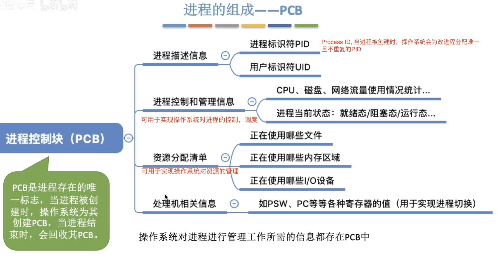
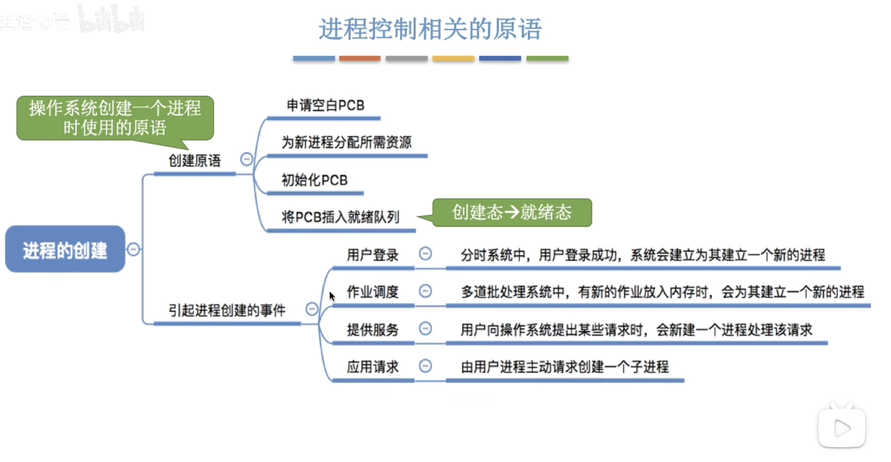
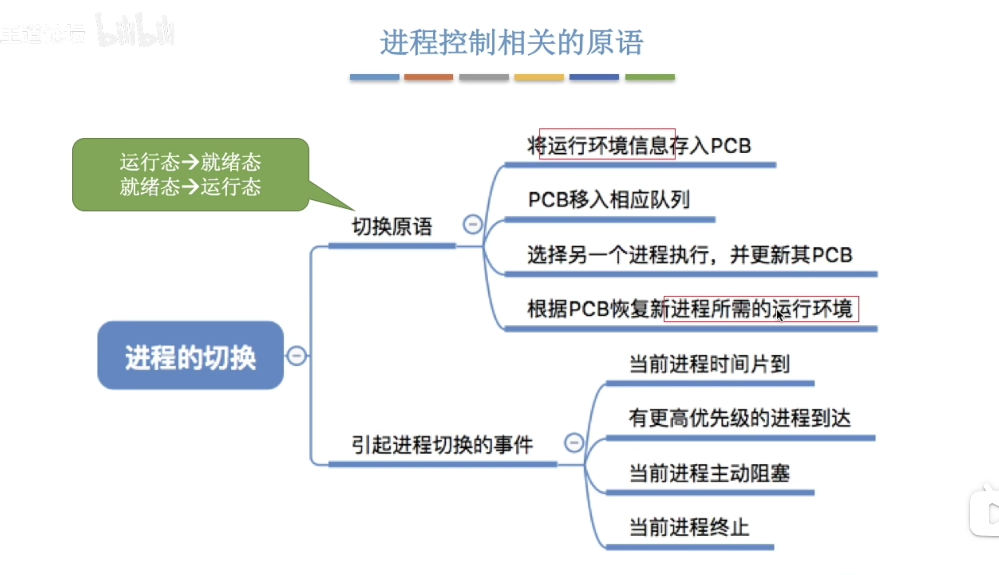
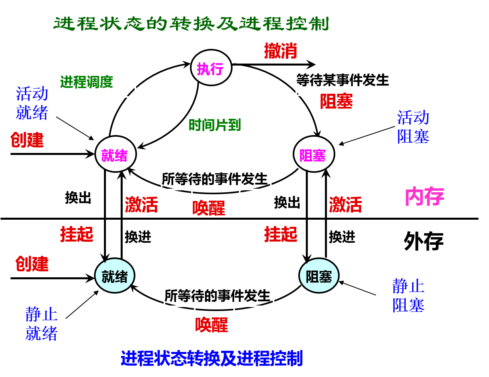
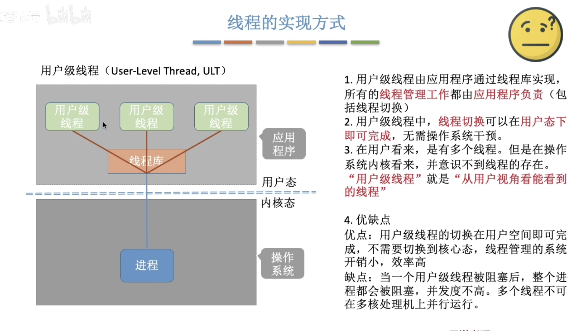
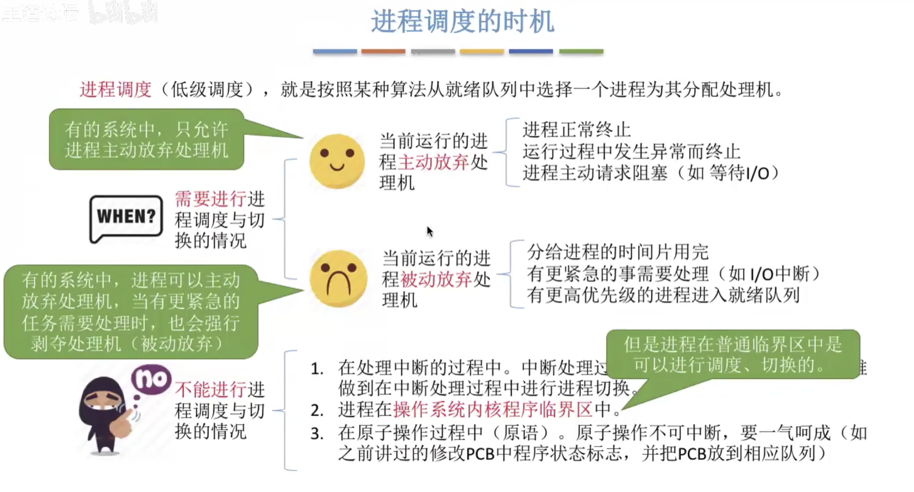
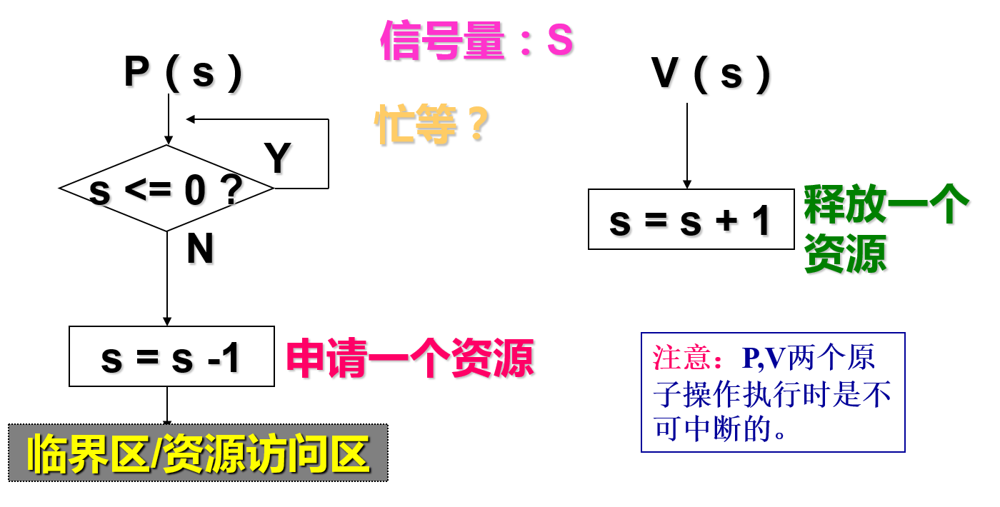
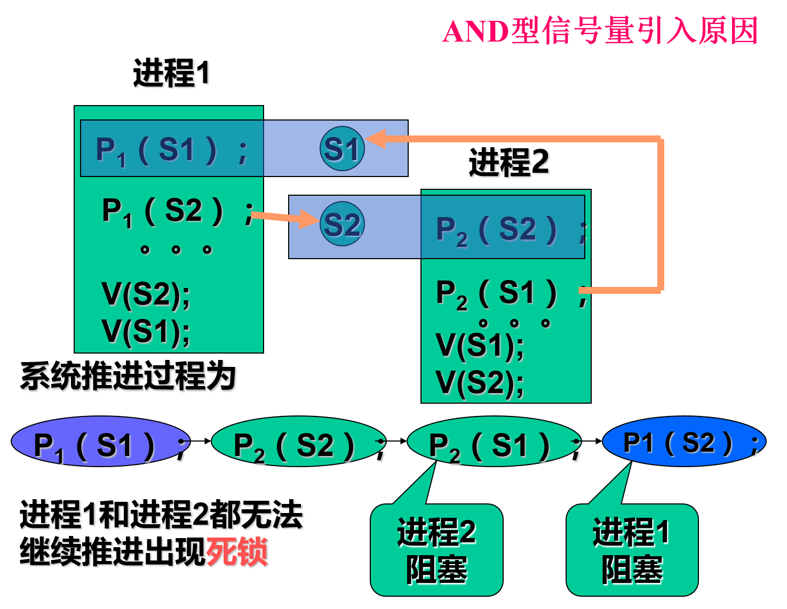
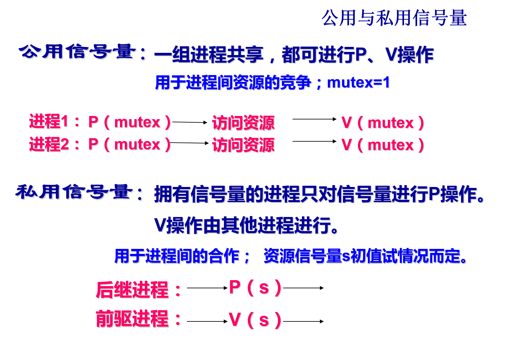
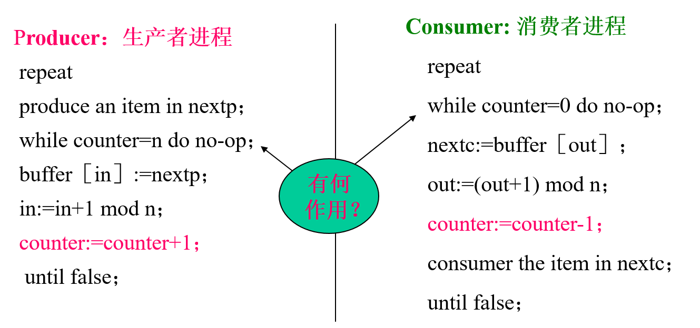

# 1. 进程基础介绍

## 1.1 进程的概念

**程序**：静态的，就是个存放在磁盘里的可执行文件，就是一系列的指令集合
**进程(Process)**: 动态的，是程序的一次执行过程，同一程序执行多次会对应多个进程。（设计操作系统的目的，为了提高系统资源利用，故引入多道程序技术。用“程序”的概念已无法描述程序的**并发**执行，必须引入新的概念，来说明新的情况，故引入进程（process）的概念）一个进程可以包含几个程序 ；一个程序也可以对应多个进程。

通过CPU的多路复用，所有进程可以**并发执行**。通过在**进程之间切换CPU**，操作系统能使计算机更为高效。

而进程是**活动实体**。当一个可执行文件被加载到内存时，这个程序就称为进程。

进程不只是程序代码，进程还包括当前活动，如程序计数器的值和寄存器的内容等，另外，进程还包括堆，栈，数据等。

## 1.2 进程的组成
PCB: Process Control Block 进程控制块





进程控制块PCB中的信息：Process Control Block
* 进程标识符 PID：标识一个进程的编号，也称为进程的内部名；
* 用户标识符 UID：进程所属用户
* 现行状态：说明进程的当前状态；
* 现场保留区：保存进程由执行状态变为其它状态时的CPU现场信息；
* 程序与数据地址：该进程的程序和数据所在位置信息；
* 互斥与同步机构：实现进程间互斥与同步时所必须的机构；
* 进程通信机制：用于实现进程间的通信所需的数据结构；
* 优先级：表示进程使用CPU时优先级别的一个整数；
* 资源清单：列出进程拥有的资源的记录；
* 链接字(链接指针）：给出本进程所在队列中的下一个进程的PCB首址；
* 家族联系：用于说明本进程与其它家族成员间的关系。


进程控制块的组织方式： 为了有效地对进程控制块进行管理，应该采用适当的方式把它们组织起来。目前常用的组织方式有以下两种：
 1. 链接方式组织PCB (队列): 不同状态进程分别组成队列，运行队列、就绪队列、等待队列。

2. 按索引方式组织PCB (表): 对具有相同状态的进程，分别设置各自的PCB索引表，表明PCB在PCB表中的地址。


## 1.3 进程的特征

- 动态性：进程的实质是实体的一次执行过程， 进程是动态产生，动态消亡的，进程因创建而产生，因调度而执行，因撤消而消亡。进程在其生命周期内，在三种基本状态之间转换。**动态性是进程最基本的特征。**
- 并发性：任何进程都可以同其他进程一起向前推进,多个进程可以并发执行，即一个进程还未结束之前，允许其他进程执行。
- 独立性：进程是一个能独立运行的基本单位，同时也是系统分配资源和调度的独立单位；
- 异步性：由于进程间的相互制约，使进程具有执行的间断性，即进程按各自独立的、不可预知的速度向前推进，进程之间有时合作完成任务，有时竞争使用资源。异步性会导致并发程序执行结果的不确定性。具体内容在“**进程同步**”章节
- 结构性：一个进程由三部分组成，即程序、数据和进程控制块。其中进程控制块是进程的一个运行情况的登记表。

# 2 进程的状态/生命周期


## 2.1 进程的状态

进程执行时的间断性决定了进程可能具有多种状态。进程具有三种基本状态：
New: 进程正在创建
running：指令正在执行
waiting：阻塞状态，进程等待发生某个事件(如IO完成)
ready：进程等待分配处理器
terminated：进程已经结束


 


## 2.2 进程状态的转换


## 2.3 进程的组织方式
操作系统会将各个进程的PCB组织起来，相同状态的PCB组织在一起

大部分操作系统使用链式方式


# 3. 进程控制

**进程控制**是对系统中所有进程从产生、存在到消亡的全过程实行有效的管理和控制。
进程控制一般是由操作系统的内核来实现，内核在执行操作时，往往是通过执行各种原语操作来实现的。
**原语**(Primitive，原子操作，不可中断): 由若干条指令组成的，用于完成一定功能的一个过程。
内核：加在硬件上的第一层软件，通过执行各种原语操作来实现各种控制和管理功能，具有创建、撤消、进程通信、资源管理的功能。


进程原语：
* 创建原语  create()
* 终止原语  destroy()
* 阻塞原语  block（）
* 唤醒原语 wakeup( )
* 切换原语
* 挂起原语 suspend( )
* 激活原语 active( )

无论哪个进程控制原语，无非做三件事：
* 更新PCB中信息：修改进程状态，保存/恢复运行环境
* 将PCB插入合适队列
* 分配/回收资源

## 2.1 进程的创建




## 2.2 进程的终止

引起进程终止的事件：
1. 正常结束（批处理Holt、分时Logs off）
2. 异常结束：运行期间，出现某些错误和故障而迫使进程终止。常见的有下述几种：
	* (1)越界错误 (2) 保护错 (3) 非法指令。(4) 特权指令错。
	* (5) 运行超时。(6) 等待超时。(7) 算术运算错 (8) I/O故障。
 3. 外界干预，这些干预有：
	*  操作员或操作系统干预。如，发生了死锁
	* 父进程请求。由于父进程具有终止自己的任何子孙进程的权力，因而当父进程提出请求时，系统将终止该进程。
	* 父进程终止。当父进程终止时，OS也将它的所有子孙进程终止。


## 2.3 进程的阻塞与唤醒 

引起进程阻塞和唤醒的事件：

 1) 请求系统服务

 当正在执行的进程请求操作系统提供服务时，由于某种原因，操作系统并不立即满足该进程的要求时，该进程只能转变为阻塞状态来等待。例如: 一进程请求使用打印机(被占用)。

 2) 启动某种操作

 当进程启动某种操作后，如果该进程必须在该操作完成之后才能继续执行，则必须先使该进程阻塞，以等待该操作完成。例如，进程启动了某I/O设备。

 3) 新数据尚未到达 。对于相互合作的进程。

 4) 无新工作可做。系统往往设置一些具有某特定功能的系统进程，每当这种进程完成任务后，便把自己阻塞起来以等待新任务到来。


## 2.4 进程的切换



## 2.4 进程的挂起与激活 

进程的挂起

 当出现了引起进程挂起的事件时，系统将利用挂起原语suspend( )将指定进程或处于阻塞状态的进程挂起。

 挂起原语的功能：自身挂起、挂起具有指定标识符的进程、将其进程及其全部或部分“子孙”挂起。

进程的激活过程

 当发生激活进程的事件时，系统将利用激活原语active( )将指定进程激活。

 激活原语功能：使处于静止状态的进程变为活动。


# 4. 进程通信

进程通信：(Inter-Process Communication, IPC),两个或多个 进程间的信息交换，以便协调一致共同完成指定的任务。
进程是分配系统资源的单位，包括内存地址空间。因此各进程拥有的内存地址空间相互独立。为了保证安全，一个进程不能直接访问另一个进程的地址空间。因此需要操作系统的支持来实现进程间的通信。

进程通信方式：
* 低级通信方式：传送一个或几个字节的控制信息。
    - 如：锁机制和信号量机制。
    - 缺点：效率低；通信对用户不透明；
-  高级通信方式：以较高的效率，交换大批量的数据。
    - 如：消息缓冲机制和信箱机制。
    - Send / Receive原语（高级通讯原语）

进程通信方式：
* 共享存储
* 消息传递
* 管道通信


## 4.1 共享内存


 
 基于共享数据数据结构方式：程序员负责；
 基于共享存储区方式：OS负责；
 
## 4.2 消息传递
直接通信方式：消息缓冲队列通信机制
间接通信方式：信箱通信


## 4.3.管道通信
（Pipe）
管道通信—共享文件方式—Unix系统

字符流输入、输出。

共享存储通信的存取地址随意，管道通信方式存取遵循先进先出


# 5 线程

## 5.1 线程的概念
没引入线程前，系统各个程序只能串行执行，例如我们不能同时边听音乐边玩QQ。
但是QQ同时可以视频聊天，文字聊天，传送文件。传统进程只能串行执行一系列代码，为此引入线程，来增加并发度。线程成为程序执行的最小单位。引入线程后，进程只作为除CPU之外的系统资源的分配单元，如打印机，内存地址空间等都是分配给线程的

进程的概念和结构是传统操作系统工作的基础。但是，随着计算机体系结构从早期的单处理机结构发展到目前的多处理机结构，在多任务的环境中，为了减少处理机的空转时间以及处理机调度切换时的时间和空间开销，提高系统的并行能力，因此产生了更小的控制单位：线程。


## 5.2  线程的属性
•是进程的一个实体，可作为系统独立调度和分派的基本单位。

•不拥有系统资源（只拥有从属进程的全部资源，资源是分配给进程）。

•一个进程中的多个线程可并发执行。（进程可创建线程执行同一程序的不同部分）

•系统开销小、切换快。（进程的多个线程都在进程的地址空间活动）


   


## 5.4 线程的实现方式
用户级线程
内核级线程





## 5.5 线程的状态与转换

## 5.6 线程的组织与控制
由于同一个进程多个线程共享同一地址空间，带来了系统时/空管理的改善。


   

# 6 处理机调度
## 6.1 调度的层次
调度的三个层次：
* 高级调度：作业调度
* 低级调度：进程调度/处理机调度，最基本的一种调度
* 中级调度：内存调度


## 6.2 进程调度




进程调度方式

进程的切换与过程


## 6.3 调度器/调度程序


## 6.调度算法
### 6.1 评价指标
调度算法评价指标


### 6.2 先来先服务 FCFS
First Come First Serve
https://www.bilibili.com/video/BV1YE411D7nH?p=23&vd_source=50ac7e35d44afea54a236dfa228f618f


### 6.3 短作业优先 SJF
### 6.4 高响应比优先 HRRN
### 6.5 时间片轮转调度算法RR
https://www.bilibili.com/video/BV1YE411D7nH?p=24&vd_source=50ac7e35d44afea54a236dfa228f618f
### 6.6 优先级调度算法
### 6.7 多级反馈队列调度算法
https://www.bilibili.com/video/BV1YE411D7nH?p=25&vd_source=50ac7e35d44afea54a236dfa228f618f


# 7. 进程同步/互斥
进程同步问题的提出
* 进程异步推进可能造成混乱
* 混乱可能导致不可再现

进程同步目标


## 7.1 基本概念


进程间的关系是在进程间相对独立(独立获得资源,独立调度)的前提下发展的。进程间两种主要关系: 
* 直接作用---相互合作引起---进程同步：进程间的相互联系是有意识的安排的，直接作用只发生在相交进程间。
* 间接作用---资源共享引起---进程互斥：进程间要通过某种中介发生联系，是无意识安排的，可发生在相交进程之间，也可发生在无关进程之间。

进程同步：指系统中多个进程中发生的事件存在某种时序关系，需要相互合作，共同完成一项任务。具体说，一个进程运行到某一点时要求另一伙伴进程为它提供消息，在未获得消息之前，该进程处于等待（阻塞）状态，获得消息后被唤醒进入就绪状态。多个相关进程在执行次序上的协调。


进程互斥：由于各进程要求共享资源，而有些资源需要互斥使用，因此各进程间竞争使用这些资源，进程的这种关系为进程的互斥。


| 相互感知程度 | 交互关系 | 一个进程对其他进程的影响 |
| --- | --- | --- |
| 相互不感知(完全不了解其它进程的存在) | 竞争(competition） | 一个进程的操作对其他进程的结果无影响 |
| 间接感知(双方都与第三方交互，如共享资源) | 通过共享进行协作 | 一个进程的结果依赖于从其他进程获得的信息 |
| 直接感知(双方直接交互，如通信) | 通过通信进行协作 | 一个进程的结果依赖于从其他进程获得的信息 |

两种资源共享方式
* 互斥共享方式：系统中某些资源，虽然可以提供给多个进程使用，但一个时间内只允许一个进程访问改资源
* 同时共享方式：系统中某些资源允许一个时间段内由多个进程“同时”对他们进行访问

临界资源：系统中某些资源一次只允许一个进程使用，称这样的资源为临界资源或互斥资源。许多硬件资源如打印机、磁带机是属于临界资源。还有许多变量，数据，内存缓冲区都属临界资源。对临界资源的访问必须是互斥。资源状态为临界：0 或 1


临界区：每个进程用于访问临界资源的那段程序。

若能保证诸进程互斥地进入自己的临界区，便可实现诸进程对临界资源的互斥访问。


## 7.2 进程互斥的实现

### 7.2.1 软件实现方法
https://www.bilibili.com/video/BV1YE411D7nH?p=27&spm_id_from=pageDriver&vd_source=50ac7e35d44afea54a236dfa228f618f
单标志法


### 7.2.2 硬件实现方法
https://www.bilibili.com/video/BV1YE411D7nH?p=28&vd_source=50ac7e35d44afea54a236dfa228f618f


## 7.3 互斥锁
https://www.bilibili.com/video/BV1YE411D7nH?p=29&vd_source=50ac7e35d44afea54a236dfa228f618f

临界资源锁机制--解决进程互斥


例：商场的试衣间

* 是互斥资源

* 是临界资源

* 是共享资源

每个顾客必须遵循以下过程使用试衣间：


临界资源锁机制

每个进程必须按照以下过程操作资源：

一种简单的锁操作实现

锁操作模拟过程

锁操作的一般模型

    Pi：..... lock\( L \)--&gt; C\( i \)--&gt; unlock\( L \) ......
    Pj：...... lock\( L \)--&gt; C\( j \)--&gt; unlock\( L \) .....

    Pi： 进程i      C\( i \)： Pi的临界区

出了问题的锁


 利用上锁原语和开锁原语实现进程互斥

 利用上锁原语和开锁原语可以解决并发进程对临界区访问的互斥问题。

 任何申请进入临界区的进程，必须先执行上锁原语。若上锁原语顺利通过，则进程可以进入临界区，这时临界区已被上锁原语锁住，其它申请进入临界区的进程只能等到临界区开锁之后才有可能进入临界区；当进程完成对临界资源的访问退出临界区时再执行开锁原语，以释放该临界资源。


锁操作的特点：
– 实现了进程互斥访问临界资源。

– 不遵循让权等待原则。——忙等

```
     void lock( L ){ 
         check: if ( L = = 1 )
                     goto check;
         //资源正在使用，继续反复测试；忙等；
                 else
                     L = 1;// 上锁
      }
       
 Lock(L)、UnLock(L)原子操作，不许中断。
```


## 7.4 信号量机制
https://www.bilibili.com/video/BV1YE411D7nH?p=30&spm_id_from=pageDriver&vd_source=50ac7e35d44afea54a236dfa228f618f
https://www.bilibili.com/video/BV1YE411D7nH?p=31&vd_source=50ac7e35d44afea54a236dfa228f618f
经典信号量、记录型信号量、AND信号量、信号量集

### 7.4.1 基本概念

信号量

- 信号量是对具体物理资源的抽象。

- 不同类的资源用不同名称的信号量代表。

- 同类资源的个数用> 0的信号量值表示。

- 信号量值为 0 或 1 的信号量表示临界资源。


### 2. 经典(整型)信号量的P，V操作

资源的申请与释放－原语

- P操作 wait(S)： while S<=0 do no-op； S:=S-1； 申请一个资源；

- V操作 signal(S)：S:=S+1；释放一个资源；


### 3. 记录型信号量

- 解决经典信号量机制中未遵循“让权等待”。

- 引入进程阻塞机制

- 在信号量里增加对阻塞进程的纪录。


纪录型信号量的P，V操作 


纪录型信号量机制特点：

- 进程对资源访问的过程：

- 原语保证
    - p（s），v（s）操作都是原语；

    - 保证不出现“锁不住”资源的现象；

- 主动阻塞与被动唤醒


### 4. AND型信号量

- AND型信号量引入原因


- AND型信号量基本思想

    - 将多次对多个信号量的申请改为一次，用一个原子操作完成。

    - 进程要么一次获得所有的资源，要么一个也申请不到。
        - 不会存在互相等待的局面

- AND型信号量集流程

    - AND型信号量集流程－－资源申请

 
    - AND型信号量集流程－－资源释放

 
    - 信号量集流程 


### 5. 信号量集


- 引入原因
    - 更灵活

- 基本思想
    - si：各信号量;
    - ti：申请下限
        - ti > 0时，可进行资源预留；
    - di：申请个数

   一次可申请一种资源的多个。

“信号量集”的几种特殊情况：

 (1) Swait(S，d，d)。此时在信号量集中只有一个信号量S，但允许它每次申请d个资源，当现有资源数少于d时，不予分配。

 (2) Swait(S，1，1)。此时的信号量集已蜕化为一般的记录型信号量(S>1时)或互斥信号量(S=1时)。

 (3) Swait(S，1，0)。这是一种很特殊且很有用的信号量操作。当S≥1时，允许多个进程进入某特定区；当S变为0后，将阻止任何进程进入特定区。换言之，它相当于一个可控开关。


### 6 . 信号量的应用

#### 6.1 利用信号量实现进程互斥
资源竞争时的进程同步。
- 对竞争资源的互斥访问－互斥信号量mutex=1。


#### 6.2 利用信号量实现进程同步
--相互合作时的进程同步
    - 保证进程间的前驱、后继关系



#### 6.3 利用信号量实现前趋关系 

- 条件：设有两个并发执行的进程P1和P2。P1中有语句S1；P2中有语句S2。

- 目标：S1 S2 前驱关系

- 实现： P1和P2共享一个公用信号量，初值S=0;

    - P1： S1；signal(S)；

    - P2： wait(S)；S2；


** 生产者-消费者\(producer-consumer\)著名的进程同步问题。**

问题描述：有一群生产者进程在生产产品，并将这些产品提供给消费者进程去消费。为使生产者进程与消费者进程能并发执行，在两者之间设置了一个具有n个缓冲区的缓冲池（循环缓冲），生产者进程将它所生产的产品放入一个缓冲区中；消费者进程可从一个缓冲区中取走产品去消费。

数据定义：

1）var buffer: array［0，1，…，n-1］ of item：

用一个数组表示具有n个\(0，1，…，n-1\)缓冲区的缓冲池。

2）输入指针 in:

下一个可投放产品的缓冲区。 in:= \(in+1\) mod n；

3）输出指针 out：

下一个可从中获取产品的缓冲区。 out:= \(out+1\) mod n。

4）整型变量 counter：生产者和消费者两进程共享。

初始值为0;

生产者进程向缓冲池中投放一个产品后，使counter加1；

消费者进程从中取走一个产品时，使counter减1；

5）局部变量 nextp：

存放每次刚生产出来的产品；

6）局部变量 nextc：

存放每次要消费的产品。
 

思考：

1、生产者程序和消费者程序顺序执行时其结果是否正确？

2、生产者程序和消费者程序并发执行时其结果是否正确？

3、原因何在？

问题: 共享变量counter。生产者、消费者对其操作，这两个操作在用机器语言实现时，用下面的形式描述： 设： counter:=5


执行顺序：


## 7.5 经典进程的同步问题
### 1.生产者—消费者问题---典型的同步例子

  它描述了一组生产者向一组消费者提供产品（数据），它们共享一个有界缓冲区，生产者向其中投放产品，消费者从中取出产品消费。这样的一个问题是许多相互合作进程存在的内在关系的一种抽象。 

一组生产者P1、P2、…、Pm

一组消费者C1、C2、…、Ck

有界缓冲区——长度为n（n ＞0）


 只要缓冲区未满，生产者就可把产品送入缓冲区；只要缓冲区未空，消费者便可从缓冲区取走产品并消耗它。

 仅当缓冲区满时，生产者被阻塞，类似地，缓冲区空时，消费者被阻塞。
 生产者和消费者的同步关系将禁止生产者向满的缓冲区输送产品，也禁止消费者从空的缓冲区中提取物品。

算法分析


生产者消费者算法小结：

- 在分析进程同步问题中，逐个分析进程间的关系是关键。

- 不管多复杂的关系，总能归结为两种基本关系（竞争与合作），总是这两种关系的组合。

- 不管公用还是私用，信号量的使用必须成对出现。

- P(s1) ，P(s2)两操作在一起，P的顺序至关重要，同步P和互斥P在一起，同步P操作在前。

- 互斥操作时，PV处于同一进程；同步操作时，不在同一进程。
 
### 二、哲学家进餐问题

问题描述

- 五位哲学家围桌而坐。

- 哲学家在思考问题时不需要任何资源，思考完问题后进入进餐态。

- 每人必须获得左右两支筷子才能进餐。


1．利用记录型信号量解决哲学家进餐问题
放在桌子上的筷子是临界资源，在一段时间内只允许一位哲学家使用。用一个信号量表示一只筷子，由这五个信号量构成信号量数组。
信号量初始值均为1；
```
Var chopstick: array[0，…，4] of semaphore；
活动描述：
repeat
    wait(chopstick[i])；
    wait(chopstick[(i+1)mod 5])；
    eat；
    signal(chopstick[i])；
    signal(chopstick[(i+1)mod 5])；
    think；
until false；
```


可采取以下几种解决死锁问题方法：

(1) 至多只允许有四位哲学家同时去拿左边的筷子，最终能保证至少有一位哲学家能够进餐，并在用毕时能释放出他用过的两只筷子，从而使更多的哲学家能够进餐。

(2) 仅当哲学家的左、右两只筷子均可用时，才允许他拿起筷子进餐。

(3) 规定奇数号哲学家先拿他左边的筷子，然后再去拿右边的筷子，而偶数号哲学家则相反。


2．利用AND信号量机制解决哲学家进餐问题
在哲学家进餐问题中，要求每个哲学家先获得两个临界资源(筷子)后方能进餐，AND信号量机制可获得最简洁的解法。描述如下： 
```
Var chopsiick array of semaphore:=(1,1,1,1,1)；
    processi
        repeat
            think；
            Swait(chopstick[(i+1)mod 5]，chopstick[i])；
            eat；
            Ssignal(chopstick[(i+1)mod 5]，chopstick[i])；
        until false；
```


### 三、读者—写者问题（Reader and Writer ）


问题描述

- 一个数据记录(共享数据)，有多个进程进行读操作，另一些进程进行修改操作。

    - （Reader）

    - （Writer）

- 读写策略

    - 允许多个进程同时进行读操作——读不互斥

    - 不允许多于一个进程进行写操作——写互斥

    - 不允许读写操作同时进行——读写互斥
 用一个计数器Readcount来统计读者的数量，每当有一个读者欲访问共享数据时，对Readcount计数加1，每当有一个读者结束对共享数据的访问时，对Readcount计数减1，在第一个读者到达共享数据区之后以及最后一个读者离开共享数据区之前，写者不能访问共享数据区。

 思考：需要几个信号量？是什么类型信号量？
 为了解决读者—写者问题，我们设置了两个互斥信号量：

 信号量wmutex，用于写者与写者之间、读者与写者、写者与读者之间对共享数据区操作的互斥，初值为1；

 信号量rmutex，用于多个读者对共享计数器Readcount(临界资源)操作的互斥，初值为1。


## 死锁

https://www.bilibili.com/video/BV1YE411D7nH?p=38&vd_source=50ac7e35d44afea54a236dfa228f618f