# 内存管理

## 1. 内存概念

内存作用：存放数据，程序执行前**需先放到内存中才能被CPU处理**——缓和CPU与硬盘之间的速度矛盾
存储单元：用于存放数据的最小单元，每个内存地址对应一个存储单元。内存由一个个存储单元组成。
按字节编址 vs 按字编址：
* 如果计算机“按字节编址”，则每个存储单元大小为1字节，即1B，即8个二进制位
* 如果字长为16位的计算机“按字编址”，则每个存储单元大小为1个字，每个字的大小为16个二进制位


进程运行基本原理/指令工作原理：

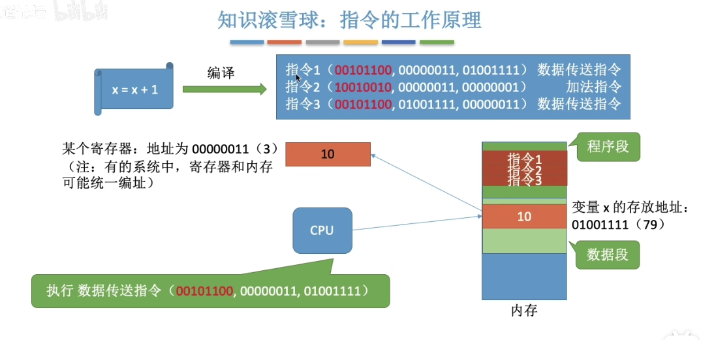

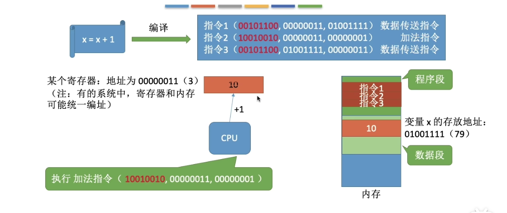

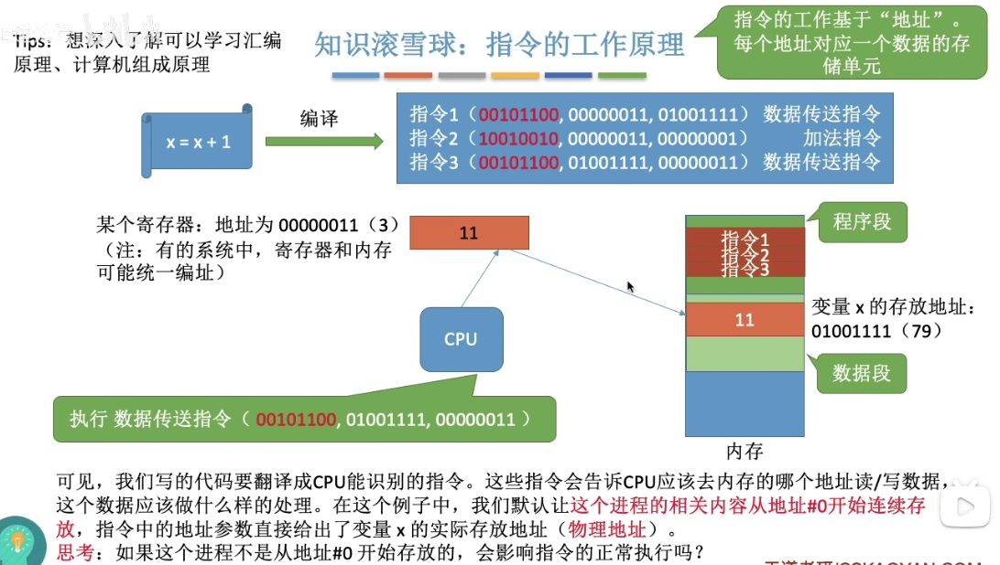

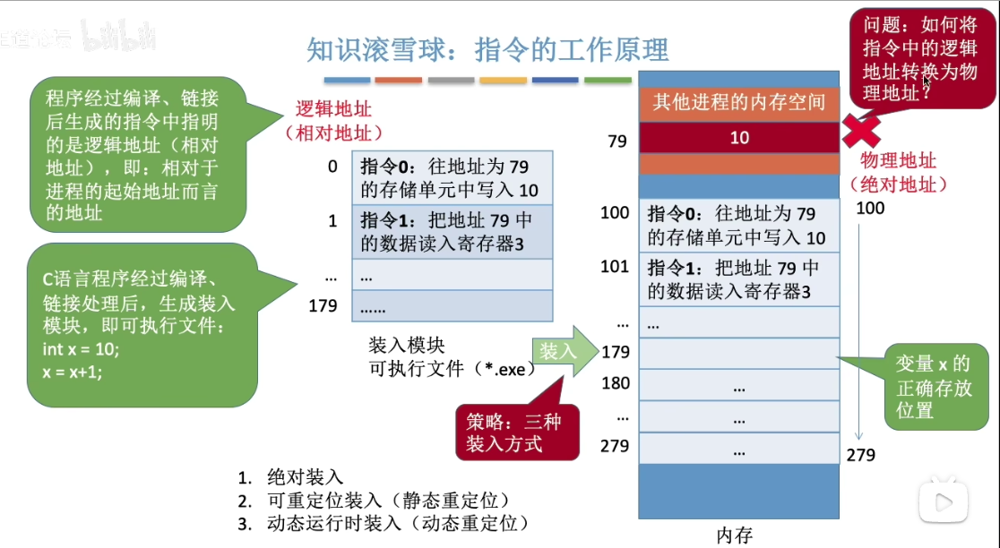


程序装入方式：逻辑地址转换为物理地址（地址转换）
* 绝对装入：已淘汰
* 可重定位装入：已淘汰
* 动态运行时装入：在用


从写程序到程序运行：

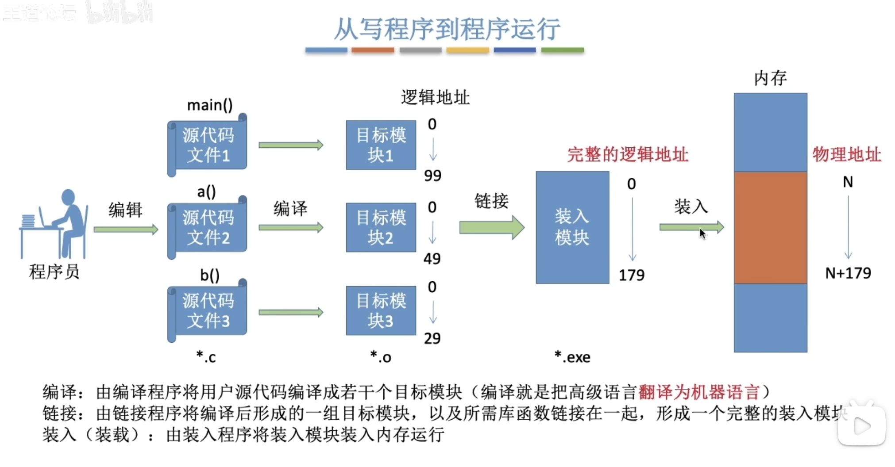


程序链接方式：链接即把各个目标模块的逻辑地址组合起来形成一个完整的逻辑地址
* 静态链接
* 装入时动态链接
* 运行时动态链接
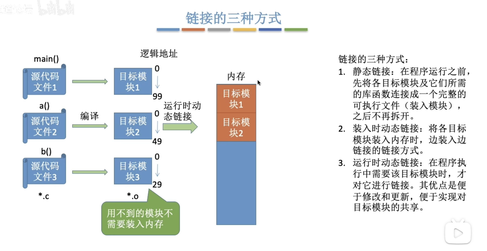

## 2. 内存管理的概念

内存管理需要实现的功能：
1. 内存空间分配与回收： 管理空间/非空虚区域
2. 逻辑上对内存空间的扩充：实现虚拟性，把物理上很小的内存拓展为逻辑上很大的内存
3. 地址转换：负责逻辑地址与物理地址的转换：三种装入方式。为了使编程更方便，程序员写程序时只需关注指令，数据的逻辑地址。而逻辑地址到物理地址的转换（这个过程称为地址重定位）应由操作系统负责，这样保证了程序员写程序时不需要关注物理内存的实际情况。
4. 内存保护：保证各进程在各自存储空间内运行，互不干扰。
	1. 上，下限寄存器
	2. 重定位寄存器+界地址寄存器


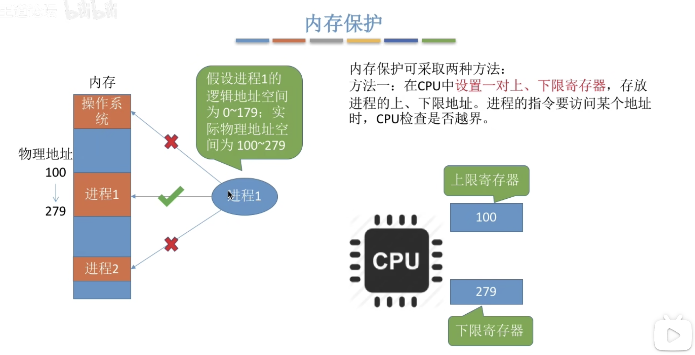
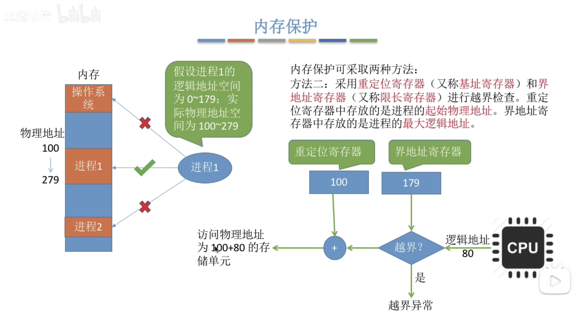
计算机系统主要目的是执行程序，在执行程序及其访问数据应该**至少部分在内存里**。

为提高CPU利用率和响应用户的速度，通用计算机在内存里必须保留多个进程，也就是必须共享内存。

内存由一个很大的**字节数组来**组成，每个字节都有各自的地址(即内存地址)。

CPU根据**程序计数器**的值从内存中提取指令，这些指令可能引起对特定内存地址的额外加载或存储。

操作系统之内存管理: https://zhuanlan.zhihu.com/p/143273007


## 2. 内存空间分配与回收


内存空间分配与回收：
* 连续分配管理方式：连续分配---指为用户进程分配的必须是一个连续的内存空间
	* 单一连续分配：已淘汰，早期PC操作系统MS-DOS，
	* 固定分区分配：已淘汰，早期多道处理系统
	* 动态分区分配；
* 非连续分配管理方式
	* 基本分页存储管理
	* 基本分段存储管理
	* 段页式存储管理

### 2.1 单一连续分配

### 2.2 固定分区分配(连续)


### 2.3 动态分区分配(连续)


### 2.4 动态分区分配算法

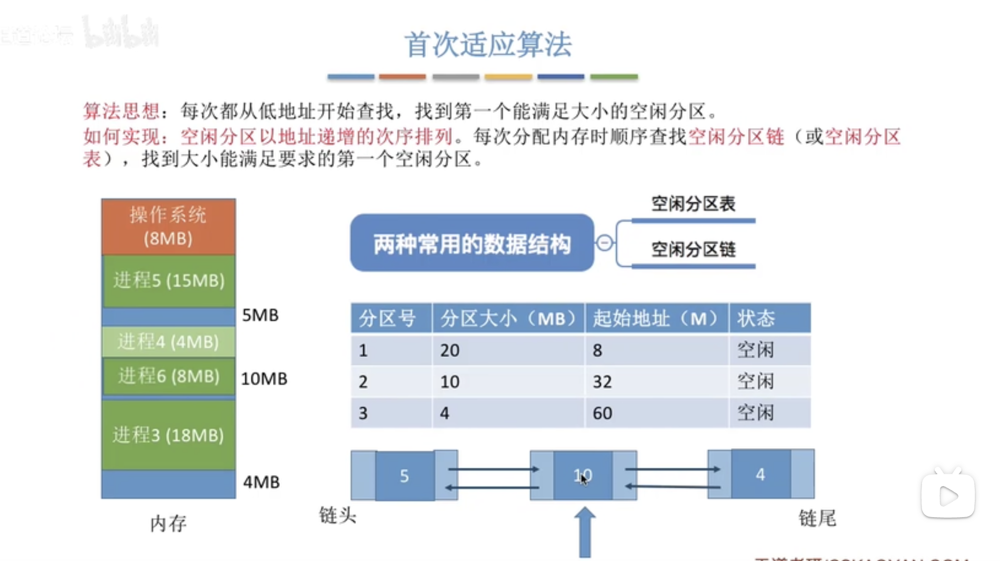


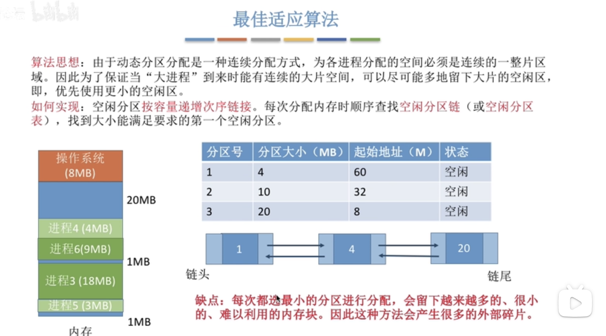
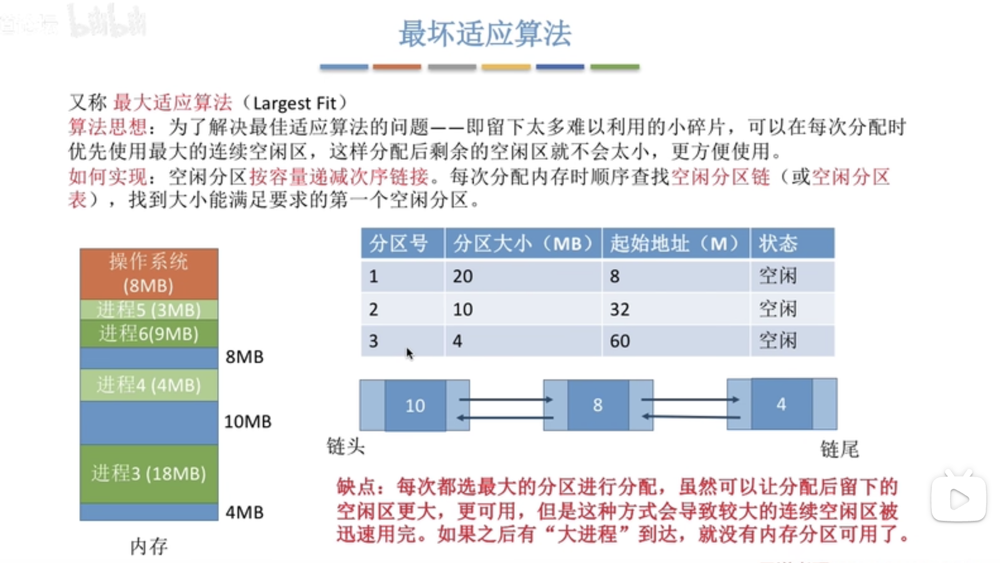
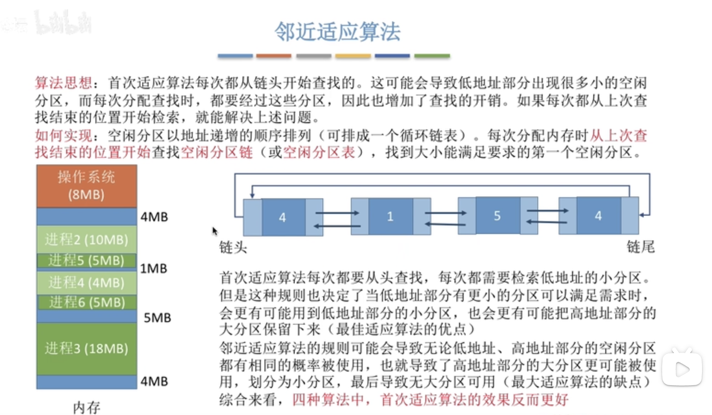


### 2.5 分页存储

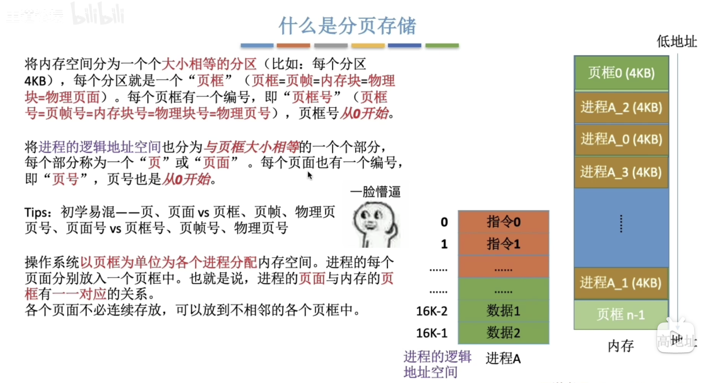

## 3. 内存空间的扩充

内存空间的扩充：实现虚拟性
* 覆盖技术：已淘汰
* 交换技术
* 虚拟存储技术
### 3.1 覆盖技术
用来解决“程序大小超过物理内存总和”的问题
覆盖技术思想：将程序分为多个段(多个模块)，常用的段常驻内存，不常用的段在需要时掉入内存
内存中分为一个“固定区”和若干“覆盖区”。需要常驻内存的段放在“固定区”，调入后不再调出(除非运行结束)。不常用的段放在“覆盖区”，需要用到时调入内存，用不到时调出内存
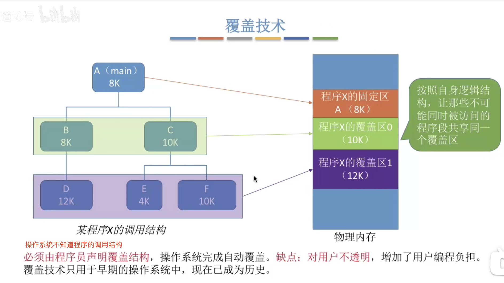
### 3.2 交换技术
交换(对换)技术设计思想：内存空间紧张时，系统将内存中某些进程暂时换出外存，把外存中某些已具备运行条件的进程换入内存(进程在内存与磁盘间动态调度)。进程在内存与外存间动态调度，进程相关的PCB会一直保留在内存中，并放到挂起堆里。
中级调度（内存调度）：就是要决定将哪个处于挂起状态的进程重新调入内存
暂时换出外存等待的进程状态为挂起状态（挂起态，suspend）
挂起态又可以分为就绪挂起，阻塞挂起两种状态

覆盖技术与交换技术区别：
* 覆盖技术在同一个程序或进程中
* 交换在不同进程（或作业）之间


### 3.3 虚拟存储技术

## 4. 地址转换
：逻辑地址与物理地址的转换：三种装入方式

## 5. 内存保护
：保证各进程在各自存储空间内运行，互不干扰


## 20-内存管理（上）：为客户保密，规划进程内存空间布局

平时我们说计算机的“计算”两个字，其实说的就是两方面，第一，进程和线程对于CPU的使用；第二，对于内存的管理。所以从这一节开始，我们来看看内存管理的机制。

我之前说把内存管理比喻为一个项目组的“封闭开发的会议室”。很显然，如果不隔离，就会不安全、就会泄密，因而，我们说每个进程应该有自己的内存空间。内存空间都是独立的、相互隔离的。对于每个进程来讲，看起来应该都是独占的。

### 独享内存空间的原理

之前我只是简单地形容了一下。这一节，我们来深入分析一下，为啥一定要封闭开发呢？

执行一个项目，要依赖于项目执行计划书里的一行一行指令。项目只要按这些指令运行就行了。但是，在运行指令的过程中，免不了要产生一些数据。这些数据要保存在一个地方，这个地方就是内存，也就是我们刚才说的“会议室”。

和会议室一样，**内存都被分成一块一块儿的，都编好了号**。例如3F-10，就是三楼十号会议室。内存也有这样一个地址。这个地址是实实在在的地址，通过这个地址我们就能够定位到物理内存的位置。

使用这种类型的地址会不会有问题呢？我们的二进制程序，也就是项目执行计划书，都是事先写好的，可以多次运行的。如果里面有个指令是，要把用户输入的数字保存在内存中，那就会有问题。


会产生什么问题呢？我举个例子你就明白了。如果我们使用那个实实在在的地址，3F-10，打开三个相同的程序，都执行到某一步。比方说，打开了三个计算器，用户在这三个程序的界面上分别输入了10、100、1000。如果内存中的这个位置只能保存一个数，那应该保存哪个呢？这不就冲突了吗？

如果不用这个实实在在的地址，那应该怎么办呢？于是，我们就想出一个办法，那就是**封闭开发**。

每个项目的物理地址对于进程不可见，谁也不能直接访问这个物理地址。操作系统会给进程分配一个虚拟地址。所有进程看到的这个地址都是一样的，里面的内存都是从0开始编号。

在程序里面，指令写入的地址是虚拟地址。例如，位置为10M的内存区域，操作系统会提供一种机制，将不同进程的虚拟地址和不同内存的物理地址映射起来。

当程序要访问虚拟地址的时候，由内核的数据结构进行转换，转换成不同的物理地址，这样不同的进程运行的时候，写入的是不同的物理地址，这样就不会冲突了。

### 规划虚拟地址空间

通过以上的原理，我们可以看出，操作系统的内存管理，主要分为三个方面。

第一，物理内存的管理，相当于会议室管理员管理会议室。

第二，虚拟地址的管理，也即在项目组的视角，会议室的虚拟地址应该如何组织。

第三，虚拟地址和物理地址如何映射，也即会议室管理员如果管理映射表。

接下来，我们都会围绕虚拟地址和物理地址展开。这两个概念有点绕，很多时候你可能会犯糊涂：这个地方，我们用的是虚拟地址呢，还是物理地址呢？所以，请你在学习这一章节的时候，时刻问自己这个问题。

我们还是切换到外包公司老板的角度。现在，如果让你规划一下，到底应该怎么管理会议室，你会怎么办？是不是可以先听听项目组的意见，收集一下需求。

于是，你看到了项目组的项目执行计划书是这样一个程序。

```
#include <stdio.h>
#include <stdlib.h>

int max_length = 128;

char * generate(int length){
  int i;
  char * buffer = (char*) malloc (length+1);
  if (buffer == NULL)
    return NULL;
  for (i=0; i<length; i++){
    buffer[i]=rand()%26+'a';
  }
  buffer[length]='\0';
  return buffer;
}

int main(int argc, char *argv[])
{
  int num;
  char * buffer;

  printf ("Input the string length : ");
  scanf ("%d", &num);

  if(num > max_length){
    num = max_length;
  }

  buffer = generate(num);

  printf ("Random string is: %s\n",buffer);
  free (buffer);

  return 0;
}
```

这个程序比较简单，就是根据用户输入的整数来生成字符串，最长是128。由于字符串的长度不是固定的，因而不能提前知道，需要动态地分配内存，使用malloc函数。当然用完了需要释放内存，这就要使用free函数。

我们来总结一下，这个简单的程序使用哪些内存的几种方式：

- 代码需要放在内存里面；
- 全局变量，例如max_length；
- 常量字符串"Input the string length : "；
- 函数栈，例如局部变量num是作为参数传给generate函数的，这里面涉及了函数调用，局部变量，函数参数等都是保存在函数栈上面的；
- 堆，malloc分配的内存在堆里面；
- 这里面涉及对glibc的调用，所以glibc的代码是以so文件的形式存在的，也需要放在内存里面。

这就完了吗？还没有呢，别忘了malloc会调用系统调用，进入内核，所以这个程序一旦运行起来，内核部分还需要分配内存：

- 内核的代码要在内存里面；
- 内核中也有全局变量；
- 每个进程都要有一个task_struct；
- 每个进程还有一个内核栈；
- 在内核里面也有动态分配的内存；
- 虚拟地址到物理地址的映射表放在哪里？

竟然收集了这么多的需求，看来做个内存管理还是挺复杂的啊！

我们现在来问一下自己，上面的这些内存里面的数据，应该用虚拟地址访问呢？还是应该用物理地址访问呢？

你可能会说，这很简单嘛。用户态的用虚拟地址访问，内核态的用物理地址访问。其实不是的。你有没有想过，内核里面的代码如果都使用物理地址，就相当于公司里的项目管理部门、文档管理部门都可以直接使用实际的地址访问会议室，这对于会议室管理部门来讲，简直是一个“灾难”。因为一旦到了内核，大家对于会议室的访问都脱离了会议室管理部门的控制。

所以，我们应该清楚一件事情，真正能够使用会议室的物理地址的，只有会议室管理部门，所有其他部门的行为涉及访问会议室的，都要统统使用虚拟地址，统统到会议室管理部门哪里转换一道，才能进行统一的控制。

我上面列举出来的，对于内存的访问，用户态的进程使用虚拟地址，这点毫无疑问，内核态的也基本都是使用虚拟地址，只有最后一项容易让人产生疑问。虚拟地址到物理地址的映射表，这个感觉起来是内存管理模块的一部分，这个是“实”是“虚”呢？这个问题先保留，我们暂不讨论，放到内存映射那一节见分晓。

既然都是虚拟地址，我们就先不管映射到物理地址以后是如何布局的，反正现在至少从“虚”的角度来看，这一大片连续的内存空间都是我的了。

如果是32位，有2^32 = 4G的内存空间都是我的，不管内存是不是真的有4G。如果是64位，在x86_64下面，其实只使用了48位，那也挺恐怖的。48位地址长度也就是对应了256TB的地址空间。我都没怎么见过256T的硬盘，别说是内存了。

现在，你可比世界首富房子还大。虽然是虚拟的。下面你可以尽情地去排列咱们要放的东西。请记住，现在你是站在一个进程的角度去看这个虚拟的空间，不用管其他进程。

首先，这么大的虚拟空间一切二，一部分用来放内核的东西，称为**内核空间**，一部分用来放进程的东西，称为**用户空间**。用户空间在下，在低地址，我们假设就是0号到29号会议室；内核空间在上，在高地址，我们假设是30号到39号会议室。这两部分空间的分界线因为32位和64位的不同而不同，我们这里不深究。

对于普通进程来说，内核空间的那部分虽然虚拟地址在那里，但是不能访问。这就像作为普通员工，你明明知道财务办公室在这个30号会议室门里面，但是门上挂着“闲人免进”，你只能在自己的用户空间里面折腾。


我们从最低位开始排起，先是**Text Segment、Data Segment和BSS Segment**。Text Segment是存放二进制可执行代码的位置，Data Segment存放静态常量，BSS Segment存放未初始化的静态变量。是不是觉得这几个名字很熟悉？没错，咱们前面讲ELF格式的时候提到过，在二进制执行文件里面，就有这三个部分。这里就是把二进制执行文件的三个部分加载到内存里面。

接下来是**堆**（Heap）**段**。堆是往高地址增长的，是用来动态分配内存的区域，malloc就是在这里面分配的。

接下来的区域是**Memory Mapping Segment**。这块地址可以用来把文件映射进内存用的，如果二进制的执行文件依赖于某个动态链接库，就是在这个区域里面将so文件映射到了内存中。

再下面就是**栈**（Stack）**地址段**。主线程的函数调用的函数栈就是用这里的。

如果普通进程还想进一步访问内核空间，是没办法的，只能眼巴巴地看着。如果需要进行更高权限的工作，就需要调用系统调用，进入内核。

一旦进入了内核，就换了一副视角。刚才是普通进程的视角，觉着整个空间是它独占的，没有其他进程存在。当然另一个进程也这样认为，因为它们互相看不到对方。这也就是说，不同进程的0号到29号会议室放的东西都不一样。

但是到了内核里面，无论是从哪个进程进来的，看到的都是同一个内核空间，看到的都是同一个进程列表。虽然内核栈是各用个的，但是如果想知道的话，还是能够知道每个进程的内核栈在哪里的。所以，如果要访问一些公共的数据结构，需要进行锁保护。也就是说，不同的进程进入到内核后，进入的30号到39号会议室是同一批会议室。


内核的代码访问内核的数据结构，大部分的情况下都是使用虚拟地址的，虽然内核代码权限很大，但是能够使用的虚拟地址范围也只能在内核空间，也即内核代码访问内核数据结构。只能用30号到39号这些编号，不能用0到29号，因为这些是被进程空间占用的。而且，进程有很多个。你现在在内核，但是你不知道当前指的0号是哪个进程的0号。

在内核里面也会有内核的代码，同样有Text Segment、Data Segment和BSS Segment，别忘了咱们讲内核启动的时候，内核代码也是ELF格式的。

内核的其他数据结构的分配方式就比较复杂了，这一节我们先不讲。

### 总结时刻

好了，这一节就到这里了，我们来总结一下。这一节我们讲了为什么要独享内存空间，并且站在老板的角度，设计了虚拟地址空间应该存放的数据。

通过这一节，你应该知道，一个内存管理系统至少应该做三件事情：

- 第一，虚拟内存空间的管理，每个进程看到的是独立的、互不干扰的虚拟地址空间；
- 第二，物理内存的管理，物理内存地址只有内存管理模块能够使用；
- 第三，内存映射，需要将虚拟内存和物理内存映射、关联起来。

### 课堂练习

这一节我们讲了进程内存空间的布局，请找一下，有没有一个命令可以查看进程内存空间的布局，打印出来看一下，这对我们后面解析非常有帮助。

欢迎留言和我分享你的疑惑和见解，也欢迎你收藏本节内容，反复研读。你也可以把今天的内容分享给你的朋友，和他一起学习、进步。


### 精选留言：

- lfn 2019-05-13 01:04:08

  cat /proc/$pid/map [4赞]
- 
- 雪人 2019-05-13 10:35:26

  老师，我想问一下，所有进程的内核空间是共用一块内存吗？还有就是，是不是可以这样理解，用户空间是负责办事情的，内核空间是负责管理所有进程的资源，以及负责与内核一些不公开的资源进行交互的？
- CHEN 2019-05-13 10:18:50

  为什么我打印出来的进程内存空间没有堆heap？是因为用的是阿里云的服务器，aiter童鞋是本地安装的虚拟机么？
  查看并打印进程空间布局 cat /proc/$pid/maps
  1 test.c copy老师的示例代码直接编译,或是自己写设置一个中断,sleep(10000);或是getchar();接收键盘输入一个字符
  2 ./a.out & 后台运行
  [root@localhost process]# ./a.out &
  [1] 25155
  [root@localhost process]# cat /proc/25155/maps
  00400000-00401000 r-xp 00000000 fd:01 423732 /root/process/a.out
  00600000-00601000 r--p 00000000 fd:01 423732 /root/process/a.out
  00601000-00602000 rw-p 00001000 fd:01 423732 /root/process/a.out
  7ff172733000-7ff1728eb000 r-xp 00000000 fd:01 1049989 /usr/lib64/libc-2.17.so
  7ff1728eb000-7ff172aeb000 ---p 001b8000 fd:01 1049989 /usr/lib64/libc-2.17.so
  7ff172aeb000-7ff172aef000 r--p 001b8000 fd:01 1049989 /usr/lib64/libc-2.17.so
  7ff172aef000-7ff172af1000 rw-p 001bc000 fd:01 1049989 /usr/lib64/libc-2.17.so
  7ff172af1000-7ff172af6000 rw-p 00000000 00:00 0
  7ff172af6000-7ff172b17000 r-xp 00000000 fd:01 1049982 /usr/lib64/ld-2.17.so
  7ff172d0a000-7ff172d0d000 rw-p 00000000 00:00 0
  7ff172d14000-7ff172d17000 rw-p 00000000 00:00 0
  7ff172d17000-7ff172d18000 r--p 00021000 fd:01 1049982 /usr/lib64/ld-2.17.so
  7ff172d18000-7ff172d19000 rw-p 00022000 fd:01 1049982 /usr/lib64/ld-2.17.so
  7ff172d19000-7ff172d1a000 rw-p 00000000 00:00 0
  7ffed45db000-7ffed45fc000 rw-p 00000000 00:00 0 [stack]
  7ffed45fd000-7ffed45ff000 r-xp 00000000 00:00 0 [vdso]
  ffffffffff600000-ffffffffff601000 r-xp 00000000 00:00 0 [vsyscall]
- 有铭 2019-05-13 10:18:48

  请问，老师的意思是，内核空间其实是完全共享的吗？大家看到的数据都是相同的，如果修改数据，会影响到所有进程？也就是说，其实内核空间其实只占用一份物理内存？另外，既然都是相同的，所谓“内核栈是各用各的”是啥意思？
- Linuxer 2019-05-13 08:36:51

  pmap pid
- aiter 2019-05-13 08:18:58

  cat /proc/22528/maps
  00400000-00406000 r-xp 00000000 08:03 2886947 /usr/bin/sleep
  00606000-00607000 r--p 00006000 08:03 2886947 /usr/bin/sleep
  00607000-00608000 rw-p 00007000 08:03 2886947 /usr/bin/sleep
  01ecc000-01eed000 rw-p 00000000 00:00 0 [heap]
  7fef2bb48000-7fef3206f000 r--p 00000000 08:03 2888013 /usr/lib/locale/locale-archive
  7fef3206f000-7fef32225000 r-xp 00000000 08:03 269589 /usr/lib64/libc-2.17.so
  7fef32225000-7fef32425000 ---p 001b6000 08:03 269589 /usr/lib64/libc-2.17.so
  7fef32425000-7fef32429000 r--p 001b6000 08:03 269589 /usr/lib64/libc-2.17.so
  7fef32429000-7fef3242b000 rw-p 001ba000 08:03 269589 /usr/lib64/libc-2.17.so
  7fef3242b000-7fef32430000 rw-p 00000000 00:00 0
  7fef32430000-7fef32451000 r-xp 00000000 08:03 269280 /usr/lib64/ld-2.17.so
  7fef32640000-7fef32643000 rw-p 00000000 00:00 0
  7fef32650000-7fef32651000 rw-p 00000000 00:00 0
  7fef32651000-7fef32652000 r--p 00021000 08:03 269280 /usr/lib64/ld-2.17.so
  7fef32652000-7fef32653000 rw-p 00022000 08:03 269280 /usr/lib64/ld-2.17.so
  7fef32653000-7fef32654000 rw-p 00000000 00:00 0
  7fff81aa3000-7fff81ac4000 rw-p 00000000 00:00 0 [stack]
  7fff81b8d000-7fff81b8f000 r-xp 00000000 00:00 0 [vdso]
  ffffffffff600000-ffffffffff601000 r-xp 00000000 00:00 0 [vsyscall]

## 21-内存管理（下）：为客户保密，项目组独享会议室封闭开发

上一节，我们讲了虚拟空间的布局。接下来，我们需要知道，如何将其映射成为物理地址呢？

你可能已经想到了，咱们前面讲x86 CPU的时候，讲过分段机制，咱们规划虚拟空间的时候，也是将空间分成多个段进行保存。

那就直接用分段机制呗。我们来看看分段机制的原理。


分段机制下的虚拟地址由两部分组成，**段选择子**和**段内偏移量**。段选择子就保存在咱们前面讲过的段寄存器里面。段选择子里面最重要的是**段号**，用作段表的索引。段表里面保存的是这个段的**基地址**、**段的界限**和**特权等级**等。虚拟地址中的段内偏移量应该位于0和段界限之间。如果段内偏移量是合法的，就将段基地址加上段内偏移量得到物理内存地址。

例如，我们将上面的虚拟空间分成以下4个段，用0～3来编号。每个段在段表中有一个项，在物理空间中，段的排列如下图的右边所示。


如果要访问段2中偏移量600的虚拟地址，我们可以计算出物理地址为，段2基地址2000 + 偏移量600 = 2600。

多好的机制啊！我们来看看Linux是如何使用这个机制的。

在Linux里面，段表全称**段描述符表**（segment descriptors），放在**全局描述符表GDT**（Global Descriptor Table）里面，会有下面的宏来初始化段描述符表里面的表项。

```
#define GDT_ENTRY_INIT(flags, base, limit) { { { \
		.a = ((limit) & 0xffff) | (((base) & 0xffff) << 16), \
		.b = (((base) & 0xff0000) >> 16) | (((flags) & 0xf0ff) << 8) | \
			((limit) & 0xf0000) | ((base) & 0xff000000), \
	} } }
```

一个段表项由段基地址base、段界限limit，还有一些标识符组成。

```
DEFINE_PER_CPU_PAGE_ALIGNED(struct gdt_page, gdt_page) = { .gdt = {
#ifdef CONFIG_X86_64
	[GDT_ENTRY_KERNEL32_CS]		= GDT_ENTRY_INIT(0xc09b, 0, 0xfffff),
	[GDT_ENTRY_KERNEL_CS]		= GDT_ENTRY_INIT(0xa09b, 0, 0xfffff),
	[GDT_ENTRY_KERNEL_DS]		= GDT_ENTRY_INIT(0xc093, 0, 0xfffff),
	[GDT_ENTRY_DEFAULT_USER32_CS]	= GDT_ENTRY_INIT(0xc0fb, 0, 0xfffff),
	[GDT_ENTRY_DEFAULT_USER_DS]	= GDT_ENTRY_INIT(0xc0f3, 0, 0xfffff),
	[GDT_ENTRY_DEFAULT_USER_CS]	= GDT_ENTRY_INIT(0xa0fb, 0, 0xfffff),
#else
	[GDT_ENTRY_KERNEL_CS]		= GDT_ENTRY_INIT(0xc09a, 0, 0xfffff),
	[GDT_ENTRY_KERNEL_DS]		= GDT_ENTRY_INIT(0xc092, 0, 0xfffff),
	[GDT_ENTRY_DEFAULT_USER_CS]	= GDT_ENTRY_INIT(0xc0fa, 0, 0xfffff),
	[GDT_ENTRY_DEFAULT_USER_DS]	= GDT_ENTRY_INIT(0xc0f2, 0, 0xfffff),
......
#endif
} };
EXPORT_PER_CPU_SYMBOL_GPL(gdt_page);
```

这里面对于64位的和32位的，都定义了内核代码段、内核数据段、用户代码段和用户数据段。

另外，还会定义下面四个段选择子，指向上面的段描述符表项。这四个段选择子看着是不是有点眼熟？咱们讲内核初始化的时候，启动第一个用户态的进程，就是将这四个值赋值给段寄存器。

```
#define __KERNEL_CS			(GDT_ENTRY_KERNEL_CS*8)
#define __KERNEL_DS			(GDT_ENTRY_KERNEL_DS*8)
#define __USER_DS			(GDT_ENTRY_DEFAULT_USER_DS*8 + 3)
#define __USER_CS			(GDT_ENTRY_DEFAULT_USER_CS*8 + 3)
```

通过分析，我们发现，所有的段的起始地址都是一样的，都是0。这算哪门子分段嘛！所以，在Linux操作系统中，并没有使用到全部的分段功能。那分段是不是完全没有用处呢？分段可以做权限审核，例如用户态DPL是3，内核态DPL是0。当用户态试图访问内核态的时候，会因为权限不足而报错。

其实Linux倾向于另外一种从虚拟地址到物理地址的转换方式，称为**分页**（Paging）。

对于物理内存，操作系统把它分成一块一块大小相同的页，这样更方便管理，例如有的内存页面长时间不用了，可以暂时写到硬盘上，称为**换出**。一旦需要的时候，再加载进来，叫作**换入**。这样可以扩大可用物理内存的大小，提高物理内存的利用率。

这个换入和换出都是以页为单位的。页面的大小一般为4KB。为了能够定位和访问每个页，需要有个页表，保存每个页的起始地址，再加上在页内的偏移量，组成线性地址，就能对于内存中的每个位置进行访问了。


虚拟地址分为两部分，**页号**和**页内偏移**。页号作为页表的索引，页表包含物理页每页所在物理内存的基地址。这个基地址与页内偏移的组合就形成了物理内存地址。

下面的图，举了一个简单的页表的例子，虚拟内存中的页通过页表映射为了物理内存中的页。


32位环境下，虚拟地址空间共4GB。如果分成4KB一个页，那就是1M个页。每个页表项需要4个字节来存储，那么整个4GB空间的映射就需要4MB的内存来存储映射表。如果每个进程都有自己的映射表，100个进程就需要400MB的内存。对于内核来讲，有点大了 。

页表中所有页表项必须提前建好，并且要求是连续的。如果不连续，就没有办法通过虚拟地址里面的页号找到对应的页表项了。

那怎么办呢？我们可以试着将页表再分页，4G的空间需要4M的页表来存储映射。我们把这4M分成1K（1024）个4K，每个4K又能放在一页里面，这样1K个4K就是1K个页，这1K个页也需要一个表进行管理，我们称为页目录表，这个页目录表里面有1K项，每项4个字节，页目录表大小也是4K。

页目录有1K项，用10位就可以表示访问页目录的哪一项。这一项其实对应的是一整页的页表项，也即4K的页表项。每个页表项也是4个字节，因而一整页的页表项是1K个。再用10位就可以表示访问页表项的哪一项，页表项中的一项对应的就是一个页，是存放数据的页，这个页的大小是4K，用12位可以定位这个页内的任何一个位置。

这样加起来正好32位，也就是用前10位定位到页目录表中的一项。将这一项对应的页表取出来共1k项，再用中间10位定位到页表中的一项，将这一项对应的存放数据的页取出来，再用最后12位定位到页中的具体位置访问数据。


你可能会问，如果这样的话，映射4GB地址空间就需要4MB+4KB的内存，这样不是更大了吗？ 当然如果页是满的，当时是更大了，但是，我们往往不会为一个进程分配那么多内存。

比如说，上面图中，我们假设只给这个进程分配了一个数据页。如果只使用页表，也需要完整的1M个页表项共4M的内存，但是如果使用了页目录，页目录需要1K个全部分配，占用内存4K，但是里面只有一项使用了。到了页表项，只需要分配能够管理那个数据页的页表项页就可以了，也就是说，最多4K，这样内存就节省多了。

当然对于64位的系统，两级肯定不够了，就变成了四级目录，分别是全局页目录项PGD（Page Global Directory）、上层页目录项PUD（Page Upper Directory）、中间页目录项PMD（Page Middle Directory）和页表项PTE（Page Table Entry）。


### 总结时刻

这一节我们讲了分段机制、分页机制以及从虚拟地址到物理地址的映射方式。总结一下这两节，我们可以把内存管理系统精细化为下面三件事情：

- 第一，虚拟内存空间的管理，将虚拟内存分成大小相等的页；
- 第二，物理内存的管理，将物理内存分成大小相等的页；
- 第三，内存映射，将虚拟内存也和物理内存也映射起来，并且在内存紧张的时候可以换出到硬盘中。


### 课堂练习

这一节我们说一个页的大小为4K，有时候我们需要为应用配置大页（HugePage）。请你查一下大页的大小及配置方法，咱们后面会用到。

欢迎留言和我分享你的疑惑和见解，也欢迎你收藏本节内容，反复研读。你也可以把今天的内容分享给你的朋友，和他一起学习、进步。


### 精选留言：

- Leon📷 2019-05-15 07:44:09

  分页机制本质上来说就是类似于linux文件系统的目录管理一样，页目录项和页表项相当于根目录和上级目录，页内便宜量就是相对路径，绝对路径就是整个32位地址，分布式存储系统也是采用的类似的机制，先用元数据存储前面的路径，再用块内偏移定位到具体文件，感觉道理都差不多 [2赞]
- why 2019-05-16 17:00:54

  \- 内存管理(下)
  \- 虚拟内存地址到物理内存地址的映射
  \- 分段
  \- 虚拟地址 = 段选择子(段寄存器) + 段内偏移量
  \- 段选择子 = 段号(段表索引) + 标识位
  \- 段表 = 物理基地址 + 段界限(偏移量范围) + 特权等级
  \- Linux 分段实现
  \- 段表称为段描述符表, 放在全局标识符表中
  \- Linux 将段基地址都初始化为 0, 不用于地址映射
  \- Linux 分段功能主要用于权限检查
  \- Linux 通过分页实现映射
  \- 物理内存被换分为大小固定(4KB)的页, 物理页可在内存与硬盘间换出/换入
  \- 页表 = 虚拟页号 + 物理页号; 用于定位页
  \- 虚拟地址 = 虚拟页号 + 页内偏移
  \- 若采用单页表, 32位系统中一个页表将有 1M 页表项, 占用 4MB(每项 4B)
  \- Linux 32位系统采用两级页表: 页表目录(1K项, 10bit) + 页表(1K项, 10bit)(页大小(4KB, 12bit))
  \- 映射 4GB 内存理论需要 1K 个页表目录项 + 1K\*1K=1M 页表项, 将占用 4KB+4MB 空间
  \- 因为完整的页表目录可以满足所有地址的查询, 因此页表只需在对应地址有内存分配时才生成;
  \- 64 为系统采用 4 级页表 [1赞]
- Sharry 2019-05-15 18:02:54

  Nice, 终于看到最想了解的虚拟空间与物理页面的映射了
- Earl 2019-05-15 17:52:14

  页的大小必须是2的n次方，而且与TLB的结构有关
- 崔伟协 2019-05-15 16:54:32

  分页，分段机制的优劣在于哪儿呢，为什么有分页分段
- Helios 2019-05-15 13:25:25

  请问老师为什么一个表项用4个字节去存储呢

  作者回复2019-05-15 13:52:49

  规定，可以去查一下表项的结构，太细节了，所以这里没有提
- 有铭 2019-05-15 09:54:40

  为什么页的默认大小是4KB，这是以什么理由定下来的，为什么不是2KB或者8KB呢

## 22-进程空间管理：项目组还可以自行布置会议室

上两节，我们讲了内存管理的三个方面，虚拟内存空间的管理、物理内存的管理以及内存映射。你现在对进程内存空间的整体布局应该有了一个大致的了解。今天我们就来详细看看第一个方面，进程的虚拟内存空间是如何管理的。

32位系统和64位系统的内存布局有的地方相似，有的地方差别比较大，接下来介绍的时候，请你注意区分。好，我们现在正式开始！

### 用户态和内核态的划分

进程的虚拟地址空间，其实就是站在项目组的角度来看内存，所以我们就从task_struct出发来看。这里面有一个struct mm_struct结构来管理内存。

```
struct mm_struct		*mm;
```

在struct mm_struct里面，有这样一个成员变量：

```
unsigned long task_size;		/* size of task vm space */
```

我们之前讲过，整个虚拟内存空间要一分为二，一部分是用户态地址空间，一部分是内核态地址空间，那这两部分的分界线在哪里呢？这就要task_size来定义。

对于32位的系统，内核里面是这样定义TASK_SIZE的：

```
#ifdef CONFIG_X86_32
/*
 * User space process size: 3GB (default).
 */
#define TASK_SIZE		PAGE_OFFSET
#define TASK_SIZE_MAX		TASK_SIZE
/*
config PAGE_OFFSET
        hex
        default 0xC0000000
        depends on X86_32
*/
#else
/*
 * User space process size. 47bits minus one guard page.
*/
#define TASK_SIZE_MAX	((1UL << 47) - PAGE_SIZE)
#define TASK_SIZE		(test_thread_flag(TIF_ADDR32) ? \
					IA32_PAGE_OFFSET : TASK_SIZE_MAX)
......
```

当执行一个新的进程的时候，会做以下的设置：

```
current->mm->task_size = TASK_SIZE;
```

对于32位系统，最大能够寻址2^32=4G，其中用户态虚拟地址空间是3G，内核态是1G。

对于64位系统，虚拟地址只使用了48位。就像代码里面写的一样，1左移了47位，就相当于48位地址空间一半的位置，0x0000800000000000，然后减去一个页，就是0x00007FFFFFFFF000，共128T。同样，内核空间也是128T。内核空间和用户空间之间隔着很大的空隙，以此来进行隔离。


### 用户态布局

我们先来看用户态虚拟空间的布局。

之前我们讲了用户态虚拟空间里面有几类数据，例如代码、全局变量、堆、栈、内存映射区等。在struct mm_struct里面，有下面这些变量定义了这些区域的统计信息和位置。

```
unsigned long mmap_base;	/* base of mmap area */
unsigned long total_vm;		/* Total pages mapped */
unsigned long locked_vm;	/* Pages that have PG_mlocked set */
unsigned long pinned_vm;	/* Refcount permanently increased */
unsigned long data_vm;		/* VM_WRITE & ~VM_SHARED & ~VM_STACK */
unsigned long exec_vm;		/* VM_EXEC & ~VM_WRITE & ~VM_STACK */
unsigned long stack_vm;		/* VM_STACK */
unsigned long start_code, end_code, start_data, end_data;
unsigned long start_brk, brk, start_stack;
unsigned long arg_start, arg_end, env_start, env_end;
```

其中，total_vm是总共映射的页的数目。我们知道，这么大的虚拟地址空间，不可能都有真实内存对应，所以这里是映射的数目。当内存吃紧的时候，有些页可以换出到硬盘上，有的页因为比较重要，不能换出。locked_vm就是被锁定不能换出，pinned_vm是不能换出，也不能移动。

data_vm是存放数据的页的数目，exec_vm是存放可执行文件的页的数目，stack_vm是栈所占的页的数目。

start_code和end_code表示可执行代码的开始和结束位置，start_data和end_data表示已初始化数据的开始位置和结束位置。

start_brk是堆的起始位置，brk是堆当前的结束位置。前面咱们讲过malloc申请一小块内存的话，就是通过改变brk位置实现的。

start_stack是栈的起始位置，栈的结束位置在寄存器的栈顶指针中。

arg_start和arg_end是参数列表的位置， env_start和env_end是环境变量的位置。它们都位于栈中最高地址的地方。

mmap_base表示虚拟地址空间中用于内存映射的起始地址。一般情况下，这个空间是从高地址到低地址增长的。前面咱们讲malloc申请一大块内存的时候，就是通过mmap在这里映射一块区域到物理内存。咱们加载动态链接库so文件，也是在这个区域里面，映射一块区域到so文件。

这下所有用户态的区域的位置基本上都描述清楚了。整个布局就像下面这张图这样。虽然32位和64位的空间相差很大，但是区域的类别和布局是相似的。


除了位置信息之外，struct mm_struct里面还专门有一个结构vm_area_struct，来描述这些区域的属性。

```
struct vm_area_struct *mmap;		/* list of VMAs */
struct rb_root mm_rb;
```

这里面一个是单链表，用于将这些区域串起来。另外还有一个红黑树。又是这个数据结构，在进程调度的时候我们用的也是红黑树。它的好处就是查找和修改都很快。这里用红黑树，就是为了快速查找一个内存区域，并在需要改变的时候，能够快速修改。

```
struct vm_area_struct {
	/* The first cache line has the info for VMA tree walking. */
	unsigned long vm_start;		/* Our start address within vm_mm. */
	unsigned long vm_end;		/* The first byte after our end address within vm_mm. */
	/* linked list of VM areas per task, sorted by address */
	struct vm_area_struct *vm_next, *vm_prev;
	struct rb_node vm_rb;
	struct mm_struct *vm_mm;	/* The address space we belong to. */
	struct list_head anon_vma_chain; /* Serialized by mmap_sem &
					  * page_table_lock */
	struct anon_vma *anon_vma;	/* Serialized by page_table_lock */
	/* Function pointers to deal with this struct. */
	const struct vm_operations_struct *vm_ops;
	struct file * vm_file;		/* File we map to (can be NULL). */
	void * vm_private_data;		/* was vm_pte (shared mem) */
} __randomize_layout;
```

vm_start和vm_end指定了该区域在用户空间中的起始和结束地址。vm_next和vm_prev将这个区域串在链表上。vm_rb将这个区域放在红黑树上。vm_ops里面是对这个内存区域可以做的操作的定义。

虚拟内存区域可以映射到物理内存，也可以映射到文件，映射到物理内存的时候称为匿名映射，anon_vma中，anoy就是anonymous，匿名的意思，映射到文件就需要有vm_file指定被映射的文件。

那这些vm_area_struct是如何和上面的内存区域关联的呢？

这个事情是在load_elf_binary里面实现的。没错，就是它。加载内核的是它，启动第一个用户态进程init的是它，fork完了以后，调用exec运行一个二进制程序的也是它。

当exec运行一个二进制程序的时候，除了解析ELF的格式之外，另外一个重要的事情就是建立内存映射。

```
static int load_elf_binary(struct linux_binprm *bprm)
{
......
  setup_new_exec(bprm);
......
  retval = setup_arg_pages(bprm, randomize_stack_top(STACK_TOP),
				 executable_stack);
......
  error = elf_map(bprm->file, load_bias + vaddr, elf_ppnt,
				elf_prot, elf_flags, total_size);
......
  retval = set_brk(elf_bss, elf_brk, bss_prot);
......
  elf_entry = load_elf_interp(&loc->interp_elf_ex,
					    interpreter,
					    &interp_map_addr,
					    load_bias, interp_elf_phdata);
......
  current->mm->end_code = end_code;
  current->mm->start_code = start_code;
  current->mm->start_data = start_data;
  current->mm->end_data = end_data;
  current->mm->start_stack = bprm->p;
......
}
```

load_elf_binary会完成以下的事情：

- 调用setup_new_exec，设置内存映射区mmap_base；
- 调用setup_arg_pages，设置栈的vm_area_struct，这里面设置了mm->arg_start是指向栈底的，current->mm->start_stack就是栈底；
- elf_map会将ELF文件中的代码部分映射到内存中来；
- set_brk设置了堆的vm_area_struct，这里面设置了current->mm->start_brk = current->mm->brk，也即堆里面还是空的；
- load_elf_interp将依赖的so映射到内存中的内存映射区域。

最终就形成下面这个内存映射图。


映射完毕后，什么情况下会修改呢？

第一种情况是函数的调用，涉及函数栈的改变，主要是改变栈顶指针。

第二种情况是通过malloc申请一个堆内的空间，当然底层要么执行brk，要么执行mmap。关于内存映射的部分，我们后面的章节讲，这里我们重点看一下brk是怎么做的。

brk系统调用实现的入口是sys_brk函数，就像下面代码定义的一样。

```
SYSCALL_DEFINE1(brk, unsigned long, brk)
{
	unsigned long retval;
	unsigned long newbrk, oldbrk;
	struct mm_struct *mm = current->mm;
	struct vm_area_struct *next;
......
	newbrk = PAGE_ALIGN(brk);
	oldbrk = PAGE_ALIGN(mm->brk);
	if (oldbrk == newbrk)
		goto set_brk;


	/* Always allow shrinking brk. */
	if (brk <= mm->brk) {
		if (!do_munmap(mm, newbrk, oldbrk-newbrk, &uf))
			goto set_brk;
		goto out;
	}


	/* Check against existing mmap mappings. */
	next = find_vma(mm, oldbrk);
	if (next && newbrk + PAGE_SIZE > vm_start_gap(next))
		goto out;


	/* Ok, looks good - let it rip. */
	if (do_brk(oldbrk, newbrk-oldbrk, &uf) < 0)
		goto out;


set_brk:
	mm->brk = brk;
......
	return brk;
out:
	retval = mm->brk;
	return retval
```

前面我们讲过了，堆是从低地址向高地址增长的，sys_brk函数的参数brk是新的堆顶位置，而当前的mm->brk是原来堆顶的位置。

首先要做的第一个事情，将原来的堆顶和现在的堆顶，都按照页对齐地址，然后比较大小。如果两者相同，说明这次增加的堆的量很小，还在一个页里面，不需要另行分配页，直接跳到set_brk那里，设置mm->brk为新的brk就可以了。

如果发现新旧堆顶不在一个页里面，麻烦了，这下要跨页了。如果发现新堆顶小于旧堆顶，这说明不是新分配内存了，而是释放内存了，释放的还不小，至少释放了一页，于是调用do_munmap将这一页的内存映射去掉。

如果堆将要扩大，就要调用find_vma。如果打开这个函数，看到的是对红黑树的查找，找到的是原堆顶所在的vm_area_struct的下一个vm_area_struct，看当前的堆顶和下一个vm_area_struct之间还能不能分配一个完整的页。如果不能，没办法只好直接退出返回，内存空间都被占满了。

如果还有空间，就调用do_brk进一步分配堆空间，从旧堆顶开始，分配计算出的新旧堆顶之间的页数。

```
static int do_brk(unsigned long addr, unsigned long len, struct list_head *uf)
{
	return do_brk_flags(addr, len, 0, uf);
}


static int do_brk_flags(unsigned long addr, unsigned long request, unsigned long flags, struct list_head *uf)
{
	struct mm_struct *mm = current->mm;
	struct vm_area_struct *vma, *prev;
	unsigned long len;
	struct rb_node **rb_link, *rb_parent;
	pgoff_t pgoff = addr >> PAGE_SHIFT;
	int error;


	len = PAGE_ALIGN(request);
......
	find_vma_links(mm, addr, addr + len, &prev, &rb_link,
			      &rb_parent);
......
	vma = vma_merge(mm, prev, addr, addr + len, flags,
			NULL, NULL, pgoff, NULL, NULL_VM_UFFD_CTX);
	if (vma)
		goto out;
......
	vma = kmem_cache_zalloc(vm_area_cachep, GFP_KERNEL);
	INIT_LIST_HEAD(&vma->anon_vma_chain);
	vma->vm_mm = mm;
	vma->vm_start = addr;
	vma->vm_end = addr + len;
	vma->vm_pgoff = pgoff;
	vma->vm_flags = flags;
	vma->vm_page_prot = vm_get_page_prot(flags);
	vma_link(mm, vma, prev, rb_link, rb_parent);
out:
	perf_event_mmap(vma);
	mm->total_vm += len >> PAGE_SHIFT;
	mm->data_vm += len >> PAGE_SHIFT;
	if (flags & VM_LOCKED)
		mm->locked_vm += (len >> PAGE_SHIFT);
	vma->vm_flags |= VM_SOFTDIRTY;
	return 0;
```

在do_brk中，调用find_vma_links找到将来的vm_area_struct节点在红黑树的位置，找到它的父节点、前序节点。接下来调用vma_merge，看这个新节点是否能够和现有树中的节点合并。如果地址是连着的，能够合并，则不用创建新的vm_area_struct了，直接跳到out，更新统计值即可；如果不能合并，则创建新的vm_area_struct，既加到anon_vma_chain链表中，也加到红黑树中。

### 内核态的布局

用户态虚拟空间分析完毕，接下来我们分析内核态虚拟空间。

内核态的虚拟空间和某一个进程没有关系，所有进程通过系统调用进入到内核之后，看到的虚拟地址空间都是一样的。

这里强调一下，千万别以为到了内核里面，咱们就会直接使用物理内存地址了，想当然地认为下面讨论的都是物理内存地址，不是的，这里讨论的还是虚拟内存地址，但是由于内核总是涉及管理物理内存，因而总是隐隐约约发生关系，所以这里必须思路清晰，分清楚物理内存地址和虚拟内存地址。

在内核态，32位和64位的布局差别比较大，主要是因为32位内核态空间太小了。

我们来看32位的内核态的布局。


32位的内核态虚拟地址空间一共就1G，占绝大部分的前896M，我们称为**直接映射区**。

所谓的直接映射区，就是这一块空间是连续的，和物理内存是非常简单的映射关系，其实就是虚拟内存地址减去3G，就得到物理内存的位置。

在内核里面，有两个宏：

- __pa(vaddr) 返回与虚拟地址 vaddr 相关的物理地址；
- __va(paddr) 则计算出对应于物理地址 paddr 的虚拟地址。

```
    #define __va(x)			((void *)((unsigned long)(x)+PAGE_OFFSET))
    #define __pa(x)		__phys_addr((unsigned long)(x))
    #define __phys_addr(x)		__phys_addr_nodebug(x)
    #define __phys_addr_nodebug(x)	((x) - PAGE_OFFSET)
```

但是你要注意，这里虚拟地址和物理地址发生了关联关系，在物理内存的开始的896M的空间，会被直接映射到3G至3G+896M的虚拟地址，这样容易给你一种感觉，是这些内存访问起来和物理内存差不多，别这样想，在大部分情况下，对于这一段内存的访问，在内核中，还是会使用虚拟地址的，并且将来也会为这一段空间建设页表，对这段地址的访问也会走上一节我们讲的分页地址的流程，只不过页表里面比较简单，是直接的一一对应而已。

这896M还需要仔细分解。在系统启动的时候，物理内存的前1M已经被占用了，从1M开始加载内核代码段，然后就是内核的全局变量、BSS等，也是ELF里面涵盖的。这样内核的代码段，全局变量，BSS也就会被映射到3G后的虚拟地址空间里面。具体的物理内存布局可以查看/proc/iomem。

在内核运行的过程中，如果碰到系统调用创建进程，会创建task_struct这样的实例，内核的进程管理代码会将实例创建在3G至3G+896M的虚拟空间中，当然也会被放在物理内存里面的前896M里面，相应的页表也会被创建。

在内核运行的过程中，会涉及内核栈的分配，内核的进程管理的代码会将内核栈创建在3G至3G+896M的虚拟空间中，当然也就会被放在物理内存里面的前896M里面，相应的页表也会被创建。

896M这个值在内核中被定义为high_memory，在此之上常称为“高端内存”。这是个很笼统的说法，到底是虚拟内存的3G+896M以上的是高端内存，还是物理内存896M以上的是高端内存呢？

这里仍然需要辨析一下，高端内存是物理内存的概念。它仅仅是内核中的内存管理模块看待物理内存的时候的概念。前面我们也说过，在内核中，除了内存管理模块直接操作物理地址之外，内核的其他模块，仍然要操作虚拟地址，而虚拟地址是需要内存管理模块分配和映射好的。

假设咱们的电脑有2G内存，现在如果内核的其他模块想要访问物理内存1.5G的地方，应该怎么办呢？如果你觉得，我有32位的总线，访问个2G还不小菜一碟，这就错了。

首先，你不能使用物理地址。你需要使用内存管理模块给你分配的虚拟地址，但是虚拟地址的0到3G已经被用户态进程占用去了，你作为内核不能使用。因为你写1.5G的虚拟内存位置，一方面你不知道应该根据哪个进程的页表进行映射；另一方面，就算映射了也不是你真正想访问的物理内存的地方，所以你发现你作为内核，能够使用的虚拟内存地址，只剩下1G减去896M的空间了。

于是，我们可以将剩下的虚拟内存地址分成下面这几个部分。

- 在896M到VMALLOC_START之间有8M的空间。
- VMALLOC_START到VMALLOC_END之间称为内核动态映射空间，也即内核想像用户态进程一样malloc申请内存，在内核里面可以使用vmalloc。假设物理内存里面，896M到1.5G之间已经被用户态进程占用了，并且映射关系放在了进程的页表中，内核vmalloc的时候，只能从分配物理内存1.5G开始，就需要使用这一段的虚拟地址进行映射，映射关系放在专门给内核自己用的页表里面。
- PKMAP_BASE到FIXADDR_START的空间称为持久内核映射。使用alloc_pages()函数的时候，在物理内存的高端内存得到struct page结构，可以调用kmap将其在映射到这个区域。
- FIXADDR_START到FIXADDR_TOP(0xFFFF F000)的空间，称为固定映射区域，主要用于满足特殊需求。
- 在最后一个区域可以通过kmap_atomic实现临时内核映射。假设用户态的进程要映射一个文件到内存中，先要映射用户态进程空间的一段虚拟地址到物理内存，然后将文件内容写入这个物理内存供用户态进程访问。给用户态进程分配物理内存页可以通过alloc_pages()，分配完毕后，按说将用户态进程虚拟地址和物理内存的映射关系放在用户态进程的页表中，就完事大吉了。这个时候，用户态进程可以通过用户态的虚拟地址，也即0至3G的部分，经过页表映射后访问物理内存，并不需要内核态的虚拟地址里面也划出一块来，映射到这个物理内存页。但是如果要把文件内容写入物理内存，这件事情要内核来干了，这就只好通过kmap_atomic做一个临时映射，写入物理内存完毕后，再kunmap_atomic来解映射即可。

32位的内核态布局我们看完了，接下来我们再来看64位的内核布局。

其实64位的内核布局反而简单，因为虚拟空间实在是太大了，根本不需要所谓的高端内存，因为内核是128T，根本不可能有物理内存超过这个值。

64位的内存布局如图所示。


64位的内核主要包含以下几个部分。

从0xffff800000000000开始就是内核的部分，只不过一开始有8T的空档区域。

从__PAGE_OFFSET_BASE(0xffff880000000000)开始的64T的虚拟地址空间是直接映射区域，也就是减去PAGE_OFFSET就是物理地址。虚拟地址和物理地址之间的映射在大部分情况下还是会通过建立页表的方式进行映射。

从VMALLOC_START（0xffffc90000000000）开始到VMALLOC_END（0xffffe90000000000）的32T的空间是给vmalloc的。

从VMEMMAP_START（0xffffea0000000000）开始的1T空间用于存放物理页面的描述结构struct page的。

从__START_KERNEL_map（0xffffffff80000000）开始的512M用于存放内核代码段、全局变量、BSS等。这里对应到物理内存开始的位置，减去__START_KERNEL_map就能得到物理内存的地址。这里和直接映射区有点像，但是不矛盾，因为直接映射区之前有8T的空当区域，早就过了内核代码在物理内存中加载的位置。

到这里内核中虚拟空间的布局就介绍完了。

### 总结时刻

还记得咱们上一节咱们收集项目组需求的时候，我们知道一个进程要运行起来需要以下的内存结构。

用户态：

- 代码段、全局变量、BSS
- 函数栈
- 堆
- 内存映射区

内核态：

- 内核的代码、全局变量、BSS
- 内核数据结构例如task_struct
- 内核栈
- 内核中动态分配的内存

现在这些是不是已经都有了着落？

我画了一个图，总结一下进程运行状态在32位下对应关系。


对于64位的对应关系，只是稍有区别，我这里也画了一个图，方便你对比理解。


### 课堂练习

请通过命令行工具查看进程虚拟内存的布局和物理内存的布局，对照着这一节讲的内容，看一下各部分的位置。

欢迎留言和我分享你的疑惑和见解，也欢迎你收藏本节内容，反复研读。你也可以把今天的内容分享给你的朋友，和他一起学习、进步。


## 23-物理内存管理（上）：会议室管理员如何分配会议室？

前一节，我们讲了如何从项目经理的角度看内存，看到的是虚拟地址空间，这些虚拟的地址，总是要映射到物理的页面。这一节，我们来看，物理的页面是如何管理的。

### 物理内存的组织方式

前面咱们讲虚拟内存，涉及物理内存的映射的时候，我们总是把内存想象成它是由连续的一页一页的块组成的。我们可以从0开始对物理页编号，这样每个物理页都会有个页号。

由于物理地址是连续的，页也是连续的，每个页大小也是一样的。因而对于任何一个地址，只要直接除一下每页的大小，很容易直接算出在哪一页。每个页有一个结构struct page表示，这个结构也是放在一个数组里面，这样根据页号，很容易通过下标找到相应的struct page结构。

如果是这样，整个物理内存的布局就非常简单、易管理，这就是最经典的**平坦内存模型**（Flat Memory Model）。

我们讲x86的工作模式的时候，讲过CPU是通过总线去访问内存的，这就是最经典的内存使用方式。


在这种模式下，CPU也会有多个，在总线的一侧。所有的内存条组成一大片内存，在总线的另一侧，所有的CPU访问内存都要过总线，而且距离都是一样的，这种模式称为**SMP**（Symmetric multiprocessing），即对称多处理器。当然，它也有一个显著的缺点，就是总线会成为瓶颈，因为数据都要走它。


为了提高性能和可扩展性，后来有了一种更高级的模式，**NUMA**（Non-uniform memory access），非一致内存访问。在这种模式下，内存不是一整块。每个CPU都有自己的本地内存，CPU访问本地内存不用过总线，因而速度要快很多，每个CPU和内存在一起，称为一个NUMA节点。但是，在本地内存不足的情况下，每个CPU都可以去另外的NUMA节点申请内存，这个时候访问延时就会比较长。

这样，内存被分成了多个节点，每个节点再被分成一个一个的页面。由于页需要全局唯一定位，页还是需要有全局唯一的页号的。但是由于物理内存不是连起来的了，页号也就不再连续了。于是内存模型就变成了非连续内存模型，管理起来就复杂一些。

这里需要指出的是，NUMA往往是非连续内存模型。而非连续内存模型不一定就是NUMA，有时候一大片内存的情况下，也会有物理内存地址不连续的情况。

后来内存技术牛了，可以支持热插拔了。这个时候，不连续成为常态，于是就有了稀疏内存模型。

#### 节点

我们主要解析当前的主流场景，NUMA方式。我们首先要能够表示NUMA节点的概念，于是有了下面这个结构typedef struct pglist_data pg_data_t，它里面有以下的成员变量：

- 每一个节点都有自己的ID：node_id；
- node_mem_map就是这个节点的struct page数组，用于描述这个节点里面的所有的页；
- node_start_pfn是这个节点的起始页号；
- node_spanned_pages是这个节点中包含不连续的物理内存地址的页面数；
- node_present_pages是真正可用的物理页面的数目。

例如，64M物理内存隔着一个4M的空洞，然后是另外的64M物理内存。这样换算成页面数目就是，16K个页面隔着1K个页面，然后是另外16K个页面。这种情况下，node_spanned_pages就是33K个页面，node_present_pages就是32K个页面。

```
typedef struct pglist_data {
	struct zone node_zones[MAX_NR_ZONES];
	struct zonelist node_zonelists[MAX_ZONELISTS];
	int nr_zones;
	struct page *node_mem_map;
	unsigned long node_start_pfn;
	unsigned long node_present_pages; /* total number of physical pages */
	unsigned long node_spanned_pages; /* total size of physical page range, including holes */
	int node_id;
......
} pg_data_t;
```

每一个节点分成一个个区域zone，放在数组node_zones里面。这个数组的大小为MAX_NR_ZONES。我们来看区域的定义。

```
enum zone_type {
#ifdef CONFIG_ZONE_DMA
	ZONE_DMA,
#endif
#ifdef CONFIG_ZONE_DMA32
	ZONE_DMA32,
#endif
	ZONE_NORMAL,
#ifdef CONFIG_HIGHMEM
	ZONE_HIGHMEM,
#endif
	ZONE_MOVABLE,
	__MAX_NR_ZONES
};
```

ZONE_DMA是指可用于作DMA（Direct Memory Access，直接内存存取）的内存。DMA是这样一种机制：要把外设的数据读入内存或把内存的数据传送到外设，原来都要通过CPU控制完成，但是这会占用CPU，影响CPU处理其他事情，所以有了DMA模式。CPU只需向DMA控制器下达指令，让DMA控制器来处理数据的传送，数据传送完毕再把信息反馈给CPU，这样就可以解放CPU。

对于64位系统，有两个DMA区域。除了上面说的ZONE_DMA，还有ZONE_DMA32。在这里你大概理解DMA的原理就可以，不必纠结，我们后面会讲DMA的机制。

ZONE_NORMAL是直接映射区，就是上一节讲的，从物理内存到虚拟内存的内核区域，通过加上一个常量直接映射。

ZONE_HIGHMEM是高端内存区，就是上一节讲的，对于32位系统来说超过896M的地方，对于64位没必要有的一段区域。

ZONE_MOVABLE是可移动区域，通过将物理内存划分为可移动分配区域和不可移动分配区域来避免内存碎片。

这里你需要注意一下，我们刚才对于区域的划分，都是针对物理内存的。

nr_zones表示当前节点的区域的数量。node_zonelists是备用节点和它的内存区域的情况。前面讲NUMA的时候，我们讲了CPU访问内存，本节点速度最快，但是如果本节点内存不够怎么办，还是需要去其他节点进行分配。毕竟，就算在备用节点里面选择，慢了点也比没有强。

既然整个内存被分成了多个节点，那pglist_data应该放在一个数组里面。每个节点一项，就像下面代码里面一样：

```
struct pglist_data *node_data[MAX_NUMNODES] __read_mostly;
```

#### 区域

到这里，我们把内存分成了节点，把节点分成了区域。接下来我们来看，一个区域里面是如何组织的。

表示区域的数据结构zone的定义如下：

```
struct zone {
......
	struct pglist_data	*zone_pgdat;
	struct per_cpu_pageset __percpu *pageset;


	unsigned long		zone_start_pfn;


	/*
	 * spanned_pages is the total pages spanned by the zone, including
	 * holes, which is calculated as:
	 * 	spanned_pages = zone_end_pfn - zone_start_pfn;
	 *
	 * present_pages is physical pages existing within the zone, which
	 * is calculated as:
	 *	present_pages = spanned_pages - absent_pages(pages in holes);
	 *
	 * managed_pages is present pages managed by the buddy system, which
	 * is calculated as (reserved_pages includes pages allocated by the
	 * bootmem allocator):
	 *	managed_pages = present_pages - reserved_pages;
	 *
	 */
	unsigned long		managed_pages;
	unsigned long		spanned_pages;
	unsigned long		present_pages;


	const char		*name;
......
	/* free areas of different sizes */
	struct free_area	free_area[MAX_ORDER];


	/* zone flags, see below */
	unsigned long		flags;


	/* Primarily protects free_area */
	spinlock_t		lock;
......
} ____cacheline_internodealigned_in_
```

在一个zone里面，zone_start_pfn表示属于这个zone的第一个页。

如果我们仔细看代码的注释，可以看到，spanned_pages = zone_end_pfn - zone_start_pfn，也即spanned_pages指的是不管中间有没有物理内存空洞，反正就是最后的页号减去起始的页号。

present_pages = spanned_pages - absent_pages(pages in holes)，也即present_pages是这个zone在物理内存中真实存在的所有page数目。

managed_pages = present_pages - reserved_pages，也即managed_pages是这个zone被伙伴系统管理的所有的page数目，伙伴系统的工作机制我们后面会讲。

per_cpu_pageset用于区分冷热页。什么叫冷热页呢？咱们讲x86体系结构的时候讲过，为了让CPU快速访问段描述符，在CPU里面有段描述符缓存。CPU访问这个缓存的速度比内存快得多。同样对于页面来讲，也是这样的。如果一个页被加载到CPU高速缓存里面，这就是一个热页（Hot Page），CPU读起来速度会快很多，如果没有就是冷页（Cold Page）。由于每个CPU都有自己的高速缓存，因而per_cpu_pageset也是每个CPU一个。

#### 页

了解了区域zone，接下来我们就到了组成物理内存的基本单位，页的数据结构struct page。这是一个特别复杂的结构，里面有很多的union，union结构是在C语言中被用于同一块内存根据情况保存不同类型数据的一种方式。这里之所以用了union，是因为一个物理页面使用模式有多种。

第一种模式，要用就用一整页。这一整页的内存，或者直接和虚拟地址空间建立映射关系，我们把这种称为匿名页（Anonymous Page）。或者用于关联一个文件，然后再和虚拟地址空间建立映射关系，这样的文件，我们称为内存映射文件（Memory-mapped File）。

如果某一页是这种使用模式，则会使用union中的以下变量：

- struct address_space *mapping就是用于内存映射，如果是匿名页，最低位为1；如果是映射文件，最低位为0；
- pgoff_t index是在映射区的偏移量；
- atomic_t _mapcount，每个进程都有自己的页表，这里指有多少个页表项指向了这个页；
- struct list_head lru表示这一页应该在一个链表上，例如这个页面被换出，就在换出页的链表中；
- compound相关的变量用于复合页（Compound Page），就是将物理上连续的两个或多个页看成一个独立的大页。

第二种模式，仅需分配小块内存。有时候，我们不需要一下子分配这么多的内存，例如分配一个task_struct结构，只需要分配小块的内存，去存储这个进程描述结构的对象。为了满足对这种小内存块的需要，Linux系统采用了一种被称为**slab allocator**的技术，用于分配称为slab的一小块内存。它的基本原理是从内存管理模块申请一整块页，然后划分成多个小块的存储池，用复杂的队列来维护这些小块的状态（状态包括：被分配了/被放回池子/应该被回收）。

也正是因为slab allocator对于队列的维护过于复杂，后来就有了一种不使用队列的分配器slub allocator，后面我们会解析这个分配器。但是你会发现，它里面还是用了很多slab的字眼，因为它保留了slab的用户接口，可以看成slab allocator的另一种实现。

还有一种小块内存的分配器称为**slob**，非常简单，主要使用在小型的嵌入式系统。

如果某一页是用于分割成一小块一小块的内存进行分配的使用模式，则会使用union中的以下变量：

- s_mem是已经分配了正在使用的slab的第一个对象；
- freelist是池子中的空闲对象；
- rcu_head是需要释放的列表。

```
    struct page {
    	unsigned long flags;
    	union {
    		struct address_space *mapping;
    		void *s_mem;			/* slab first object */
    		atomic_t compound_mapcount;	/* first tail page */
    	};
    	union {
    		pgoff_t index;		/* Our offset within mapping. */
    		void *freelist;		/* sl[aou]b first free object */
    	};
    	union {
    		unsigned counters;
    		struct {
    			union {
    				atomic_t _mapcount;
    				unsigned int active;		/* SLAB */
    				struct {			/* SLUB */
    					unsigned inuse:16;
    					unsigned objects:15;
    					unsigned frozen:1;
    				};
    				int units;			/* SLOB */
    			};
    			atomic_t _refcount;
    		};
    	};
    	union {
    		struct list_head lru;	/* Pageout list	 */
    		struct dev_pagemap *pgmap; 
    		struct {		/* slub per cpu partial pages */
    			struct page *next;	/* Next partial slab */
    			int pages;	/* Nr of partial slabs left */
    			int pobjects;	/* Approximate # of objects */
    		};
    		struct rcu_head rcu_head;
    		struct {
    			unsigned long compound_head; /* If bit zero is set */
    			unsigned int compound_dtor;
    			unsigned int compound_order;
    		};
    	};
    	union {
    		unsigned long private;
    		struct kmem_cache *slab_cache;	/* SL[AU]B: Pointer to slab */
    	};
    ......
    }
```

### 页的分配

好了，前面我们讲了物理内存的组织，从节点到区域到页到小块。接下来，我们来看物理内存的分配。

对于要分配比较大的内存，例如到分配页级别的，可以使用**伙伴系统**（Buddy System）。

Linux中的内存管理的“页”大小为4KB。把所有的空闲页分组为11个页块链表，每个块链表分别包含很多个大小的页块，有1、2、4、8、16、32、64、128、256、512和1024个连续页的页块。最大可以申请1024个连续页，对应4MB大小的连续内存。每个页块的第一个页的物理地址是该页块大小的整数倍。


第i个页块链表中，页块中页的数目为2^i。

在struct zone里面有以下的定义：

```
struct free_area	free_area[MAX_ORDER];
```

MAX_ORDER就是指数。

```
#define MAX_ORDER 11
```

当向内核请求分配(2^(i-1)，2^i]数目的页块时，按照2^i页块请求处理。如果对应的页块链表中没有空闲页块，那我们就在更大的页块链表中去找。当分配的页块中有多余的页时，伙伴系统会根据多余的页块大小插入到对应的空闲页块链表中。

例如，要请求一个128个页的页块时，先检查128个页的页块链表是否有空闲块。如果没有，则查256个页的页块链表；如果有空闲块的话，则将256个页的页块分成两份，一份使用，一份插入128个页的页块链表中。如果还是没有，就查512个页的页块链表；如果有的话，就分裂为128、128、256三个页块，一个128的使用，剩余两个插入对应页块链表。

上面这个过程，我们可以在分配页的函数alloc_pages中看到。

```
static inline struct page *
alloc_pages(gfp_t gfp_mask, unsigned int order)
{
	return alloc_pages_current(gfp_mask, order);
}


/**
 * 	alloc_pages_current - Allocate pages.
 *
 *	@gfp:
 *		%GFP_USER   user allocation,
 *      	%GFP_KERNEL kernel allocation,
 *      	%GFP_HIGHMEM highmem allocation,
 *      	%GFP_FS     don't call back into a file system.
 *      	%GFP_ATOMIC don't sleep.
 *	@order: Power of two of allocation size in pages. 0 is a single page.
 *
 *	Allocate a page from the kernel page pool.  When not in
 *	interrupt context and apply the current process NUMA policy.
 *	Returns NULL when no page can be allocated.
 */
struct page *alloc_pages_current(gfp_t gfp, unsigned order)
{
	struct mempolicy *pol = &default_policy;
	struct page *page;
......
	page = __alloc_pages_nodemask(gfp, order,
				policy_node(gfp, pol, numa_node_id()),
				policy_nodemask(gfp, pol));
......
	return page;
}
```

alloc_pages会调用alloc_pages_current，这里面的注释比较容易看懂了，gfp表示希望在哪个区域中分配这个内存：

- GFP_USER用于分配一个页映射到用户进程的虚拟地址空间，并且希望直接被内核或者硬件访问，主要用于一个用户进程希望通过内存映射的方式，访问某些硬件的缓存，例如显卡缓存；
- GFP_KERNEL用于内核中分配页，主要分配ZONE_NORMAL区域，也即直接映射区；
- GFP_HIGHMEM，顾名思义就是主要分配高端区域的内存。

另一个参数order，就是表示分配2的order次方个页。

接下来调用__alloc_pages_nodemask。这是伙伴系统的核心方法。它会调用get_page_from_freelist。这里面的逻辑也很容易理解，就是在一个循环中先看当前节点的zone。如果找不到空闲页，则再看备用节点的zone。

```
static struct page *
get_page_from_freelist(gfp_t gfp_mask, unsigned int order, int alloc_flags,
						const struct alloc_context *ac)
{
......
	for_next_zone_zonelist_nodemask(zone, z, ac->zonelist, ac->high_zoneidx, ac->nodemask) {
		struct page *page;
......
		page = rmqueue(ac->preferred_zoneref->zone, zone, order,
				gfp_mask, alloc_flags, ac->migratetype);
......
}
```

每一个zone，都有伙伴系统维护的各种大小的队列，就像上面伙伴系统原理里讲的那样。这里调用rmqueue就很好理解了，就是找到合适大小的那个队列，把页面取下来。

接下来的调用链是rmqueue->__rmqueue->__rmqueue_smallest。在这里，我们能清楚看到伙伴系统的逻辑。

```
static inline
struct page *__rmqueue_smallest(struct zone *zone, unsigned int order,
						int migratetype)
{
	unsigned int current_order;
	struct free_area *area;
	struct page *page;


	/* Find a page of the appropriate size in the preferred list */
	for (current_order = order; current_order < MAX_ORDER; ++current_order) {
		area = &(zone->free_area[current_order]);
		page = list_first_entry_or_null(&area->free_list[migratetype],
							struct page, lru);
		if (!page)
			continue;
		list_del(&page->lru);
		rmv_page_order(page);
		area->nr_free--;
		expand(zone, page, order, current_order, area, migratetype);
		set_pcppage_migratetype(page, migratetype);
		return page;
	}


	return NULL;
```

从当前的order，也即指数开始，在伙伴系统的free_area找2^order大小的页块。如果链表的第一个不为空，就找到了；如果为空，就到更大的order的页块链表里面去找。找到以后，除了将页块从链表中取下来，我们还要把多余的的部分放到其他页块链表里面。expand就是干这个事情的。area–就是伙伴系统那个表里面的前一项，前一项里面的页块大小是当前项的页块大小除以2，size右移一位也就是除以2，list_add就是加到链表上，nr_free++就是计数加1。

```
static inline void expand(struct zone *zone, struct page *page,
	int low, int high, struct free_area *area,
	int migratetype)
{
	unsigned long size = 1 << high;


	while (high > low) {
		area--;
		high--;
		size >>= 1;
......
		list_add(&page[size].lru, &area->free_list[migratetype]);
		area->nr_free++;
		set_page_order(&page[size], high);
	}
}
```

### 总结时刻

对于物理内存的管理的讲解，到这里要告一段落了。这一节我们主要讲了物理内存的组织形式，就像下面图中展示的一样。

如果有多个CPU，那就有多个节点。每个节点用struct pglist_data表示，放在一个数组里面。

每个节点分为多个区域，每个区域用struct zone表示，也放在一个数组里面。

每个区域分为多个页。为了方便分配，空闲页放在struct free_area里面，使用伙伴系统进行管理和分配，每一页用struct page表示。


### 课堂练习

伙伴系统是一种非常精妙的实现方式，无论你使用什么语言，请自己实现一个这样的分配系统，说不定哪天你在做某个系统的时候，就用到了。

欢迎留言和我分享你的疑惑和见解，也欢迎你收藏本节内容，反复研读。你也可以把今天的内容分享给你的朋友，和他一起学习、进步。


### 精选留言：

- 有铭 2019-05-20 11:20:40

  还是没理解那个“伙伴系统”为何会命名为伙伴系统，没感觉到有“伙伴”的感觉 [1赞]
- Linuxer 2019-05-21 08:19:08

  有些应用会要求关闭numa那么这里numanode就为1吗？这时候是所有CPU共用一个pglist?
- Linuxer 2019-05-21 08:13:58

  每个页块的第一个页的物理地址是该页块大小的整数倍。怎么理解
- Brigand 2019-05-20 09:46:54

  Linux可以理解为每页能存4KB吗？

## 24-物理内存管理（下）：会议室管理员如何分配会议室？

前一节，前面我们解析了整页的分配机制。如果遇到小的对象，物理内存是如何分配的呢？这一节，我们一起来看一看。

### 小内存的分配

前面我们讲过，如果遇到小的对象，会使用slub分配器进行分配。那我们就先来解析它的工作原理。

还记得咱们创建进程的时候，会调用dup_task_struct，它想要试图复制一个task_struct对象，需要先调用alloc_task_struct_node，分配一个task_struct对象。

从这段代码可以看出，它调用了kmem_cache_alloc_node函数，在task_struct的缓存区域task_struct_cachep分配了一块内存。

```
static struct kmem_cache *task_struct_cachep;

task_struct_cachep = kmem_cache_create("task_struct",
			arch_task_struct_size, align,
			SLAB_PANIC|SLAB_NOTRACK|SLAB_ACCOUNT, NULL);

static inline struct task_struct *alloc_task_struct_node(int node)
{
	return kmem_cache_alloc_node(task_struct_cachep, GFP_KERNEL, node);
}

static inline void free_task_struct(struct task_struct *tsk)
{
	kmem_cache_free(task_struct_cachep, tsk);
}
```

在系统初始化的时候，task_struct_cachep会被kmem_cache_create函数创建。这个函数也比较容易看懂，专门用于分配task_struct对象的缓存。这个缓存区的名字就叫task_struct。缓存区中每一块的大小正好等于task_struct的大小，也即arch_task_struct_size。

有了这个缓存区，每次创建task_struct的时候，我们不用到内存里面去分配，先在缓存里面看看有没有直接可用的，这就是**kmem_cache_alloc_node**的作用。

当一个进程结束，task_struct也不用直接被销毁，而是放回到缓存中，这就是**kmem_cache_free**的作用。这样，新进程创建的时候，我们就可以直接用现成的缓存中的task_struct了。

我们来仔细看看，缓存区struct kmem_cache到底是什么样子。

```
struct kmem_cache {
	struct kmem_cache_cpu __percpu *cpu_slab;
	/* Used for retriving partial slabs etc */
	unsigned long flags;
	unsigned long min_partial;
	int size;		/* The size of an object including meta data */
	int object_size;	/* The size of an object without meta data */
	int offset;		/* Free pointer offset. */
#ifdef CONFIG_SLUB_CPU_PARTIAL
	int cpu_partial;	/* Number of per cpu partial objects to keep around */
#endif
	struct kmem_cache_order_objects oo;
	/* Allocation and freeing of slabs */
	struct kmem_cache_order_objects max;
	struct kmem_cache_order_objects min;
	gfp_t allocflags;	/* gfp flags to use on each alloc */
	int refcount;		/* Refcount for slab cache destroy */
	void (*ctor)(void *);
......
	const char *name;	/* Name (only for display!) */
	struct list_head list;	/* List of slab caches */
......
	struct kmem_cache_node *node[MAX_NUMNODES];
};
```

在struct kmem_cache里面，有个变量struct list_head list，这个结构我们已经看到过多次了。我们可以想象一下，对于操作系统来讲，要创建和管理的缓存绝对不止task_struct。难道mm_struct就不需要吗？fs_struct就不需要吗？都需要。因此，所有的缓存最后都会放在一个链表里面，也就是LIST_HEAD(slab_caches)。

对于缓存来讲，其实就是分配了连续几页的大内存块，然后根据缓存对象的大小，切成小内存块。

所以，我们这里有三个kmem_cache_order_objects类型的变量。这里面的order，就是2的order次方个页面的大内存块，objects就是能够存放的缓存对象的数量。

最终，我们将大内存块切分成小内存块，样子就像下面这样。


每一项的结构都是缓存对象后面跟一个下一个空闲对象的指针，这样非常方便将所有的空闲对象链成一个链。其实，这就相当于咱们数据结构里面学的，用数组实现一个可随机插入和删除的链表。

所以，这里面就有三个变量：size是包含这个指针的大小，object_size是纯对象的大小，offset就是把下一个空闲对象的指针存放在这一项里的偏移量。

那这些缓存对象哪些被分配了、哪些在空着，什么情况下整个大内存块都被分配完了，需要向伙伴系统申请几个页形成新的大内存块？这些信息该由谁来维护呢？

接下来就是最重要的两个成员变量出场的时候了。kmem_cache_cpu和kmem_cache_node，它们都是每个NUMA节点上有一个，我们只需要看一个节点里面的情况。


在分配缓存块的时候，要分两种路径，**fast path**和**slow path**，也就是**快速通道**和**普通通道**。其中kmem_cache_cpu就是快速通道，kmem_cache_node是普通通道。每次分配的时候，要先从kmem_cache_cpu进行分配。如果kmem_cache_cpu里面没有空闲的块，那就到kmem_cache_node中进行分配；如果还是没有空闲的块，才去伙伴系统分配新的页。

我们来看一下，kmem_cache_cpu里面是如何存放缓存块的。

```
struct kmem_cache_cpu {
	void **freelist;	/* Pointer to next available object */
	unsigned long tid;	/* Globally unique transaction id */
	struct page *page;	/* The slab from which we are allocating */
#ifdef CONFIG_SLUB_CPU_PARTIAL
	struct page *partial;	/* Partially allocated frozen slabs */
#endif
......
};
```

在这里，page指向大内存块的第一个页，缓存块就是从里面分配的。freelist指向大内存块里面第一个空闲的项。按照上面说的，这一项会有指针指向下一个空闲的项，最终所有空闲的项会形成一个链表。

partial指向的也是大内存块的第一个页，之所以名字叫partial（部分），就是因为它里面部分被分配出去了，部分是空的。这是一个备用列表，当page满了，就会从这里找。

我们再来看kmem_cache_node的定义。

```
struct kmem_cache_node {
	spinlock_t list_lock;
......
#ifdef CONFIG_SLUB
	unsigned long nr_partial;
	struct list_head partial;
......
#endif
};
```

这里面也有一个partial，是一个链表。这个链表里存放的是部分空闲的大内存块。这是kmem_cache_cpu里面的partial的备用列表，如果那里没有，就到这里来找。

下面我们就来看看这个分配过程。kmem_cache_alloc_node会调用slab_alloc_node。你还是先重点看这里面的注释，这里面说的就是快速通道和普通通道的概念。

```
/*
 * Inlined fastpath so that allocation functions (kmalloc, kmem_cache_alloc)
 * have the fastpath folded into their functions. So no function call
 * overhead for requests that can be satisfied on the fastpath.
 *
 * The fastpath works by first checking if the lockless freelist can be used.
 * If not then __slab_alloc is called for slow processing.
 *
 * Otherwise we can simply pick the next object from the lockless free list.
 */
static __always_inline void *slab_alloc_node(struct kmem_cache *s,
		gfp_t gfpflags, int node, unsigned long addr)
{
	void *object;
	struct kmem_cache_cpu *c;
	struct page *page;
	unsigned long tid;
......
	tid = this_cpu_read(s->cpu_slab->tid);
	c = raw_cpu_ptr(s->cpu_slab);
......
	object = c->freelist;
	page = c->page;
	if (unlikely(!object || !node_match(page, node))) {
		object = __slab_alloc(s, gfpflags, node, addr, c);
		stat(s, ALLOC_SLOWPATH);
	} 
......
	return object;
}
```

快速通道很简单，取出cpu_slab也即kmem_cache_cpu的freelist，这就是第一个空闲的项，可以直接返回了。如果没有空闲的了，则只好进入普通通道，调用__slab_alloc。

```
static void *___slab_alloc(struct kmem_cache *s, gfp_t gfpflags, int node,
			  unsigned long addr, struct kmem_cache_cpu *c)
{
	void *freelist;
	struct page *page;
......
redo:
......
	/* must check again c->freelist in case of cpu migration or IRQ */
	freelist = c->freelist;
	if (freelist)
		goto load_freelist;


	freelist = get_freelist(s, page);


	if (!freelist) {
		c->page = NULL;
		stat(s, DEACTIVATE_BYPASS);
		goto new_slab;
	}


load_freelist:
	c->freelist = get_freepointer(s, freelist);
	c->tid = next_tid(c->tid);
	return freelist;


new_slab:


	if (slub_percpu_partial(c)) {
		page = c->page = slub_percpu_partial(c);
		slub_set_percpu_partial(c, page);
		stat(s, CPU_PARTIAL_ALLOC);
		goto redo;
	}


	freelist = new_slab_objects(s, gfpflags, node, &c);
......
	return freeli
```

在这里，我们首先再次尝试一下kmem_cache_cpu的freelist。为什么呢？万一当前进程被中断，等回来的时候，别人已经释放了一些缓存，说不定又有空间了呢。如果找到了，就跳到load_freelist，在这里将freelist指向下一个空闲项，返回就可以了。

如果freelist还是没有，则跳到new_slab里面去。这里面我们先去kmem_cache_cpu的partial里面看。如果partial不是空的，那就将kmem_cache_cpu的page，也就是快速通道的那一大块内存，替换为partial里面的大块内存。然后redo，重新试下。这次应该就可以成功了。

如果真的还不行，那就要到new_slab_objects了。

```
static inline void *new_slab_objects(struct kmem_cache *s, gfp_t flags,
			int node, struct kmem_cache_cpu **pc)
{
	void *freelist;
	struct kmem_cache_cpu *c = *pc;
	struct page *page;


	freelist = get_partial(s, flags, node, c);


	if (freelist)
		return freelist;


	page = new_slab(s, flags, node);
	if (page) {
		c = raw_cpu_ptr(s->cpu_slab);
		if (c->page)
			flush_slab(s, c);


		freelist = page->freelist;
		page->freelist = NULL;


		stat(s, ALLOC_SLAB);
		c->page = page;
		*pc = c;
	} else
		freelist = NULL;


	return freelis
```

在这里面，get_partial会根据node id，找到相应的kmem_cache_node，然后调用get_partial_node，开始在这个节点进行分配。

```
/*
 * Try to allocate a partial slab from a specific node.
 */
static void *get_partial_node(struct kmem_cache *s, struct kmem_cache_node *n,
				struct kmem_cache_cpu *c, gfp_t flags)
{
	struct page *page, *page2;
	void *object = NULL;
	int available = 0;
	int objects;
......
	list_for_each_entry_safe(page, page2, &n->partial, lru) {
		void *t;


		t = acquire_slab(s, n, page, object == NULL, &objects);
		if (!t)
			break;


		available += objects;
		if (!object) {
			c->page = page;
			stat(s, ALLOC_FROM_PARTIAL);
			object = t;
		} else {
			put_cpu_partial(s, page, 0);
			stat(s, CPU_PARTIAL_NODE);
		}
		if (!kmem_cache_has_cpu_partial(s)
			|| available > slub_cpu_partial(s) / 2)
			break;
	}
......
	return object;
```

acquire_slab会从kmem_cache_node的partial链表中拿下一大块内存来，并且将freelist，也就是第一块空闲的缓存块，赋值给t。并且当第一轮循环的时候，将kmem_cache_cpu的page指向取下来的这一大块内存，返回的object就是这块内存里面的第一个缓存块t。如果kmem_cache_cpu也有一个partial，就会进行第二轮，再次取下一大块内存来，这次调用put_cpu_partial，放到kmem_cache_cpu的partial里面。

如果kmem_cache_node里面也没有空闲的内存，这就说明原来分配的页里面都放满了，就要回到new_slab_objects函数，里面new_slab函数会调用allocate_slab。

```
static struct page *allocate_slab(struct kmem_cache *s, gfp_t flags, int node)
{
	struct page *page;
	struct kmem_cache_order_objects oo = s->oo;
	gfp_t alloc_gfp;
	void *start, *p;
	int idx, order;
	bool shuffle;


	flags &= gfp_allowed_mask;
......
	page = alloc_slab_page(s, alloc_gfp, node, oo);
	if (unlikely(!page)) {
		oo = s->min;
		alloc_gfp = flags;
		/*
		 * Allocation may have failed due to fragmentation.
		 * Try a lower order alloc if possible
		 */
		page = alloc_slab_page(s, alloc_gfp, node, oo);
		if (unlikely(!page))
			goto out;
		stat(s, ORDER_FALLBACK);
	}
......
	return page;
}
```

在这里，我们看到了alloc_slab_page分配页面。分配的时候，要按kmem_cache_order_objects里面的order来。如果第一次分配不成功，说明内存已经很紧张了，那就换成min版本的kmem_cache_order_objects。

好了，这个复杂的层层分配机制，我们就讲到这里，你理解到这里也就够用了。

### 页面换出

另一个物理内存管理必须要处理的事情就是，页面换出。每个进程都有自己的虚拟地址空间，无论是32位还是64位，虚拟地址空间都非常大，物理内存不可能有这么多的空间放得下。所以，一般情况下，页面只有在被使用的时候，才会放在物理内存中。如果过了一段时间不被使用，即便用户进程并没有释放它，物理内存管理也有责任做一定的干预。例如，将这些物理内存中的页面换出到硬盘上去；将空出的物理内存，交给活跃的进程去使用。

什么情况下会触发页面换出呢？

可以想象，最常见的情况就是，分配内存的时候，发现没有地方了，就试图回收一下。例如，咱们解析申请一个页面的时候，会调用get_page_from_freelist，接下来的调用链为get_page_from_freelist->node_reclaim->__node_reclaim->shrink_node，通过这个调用链可以看出，页面换出也是以内存节点为单位的。

当然还有一种情况，就是作为内存管理系统应该主动去做的，而不能等真的出了事儿再做，这就是内核线程**kswapd**。这个内核线程，在系统初始化的时候就被创建。这样它会进入一个无限循环，直到系统停止。在这个循环中，如果内存使用没有那么紧张，那它就可以放心睡大觉；如果内存紧张了，就需要去检查一下内存，看看是否需要换出一些内存页。

```
/*
 * The background pageout daemon, started as a kernel thread
 * from the init process.
 *
 * This basically trickles out pages so that we have _some_
 * free memory available even if there is no other activity
 * that frees anything up. This is needed for things like routing
 * etc, where we otherwise might have all activity going on in
 * asynchronous contexts that cannot page things out.
 *
 * If there are applications that are active memory-allocators
 * (most normal use), this basically shouldn't matter.
 */
static int kswapd(void *p)
{
	unsigned int alloc_order, reclaim_order;
	unsigned int classzone_idx = MAX_NR_ZONES - 1;
	pg_data_t *pgdat = (pg_data_t*)p;
	struct task_struct *tsk = current;


    for ( ; ; ) {
......
        kswapd_try_to_sleep(pgdat, alloc_order, reclaim_order,
					classzone_idx);
......
        reclaim_order = balance_pgdat(pgdat, alloc_order, classzone_idx);
......
    }
}
```

这里的调用链是balance_pgdat->kswapd_shrink_node->shrink_node，是以内存节点为单位的，最后也是调用shrink_node。

shrink_node会调用shrink_node_memcg。这里面有一个循环处理页面的列表，看这个函数的注释，其实和上面我们想表达的内存换出是一样的。

```
/*
 * This is a basic per-node page freer.  Used by both kswapd and direct reclaim.
 */
static void shrink_node_memcg(struct pglist_data *pgdat, struct mem_cgroup *memcg,
			      struct scan_control *sc, unsigned long *lru_pages)
{
......
	unsigned long nr[NR_LRU_LISTS];
	enum lru_list lru;
......
	while (nr[LRU_INACTIVE_ANON] || nr[LRU_ACTIVE_FILE] ||
					nr[LRU_INACTIVE_FILE]) {
		unsigned long nr_anon, nr_file, percentage;
		unsigned long nr_scanned;


		for_each_evictable_lru(lru) {
			if (nr[lru]) {
				nr_to_scan = min(nr[lru], SWAP_CLUSTER_MAX);
				nr[lru] -= nr_to_scan;


				nr_reclaimed += shrink_list(lru, nr_to_scan,
							    lruvec, memcg, sc);
			}
		}
......
	}
......
```

这里面有个lru列表。从下面的定义，我们可以想象，所有的页面都被挂在LRU列表中。LRU是Least Recent Use，也就是最近最少使用。也就是说，这个列表里面会按照活跃程度进行排序，这样就容易把不怎么用的内存页拿出来做处理。

内存页总共分两类，一类是**匿名页**，和虚拟地址空间进行关联；一类是**内存映射**，不但和虚拟地址空间关联，还和文件管理关联。

它们每一类都有两个列表，一个是active，一个是inactive。顾名思义，active就是比较活跃的，inactive就是不怎么活跃的。这两个里面的页会变化，过一段时间，活跃的可能变为不活跃，不活跃的可能变为活跃。如果要换出内存，那就是从不活跃的列表中找出最不活跃的，换出到硬盘上。

```
enum lru_list {
	LRU_INACTIVE_ANON = LRU_BASE,
	LRU_ACTIVE_ANON = LRU_BASE + LRU_ACTIVE,
	LRU_INACTIVE_FILE = LRU_BASE + LRU_FILE,
	LRU_ACTIVE_FILE = LRU_BASE + LRU_FILE + LRU_ACTIVE,
	LRU_UNEVICTABLE,
	NR_LRU_LISTS
};


#define for_each_evictable_lru(lru) for (lru = 0; lru <= LRU_ACTIVE_FILE; lru++)


static unsigned long shrink_list(enum lru_list lru, unsigned long nr_to_scan,
				 struct lruvec *lruvec, struct mem_cgroup *memcg,
				 struct scan_control *sc)
{
	if (is_active_lru(lru)) {
		if (inactive_list_is_low(lruvec, is_file_lru(lru),
					 memcg, sc, true))
			shrink_active_list(nr_to_scan, lruvec, sc, lru);
		return 0;
	}


	return shrink_inactive_list(nr_to_scan, lruvec, sc, lru);
```

从上面的代码可以看出，shrink_list会先缩减活跃页面列表，再压缩不活跃的页面列表。对于不活跃列表的缩减，shrink_inactive_list就需要对页面进行回收；对于匿名页来讲，需要分配swap，将内存页写入文件系统；对于内存映射关联了文件的，我们需要将在内存中对于文件的修改写回到文件中。

### 总结时刻

好了，对于物理内存的管理就讲到这里了，我们来总结一下。对于物理内存来讲，从下层到上层的关系及分配模式如下：

- 物理内存分NUMA节点，分别进行管理；
- 每个NUMA节点分成多个内存区域；
- 每个内存区域分成多个物理页面；
- 伙伴系统将多个连续的页面作为一个大的内存块分配给上层；
- kswapd负责物理页面的换入换出；
- Slub Allocator将从伙伴系统申请的大内存块切成小块，分配给其他系统。


### 课堂练习

内存的换入和换出涉及swap分区，那你知道如何检查当前swap分区情况，如何启用和关闭swap区域，如何调整swappiness吗？

欢迎留言和我分享你的疑惑和见解，也欢迎你收藏本节内容，反复研读。你也可以把今天的内容分享给你的朋友，和他一起学习、进步。


### 精选留言：

- W.jyao 2019-05-22 08:45:22

  真心看不懂了，😔😔😔 [4赞]
- ... 2019-05-22 08:15:30

  看到现在，代码越来越多，关于代码的阅读需要么？怎么去做呢 [4赞]
- 刘強 2019-05-22 00:49:50

  这几节看起来吃力了，需要理解的外围知识很多！ [4赞]
- 鲍勃 2019-05-22 22:45:04

  果然和你的网络课程一样，越到后面越hold不住😂 [1赞]
- guojiun 2019-05-22 09:00:18

  https://events.static.linuxfound.org/sites/events/files/slides/slaballocators.pdf 這裡有清楚的視意圖，對照著看會更清楚！ [1赞]
- chengzise 2019-05-23 07:23:53

  老师好，这两节讲的是物理内存的管理和分配，大概逻辑是看的懂的，细节需要继续反复研读才行。其中有个问题，kmem_cache部分已经属于页内小内存分配，这个分配算法属于虚拟内存分配，不算物理内存管理范畴吧？ 就是说先分配物理内存页，映射到虚拟内存空间，再在这个虚拟内存分配小内存给程序逻辑使用。希望老师解答一下。
- 安排 2019-05-23 06:27:59

  slab分配器内容很多，这样讲一讲大体框架也不错，要不然就更看不懂了
- 活的潇洒 2019-05-22 19:58:26

  花了4个多小时终于把笔记做完
  分享给大家：
  https://www.cnblogs.com/luoahong/p/10907734.html
- Brigand 2019-05-22 08:58:11

  怎么自定义页面换出？

## 25-用户态内存映射：如何找到正确的会议室？

前面几节，我们既看了虚拟内存空间如何组织的，也看了物理页面如何管理的。现在我们需要一些数据结构，将二者关联起来。

### mmap的原理

在虚拟地址空间那一节，我们知道，每一个进程都有一个列表vm_area_struct，指向虚拟地址空间的不同的内存块，这个变量的名字叫**mmap**。

```
struct mm_struct {
	struct vm_area_struct *mmap;		/* list of VMAs */
......
}


struct vm_area_struct {
	/*
	 * For areas with an address space and backing store,
	 * linkage into the address_space->i_mmap interval tree.
	 */
	struct {
		struct rb_node rb;
		unsigned long rb_subtree_last;
	} shared;


	/*
	 * A file's MAP_PRIVATE vma can be in both i_mmap tree and anon_vma
	 * list, after a COW of one of the file pages.	A MAP_SHARED vma
	 * can only be in the i_mmap tree.  An anonymous MAP_PRIVATE, stack
	 * or brk vma (with NULL file) can only be in an anon_vma list.
	 */
	struct list_head anon_vma_chain; /* Serialized by mmap_sem &
					  * page_table_lock */
	struct anon_vma *anon_vma;	/* Serialized by page_table_lock */


	/* Function pointers to deal with this struct. */
	const struct vm_operations_struct *vm_ops;
	/* Information about our backing store: */
	unsigned long vm_pgoff;		/* Offset (within vm_file) in PAGE_SIZE
					   units */
	struct file * vm_file;		/* File we map to (can be NULL). */
	void * vm_private_data;		/* was vm_pte (shared mem) */
```

其实内存映射不仅仅是物理内存和虚拟内存之间的映射，还包括将文件中的内容映射到虚拟内存空间。这个时候，访问内存空间就能够访问到文件里面的数据。而仅有物理内存和虚拟内存的映射，是一种特殊情况。


前面咱们讲堆的时候讲过，如果我们要申请小块内存，就用brk。brk函数之前已经解析过了，这里就不多说了。如果申请一大块内存，就要用mmap。对于堆的申请来讲，mmap是映射内存空间到物理内存。

另外，如果一个进程想映射一个文件到自己的虚拟内存空间，也要通过mmap系统调用。这个时候mmap是映射内存空间到物理内存再到文件。可见mmap这个系统调用是核心，我们现在来看mmap这个系统调用。

```
SYSCALL_DEFINE6(mmap, unsigned long, addr, unsigned long, len,
                unsigned long, prot, unsigned long, flags,
                unsigned long, fd, unsigned long, off)
{
......
        error = sys_mmap_pgoff(addr, len, prot, flags, fd, off >> PAGE_SHIFT);
......
}


SYSCALL_DEFINE6(mmap_pgoff, unsigned long, addr, unsigned long, len,
		unsigned long, prot, unsigned long, flags,
		unsigned long, fd, unsigned long, pgoff)
{
	struct file *file = NULL;
......
	file = fget(fd);
......
	retval = vm_mmap_pgoff(file, addr, len, prot, flags, pgoff);
	return retval;
}
```

如果要映射到文件，fd会传进来一个文件描述符，并且mmap_pgoff里面通过fget函数，根据文件描述符获得struct file。struct file表示打开的一个文件。

接下来的调用链是vm_mmap_pgoff->do_mmap_pgoff->do_mmap。这里面主要干了两件事情：

- 调用get_unmapped_area找到一个没有映射的区域；
- 调用mmap_region映射这个区域。

我们先来看get_unmapped_area函数。

```
unsigned long
get_unmapped_area(struct file *file, unsigned long addr, unsigned long len,
		unsigned long pgoff, unsigned long flags)
{
	unsigned long (*get_area)(struct file *, unsigned long,
				  unsigned long, unsigned long, unsigned long);
......
	get_area = current->mm->get_unmapped_area;
	if (file) {
		if (file->f_op->get_unmapped_area)
			get_area = file->f_op->get_unmapped_area;
	} 
......
}
```

这里面如果是匿名映射，则调用mm_struct里面的get_unmapped_area函数。这个函数其实是arch_get_unmapped_area。它会调用find_vma_prev，在表示虚拟内存区域的vm_area_struct红黑树上找到相应的位置。之所以叫prev，是说这个时候虚拟内存区域还没有建立，找到前一个vm_area_struct。

如果不是匿名映射，而是映射到一个文件，这样在Linux里面，每个打开的文件都有一个struct file结构，里面有一个file_operations，用来表示和这个文件相关的操作。如果是我们熟知的ext4文件系统，调用的是thp_get_unmapped_area。如果我们仔细看这个函数，最终还是调用mm_struct里面的get_unmapped_area函数。殊途同归。

```
const struct file_operations ext4_file_operations = {
......
        .mmap           = ext4_file_mmap
        .get_unmapped_area = thp_get_unmapped_area,
};


unsigned long __thp_get_unmapped_area(struct file *filp, unsigned long len,
                loff_t off, unsigned long flags, unsigned long size)
{
        unsigned long addr;
        loff_t off_end = off + len;
        loff_t off_align = round_up(off, size);
        unsigned long len_pad;
        len_pad = len + size;
......
        addr = current->mm->get_unmapped_area(filp, 0, len_pad,
                                              off >> PAGE_SHIFT, flags);
        addr += (off - addr) & (size - 1);
        return addr;
}
```

我们再来看mmap_region，看它如何映射这个虚拟内存区域。

```
unsigned long mmap_region(struct file *file, unsigned long addr,
		unsigned long len, vm_flags_t vm_flags, unsigned long pgoff,
		struct list_head *uf)
{
	struct mm_struct *mm = current->mm;
	struct vm_area_struct *vma, *prev;
	struct rb_node **rb_link, *rb_parent;


	/*
	 * Can we just expand an old mapping?
	 */
	vma = vma_merge(mm, prev, addr, addr + len, vm_flags,
			NULL, file, pgoff, NULL, NULL_VM_UFFD_CTX);
	if (vma)
		goto out;


	/*
	 * Determine the object being mapped and call the appropriate
	 * specific mapper. the address has already been validated, but
	 * not unmapped, but the maps are removed from the list.
	 */
	vma = kmem_cache_zalloc(vm_area_cachep, GFP_KERNEL);
	if (!vma) {
		error = -ENOMEM;
		goto unacct_error;
	}


	vma->vm_mm = mm;
	vma->vm_start = addr;
	vma->vm_end = addr + len;
	vma->vm_flags = vm_flags;
	vma->vm_page_prot = vm_get_page_prot(vm_flags);
	vma->vm_pgoff = pgoff;
	INIT_LIST_HEAD(&vma->anon_vma_chain);


	if (file) {
		vma->vm_file = get_file(file);
		error = call_mmap(file, vma);
		addr = vma->vm_start;
		vm_flags = vma->vm_flags;
	} 
......
	vma_link(mm, vma, prev, rb_link, rb_parent);
	return addr;
.....
```

还记得咱们刚找到了虚拟内存区域的前一个vm_area_struct，我们首先要看，是否能够基于它进行扩展，也即调用vma_merge，和前一个vm_area_struct合并到一起。

如果不能，就需要调用kmem_cache_zalloc，在Slub里面创建一个新的vm_area_struct对象，设置起始和结束位置，将它加入队列。如果是映射到文件，则设置vm_file为目标文件，调用call_mmap。其实就是调用file_operations的mmap函数。对于ext4文件系统，调用的是ext4_file_mmap。从这个函数的参数可以看出，这一刻文件和内存开始发生关系了。这里我们将vm_area_struct的内存操作设置为文件系统操作，也就是说，读写内存其实就是读写文件系统。

```
static inline int call_mmap(struct file *file, struct vm_area_struct *vma)
{
	return file->f_op->mmap(file, vma);
}


static int ext4_file_mmap(struct file *file, struct vm_area_struct *vma)
{
......
      vma->vm_ops = &ext4_file_vm_ops;
......
}
```

我们再回到mmap_region函数。最终，vma_link函数将新创建的vm_area_struct挂在了mm_struct里面的红黑树上。

这个时候，从内存到文件的映射关系，至少要在逻辑层面建立起来。那从文件到内存的映射关系呢？vma_link还做了另外一件事情，就是__vma_link_file。这个东西要用于建立这层映射关系。

对于打开的文件，会有一个结构struct file来表示。它有个成员指向struct address_space结构，这里面有棵变量名为i_mmap的红黑树，vm_area_struct就挂在这棵树上。

```
struct address_space {
	struct inode		*host;		/* owner: inode, block_device */
......
	struct rb_root		i_mmap;		/* tree of private and shared mappings */
......
	const struct address_space_operations *a_ops;	/* methods */
......
}


static void __vma_link_file(struct vm_area_struct *vma)
{
	struct file *file;


	file = vma->vm_file;
	if (file) {
		struct address_space *mapping = file->f_mapping;
		vma_interval_tree_insert(vma, &mapping->i_mmap);
	}
```

到这里，内存映射的内容要告一段落了。你可能会困惑，好像还没和物理内存发生任何关系，还是在虚拟内存里面折腾呀？

对的，因为到目前为止，我们还没有开始真正访问内存呀！这个时候，内存管理并不直接分配物理内存，因为物理内存相对于虚拟地址空间太宝贵了，只有等你真正用的那一刻才会开始分配。

### 用户态缺页异常

一旦开始访问虚拟内存的某个地址，如果我们发现，并没有对应的物理页，那就触发缺页中断，调用do_page_fault。

```
dotraplinkage void notrace
do_page_fault(struct pt_regs *regs, unsigned long error_code)
{
	unsigned long address = read_cr2(); /* Get the faulting address */
......
	__do_page_fault(regs, error_code, address);
......
}


/*
 * This routine handles page faults.  It determines the address,
 * and the problem, and then passes it off to one of the appropriate
 * routines.
 */
static noinline void
__do_page_fault(struct pt_regs *regs, unsigned long error_code,
		unsigned long address)
{
	struct vm_area_struct *vma;
	struct task_struct *tsk;
	struct mm_struct *mm;
	tsk = current;
	mm = tsk->mm;


	if (unlikely(fault_in_kernel_space(address))) {
		if (vmalloc_fault(address) >= 0)
			return;
	}
......
	vma = find_vma(mm, address);
......
	fault = handle_mm_fault(vma, address, flags);
......
```

在__do_page_fault里面，先要判断缺页中断是否发生在内核。如果发生在内核则调用vmalloc_fault，这就和咱们前面学过的虚拟内存的布局对应上了。在内核里面，vmalloc区域需要内核页表映射到物理页。咱们这里把内核的这部分放放，接着看用户空间的部分。

接下来在用户空间里面，找到你访问的那个地址所在的区域vm_area_struct，然后调用handle_mm_fault来映射这个区域。

```
static int __handle_mm_fault(struct vm_area_struct *vma, unsigned long address,
		unsigned int flags)
{
	struct vm_fault vmf = {
		.vma = vma,
		.address = address & PAGE_MASK,
		.flags = flags,
		.pgoff = linear_page_index(vma, address),
		.gfp_mask = __get_fault_gfp_mask(vma),
	};
	struct mm_struct *mm = vma->vm_mm;
	pgd_t *pgd;
	p4d_t *p4d;
	int ret;


	pgd = pgd_offset(mm, address);
	p4d = p4d_alloc(mm, pgd, address);
......
	vmf.pud = pud_alloc(mm, p4d, address);
......
	vmf.pmd = pmd_alloc(mm, vmf.pud, address);
......
	return handle_pte_fault(&vmf);
}
```

到这里，终于看到了我们熟悉的PGD、P4G、PUD、PMD、PTE，这就是前面讲页表的时候，讲述的四级页表的概念，因为暂且不考虑五级页表，我们暂时忽略P4G。


pgd_t 用于全局页目录项，pud_t 用于上层页目录项，pmd_t 用于中间页目录项，pte_t 用于直接页表项。

每个进程都有独立的地址空间，为了这个进程独立完成映射，每个进程都有独立的进程页表，这个页表的最顶级的pgd存放在task_struct中的mm_struct的pgd变量里面。

在一个进程新创建的时候，会调用fork，对于内存的部分会调用copy_mm，里面调用dup_mm。

```
/*
 * Allocate a new mm structure and copy contents from the
 * mm structure of the passed in task structure.
 */
static struct mm_struct *dup_mm(struct task_struct *tsk)
{
	struct mm_struct *mm, *oldmm = current->mm;
	mm = allocate_mm();
	memcpy(mm, oldmm, sizeof(*mm));
	if (!mm_init(mm, tsk, mm->user_ns))
		goto fail_nomem;
	err = dup_mmap(mm, oldmm);
	return mm;
}
```

在这里，除了创建一个新的mm_struct，并且通过memcpy将它和父进程的弄成一模一样之外，我们还需要调用mm_init进行初始化。接下来，mm_init调用mm_alloc_pgd，分配全局页目录项，赋值给mm_struct的pdg成员变量。

```
static inline int mm_alloc_pgd(struct mm_struct *mm)
{
	mm->pgd = pgd_alloc(mm);
	return 0;
}
```

pgd_alloc里面除了分配PDG之外，还做了很重要的一个事情，就是调用pgd_ctor。

```
static void pgd_ctor(struct mm_struct *mm, pgd_t *pgd)
{
	/* If the pgd points to a shared pagetable level (either the
	   ptes in non-PAE, or shared PMD in PAE), then just copy the
	   references from swapper_pg_dir. */
	if (CONFIG_PGTABLE_LEVELS == 2 ||
	    (CONFIG_PGTABLE_LEVELS == 3 && SHARED_KERNEL_PMD) ||
	    CONFIG_PGTABLE_LEVELS >= 4) {
		clone_pgd_range(pgd + KERNEL_PGD_BOUNDARY,
				swapper_pg_dir + KERNEL_PGD_BOUNDARY,
				KERNEL_PGD_PTRS);
	}
......
}
```

pgd_ctor干了什么事情呢？我们注意看里面的注释，它拷贝了对于swapper_pg_dir的引用。swapper_pg_dir是内核页表的最顶级的全局页目录。

一个进程的虚拟地址空间包含用户态和内核态两部分。为了从虚拟地址空间映射到物理页面，页表也分为用户地址空间的页表和内核页表，这就和上面遇到的vmalloc有关系了。在内核里面，映射靠内核页表，这里内核页表会拷贝一份到进程的页表。至于swapper_pg_dir是什么，怎么初始化的，怎么工作的，我们还是先放一放，放到下一节统一讨论。

至此，一个进程fork完毕之后，有了内核页表，有了自己顶级的pgd，但是对于用户地址空间来讲，还完全没有映射过。这需要等到这个进程在某个CPU上运行，并且对内存访问的那一刻了。

当这个进程被调度到某个CPU上运行的时候，咱们在[调度](https://time.geekbang.org/column/article/93251)那一节讲过，要调用context_switch进行上下文切换。对于内存方面的切换会调用switch_mm_irqs_off，这里面会调用 load_new_mm_cr3。

cr3是CPU的一个寄存器，它会指向当前进程的顶级pgd。如果CPU的指令要访问进程的虚拟内存，它就会自动从cr3里面得到pgd在物理内存的地址，然后根据里面的页表解析虚拟内存的地址为物理内存，从而访问真正的物理内存上的数据。

这里需要注意两点。第一点，cr3里面存放当前进程的顶级pgd，这个是硬件的要求。cr3里面需要存放pgd在物理内存的地址，不能是虚拟地址。因而load_new_mm_cr3里面会使用__pa，将mm_struct里面的成员变量pdg（mm_struct里面存的都是虚拟地址）变为物理地址，才能加载到cr3里面去。

第二点，用户进程在运行的过程中，访问虚拟内存中的数据，会被cr3里面指向的页表转换为物理地址后，才在物理内存中访问数据，这个过程都是在用户态运行的，地址转换的过程无需进入内核态。

只有访问虚拟内存的时候，发现没有映射多物理内存，页表也没有创建过，才触发缺页异常。进入内核调用do_page_fault，一直调用到__handle_mm_fault，这才有了上面解析到这个函数的时候，我们看到的代码。既然原来没有创建过页表，那只好补上这一课。于是，__handle_mm_fault调用pud_alloc和pmd_alloc，来创建相应的页目录项，最后调用handle_pte_fault来创建页表项。

绕了一大圈，终于将页表整个机制的各个部分串了起来。但是咱们的故事还没讲完，物理的内存还没找到。我们还得接着分析handle_pte_fault的实现。

```
static int handle_pte_fault(struct vm_fault *vmf)
{
	pte_t entry;
......
	vmf->pte = pte_offset_map(vmf->pmd, vmf->address);
	vmf->orig_pte = *vmf->pte;
......
	if (!vmf->pte) {
		if (vma_is_anonymous(vmf->vma))
			return do_anonymous_page(vmf);
		else
			return do_fault(vmf);
	}


	if (!pte_present(vmf->orig_pte))
		return do_swap_page(vmf);
......
}
```

这里面总的来说分了三种情况。如果PTE，也就是页表项，从来没有出现过，那就是新映射的页。如果是匿名页，就是第一种情况，应该映射到一个物理内存页，在这里调用的是do_anonymous_page。如果是映射到文件，调用的就是do_fault，这是第二种情况。如果PTE原来出现过，说明原来页面在物理内存中，后来换出到硬盘了，现在应该换回来，调用的是do_swap_page。

我们来看第一种情况，do_anonymous_page。对于匿名页的映射，我们需要先通过pte_alloc分配一个页表项，然后通过alloc_zeroed_user_highpage_movable分配一个页。之后它会调用alloc_pages_vma，并最终调用__alloc_pages_nodemask。

这个函数你还记得吗？就是咱们伙伴系统的核心函数，专门用来分配物理页面的。do_anonymous_page接下来要调用mk_pte，将页表项指向新分配的物理页，set_pte_at会将页表项塞到页表里面。

```
static int do_anonymous_page(struct vm_fault *vmf)
{
	struct vm_area_struct *vma = vmf->vma;
	struct mem_cgroup *memcg;
	struct page *page;
	int ret = 0;
	pte_t entry;
......
	if (pte_alloc(vma->vm_mm, vmf->pmd, vmf->address))
		return VM_FAULT_OOM;
......
	page = alloc_zeroed_user_highpage_movable(vma, vmf->address);
......
	entry = mk_pte(page, vma->vm_page_prot);
	if (vma->vm_flags & VM_WRITE)
		entry = pte_mkwrite(pte_mkdirty(entry));


	vmf->pte = pte_offset_map_lock(vma->vm_mm, vmf->pmd, vmf->address,
			&vmf->ptl);
......
	set_pte_at(vma->vm_mm, vmf->address, vmf->pte, entry);
......
}
```

第二种情况映射到文件do_fault，最终我们会调用__do_fault。

```
static int __do_fault(struct vm_fault *vmf)
{
	struct vm_area_struct *vma = vmf->vma;
	int ret;
......
	ret = vma->vm_ops->fault(vmf);
......
	return ret;
}
```

这里调用了struct vm_operations_struct vm_ops的fault函数。还记得咱们上面用mmap映射文件的时候，对于ext4文件系统，vm_ops指向了ext4_file_vm_ops，也就是调用了ext4_filemap_fault。

```
static const struct vm_operations_struct ext4_file_vm_ops = {
	.fault		= ext4_filemap_fault,
	.map_pages	= filemap_map_pages,
	.page_mkwrite   = ext4_page_mkwrite,
};


int ext4_filemap_fault(struct vm_fault *vmf)
{
	struct inode *inode = file_inode(vmf->vma->vm_file);
......
	err = filemap_fault(vmf);
......
	return err;
}
```

ext4_filemap_fault里面的逻辑我们很容易就能读懂。vm_file就是咱们当时mmap的时候映射的那个文件，然后我们需要调用filemap_fault。对于文件映射来说，一般这个文件会在物理内存里面有页面作为它的缓存，find_get_page就是找那个页。如果找到了，就调用do_async_mmap_readahead，预读一些数据到内存里面；如果没有，就跳到no_cached_page。

```
int filemap_fault(struct vm_fault *vmf)
{
	int error;
	struct file *file = vmf->vma->vm_file;
	struct address_space *mapping = file->f_mapping;
	struct inode *inode = mapping->host;
	pgoff_t offset = vmf->pgoff;
	struct page *page;
	int ret = 0;
......
	page = find_get_page(mapping, offset);
	if (likely(page) && !(vmf->flags & FAULT_FLAG_TRIED)) {
		do_async_mmap_readahead(vmf->vma, ra, file, page, offset);
	} else if (!page) {
		goto no_cached_page;
	}
......
	vmf->page = page;
	return ret | VM_FAULT_LOCKED;
no_cached_page:
	error = page_cache_read(file, offset, vmf->gfp_mask);
......
}
```

如果没有物理内存中的缓存页，那我们就调用page_cache_read。在这里显示分配一个缓存页，将这一页加到lru表里面，然后在address_space中调用address_space_operations的readpage函数，将文件内容读到内存中。address_space的作用咱们上面也介绍过了。

```
static int page_cache_read(struct file *file, pgoff_t offset, gfp_t gfp_mask)
{
	struct address_space *mapping = file->f_mapping;
	struct page *page;
......
	page = __page_cache_alloc(gfp_mask|__GFP_COLD);
......
	ret = add_to_page_cache_lru(page, mapping, offset, gfp_mask & GFP_KERNEL);
......
	ret = mapping->a_ops->readpage(file, page);
......
}
```

struct address_space_operations对于ext4文件系统的定义如下所示。这么说来，上面的readpage调用的其实是ext4_readpage。因为我们还没讲到文件系统，这里我们不详细介绍ext4_readpage具体干了什么。你只要知道，最后会调用ext4_read_inline_page，这里面有部分逻辑和内存映射有关就行了。

```
static const struct address_space_operations ext4_aops = {
	.readpage		= ext4_readpage,
	.readpages		= ext4_readpages,
......
};


static int ext4_read_inline_page(struct inode *inode, struct page *page)
{
	void *kaddr;
......
	kaddr = kmap_atomic(page);
	ret = ext4_read_inline_data(inode, kaddr, len, &iloc);
	flush_dcache_page(page);
	kunmap_atomic(kaddr);
......
}
```

在ext4_read_inline_page函数里，我们需要先调用kmap_atomic，将物理内存映射到内核的虚拟地址空间，得到内核中的地址kaddr。 我们在前面提到过kmap_atomic，它是用来做临时内核映射的。本来把物理内存映射到用户虚拟地址空间，不需要在内核里面映射一把。但是，现在因为要从文件里面读取数据并写入这个物理页面，又不能使用物理地址，我们只能使用虚拟地址，这就需要在内核里面临时映射一把。临时映射后，ext4_read_inline_data读取文件到这个虚拟地址。读取完毕后，我们取消这个临时映射kunmap_atomic就行了。

至于kmap_atomic的具体实现，我们还是放到内核映射部分再讲。

我们再来看第三种情况，do_swap_page。之前我们讲过物理内存管理，你这里可以回忆一下。如果长时间不用，就要换出到硬盘，也就是swap，现在这部分数据又要访问了，我们还得想办法再次读到内存中来。

```
int do_swap_page(struct vm_fault *vmf)
{
	struct vm_area_struct *vma = vmf->vma;
	struct page *page, *swapcache;
	struct mem_cgroup *memcg;
	swp_entry_t entry;
	pte_t pte;
......
	entry = pte_to_swp_entry(vmf->orig_pte);
......
	page = lookup_swap_cache(entry);
	if (!page) {
		page = swapin_readahead(entry, GFP_HIGHUSER_MOVABLE, vma,
					vmf->address);
......
	} 
......
	swapcache = page;
......
	pte = mk_pte(page, vma->vm_page_prot);
......
	set_pte_at(vma->vm_mm, vmf->address, vmf->pte, pte);
	vmf->orig_pte = pte;
......
	swap_free(entry);
......
}
```

do_swap_page函数会先查找swap文件有没有缓存页。如果没有，就调用swapin_readahead，将swap文件读到内存中来，形成内存页，并通过mk_pte生成页表项。set_pte_at将页表项插入页表，swap_free将swap文件清理。因为重新加载回内存了，不再需要swap文件了。

swapin_readahead会最终调用swap_readpage，在这里，我们看到了熟悉的readpage函数，也就是说读取普通文件和读取swap文件，过程是一样的，同样需要用kmap_atomic做临时映射。

```
int swap_readpage(struct page *page, bool do_poll)
{
	struct bio *bio;
	int ret = 0;
	struct swap_info_struct *sis = page_swap_info(page);
	blk_qc_t qc;
	struct block_device *bdev;
......
	if (sis->flags & SWP_FILE) {
		struct file *swap_file = sis->swap_file;
		struct address_space *mapping = swap_file->f_mapping;
		ret = mapping->a_ops->readpage(swap_file, page);
		return ret;
	}
......
}
```

通过上面复杂的过程，用户态缺页异常处理完毕了。物理内存中有了页面，页表也建立好了映射。接下来，用户程序在虚拟内存空间里面，可以通过虚拟地址顺利经过页表映射的访问物理页面上的数据了。

为了加快映射速度，我们不需要每次从虚拟地址到物理地址的转换都走一遍页表。


页表一般都很大，只能存放在内存中。操作系统每次访问内存都要折腾两步，先通过查询页表得到物理地址，然后访问该物理地址读取指令、数据。

为了提高映射速度，我们引入了**TLB**（Translation Lookaside Buffer），我们经常称为**快表**，专门用来做地址映射的硬件设备。它不在内存中，可存储的数据比较少，但是比内存要快。所以，我们可以想象，TLB就是页表的Cache，其中存储了当前最可能被访问到的页表项，其内容是部分页表项的一个副本。

有了TLB之后，地址映射的过程就像图中画的。我们先查块表，块表中有映射关系，然后直接转换为物理地址。如果在TLB查不到映射关系时，才会到内存中查询页表。

### 总结时刻

用户态的内存映射机制，我们解析的差不多了，我们来总结一下，用户态的内存映射机制包含以下几个部分。

- 用户态内存映射函数mmap，包括用它来做匿名映射和文件映射。
- 用户态的页表结构，存储位置在mm_struct中。
- 在用户态访问没有映射的内存会引发缺页异常，分配物理页表、补齐页表。如果是匿名映射则分配物理内存；如果是swap，则将swap文件读入；如果是文件映射，则将文件读入。


### 课堂练习

你可以试着用mmap系统调用，写一个程序来映射一个文件，并读取文件的内容。

欢迎留言和我分享你的疑惑和见解，也欢迎你收藏本节内容，反复研读。你也可以把今天的内容分享给你的朋友，和他一起学习、进步。


### 精选留言：

- 一笔一画 2019-05-24 07:51:18

  请教下老师，内核线程的task struct上的mm为什么为空？另外看代码还有个active_mm，这个设计上有什么考虑吗？
- 安排 2019-05-24 06:29:52

  打卡，通俗易懂

## 26-内核态内存映射：如何找到正确的会议室？

前面讲用户态内存映射机制的时候，我们已经多次引申出了内核的映射机制，但是咱们都暂时放了放，这一节我们就来详细解析一下，让你彻底搞懂它。

首先，你要知道，内核态的内存映射机制，主要包含以下几个部分：

- 内核态内存映射函数vmalloc、kmap_atomic是如何工作的；
- 内核态页表是放在哪里的，如何工作的？swapper_pg_dir是怎么回事；
- 出现了内核态缺页异常应该怎么办？

### 内核页表

和用户态页表不同，在系统初始化的时候，我们就要创建内核页表了。

我们从内核页表的根swapper_pg_dir开始找线索，在arch/x86/include/asm/pgtable_64.h中就能找到它的定义。

```
extern pud_t level3_kernel_pgt[512];
extern pud_t level3_ident_pgt[512];
extern pmd_t level2_kernel_pgt[512];
extern pmd_t level2_fixmap_pgt[512];
extern pmd_t level2_ident_pgt[512];
extern pte_t level1_fixmap_pgt[512];
extern pgd_t init_top_pgt[];


#define swapper_pg_dir init_top_pgt
```

swapper_pg_dir指向内核最顶级的目录pgd，同时出现的还有几个页表目录。我们可以回忆一下，64位系统的虚拟地址空间的布局，其中XXX_ident_pgt对应的是直接映射区，XXX_kernel_pgt对应的是内核代码区，XXX_fixmap_pgt对应的是固定映射区。

它们是在哪里初始化的呢？在汇编语言的文件里面的arch\x86\kernel\head_64.S。这段代码比较难看懂，你只要明白它是干什么的就行了。

```
__INITDATA


NEXT_PAGE(init_top_pgt)
	.quad   level3_ident_pgt - __START_KERNEL_map + _KERNPG_TABLE
	.org    init_top_pgt + PGD_PAGE_OFFSET*8, 0
	.quad   level3_ident_pgt - __START_KERNEL_map + _KERNPG_TABLE
	.org    init_top_pgt + PGD_START_KERNEL*8, 0
	/* (2^48-(2*1024*1024*1024))/(2^39) = 511 */
	.quad   level3_kernel_pgt - __START_KERNEL_map + _PAGE_TABLE


NEXT_PAGE(level3_ident_pgt)
	.quad	level2_ident_pgt - __START_KERNEL_map + _KERNPG_TABLE
	.fill	511, 8, 0
NEXT_PAGE(level2_ident_pgt)
	/* Since I easily can, map the first 1G.
	 * Don't set NX because code runs from these pages.
	 */
	PMDS(0, __PAGE_KERNEL_IDENT_LARGE_EXEC, PTRS_PER_PMD)


NEXT_PAGE(level3_kernel_pgt)
	.fill	L3_START_KERNEL,8,0
	/* (2^48-(2*1024*1024*1024)-((2^39)*511))/(2^30) = 510 */
	.quad	level2_kernel_pgt - __START_KERNEL_map + _KERNPG_TABLE
	.quad	level2_fixmap_pgt - __START_KERNEL_map + _PAGE_TABLE


NEXT_PAGE(level2_kernel_pgt)
	/*
	 * 512 MB kernel mapping. We spend a full page on this pagetable
	 * anyway.
	 *
	 * The kernel code+data+bss must not be bigger than that.
	 *
	 * (NOTE: at +512MB starts the module area, see MODULES_VADDR.
	 *  If you want to increase this then increase MODULES_VADDR
	 *  too.)
	 */
	PMDS(0, __PAGE_KERNEL_LARGE_EXEC,
		KERNEL_IMAGE_SIZE/PMD_SIZE)


NEXT_PAGE(level2_fixmap_pgt)
	.fill	506,8,0
	.quad	level1_fixmap_pgt - __START_KERNEL_map + _PAGE_TABLE
	/* 8MB reserved for vsyscalls + a 2MB hole = 4 + 1 entries */
	.fill	5,8,0


NEXT_PAGE(level1_fixmap_pgt)
	.fill	51
```

内核页表的顶级目录init_top_pgt，定义在__INITDATA里面。咱们讲过ELF的格式，也讲过虚拟内存空间的布局。它们都有代码段，还有一些初始化了的全局变量，放在.init区域。这些说的就是这个区域。可以看到，页表的根其实是全局变量，这就使得我们初始化的时候，甚至内存管理还没有初始化的时候，很容易就可以定位到。

接下来，定义init_top_pgt包含哪些项，这个汇编代码比较难懂了。你可以简单地认为，quad是声明了一项的内容，org是跳到了某个位置。

所以，init_top_pgt有三项，上来先有一项，指向的是level3_ident_pgt，也即直接映射区页表的三级目录。为什么要减去__START_KERNEL_map呢？因为level3_ident_pgt是定义在内核代码里的，写代码的时候，写的都是虚拟地址，谁写代码的时候也不知道将来加载的物理地址是多少呀，对不对？

因为level3_ident_pgt是在虚拟地址的内核代码段里的，而__START_KERNEL_map正是虚拟地址空间的内核代码段的起始地址，这在讲64位虚拟地址空间的时候都讲过了，要是想不起来就赶紧去回顾一下。这样，level3_ident_pgt减去__START_KERNEL_map才是物理地址。

第一项定义完了以后，接下来我们跳到PGD_PAGE_OFFSET的位置，再定义一项。从定义可以看出，这一项就应该是__PAGE_OFFSET_BASE对应的。__PAGE_OFFSET_BASE是虚拟地址空间里面内核的起始地址。第二项也指向level3_ident_pgt，直接映射区。

```
PGD_PAGE_OFFSET = pgd_index(__PAGE_OFFSET_BASE)
PGD_START_KERNEL = pgd_index(__START_KERNEL_map)
L3_START_KERNEL = pud_index(__START_KERNEL_map)
```

第二项定义完了以后，接下来跳到PGD_START_KERNEL的位置，再定义一项。从定义可以看出，这一项应该是__START_KERNEL_map对应的项，__START_KERNEL_map是虚拟地址空间里面内核代码段的起始地址。第三项指向level3_kernel_pgt，内核代码区。

接下来的代码就很类似了，就是初始化个表项，然后指向下一级目录，最终形成下面这张图。


内核页表定义完了，一开始这里面的页表能够覆盖的内存范围比较小。例如，内核代码区512M，直接映射区1G。这个时候，其实只要能够映射基本的内核代码和数据结构就可以了。可以看出，里面还空着很多项，可以用于将来映射巨大的内核虚拟地址空间，等用到的时候再进行映射。

如果是用户态进程页表，会有mm_struct指向进程顶级目录pgd，对于内核来讲，也定义了一个mm_struct，指向swapper_pg_dir。

```
struct mm_struct init_mm = {
	.mm_rb		= RB_ROOT,
	.pgd		= swapper_pg_dir,
	.mm_users	= ATOMIC_INIT(2),
	.mm_count	= ATOMIC_INIT(1),
	.mmap_sem	= __RWSEM_INITIALIZER(init_mm.mmap_sem),
	.page_table_lock =  __SPIN_LOCK_UNLOCKED(init_mm.page_table_lock),
	.mmlist		= LIST_HEAD_INIT(init_mm.mmlist),
	.user_ns	= &init_user_ns,
	INIT_MM_CONTEXT(init_mm)
};
```

定义完了内核页表，接下来是初始化内核页表，在系统启动的时候start_kernel会调用setup_arch。

```
void __init setup_arch(char **cmdline_p)
{
	/*
	 * copy kernel address range established so far and switch
	 * to the proper swapper page table
	 */
	clone_pgd_range(swapper_pg_dir     + KERNEL_PGD_BOUNDARY,
			initial_page_table + KERNEL_PGD_BOUNDARY,
			KERNEL_PGD_PTRS);


	load_cr3(swapper_pg_dir);
	__flush_tlb_all();
......
	init_mm.start_code = (unsigned long) _text;
	init_mm.end_code = (unsigned long) _etext;
	init_mm.end_data = (unsigned long) _edata;
	init_mm.brk = _brk_end;
......
	init_mem_mapping();
......
}
```

在setup_arch中，load_cr3(swapper_pg_dir)说明内核页表要开始起作用了，并且刷新了TLB，初始化init_mm的成员变量，最重要的就是init_mem_mapping。最终它会调用kernel_physical_mapping_init。

```
/*
 * Create page table mapping for the physical memory for specific physical
 * addresses. The virtual and physical addresses have to be aligned on PMD level
 * down. It returns the last physical address mapped.
 */
unsigned long __meminit
kernel_physical_mapping_init(unsigned long paddr_start,
			     unsigned long paddr_end,
			     unsigned long page_size_mask)
{
	unsigned long vaddr, vaddr_start, vaddr_end, vaddr_next, paddr_last;


	paddr_last = paddr_end;
	vaddr = (unsigned long)__va(paddr_start);
	vaddr_end = (unsigned long)__va(paddr_end);
	vaddr_start = vaddr;


	for (; vaddr < vaddr_end; vaddr = vaddr_next) {
		pgd_t *pgd = pgd_offset_k(vaddr);
		p4d_t *p4d;


		vaddr_next = (vaddr & PGDIR_MASK) + PGDIR_SIZE;


		if (pgd_val(*pgd)) {
			p4d = (p4d_t *)pgd_page_vaddr(*pgd);
			paddr_last = phys_p4d_init(p4d, __pa(vaddr),
						   __pa(vaddr_end),
						   page_size_mask);
			continue;
		}


		p4d = alloc_low_page();
		paddr_last = phys_p4d_init(p4d, __pa(vaddr), __pa(vaddr_end),
					   page_size_mask);


		p4d_populate(&init_mm, p4d_offset(pgd, vaddr), (pud_t *) p4d);
	}
	__flush_tlb_all();


	return paddr_l
```

在kernel_physical_mapping_init里，我们先通过__va将物理地址转换为虚拟地址，然后在创建虚拟地址和物理地址的映射页表。

你可能会问，怎么这么麻烦啊？既然对于内核来讲，我们可以用__va和__pa直接在虚拟地址和物理地址之间直接转来转去，为啥还要辛辛苦苦建立页表呢？因为这是CPU和内存的硬件的需求，也就是说，CPU在保护模式下访问虚拟地址的时候，就会用CR3这个寄存器，这个寄存器是CPU定义的，作为操作系统，我们是软件，只能按照硬件的要求来。

你可能又会问了，按照咱们将初始化的时候的过程，系统早早就进入了保护模式，到了setup_arch里面才load_cr3，如果使用cr3是硬件的要求，那之前是怎么办的呢？如果你仔细去看arch\x86\kernel\head_64.S，这里面除了初始化内核页表之外，在这之前，还有另一个页表early_top_pgt。看到关键字early了嘛？这个页表就是专门用在真正的内核页表初始化之前，为了遵循硬件的要求而设置的。早期页表不是我们这节的重点，这里我就不展开多说了。

### vmalloc和kmap_atomic原理

在用户态可以通过malloc函数分配内存，当然malloc在分配比较大的内存的时候，底层调用的是mmap，当然也可以直接通过mmap做内存映射，在内核里面也有相应的函数。

在虚拟地址空间里面，有个vmalloc区域，从VMALLOC_START开始到VMALLOC_END，可以用于映射一段物理内存。

```
/**
 *	vmalloc  -  allocate virtually contiguous memory
 *	@size:		allocation size
 *	Allocate enough pages to cover @size from the page level
 *	allocator and map them into contiguous kernel virtual space.
 *
 *	For tight control over page level allocator and protection flags
 *	use __vmalloc() instead.
 */
void *vmalloc(unsigned long size)
{
	return __vmalloc_node_flags(size, NUMA_NO_NODE,
				    GFP_KERNEL);
}


static void *__vmalloc_node(unsigned long size, unsigned long align,
			    gfp_t gfp_mask, pgprot_t prot,
			    int node, const void *caller)
{
	return __vmalloc_node_range(size, align, VMALLOC_START, VMALLOC_END,
				gfp_mask, prot, 0, node, caller);
}
```

我们再来看内核的临时映射函数kmap_atomic的实现。从下面的代码我们可以看出，如果是32位有高端地址的，就需要调用set_pte通过内核页表进行临时映射；如果是64位没有高端地址的，就调用page_address，里面会调用lowmem_page_address。其实低端内存的映射，会直接使用__va进行临时映射。

```
void *kmap_atomic_prot(struct page *page, pgprot_t prot)
{
......
	if (!PageHighMem(page))
		return page_address(page);
......
	vaddr = __fix_to_virt(FIX_KMAP_BEGIN + idx);
	set_pte(kmap_pte-idx, mk_pte(page, prot));
......
	return (void *)vaddr;
}


void *kmap_atomic(struct page *page)
{
	return kmap_atomic_prot(page, kmap_prot);
}


static __always_inline void *lowmem_page_address(const struct page *page)
{
	return page_to_virt(page);
}


#define page_to_virt(x)	__va(PFN_PHYS(page_to_pfn(x)
```

### 内核态缺页异常

可以看出，kmap_atomic和vmalloc不同。kmap_atomic发现，没有页表的时候，就直接创建页表进行映射了。而vmalloc没有，它只分配了内核的虚拟地址。所以，访问它的时候，会产生缺页异常。

内核态的缺页异常还是会调用do_page_fault，但是会走到咱们上面用户态缺页异常中没有解析的那部分vmalloc_fault。这个函数并不复杂，主要用于关联内核页表项。

```
/*
 * 32-bit:
 *
 *   Handle a fault on the vmalloc or module mapping area
 */
static noinline int vmalloc_fault(unsigned long address)
{
	unsigned long pgd_paddr;
	pmd_t *pmd_k;
	pte_t *pte_k;


	/* Make sure we are in vmalloc area: */
	if (!(address >= VMALLOC_START && address < VMALLOC_END))
		return -1;


	/*
	 * Synchronize this task's top level page-table
	 * with the 'reference' page table.
	 *
	 * Do _not_ use "current" here. We might be inside
	 * an interrupt in the middle of a task switch..
	 */
	pgd_paddr = read_cr3_pa();
	pmd_k = vmalloc_sync_one(__va(pgd_paddr), address);
	if (!pmd_k)
		return -1;


	pte_k = pte_offset_kernel(pmd_k, address);
	if (!pte_present(*pte_k))
		return -1;


	return 0
```

### 总结时刻

至此，内核态的内存映射也讲完了。这下，我们可以将整个内存管理的体系串起来了。

物理内存根据NUMA架构分节点。每个节点里面再分区域。每个区域里面再分页。

物理页面通过伙伴系统进行分配。分配的物理页面要变成虚拟地址让上层可以访问，kswapd可以根据物理页面的使用情况对页面进行换入换出。

对于内存的分配需求，可能来自内核态，也可能来自用户态。

对于内核态，kmalloc在分配大内存的时候，以及vmalloc分配不连续物理页的时候，直接使用伙伴系统，分配后转换为虚拟地址，访问的时候需要通过内核页表进行映射。

对于kmem_cache以及kmalloc分配小内存，则使用slub分配器，将伙伴系统分配出来的大块内存切成一小块一小块进行分配。

kmem_cache和kmalloc的部分不会被换出，因为用这两个函数分配的内存多用于保持内核关键的数据结构。内核态中vmalloc分配的部分会被换出，因而当访问的时候，发现不在，就会调用do_page_fault。

对于用户态的内存分配，或者直接调用mmap系统调用分配，或者调用malloc。调用malloc的时候，如果分配小的内存，就用sys_brk系统调用；如果分配大的内存，还是用sys_mmap系统调用。正常情况下，用户态的内存都是可以换出的，因而一旦发现内存中不存在，就会调用do_page_fault。


### 课堂练习

伙伴系统分配好了物理页面之后，如何转换成为虚拟地址呢？请研究一下page_address函数的实现。

欢迎留言和我分享你的疑惑和见解，也欢迎你收藏本节内容，反复研读。你也可以把今天的内容分享给你的朋友，和他一起学习、进步。


### 精选留言：

- 免费的人 2019-05-28 09:32:48

  @Sentry 你怕是对跨平台有什么误解，不同的指令集、不同的可执行文件格式（ELF/PE），都让你的C程序无法跨平台。
- Sentry 2019-05-27 22:44:27

  内核能用c语言编写，是不是意味着用c可以直接操作物理内存，另外linux上的c语言编译器是用什么语言开发的，c语言实现了自举吗，c语言跨平台底层原理是什么，请老师答疑解惑。
- why 2019-05-27 21:02:29

  \- 涉及三块内容:
  \- 内存映射函数 vmalloc, kmap_atomic
  \- 内核态页表存放位置和工作流程
  \- 内核态缺页异常处理
  \- 内核态页表, 系统初始化时就创建
  \- swapper_pg_dir 指向内核顶级页目录 pgd
  \- xxx_ident/kernel/fixmap_pgt 分别是直接映射/内核代码/固定映射的 xxx 级页表目录
  \- 创建内核态页表
  \- swapper_pg_dir 指向 init_top_pgt, 是 ELF 文件的全局变量, 因此再内存管理初始化之间就存在
  \- init_top_pgt 先初始化了三项
  \- 第一项指向 level3_ident_pgt (内核代码段的某个虚拟地址) 减去 __START_KERNEL_MAP (内核代码起始虚拟地址) 得到实际物理地址
  \- 第二项也是指向 level3_ident_pgt
  \- 第三项指向 level3_kernel_pgt 内核代码区
  \- 初始化各页表项, 指向下一集目录
  \- 页表覆盖范围较小, 内核代码 512MB, 直接映射区 1GB
  \- 内核态也定义 mm_struct 指向 swapper_pg_dir
  \- 初始化内核态页表, start_kernel→ setup_arch
  \- load_cr3(swapper_pg_dir) 并刷新 TLB
  \- 调用 init_mem_mapping→kernel_physical_mapping_init, 用 __va 将物理地址映射到虚拟地址, 再创建映射页表项
  \- CPU 在保护模式下访问虚拟地址都必须通过 cr3, 系统只能照做
  \- 在 load_cr3 之前, 通过 early_top_pgt 完成映射
  \- vmalloc 和 kmap_atomic
  \- 内核的虚拟地址空间 vmalloc 区域用于映射
  \- kmap_atomic 临时映射
  \- 32 位, 调用 set_pte 通过内核页表临时映射
  \- 64 位, 调用 page_address→lowmem_page_address 进行映射
  \- 内核态缺页异常
  \- kmap_atomic 直接创建页表进行映射
  \- vmalloc 只分配内核虚拟地址, 访问时触发缺页中断, 调用 do_page_fault→vmalloc_fault 用于关联内核页表项
  \- kmem_cache 和 kmalloc 用于保存内核数据结构, 不会被换出; 而内核 vmalloc 会被换出
- 活的潇洒 2019-05-27 17:01:22

  坚持完整的学到底，坚持完整的笔记到底
  day26 学习笔记：https://www.cnblogs.com/luoahong/p/10931320.html
