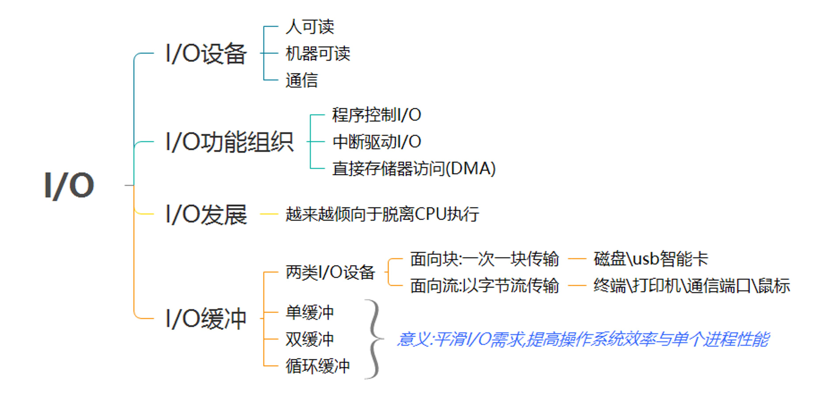

# 31-输入与输出：如何建立售前售后生态体系？

到这一节，操作系统作为一家外包公司，里面最核心的职能部门差不多都凑齐了。我们有了项目管理部门（进程管理），有为了维护项目执行期间数据的会议室管理部门（内存管理），有项目执行完毕后归档的档案库管理部门（文件系统）。

这一节，我们来规划一下这家公司的售前售后生态体系（输入输出系统）。这里你需要注意“生态”两个字，我们不仅仅是招聘一些售前和售后员工，而是应该建立一套体系让供应商，让渠道帮着我们卖，形成一个生态。

计算机系统的输入和输出系统都有哪些呢？我们能举出来的，例如键盘、鼠标、显示器、网卡、硬盘、打印机、CD/DVD等等，多种多样。这样，当然方便用户使用了，但是对于操作系统来讲，却是一件复杂的事情，因为这么多设备，形状、用法、功能都不一样，怎么才能统一管理起来呢？

## 用设备控制器屏蔽设备差异

这有点像一家公司要做To B的生意，发现客户多种多样，众口难调，不同的地域不一样，不同的行业不一样。如果你不懂某个地方的规矩，根本卖不出去东西；如果你不懂某个具体行业的使用场景，也无法满足客户的需求。怎么办呢？一般公司采取的策略就是建立生态，设置很多代理商，让各个地区和各个行业的代理商帮你屏蔽这些差异化。你和代理商之间只要进行简单的标准产品交付就可以了。

计算机系统也是这样的，CPU并不直接和设备打交道，它们中间有一个叫作**设备控制器**（Device Control Unit）的组件，例如硬盘有磁盘控制器、USB有USB控制器、显示器有视频控制器等。这些控制器就像代理商一样，它们知道如何应对硬盘、鼠标、键盘、显示器的行为。

如果你是一家大公司，你的代理商往往是小公司。控制器其实有点儿像一台小电脑。它有它的芯片，类似小CPU，执行自己的逻辑。它也有它的寄存器。这样CPU就可以通过写这些寄存器，对控制器下发指令，通过读这些寄存器，查看控制器对于设备的操作状态。

CPU对于寄存器的读写，可比直接控制硬件，要标准和轻松很多。这就相当于你和代理商的标准产品交付。

输入输出设备我们大致可以分为两类：**块设备**（Block Device）和**字符设备**（Character Device）。

- 块设备将信息存储在固定大小的块中，每个块都有自己的地址。硬盘就是常见的块设备。
- 字符设备发送或接受的是字节流。而不用考虑任何块结构，没有办法寻址。鼠标就是常见的字符设备。

由于块设备传输的数据量比较大，控制器里往往会有缓冲区。CPU写入缓冲区的数据攒够一部分，才会发给设备。CPU读取的数据，也需要在缓冲区攒够一部分，才拷贝到内存。

这个也比较好理解，代理商我们也可以分成两种。一种是**集成商模式**，也就是说没有客户的时候，代理商不会在你这里采购产品，每次它遇到一个客户的时候，会带上你，共同应标。你出标准产品，地域的和行业的差异，它来搞定。这有点儿像字符设备。另外一种是**代购代销模式**，也就是说从你这里批量采购一批产品，然后没卖完之前，基本就不会找你了。这有点儿像块设备。

CPU如何同控制器的寄存器和数据缓冲区进行通信呢？

- 每个控制寄存器被分配一个I/O端口，我们可以通过特殊的汇编指令（例如in/out类似的指令）操作这些寄存器。
- 数据缓冲区，可内存映射I/O，可以分配一段内存空间给它，就像读写内存一样读写数据缓冲区。如果你去看内存空间的话，有一个原来我们没有讲过的区域ioremap，就是做这个的。

这有点儿像，如果你要给你的代理商下一个任务，或者询问订单的状态，直接打电话联系他们的负责人就可以了。如果你需要和代理商做大量的交互，共同讨论应标方案，那电话说太麻烦了，你可以把代理商拉到你们公司来，你们直接在一个会议室里面出方案。

对于CPU来讲，这些外部设备都有自己的大脑，可以自行处理一些事情，但是有个问题是，当你给设备发了一个指令，让它读取一些数据，它读完的时候，怎么通知你呢？

控制器的寄存器一般会有状态标志位，可以通过检测状态标志位，来确定输入或者输出操作是否完成。第一种方式就是**轮询等待**，就是一直查，一直查，直到完成。当然这种方式很不好，于是我们有了第二种方式，就是可以通过**中断**的方式，通知操作系统输入输出操作已经完成。

为了响应中断，我们一般会有一个硬件的中断控制器，当设备完成任务后出发中断到中断控制器，中断控制器就通知CPU，一个中断产生了，CPU需要停下当前手里的事情来处理中断。

这就像代理商有了新客户，客户有了新需求，客户交付完毕等事件，都需要有一种机制通知你们公司，在哪里呢？当然是在办事大厅呀。如果你问，不对呀，办事大厅不是处理系统调用的么？还记得32位系统调用是通过INT产生软中断触发的么？这就统一起来了，中断有两种，一种**软中断**，例如代码调用INT指令触发，一种是**硬件中断**，就是硬件通过中断控制器触发的。所以将中断作为办事大厅的一项服务，没有什么问题。


有的设备需要读取或者写入大量数据。如果所有过程都让CPU协调的话，就需要占用CPU大量的时间，比方说，磁盘就是这样的。这种类型的设备需要支持DMA功能，也就是说，允许设备在CPU不参与的情况下，能够自行完成对内存的读写。实现DMA机制需要有个DMA控制器帮你的CPU来做协调，就像下面这个图中显示的一样。

CPU只需要对DMA控制器下指令，说它想读取多少数据，放在内存的某个地方就可以了，接下来DMA控制器会发指令给磁盘控制器，读取磁盘上的数据到指定的内存位置，传输完毕之后，DMA控制器发中断通知CPU指令完成，CPU就可以直接用内存里面现成的数据了。还记得咱们讲内存的时候，有个DMA区域，就是这个作用。

DMA有点儿像一些比较大的代理商，不但能够帮你代购代销，而且自己有能力售前、售后和技术支持，实施部署都能自己搞定。


## 用驱动程序屏蔽设备控制器差异

虽然代理商机制能够帮我们屏蔽很多设备的细节，但是从上面的描述我们可以看出，由于每种设备的控制器的寄存器、缓冲区等使用模式，指令都不同，所以对于操作系统这家公司来讲，需要有个部门专门对接代理商，向其他部门屏蔽代理商的差异，类似公司的渠道管理部门。

那什么才是操作系统的渠道管理部门呢？就是用来对接各个设备控制器的设备驱动程序。

这里需要注意的是，设备控制器不属于操作系统的一部分，但是设备驱动程序属于操作系统的一部分。操作系统的内核代码可以像调用本地代码一样调用驱动程序的代码，而驱动程序的代码需要发出特殊的面向设备控制器的指令，才能操作设备控制器。

设备驱动程序中是一些面向特殊设备控制器的代码。不同的设备不同。但是对于操作系统其它部分的代码而言，设备驱动程序应该有统一的接口。就像下面图中的一样，不同的设备驱动程序，可以以同样的方式接入操作系统，而操作系统的其它部分的代码，也可以无视不同设备的区别，以同样的接口调用设备驱动程序。

接下来两节，我们会讲字符设备驱动程序和块设备驱动程序的模型，从那里我们也可以看出，所有设备驱动程序都要，按照同样的规则，实现同样的方法。


上面咱们说了，设备做完了事情要通过中断来通知操作系统。那操作系统就需要有一个地方处理这个中断，既然设备驱动程序是用来对接设备控制器的，中断处理也应该在设备驱动里面完成。

然而中断的触发最终会到达CPU，会中断操作系统当前运行的程序，所以操作系统也要有一个统一的流程来处理中断，使得不同设备的中断使用统一的流程。

一般的流程是，一个设备驱动程序初始化的时候，要先注册一个该设备的中断处理函数。咱们讲进程切换的时候说过，中断返回的那一刻是进程切换的时机。不知道你还记不记得，中断的时候，触发的函数是do_IRQ。这个函数是中断处理的统一入口。在这个函数里面，我们可以找到设备驱动程序注册的中断处理函数Handler，然后执行它进行中断处理。


另外，对于块设备来讲，在驱动程序之上，文件系统之下，还需要一层通用设备层。比如咱们上一章讲的文件系统，里面的逻辑和磁盘设备没有什么关系，可以说是通用的逻辑。在写文件的最底层，我们看到了BIO字眼的函数，但是好像和设备驱动也没有什么关系。是的，因为块设备类型非常多，而Linux操作系统里面一切是文件。我们也不想文件系统以下，就直接对接各种各样的块设备驱动程序，这样会使得文件系统的复杂度非常高。所以，我们在中间加了一层通用块层，将与块设备相关的通用逻辑放在这一层，维护与设备无关的块的大小，然后通用块层下面对接各种各样的驱动程序。


## 用文件系统接口屏蔽驱动程序的差异

上面我们从硬件设备到设备控制器，到驱动程序，到通用块层，到文件系统，层层屏蔽不同的设备的差别，最终到这里涉及对用户使用接口，也要统一。

虽然我们操作设备，都是基于文件系统的接口，也要有一个统一的标准。

首先要统一的是设备名称。所有设备都在/dev/文件夹下面创建一个特殊的设备文件。这个设备特殊文件也有inode，但是它不关联到硬盘或任何其他存储介质上的数据，而是建立了与某个设备驱动程序的连接。

硬盘设备这里有一点绕。假设是/dev/sdb，这是一个设备文件。这个文件本身和硬盘上的文件系统没有任何关系。这个设备本身也不对应硬盘上的任何一个文件，/dev/sdb其实是在一个特殊的文件系统devtmpfs中。但是当我们将/dev/sdb格式化成一个文件系统ext4的时候，就会将它mount到一个路径下面。例如在/mnt/sdb下面。这个时候/dev/sdb还是一个设备文件在特殊文件系统devtmpfs中，而/mnt/sdb下面的文件才是在ext4文件系统中，只不这个设备是在/dev/sdb设备上的。

这里我们只关心设备文件，当我们用ls -l在/dev下面执行的时候，就会有这样的结果。

```
# ls -l
crw------- 1 root root      5,   1 Dec 14 19:53 console
crw-r----- 1 root kmem      1,   1 Dec 14 19:53 mem
crw-rw-rw- 1 root root      1,   3 Dec 14 19:53 null
crw-r----- 1 root kmem      1,   4 Dec 14 19:53 port
crw-rw-rw- 1 root root      1,   8 Dec 14 19:53 random
crw--w---- 1 root tty       4,   0 Dec 14 19:53 tty0
crw--w---- 1 root tty       4,   1 Dec 14 19:53 tty1
crw-rw-rw- 1 root root      1,   9 Dec 14 19:53 urandom
brw-rw---- 1 root disk    253,   0 Dec 31 19:18 vda
brw-rw---- 1 root disk    253,   1 Dec 31 19:19 vda1
brw-rw---- 1 root disk    253,  16 Dec 14 19:53 vdb
brw-rw---- 1 root disk    253,  32 Jan  2 11:24 vdc
crw-rw-rw- 1 root root      1,   5 Dec 14 19:53 zero
```

对于设备文件，ls出来的内容和我们原来讲过的稍有不同。

首先是第一位字符。如果是字符设备文件，则以c开头，如果是块设备文件，则以b开头。其次是这里面的两个号，一个是主设备号，一个是次设备号。主设备号定位设备驱动程序，次设备号作为参数传给启动程序，选择相应的单元。

从上面的列表我们可以看出来，mem、null、random、urandom、zero都是用同样的主设备号1，也就是它们使用同样的字符设备驱动，而vda、vda1、vdb、vdc也是同样的主设备号，也就是它们使用同样的块设备驱动。

有了设备文件，我们就可以使用对于文件的操作命令和API来操作文件了。例如，使用cat命令，可以读取/dev/random 和/dev/urandom的数据流，可以用od命令转换为十六进制后查看。

```
cat /dev/urandom | od -x
```

这里还是要明确一下，如果用文件的操作作用于/dev/sdb的话，会无法操作文件系统上的文件，操作的这个设备。

如果Linux操作系统新添加了一个设备，应该做哪些事情呢？就像咱们使用Windows的时候，如果新添加了一种设备，首先要看这个设备有没有相应的驱动。如果没有就需要安装一个驱动，等驱动安装好了，设备就在Windows的设备列表中显示出来了。

在Linux上面，如果一个新的设备从来没有加载过驱动，也需要安装驱动。Linux的驱动程序已经被写成和操作系统有标准接口的代码，可以看成一个标准的内核模块。在Linux里面，安装驱动程序，其实就是加载一个内核模块。

我们可以用命令lsmod，查看有没有加载过相应的内核模块。这个列表很长，我这里列举了其中一部分。可以看到，这里面有网络和文件系统的驱动。

```
# lsmod
Module                  Size  Used by
iptable_filter         12810  1
bridge                146976  1 br_netfilter
vfat                   17461  0
fat                    65950  1 vfat
ext4                  571716  1
cirrus                 24383  1
crct10dif_pclmul       14307  0
crct10dif_common       12595  1 crct10dif_pclmul
```

如果没有安装过相应的驱动，可以通过insmod安装内核模块。内核模块的后缀一般是ko。

例如，我们要加载openvswitch的驱动，就要通过下面的命令：

```
insmod openvswitch.ko
```

一旦有了驱动，我们就可以通过命令mknod在/dev文件夹下面创建设备文件，就像下面这样：

```
mknod filename type major minor
```

其中filename就是/dev下面的设备名称，type就是c为字符设备，b为块设备，major就是主设备号，minor就是次设备号。一旦执行了这个命令，新创建的设备文件就和上面加载过的驱动关联起来，这个时候就可以通过操作设备文件来操作驱动程序，从而操作设备。

你可能会问，人家Windows都说插上设备后，一旦安装了驱动，就直接在设备列表中出来了，你这里怎么还要人来执行命令创建呀，能不能智能一点？

当然可以，这里就要用到另一个管理设备的文件系统，也就是/sys路径下面的sysfs文件系统。它把实际连接到系统上的设备和总线组成了一个分层的文件系统。这个文件系统是当前系统上实际的设备数的真实反映。

在/sys路径下有下列的文件夹：

- /sys/devices是内核对系统中所有设备的分层次的表示；
- /sys/dev目录下一个char文件夹，一个block文件夹，分别维护一个按字符设备和块设备的主次号码(major:minor)链接到真实的设备(/sys/devices下)的符号链接文件；
- /sys/block是系统中当前所有的块设备；
- /sys/module有系统中所有模块的信息。

有了sysfs以后，我们还需要一个守护进程udev。当一个设备新插入系统的时候，内核会检测到这个设备，并会创建一个内核对象kobject 。 这个对象通过sysfs文件系统展现到用户层，同时内核还向用户空间发送一个热插拔消息。udevd会监听这些消息，在/dev中创建对应的文件。


有了文件系统接口之后，我们不但可以通过文件系统的命令行操作设备，也可以通过程序，调用read、write函数，像读写文件一样操作设备。但是有些任务只使用读写很难完成，例如检查特定于设备的功能和属性，超出了通用文件系统的限制。所以，对于设备来讲，还有一种接口称为ioctl，表示输入输出控制接口，是用于配置和修改特定设备属性的通用接口，这个我们后面几节会详细说。

## 总结时刻

这一节，我们讲了输入与输出设备的管理，内容比较多。输入输出设备就像管理代理商一样。因为代理商复杂多变，代理商管理也同样复杂多变，需要层层屏蔽差异化的部分，给上层提供标准化的部分，最终到用户态，给用户提供了基于文件系统的统一的接口。


## 课堂练习

如果你手头的Linux是一台物理机，试着插进一块U盘，看文件系统中设备的变化。如果你没有Linux物理机，可以使用公有云的云主机，添加一块硬盘，看文件系统中设备的变化。

欢迎留言和我分享你的疑惑和见解 ，也欢迎可以收藏本节内容，反复研读。你也可以把今天的内容分享给你的朋友，和他一起学习和进步。


# 32-字符设备（上）：如何建立直销模式？

上一节，我们讲了输入输出设备的层次模型，还是比较复杂的，块设备尤其复杂。这一节为了让你更清晰地了解设备驱动程序的架构，我们先来讲稍微简单一点的字符设备驱动。

这一节，我找了两个比较简单的字符设备驱动来解析一下。一个是输入字符设备，鼠标。代码在drivers/input/mouse/logibm.c这里。

```
/*
 * Logitech Bus Mouse Driver for Linux
 */
module_init(logibm_init);
module_exit(logibm_exit);
```

另外一个是输出字符设备，打印机，代码drivers/char/lp.c这里。

```
/*
 * Generic parallel printer driver
 */
module_init(lp_init_module);
module_exit(lp_cleanup_module);
```

## 内核模块

上一节，我们讲过，设备驱动程序是一个内核模块，以ko的文件形式存在，可以通过insmod加载到内核中。那我们首先来看一下，怎么样才能构建一个内核模块呢？

一个内核模块应该由以下几部分组成。

**第一部分，头文件部分**。一般的内核模块，都需要include下面两个头文件：

```
#include <linux/module.h>
#include <linux/init.h>
```

如果你去看上面两个驱动程序，都能找到这两个头文件。当然如果需要的话，我们还可以引入更多的头文件。

**第二部分，定义一些函数，用于处理内核模块的主要逻辑**。例如打开、关闭、读取、写入设备的函数或者响应中断的函数。

例如，logibm.c里面就定义了logibm_open。logibm_close就是处理打开和关闭的，定义了logibm_interrupt就是用来响应中断的。再如，lp.c里面就定义了lp_read，lp_write就是处理读写的。

**第三部分，定义一个file_operations结构**。前面我们讲过，设备是可以通过文件系统的接口进行访问的。咱们讲文件系统的时候说过，对于某种文件系统的操作，都是放在file_operations里面的。例如ext4就定义了这么一个结构，里面都是ext4_xxx之类的函数。设备要想被文件系统的接口操作，也需要定义这样一个结构。

例如，lp.c里面就定义了这样一个结构。

```
static const struct file_operations lp_fops = {
	.owner		= THIS_MODULE,
	.write		= lp_write,
	.unlocked_ioctl	= lp_ioctl,
#ifdef CONFIG_COMPAT
	.compat_ioctl	= lp_compat_ioctl,
#endif
	.open		= lp_open,
	.release	= lp_release,
#ifdef CONFIG_PARPORT_1284
	.read		= lp_read,
#endif
	.llseek		= noop_llseek,
};
```

在logibm.c里面，我们找不到这样的结构，是因为它属于众多输入设备的一种，而输入设备的操作被统一定义在drivers/input/input.c里面，logibm.c只是定义了一些自己独有的操作。

```
static const struct file_operations input_devices_fileops = {
	.owner		= THIS_MODULE,
	.open		= input_proc_devices_open,
	.poll		= input_proc_devices_poll,
	.read		= seq_read,
	.llseek		= seq_lseek,
	.release	= seq_release,
};
```

**第四部分，定义整个模块的初始化函数和退出函数**，用于加载和卸载这个ko的时候调用。

例如lp.c就定义了lp_init_module和lp_cleanup_module，logibm.c就定义了logibm_init和logibm_exit。

**第五部分，调用module_init和module_exit**，分别指向上面两个初始化函数和退出函数。就像本节最开头展示的一样。

**第六部分，声明一下lisense，调用MODULE_LICENSE**。

有了这六部分，一个内核模块就基本合格了，可以工作了。

## 打开字符设备

字符设备可不是一个普通的内核模块，它有自己独特的行为。接下来，我们就沿着打开一个字符设备的过程，看看字符设备这个内核模块做了哪些特殊的事情。


要使用一个字符设备，我们首先要把写好的内核模块，通过insmod加载进内核。这个时候，先调用的就是module_init调用的初始化函数。

例如，在lp.c的初始化函数lp_init对应的代码如下：

```
static int __init lp_init (void)
{
......
	if (register_chrdev (LP_MAJOR, "lp", &lp_fops)) {
		printk (KERN_ERR "lp: unable to get major %d\n", LP_MAJOR);
		return -EIO;
	}
......
}


int __register_chrdev(unsigned int major, unsigned int baseminor,
		      unsigned int count, const char *name,
		      const struct file_operations *fops)
{
	struct char_device_struct *cd;
	struct cdev *cdev;
	int err = -ENOMEM;
......
	cd = __register_chrdev_region(major, baseminor, count, name);
	cdev = cdev_alloc();
	cdev->owner = fops->owner;
	cdev->ops = fops;
	kobject_set_name(&cdev->kobj, "%s", name);
	err = cdev_add(cdev, MKDEV(cd->major, baseminor), count);
	cd->cdev = cdev;
	return major ? 0 : cd->major;
}
```

在字符设备驱动的内核模块加载的时候，最重要的一件事情就是，注册这个字符设备。注册的方式是调用__register_chrdev_region，注册字符设备的主次设备号和名称，然后分配一个struct cdev结构，将cdev的ops成员变量指向这个模块声明的file_operations。然后，cdev_add会将这个字符设备添加到内核中一个叫作struct kobj_map *cdev_map的结构，来统一管理所有字符设备。

其中，MKDEV(cd->major, baseminor)表示将主设备号和次设备号生成一个dev_t的整数，然后将这个整数dev_t和cdev关联起来。

```
/**
 * cdev_add() - add a char device to the system
 * @p: the cdev structure for the device
 * @dev: the first device number for which this device is responsible
 * @count: the number of consecutive minor numbers corresponding to this
 *         device
 *
 * cdev_add() adds the device represented by @p to the system, making it
 * live immediately.  A negative error code is returned on failure.
 */
int cdev_add(struct cdev *p, dev_t dev, unsigned count)
{
	int error;


	p->dev = dev;
	p->count = count;


	error = kobj_map(cdev_map, dev, count, NULL,
			 exact_match, exact_lock, p);
	kobject_get(p->kobj.parent);


	return 0;
```

在logibm.c中，我们在logibm_init找不到注册字符设备，这是因为input.c里面的初始化函数input_init会调用register_chrdev_region，注册输入的字符设备，会在logibm_init中调用input_register_device，将logibm.c这个字符设备注册到input.c里面去，这就相当于input.c对多个输入字符设备进行统一的管理。

内核模块加载完毕后，接下来要通过mknod在/dev下面创建一个设备文件，只有有了这个设备文件，我们才能通过文件系统的接口，对这个设备文件进行操作。

mknod也是一个系统调用，定义如下：

```
SYSCALL_DEFINE3(mknod, const char __user *, filename, umode_t, mode, unsigned, dev)
{
	return sys_mknodat(AT_FDCWD, filename, mode, dev);
}


SYSCALL_DEFINE4(mknodat, int, dfd, const char __user *, filename, umode_t, mode,
		unsigned, dev)
{
	struct dentry *dentry;
	struct path path;
......
	dentry = user_path_create(dfd, filename, &path, lookup_flags);
......
	switch (mode & S_IFMT) {
......
		case S_IFCHR: case S_IFBLK:
			error = vfs_mknod(path.dentry->d_inode,dentry,mode,
					new_decode_dev(dev));
			break;
......
	}
}
```

我们可以在这个系统调用里看到，在文件系统上，顺着路径找到/dev/xxx所在的文件夹，然后为这个新创建的设备文件创建一个dentry。这是维护文件和inode之间的关联关系的结构。

接下来，如果是字符文件S_IFCHR或者设备文件S_IFBLK，我们就调用vfs_mknod。

```
int vfs_mknod(struct inode *dir, struct dentry *dentry, umode_t mode, dev_t dev)
{
......
	error = dir->i_op->mknod(dir, dentry, mode, dev);
......
}
```

这里需要调用对应的文件系统的inode_operations。应该调用哪个文件系统呢？

如果我们在linux下面执行mount命令，能看到下面这一行：

```
devtmpfs on /dev type devtmpfs (rw,nosuid,size=3989584k,nr_inodes=997396,mode=755)
```

也就是说，/dev下面的文件系统的名称为devtmpfs，我们可以在内核中找到它。

```
static struct dentry *dev_mount(struct file_system_type *fs_type, int flags,
		      const char *dev_name, void *data)
{
#ifdef CONFIG_TMPFS
	return mount_single(fs_type, flags, data, shmem_fill_super);
#else
	return mount_single(fs_type, flags, data, ramfs_fill_super);
#endif
}


static struct file_system_type dev_fs_type = {
	.name = "devtmpfs",
	.mount = dev_mount,
	.kill_sb = kill_litter_super,
};
```

从这里可以看出，devtmpfs在挂载的时候，有两种模式，一种是ramfs，一种是shmem都是基于内存的文件系统。这里你先不用管，基于内存的文件系统具体是怎么回事儿。

```
static const struct inode_operations ramfs_dir_inode_operations = {
......
	.mknod		= ramfs_mknod,
};


static const struct inode_operations shmem_dir_inode_operations = {
#ifdef CONFIG_TMPFS
......
	.mknod		= shmem_mknod,
};
```

这两个mknod虽然实现不同，但是都会调用到用一个函数init_special_inode。

```
void init_special_inode(struct inode *inode, umode_t mode, dev_t rdev)
{
	inode->i_mode = mode;
	if (S_ISCHR(mode)) {
		inode->i_fop = &def_chr_fops;
		inode->i_rdev = rdev;
	} else if (S_ISBLK(mode)) {
		inode->i_fop = &def_blk_fops;
		inode->i_rdev = rdev;
	} else if (S_ISFIFO(mode))
		inode->i_fop = &pipefifo_fops;
	else if (S_ISSOCK(mode))
		;	/* leave it no_open_fops */
}
```

显然这个文件是个特殊文件，inode也是特殊的。这里这个inode可以关联字符设备、块设备、FIFO文件、Socket等。我们这里只看字符设备。

这里的inode的file_operations指向一个def_chr_fops，这里面只有一个open，就等着你打开它。

另外，inode的i_rdev指向这个设备的dev_t。还记得cdev_map吗？通过这个dev_t，可以找到我们刚在加载的字符设备cdev。

```
const struct file_operations def_chr_fops = {
	.open = chrdev_open,
};
```

到目前为止，我们只是创建了/dev下面的一个文件，并且和相应的设备号关联起来。但是，我们还没有打开这个/dev下面的设备文件。

现在我们来打开它。打开一个文件的流程，我们在[文件系统](https://time.geekbang.org/column/article/97876)那一节讲过了，这里不再重复。最终就像打开字符设备的图中一样，打开文件的进程的task_struct里，有一个数组代表它打开的文件，下标就是文件描述符fd，每一个打开的文件都有一个struct file结构，会指向一个dentry项。dentry可以用来关联inode。这个dentry就是咱们上面mknod的时候创建的。

在进程里面调用open函数，最终对调用到这个特殊的inode的open函数，也就是chrdev_open。

```
static int chrdev_open(struct inode *inode, struct file *filp)
{
	const struct file_operations *fops;
	struct cdev *p;
	struct cdev *new = NULL;
	int ret = 0;


	p = inode->i_cdev;
	if (!p) {
		struct kobject *kobj;
		int idx;
		kobj = kobj_lookup(cdev_map, inode->i_rdev, &idx);
		new = container_of(kobj, struct cdev, kobj);
		p = inode->i_cdev;
		if (!p) {
			inode->i_cdev = p = new;
			list_add(&inode->i_devices, &p->list);
			new = NULL;
		} 
	} 
......
	fops = fops_get(p->ops);
......
	replace_fops(filp, fops);
	if (filp->f_op->open) {
		ret = filp->f_op->open(inode, filp);
......
	}
......
}
```

在这个函数里面，我们首先看这个inode的i_cdev，是否已经关联到cdev。如果第一次打开，当然没有。没有没关系，inode里面有i_rdev呀，也就是有dev_t。我们可以通过它在cdev_map中找cdev。咱们上面注册过了，所以肯定能够找到。找到后我们就将inode的i_cdev，关联到找到的cdev new。

找到cdev就好办了。cdev里面有file_operations，这是设备驱动程序自己定义的。我们可以通过它来操作设备驱动程序，把它付给struct file里面的file_operations。这样以后操作文件描述符，就是直接操作设备了。

最后，我们需要调用设备驱动程序的file_operations的open函数，真正打开设备。对于打印机，调用的是lp_open。对于鼠标调用的是input_proc_devices_open，最终会调用到logibm_open。这些多和设备相关，你不必看懂它们。

## 写入字符设备

当我们像打开一个文件一样打开一个字符设备之后，接下来就是对这个设备的读写。对于文件的读写咱们在文件系统那一章详细讲述过，读写的过程是类似的，所以这里我们只解析打印机驱动写入的过程。


写入一个字符设备，就是用文件系统的标准接口write，参数文件描述符fd，在内核里面调用的sys_write，在sys_write里面根据文件描述符fd得到struct file结构。接下来再调用vfs_write。

```
ssize_t __vfs_write(struct file *file, const char __user *p, size_t count, loff_t *pos)
{
	if (file->f_op->write)
		return file->f_op->write(file, p, count, pos);
	else if (file->f_op->write_iter)
		return new_sync_write(file, p, count, pos);
	else
		return -EINVAL;
}
```

我们可以看到，在__vfs_write里面，我们会调用struct file结构里的file_operations的write函数。上面我们打开字符设备的时候，已经将struct file结构里面的file_operations指向了设备驱动程序的file_operations结构，所以这里的write函数最终会调用到lp_write。

```
static ssize_t lp_write(struct file * file, const char __user * buf,
		        size_t count, loff_t *ppos)
{
	unsigned int minor = iminor(file_inode(file));
	struct parport *port = lp_table[minor].dev->port;
	char *kbuf = lp_table[minor].lp_buffer;
	ssize_t retv = 0;
	ssize_t written;
	size_t copy_size = count;
......
	/* Need to copy the data from user-space. */
	if (copy_size > LP_BUFFER_SIZE)
		copy_size = LP_BUFFER_SIZE;
......
	if (copy_from_user (kbuf, buf, copy_size)) {
		retv = -EFAULT;
		goto out_unlock;
	}
......
	do {
		/* Write the data. */
		written = parport_write (port, kbuf, copy_size);
		if (written > 0) {
			copy_size -= written;
			count -= written;
			buf  += written;
			retv += written;
		}
......
        if (need_resched())
			schedule ();


		if (count) {
			copy_size = count;
			if (copy_size > LP_BUFFER_SIZE)
				copy_size = LP_BUFFER_SIZE;


			if (copy_from_user(kbuf, buf, copy_size)) {
				if (retv == 0)
					retv = -EFAULT;
				break;
			}
		}	
	} while (count > 0);
......
```

这个设备驱动程序的写入函数的实现还是比较典型的。先是调用copy_from_user将数据从用户态拷贝到内核态的缓存中，然后调用parport_write写入外部设备。这里还有一个schedule函数，也即写入的过程中，给其他线程抢占CPU的机会。然后，如果count还是大于0，也就是数据还没有写完，那我们就接着copy_from_user，接着parport_write，直到写完为止。

## 使用IOCTL控制设备

对于I/O设备来讲，我们前面也说过，除了读写设备，还会调用ioctl，做一些特殊的I/O操作。


ioctl也是一个系统调用，它在内核里面的定义如下：

```
SYSCALL_DEFINE3(ioctl, unsigned int, fd, unsigned int, cmd, unsigned long, arg)
{
	int error;
	struct fd f = fdget(fd);
......
	error = do_vfs_ioctl(f.file, fd, cmd, arg);
	fdput(f);
	return error;
}
```

其中，fd是这个设备的文件描述符，cmd是传给这个设备的命令，arg是命令的参数。其中，对于命令和命令的参数，使用ioctl系统调用的用户和驱动程序的开发人员约定好行为即可。

其实cmd看起来是一个int，其实他的组成比较复杂，它由几部分组成：

- 最低八位为NR，是命令号；
- 然后八位是TYPE，是类型；
- 然后十四位是参数的大小；
- 最高两位是DIR，是方向，表示写入、读出，还是读写。

由于组成比较复杂，有一些宏是专门用于组成这个cmd值的。

```
/*
 * Used to create numbers.
 */
#define _IO(type,nr)		_IOC(_IOC_NONE,(type),(nr),0)
#define _IOR(type,nr,size)	_IOC(_IOC_READ,(type),(nr),(_IOC_TYPECHECK(size)))
#define _IOW(type,nr,size)	_IOC(_IOC_WRITE,(type),(nr),(_IOC_TYPECHECK(size)))
#define _IOWR(type,nr,size)	_IOC(_IOC_READ|_IOC_WRITE,(type),(nr),(_IOC_TYPECHECK(size)))


/* used to decode ioctl numbers.. */
#define _IOC_DIR(nr)		(((nr) >> _IOC_DIRSHIFT) & _IOC_DIRMASK)
#define _IOC_TYPE(nr)		(((nr) >> _IOC_TYPESHIFT) & _IOC_TYPEMASK)
#define _IOC_NR(nr)		(((nr) >> _IOC_NRSHIFT) & _IOC_NRMASK)
#define _IOC_SIZE(nr)		(((nr) >> _IOC_SIZESHIFT) & _IOC_SIZEMASK)
```

在用户程序中，可以通过上面的”Used to create numbers“这些宏，根据参数生成cmd，在驱动程序中，可以通过下面的”used to decode ioctl numbers“这些宏，解析cmd后，执行指令。

ioctl中会调用do_vfs_ioctl，这里面对于已经定义好的cmd，进行相应的处理。如果不是默认定义好的cmd，则执行默认操作。对于普通文件，调用file_ioctl；对于其他文件调用vfs_ioctl。

```
int do_vfs_ioctl(struct file *filp, unsigned int fd, unsigned int cmd,
	     unsigned long arg)
{
	int error = 0;
	int __user *argp = (int __user *)arg;
	struct inode *inode = file_inode(filp);


	switch (cmd) {
......
	case FIONBIO:
		error = ioctl_fionbio(filp, argp);
		break;


	case FIOASYNC:
		error = ioctl_fioasync(fd, filp, argp);
		break;
......
	case FICLONE:
		return ioctl_file_clone(filp, arg, 0, 0, 0);


	default:
		if (S_ISREG(inode->i_mode))
			error = file_ioctl(filp, cmd, arg);
		else
			error = vfs_ioctl(filp, cmd, arg);
		break;
	}
	return error;
```

由于咱们这里是设备驱动程序，所以调用的是vfs_ioctl。

```
/**
 * vfs_ioctl - call filesystem specific ioctl methods
 * @filp:	open file to invoke ioctl method on
 * @cmd:	ioctl command to execute
 * @arg:	command-specific argument for ioctl
 *
 * Invokes filesystem specific ->unlocked_ioctl, if one exists; otherwise
 * returns -ENOTTY.
 *
 * Returns 0 on success, -errno on error.
 */
long vfs_ioctl(struct file *filp, unsigned int cmd, unsigned long arg)
{
	int error = -ENOTTY;


	if (!filp->f_op->unlocked_ioctl)
		goto out;


	error = filp->f_op->unlocked_ioctl(filp, cmd, arg);
	if (error == -ENOIOCTLCMD)
		error = -ENOTTY;
 out:
	return error;
```

这里面调用的是struct file里file_operations的unlocked_ioctl函数。我们前面初始化设备驱动的时候，已经将file_operations指向设备驱动的file_operations了。这里调用的是设备驱动的unlocked_ioctl。对于打印机程序来讲，调用的是lp_ioctl。可以看出来，这里面就是switch语句，它会根据不同的cmd，做不同的操作。

```
static long lp_ioctl(struct file *file, unsigned int cmd,
			unsigned long arg)
{
	unsigned int minor;
	struct timeval par_timeout;
	int ret;


	minor = iminor(file_inode(file));
	mutex_lock(&lp_mutex);
	switch (cmd) {
......
	default:
		ret = lp_do_ioctl(minor, cmd, arg, (void __user *)arg);
		break;
	}
	mutex_unlock(&lp_mutex);
	return ret;
}


static int lp_do_ioctl(unsigned int minor, unsigned int cmd,
	unsigned long arg, void __user *argp)
{
	int status;
	int retval = 0;


	switch ( cmd ) {
		case LPTIME:
			if (arg > UINT_MAX / HZ)
				return -EINVAL;
			LP_TIME(minor) = arg * HZ/100;
			break;
		case LPCHAR:
			LP_CHAR(minor) = arg;
			break;
		case LPABORT:
			if (arg)
				LP_F(minor) |= LP_ABORT;
			else
				LP_F(minor) &= ~LP_ABORT;
			break;
		case LPABORTOPEN:
			if (arg)
				LP_F(minor) |= LP_ABORTOPEN;
			else
				LP_F(minor) &= ~LP_ABORTOPEN;
			break;
		case LPCAREFUL:
			if (arg)
				LP_F(minor) |= LP_CAREFUL;
			else
				LP_F(minor) &= ~LP_CAREFUL;
			break;
		case LPWAIT:
			LP_WAIT(minor) = arg;
			break;
		case LPSETIRQ: 
			return -EINVAL;
			break;
		case LPGETIRQ:
			if (copy_to_user(argp, &LP_IRQ(minor),
					sizeof(int)))
				return -EFAULT;
			break;
		case LPGETSTATUS:
			if (mutex_lock_interruptible(&lp_table[minor].port_mutex))
				return -EINTR;
			lp_claim_parport_or_block (&lp_table[minor]);
			status = r_str(minor);
			lp_release_parport (&lp_table[minor]);
			mutex_unlock(&lp_table[minor].port_mutex);


			if (copy_to_user(argp, &status, sizeof(int)))
				return -EFAULT;
			break;
		case LPRESET:
			lp_reset(minor);
			break;
 		case LPGETFLAGS:
 			status = LP_F(minor);
			if (copy_to_user(argp, &status, sizeof(int)))
				return -EFAULT;
			break;
		default:
			retval = -EINVAL;
	}
	return retval
```

## 总结时刻

这一节我们讲了字符设备的打开、写入和ioctl等最常见的操作。一个字符设备要能够工作，需要三部分配合。

第一，有一个设备驱动程序的ko模块，里面有模块初始化函数、中断处理函数、设备操作函数。这里面封装了对于外部设备的操作。加载设备驱动程序模块的时候，模块初始化函数会被调用。在内核维护所有字符设备驱动的数据结构cdev_map里面注册，我们就可以很容易根据设备号，找到相应的设备驱动程序。

第二，在/dev目录下有一个文件表示这个设备，这个文件在特殊的devtmpfs文件系统上，因而也有相应的dentry和inode。这里的inode是一个特殊的inode，里面有设备号。通过它，我们可以在cdev_map中找到设备驱动程序，里面还有针对字符设备文件的默认操作def_chr_fops。

第三，打开一个字符设备文件和打开一个普通的文件有类似的数据结构，有文件描述符、有struct file、指向字符设备文件的dentry和inode。字符设备文件的相关操作file_operations一开始指向def_chr_fops，在调用def_chr_fops里面的chrdev_open函数的时候，修改为指向设备操作函数，从而读写一个字符设备文件就会直接变成读写外部设备了。


## 课堂练习

这节我用打印机驱动程序作为例子来给你讲解字符设备，请你仔细看一下它的代码，设想一下，如果让你自己写一个字符设备驱动程序，应该实现哪些函数呢？

欢迎留言和我分享你的疑惑和见解 ，也欢迎可以收藏本节内容，反复研读。你也可以把今天的内容分享给你的朋友，和他一起学习和进步。


## 精选留言：

- 有铭 2019-06-10 11:57:01

  问一下老师你的这些图是用啥工具画的？

- Leon📷 2019-06-10 07:46:34

  另外贴上一个字符设备或者块设备都有一个主设备号和次设备号。主设备号和次设备号统称为设备号。主设备号用来表示一个特定的驱动程序。次设备号用来表示使用该驱动程序的各设备。

- Leon📷 2019-06-10 07:39:28

  还有个收获就是程序设计的面向对象的思想，之前开发一个音视频推流服务器，一个音视频类型的操作编码解码都是类中完成，现在看来可以把操作单独设计成一个基类，各种类型的音视频操作都可以继承这个类，代码可以设计的更为优雅

- Leon📷 2019-06-10 07:35:48

  这节意外的收获是学会了怎么画项目结构流程图和各种色调搭配，老师真是多面小能手

# 33-字符设备（下）：如何建立直销模式？

上一节，我们讲了一个设备能够被打开、能够读写，主流的功能基本就完成了。我们讲输出输出设备的时候说到，如果一个设备有事情需要通知操作系统，会通过中断和设备驱动程序进行交互，今天我们就来解析中断处理机制。

鼠标就是通过中断，将自己的位置和按键信息，传递给设备驱动程序。

```
static int logibm_open(struct input_dev *dev)
{
	if (request_irq(logibm_irq, logibm_interrupt, 0, "logibm", NULL)) {
		printk(KERN_ERR "logibm.c: Can't allocate irq %d\n", logibm_irq);
		return -EBUSY;
	}
	outb(LOGIBM_ENABLE_IRQ, LOGIBM_CONTROL_PORT);
	return 0;
}


static irqreturn_t logibm_interrupt(int irq, void *dev_id)
{
	char dx, dy;
	unsigned char buttons;


	outb(LOGIBM_READ_X_LOW, LOGIBM_CONTROL_PORT);
	dx = (inb(LOGIBM_DATA_PORT) & 0xf);
	outb(LOGIBM_READ_X_HIGH, LOGIBM_CONTROL_PORT);
	dx |= (inb(LOGIBM_DATA_PORT) & 0xf) << 4;
	outb(LOGIBM_READ_Y_LOW, LOGIBM_CONTROL_PORT);
	dy = (inb(LOGIBM_DATA_PORT) & 0xf);
	outb(LOGIBM_READ_Y_HIGH, LOGIBM_CONTROL_PORT);
	buttons = inb(LOGIBM_DATA_PORT);
	dy |= (buttons & 0xf) << 4;
	buttons = ~buttons >> 5;


	input_report_rel(logibm_dev, REL_X, dx);
	input_report_rel(logibm_dev, REL_Y, dy);
	input_report_key(logibm_dev, BTN_RIGHT,  buttons & 1);
	input_report_key(logibm_dev, BTN_MIDDLE, buttons & 2);
	input_report_key(logibm_dev, BTN_LEFT,   buttons & 4);
	input_sync(logibm_dev);


	outb(LOGIBM_ENABLE_IRQ, LOGIBM_CONTROL_PORT);
	return IRQ_HANDLED
```

要处理中断，需要有一个中断处理函数。定义如下：

```
irqreturn_t (*irq_handler_t)(int irq, void * dev_id);


/**
 * enum irqreturn
 * @IRQ_NONE		interrupt was not from this device or was not handled
 * @IRQ_HANDLED		interrupt was handled by this device
 * @IRQ_WAKE_THREAD	handler requests to wake the handler thread
 */
enum irqreturn {
	IRQ_NONE		= (0 << 0),
	IRQ_HANDLED		= (1 << 0),
	IRQ_WAKE_THREAD		= (1 << 1),
};
```

其中，irq是一个整数，是中断信号。dev_id是一个void *的通用指针，主要用于区分同一个中断处理函数对于不同设备的处理。

这里的返回值有三种：IRQ_NONE表示不是我的中断，不归我管；IRQ_HANDLED表示处理完了的中断；IRQ_WAKE_THREAD表示有一个进程正在等待这个中断，中断处理完了，应该唤醒它。

上面的例子中，logibm_interrupt这个中断处理函数，先是获取了x和y的移动坐标，以及左中右的按键，上报上去，然后返回IRQ_HANDLED，这表示处理完毕。

其实，写一个真正生产用的中断处理程序还是很复杂的。当一个中断信号A触发后，正在处理的过程中，这个中断信号A是应该暂时关闭的，这样是为了防止再来一个中断信号A，在当前的中断信号A的处理过程中插一杠子。但是，这个暂时关闭的时间应该多长呢？

如果太短了，应该原子化处理完毕的没有处理完毕，又被另一个中断信号A中断了，很多操作就不正确了；如果太长了，一直关闭着，新的中断信号A进不来，系统就显得很慢。所以，很多中断处理程序将整个中断要做的事情分成两部分，称为上半部和下半部，或者成为关键处理部分和延迟处理部分。在中断处理函数中，仅仅处理关键部分，完成了就将中断信号打开，使得新的中断可以进来，需要比较长时间处理的部分，也即延迟部分，往往通过工作队列等方式慢慢处理。

这个写起来可以是一本书了，推荐你好好读一读《Linux Device Drivers》这本书，这里我就不详细介绍了。

有了中断处理函数，接下来要调用request_irq来注册这个中断处理函数。request_irq有这样几个参数：

- unsigned int irq是中断信号；
- irq_handler_t handler是中断处理函数；
- unsigned long flags是一些标识位；
- const char *name是设备名称；
- void *dev这个通用指针应该和中断处理函数的void *dev相对应。

```
static inline int __must_check
request_irq(unsigned int irq, irq_handler_t handler, unsigned long flags, const char *name, void *dev)
{
	return request_threaded_irq(irq, handler, NULL, flags, name, dev);
}
```

中断处理函数被注册到哪里去呢？让我们沿着request_irq看下去。request_irq调用的是request_threaded_irq。代码如下：

```
int request_threaded_irq(unsigned int irq, irq_handler_t handler,
			 irq_handler_t thread_fn, unsigned long irqflags,
			 const char *devname, void *dev_id)
{
	struct irqaction *action;
	struct irq_desc *desc;
	int retval;
......
	desc = irq_to_desc(irq);
......
	action = kzalloc(sizeof(struct irqaction), GFP_KERNEL);
	action->handler = handler;
	action->thread_fn = thread_fn;
	action->flags = irqflags;
	action->name = devname;
	action->dev_id = dev_id;
......
	retval = __setup_irq(irq, desc, action);
......
}
```

对于每一个中断，都有一个对中断的描述结构struct irq_desc。它有一个重要的成员变量是struct irqaction，用于表示处理这个中断的动作。如果我们仔细看这个结构，会发现，它里面有next指针，也就是说，这是一个链表，对于这个中断的所有处理动作，都串在这个链表上。

```
struct irq_desc {
......
	struct irqaction	*action;	/* IRQ action list */
......
	struct module		*owner;
	const char		*name;
};


/**
 * struct irqaction - per interrupt action descriptor
 * @handler:	interrupt handler function
 * @name:	name of the device
 * @dev_id:	cookie to identify the device
 * @percpu_dev_id:	cookie to identify the device
 * @next:	pointer to the next irqaction for shared interrupts
 * @irq:	interrupt number
 * @flags:	flags (see IRQF_* above)
 * @thread_fn:	interrupt handler function for threaded interrupts
 * @thread:	thread pointer for threaded interrupts
 * @secondary:	pointer to secondary irqaction (force threading)
 * @thread_flags:	flags related to @thread
 * @thread_mask:	bitmask for keeping track of @thread activity
 * @dir:	pointer to the proc/irq/NN/name entry
 */
struct irqaction {
	irq_handler_t		handler;
	void			*dev_id;
	void __percpu		*percpu_dev_id;
	struct irqaction	*next;
	irq_handler_t		thread_fn;
	struct task_struct	*thread;
	struct irqaction	*secondary;
	unsigned int		irq;
	unsigned int		flags;
	unsigned long		thread_flags;
	unsigned long		thread_mask;
	const char		*name;
	struct proc_dir_entry	*dir;
};
```

每一个中断处理动作的结构struct irqaction，都有以下成员：

- 中断处理函数handler；
- void *dev_id为设备id；
- irq为中断信号；
- 如果中断处理函数在单独的线程运行，则有thread_fn是线程的执行函数，thread是线程的task_struct。

在request_threaded_irq函数中，irq_to_desc根据中断信号查找中断描述结构。如何查找呢？这就要区分情况。一般情况下，所有的struct irq_desc都放在一个数组里面，我们直接按下标查找就可以了。如果配置了CONFIG_SPARSE_IRQ，那中断号是不连续的，就不适合用数组保存了，

我们可以放在一棵基数树上。我们不是第一次遇到这个数据结构了。这种结构对于从某个整型key找到value速度很快，中断信号irq是这个整数。通过它，我们很快就能定位到对应的struct irq_desc。

```
#ifdef CONFIG_SPARSE_IRQ
static RADIX_TREE(irq_desc_tree, GFP_KERNEL);
struct irq_desc *irq_to_desc(unsigned int irq)
{
	return radix_tree_lookup(&irq_desc_tree, irq);
}
#else /* !CONFIG_SPARSE_IRQ */
struct irq_desc irq_desc[NR_IRQS] __cacheline_aligned_in_smp = {
	[0 ... NR_IRQS-1] = {
	}
};
struct irq_desc *irq_to_desc(unsigned int irq)
{
	return (irq < NR_IRQS) ? irq_desc + irq : NULL;
}
#endif /* !CONFIG_SPARSE_IRQ */
```

为什么中断信号会有稀疏，也就是不连续的情况呢？这里需要说明一下，这里的irq并不是真正的、物理的中断信号，而是一个抽象的、虚拟的中断信号。因为物理的中断信号和硬件关联比较大，中断控制器也是各种各样的。

作为内核，我们不可能写程序的时候，适配各种各样的硬件中断控制器，因而就需要有一层中断抽象层。这里虚拟中断信号到中断描述结构的映射，就是抽象中断层的主要逻辑。

下面我们讲真正中断响应的时候，会涉及物理中断信号。可以想象，如果只有一个CPU，一个中断控制器，则基本能够保证从物理中断信号到虚拟中断信号的映射是线性的，这样用数组表示就没啥问题，但是如果有多个CPU，多个中断控制器，每个中断控制器各有各的物理中断信号，就没办法保证虚拟中断信号是连续的，所以就要用到基数树了。

接下来，request_threaded_irq函数分配了一个struct irqaction，并且初始化它，接着调用__setup_irq。在这个函数里面，如果struct irq_desc里面已经有struct irqaction了，我们就将新的struct irqaction挂在链表的末端。如果设定了以单独的线程运行中断处理函数，setup_irq_thread就会创建这个内核线程，wake_up_process会唤醒它。

```
static int
__setup_irq(unsigned int irq, struct irq_desc *desc, struct irqaction *new)
{
	struct irqaction *old, **old_ptr;
	unsigned long flags, thread_mask = 0;
	int ret, nested, shared = 0;
......
	new->irq = irq;
......
	/*
	 * Create a handler thread when a thread function is supplied
	 * and the interrupt does not nest into another interrupt
	 * thread.
	 */
	if (new->thread_fn && !nested) {
		ret = setup_irq_thread(new, irq, false);
	}
......
	old_ptr = &desc->action;
	old = *old_ptr;
	if (old) {
		/* add new interrupt at end of irq queue */
		do {
			thread_mask |= old->thread_mask;
			old_ptr = &old->next;
			old = *old_ptr;
		} while (old);
	}
......
	*old_ptr = new;
......
	if (new->thread)
		wake_up_process(new->thread);
......
}


static int
setup_irq_thread(struct irqaction *new, unsigned int irq, bool secondary)
{
	struct task_struct *t;
	struct sched_param param = {
		.sched_priority = MAX_USER_RT_PRIO/2,
	};


	t = kthread_create(irq_thread, new, "irq/%d-%s", irq, new->name);
	sched_setscheduler_nocheck(t, SCHED_FIFO, &param);
	get_task_struct(t);
	new->thread = t;
......
	return 0;
```

至此为止，request_irq完成了它的使命。总结来说，它就是根据中断信号irq，找到基数树上对应的irq_desc，然后将新的irqaction挂在链表上。

接下来，我们就来看，真正中断来了的时候，会发生一些什么。

真正中断的发生还是要从硬件开始。这里面有四个层次。

- 第一个层次是外部设备给中断控制器发送物理中断信号。
- 第二个层次是中断控制器将物理中断信号转换成为中断向量interrupt vector，发给各个CPU。
- 第三个层次是每个CPU都会有一个中断向量表，根据interrupt vector调用一个IRQ处理函数。注意这里的IRQ处理函数还不是咱们上面指定的irq_handler_t，到这一层还是CPU硬件的要求。
- 第四个层次是在IRQ处理函数中，将interrupt vector转化为抽象中断层的中断信号irq，调用中断信号irq对应的中断描述结构里面的irq_handler_t。


在这里，我们不解析硬件的部分，我们从CPU收到中断向量开始分析。

CPU收到的中断向量是什么样的呢？这个定义在文件arch/x86/include/asm/irq_vectors.h中。这里面的注释非常好，建议你仔细阅读。

```
/*
 * Linux IRQ vector layout.
 *
 * There are 256 IDT entries (per CPU - each entry is 8 bytes) which can
 * be defined by Linux. They are used as a jump table by the CPU when a
 * given vector is triggered - by a CPU-external, CPU-internal or
 * software-triggered event.
 *
 * Linux sets the kernel code address each entry jumps to early during
 * bootup, and never changes them. This is the general layout of the
 * IDT entries:
 *
 *  Vectors   0 ...  31 : system traps and exceptions - hardcoded events
 *  Vectors  32 ... 127 : device interrupts
 *  Vector  128         : legacy int80 syscall interface
 *  Vectors 129 ... INVALIDATE_TLB_VECTOR_START-1 except 204 : device interrupts
 *  Vectors INVALIDATE_TLB_VECTOR_START ... 255 : special interrupts
 *
 * 64-bit x86 has per CPU IDT tables, 32-bit has one shared IDT table.
 *
 * This file enumerates the exact layout of them:
 */
#define FIRST_EXTERNAL_VECTOR		0x20
#define IA32_SYSCALL_VECTOR		0x80
#define NR_VECTORS			 256
#define FIRST_SYSTEM_VECTOR		NR_VECTORS
```

通过这些注释，我们可以看出，CPU能够处理的中断总共256个，用宏NR_VECTOR或者FIRST_SYSTEM_VECTOR表示。

为了处理中断，CPU硬件要求每一个CPU都有一个中断向量表，通过load_idt加载，里面记录着每一个中断对应的处理方法，这个中断向量表定义在文件arch/x86/kernel/traps.c中。

```
gate_desc idt_table[NR_VECTORS] __page_aligned_bss;
```

对于一个CPU可以处理的中断被分为几个部分，第一部分0到31的前32位是系统陷入或者系统异常，这些错误无法屏蔽，一定要处理。

这些中断的处理函数在系统初始化的时候，在start_kernel函数中调用过trap_init()。这个咱们讲系统初始化和系统调用的时候，都大概讲过这个函数，这里还需要仔细看一下。

```
void __init trap_init(void)
{
	int i;
...
	set_intr_gate(X86_TRAP_DE, divide_error);
//各种各样的set_intr_gate，不都贴在这里了，只贴一头一尾
...
	set_intr_gate(X86_TRAP_XF, simd_coprocessor_error);


	/* Reserve all the builtin and the syscall vector: */
	for (i = 0; i < FIRST_EXTERNAL_VECTOR; i++)
		set_bit(i, used_vectors);


#ifdef CONFIG_X86_32
	set_system_intr_gate(IA32_SYSCALL_VECTOR, entry_INT80_32);
	set_bit(IA32_SYSCALL_VECTOR, used_vectors);
#endif


	/*
	 * Set the IDT descriptor to a fixed read-only location, so that the
	 * "sidt" instruction will not leak the location of the kernel, and
	 * to defend the IDT against arbitrary memory write vulnerabilities.
	 * It will be reloaded in cpu_init() */
	__set_fixmap(FIX_RO_IDT, __pa_symbol(idt_table), PAGE_KERNEL_RO);
	idt_descr.address = fix_to_virt(FIX_RO_IDT);
......
```

我这里贴的代码省略了很多，在trap_init函数的一开始，调用了大量的set_intr_gate，最终都会调用_set_gate，代码如下：

```
static inline void _set_gate(int gate, unsigned type, void *addr,
			     unsigned dpl, unsigned ist, unsigned seg)
{
	gate_desc s;
	pack_gate(&s, type, (unsigned long)addr, dpl, ist, seg);
	write_idt_entry(idt_table, gate, &s);
}
```

从代码可以看出，set_intr_gate其实就是将每个中断都设置了中断处理函数，放在中断向量表idt_table中。

在trap_init中，由于set_intr_gate调用的太多，容易让人眼花缭乱。其实arch/x86/include/asm/traps.h文件中，早就定义好了前32个中断。如果仔细对比一下，你会发现，这些都在trap_init中使用set_intr_gate设置过了。

```
/* Interrupts/Exceptions */
enum {
	X86_TRAP_DE = 0,	/*  0, Divide-by-zero */
	X86_TRAP_DB,		/*  1, Debug */
	X86_TRAP_NMI,		/*  2, Non-maskable Interrupt */
	X86_TRAP_BP,		/*  3, Breakpoint */
	X86_TRAP_OF,		/*  4, Overflow */
	X86_TRAP_BR,		/*  5, Bound Range Exceeded */
	X86_TRAP_UD,		/*  6, Invalid Opcode */
	X86_TRAP_NM,		/*  7, Device Not Available */
	X86_TRAP_DF,		/*  8, Double Fault */
	X86_TRAP_OLD_MF,	/*  9, Coprocessor Segment Overrun */
	X86_TRAP_TS,		/* 10, Invalid TSS */
	X86_TRAP_NP,		/* 11, Segment Not Present */
	X86_TRAP_SS,		/* 12, Stack Segment Fault */
	X86_TRAP_GP,		/* 13, General Protection Fault */
	X86_TRAP_PF,		/* 14, Page Fault */
	X86_TRAP_SPURIOUS,	/* 15, Spurious Interrupt */
	X86_TRAP_MF,		/* 16, x87 Floating-Point Exception */
	X86_TRAP_AC,		/* 17, Alignment Check */
	X86_TRAP_MC,		/* 18, Machine Check */
	X86_TRAP_XF,		/* 19, SIMD Floating-Point Exception */
	X86_TRAP_IRET = 32,	/* 32, IRET Exception */
};
```

我们回到trap_init中，当前32个中断都用set_intr_gate设置完毕。在中断向量表idt_table中填完了之后，接下来的for循环，for (i = 0; i < FIRST_EXTERNAL_VECTOR; i++)，将前32个中断都在used_vectors中标记为1，表示这些都设置过中断处理函数了。

接下来，trap_init对单独调用set_intr_gate来设置32位系统调用的中断。IA32_SYSCALL_VECTOR，也即128，单独将used_vectors中的第128位标记为1。

在trap_init的最后，我们将idt_table放在一个固定的虚拟地址上。trap_init结束后，中断向量表中已经填好了前32位，外加一位32位系统调用，其他的都是用于设备中断。

在start_kernel调用完毕trap_init之后，还会调用init_IRQ()来初始化其他的设备中断，最终会调用到native_init_IRQ。

```
void __init native_init_IRQ(void)
{
	int i;
	i = FIRST_EXTERNAL_VECTOR;
#ifndef CONFIG_X86_LOCAL_APIC
#define first_system_vector NR_VECTORS
#endif
	for_each_clear_bit_from(i, used_vectors, first_system_vector) {
		/* IA32_SYSCALL_VECTOR could be used in trap_init already. */
		set_intr_gate(i, irq_entries_start +
				8 * (i - FIRST_EXTERNAL_VECTOR));
	}
......
}
```

这里面从第32个中断开始，到最后NR_VECTORS为止，对于used_vectors中没有标记为1的位置，都会调用set_intr_gate设置中断向量表。

其实used_vectors中没有标记为1的，都是设备中断的部分。

也即所有的设备中断的中断处理函数，在中断向量表里面都会设置为从irq_entries_start开始，偏移量为i - FIRST_EXTERNAL_VECTOR的一项。

看来中断处理函数是定义在irq_entries_start这个表里面的，我们在arch\x86\entry\entry_32.S和arch\x86\entry\entry_64.S都能找到这个函数表的定义。

这又是汇编语言，不需要完全看懂，但是我们还是能看出来，这里面定义了FIRST_SYSTEM_VECTOR - FIRST_EXTERNAL_VECTOR项。每一项都是中断处理函数，会跳到common_interrupt去执行。这里会最终调用do_IRQ，调用完毕后，就从中断返回。这里我们需要区分返回用户态还是内核态。这里会有一个几乎触发抢占，咱们讲进程切换的时候讲过的。

```
ENTRY(irq_entries_start)
    vector=FIRST_EXTERNAL_VECTOR
    .rept (FIRST_SYSTEM_VECTOR - FIRST_EXTERNAL_VECTOR)
	pushl	$(~vector+0x80)			/* Note: always in signed byte range */
    vector=vector+1
	jmp	common_interrupt /* 会调用到do_IRQ */
	.align	8
    .endr
END(irq_entries_start)


common_interrupt:
	ASM_CLAC
	addq	$-0x80, (%rsp)			/* Adjust vector to [-256, -1] range */
	interrupt do_IRQ
	/* 0(%rsp): old RSP */
ret_from_intr:
......
	/* Interrupt came from user space */
GLOBAL(retint_user)
......
/* Returning to kernel space */
retint_kernel:
......
```

这样任何一个中断向量到达任何一个CPU，最终都会走到do_IRQ。我们来看do_IRQ的实现。

```
/*
 * do_IRQ handles all normal device IRQ's (the special
 * SMP cross-CPU interrupts have their own specific
 * handlers).
 */
__visible unsigned int __irq_entry do_IRQ(struct pt_regs *regs)
{
	struct pt_regs *old_regs = set_irq_regs(regs);
	struct irq_desc * desc;
	/* high bit used in ret_from_ code  */
	unsigned vector = ~regs->orig_ax;
......
	desc = __this_cpu_read(vector_irq[vector]);
	if (!handle_irq(desc, regs)) {
......
	}
......
	set_irq_regs(old_regs);
	return 1;
}
```

在这里面，从AX寄存器里面拿到了中断向量vector，但是别忘了中断控制器发送给每个CPU的中断向量都是每个CPU局部的，而抽象中断处理层的虚拟中断信号irq以及它对应的中断描述结构irq_desc是全局的，也即这个CPU的200号的中断向量和另一个CPU的200号中断向量对应的虚拟中断信号irq和中断描述结构irq_desc可能不一样，这就需要一个映射关系。这个映射关系放在Per CPU变量vector_irq里面。

```
DECLARE_PER_CPU(vector_irq_t, vector_irq);
```

在系统初始化的时候，我们会调用__assign_irq_vector，将虚拟中断信号irq分配到某个CPU上的中断向量。

```
static int __assign_irq_vector(int irq, struct apic_chip_data *d,
			       const struct cpumask *mask,
			       struct irq_data *irqdata)
{
	static int current_vector = FIRST_EXTERNAL_VECTOR + VECTOR_OFFSET_START;
	static int current_offset = VECTOR_OFFSET_START % 16;
	int cpu, vector;
......
	while (cpu < nr_cpu_ids) {
		int new_cpu, offset;
......
		vector = current_vector;
		offset = current_offset;
next:
		vector += 16;
		if (vector >= first_system_vector) {
			offset = (offset + 1) % 16;
			vector = FIRST_EXTERNAL_VECTOR + offset;
		}


		/* If the search wrapped around, try the next cpu */
		if (unlikely(current_vector == vector))
			goto next_cpu;


		if (test_bit(vector, used_vectors))
			goto next;


......
		/* Found one! */
		current_vector = vector;
		current_offset = offset;
		/* Schedule the old vector for cleanup on all cpus */
		if (d->cfg.vector)
			cpumask_copy(d->old_domain, d->domain);
		for_each_cpu(new_cpu, vector_searchmask)
			per_cpu(vector_irq, new_cpu)[vector] = irq_to_desc(irq);
		goto update;


next_cpu:
		cpumask_or(searched_cpumask, searched_cpumask, vector_cpumask);
		cpumask_andnot(vector_cpumask, mask, searched_cpumask);
		cpu = cpumask_first_and(vector_cpumask, cpu_online_mask);
		continue;
	}
....
```

在这里，一旦找到某个向量，就将CPU的此向量对应的向量描述结构irq_desc，设置为虚拟中断信号irq对应的向量描述结构irq_to_desc(irq)。

这样do_IRQ会根据中断向量vector得到对应的irq_desc，然后调用handle_irq。handle_irq会调用generic_handle_irq_desc，里面调用irq_desc的handle_irq。

```
static inline void generic_handle_irq_desc(struct irq_desc *desc)
{
	desc->handle_irq(desc);
}
```

这里的handle_irq，最终会调用__handle_irq_event_percpu。代码如下：

```
irqreturn_t __handle_irq_event_percpu(struct irq_desc *desc, unsigned int *flags)
{
	irqreturn_t retval = IRQ_NONE;
	unsigned int irq = desc->irq_data.irq;
	struct irqaction *action;


	record_irq_time(desc);


	for_each_action_of_desc(desc, action) {
		irqreturn_t res;
		res = action->handler(irq, action->dev_id);
		switch (res) {
		case IRQ_WAKE_THREAD:
			__irq_wake_thread(desc, action);
		case IRQ_HANDLED:
			*flags |= action->flags;
			break;
		default:
			break;
		}
		retval |= res;
	}
	return retval;
```

__handle_irq_event_percpu里面调用了irq_desc里每个hander，这些hander是我们在所有action列表中注册的，这才是我们设置的那个中断处理函数。如果返回值是IRQ_HANDLED，就说明处理完毕；如果返回值是IRQ_WAKE_THREAD就唤醒线程。

至此，中断的整个过程就结束了。

## 总结时刻

这一节，我们讲了中断的整个处理过程。中断是从外部设备发起的，会形成外部中断。外部中断会到达中断控制器，中断控制器会发送中断向量Interrupt Vector给CPU。

对于每一个CPU，都要求有一个idt_table，里面存放了不同的中断向量的处理函数。中断向量表中已经填好了前32位，外加一位32位系统调用，其他的都是用于设备中断。

硬件中断的处理函数是do_IRQ进行统一处理，在这里会让中断向量，通过vector_irq映射为irq_desc。

irq_desc是一个用于描述用户注册的中断处理函数的结构，为了能够根据中断向量得到irq_desc结构，会把这些结构放在一个基数树里面，方便查找。

irq_desc里面有一个成员是irqaction，指向设备驱动程序里面注册的中断处理函数。


## 课堂练习

你知道如何查看每个CPU都收到了哪些中断吗？

欢迎留言和我分享你的疑惑和见解 ，也欢迎可以收藏本节内容，反复研读。你也可以把今天的内容分享给你的朋友，和他一起学习和进步。


## 精选留言：

- 安排 2019-06-12 22:50:38

  每个CPU的前32个中断也会调用到do_IRQ吗？

- 石维康 2019-06-12 10:16:17

  cat /proc/interrupts

- Leon📷 2019-06-12 08:11:58

  中断注册，中断处理，有点类似于rpc框架调用，具体的请求通过事先注册的函数查找，然后返回结果给调用方


# 34-块设备（上）：如何建立代理商销售模式？

上一章，我们解析了文件系统，最后讲文件系统读写的流程到达底层的时候，没有更深入地分析下去，这是因为文件系统再往下就是硬盘设备了。上两节，我们解析了字符设备的mknod、打开和读写流程。那这一节我们就来讲块设备的mknod、打开流程，以及文件系统和下层的硬盘设备的读写流程。

块设备一般会被格式化为文件系统，但是，下面的讲述中，你可能会有一点困惑。你会看到各种各样的dentry和inode。块设备涉及三种文件系统，所以你看到的这些dentry和inode可能都不是一回事儿，请注意分辨。

块设备需要mknod吗？对于启动盘，你可能觉得，启动了就在那里了。可是如果我们要插进一块新的USB盘，还是要有这个操作的。

mknod还是会创建在/dev路径下面，这一点和字符设备一样。/dev路径下面是devtmpfs文件系统。**这是块设备遇到的第一个文件系统**。我们会为这个块设备文件，分配一个特殊的inode，这一点和字符设备也是一样的。只不过字符设备走S_ISCHR这个分支，对应inode的file_operations是def_chr_fops；而块设备走S_ISBLK这个分支，对应的inode的file_operations是def_blk_fops。这里要注意，inode里面的i_rdev被设置成了块设备的设备号dev_t，这个我们后面会用到，你先记住有这么一回事儿。

```
void init_special_inode(struct inode *inode, umode_t mode, dev_t rdev)
{
	inode->i_mode = mode;
	if (S_ISCHR(mode)) {
		inode->i_fop = &def_chr_fops;
		inode->i_rdev = rdev;
	} else if (S_ISBLK(mode)) {
		inode->i_fop = &def_blk_fops;
		inode->i_rdev = rdev;
	} else if (S_ISFIFO(mode))
		inode->i_fop = &pipefifo_fops;
	else if (S_ISSOCK(mode))
		;	/* leave it no_open_fops */
}
```

特殊inode的默认file_operations是def_blk_fops，就像字符设备一样，有打开、读写这个块设备文件，但是我们常规操作不会这样做。我们会将这个块设备文件mount到一个文件夹下面。

```
const struct file_operations def_blk_fops = {
        .open           = blkdev_open,
        .release        = blkdev_close,
        .llseek         = block_llseek,
        .read_iter      = blkdev_read_iter,
        .write_iter     = blkdev_write_iter,
        .mmap           = generic_file_mmap,
        .fsync          = blkdev_fsync,
        .unlocked_ioctl = block_ioctl,
        .splice_read    = generic_file_splice_read,
        .splice_write   = iter_file_splice_write,
        .fallocate      = blkdev_fallocate,
};
```

不过，这里我们还是简单看一下，打开这个块设备的操作blkdev_open。它里面调用的是blkdev_get打开这个块设备，了解到这一点就可以了。

接下来，我们要调用mount，将这个块设备文件挂载到一个文件夹下面。如果这个块设备原来被格式化为一种文件系统的格式，例如ext4，那我们调用的就是ext4相应的mount操作。**这是块设备遇到的第二个文件系统**，也是向这个块设备读写文件，需要基于的主流文件系统。咱们在文件系统那一节解析的对于文件的读写流程，都是基于这个文件系统的。

还记得，咱们注册ext4文件系统的时候，有下面这样的结构：

```
static struct file_system_type ext4_fs_type = {
	.owner		= THIS_MODULE,
	.name		= "ext4",
	.mount		= ext4_mount,
	.kill_sb	= kill_block_super,
	.fs_flags	= FS_REQUIRES_DEV,
};
```

在将一个硬盘的块设备mount成为ext4的时候，我们会调用ext4_mount->mount_bdev。

```
static struct dentry *ext4_mount(struct file_system_type *fs_type, int flags, const char *dev_name, void *data)
{
	return mount_bdev(fs_type, flags, dev_name, data, ext4_fill_super);
}


struct dentry *mount_bdev(struct file_system_type *fs_type,
	int flags, const char *dev_name, void *data,
	int (*fill_super)(struct super_block *, void *, int))
{
	struct block_device *bdev;
	struct super_block *s;
	fmode_t mode = FMODE_READ | FMODE_EXCL;
	int error = 0;


	if (!(flags & MS_RDONLY))
		mode |= FMODE_WRITE;


	bdev = blkdev_get_by_path(dev_name, mode, fs_type);
......
	s = sget(fs_type, test_bdev_super, set_bdev_super, flags | MS_NOSEC, bdev);
......
	return dget(s->s_root);
......
}
```

mount_bdev主要做了两件大事情。第一，blkdev_get_by_path根据/dev/xxx这个名字，找到相应的设备并打开它；第二，sget根据打开的设备文件，填充ext4文件系统的super_block，从而以此为基础，建立一整套咱们在文件系统那一章讲的体系。

一旦这套体系建立起来以后，对于文件的读写都是通过ext4文件系统这个体系进行的，创建的inode结构也是指向ext4文件系统的。文件系统那一章我们只解析了这部分，由于没有到达底层，也就没有关注块设备相关的操作。这一章我们重新回过头来，一方面看mount的时候，对于块设备都做了哪些操作，另一方面看读写的时候，到了底层，对于块设备做了哪些操作。

这里我们先来看mount_bdev做的第一件大事情，通过blkdev_get_by_path，根据设备名/dev/xxx，得到struct block_device *bdev。

```
/**
 * blkdev_get_by_path - open a block device by name
 * @path: path to the block device to open
 * @mode: FMODE_* mask
 * @holder: exclusive holder identifier
 *
 * Open the blockdevice described by the device file at @path.  @mode
 * and @holder are identical to blkdev_get().
 *
 * On success, the returned block_device has reference count of one.
 */
struct block_device *blkdev_get_by_path(const char *path, fmode_t mode,
					void *holder)
{
	struct block_device *bdev;
	int err;


	bdev = lookup_bdev(path);
......
	err = blkdev_get(bdev, mode, holder);
......
	return bdev;
}
```

blkdev_get_by_path干了两件事情。第一个，lookup_bdev根据设备路径/dev/xxx得到block_device。第二个，打开这个设备，调用blkdev_get。

咱们上面分析过def_blk_fops的默认打开设备函数blkdev_open，它也是调用blkdev_get的。块设备的打开往往不是直接调用设备文件的打开函数，而是调用mount来打开的。

```
/**
 * lookup_bdev  - lookup a struct block_device by name
 * @pathname:	special file representing the block device
 *
 * Get a reference to the blockdevice at @pathname in the current
 * namespace if possible and return it.  Return ERR_PTR(error)
 * otherwise.
 */
struct block_device *lookup_bdev(const char *pathname)
{
	struct block_device *bdev;
	struct inode *inode;
	struct path path;
	int error;


	if (!pathname || !*pathname)
		return ERR_PTR(-EINVAL);


	error = kern_path(pathname, LOOKUP_FOLLOW, &path);
	if (error)
		return ERR_PTR(error);


	inode = d_backing_inode(path.dentry);
......
	bdev = bd_acquire(inode);
......
	goto out;
}
```

lookup_bdev这里的pathname是设备的文件名，例如/dev/xxx。这个文件是在devtmpfs文件系统中的，kern_path可以在这个文件系统里面，一直找到它对应的dentry。接下来，d_backing_inode会获得inode。这个inode就是那个init_special_inode生成的特殊inode。

接下来，bd_acquire通过这个特殊的inode，找到struct block_device。

```
static struct block_device *bd_acquire(struct inode *inode)
{
	struct block_device *bdev;
......
	bdev = bdget(inode->i_rdev);
	if (bdev) {
		spin_lock(&bdev_lock);
		if (!inode->i_bdev) {
			/*
			 * We take an additional reference to bd_inode,
			 * and it's released in clear_inode() of inode.
			 * So, we can access it via ->i_mapping always
			 * without igrab().
			 */
			bdgrab(bdev);
			inode->i_bdev = bdev;
			inode->i_mapping = bdev->bd_inode->i_mapping;
		}
	}
	return bdev;
}
```

bd_acquire中最主要的就是调用bdget，它的参数是特殊inode的i_rdev。这里面在mknod的时候，放的是设备号dev_t。

```
struct block_device *bdget(dev_t dev)
{
        struct block_device *bdev;
        struct inode *inode;


        inode = iget5_locked(blockdev_superblock, hash(dev),
                        bdev_test, bdev_set, &dev);
 
        bdev = &BDEV_I(inode)->bdev;


        if (inode->i_state & I_NEW) {
                bdev->bd_contains = NULL;
                bdev->bd_super = NULL;
                bdev->bd_inode = inode;
                bdev->bd_block_size = i_blocksize(inode);
                bdev->bd_part_count = 0;
                bdev->bd_invalidated = 0;
                inode->i_mode = S_IFBLK;
                inode->i_rdev = dev;
                inode->i_bdev = bdev;
                inode->i_data.a_ops = &def_blk_aops;
                mapping_set_gfp_mask(&inode->i_data, GFP_USER);
                spin_lock(&bdev_lock);
                list_add(&bdev->bd_list, &all_bdevs);
                spin_unlock(&bdev_lock);
                unlock_new_inode(inode);
        }
        return bdev;
}
```

**在bdget中，我们遇到了第三个文件系统，bdev伪文件系统**。bdget函数根据传进来的dev_t，在blockdev_superblock这个文件系统里面找到inode。这里注意，这个inode已经不是devtmpfs文件系统的inode了。blockdev_superblock的初始化在整个系统初始化的时候，会调用bdev_cache_init进行初始化。它的定义如下：

```
struct super_block *blockdev_superblock __read_mostly;


static struct file_system_type bd_type = {
        .name           = "bdev",
        .mount          = bd_mount,
        .kill_sb        = kill_anon_super,
};


void __init bdev_cache_init(void)
{
        int err;
        static struct vfsmount *bd_mnt;


        bdev_cachep = kmem_cache_create("bdev_cache", sizeof(struct bdev_inode), 0, (SLAB_HWCACHE_ALIGN|SLAB_RECLAIM_ACCOUNT|SLAB_MEM_SPREAD|SLAB_ACCOUNT|SLAB_PANIC), init_once);
        err = register_filesystem(&bd_type);
        if (err)
                panic("Cannot register bdev pseudo-fs");
        bd_mnt = kern_mount(&bd_type);
        if (IS_ERR(bd_mnt))
                panic("Cannot create bdev pseudo-fs");
        blockdev_superblock = bd_mnt->mnt_sb;   /* For writeback */
}
```

所有表示块设备的inode都保存在伪文件系统 bdev中，这些对用户层不可见，主要为了方便块设备的管理。Linux将块设备的block_device和bdev文件系统的块设备的inode，通过struct bdev_inode进行关联。所以，在bdget中，BDEV_I就是通过bdev文件系统的inode，获得整个struct bdev_inode结构的地址，然后取成员bdev，得到block_device。

```
struct bdev_inode {
	struct block_device bdev;
	struct inode vfs_inode;
};
```

绕了一大圈，我们终于通过设备文件/dev/xxx，获得了设备的结构block_device。有点儿绕，我们再捋一下。设备文件/dev/xxx在devtmpfs文件系统中，找到devtmpfs文件系统中的inode，里面有dev_t。我们可以通过dev_t，在伪文件系统 bdev中找到对应的inode，然后根据struct bdev_inode找到关联的block_device。

接下来，blkdev_get_by_path开始做第二件事情，在找到block_device之后，要调用blkdev_get打开这个设备。blkdev_get会调用__blkdev_get。

在分析打开一个设备之前，我们先来看block_device这个结构是什么样的。

```
struct block_device {
	dev_t			bd_dev;  /* not a kdev_t - it's a search key */
	int			bd_openers;
	struct super_block *	bd_super;
......
	struct block_device *	bd_contains;
	unsigned		bd_block_size;
	struct hd_struct *	bd_part;
	unsigned		bd_part_count;
	int			bd_invalidated;
	struct gendisk *	bd_disk;
	struct request_queue *  bd_queue;
	struct backing_dev_info *bd_bdi;
	struct list_head	bd_list;
......
} ;
```

你应该能发现，这个结构和其他几个结构有着千丝万缕的联系，比较复杂。这是因为块设备本身就比较复杂。

比方说，我们有一个磁盘/dev/sda，我们既可以把它整个格式化成一个文件系统，也可以把它分成多个分区/dev/sda1、 /dev/sda2，然后把每个分区格式化成不同的文件系统。如果我们访问某个分区的设备文件/dev/sda2，我们应该能知道它是哪个磁盘设备的。按说它们的驱动应该是一样的。如果我们访问整个磁盘的设备文件/dev/sda，我们也应该能知道它分了几个区域，所以就有了下图这个复杂的关系结构。


struct gendisk是用来描述整个设备的，因而上面的例子中，gendisk只有一个实例，指向/dev/sda。它的定义如下：

```
struct gendisk {
	int major;			/* major number of driver */
	int first_minor;
	int minors;                     /* maximum number of minors, =1 for disks that can't be partitioned. */
	char disk_name[DISK_NAME_LEN];	/* name of major driver */
	char *(*devnode)(struct gendisk *gd, umode_t *mode);
......
	struct disk_part_tbl __rcu *part_tbl;
	struct hd_struct part0;


	const struct block_device_operations *fops;
	struct request_queue *queue;
	void *private_data;


	int flags;
	struct kobject *slave_dir;
......
};
```

这里major是主设备号，first_minor表示第一个分区的从设备号，minors表示分区的数目。

disk_name给出了磁盘块设备的名称。

struct disk_part_tbl结构里是一个struct hd_struct的数组，用于表示各个分区。struct block_device_operations fops指向对于这个块设备的各种操作。struct request_queue queue是表示在这个块设备上的请求队列。

struct hd_struct是用来表示某个分区的，在上面的例子中，有两个hd_struct的实例，分别指向/dev/sda1、 /dev/sda2。它的定义如下：

```
struct hd_struct {
	sector_t start_sect;
	sector_t nr_sects;
......
	struct device __dev;
	struct kobject *holder_dir;
	int policy, partno;
	struct partition_meta_info *info;
......
	struct disk_stats dkstats;
	struct percpu_ref ref;
	struct rcu_head rcu_head;
};
```

在hd_struct中，比较重要的成员变量保存了如下的信息：从磁盘的哪个扇区开始，到哪个扇区结束。

而block_device既可以表示整个块设备，也可以表示某个分区，所以对于上面的例子，block_device有三个实例，分别指向/dev/sda1、/dev/sda2、/dev/sda。

block_device的成员变量bd_disk，指向的gendisk就是整个块设备。这三个实例都指向同一个gendisk。bd_part指向的某个分区的hd_struct，bd_contains指向的是整个块设备的block_device。

了解了这些复杂的关系，我们再来看打开设备文件的代码，就会清晰很多。

```
static int __blkdev_get(struct block_device *bdev, fmode_t mode, int for_part)
{
	struct gendisk *disk;
	struct module *owner;
	int ret;
	int partno;
	int perm = 0;


	if (mode & FMODE_READ)
		perm |= MAY_READ;
	if (mode & FMODE_WRITE)
		perm |= MAY_WRITE;
......
	disk = get_gendisk(bdev->bd_dev, &partno);
......
	owner = disk->fops->owner;
......
	if (!bdev->bd_openers) {
		bdev->bd_disk = disk;
		bdev->bd_queue = disk->queue;
		bdev->bd_contains = bdev;


		if (!partno) {
			ret = -ENXIO;
			bdev->bd_part = disk_get_part(disk, partno);
......
			if (disk->fops->open) {
				ret = disk->fops->open(bdev, mode);
......
			}


			if (!ret)
				bd_set_size(bdev,(loff_t)get_capacity(disk)<<9);


			if (bdev->bd_invalidated) {
				if (!ret)
					rescan_partitions(disk, bdev);
......
			}
......
		} else {
			struct block_device *whole;
			whole = bdget_disk(disk, 0);
......
			ret = __blkdev_get(whole, mode, 1);
......
			bdev->bd_contains = whole;
			bdev->bd_part = disk_get_part(disk, partno);
......
			bd_set_size(bdev, (loff_t)bdev->bd_part->nr_sects << 9);
		}
	} 
......
	bdev->bd_openers++;
	if (for_part)
		bdev->bd_part_count++;
.....
}
```

在__blkdev_get函数中，我们先调用get_gendisk，根据block_device获取gendisk。具体代码如下：

```
/**
 * get_gendisk - get partitioning information for a given device
 * @devt: device to get partitioning information for
 * @partno: returned partition index
 *
 * This function gets the structure containing partitioning
 * information for the given device @devt.
 */
struct gendisk *get_gendisk(dev_t devt, int *partno)
{
	struct gendisk *disk = NULL;


	if (MAJOR(devt) != BLOCK_EXT_MAJOR) {
		struct kobject *kobj;


		kobj = kobj_lookup(bdev_map, devt, partno);
		if (kobj)
			disk = dev_to_disk(kobj_to_dev(kobj));
	} else {
		struct hd_struct *part;
		part = idr_find(&ext_devt_idr, blk_mangle_minor(MINOR(devt)));
		if (part && get_disk(part_to_disk(part))) {
			*partno = part->partno;
			disk = part_to_disk(part);
		}
	}
	return disk;
}
```

我们可以想象这里面有两种情况。第一种情况是，block_device是指向整个磁盘设备的。这个时候，我们只需要根据dev_t，在bdev_map中将对应的gendisk拿出来就好。

bdev_map是干什么的呢？前面咱们学习字符设备驱动的时候讲过，任何一个字符设备初始化的时候，都需要调用__register_chrdev_region，注册这个字符设备。对于块设备也是类似的，每一个块设备驱动初始化的时候，都会调用add_disk注册一个gendisk。

这里需要说明一下，gen的意思是general通用的意思，也就是说，所有的块设备，不仅仅是硬盘disk，都会用一个gendisk来表示，然后通过调用链add_disk->device_add_disk->blk_register_region，将dev_t和一个gendisk关联起来，保存在bdev_map中。

```
static struct kobj_map *bdev_map;


static inline void add_disk(struct gendisk *disk)
{
	device_add_disk(NULL, disk);
}


/**
 * device_add_disk - add partitioning information to kernel list
 * @parent: parent device for the disk
 * @disk: per-device partitioning information
 *
 * This function registers the partitioning information in @disk
 * with the kernel.
 */
void device_add_disk(struct device *parent, struct gendisk *disk)
{
......
blk_register_region(disk_devt(disk), disk->minors, NULL,
			    exact_match, exact_lock, disk);
.....
}


/*
 * Register device numbers dev..(dev+range-1)
 * range must be nonzero
 * The hash chain is sorted on range, so that subranges can override.
 */
void blk_register_region(dev_t devt, unsigned long range, struct module *module,
			 struct kobject *(*probe)(dev_t, int *, void *),
			 int (*lock)(dev_t, void *), void *data)
{
	kobj_map(bdev_map, devt, range, module, probe, lock, data);
}
```

get_gendisk要处理的第二种情况是，block_device是指向某个分区的。这个时候我们要先得到hd_struct，然后通过hd_struct，找到对应的整个设备的gendisk，并且把partno设置为分区号。

我们再回到__blkdev_get函数中，得到gendisk。接下来我们可以分两种情况。

如果partno为0，也就是说，打开的是整个设备而不是分区，那我们就调用disk_get_part，获取gendisk中的分区数组，然后调用block_device_operations里面的open函数打开设备。

如果partno不为0，也就是说打开的是分区，那我们就获取整个设备的block_device，赋值给变量struct block_device *whole，然后调用递归__blkdev_get，打开whole代表的整个设备，将bd_contains设置为变量whole。

block_device_operations就是在驱动层了。例如在drivers/scsi/sd.c里面，也就是MODULE_DESCRIPTION(“SCSI disk (sd) driver”)中，就有这样的定义。

```
static const struct block_device_operations sd_fops = {
	.owner			= THIS_MODULE,
	.open			= sd_open,
	.release		= sd_release,
	.ioctl			= sd_ioctl,
	.getgeo			= sd_getgeo,
#ifdef CONFIG_COMPAT
	.compat_ioctl		= sd_compat_ioctl,
#endif
	.check_events		= sd_check_events,
	.revalidate_disk	= sd_revalidate_disk,
	.unlock_native_capacity	= sd_unlock_native_capacity,
	.pr_ops			= &sd_pr_ops,
};


/**
 *	sd_open - open a scsi disk device
 *	@bdev: Block device of the scsi disk to open
 *	@mode: FMODE_* mask
 *
 *	Returns 0 if successful. Returns a negated errno value in case 
 *	of error.
 **/
static int sd_open(struct block_device *bdev, fmode_t mode)
{
......
}
```

在驱动层打开了磁盘设备之后，我们可以看到，在这个过程中，block_device相应的成员变量该填的都填上了，这才完成了mount_bdev的第一件大事，通过blkdev_get_by_path得到block_device。

接下来就是第二件大事情，我们要通过sget，将block_device塞进superblock里面。注意，调用sget的时候，有一个参数是一个函数set_bdev_super。这里面将block_device设置进了super_block。而sget要做的，就是分配一个super_block，然后调用set_bdev_super这个callback函数。这里的super_block是ext4文件系统的super_block。

sget(fs_type, test_bdev_super, set_bdev_super, flags | MS_NOSEC, bdev);

```
static int set_bdev_super(struct super_block *s, void *data)
{
	s->s_bdev = data;
	s->s_dev = s->s_bdev->bd_dev;
	s->s_bdi = bdi_get(s->s_bdev->bd_bdi);
	return 0;
}


/**
 *	sget	-	find or create a superblock
 *	@type:	  filesystem type superblock should belong to
 *	@test:	  comparison callback
 *	@set:	  setup callback
 *	@flags:	  mount flags
 *	@data:	  argument to each of them
 */
struct super_block *sget(struct file_system_type *type,
			int (*test)(struct super_block *,void *),
			int (*set)(struct super_block *,void *),
			int flags,
			void *data)
{
......
	return sget_userns(type, test, set, flags, user_ns, data);
}


/**
 *	sget_userns -	find or create a superblock
 *	@type:	filesystem type superblock should belong to
 *	@test:	comparison callback
 *	@set:	setup callback
 *	@flags:	mount flags
 *	@user_ns: User namespace for the super_block
 *	@data:	argument to each of them
 */
struct super_block *sget_userns(struct file_system_type *type,
			int (*test)(struct super_block *,void *),
			int (*set)(struct super_block *,void *),
			int flags, struct user_namespace *user_ns,
			void *data)
{
	struct super_block *s = NULL;
	struct super_block *old;
	int err;
......
	if (!s) {
		s = alloc_super(type, (flags & ~MS_SUBMOUNT), user_ns);
......
	}
	err = set(s, data);
......
	s->s_type = type;
	strlcpy(s->s_id, type->name, sizeof(s->s_id));
	list_add_tail(&s->s_list, &super_blocks);
	hlist_add_head(&s->s_instances, &type->fs_supers);
	spin_unlock(&sb_lock);
	get_filesystem(type);
	register_shrinker(&s->s_shrink);
	return s;
}
```

好了，到此为止，mount中一个块设备的过程就结束了。设备打开了，形成了block_device结构，并且塞到了super_block中。

有了ext4文件系统的super_block之后，接下来对于文件的读写过程，就和文件系统那一章的过程一摸一样了。只要不涉及真正写入设备的代码，super_block中的这个block_device就没啥用处。这也是为什么文件系统那一章，我们丝毫感觉不到它的存在，但是一旦到了底层，就到了block_device起作用的时候了，这个我们下一节仔细分析。

## 总结时刻

从这一节我们可以看出，块设备比字符设备复杂多了，涉及三个文件系统，工作过程我用一张图总结了一下，下面带你总结一下。

1. 所有的块设备被一个map结构管理从dev_t到gendisk的映射；
2. 所有的block_device表示的设备或者分区都在bdev文件系统的inode列表中；
3. mknod创建出来的块设备文件在devtemfs文件系统里面，特殊inode里面有块设备号；
4. mount一个块设备上的文件系统，调用这个文件系统的mount接口；
5. 通过按照/dev/xxx在文件系统devtmpfs文件系统上搜索到特殊inode，得到块设备号；
6. 根据特殊inode里面的dev_t在bdev文件系统里面找到inode；
7. 根据bdev文件系统上的inode找到对应的block_device，根据dev_t在map中找到gendisk，将两者关联起来；
8. 找到block_device后打开设备，调用和block_device关联的gendisk里面的block_device_operations打开设备；
9. 创建被mount的文件系统的super_block。


## 课堂练习

到这里，你是否真的体会到了Linux里面“一切皆文件”了呢？那个特殊的inode除了能够表示字符设备和块设备，还能表示什么呢？请你看代码分析一下。

欢迎留言和我分享你的疑惑和见解 ，也欢迎可以收藏本节内容，反复研读。你也可以把今天的内容分享给你的朋友，和他一起学习和进步。


# 35-块设备（下）：如何建立代理商销售模式？

在[文件系统](https://time.geekbang.org/column/article/97876)那一节，我们讲了文件的写入，到了设备驱动这一层，就没有再往下分析。上一节我们又讲了mount一个块设备，将block_device信息放到了ext4文件系统的super_block里面，有了这些基础，是时候把整个写入的故事串起来了。

还记得咱们在文件系统那一节分析写入流程的时候，对于ext4文件系统，最后调用的是ext4_file_write_iter，它将I/O的调用分成两种情况：

第一是**直接I/O**。最终我们调用的是generic_file_direct_write，这里调用的是mapping->a_ops->direct_IO，实际调用的是ext4_direct_IO，往设备层写入数据。

第二种是**缓存I/O**。最终我们会将数据从应用拷贝到内存缓存中，但是这个时候，并不执行真正的I/O操作。它们只将整个页或其中部分标记为脏。写操作由一个timer触发，那个时候，才调用wb_workfn往硬盘写入页面。

接下来的调用链为：wb_workfn->wb_do_writeback->wb_writeback->writeback_sb_inodes->__writeback_single_inode->do_writepages。在do_writepages中，我们要调用mapping->a_ops->writepages，但实际调用的是ext4_writepages，往设备层写入数据。

这一节，我们就沿着这两种情况分析下去。

## 直接I/O如何访问块设备？

我们先来看第一种情况，直接I/O调用到ext4_direct_IO。

```
static ssize_t ext4_direct_IO(struct kiocb *iocb, struct iov_iter *iter)
{
	struct file *file = iocb->ki_filp;
	struct inode *inode = file->f_mapping->host;
	size_t count = iov_iter_count(iter);
	loff_t offset = iocb->ki_pos;
	ssize_t ret;
......
	ret = ext4_direct_IO_write(iocb, iter);
......
}


static ssize_t ext4_direct_IO_write(struct kiocb *iocb, struct iov_iter *iter)
{
	struct file *file = iocb->ki_filp;
	struct inode *inode = file->f_mapping->host;
	struct ext4_inode_info *ei = EXT4_I(inode);
	ssize_t ret;
	loff_t offset = iocb->ki_pos;
	size_t count = iov_iter_count(iter);
......
	ret = __blockdev_direct_IO(iocb, inode, inode->i_sb->s_bdev, iter,
				   get_block_func, ext4_end_io_dio, NULL,
				   dio_flags);


……
}
```

在ext4_direct_IO_write调用__blockdev_direct_IO，有个参数你需要特别注意一下，那就是inode->i_sb->s_bdev。通过当前文件的inode，我们可以得到super_block。这个super_block中的s_bdev，就是咱们上一节填进去的那个block_device。

__blockdev_direct_IO会调用do_blockdev_direct_IO，在这里面我们要准备一个struct dio结构和struct dio_submit结构，用来描述将要发生的写入请求。

```
static inline ssize_t
do_blockdev_direct_IO(struct kiocb *iocb, struct inode *inode,
		      struct block_device *bdev, struct iov_iter *iter,
		      get_block_t get_block, dio_iodone_t end_io,
		      dio_submit_t submit_io, int flags)
{
	unsigned i_blkbits = ACCESS_ONCE(inode->i_blkbits);
	unsigned blkbits = i_blkbits;
	unsigned blocksize_mask = (1 << blkbits) - 1;
	ssize_t retval = -EINVAL;
	size_t count = iov_iter_count(iter);
	loff_t offset = iocb->ki_pos;
	loff_t end = offset + count;
	struct dio *dio;
	struct dio_submit sdio = { 0, };
	struct buffer_head map_bh = { 0, };
......
	dio = kmem_cache_alloc(dio_cache, GFP_KERNEL);
	dio->flags = flags;
	dio->i_size = i_size_read(inode);
	dio->inode = inode;
	if (iov_iter_rw(iter) == WRITE) {
		dio->op = REQ_OP_WRITE;
		dio->op_flags = REQ_SYNC | REQ_IDLE;
		if (iocb->ki_flags & IOCB_NOWAIT)
			dio->op_flags |= REQ_NOWAIT;
	} else {
		dio->op = REQ_OP_READ;
	}
	sdio.blkbits = blkbits;
	sdio.blkfactor = i_blkbits - blkbits;
	sdio.block_in_file = offset >> blkbits;


	sdio.get_block = get_block;
	dio->end_io = end_io;
	sdio.submit_io = submit_io;
	sdio.final_block_in_bio = -1;
	sdio.next_block_for_io = -1;


	dio->iocb = iocb;
	dio->refcount = 1;


	sdio.iter = iter;
	sdio.final_block_in_request =
		(offset + iov_iter_count(iter)) >> blkbits;
......
	sdio.pages_in_io += iov_iter_npages(iter, INT_MAX);


	retval = do_direct_IO(dio, &sdio, &map_bh);
.....
}
```

do_direct_IO里面有两层循环，第一层循环是依次处理这次要写入的所有块。对于每一块，取出对应的内存中的页page，在这一块中，有写入的起始地址from和终止地址to，所以，第二层循环就是依次处理from到to的数据，调用submit_page_section，提交到块设备层进行写入。

```
static int do_direct_IO(struct dio *dio, struct dio_submit *sdio,
			struct buffer_head *map_bh)
{
	const unsigned blkbits = sdio->blkbits;
	const unsigned i_blkbits = blkbits + sdio->blkfactor;
	int ret = 0;


	while (sdio->block_in_file < sdio->final_block_in_request) {
		struct page *page;
		size_t from, to;


		page = dio_get_page(dio, sdio);
        from = sdio->head ? 0 : sdio->from;
		to = (sdio->head == sdio->tail - 1) ? sdio->to : PAGE_SIZE;
		sdio->head++;


		while (from < to) {
			unsigned this_chunk_bytes;	/* # of bytes mapped */
			unsigned this_chunk_blocks;	/* # of blocks */
......
            ret = submit_page_section(dio, sdio, page,
						  from,
						  this_chunk_bytes,
						  sdio->next_block_for_io,
						  map_bh);
......
			sdio->next_block_for_io += this_chunk_blocks;
			sdio->block_in_file += this_chunk_blocks;
			from += this_chunk_bytes;
			dio->result += this_chunk_bytes;
			sdio->blocks_available -= this_chunk_blocks;
			if (sdio->block_in_file == sdio->final_block_in_request)
				break;
......
        }
    }
}
```

submit_page_section会调用dio_bio_submit，进而调用submit_bio向块设备层提交数据。其中，参数struct bio是将数据传给块设备的通用传输对象。定义如下：

```
/**
 * submit_bio - submit a bio to the block device layer for I/O
 * @bio: The &struct bio which describes the I/O
 */
blk_qc_t submit_bio(struct bio *bio)
{
......
  return generic_make_request(bio);
}
```

## 缓存I/O如何访问块设备？

我们再来看第二种情况，缓存I/O调用到ext4_writepages。这个函数比较长，我们这里只截取最重要的部分来讲解。

```
static int ext4_writepages(struct address_space *mapping,
			   struct writeback_control *wbc)
{
......
	struct mpage_da_data mpd;
	struct inode *inode = mapping->host;
	struct ext4_sb_info *sbi = EXT4_SB(mapping->host->i_sb);
......
	mpd.do_map = 0;
	mpd.io_submit.io_end = ext4_init_io_end(inode, GFP_KERNEL);
	ret = mpage_prepare_extent_to_map(&mpd);
	/* Submit prepared bio */
	ext4_io_submit(&mpd.io_submit);
......
}
```

这里比较重要的一个数据结构是struct mpage_da_data。这里面有文件的inode、要写入的页的偏移量，还有一个重要的struct ext4_io_submit，里面有通用传输对象bio。

```
struct mpage_da_data {
	struct inode *inode;
......
	pgoff_t first_page;	/* The first page to write */
	pgoff_t next_page;	/* Current page to examine */
	pgoff_t last_page;	/* Last page to examine */
	struct ext4_map_blocks map;
	struct ext4_io_submit io_submit;	/* IO submission data */
	unsigned int do_map:1;
};


struct ext4_io_submit {
......
	struct bio		*io_bio;
	ext4_io_end_t		*io_end;
	sector_t		io_next_block;
};
```

在ext4_writepages中，mpage_prepare_extent_to_map用于初始化这个struct mpage_da_data结构。接下来的调用链为：mpage_prepare_extent_to_map->mpage_process_page_bufs->mpage_submit_page->ext4_bio_write_page->io_submit_add_bh。

在io_submit_add_bh中，此时的bio还是空的，因而我们要调用io_submit_init_bio，初始化bio。

```
static int io_submit_init_bio(struct ext4_io_submit *io,
			      struct buffer_head *bh)
{
	struct bio *bio;


	bio = bio_alloc(GFP_NOIO, BIO_MAX_PAGES);
	if (!bio)
		return -ENOMEM;
	wbc_init_bio(io->io_wbc, bio);
	bio->bi_iter.bi_sector = bh->b_blocknr * (bh->b_size >> 9);
	bio->bi_bdev = bh->b_bdev;
	bio->bi_end_io = ext4_end_bio;
	bio->bi_private = ext4_get_io_end(io->io_end);
	io->io_bio = bio;
	io->io_next_block = bh->b_blocknr;
	return 0;
}
```

我们再回到ext4_writepages中。在bio初始化完之后，我们要调用ext4_io_submit，提交I/O。在这里我们又是调用submit_bio，向块设备层传输数据。ext4_io_submit的实现如下：

```
void ext4_io_submit(struct ext4_io_submit *io)
{
	struct bio *bio = io->io_bio;


	if (bio) {
		int io_op_flags = io->io_wbc->sync_mode == WB_SYNC_ALL ?
				  REQ_SYNC : 0;
		io->io_bio->bi_write_hint = io->io_end->inode->i_write_hint;
		bio_set_op_attrs(io->io_bio, REQ_OP_WRITE, io_op_flags);
		submit_bio(io->io_bio);
	}
	io->io_bio = NULL;
}
```

## 如何向块设备层提交请求？

既然无论是直接I/O，还是缓存I/O，最后都到了submit_bio里面，我们就来重点分析一下它。

submit_bio会调用generic_make_request。代码如下：

```
blk_qc_t generic_make_request(struct bio *bio)
{
	/*
	 * bio_list_on_stack[0] contains bios submitted by the current
	 * make_request_fn.
	 * bio_list_on_stack[1] contains bios that were submitted before
	 * the current make_request_fn, but that haven't been processed
	 * yet.
	 */
	struct bio_list bio_list_on_stack[2];
	blk_qc_t ret = BLK_QC_T_NONE;
......
	if (current->bio_list) {
		bio_list_add(&current->bio_list[0], bio);
		goto out;
	}


	bio_list_init(&bio_list_on_stack[0]);
	current->bio_list = bio_list_on_stack;
	do {
		struct request_queue *q = bdev_get_queue(bio->bi_bdev);


		if (likely(blk_queue_enter(q, bio->bi_opf & REQ_NOWAIT) == 0)) {
			struct bio_list lower, same;


			/* Create a fresh bio_list for all subordinate requests */
			bio_list_on_stack[1] = bio_list_on_stack[0];
			bio_list_init(&bio_list_on_stack[0]);
			ret = q->make_request_fn(q, bio);


			blk_queue_exit(q);


			/* sort new bios into those for a lower level
			 * and those for the same level
			 */
			bio_list_init(&lower);
			bio_list_init(&same);
			while ((bio = bio_list_pop(&bio_list_on_stack[0])) != NULL)
				if (q == bdev_get_queue(bio->bi_bdev))
					bio_list_add(&same, bio);
				else
					bio_list_add(&lower, bio);
			/* now assemble so we handle the lowest level first */
			bio_list_merge(&bio_list_on_stack[0], &lower);
			bio_list_merge(&bio_list_on_stack[0], &same);
			bio_list_merge(&bio_list_on_stack[0], &bio_list_on_stack[1]);
		} 
......
		bio = bio_list_pop(&bio_list_on_stack[0]);
	} while (bio);
	current->bio_list = NULL; /* deactivate */
out:
	return ret;
}
```

这里的逻辑有点复杂，我们先来看大的逻辑。在do-while中，我们先是获取一个请求队列request_queue，然后调用这个队列的make_request_fn函数。

### 块设备队列结构

如果再来看struct block_device结构和struct gendisk结构，我们会发现，每个块设备都有一个请求队列struct request_queue，用于处理上层发来的请求。

在每个块设备的驱动程序初始化的时候，会生成一个request_queue。

```
struct request_queue {
	/*
	 * Together with queue_head for cacheline sharing
	 */
	struct list_head	queue_head;
	struct request		*last_merge;
	struct elevator_queue	*elevator;
......
	request_fn_proc		*request_fn;
	make_request_fn		*make_request_fn;
......
}
```

在请求队列request_queue上，首先是有一个链表list_head，保存请求request。

```
struct request {
	struct list_head queuelist;
......
	struct request_queue *q;
......
	struct bio *bio;
	struct bio *biotail;
......
}
```

每个request包括一个链表的struct bio，有指针指向一头一尾。

```
struct bio {
	struct bio		*bi_next;	/* request queue link */
	struct block_device	*bi_bdev;
	blk_status_t		bi_status;
......
    struct bvec_iter	bi_iter;
	unsigned short		bi_vcnt;	/* how many bio_vec's */
	unsigned short		bi_max_vecs;	/* max bvl_vecs we can hold */
	atomic_t		__bi_cnt;	/* pin count */
	struct bio_vec		*bi_io_vec;	/* the actual vec list */
......
};


struct bio_vec {
	struct page	*bv_page;
	unsigned int	bv_len;
	unsigned int	bv_offset;
}
```

在bio中，bi_next是链表中的下一项，struct bio_vec指向一组页面。


在请求队列request_queue上，还有两个重要的函数，一个是make_request_fn函数，用于生成request；另一个是request_fn函数，用于处理request。

### 块设备的初始化

我们还是以scsi驱动为例。在初始化设备驱动的时候，我们会调用scsi_alloc_queue，把request_fn设置为scsi_request_fn。我们还会调用blk_init_allocated_queue->blk_queue_make_request，把make_request_fn设置为blk_queue_bio。

```
/**
 * scsi_alloc_sdev - allocate and setup a scsi_Device
 * @starget: which target to allocate a &scsi_device for
 * @lun: which lun
 * @hostdata: usually NULL and set by ->slave_alloc instead
 *
 * Description:
 *     Allocate, initialize for io, and return a pointer to a scsi_Device.
 *     Stores the @shost, @channel, @id, and @lun in the scsi_Device, and
 *     adds scsi_Device to the appropriate list.
 *
 * Return value:
 *     scsi_Device pointer, or NULL on failure.
 **/
static struct scsi_device *scsi_alloc_sdev(struct scsi_target *starget,
					   u64 lun, void *hostdata)
{
	struct scsi_device *sdev;
	sdev = kzalloc(sizeof(*sdev) + shost->transportt->device_size,
		       GFP_ATOMIC);
......
	sdev->request_queue = scsi_alloc_queue(sdev);
......
}


struct request_queue *scsi_alloc_queue(struct scsi_device *sdev)
{
	struct Scsi_Host *shost = sdev->host;
	struct request_queue *q;


	q = blk_alloc_queue_node(GFP_KERNEL, NUMA_NO_NODE);
	if (!q)
		return NULL;
	q->cmd_size = sizeof(struct scsi_cmnd) + shost->hostt->cmd_size;
	q->rq_alloc_data = shost;
	q->request_fn = scsi_request_fn;
	q->init_rq_fn = scsi_init_rq;
	q->exit_rq_fn = scsi_exit_rq;
	q->initialize_rq_fn = scsi_initialize_rq;


    //调用blk_queue_make_request(q, blk_queue_bio);
	if (blk_init_allocated_queue(q) < 0) {
		blk_cleanup_queue(q);
		return NULL;
	}


	__scsi_init_queue(shost, q);
......
	return q
}
```

在blk_init_allocated_queue中，除了初始化make_request_fn函数，我们还要做一件很重要的事情，就是初始化I/O的电梯算法。

```
int blk_init_allocated_queue(struct request_queue *q)
{
	q->fq = blk_alloc_flush_queue(q, NUMA_NO_NODE, q->cmd_size);
......
	blk_queue_make_request(q, blk_queue_bio);
......
	/* init elevator */
	if (elevator_init(q, NULL)) {
......
	}
......
}
```

电梯算法有很多种类型，定义为elevator_type。下面我来逐一说一下。

- **struct elevator_type elevator_noop**

Noop调度算法是最简单的IO调度算法，它将IO请求放入到一个FIFO队列中，然后逐个执行这些IO请求。

- **struct elevator_type iosched_deadline**

Deadline算法要保证每个IO请求在一定的时间内一定要被服务到，以此来避免某个请求饥饿。为了完成这个目标，算法中引入了两类队列，一类队列用来对请求按起始扇区序号进行排序，通过红黑树来组织，我们称为sort_list，按照此队列传输性能会比较高；另一类队列对请求按它们的生成时间进行排序，由链表来组织，称为fifo_list，并且每一个请求都有一个期限值。

- **struct elevator_type iosched_cfq**

又看到了熟悉的CFQ完全公平调度算法。所有的请求会在多个队列中排序。同一个进程的请求，总是在同一队列中处理。时间片会分配到每个队列，通过轮询算法，我们保证了I/O带宽，以公平的方式，在不同队列之间进行共享。

elevator_init中会根据名称来指定电梯算法，如果没有选择，那就默认使用iosched_cfq。

### 请求提交与调度

接下来，我们回到generic_make_request函数中。调用队列的make_request_fn函数，其实就是调用blk_queue_bio。

```
static blk_qc_t blk_queue_bio(struct request_queue *q, struct bio *bio)
{
	struct request *req, *free;
	unsigned int request_count = 0;
......
	switch (elv_merge(q, &req, bio)) {
	case ELEVATOR_BACK_MERGE:
		if (!bio_attempt_back_merge(q, req, bio))
			break;
		elv_bio_merged(q, req, bio);
		free = attempt_back_merge(q, req);
		if (free)
			__blk_put_request(q, free);
		else
			elv_merged_request(q, req, ELEVATOR_BACK_MERGE);
		goto out_unlock;
	case ELEVATOR_FRONT_MERGE:
		if (!bio_attempt_front_merge(q, req, bio))
			break;
		elv_bio_merged(q, req, bio);
		free = attempt_front_merge(q, req);
		if (free)
			__blk_put_request(q, free);
		else
			elv_merged_request(q, req, ELEVATOR_FRONT_MERGE);
		goto out_unlock;
	default:
		break;
	}


get_rq:
	req = get_request(q, bio->bi_opf, bio, GFP_NOIO);
......
	blk_init_request_from_bio(req, bio);
......
	add_acct_request(q, req, where);
	__blk_run_queue(q);
out_unlock:
......
	return BLK_QC_T_NONE;
}
```

blk_queue_bio首先做的一件事情是调用elv_merge来判断，当前这个bio请求是否能够和目前已有的request合并起来，成为同一批I/O操作，从而提高读取和写入的性能。

判断标准和struct bio的成员struct bvec_iter有关，它里面有两个变量，一个是起始磁盘簇bi_sector，另一个是大小bi_size。

```
enum elv_merge elv_merge(struct request_queue *q, struct request **req,
		struct bio *bio)
{
	struct elevator_queue *e = q->elevator;
	struct request *__rq;
......
	if (q->last_merge && elv_bio_merge_ok(q->last_merge, bio)) {
		enum elv_merge ret = blk_try_merge(q->last_merge, bio);


		if (ret != ELEVATOR_NO_MERGE) {
			*req = q->last_merge;
			return ret;
		}
	}
......
	__rq = elv_rqhash_find(q, bio->bi_iter.bi_sector);
	if (__rq && elv_bio_merge_ok(__rq, bio)) {
		*req = __rq;
		return ELEVATOR_BACK_MERGE;
	}


	if (e->uses_mq && e->type->ops.mq.request_merge)
		return e->type->ops.mq.request_merge(q, req, bio);
	else if (!e->uses_mq && e->type->ops.sq.elevator_merge_fn)
		return e->type->ops.sq.elevator_merge_fn(q, req, bio);


	return ELEVATOR_NO_MERGE;
}
```

elv_merge尝试了三次合并。

第一次，它先判断和上一次合并的request能不能再次合并，看看能不能赶上马上要走的这部电梯。在blk_try_merge主要做了这样的判断：如果blk_rq_pos(rq) + blk_rq_sectors(rq) == bio->bi_iter.bi_sector，也就是说这个request的起始地址加上它的大小（其实是这个request的结束地址），如果和bio的起始地址能接得上，那就把bio放在request的最后，我们称为ELEVATOR_BACK_MERGE。

如果blk_rq_pos(rq) - bio_sectors(bio) == bio->bi_iter.bi_sector，也就是说，这个request的起始地址减去bio的大小等于bio的起始地址，这说明bio放在request的最前面能够接得上，那就把bio放在request的最前面，我们称为ELEVATOR_FRONT_MERGE。否则，那就不合并，我们称为ELEVATOR_NO_MERGE。

```
enum elv_merge blk_try_merge(struct request *rq, struct bio *bio)
{
......
    if (blk_rq_pos(rq) + blk_rq_sectors(rq) == bio->bi_iter.bi_sector)
		return ELEVATOR_BACK_MERGE;
	else if (blk_rq_pos(rq) - bio_sectors(bio) == bio->bi_iter.bi_sector)
		return ELEVATOR_FRONT_MERGE;
	return ELEVATOR_NO_MERGE;
}
```

第二次，如果和上一个合并过的request无法合并，那我们就调用elv_rqhash_find。然后按照bio的起始地址查找request，看有没有能够合并的。如果有的话，因为是按照起始地址找的，应该接在人家的后面，所以是ELEVATOR_BACK_MERGE。

第三次，调用elevator_merge_fn试图合并。对于iosched_cfq，调用的是cfq_merge。在这里面，cfq_find_rq_fmerge会调用elv_rb_find函数，里面的参数是bio的结束地址。我们还是要看，能不能找到可以合并的。如果有的话，因为是按照结束地址找的，应该接在人家前面，所以是ELEVATOR_FRONT_MERGE。

```
static enum elv_merge cfq_merge(struct request_queue *q, struct request **req,
		     struct bio *bio)
{
	struct cfq_data *cfqd = q->elevator->elevator_data;
	struct request *__rq;


	__rq = cfq_find_rq_fmerge(cfqd, bio);
	if (__rq && elv_bio_merge_ok(__rq, bio)) {
		*req = __rq;
		return ELEVATOR_FRONT_MERGE;
	}


	return ELEVATOR_NO_MERGE;
}


static struct request *
cfq_find_rq_fmerge(struct cfq_data *cfqd, struct bio *bio)
{
	struct task_struct *tsk = current;
	struct cfq_io_cq *cic;
	struct cfq_queue *cfqq;


	cic = cfq_cic_lookup(cfqd, tsk->io_context);
	if (!cic)
		return NULL;


	cfqq = cic_to_cfqq(cic, op_is_sync(bio->bi_opf));
	if (cfqq)
		return elv_rb_find(&cfqq->sort_list, bio_end_sector(bio));


	return NUL
}
```

等从elv_merge返回blk_queue_bio的时候，我们就知道，应该做哪种类型的合并，接着就要进行真的合并。如果没有办法合并，那就调用get_request，创建一个新的request，调用blk_init_request_from_bio，将bio放到新的request里面，然后调用add_acct_request，把新的request加到request_queue队列中。

至此，我们解析完了generic_make_request中最重要的两大逻辑：获取一个请求队列request_queue和调用这个队列的make_request_fn函数。

其实，generic_make_request其他部分也很令人困惑。感觉里面有特别多的struct bio_list，倒腾过来，倒腾过去的。这是因为，很多块设备是有层次的。

比如，我们用两块硬盘组成RAID，两个RAID盘组成LVM，然后我们就可以在LVM上创建一个块设备给用户用，我们称接近用户的块设备为**高层次的块设备**，接近底层的块设备为**低层次**（lower）**的块设备**。这样，generic_make_request把I/O请求发送给高层次的块设备的时候，会调用高层块设备的make_request_fn，高层块设备又要调用generic_make_request，将请求发送给低层次的块设备。虽然块设备的层次不会太多，但是对于代码generic_make_request来讲，这可是递归的调用，一不小心，就会递归过深，无法正常退出，而且内核栈的大小又非常有限，所以要比较小心。

这里你是否理解了struct bio_list bio_list_on_stack[2]的名字为什么叫stack呢？其实，将栈的操作变成对于队列的操作，队列不在栈里面，会大很多。每次generic_make_request被当前任务调用的时候，将current->bio_list设置为bio_list_on_stack，并在generic_make_request的一开始就判断current->bio_list是否为空。如果不为空，说明已经在generic_make_request的调用里面了，就不必调用make_request_fn进行递归了，直接把请求加入到bio_list里面就可以了，这就实现了递归的及时退出。

如果current->bio_list为空，那我们就将current->bio_list设置为bio_list_on_stack后，进入do-while循环，做咱们分析过的generic_make_request的两大逻辑。但是，当前的队列调用make_request_fn的时候，在make_request_fn的具体实现中，会生成新的bio。调用更底层的块设备，也会生成新的bio，都会放在bio_list_on_stack的队列中，是一个边处理还边创建的过程。

bio_list_on_stack[1] = bio_list_on_stack[0]这一句在make_request_fn之前，将之前队列里面遗留没有处理的保存下来，接着bio_list_init将bio_list_on_stack[0]设置为空，然后调用make_request_fn，在make_request_fn里面如果有新的bio生成，都会加到bio_list_on_stack[0]这个队列里面来。

make_request_fn执行完毕后，可以想象bio_list_on_stack[0]可能又多了一些bio了，接下来的循环中调用bio_list_pop将bio_list_on_stack[0]积攒的bio拿出来，分别放在两个队列lower和same中，顾名思义，lower就是更低层次的块设备的bio，same是同层次的块设备的bio。

接下来我们能将lower、same以及bio_list_on_stack[1] 都取出来，放在bio_list_on_stack[0]统一进行处理。当然应该lower优先了，因为只有底层的块设备的I/O做完了，上层的块设备的I/O才能做完。

到这里，generic_make_request的逻辑才算解析完毕。对于写入的数据来讲，其实仅仅到将bio请求放在请求队列上，设备驱动程序还没往设备里面写呢。

### 请求的处理

设备驱动程序往设备里面写，调用的是请求队列request_queue的另外一个函数request_fn。对于scsi设备来讲，调用的是scsi_request_fn。

```
static void scsi_request_fn(struct request_queue *q)
	__releases(q->queue_lock)
	__acquires(q->queue_lock)
{
	struct scsi_device *sdev = q->queuedata;
	struct Scsi_Host *shost;
	struct scsi_cmnd *cmd;
	struct request *req;


	/*
	 * To start with, we keep looping until the queue is empty, or until
	 * the host is no longer able to accept any more requests.
	 */
	shost = sdev->host;
	for (;;) {
		int rtn;
		/*
		 * get next queueable request.  We do this early to make sure
		 * that the request is fully prepared even if we cannot
		 * accept it.
		 */
		req = blk_peek_request(q);
......
		/*
		 * Remove the request from the request list.
		 */
		if (!(blk_queue_tagged(q) && !blk_queue_start_tag(q, req)))
			blk_start_request(req);
.....
		cmd = req->special;
......
		/*
		 * Dispatch the command to the low-level driver.
		 */
		cmd->scsi_done = scsi_done;
		rtn = scsi_dispatch_cmd(cmd);
......
	}
	return;
......
}
```

在这里面是一个for无限循环，从request_queue中读取request，然后封装更加底层的指令，给设备控制器下指令，实施真正的I/O操作。

## 总结时刻

这一节我们讲了如何将块设备I/O请求送达到外部设备。

对于块设备的I/O操作分为两种，一种是直接I/O，另一种是缓存I/O。无论是哪种I/O，最终都会调用submit_bio提交块设备I/O请求。

对于每一种块设备，都有一个gendisk表示这个设备，它有一个请求队列，这个队列是一系列的request对象。每个request对象里面包含多个BIO对象，指向page cache。所谓的写入块设备，I/O就是将page cache里面的数据写入硬盘。

对于请求队列来讲，还有两个函数，一个函数叫make_request_fn函数，用于将请求放入队列。submit_bio会调用generic_make_request，然后调用这个函数。

另一个函数往往在设备驱动程序里实现，我们叫request_fn函数，它用于从队列里面取出请求来，写入外部设备。


至此，整个写入文件的过程才完整结束。这真是个复杂的过程，涉及系统调用、内存管理、文件系统和输入输出。这足以说明，操作系统真的是一个非常复杂的体系，环环相扣，需要分层次层层展开来学习。

到这里，专栏已经过半了，你应该能发现，很多我之前说“后面会细讲”的东西，现在正在一点一点解释清楚，而文中越来越多出现“前面我们讲过”的字眼，你是否当时学习前面知识的时候，没有在意，导致学习后面的知识产生困惑了呢？没关系，及时倒回去复习，再回过头去看，当初学过的很多知识会变得清晰很多。

## 课堂练习

你知道如何查看磁盘调度算法、修改磁盘调度算法以及I/O队列的长度吗？

欢迎留言和我分享你的疑惑和见解 ，也欢迎可以收藏本节内容，反复研读。你也可以把今天的内容分享给你的朋友，和他一起学习和进步。


## 精选留言：

- 莫名 2019-06-17 11:51:21

  一堆代码分析，感觉脱离了所谓的趣谈😂 [7赞]

- 安排 2019-06-17 10:00:22

  看了一点儿其它的资料，大概了解了一下，有以下几种情况：1、request_fn是在unplug泄流的时候调用（也就是队列里面的请求达到一定的数量） 2、或者是由定时器触发，也就是即使队列里面的请求很少，但是也不能无限期的不执行它们，所以在定时器超时后会调用request_fn 3、或者在添加request进行合并的时候，判断一下是哪种合并方式，如果是后向合并就会立即调用requset_fn。
  不知道这样理解的对不对？ [1赞]

- 安排 2019-06-17 01:05:50

  往设备里面写的时候调用的是request_fn，这个函数是谁来调用的呢？触发这个调用的时机是什么呢？还是说请求一旦进入队列就会立即写入？ [1赞]

- Leon📷 2019-06-17 22:33:32

  那个队列，队头和队尾的合并都是为了所谓的顺序写，减少机械硬盘寻址消耗吧，能赶上就上同一辆车，赶不上自己叫一辆车等满了再走，但是也是有超时等待时间的，可以这么理解吧

- 石维康 2019-06-17 08:56:18

  bio_list_merge(&bio_list_on_stack[0], &lower);
  bio_list_merge(&bio_list_on_stack[0], &same);
  bio_list_merge(&bio_list_on_stack[0], &bio_list_on_stack[1]);

  请问这些加到bio_list_on_stack[0]上的bio是在什么时候被处理的？