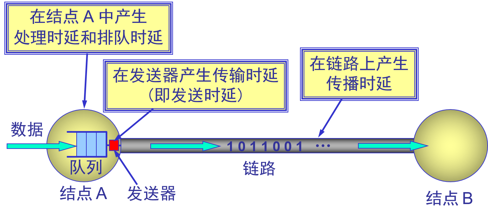
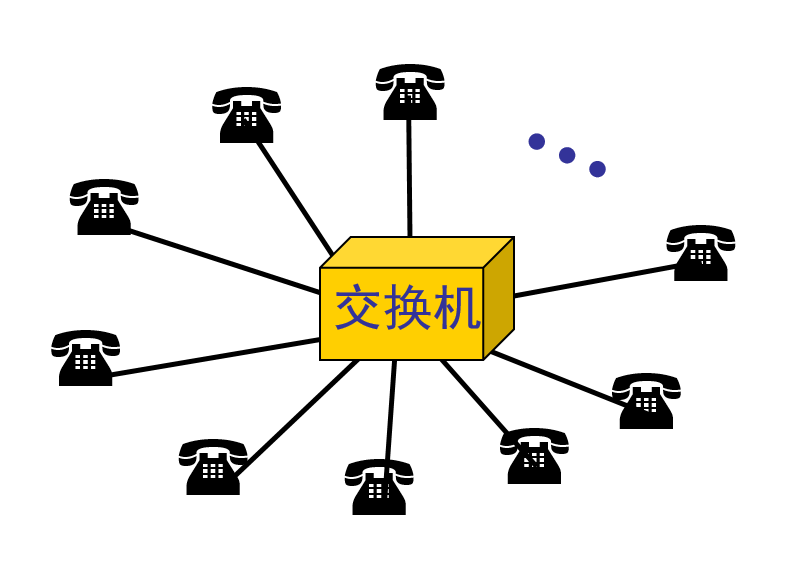
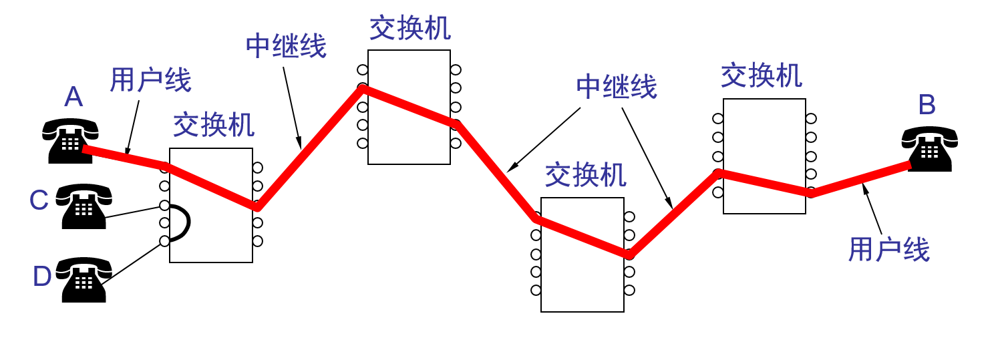
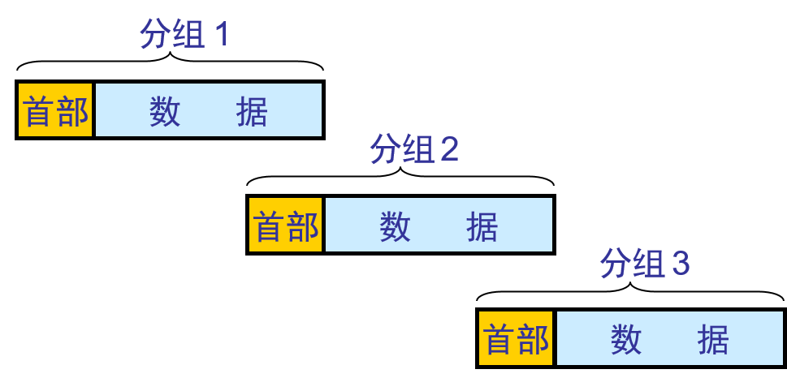
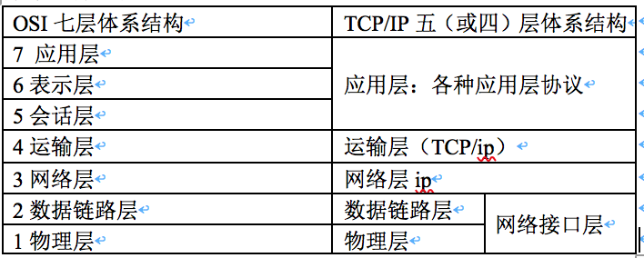

#计算机网络
# Computer Network

* application: supporting network applications
	* HTTP, IMAP, SMTP, DNS
* transport: process-process data transfer
	* TCP, UDP
* network: routing if datagrams from source to destination
	* IP. routing protocols
* link: data transfer between neighboring network elements
	* Ethernet, 802.11(Wifi), PPP
* physical: 

## 1.1 Overview

[Computer Network](https://www.wikiwand.com/en/Computer_network): A set of [computers](https://www.wikiwand.com/en/Computer) sharing resources located on or provided by [network nodes](https://www.wikiwand.com/en/Node_(networking)). The computers use common [communication protocols](https://www.wikiwand.com/en/Communication_protocol) over [digital](https://www.wikiwand.com/en/Digital_signal) [interconnections](https://www.wikiwand.com/en/Interconnection) to communicate with each other. These interconnections are made up of [telecommunication network](https://www.wikiwand.com/en/Telecommunication_network) technologies, based on physically wired, optical, and wireless radio-frequency methods that may be arranged in a variety of [network topologies](https://www.wikiwand.com/en/Network_topology).

An interconnection of multiple devices, also known as **hosts**, that are connected using multiple paths for the purpose of sending/receiving data or media. Computer networks can also include multiple devices/mediums which help in the communication between two different devices; these are known as **Network devices**  and include things such as **routers**, **switches**, **hubs**, and **bridges**.

**网络是由若干节点和连接这些节点的链路构成，表示诸多对象及其相互联系。**

## 1.3 Network Features

* Communication speed: video conferencing, email messaging
* File sharing
* Back up and Roll back is easy: easy to take the back up from the main server.
* Software and Hardware sharing
* Security
* Scalability
* Reliability

## 1.4 Network Types 

* by 覆盖范围 spatial scope
	* 广域网 WAN \(Wide Area Network\)：使用了广域网技术\(例ADSL, 花的钱多带宽就大: 8M、4M\)，虽然离地近也叫广域网，花钱买服务，花钱买带宽（花的钱多带宽就大: 8M、4M）。
	* 城域网 MAN \(Metropolitan Area Network\)
	* **局域网** LAN (Local Area Network)：网线不超过100m。使用了局域网技术，虽然离得远也叫局域网。企业自己购买设备，自己维护，带宽固定(100M 1000M，取决于交换机口的带宽), 距离100米。网络为一个单位拥有、且地理范围和站点数目有限。
		* 局域网类型：
		    * 以太网\(Ethernet\)：为实现局域网通信而设计的一种技术，它规定了包括物理层的连线、电子信号和介质访问层协议的内容，以太网是现在主流的局域网标准
		    * 光纤分布式数据接口\(FDDI\)
		    * 异步传输模式(ATM)
		    * 令牌环网(令牌 ring)
		* 局域网特点
			* 使用**广播信道**，具有广播功能，从一个站点可很方便地访问全网。局域网上的主机可共享连接在局域网上的各种硬件和软件资源；
			* 易于系统扩展和逐渐地演变，各设备的位置可灵活调整和改变；
			* 提高了系统的可靠性reliability、可用性availability和生存性survivability；
			* 数据率高、低时延，误码率低；
			* 各站点平等；
		* 局域网工作层次：跨物理层和数据链路层，无需网络层；
	* 个人区域网 PAN \(Personal Area Network\)
	* 现在不单从网络覆盖范围区分局域网和广域网，现在应用了广域网技术的是广域网，应用了局域网技术的是局域网。例：你和你邻居通过无线或网线进行通讯就是局域网，如果是通过ADSL通信就是广域网。
* by 拓扑结构
	* 星型网：广泛使用；🌟🌟
	* 总线型网：站点直接连在总线上，匹配电阻吸收信号电磁波能量，避免电磁波反射；使用的协议有两种：
		* CSMA/CD（传统以太网使用，已演变成星型网）
		* 令牌（令牌传递总线网使用，物理是总线，逻辑是令牌环网，目前已经退出市场）；
	* 环形网：典型的环型网是令牌环网(token ring)；
	* 树型网：由总线型网演变而来，使用频分复用技术；
	* 网状
* by 不同使用者的网络\(从网络的使用者进行分类\)
	* 公用网 \(public network\)：整个互联网 。公网
	* 专用网 \(private network\)：政府办公网，不允许与互联网连接，内网
* by 信息交换方式
	* 电路交换网
	* 报文交换网
	* 报文分组交换网
* by 通信方式
	* 点对点传输网络
	* 广播式传输网络
* By 网络使用目的
	* 共享资源网
	* 数据处理网
	* 数据传输网
* By 工作方式
	* 资源子网
	* 通信子网
	* 接入网
		* 用来把用户接入到因特网的网络
		* 接入网 AN \(Access Network\)，它又称为本地接入网或居民接入网。即：一个市通信范围内的众多用户接入线构成接入网如 PSTN  ISDN  ADSL  DDN等等；
		* 由 ISP 提供的接入网只是起到让用户能够与因特网连接的“桥梁”作用。
* by 服务方式
	* 客户机/服务器网络
	* 对等网

    

## 1.5 Network topology

Physical topology - Placement of various nodes
Logical topology - Deals with the data flow in the nework
Common network topologies

* Bus network 总线型；串糖葫芦，
* **Star network 最广泛，计算机接到交换机上**
* Ring network
* Mesh network 网状：路由器连的网。优点-&gt;容错
* Fully connected network
* Tree network

Overlay network

Underlay network

## 1.6 Communication protocols

OSI model: Layer architecture

* Layer1: Physical layer
* Layer2: Data link layer
* Layer3: Network layer
* Layer4: Transport layer
* Layer5: Session layer
* Layer6: Presentation layer
* Layer7: Application layer

Internet Protocol Suite(TCP/IP) Model: 

* Link layer
* Internet layer
* Trsnsport layer
* Application layer

## 1.7 Computer Network Architecture

- Peer-To-Peer network
- Client/Server network

网络架构指的是计算机网络中的结构和组织方式，包括网络中各个组成部分之间的连接方式、协议和通信方式等。常见的网络架构包括：
1.  **客户端-服务器架构**：客户端-服务器架构是最常见的网络架构之一，客户端通过网络连接到服务器，向服务器请求服务或资源。服务器响应客户端请求，处理请求并返回所需的数据或服务。这种架构主要用于Web应用程序、文件共享、邮件服务等。
2.  **对等网络架构**：对等网络架构是指网络中的所有节点都可以相互通信，没有中心节点，每个节点都可以充当客户端和服务器。这种架构主要用于文件共享、点对点游戏、实时视频和语音通信等应用。
3.  **分层网络架构**：分层网络架构是将网络分为不同的层次，每一层都有特定的功能和协议。这种架构可以提高网络的可扩展性和可维护性，常用的分层网络架构包括OSI模型和TCP/IP模型。
4.  **中心化和分布式网络架构**：中心化网络架构是指所有节点都连接到中心节点，所有通信都通过中心节点进行。分布式网络架构是指网络中的节点相互连接，没有中心节点。这两种架构都有各自的优缺点，在不同的应用场景中使用。
5.  **云网络架构**：云网络架构是一种以云计算为基础的网络架构，它包括公有云、私有云和混合云等不同类型，可以提供各种不同的服务，如云存储、云计算、云网络等。

以上是常见的网络架构，不同的架构适用于不同的场景和应用。在实际应用中，也可能会使用多种不同的网络架构组合来构建复杂的网络系统。

## 4.2.1 虚拟互连网络

没有一种单一的网络能够适应所有用户需求，各种网络新技术也层出不穷，各网络之间互相通信需要解决许多问题，比如：

* 不同的寻址方案；  
* 不同的最大分组长度；  
* 不同的网络接入机制；  
* 不同的超时控制；  
* 不同的差错恢复方法；  
* 不同的状态报告方法；  
* 不同的路由选择技术；  
* 不同的用户接入控制；  
* 不同的服务类型（无连接和面向连接）  
* 不同的管理与控制方法；

**网络互连使用的中间设备**（又称为中间系统或中继系统）主要有： 

* 物理层中继系统：转发器\(repeater\)  
* 数据链路层中继系统：网桥（桥接器）、二层交换机  
* 网络层中继系统：路由器（router）  
* 网桥和路由器的混合物：桥路器（brouter）  
* 网络层以上的中继系统：网关（gateway连接两个不兼容的系统）  

注意： 

* ①.中间设备是转发器或网桥时，仅把网络扩大，但我们仍视之为一个网络，并不称为网络互连。只有经路由器互联，才称作网络互连。由于历史原因，常把网络层使用的路由器称网关，而工作在网络层以上的真正的网关目前使用较少。 
* ②.虚拟互联网络：是指逻辑互联网络，使结构、性能各异的网络在网络层看起来好像是一个统一的网络。 
* ③.互联网可以是由多种异构网络互联组成。 
* ④.如果我们只从网络层考虑问题，那么 IP 数据报就可以想象是在网络层中传送。

## 1.8 Netowrk performance

#### Quality of service 

#### Network congestion

#### Network resilience

### 1.8.1 Rate

* 速率：每秒传多少比特。计算机网络上主机在数字**信道**上传输数据的速率；单位b/s**（bps），1Kb/s=**$$10^3$$** bps ；1Mb/s=**$$10^6$$** bps ；1Gb/s=**$$10^9$$** bps；1Tb/s=**$$10^{12}$$** bps**；
* 速率即**数据率**(data rate)或**比特率**\(bit rate\)是计算机网络中最重要的一个性能指标。

  * **比特**（bit）是计算机中数据量的单位，也是信息论中使用的信息量的单位。

  * Bit 来源于 binary digit，意思是一个**“二进制数字”**，因此一个比特就是二进制数字中的一个 1 或 0。
* 速率往往是指**额定速率**或**标称速率**。
* 上网时，360显示的xxkb/s就是速率，一般家里办的8M的网，这里的8M单位是字节，速率的b是比特。
* 速率是指单个信道的速率，即使同一的计算机其不能将不同信道速率加起来等于总速率。

### 1.8.2 Bandwidth

* **“带宽”\(bandwidth\)本来是指信号具有的频带宽度，单位是赫（或千赫、兆**赫、吉赫等），如电话信号带宽为3.1KHz（从300Hz到3.4KHz）。

* 在计算机网络中带宽表示网络通信线路传送数据的能力，即单位时间内从网络的某一点到另一点所能通过的**“最高数据率”**， 单位是“比特每秒”，或 b/s \(bit/s\,bps\)。1Mb/s=$$2^{20}$$ bps ；1Gb/s=$$2^{30}$$ bps；1Tb/s=$$2^{40}$$ bps；

* 常用的带宽单位

  * 千比每秒，即 kb/s （103 b/s）

  * 兆比每秒，即 Mb/s（106 b/s）

  * 吉比每秒，即 Gb/s（109 b/s）

  * 太比每秒，即 Tb/s（1012 b/s）

  * 请注意：在计算机界，K = 2^10 = 1024 M = 2^20, G = 2^30, T = 240。

* 数字信号流随时间的变化

  * 在时间轴上信号的宽度随带宽的增大而变窄。
    

### throughput吞吐量 

* **吞吐量**\(throughput\)表示在单位时间内通过某个网络（或信道、接口）的实际数据量。  经过网络设备速率总和
* 吞吐量更经常地用于对现实世界中的网络的一种测量，以便知道实际上到底有多少数据量能够通过网络。
* 吞吐量受网络的带宽或网络的额定速率的限制。

应用吞吐量压不上去

### 1.8.4 Network delay/latency

* **传输时延**（发送时延 ） 发送数据时，数据块从结点进入到传输媒体所需要的时间。也就是从发送数据帧的第一个比特算起，到该帧的最后一个比特发送完毕所需的时间。  
  

* **传播时延** 电磁波在信道中需要传播一定的距离而花费的时间。

* 信号**传输速率**（即发送速率）和信号在信道上的**传播速率**是完全不同的概念。  
  

* **处理时延** 交换结点为存储转发而进行一些必要的处理所花费的时间。主机线路由分析首部、提取数据部分、差错检测、路由选择等需花费的时间；

* **排队时延** 结点缓存队列中分组排队所经历的时延。在路由的输入队列中等待时间长度； 排队时延的长短往往取决于网络中**当时的通信量**。

* 数据经历的总时延就是发送时延、传播时延、处理时延和排队时延之和：  
  

* 四种时延所产生的地方

  * 从结点 A 向结点 B 发送数据

* 容易产生的错误概念

  * 对于高速网络链路，我们提高的仅仅是数据的发送速率而不是比特在链路上的传播速率。 
  * 提高链路带宽减小了数据的发送时延。 

1. 时延带宽积

   * 链路的时延带宽积又称为以比特为单位的链路长度。 表示发送的第一个比特到达终点时已发送比特数 
     
   * 时延与网络利用率的关系
     * 根据排队论的理论，当某信道的利用率增大时，该信道引起的时延也就迅速增加。 
     * 若令 D0 表示网络空闲时的时延，D 表示网络当前的时延，则在适当的假定条件下，可以用下面的简单公式表示 D 和 D0之间的关系： 
       U 是网络的利用率，数值在 0 到 1 之间。 
       

### 抖动

即延迟的可变性。

### 往返时间  

从发送方发送数据开始，到发送方收到来自接收方的确认为止，共经历的时间长度；

### 利用率  

主要是指“信道利用率” 和“网络利用率”  
⑴、信道利用率指出某信道有百分之几的时间是被利用的（有数据通过）。完全空闲的信道的利用率是零。信道利用率=有数据通过的时间/\(有+无\)数据通过的时间  
⑵、网络利用率则是全网络的信道利用率的加权平均值  
注:①信道利用率并非越高越好。  
②时延D与网络利用率U之间存在以下关系：  
若令 $$D_0$$ 表示网络空闲时的时延，D 表示网络当前的时延，则在适当的假定条件下，可以用下面的简单公式表示 D 和 $$D_0$$之间的关系：$$D={D_0}/(1-U)$$

**信程**

## 1.9 Non-performance metrics

* 费用

* 质量

* 标准化

* 可靠性

* 可扩展性和可升级性

* 易于管理和维护
* 高可用性

## 1.9 Security

## 1.2 Network History

https://www.wikiwand.com/en/Computer_network#/History

三网：电信网络，有线电视网，计算机网络。

核心是计算机网络、发展最为迅速、趋势是三网融合。以因特网为代表的计算机网络得到飞速发展

### 1.2.1 计算机网络的产生背景 

计算机网络的产生背景是20世纪60年代美苏冷战时期的产物。  
60年代初，美国国防部领导的远景研究规划局ARPA(Advanced Research Project Agency) 提出要研制一种生存性(survivability)很强的网络。  传统的电路交换(circuit switching)的电信网有一个缺点：正在通信的电路中有一个交换机或有一条链路被炸毁，则整个通信电路就要中断。  如要改用其他迂回电路，必须重新拨号建立连接。这将要延误一些时间。

新型网络的基本特点：

* 网络用于计算机之间的数据传送，而不是为了打电话。  
* 网络能够连接不同类型的计算机，不局限于单一类型的计算机。  
* 所有的网络结点都同等重要，因而大大提高网络的生存性。  
* 计算机在进行通信时，必须有冗余的路由。  
* 网络的结构应当尽可能地简单，同时还能够非常可靠地传送数据。

ARPANET的成功使计算机网络的概念发生根本变化   
早期的面向终端的计算机网络是以单个主机为中心的星形网，各终端通过通信线路共享昂贵的中心主机的硬件和软件资源。   
分组交换网则是以网络为中心，主机都处在网络的外围。  用户通过分组交换网可共享连接在网络上的许多硬件和各种丰富的软件资源。

从主机为中心到以网络为中心  

### 1.2.2 计算机网络在我国的发展

我国于1989年11月建成第一个公用分组交换网CNPAN网，随后陆续建造的九个全国范围的公用计算机网络： 

* (1) 中国公用计算机互联网 CHINANET
* (2) 中国教育和科研计算机网 CERNET
* (3) 中国科学技术网 CSTNET
* (4) 中国联通互联网 UNINET
* (5) 中国网通公用互联网 CNCNET
* (6) 中国国际经济贸易互联网 CIETNET
* (7) 中国移动互联网 CMNET
* (8) 中国长城互联网 CGWNET（建设中）
* (9) 中国卫星集团互联网 CSNET（建设中） 

## 网络协议知识图谱

# 1.3 Internet

* **网络(network)：许多计算机连接在一起。**由若干**结点(node)**和连接这些结点的**链路(link)**组成；(网络中的node译为结点，数据结构的树(tree)中的node译为“节点”)。一般不超过100米，例如学校机房。**结点：**可以是计算机、集线器、交换机、路由器等；

* **互联网(internet)：许多网络**使用路由器**连接在一起**形成互联网。网络的网络(network of networks)

* **因特网(Internet)** 因特网\(Internet\)是“网络的网络”。

  * 起源于美国，前身为ARPNRT，第一个
  * 进入 20 世纪 90 年代以后，以因特网为代表的计算机网络得到了飞速的发展。
  * 已从最初的教育科研网络逐步发展成为商业网络。
  * 已成为**世界上最大的国际性互联网**
  *  已成为仅次于全球电话网的世界第二大网络。
  * 连接在因特网上的计算机都称为**主机**(host)

* **网络与因特网之间的关系：**网络将计算机连在一起；互联网将许多网络连在一起

* internet和Internet的区别：

  | internet 互联网 | Internet 因特网 |
  | :--- | :--- |
  | internet是一个通用名词，泛指由多个计算机网络互联而成的网络。 | Internet是专用名词，它指当前全球最大的、开放的、由众多网络互联而成的特点计算机网络，采用**TCP/IP**协议族作为通信的规则，其前身是美国的**ARPANET**。 |

# 1.3.2 因特网发展的三个阶段

* 第一阶段：从单个网络 ARPANET 向互联网发展的过程\(大约1969年开始\)。

  * 计算机技术与通信技术相结合产生了第一个ARPANET网络 --&gt; **里程碑**
  * 1969: 分组交换 ；1975:互联网；1983 TCP/IP
  * 1983 年 TCP/IP 协议成为 ARPANET 上的标准协议， TCP/IP产生时没想过对外开放，所以产生很多安全问题。IPv6考虑了安全问题。人们把 1983 年作为因特网的诞生时间；

* 第二阶段的特点是建成了**三级结构的因特网**。（开始于1985）

  * 三级计算机网络，分为主干网、地区网和校园网（或企业网）。
  * 1985年开始美国国家基金会NSF着手构建三级计算机网络，即美国国家科学基金网NSFNET；

* 第三阶段的特点是逐渐形成了**多层次 ISP 结构的因特网\(大约1993年开始\)**。

  * 1993年美国政府不再自己运营而交给因特网服务提供商运营，出现了因特网服务提供者 ISP \(Internet Service Provider\)。各运营商的IP地址不是自己随便定义的，由因特网管理机构统一安排。所以根据IP可以知道是哪个国家哪个运营商的。

    

  * 根据提供服务的覆盖面积大小以及所拥有的  
    IP 地址数目的不同，ISP 也分成为不同的层次。  
    网站放在哪个地方的服务器看这个网站所服务的群体范围。

### 万维网的问世

* 因特网已经成为世界上规模最大和增长速率最快的计算机网络，没有人能够准确说出因特网究竟有多大。

* 因特网的迅猛发展始于 20 世纪 90 年代。由欧洲原子核研究组织 CERN 开发的**万维网** WWW \(World Wide Web\)被广泛使用在因特网上，大大方便了广大非网络专业人员对网络的使用，成为因特网的这种指数级增长的主要驱动力。

### 因特网的发展情况

|  | 网络数 | 主机数 | 用户数 | 管理机构数 |
| --- | --- | --- | --- | --- |
| 1980 | 10 | 102 | 102 | 100 |
| 1990 | 103 | 105 | 106 | 101 |
| 2000 | 105 | 107 | 108 | 102 |
| 2005 | 106 | 108 | 109 | 103 |

不同运营商之间访问速度会慢，所以网站经营商会将网站部署在不同运营商中，让用户能够选择属于自己的运营商来访问和下载。双线机房：该机房既连网通也连电信，这样两个不同ISP的用户互相访问时会加快访问速度。

## 1.3.3 因特网标准化工作

1. 1992年因特网不再由美国管辖，并形成国际性组织“因特网协会ISOC”：

   所有因特网标准都以RFC文档形成在Internet上发表:  
   因特网研究部：[http://www.isoc.org](http://www.isoc.org)  
   因特网工程部：[http://www.IAB.org](http://www.IAB.org)  
   

2. 制订因特网的正式标准要经过以下的四个阶段 ：

   1. 因特网草案\(Internet Draft\) ——在这个阶段还不是 RFC 文档。

   2. 建议标准\(Proposed Standard\) ——从这个阶段开始就成为 RFC 文档。

   3. 草案标准\(Draft Standard\)

   4. 因特网标准\(Internet Standard\) 

3. 各种RFC之间的关系  
       

# 1.4 Internet Structure
因特网的组成:
* Network Edge:
	* hosts: clients and servers
	* servers often in data centers.
	* 这部分是用户直接使用的，用来进行通信（传送数据、音频或视频）和资源共享。主机A与主机B通信“实质上是主机A中的某个进程与主机B中的某个进程进行通信”；
* Access networks, physical media:
	* wired, wirless communication links
* Network core:
	* interconnected routers
	* network of networks
	* 提供连通性和交换

    

## 1.4.1 Network Edge
因特网的边缘部分\(资源子网\)

* 处在因特网边缘的部分就是连接在因特网上的所有的主机。这些主机又称为**端系统**\(end system\)。

* “主机 A 和主机 B 进行通信”，实际上是指：“运行在主机 A 上的某个程序和运行在主机 B 上的另一个程序进行通信”。即“主机 A 的某个进程和主机 B 上的另一个进程进行通信”。或简称为“计算机之间通信”
### 通信方式
* 在网络边缘的端系统中运行的程序之间的三种主要**通信方式**：

  * **客户服务器方式**（C/S 方式），即Client/Server方式

  * **对等方式**（P2P 方式），即 Peer-to-Peer方式

  * **B/S模式** （Brower/Server），即浏览器/服务器模式

#### 1. 客户服务器方式

* **客户**\(client\)和**服务器**\(server\)都是指通信中所涉及的两个应用进程。

* 客户服务器方式所描述的是进程之间服务和被服务的关系。

* 客户是**服务的请求方**，服务器是**服务的提供方**。

* 服务器通常采用高性能的PC、工作站或小型机，并采用大型数据库系统，如Oracle、Sybase、Informix或 SQL Server，客户端需要安装专用的客户端软件。  
  

  #### ①客户机程序：

  * 被用户调用后运行，在打算通信时主动向远地服务器发起通信请求（请求服务）。因此，客户程序**必须知道服务器程序的地址，无需特殊硬件和复杂OS**。

  * 不需要特殊的硬件和很复杂的操作系统。

  #### ②服务器程序：

  * 一种专门用来提供某种服务的程序，可同时处理多个远地或本地客户的请求。

  * 系统启动后即自动调用并一直不断地运行着，被动地等待并接受来自各地的客户的通信请求。因此，服务器程序不需要知道客户程序的地址。

  * 一般需要强大的硬件和高级的操作系统支持。

  #### ③服务器：

  * 服务器是计算机的一种，它是网络上一种为客户端计算机提供各种服务（主要是共享服务）的高性能的计算机；它在网络操作系统的控制下，将与其相连的硬盘、磁带、打印机、Modem及昂贵的专用通讯设备提供给网络上的客户站点共享，也能为网络用户提供集中计算、信息发表及数据管理等服务；

  * 一般也可将运行着服务器程序的机器称为服务器；

  * 目前，按照体系架构来区分，服务器主要分为两类：

    * **ISC架构服务器**（又称**精简指令集RISC架构服务器**）：使用RISC芯片并且主要采用UNIX操作系统的服务器。

    * **IA架构服务器**，（又称**复杂指令集CISC架构服务器**）：即通常所讲的PC服务器，它是基于PC机体系结构，使用Intel或与其兼容的处理器芯片的服务器，如联想的万全系列服务器，HP公司的Netserver系列服务器等。

  #### ④.客户机：

  * 又称用户工作站，是用户与网络打交道的设备；一般由微机担任，每一个客户机都运行在它自己的、并为服务器所认可的操作系统环境中。客户机主要享受网络上提供的各种资源。

  #### 总结：

  * C/S优点是能充分发挥客户端PＣ的处理能力，很多工作可以在客户端处理后再提交给服务器。对应的优点就是客户端响应速度快。
  * 缺点主要是：
    * ①只适用于局域网
    * ②客户端需要安装专用的客户端软件
    * ③对客户端的操作系统一般也会有限制。

#### 2. 对等连接方式

* **对等连接**\(peer-to-peer，简写为 P2P\)是指两个主机在通信时并**不区分**哪一个是服务请求方还是服务提供方。

* 只要两个主机都运行了对等连接软件（P2P 软件），它们就可以进行**平等的、对等连接通信**。

* 双方都可以下载对方已经存储在硬盘中的共享文档。

* 对等连接方式的特点

  * 对等连接方式从本质上看仍然是使用客户服务器方式，只是对等连接中的每一个主机既是客户又同时是服务器。

  * 例如主机 C 请求 D 的服务时，C 是客户，D 是服务器。但如果 C 又同时向 F提供服务，那么 C 又同时起着服务器的作用。

  * 例如D从C下载500M的文件，硬已经下载250M了，则F想下载的时候可以从D下载。  
    

#### 3.B/Ｓ模式

* 客户机上只要安装一个浏览器（Browser），如Netscape Navigator或Internet Explorer，服务器安装Oracle、Sybase、Informix或 SQL Server等数据库。浏览器通过Ｗeb Server 同数据库进行数据交互。

* 总结：

  B/S最大的优点就是可以在任何地方进行操作而不用安装任何专门的软件。只要有一台能上网的电脑就能使用，客户端零维护。系统的扩展非常容易，只要能上网，再由系统管理员分配一个用户名和密码，就可以使用了。甚至可以在线申请，通过公司内部的安全认证（如ＣＡ证书）后，不需要人的参与，系统可以自动分配给用户一个账号进入系统。

### 网络接入技术：
Access networks and physical media:
* 住宅接入：光纤接入 DSL接入  ，**拨号调制解调器、HFC、DSL和FTTH**
* 公司/机构 接入：以太网 
* 移动接入：WiFi  4/5G

**无线因特网接入技术**：WiFi和4G接入。 WiFi速度快但距离短，4G速度慢但距离远。

拨号调制解调器： 速率56kbps 带宽专用（未查到 看其他人答案）  
HFC： 下行速率：42.8Mbps 上行速率：30.7Mbps 带宽共享  
DSL： 下行速率：24Mbps 上行速率:2.5Mbps 带宽共享  
FTTH: 平均下行速率：20Mbps 带宽共享

**以太LAN的传输速率**：10M-10G不等。

## 1.4.2 Network Core
因特网的核心部分\(通信子网)

* 网络核心部分是因特网中最复杂的部分。

* 网络中的核心部分要向网络边缘中的大量主机**提供连通性**，使边缘部分中的任何一个主机都能够向其他主机通信（即传送或接收各种形式的数据）。

* 在网络核心部分起特殊作用的是**路由器**(router)。

* 路由器的重要任务:路由器是实现**分组交换**(packet switching)的关键构件，其任务是转发收到的分组，这是网络核心部分最重要的功能。

* 因特网的核心部分是实现数据通信的，数据交换方式：
  * 电路交换 circuit switching
  * 报文交换 message switching
  * **分组交换** packet switching：在因特网上传送的数据都以分组(即IP数据报)为传送单位

* 因特网的核心部分是由许多网络和把它们互连起来的路由器组成，而主机处在因特网的边缘部分。

* 在因特网核心部分的路由器之间一般都用高速链路相连接，而在网络边缘的主机接入到核心部分则通常以相对较低速率的链路相连接。

* 在路由器中的输入和输出端口之间没有直接连线。

* 路由器处理分组的过程是：

  * 把收到的分组先放入缓存（暂时存储）；
  * 查找转发表，找出到某个目的地址应从哪个端口转发；
  * 把分组送到适当的端口转发出去。 

* 主机与路由器的作用不同

  * 主机是为用户进行信息处理的，并向网络发送分组，从网络接收分组，且可以和其他主机通过网络交换信息。  
  * 路由器对分组进行存储转发即进行分组交换的，最后把分组交付目的主机。

    
  

### Switching 技术
Switching: switching in computer network helps in deciding the best route for data transmission if there are multiple paths in a larger network. One-to-one cnnection
* Circuit switching
	* A dedicated path is established between the sender and receiver
	* Before data transfer, connection will be established first
	* Example: telephone network
* message switching
	* store and forward mechanism
	* message if transferred as a complete unit and forwarded using store and forward mechanism at the intermediary node
	* Not suited for streaming media and real-time applications
* packet switching
	* 
两种类型的分组交换机：路由器，交换机

#### 1. 电路交换
(1)  一百多年来，电话交换机虽经多次换代，但仍是电路交换。两部电话机只需要用一对电线就能够互相连接起来。5 部电话机两两相连，需 10 对电线。N 部电话机两两相连，需 N(N – 1)/2 对电线。当电话机的数量很大时，这种连接方法需要的电线对的数量与电话机数的平方成正比。显然太浪费，因此产生了交换机（当电话机的数量增多时，就要使用**交换机**来完成全网的交换任务）。

“交换”的含义:
* 在这里，“交换”(switching)的含义就是转接——把一条电话线转接到另一条电话线，使它们连通起来。
* 从通信资源的分配角度来看，“交换”就是按照某种方式动态地分配传输线路的资源。

    
     
  

(2) 电路交换的特点:
* 电路交换必定是面向连接的
* 电路交换的三个阶段
  * 建立连接
  * 通信
  * 释放连接

* 电路交换举例
  * A 和 B 通话经过四个交换机
  * 通话在 A 到 B 的连接上进行
  * C 和 D 通话只经过一个本地交换机
  * 通话在 C 到 D 的连接上进行
    
    

(3)电路交换的缺点：电路交换传送计算机数据效率低，不适合计算机通信

* 计算机数据具有突发性。    
* 这导致通信线路的利用率很低。

（4）电路交换使用情况：适合数据量很大的实时性传输，核心路由器之间可以使用电路交换。

#### 2.报文交换：采用存储转发技术

整个报文有一个报头，报头中含有目的地址和源地址等信息，通讯前不像电路交换那样先建立连接，通讯时整个报文先传送到相邻结点，全部存储下来后根据报头信息查找转发表，决定下一次转发到哪个结点，通讯结束时也没有释放连接过程；
报文一般比分组长的多
报文交换的时延较长，从几分钟到几小时不等。现在报文交换已经很少有人使用了。

#### 3. 分组交换：采用存储转发技术

存储转发原理并非完全新的概念。在 20 世纪 40 年代，电报通信也采用了基于存储转发原理的报文交换(message switching)。

(1)分组交换过程：

* 在发送端，先把较长的报文**划分成较短的、固定长度的数据段** 
  
* 每一个数据段前面添加上必要控制信息组成的**首部**(首部含有目的地址和源地址等信息)构成分组。**各个分组可独立选路**；为讨论方便，常把单个网络简化为一条链路，不必先建立链路。
  
* **分组**交换网以“分组”作为数据传输单元。
* 依次把各分组发送到接收端（假定接收端在左边）。
  
* **每一个**分组的首部都含有**地址**等控制信息。
* 分组交换网中的结点交换机根据收到的分组的首部中的**地址信息**，把分组转发到下一个结点交换机。
* 用这样的**存储转发**方式，最后分组就能到达**最终目的地**。
* 接收端收到分组后剥去首部还原成报文。
  
* 最后，在接收端把收到的数据恢复成为原来的报文。
  
* 这里我们假定分组在传输过程中没有出现差错，在转发时也没有被丢弃。

分组交换网示意图：

(2)分组交换的优点

* 高效    动态分配传输带宽，对通信链路是逐段占用。 
* 灵活    以分组为传送单位和查找路由。
* 迅速    不必先建立连接就能向其他主机发送分组。
* 可靠    保证可靠性的网络协议；分布式的路由选择协议使网络有很好的生存性。

(3)分组交换缺点

* 时延：分组在各结点存储转发时需要排队，这就会造成一定的时延。 
* 开销：分组必须携带的首部（里面有必不可少的控制信息）也造成了一定的开销。

#### 总结：三种交换的比较

#计算机网络
# 1.7 计算机网络的体系结构
相互通信的两个计算机系统必须高度协调工作才行，而这种“协调”是相当复杂的。“**分层**”可将庞大而复杂的问题，转化为若干较小的局部问题，而这些较小的局部问题就比较易于研究和处理。

几个 基本概念：

* ISO：国际标准化组织
* OSI/RM：互联网法律上的国际标准
* TCP/IP Suite：互联网事实上的国际标准
* Network Protocols ：数据交换遵守的规则、标准或约定。计算机有相同的协议才能通讯，不同语言的人无法交流。 
* 网络体系结构：计算机网络各层及其协议的集合

### 1.7.1 协议

如果你是程序员，一定看得懂上面这一段文字。这是每一个程序员向计算机世界说“你好，世界”的方式。但是，你不一定知道，这段文字也是一种协议，是人类和计算机沟通的协议，**只有通过这种协议，计算机才知道我们想让它做什么。**当然，这种协议还是更接近人类语言，机器不能直接读懂，需要进行翻译，翻译的工作教给编译器，也就是程序员常说的compile。这个过程比较复杂，其中的编译原理非常复杂，我在这里不进行详述。但是可以看得出，计算机语言作为程序员控制一台计算机工作的协议，具备了协议的三要素。

**协议**：为进行网络中数据交换而建立的规则标准或约定；使用不同协议的计算机无法通讯，除非在网关进行协议转换。**只有通过网络协议，才能使一大片机器互相协作、共同完成一件事。**

只要遵循 OSI 标准，一个系统就可以和位于世界上任何地方的、也遵循这同一标准的其他任何系统进行通信

法律上的国际标准 OSI 并没有得到市场的认可，而非国际标准 TCP/IP 获得了最广泛的应用。

**协议三要素**:

* ①**语法**：数据交换的格式与信息结构。例如，括号要成对，结束要使用分号等。
* ②**语义**：需要发出何种控制信息 完成何种动作。就是这一段内容要代表某种意义，例如数字减去数字是有意义的，数字减去文本一般来说就没有意义。
* ③**顺序**：事件实现顺序详细说明。例如，可以先加上某个数值，然后再减去某个数值。

**协议与服务的区别**：

* 实体\(entity\)：任何可发送或接收信息的硬件或软件进程；
* 协议\(protocol\)：控制两个对等实体进行通信的规则的集合；
  * ①协议的实现保证了向上层提供服务，下面的实体是透明的，上层只能看到下层的服务，看不到协议
  * ②协议是水平的，而服务是垂直的；
* 服务\(service\)：下层向上层提供服务，上层需要使用下层提供的服务来实现本层的功能。
  * 服务数据单位：层与层之间交换的数据的单位；
  * 服务点访问\(SAP\)：相邻两层实体间交换信息的地方；

-----

**只有通过这种协议，计算机才知道我们想让它做什么。**当然，这种协议还是更接近人类语言，机器不能直接读懂，需要进行翻译，翻译的工作教给编译器，也就是程序员常说的compile。这个过程比较复杂，其中的编译原理非常复杂，我在这里不进行详述。 

但是可以看得出，计算机语言作为程序员控制一台计算机工作的协议，具备了协议的三要素。会了计算机语言，你就能够教给一台计算机完成你的工作了。但是，要想打造互联网世界的通天塔，只教给一台机器做什么是不够的，你需要学会教给一大片机器做什么。这就需要网络协议。**只有通过网络协议，才能使一大片机器互相协作、共同完成一件事。**

### 1.7.3 分层思想的好处

网络为什么要分层？因为，是个复杂的程序都要分层。**复杂的程序都要分层，这是程序设计的要求。**比如，复杂的电商还会分数据库层、缓存层、Compose层、Controller层和接入层，每一层专注做本层的事情。

①**.**分层之间**相互独立**，无需知道下层如何实现

②**.**灵活性好：对本层修改只要保持接口不变，上下层不受影响

③**.**结构上可分割开：各层都可采用最合适的技术实现

④**.**易于实现和维护：系统被分解成若干独立子系统

⑤**.**能促进**标准化**工作：每一层功能都做出精选说明

### 1.7.4 体系结构

通信协议就像没有天桥的双子楼，要从A座的24层到达B座24层就得先下楼梯再上楼梯，其他协议也是如此，比如4G

很像发快递的过程（http，应用层)，你向顺丰下单(第一次请求),顺丰接单(应答),你向手机小伙联系(回应应答)，你将消息放进盒子里(开始封装请求，会话层)，快递员封装一层盒子贴上快递单带回网店(传输层），到快递点检查是否区域快件（网络层），将快件交给运输车（链路层），各个快递转运中心（物理层），快件到达收件市转运中心（物理层），转运输车（链路层），到达区域分发（网络层），网点派送（传输层），快递员方面签收（会话层），拆开检查（表示层），收到快递（应用层）。

体系结构：计算机网络的各层及其协议的集合；**层层封装**

从本质上讲，TCP/IP只是最上面三层，网络接口层没什么具体内容，学习时往往综合这两种体系结构优点，采用五层结构：从上往下依次是：应用层，运输层，物理层，数据链路层，物理层。

[OSI Model](https://www.wikiwand.com/en/OSI_model)七层：Layer architecture

* 

* 应用层：能够产生网络流量和用户交互的应用程序

* 表示层：加密、压缩，开发人员要考虑的一层 ，乱码是表示层出现问题

* 会话层：服务和客户端建立的会话，查木马 netstat -nb

* 传输层：可靠传输\(建立会话，看电影\)、不可靠传输\(qq聊天，屏幕广播软件\)、流量控制

* 网络层：选择最佳路径\(用动态路由协议实现\)、IP地址编址

* 数据链路层：数据如何封装、添加物理层地址 MAC

* 物理层：规定电压、接口标准

传输层、网络层、数据链路层是网络工程师做的事情。

网络排错：从底层到高层：

1. 网线是否插好 -&gt; 物理层
2. IP地址是否设对 -&gt; 网络层
3. IE浏览器是否中恶意插件 -&gt; 应用层

网络安全 和OSI参考模型

* 物理层安全：某公司在墙上安装很多接口，后来某几个房间空着租给另一个公司，另一个公司的计算机就能通过墙上的接口访问该公司数据出现安全问题
* 数据链路层安全：ADSL 拨号上网密码，无线密码
* 网络层安全：路由器设置哪个网段能连互联网，哪些网段不能连互联网
* 应用层安全：Sql 注入漏洞 、上传漏洞

\1. 物理层：连接
\2. 链路层：定位
\3. 传输层：路由
\4. 会话层：会话连接机制
\5. 应用层：数据封装格式

### 1.7.5 各层主要功能简介：

①.应用层：直接为用户应用进程服务，

②.运输层：为两个主机中进程之间通信提供服务

③.网络层：将运输层报文封装后进行传送，并选择路由

④.数据链路层：在相邻两个主机间点对点传送

⑤.物理层：透明传输比特流

数据在各层之间传递过程示意（假定两点直连）

主机1向主机2发送数据

### 各层常用网络协议

IP协议在Internet网中处于核心地位

### 网络数据包结构

Mac头 Ip头 Tcp头 Http头 数据体

## 程序是如何工作的？/网络协议工作模式

我们可以简单地想象“你”这个程序的工作过程。

当一个网络包从一个网口经过的时候，你看到了，首先先看看要不要请进来，处理一把。有的网口配置了混杂模式，凡是经过的，全部拿进来。

拿进来以后，就要交给一段程序来处理。于是，你调用**process_layer2(buffer)**。当然，这是一个假的函数。但是你明白其中的意思，知道肯定是有这么个函数的。那这个函数是干什么的呢？从Buffer中，摘掉二层的头，看一看，应该根据头里面的内容做什么操作。

假设你发现这个包的MAC地址和你的相符，那说明就是发给你的，于是需要调用**process_layer3(buffer)**。这个时候，Buffer里面往往就没有二层的头了，因为已经在上一个函数的处理过程中拿掉了，或者将开始的偏移量移动了一下。在这个函数里面，摘掉三层的头，看看到底是发送给自己的，还是希望自己转发出去的。

如何判断呢？如果IP地址不是自己的，那就应该转发出去；如果IP地址是自己的，那就是发给自己的。根据IP头里面的标示，拿掉三层的头，进行下一层的处理，到底是调用process_tcp(buffer)呢，还是调用process_udp(buffer)呢？

假设这个地址是TCP的，则会调用**process_tcp(buffer)**。这时候，Buffer里面没有三层的头，就需要查看四层的头，看这是一个发起，还是一个应答，又或者是一个正常的数据包，然后分别由不同的逻辑进行处理。如果是发起或者应答，接下来可能要发送一个回复包；如果是一个正常的数据包，就需要交给上层了。交给谁呢？是不是有process_http(buffer)函数呢？

没有的，如果你是一个网络包处理程序，你不需要有process_http(buffer)，而是应该交给应用去处理。交给哪个应用呢？在四层的头里面有端口号，不同的应用监听不同的端口号。如果发现浏览器应用在监听这个端口，那你发给浏览器就行了。至于浏览器怎么处理，和你没有关系。

浏览器自然是解析HTML，显示出页面来。电脑的主人看到页面很开心，就点了鼠标。点击鼠标的动作被浏览器捕获。浏览器知道，又要发起另一个HTTP请求了，于是使用端口号，将请求发给了你。

你应该调用**send_tcp(buffer)**。不用说，Buffer里面就是HTTP请求的内容。这个函数里面加一个TCP的头，记录下源端口号。浏览器会给你目的端口号，一般为80端口。

然后调用**send_layer3(buffer)**。Buffer里面已经有了HTTP的头和内容，以及TCP的头。在这个函数里面加一个IP的头，记录下源IP的地址和目标IP的地址。

然后调用**send_layer2(buffer)**。Buffer里面已经有了HTTP的头和内容、TCP的头，以及IP的头。这个函数里面要加一下MAC的头，记录下源MAC地址，得到的就是本机器的MAC地址和目标的MAC地址。不过，这个还要看当前知道不知道，知道就直接加上；不知道的话，就要通过一定的协议处理过程，找到MAC地址。反正要填一个，不能空着。

万事俱备，只要Buffer里面的内容完整，就可以从网口发出去了，你作为一个程序的任务就算告一段落了。

那TCP在三次握手的时候，IP层和MAC层在做什么呢？当然是TCP发送每一个消息，都会带着IP层和MAC层了。因为，TCP每发送一个消息，IP层和MAC层的所有机制都要运行一遍。而你只看到TCP三次握手了，其实，IP层和MAC层为此也忙活好久了。

<mark>**只要是在网络上跑的包，都是完整的。可以有下层没上层，绝对不可能有上层没下层。**</mark>

**对TCP协议来说，三次握手也好，重试也好，只要想发出去包，就要有IP层和MAC层，不然是发不出去的。**

经常有人会问这样一个问题，我都知道那台机器的IP地址了，直接发给他消息呗，要MAC地址干啥？这里的关键就是，没有MAC地址消息是发不出去的。

所以如果一个HTTP协议的包跑在网络上，它一定是完整的。无论这个包经过哪些设备，它都是完整的。

所谓的二层设备、三层设备，都是这些设备上跑的程序不同而已。一个HTTP协议的包经过一个二层设备，二层设备收进去的是整个网络包。这里面HTTP、TCP、 IP、 MAC都有。什么叫二层设备呀，就是只把MAC头摘下来，看看到底是丢弃、转发，还是自己留着。那什么叫三层设备呢？就是把MAC头摘下来之后，再把IP头摘下来，看看到底是丢弃、转发，还是自己留着。

----
# address

IP address(IPv4)
* logical address
* can change based on the location of the device
* assigned by manually or dynamically
* 0.0.0.0 to 255.255.255.255
MAC address
* Media Access Control
* Physical address or hardware address
* IP address = Location of a person, location can be changed
* MAC address = Namf of the person, name can't be changed
* unqiue
* can not be changed
* Assigned by the manufacturer
* 

router needs IP address, switch needs MAC address

Port address
* also called port number
* Port = communication endpoint
* In a node, many processes will be running, every process in a node is uniquely identified using port number
* Data which are sent/received must reach the right process.
* Fixed port numbers and gynamic port numbers (0-65535)

IP address: Reaching our network
MAC address: Reaching the host
Port address: Reaching the right process

Before sending the data, any node must:
* attach source IP and destination IP
* attach source MAC and destination MAC
* attach source Port and destination Port

## 计算机间连接方式
1. 网线直连
	1. 就是直接将网线两头接在两台设备上，相同设备使用交叉线，不同设备使用直通线
2. 同轴电缆
	1. 同轴电缆属于半双工通信，线到哪里数据就发到哪里，如果计算机B发送数据，A,C,D,E都能搜到。
	2. 缺点：
		1. 容易冲突，如果A向B发送同时C向d发送数据就会冲突。
		2. 半双工通信不灵活
		3. 如果其中一台主机断了，整个全部瘫痪
3. 集线器
	1. 同轴电缆升级版，其中一个节点坏了不影响其他节点
	2. 将接收到的数据全部转发给所连接的所有设备
	3. 缺点：半双工通信，易冲突，如果集线器连接1000台设备，发送一次数据要转发1000次，长时间占据线路，使用网桥能做到优化
4. 网桥
	1. 网桥只有两个接口，通过自学习知道每个接口对应的MAC地址，只要有一台设备发送数据，在数据包中携带了MAC地址，网桥会记录这个MAC地址属于哪一边，起到了**隔绝冲突域**的作用
	2. A发送数据给D，第一次通信A不知D的MAC地址，这个发送ARP广播协议。集线器1收到A发送到数据包后转发给所有连接自己的设备，B和C收到后丢弃，因为MAC地址不是自己，网桥收到这个包后，会记下A的MAC地址，将数据包发给集线器2，集线器2将包发给自己连接的所有设备，E，F检测到不是自己的MAC丢弃，D发现是自己的MAC返回携带自己MAC地址信息的ARP协议，同样的流程返回。A接受之后，使用IMCP协议发送需要发送的数据到D。当网桥知道所有主机的MAC地址，如A发送数据到B,网桥会检测到发现目标MAC在自己的左边，所以数据包不会再向右边发送。
5. 交换机（局域网的最终方案）
	1. 交换机可以理解为集线器+网桥的升级版
	2. 网桥解决两边互相通信冲突，但同一边通信时还是会有冲突，此时就有了交换机
	3. 每个接口连一台机器，每个接口都能记忆所有连接设备的MAC地址，就能知道每个借口对应的MAC地址做到精准转发
	4. 作用：相当于接口更多的网桥和集线器的结合体，同时还有全双工通信
	5. 缺点：
		1. 如果全世界计算机只使用交换机连接会出现IP地址不够用，因为交换机只能实现同网段间通信，其次如果不知道MAC地址就需要广播会造成大量资源浪费，所以需要使用路由器，让不同网段之间实现通信。处在同一网段就是同一广播域。链路上都是ARP广播协议称为广播风暴。
6. 路由器
	1. 为解决交换机造成的资源浪费，决定将计算机网络分段，为了能让各个网络之间通信，路由器诞生了
	2. 作用：在不同网段间传递数据，**隔绝广播域**