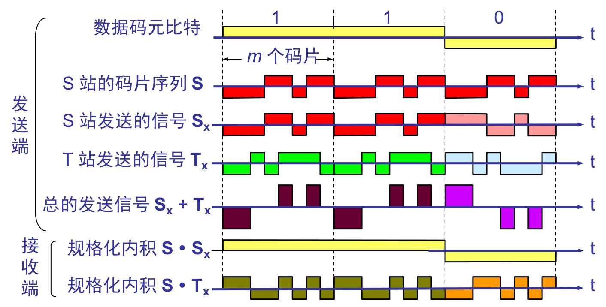

# 1. Physical Layer

自己组一个简单的网
* 两台电脑：买一根网线分别插在两台电脑的网卡上，配置这两台电脑的IP地址、子网掩码和默认网关。要想两台电脑能够通信，这三项必须配置成为一个网络，可以一个是192.168.0.1/24，另一个是192.168.0.2/24，否则是不通的。到此为止，两台电脑已经构成了一个最小的**局域网**，也即**LAN。**可以玩联机局域网游戏啦！
* 三台电脑：使用集线器Hub，这种设备有多个口，可以将宿舍里的多台电脑连接起来。但是，和交换机不同，集线器没有大脑，它完全在物理层工作。它会将自己收到的每一个字节，都复制到其他端口上去。这是第一层物理层联通的方案。

物理层主要目的：在传输媒体上透明传输比特流；物理层不是指具体的传输媒体 

物理层的主要任务：确定与传输媒体的接口的一些特性：
- **机械特性** 指明接口所用接线器的形状和尺寸、引线数目和排列、固定和锁定装置等等。
- **电气特性** 指明在接口电缆的各条线上出现的电压的范围。
- **功能特性** 指明某条线上出现的某一电平的电压表示何种意义。
- **过程特性** 指明对于不同功能的各种可能事件的出现顺序。

物理层L1：在网卡中实现，传送比特
* **传输媒体**：决定电信号0和1的传输方式，物理介质不同决定了电信号的传输带宽，速率，传输距离以及抗干扰性
	*  有线(网线)：双绞线，同轴电缆，光纤；
	* 无线：无线电波，微波，红外线，光波；
* **设备**：集线器hub，中继器，调制解调器, 
	* <mark>集线器</mark>：这种设备有多个口，可以将宿舍里的多台电脑连接起来。但是，和交换机不同，集线器没有大脑，它完全在物理层工作。它会将自己收到的每一个字节，都复制到其他端口上去。这是第一层物理层联通的方案。Hub采用的是广播方式。工作在半双工模式，即可能同时发送和接收数据，会将数据包广播到所有集线 器端口，适合用于抓包。
	* **传输单元**：比特流；

数据在计算机中多采用并行传输，在通信线路上，一般都是串行传输，主要出于经济上考虑； 

物理层的PDU(协议数据单元)由专门的串行信号模式组成，这些模式对应于数据链路层的帧的位模式。

用集线器和网线连接多个电脑，配置IP，子网掩码，默认网关可以组成一个最小的**局域网**，也即**LAN。**可以玩联机局域网游戏啦！

---

<mark>Hub采用的是广播方式，如果每一台电脑发出的包，宿舍的每个电脑都能收到，那就麻烦了。这就需要解决几个问题：</mark>

1. 这个包是发给谁的？谁应该接收？
2. 大家都在发，会不会产生混乱？有没有谁先发、谁后发的规则？
3. 如果发送的时候出现了错误，怎么办？

这几个问题，都是**第二层，数据链路层**，也即MAC层要解决的问题

## 1.1 数据通信基础知识

### 1.1.1 数据通信系统的模型

1. 通信系统一般可划分为三大部分：
   ①源系统：包括信源和发送器；
   ②传输系统：可能是简单的传输线也可能是复杂的网络系统；
   ③目的系统：接收器和信宿；

   

2. 几个术语
   * 数据\(data\)——运送消息的实体。
   * 信号\(signal\)——数据的电气的或电磁的表现。
   * “模拟的”\(analogous\)——代表消息的参数的取值是连续的。
   * “数字的”\(digital\)——代表消息的参数的取值是离散的。
   * 模拟信号（analogous signal）—— 波动持续变化，包含无穷多个值；

     

   * 数字信号（digital signal）—— 离散，跃变，包含有限个值；设备先进，便宜

     

   * 码元\(code\)——在使用时间域（或简称为时域）的波形表示数字信号时，代表不同离散数值的基本波形。

     * 举例：$$U=U_i*sin(ωt+φ_j)$$，其中振幅$$U_i$$有2种，相位$$ψ_j$$有4种，每个振幅$$U_i$$和相位$$ψ_j$$对应的U构成一个码元，则有8种码元，每种码元代表3个二进制比特；

       显然：若每一个码元可表示的比特数越多，则在接收端进行解调时要正确识别每一种状态就越困难。

### 1.1.2 有关信号的基本概念

* 信道：向某一个方向传送信息的媒体。通信电路不同，通常一条通信电路包含一条发送信道和一条接收信道。
* **单向通信**（单工通信）——只能有一个方向的通信而没有反方向的交互，如无线电广播。
* **双向交替通信**（半双工通信）——通信的双方都可以发送信息，但不能双方同时发送\(当然也就不能同时接收\)。
* **双向同时通信**（全双工通信）——通信的双方可以同时发送和接收信息。
* **基带信号**（即基本频带信号）——来自信源的信号。像计算机输出的代表各种文字或图像文件的数据信号都属于基带信号。
* 基带信号往往包含有较多的低频成分，甚至有直流成分，而许多信道并不能传输这种低频分量或直流分量。因此必须对基带信号进行**调制**\(modulation\)。
* **基带传输** —— 在信道中直接传输基带信号
* **带通信号**——把基带信号经过载波调制后，把信号的频率范围搬移到较高的频段以便在信道中传输的信号（即仅在一段频率范围内能够通过信道）。
* **频带传输** —— 将基带信号调制成模拟信号后传输

### 1.1.3基本的调制方法

几种最基本的调制方法
* 基带信号往往包含有较多的低频成分，甚至有直流成分，而许多信道并不能传输这种低频分量或直流分量。为了解决这一问题，就必须对基带信号进行调制\(modulation\)。
* 调制分两大类，一类是仅仅对基带信号的波形进行变换，使它能够与信道特性相适应，变换后的信号任然是基带信号，这类调制称之为“基带调制”；另一类是需要使用载波进行调制，即把信号的频率范围搬移到较高的频段以便在信道中传输，这类调制称之为“带通调制”
* 最基本的二元制调制方法\(带通调制方法\)有以下几种：
  * 调幅\(AM\)：载波的振幅随基带数字信号而变化。 
  * 调频\(FM\)：载波的频率随基带数字信号而变化。
  * 调相\(PM\) ：载波的初始相位随基带数字信号而变化。  

  为达到更高信息传输速率，必须采用更为复杂的多元制振幅相位混合调制方法；

* 对基带数字信号的几种调制方法

    
  

  * 正交振幅调制 QAM \(Quadrature Amplitude Modulation\) 
    * 可供选择的相位有 12 种，而对于每一种相位有 1 或2 种振幅可供选择。
    * 由于4 bit 编码共有16 种不同的组合，因此这 16 个点中的每个点可对应于一种 4 bit 的编码。
    * 若每一个码元可表示的比特数越多，则在接收端进行解调时要正确识别每一种状态就越困难。
      

### 1.1.4  信道的极限容量

#### 1. 基本概念

* 信道带宽（W）：通讯信道的“带宽”是指信道可以不失真地传输信号的频率范围。（注意：计算机网络中“带宽”则表示网络通信线路传送数据的能力，即单位时间内从网络的某一点到另一点所能通过的最高数据率\*\*）
  显然：不同的传输媒体具有不同的信道质量，所支持的带宽有所不同。 
* 数据传输率（C）：又称比特率，信道在单位时间内可以传输的最大比特数。  
      单位：每秒比特数bit/s（bps）；
* 信号传输率（B）：又称码元率、调制速率或波特率\*\*，可以被理解为单位时间内传输码元符号的个数，即“传输符号率”，单位：波特（Baud）；  
  波特率与比特率的关系为：比特率 = 波特率\*\*单个码元对应的二进制位数\*\*。
* 信道容量：表示信道的传输能力，是指信道在单位时间内可以传输的最大信号量（即信道的最大信号传输率Bmax）。通常表示为单位时间内可传输的最大二进制位数（即信道的最大数据传输率Cmax）。  
  信道容量和信道带宽具有正比的关系：带宽越大，容量越大。

#### 2. 信道极限容量;两个定理

* 任何实际的信道都不是理想的，在传输信号时会产生各种失真以及带来多种干扰。信号或数据传输率越高、信号传输距离越远、干扰越大，在信道的输出端的波形的失真就越严重，如果接收方还能够识别失真的信号，则失真对通讯无影响。
* 限制信号或数据在信道上的传输速率的主要因素有以下两个：“信道能够通过的频率范围”和“信噪比” ；
* 码元传输的速率越高，或信号传输的距离越远，在信道的输出端的波形的失真就越严重。

#### 数字信号通过实际的信道

* \(1\). 信道能够通过的频率范围=》奈奎斯特定理=〉无噪音的理想信道
	*  码间串扰：接收端收到的信息失去了码元之间的清晰界限而无法识别。
		* 1924 年，奈奎斯特\(Nyquist\)推导出了著名的奈奎斯特定理。他给出了在假定的理想条件下，为了避免码间串扰，码元的传输速率的上限值。
		* 在任何信道中，码元传输的速率是有上限的，否则就会出现码间串扰的问题，使接收端对码元的判决（即识别）成为不可能。
		* 如果信道的频带越宽，也就是能够通过的信号高频分量越多，那么就可以用更高的速率传送码元而不出现码间串扰。
	* 定理内容：设信道带宽W（HZ）、每个采样周期中信号的状态最多有V种（即有V种码元），则在无噪音情况下信道的最大数据传输速率为：

    $$C_{max}=2W*log_2^V$$（bps）

* \(2\)信噪比=》香农公式=〉有噪音的信道

* **信噪比：**信号平均功率与噪声平均功能之比，记做S/N

    $$信噪比(dB)=10*log_{10}^{S/N} (dB)$$；信噪比通常用**分贝**作度量单位；

  * 香农定理内容：香农\(Shannon\)用信息论的理论推导出了带宽受限且有高斯白噪声干扰的信道的极限、无差错的信息传输速率。

    * 信道的极限信息传输速率 C 可表达为 $$C = W* log_2^{(1+S/N)} $$b/s

      * W 为信道的带宽（以 Hz 为单位）；
      * S 为信道内所传信号的平均功率；
      * N 为信道内部的高斯噪声功率。

    * 香农公式表明
      * 信道的带宽或信道中的信噪比越大，则信息的极限传输速率就越高。
      * 只要信息传输速率低于信道的极限信息传输速率，就一定可以找到某种办法来实现无差错的传输。
      * 若信道带宽 W 或信噪比 S/N 没有上限（当然实际信道不可能是这样的），则信道的极限信息传输速率 C 也就没有上限。
        实际信道上能够达到的信息传输速率要比香农的极限传输速率低不少。

  * 提高信道传输速率上限的方法：
    ①提高带宽（根据香浓公式）；
    ②提高信噪比（根据香浓公式）；
    ③让一个码元携带更多比特信息（根据奈氏准则）

  * 请注意
    * 对于频带宽度已确定的信道，如果信噪比不能再提高了，并且码元传输速率也达到了上限值，那么还有办法提高信息的传输速率。这就是用编码的方法让每一个码元携带更多比特的信息量。

【**例题 2.2**】有一带宽为3khz的理想低通信道，求其最高码元速率，若一个码元能运载3位二进制信息，求信道容量

解：V = 23 =8，根据奈奎斯特定理可知:$$C_{max}=2W*log_2^V=2*3000*log_2^8=18000(bps)$$

因为比特率 = 波特率\*单个码元对应的二进制位数。所以$$B_{max}=C_{max}/3=6000(band)$$

【例题**2.3**】求噪音为30db、带宽为4KHz信道容量（即信道最大传输速率）

解： $$30=10log_{10}^{(S/N)}$$求得S/N=1000

$$C=W*log_2^{(1+S/N)}≈40Kbps$$

## 1.2 物理层下面的传输媒体

### 1.2.1 导向传输媒体

电信领域使用的电磁波的频谱  

* **双绞线**：又称“双扭线”，连接电脑常用8芯无屏蔽双绞线
	* 屏蔽双绞线 STP \(Shielded Twisted Pair\)：有金属屏蔽层
	* 无屏蔽双绞线 UTP \(Unshielded Twisted Pair\)：无金属屏蔽层  
		* 绞合作用：减少相邻导线之间的电磁干扰；  
	        * 传输信号：数字信号、模拟信号；  
                * 传输距离：十几公里；导线越粗传输越远，传输数字信号时传输速率越大越近；

* **同轴电缆**：常用于有线电视网
	* 50 Ω 同轴电缆
	* 75 Ω 同轴电缆!

* **光缆** ：即光导纤维，不受外界电磁干扰，直径8—100μm
	* 多模光纤：直径相对较大，可以存在多条不同角度入射的光线在一条光纤中传输的光纤；
	* 单模光纤：光纤直径小到光的波长时，光线就一直向前传播而不发生多次反射的光纤（传播的距离比多模光纤远）
	* 
	* 光纤工作原理： 
		* 
		* 
    

### 1.2.2 非导向传输媒体

* 无线电传输：收音机。所使用的频段很广。
* 微波传输：短波通信主要是靠电离层的反射，但短波信道的通信质量较差。微波在空间主要是直线传播。
	* 地面微波接力通信
	* 卫星通信
* 红外线：遥控器
* 光波        

### 1.2.3 国标网线制作方法

A标准与B标准差别为1与3 2与6对调
直通线：两边标准相同；
交叉线：两边标准相异；
注意：在10M、100M以太网中，仅1、2、3、6四根线有用；

## 1.3 信道复用技术

为什么要使用信道复用技术？
1. 通信工程中通信线路架设的费用较高，需要充分利用线路的现有容量。
2. 传输介质的通信容量都会**超过**单一信道的传输通信量。

### 1.3.1 多路复用技术实质

发送方使用_复用器_将多个用户数据合起来**共享**一条物理线路传输到接收端，接收端再使用分用器将数据分离成各个单独数据，分发给接收方多个用户。

### 1.3.3 多路复用的基本形式

多路复用的常用四种基本形式：
* 频分多路复用（FDM）    
* 波分多路复用（WDM）
* 时分多路复用（TDM         
* 码分多路复用（CDMA）

1. 频分多路复用==》基本原理：在一条通信线路上设置多个信道，每路信道的信号以不用载波频率进行调制；即：多个用户在同一时间内占用不同的频率带宽（这里的带宽是频率带宽而不是数据的发送速率）；

【例题2.4】一通信线路可用带宽96KHZ，每个信道4KHZ，则该线路可以复用24个信号。每个信道分配给一个用户，可同时为24对用户提供服务；

再如：一电话通信标准话路带宽为4KHZ，若1000个用户进行频分复用，复用后总带宽为4MHZ；

2. 时分多路复用 - 基本原理：所有用户在不同时间占用相同的频带宽度；

(1) 同步时分多路复用→将时间片预先分配给各个信道，并且时间片固定不变

同步时分多路复用示意图

显然由于计算机数据突发性，同步时分多路复用可能造成线路资源的浪费。它不考虑这些信道是否有数据发送。

使用时分复用系统传送计算机数据时，由于计算机数据的突发性质，用户对分配到的子信道的利用率一般是不高的

⑵ 统计时分多路复用→允许动态地分配时间片；其原理如下图所示。假定各用户发送数据情况如上图左边

统计时分多路复用示意图

3. 波分多路复用：波分复用就是光的频分多路复用，用于光纤通讯；

4. 码分多路复用（CDM）- 又称码分多址复用（CDMA）
	* 码分多路的特征：
		* 各用户使用经过特殊挑选的不同码型，因此彼此不会造成干扰。
		* 这种系统发送的信号的抗干扰能力很强，其频谱类似于白噪声，不易被发现。
		* 每一个比特时间划分为 m 个短的间隔，每个间隔称为一个码片，m个码片构成一个码元。
		* 每个站被指派一个唯一的 m bit 码片序列。
			* 如发送比特 1，则发送自己的 m bit 码片序列。
			* 如发送比特 0，则发送该码片序列的二进制反码。
		* 例如，S 站分配的 8 bit 码片序列是 00011011（一个码元）。
			* 发送比特 1 时，就发送序列 00011011。
			* 发送比特 0 时，就发送序列 11100100。
			* S 站的码片序列：\(–1–1–1+1 +1–1 +1 +1\)
	* 码分多路的工作原理：每个站分配的码片序列不仅必须各不相同，并且还必须互相正交（在实用的系统中是使用伪随机码序列）。这种正交满足下列特征：
		* 令向量表示站的码片向量，令 T 表示其他任何站T的码片向量，令表示其他任何站T的码片反码的向量，两个不同站的码片序列正交，就是向量和的规格化内积是0,同时向量和的规格化内积也是0,：$$
S•T≡\frac{1}{m}\sum_{i=1}^mS_iT_i=0 , 且 S•T^1≡\frac{1}{m}\sum_{i=1}^mS_iT_i^1=0
$$ 例如：令向量S为\(–1 –1 –1 +1 +1 –1 +1 +1\)，向量T为\(–1 –1 +1 –1 +1 +1 +1 –1\)	

			  * 任何一个码片向量和该码片向量自己的规格化内积都是1 。  

$$
S•S=\frac{1}{m}\sum_{i=1}^mS_i^2=\frac{1}{m}\sum_{i=1}^m(±1)^2=1
$$
		* 一个码片向量和自身反码的向量的规格化内积值是–1 
$$
S•S^=\frac{1}{m}\sum_{i=1}^mS_iS_i^1=\frac{1}{m}\sum_{i=1}^mS_i*(-S_i)=\frac{1}{m}\sum_{i=1}^m-1=1
$$
CDMA的工作原理

当接收站打算接收S站发送的信号时，就用S站的码片序列\*\*与收到的复用信号求规格化内积，即$$S•S_X$$和$$S•T_X$$,显然$$S•T_X=0$$，$$S•S_X$$就是S站发的数据比特；

## 1.4 数字传输系统

### 1.4.1. 脉冲编码调制 方法

数字信号传输失真小、误码率低、数据传输速率高，因此在网络中除计算机直接产生的数字外，语音、图像等信息的模拟数据进行数字化已成为发展的必然趋势。

[**脉冲编码调制**](http://baike.baidu.com/view/381504.htm)（**Pulse Code Modulation PCM\*\*）是模拟数据数字化的主要方法。由于历史上的原因，PCM 有两个互不兼容的国际标准，即北美的 24 路 PCM（简称为 T1）和欧洲的 30 路 PCM（简称为 E1）。我国采用的是欧洲的 E1 标准。E1 的速率是 2.048 Mb/s，而 T1 的速率是 1.544 Mb/s。

[脉码调制](http://baike.baidu.com/view/381504.htm)包含三个部分内容。
1. 采样：采样定理：如果以大于或等于信道带宽2倍的速率定时对信号进行采样。其样本可以包含足以重构原模拟信号的所有信息。
2. 量化：将信号分为若干量化级。量化成多少级，根据精度要求。级数应为2n
3. 编码：若有K个量化级，则需要$$ log_2^K $$位二进制编码。

当PCM用于数字化语音系统时，它将声音分为128个量级，每个量级采用7位二进制编码表示，由于采样频率为8000样本/秒。因此，数据传输速率应达到7\*8000=56（Kbps）。

PCM编码效率比较低
* 脉码调制 PCM 体制最初是为了在电话局之间的中继线上传送多路的电话。
* 由于历史上的原因，PCM 有两个互不兼容的国际标准，即北美的 24 路 PCM（简称为 T1）和欧洲的 30 路 PCM（简称为 E1）。我国采用的是欧洲的 E1 标准。
* E1 的速率是 2.048 Mb/s，而 T1 的速率是 1.544 Mb/s。
* 当需要有更高的数据率时，可采用复用的方法。

### 1.4.2 数字数据编码方法

数字信号编码方式主要有以下几种：
* 非归零码（波特率=数据率）规则：用低电平表示“0”、用高电平表示“1”、需要另一信道传输同步信号，以保证收发双方同步，否则无法判断一位开始与结束；
* 曼彻斯特编码（波特率=2_数据率）规则：每比特的周期T分为前T/2和后T/2，前T/2传送该比特反码，后T/2周期传送该比特原码；（即：位中间正跳变表示0，位中间负跳变表示1）
	* 特点：无需另发同步信号、效率低，若信号传输速率为10 MBPS，则发送频率应为20MHZ。
* 差分曼彻斯特编码（波特率=2_数据率）对曼彻斯特编码的改进。比特中间跳变仅做同步用，每比特值根据其**开始边界**是否跳变来决定，有跳变表示“0”， 无跳变表示“1”；

三种基本编码方式：

### 1.4.3 PCM国际标准

* **T1载波系统**：日本、北美使用，24路。每秒采样8000次，轮流将一个字节插入到一帧中，每字节8位，7位是数据，1位用于信道控制帧最前附加一位开始标志位共8\*24+1=193位，速率为1.544MBPS
* **E1载波系统**：我国和欧洲使用飞该标准，共32路，其中30路语音信道和2路传送控制信道。采样频率8000次/秒，速率为3288000=2.048MBPS

### 1.4.4. 同步光纤网 SONET 和同步数字系列 SDH

* PCM传输系统两个主要缺点：
  * 速率标准不统一è如果不对高次群的数字传输速率进行标准化，国际范围的高速数据传输就很难实现。 
  * 不是同步传输è在过去相当长的时间，为了节约经费，各国的数字网主要是采用准同步方式。   
  
* 同步光纤网 SONET
	* 为了解决上述等问题，1988年美国首先推出了一个数据传输标准，即：同步光纤网 SONET \(Synchronous Optical Network\) ，它的各级时钟都来自一个非常精确的主时钟。 它为光纤传输系统定义了同步传输的线路速率等级结构，其基本速率为51.84Mbps，此速率对电信号称为第\*1\*\* 级同步传送信号 STS-1（其它级别的同步传送信号记为STS-n，速率为n51.84Mbps），(Synchronous Transport Signal\)而对光信号称为第 1 级光载波 OC-1（其它级别的光载波信号记为OC -n，速率也为n\*51.84Mbps）。OC 表示Optical Carrier
* 同步数字系列 SDH
	* ITU-T（国际电信联盟远程通信标准化组）以SONET为基础推出了国际标准同步数据系列\*\*SDH\*\* \(Synchronous Digital Hierarchy\)，它不仅适用于光纤，也适用于微波和卫星通信。一般可认为 SDH 与 SONET 是同义词。SDH 的基本速率为 155.52 Mb/s，称为第\*\*1级同步传递模块\*\* \(Synchronous Transfer Module\)，即 STM-1，相当于 SONET 体系中的 OC-3 速率；
* SDH可以认为是SONET的同义词。
* 更高级别速率标准STM-N是将STM-1同步复用而成。

SONET 的体系结构：SONET 标准定义了四个光接口层 
* 光子层(Photonic Layer) : 处理跨越光缆的比特传送。
* 段层(Section Layer) : 在光缆上传送 STS-N 帧。
* 线路层(Line Layer) : 负责路径层的同步和复用。
* 路径层(Path Layer) : 处理路径端接设备 PTE (Path Terminating Element)之间的业务的传输。

* SONET 的体系结构  
  

## 1.5 宽带接入技术

### 1.5.1 xDSL技术（非对称数字用户线）

xDSL技术简介
* DSL 就是数字用户线\(Digital Subscriber Line\)的缩写。而 DSL 的前缀 x则表示在数字用户线上实现的不同宽带方案。 
* xDSL 技术就是用数字技术对现有的模拟电话用户线进行改造，使它能够承载宽带业务。
* 虽然标准模拟电话信号的频带被限制在 300~3400 Hz 的范围内，但用户线本身实际可通过的信号频率仍然超过 1 MHz。
* xDSL 技术就把 0~4 kHz 低端频谱留给传统电话使用，而把原来没有被利用的高端频谱留给用户上网使用。40KHZ~1.2MHZ划分出许多子信道，每个子信道4KHZ，其中25个子信道用于上行信道，249个用于下行信道。
* ADSL最大好处就是可以利用现有电话网中用户线，不需重新布线。
* ADSL在用户线两端各安装一个ADSL调制解调器。我国是DMT调制技术。

xDSL 的几种类型：
* ADSL \(Asymmetric Digital Subscriber Line\)：非对称数字用户线
* HDSL \(High speed DSL\)：高速数字用户线
* SDSL \(Single-line DSL\)：1 对线的数字用户线
* VDSL \(Very high speed DSL\)：甚高速数字用户线
* DSL ：ISDN 用户线。
* RADSL \(Rate-Adaptive DSL\)：速率自适应 DSL，是 ADSL 的一个子集，可自动调节线路速率）。  

ADSL 的极限传输距离：
* ADSL 的极限传输距离与数据率以及用户线的线径都有很大的关系（用户线越细，信号传输时的衰减就越大），而所能得到的最高数据传输速率与实际的用户线上的信噪比密切相关。
* 例如，0.5 毫米线径的用户线，传输速率为 1.5 ~ 2.0 Mb/s 时可传送 5.5 公里，但当传输速率提高到 6.1 Mb/s 时，传输距离就缩短为 3.7 公里。
* 如果把用户线的线径减小到0.4毫米，那么在6.1 Mb/s的传输速率下就只能传送2.7公里  

ADSL 的特点：
* 上行和下行带宽做成不对称的。
* 上行指从用户到 ISP，而下行指从 ISP 到用户。
* ADSL 在用户线（铜线）的两端各安装一个 ADSL 调制解调器。
* 我国目前采用的方案是离散多音调 DMT \(Discrete Multi-Tone\)调制技术。这里的“多音调”就是“多载波”或“多子信道”的意思。  

ADSL中的DMT 技术 ：
* 目前被广泛采用的ADSL调制技术有3种：QAM\(正交幅度调制quadature ampli-　tude modulation\)、CAP\(carrierless amplitude-phase modulation载波幅度相位调制\)　、DMT\(discrete multitone离散多音频调制\)。
* DMT 调制技术采用频分复用的方法，把 40 kHz 以上一直到 1.1 MHz 的高端频谱划分为许多的子信道，其中 25 个子信道用于上行信道，而 249 个子信道用于下行信道。
* 每个子信道占据 4 kHz 带宽（严格讲是 4.3125 kHz），并使用不同的载波（即不同的音调）进行数字调制。这种做法相当于在一对用户线上使用许多小的调制解调器并行地传送数据。

### 1.5.2 光纤同轴混合网（HFC网）

HFC 网是在目前覆盖面很广的有线电视网 CATV 的基础上开发的一种居民宽带接入网。除可传送 CATV 外，还提供电话、数据和其他宽带交互型业务。

现有的 CATV 网是树形拓扑结构的同轴电缆网络，它采用模拟技术的频分复用对电视节目进行单向传输。而 HFC 网则需要对 CATV 网进行改造。

它将有线电视网的同轴电缆主干部分改用光纤，可大大提高网络可靠性和电视信号质量。

HFC 的主要特点如下：
* HFC网的主干线路采用光纤；
* HFC 网采用结点体系结构（参见P59图2-21）；
* HFC 网具有比 CATV 网更宽的频谱，且具有双向传输功能；

* 每个家庭要安装一个用户接口盒，该盒提供3种连接：
  * 使用同轴电缆连接到机顶盒，然后接电视机；
  * 使用双绞线接到电话线；
  * 使用电缆调制解调器连接到计算机；

### 1.5.3 fttx技术

FTTx（光纤到……）: 也是一种实现宽带居民接入网的方案。这里字母 x 可代表不同意思。
- 光纤到家 FTTH (Fiber To The Home)：光纤一直铺设到用户家庭可能是居民接入网最后的解决方法。
- 光纤到大楼 FTTB (Fiber To The Building)：光纤进入大楼后就转换为电信号，然后用电缆或双绞线分配到各用户。
- 光纤到路边 FTTC (Fiber To The Curb)：从路边到各用户可使用星形结构双绞线作为传输媒体。