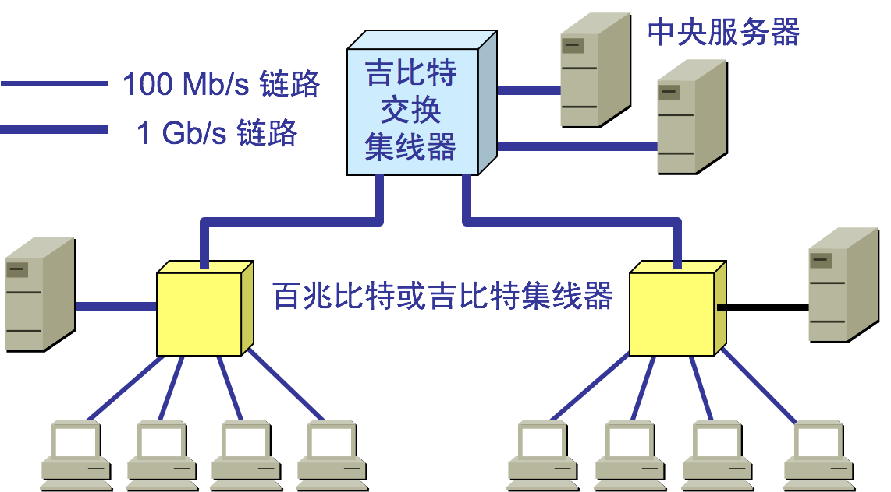

# 2.2.1广播信道

使用广播信道的数据链路层
广播信道可以进行一对多通信，**局域网**使用的就是广播信道。
共享信道的媒体共享技术：
* 静态划分信道：信道划分。如以前说的频分、时分、波分和码分等多路复用技术；
	* 优点：用户分配到信道就不会发生冲突；
	* 缺点：代价高，不适合局域网LAN；
* 动态媒体接入控制：（又称：多路访问multiple access）信道并非固定给某用户。它又分两类：
	* **随机接入**：所有用户可以随机发送信息，可能出现冲突（以太网采用此方式）。 🌟
	* 受控接入：所有用户不能随机发送信息，服从统一控制（目前局域网少用）。

# 2.2.2以太网

**以太网是一种计算机局域网技术**，应用最普遍的局域网技术，取代了其他局域网技术如令牌环、FDDI和ARCNET。

传统以太网指10Mbps以太网，现在已发展到百兆、千兆、万兆。

以太网的两个标准：
* DIX Ethwrnet V2\(1982\) 标准：由DEC、Intel、Xerox三家公司联合推出，世界上第一个局域网产品规约。980年发布第一版。
* 802.3以太网标准：由IEEE 802 委员会于1983年提出，与DIX Ethwrnet V2差别不大，因此可以将 802.3 局域网简称为“以太网”，但严格说来，“以太网”应当是指符合 DIX Ethernet V2 标准的局域网。IEE802委员会把局域网的数据链路层分为LLC和MAC两个子层：
	* 逻辑链路控制 LLC \(Logical Link Control\)子层：与传输媒体无关。建立和释放逻辑连接，给帧编号。
	* **媒体访问控制 MAC** \(Medium Access Control\)子层：与传输媒体有关。组装成帧、解析帧、地址识别、差错控制、管理和控制对局域网传输介质的访问。


* 注意：由于TCP/IP 体系经常使用的局域网标准是DIX Ethwrnet V2标准，IEE802.3标准的以太网很少使用，IEE802委员会制定的LLC子层的作用已经消失，大多数厂家生产的网卡只用MAC子层。

以太网信道利用率: 
* 一个帧从开始发送，经可能发生的数次碰撞后再重传，到发送成功且信道转为空闲（即再经过时间 t  使得信道上无信号在传播 ？）时为止，是发送一帧所需的平均时间。


设：帧长为 L \(bit\)，数据发送速率为 C \(bps\)， ∴帧发送时间为
$$
T_0=\frac{L}{C}
$$
令
$$
a=\frac{τ}{Τ_0}
$$
_--> 以太网参数，a越大， τ所占得比例越大，信道利用率越低a→0,利用率增大。 

$$
信道极限利用率S_{max}=\frac{T_0}{T_0+τ}=\frac{1}{1+a}
$$
，即：没有冲突，但这是不可能的。
$$
S_{max}=\frac{T_0}{T_0+τ}=\frac{1}{1+a}
$$


## 适配器

* 计算机与外界局域网的连接是通过**通信适配器**(adapter)，适配器本来是在主机箱内插入的一块网络接口板(笔记本中是PCMCIA卡)，这种接口板又称为网络接口卡NIC(Network Interface Card)或简称**网卡**
* 适配器里装有处理器和存储器，包括RAM和ROM
* 适配器和局域网通信通过电缆或双绞线以串行传输方式进行，适配器和计算机之间的通信通过计算机主板上的I/O总线以并行传输方式进行。
* 适配器的功能：（ 适配器又称为“网络接口卡”或“网卡” ）
	* 并/串行转换；            
	* 对数据缓存：因为网络上的数据率与计算机总线上的数据率不同
	* 实现以太网协议；
* 注意： 
  * ①.在计算机的操作系统必须安装网卡驱动程序，由它告知网卡如何取数等
  * ②.网卡把帧发送到局域网或从局域网接收并处理帧都不使用CPU，当需要把处理后的正确帧交给协议栈中的网络层时使用中断方式通知CPU（参见P79图3-15）；


## MAC层

### MAC地址

IP是地址，有定位功能；MAC是身份证，无定位功能；
MAC地址的通信范围比较小，局限在一个子网里面, 跨子网就需要IP了。

MAC地址：局域网中硬件地址又称网卡的物理地址  
* 现在局域网适配器都是用6B（48bit）的全球地址，固化在适配器的ROM中，这种 48 位地址称为 MAC-48，它的通用名称是EUI-48。因此：  
	* 更换新的适配器，尽管计算机地理位置没有变，这台计算机在局域网中的硬件地址也就变了。  
	* 若计算机地理位置变了，只要适配器没变，则硬件地址不变。  
* IEEE的注册管理机构RA是局域网全球地址法定管理机构。它负责分配48位中的高24位，称为组织唯一标识符OUI，代表组织唯一标识，低24位由厂家指派，称为扩展唯一标识符EUI。如：3COM公司的高24位为02-06-8C。  
* 一个公司可能有几个组织标识符。几个公司也可以共用以一个组织标识符。  
* 全球管理地址：向IEEE的RA购买OUI；  
* 本地管理地址：不向IEEE的RA购买OUI，用户可任意分配网络上的地址；  
* IEEE802.3中MAC地址格式（低位在先）


* 所以全球管理地址共有246个地址，超过70万亿个。  
* 适配器检查 MAC 地址：  
	* 适配器从网络上每收到一个 MAC 帧就首先用硬件检查 MAC 帧中的 MAC 地址.  
		* 如果是发往本站的帧则收下，然后再进行其他的处理。  
		* 否则就将此帧丢弃，不再进行其他的处理。  
	* “发往本站的帧”包括以下三种帧：  所有适配器都应至少识别单播帧和广播帧。  
		* 单播\(unicast\)帧（一对一）: I /G位=0；  
		* 多播\(multicast\)帧（一对多）: I/G位=1；  
		* 广播\(broadcast\)帧（一对全体）:  48位MAC地址全1；  

```
root@test:~# ip addr
1: lo: <LOOPBACK,UP,LOWER_UP> mtu 65536 qdisc noqueue state UNKNOWN group default 
    link/loopback 00:00:00:00:00:00 brd 00:00:00:00:00:00
    inet 127.0.0.1/8 scope host lo
       valid_lft forever preferred_lft forever
    inet6 ::1/128 scope host 
       valid_lft forever preferred_lft forever
2: eth0: <BROADCAST,MULTICAST,UP,LOWER_UP> mtu 1500 qdisc pfifo_fast state UP group default qlen 1000
    link/ether fa:16:3e:c7:79:75 brd ff:ff:ff:ff:ff:ff
    inet 10.100.122.2/24 brd 10.100.122.255 scope global eth0
       valid_lft forever preferred_lft forever
    inet6 fe80::f816:3eff:fec7:7975/64 scope link 
       valid_lft forever preferred_lft forever
```

在IP地址的上一行是link/ether fa:16:3e:c7:79:75 brd ff:ff:ff:ff:ff:ff，这个被称为**MAC地址**，是一个网卡的物理地址，用十六进制，6个byte表示。

MAC地址是一个很容易让人“误解”的地址。因为MAC地址号称全局唯一，不会有两个网卡有相同的MAC地址，而且网卡自生产出来，就带着这个地址。很多人看到这里就会想，既然这样，整个互联网的通信，全部用MAC地址好了，只要知道了对方的MAC地址，就可以把信息传过去。

这样当然是不行的。 **一个网络包要从一个地方传到另一个地方，除了要有确定的地址，还需要有定位功能。** 而有门牌号码属性的IP地址，才是有远程定位功能的。

**MAC地址更像是身份证，是一个唯一的标识。**它的唯一性设计是为了组网的时候，不同的网卡放在一个网络里面的时候，可以不用担心冲突。从硬件角度，保证不同的网卡有不同的标识。

MAC地址是有一定定位功能的，只不过范围非常有限。你可以根据IP地址，找到杭州市网商路599号B楼6层，但是依然找不到我，你就可以靠吼了，大声喊身份证XXXX的是哪位？我听到了，我就会站起来说，是我啊。但是如果你在上海，到处喊身份证XXXX的是哪位，我不在现场，当然不会回答，因为我在杭州不在上海。

所以，MAC地址的通信范围比较小，局限在一个子网里面。例如，从192.168.0.2/24访问192.168.0.3/24是可以用MAC地址的。一旦跨子网，即从192.168.0.2/24到192.168.1.2/24，MAC地址就不行了，需要IP地址起作用了。

现在很多工具都可以更改本机的MAC地址，也就是网络上存在很多MAC地址被更改成一样的，然而并没有出现通讯异常或者混乱这是为什么？

这是一个别人的留言，老师回答了会出问题，但没回答为什么？
MAC在一个局域网内冲突才会影响网络通讯，局域网外是通过IP定位，所以不同局域网的网络设备MAC一样是不会有通讯问题的。


网络设备的状态标识： 

解析完了MAC地址，我们再来看 <BROADCAST,MULTICAST,UP,LOWER_UP>是干什么的？这个叫作**net_device flags**，**网络设备的状态标识**。

UP表示网卡处于启动的状态；BROADCAST表示这个网卡有广播地址，可以发送广播包；MULTICAST表示网卡可以发送多播包；LOWER_UP表示L1是启动的，也即网线插着呢。MTU1500是指什么意思呢？是哪一层的概念呢？最大传输单元MTU为1500，这是以太网的默认值。

上一节，我们讲过网络包是层层封装的。MTU是二层MAC层的概念。MAC层有MAC的头，以太网规定连MAC头带正文合起来，不允许超过1500个字节。正文里面有IP的头、TCP的头、HTTP的头。如果放不下，就需要分片来传输。

qdisc pfifo_fast是什么意思呢？qdisc全称是**queueing discipline**，中文叫**排队规则**。内核如果需要通过某个网络接口发送数据包，它都需要按照为这个接口配置的qdisc（排队规则）把数据包加入队列。

最简单的qdisc是pfifo，它不对进入的数据包做任何的处理，数据包采用先入先出的方式通过队列。pfifo_fast稍微复杂一些，它的队列包括三个波段（band）。在每个波段里面，使用先进先出规则。

三个波段（band）的优先级也不相同。band 0的优先级最高，band 2的最低。如果band 0里面有数据包，系统就不会处理band 1里面的数据包，band 1和band 2之间也是一样。

数据包是按照服务类型（**Type of Service，TOS**）被分配到三个波段（band）里面的。TOS是IP头里面的一个字段，代表了当前的包是高优先级的，还是低优先级的。

队列是个好东西，后面我们讲云计算中的网络的时候，会有很多用户共享一个网络出口的情况，这个时候如何排队，每个队列有多粗，队列处理速度应该怎么提升，我都会详细为你讲解。


### MAC帧格式

常用的以太网MAC帧格式有两种标准：  
* ⑴ IEEE 的 802.3 标准；  
* ⑵ **DIX Ethernet V2标准**（Ethernet II）：最常用；🌟🌟
* 两种帧格式的字段都非常相似，区别在于Ethernet II的长度值在0～1500范围内，而1536～65535（从0x0600到0xFFFF）的范围保留给IEEE802.3的帧格式的类型使用。

以太网MAC帧格式：


* ①. 前同步码：用于位同步，使接收端适配器与比特流达成同步，前7个字节为10交替码；帧开始定界符用于帧同步，第8个字节为1010101011； 
* ②. 目标MAC地址：6 byte。有了这个目标MAC地址，数据包在链路上广播，MAC的网卡才能发现这个包是给它的。MAC的网卡把包收进来，然后打开IP包，发现IP地址也是自己的，再打开TCP包，发现端口是自己，也就是80，而nginx就是监听80。于是将请求提交给nginx，nginx返回一个网页。然后将网页需要发回请求的机器。然后层层封装，最后到MAC层。因为来的时候有源MAC地址，返回的时候，源MAC就变成了目标MAC，再返给请求的机器。当源机器知道目标机器的时候，可以将目标地址放入包里面，如果不知道呢？一个广播的网络里面接入了N台机器，我怎么知道每个MAC地址是谁呢？这就是**ARP协议**，也就是已知IP地址，求MAC地址的协议。
* ③. 源MAC地址：6 byte
* ④. 类型：2 byte; 指明高层使用何种协议；
	* 0800H：表示IP数据报； 大部分的类型是IP数据包。然后IP里面包含TCP、UDP，以及HTTP等，这都是里层封装的事情。 
	* 0806H：ARP请求，应答
	* 8137H：表示novell ipx数据
* ⑤. 客户数据字段：46~1500字节，不足46B需填充，填充操作由IP层完成。  客户数据字 段的最小长度 = 最小帧长度 64 字节 - 18 字节的首部和尾部 
* ⑥. FCS：4 byte；对于以太网，第二层的最后面是**CRC**，也就是**循环冗余检测**；通过XOR异或的算法，来计算整个包是否在发送的过程中出现了错误。主要解决第三个问题。


7. 以太网的每个数据帧除了自身数据外还有前后两部分数据，帧前的8B数据包括前同步码和帧开始定界符，帧后有用于帧间隙（Inter Frame Gap）传输的12B数据，原因是帧和帧之间需要有一段时间来让接收服务器做准备接收下一帧。数据帧的长度最小是64B，如果发送的数据不到这个长度需要不零凑齐。


注意: 同步光纤网SONET和同步数字系列SDH不需前同步码；  
IEEE 802.3的MAC帧格式与以太网V2 帧格式差别仅仅是：类型字段并不表示高层使用何种协议，而是表示客户数据字段的长度；  

4、无效帧以下帧为无效帧：  
①.    数据字段的长度与长度字段的值不一致；  
②.    帧的长度不是整数个字节；  
③.    用收到的帧检验序列 FCS 查出有差错；  
④.    数据字段的长度不在 46 ~ 1500 字节之间。  
⑤.    MAC 帧长度长度不在64 ~ 1518 字节之间。  
⑥.    对于检查出的无效 MAC 帧就简单地丢弃。以太网不负责重传丢弃的帧。  
5、帧间最小间隔：  
①.    帧间最小间隔为 9.6 μs，相当于 96 bit 的发送时间。  
②.    一个站在检测到总线开始空闲后，还要等待 9.6 ms 才能再次发送数据。  
这样做是为了使刚刚收到数据帧的站的接收缓存来得及清理，做好接收下一帧的准备。


## 3.3.2 CSMA/CD 协议

（带有冲突检测的载波侦听多路访问方法）

最早的以太网是将许多的计算机都连接到一根总线上。

**1\***\*、总线的特点：当一台计算机向总线发送数据时，总线上所有计算机都能检测到这个数据；

**2\***\*、总线以太网如何实现一对一通信？\*\*

每个计算机的适配器都拥有一个与其它计算机适配器不同的地址。只有帧首部的目的地址与该地址一致时，适配器才接受数据帧，否则丢弃该帧


**3\***\*、以太网通信的两种措施：

**⑴、**采用无连接的广播工作方式：不必先建立连接就直接发送数据，尽最大努力交付，发现数据帧就丢弃。对发送的数据帧不编号，也不要求对方发回确认（理由是局域网信道的质量很好），差错的纠正即重传操作由网络层处理；

**⑵、**数据采用曼彻斯特编码。


规则：每比特的周期T分为前T/2和后T/2，前T/2传送该比特反码，后T/2周期该比特原码；即：位中间正跳变表示0，位中间负跳变表示1

**问题**è如何协调总线各计算机的工作？保证同一时间只允许一台计算机发送信息。

**方法**è采用CSMA/CD协议。

**4\***\*、CSMA/CD简介：\*\*

**⑴、\***\*CSMA/CD协议的三个要点\*\*：

**①.**多点接入：许多计算机以多点接入的方式连接在一根总线上；

**②.**载波监听è先听后发：用电子技术检测总线上有无其它计算机发送的信号；

**③.**碰撞检测è边发边听：若发送数据期间检测到信道是上信号电压变化幅度增大，则表明出现冲突。若出现冲突，立即停发，等待一个随即时间后重发。

**注意**è当某站点监听到总线空闲时，总线并非一定空闲。这是因为数据传播有延迟。

**问题**è发送站要经过多长时间才能知道自己有没有与别的站发生冲突呢？举例画图说明。

显然CSMA/CD协议的以太网只能进行半双工通信。最先发送数据帧的站，在发送数据帧后至多经过时间 2_t_（两倍的端到端往返时延）就可知道发送的数据帧是否遭受了碰撞，以太网的端到端往返时延**2**τ 称为**争用期**，或**碰撞窗口；**若经过争用期后还没检测到冲突，则可肯定不会有冲突。

**⑵、二进制指数退避算法**èCSMA/CD发现冲突到再次发送之间的时间确定方法：

**①\***\_.**确定基本退避时间，它就是2τ。**以太网取2t=51.2us\*\*（以太网实际端到端时延小于25.6us，取2τ =51.2 us是考虑其它因素，如转发器增加的时延）。对于10MBb/S以太网在51.2us内可发送64字节，也可以说争用期是512比特的发送时间。

**②\***\*.\*\*第k次重传时，从离散整数集合中{0,1,……，（$$2^k-1$$）}中随机取一个数r，重传等待时间即为2rτ。其中k=Min{重传次数，10}，即当重传次数大于10时k取10。

**③\***\*.\*\*当重传达16次人不能成功时，丢弃该帧并报告上层。适配器每发一次新帧，执行一次CSMA/CD算法，无记忆功能。

因为发送64字节后没发现冲突才能肯定不会发生冲突，故10MBb/S以太网规定了最短帧长为64字节，凡小于64字节帧均视为无效帧。

**⑶、强化碰撞**è发送数据的站点发现冲突后，立即停止发送数据，还要再发送32bit或48bit的**人为干扰信号**，以便所有用户知道信道发生了冲突。

以太网还规定帧间间隔最少为**9.6us**，即96bit时间。为了让接收站来得及处理刚收到的帧，并做好接收下一帧准备。

**5\***\*、CSMA/CD要点归纳如下\*\*：

⑴、适配器从网络层接收到一个分组，加上以太网手部和尾部，组成以太网帧。放入适配器缓存，准备发送。

⑵、若检测到信道空闲（即96比特时间内没有检测到信道上有信号）就发送这个帧。若信道忙，继续检测并等待信道转为空闲后再发。

⑶、数据发送过程中继续侦听，若发送过程中一直未检测到碰撞，则顺利发送，若检测到碰撞，则终止发送，并发送人为干扰信号。

⑷、在中止发送后，执行二进制指数退避算法，等待r倍争用期，返回步骤⑵；

总结：**先听后说、边听边说、冲突停说、等待时机再说**；

例题分析：某以太网的数据速率为100Mbps，信号速率为200000km/s，求最大网络跨距？

解：因为 发送最小帧64B需要的时间为$$T_1=\frac{64B*8bit/B}{100Mbps}=5.12μs$$  
信号来回时间$$T_2=\frac{2S}{V}=\frac{2*S}{200000km/s}$$,要求$$Τ_1≧T_2$$  
所以$$\frac{2*S}{200000km/s}≦5.12μs$$，即S≦512m


## 有了IP为什么还需要MAC

当网络包到达一个城关的时候，可以通过路由表得到下一个城关的IP地址，直接通过IP地址找就可以了，为什么还要通过本地的MAC地址呢？

对于服务器来说，源地址一般是路由器的外网地址，内网机器没有外网地址，目标地址会把报文发给路由器，路由器根据mac地址，在arp缓存找到内网地址。

关于老师最后的问题，我觉得是这样：ip报文端到端的传输过程中，目的地址和源地址是不变的，但是每通过一个网关，源mac和目的mac一直在变。两个王国之间的网关要通过mac互相传递报文。

个人发表一下对这个问题的看法，抛砖引玉，希望老师指正：1.局域网内IP地址是动态分配的，假如我是192.168.2.100，如果我下线了，可能IP就分配给了另一台电脑。IP和设备并不总是对应的，这对通信就产生了问题，但是MAC地址不同，MAC地址和设备是一一对应且全球唯一的。所以局域网使用MAC地址通信没有问题。2.历史遗留问题：早期的以太网只有交换机，没有路由器，以太网内通过MAC地址通信。后来才有了互联网，为了兼容原本的模式，采用了IP+MAC地址通信的方式。为啥不推到了重来呢？看看IPv6的处境你就知道了。所以是先有MAC地址后有的IP，IP的提出主要还是因为MAC地址本身的缺陷，这个问题换成有了MAC为何还要IP地址也很有意思。3.我这里简单说一下第一：MAC地址本身的缺陷：因为MAC地址是硬件提供商写在网卡中的，MAC地址虽然唯一但是不能表明用户在整个互联网中的位置，除非维护一个超级大MAC地址对应表，那寻址效率肯定爆炸。但是IP地址解决了这个问题，因为IP地址是网络提供商给你的，所以你在哪里整个网络都是知道的。第二：安全问题：获取MAC地址是通过ARP协议来完成的，如果只用MAC地址通信，那么广播风暴是个难题。4.那么我觉得如果哪天每人一个固定的IPv6地址，那么我觉得MAC地址+IPv4的模式是不是可以被替换了？

\1. mac地址是唯一的，为什么可以修改?想想身份证，身份证号是唯一的，不能改变的，但是可以造价。mac地址全球唯一，它是固化在网卡里的。网卡毕竟是个硬件，需要软件支持，既操作系统识别。重点来了，操作系统识别出来的mac地址是可以更改的，它只不过是一个字符串。我们常说的修改mac指的是修改电脑中记录的既注册表中的记录。
\2. 有了mac地址为什么还要有ip地址。举个例子，身份证号是你的唯一标识，不会重复，一落户就有（网卡一出厂就有mac）。现在我要和你通信（写信给你），地址用你的姓名+身份证，信能送到你手上吗?明显不能！身份证号前六位能定位你出生的县。mac地址前几位也可以定位生产厂家。但是你出生后会离开这个县（哪怕在这个县，也不能具体找到你）。所以一般写个人信息就要有出生地和现居地址了。因为mac地址是全世界唯一的，不会找错人！而ip地址会是发生改变的！有可能现在ip地址A是这里的地址！在下一刻就是B的地址了！
综上所述：所以要有mac地址！

mac好比人的身份id，ip好比他的住址，住址可以变，人的身份🆔不会变。

2018-05-23 20:46


很多人都说mac地址是唯一的，不变的，网络老师也这么说，
\1. 但记得大学时为了能上网，在windows XP下自己改了mac地铁就可以了， 可能只是操作系统级别的修改，但理解起来好矛盾
\2. 如果是全球唯一的，那么意思是这些网卡厂商都要维护自己的mac列表？以保证和其它厂商绝对不重复，有这样的机构吗

真是困惑，自己猜想mac唯一应该也只是保证局域网内保证唯一吧


网卡MAC码是由全球惟一的一个固定组织来分配的，未经认证和授权的厂家无权生产网卡。每块网卡都有一个固定的卡号，并且任何正规厂家生产的网卡上都直接标明了卡号，一般为一组12位的16进制数。其中前6位代表网卡的生产厂商。后面的位数是设备号。当然在操作系统级别改Mac地址又是一种说法。


假如有MAC地址没有ip地址可以吗？答案是不行，因为全世界存在各种网络，它们使用不同硬件地址。要使这些网络能互相通信就必须进行非常复杂的硬件地址转换工作。但可以用抽象的ip地址把这个问题解决。
那么假如没有MAC地址而只有ip呢？同样不行，ip地址只是一种抽象的逻辑地址用于标记唯一性，而传输的数据是要从网络层到数据链路层或由数据链路层到网络层的，ip数据报并不能和下层硬件“沟通”，所以还要被封装MAC帧。即将IP地址解析为链路层所需硬件地址。
目前是这么理解的，欢迎交流指正。


没有MAC地址，靠IP也是可以做MAC地址的事情，但是由于分层，IP负责网络层传输，MAC负责链路层传输，IP和MAC通过ARP协议映射，比如任何人沟通，可以通过电话，短信，微信，或者邮件，但是不同场合用的工具不一样


有既不走UDP又不走TCP的应用层协议吗？

2018-05-18 09:21

作者回复

有的，传输层大部分情况下是tcp和udp，但是也有其他的协议比如sctp

- 对于服务器来说，源地址一般是路由器的外网地址，内网机器没有外网地址，目标地址会把报文发给路由器，路由器根据mac地址，在arp缓存找到内网地址。

  2018-05-18 08:15

- 

  lujg

  在公网中通信只能用公网ip，而对于公网ip是按照区域分配的，路由器是可以知道目标ip的大范围的区域，然后从大区域慢慢向小区域传送的。可以类比我们去某地的一个过程，比如你从北京到深圳某公司，你需要先去飞机场，然后坐飞机去深圳，再通过市内交通到达目的地。
  而对于Mac地址，这是标识机器的一个地址，在出厂时就确定的，但是单mac所在的区域不是固定的，而是会移动的。即你从北京到深圳后，你的IP是会变的，但mac是不会变的。所以是无法通过mac地址寻找到你所在位置的。
  理论上是可以通过一个大查找表知道每一个mac所在的位置，然后通过查表知道你所在的位置然后根据mac做一个转发，但是查找的代价是很高的。
  其实手机通过数据上网就是一个通过类似mac寻址的一个网络。在移动网络中是允许你移动的，这是由于基站会记录你的位置信息。并且核心网与公网的通信是通过ip来实现的，而在手机和基站间的通信是通过类似mac的一个唯一码实现的。并且移动网络整体建设成本比互联网的成本高很多，消费也高很多。

- 关于老师最后的问题，我觉得是这样：ip报文端到端的传输过程中，目的地址和源地址是不变的，但是每通过一个网关，源mac和目的mac一直在变。两个王国之间的网关要通过mac互相传递报文。

  2018-05-19 21:01

- 

  蔡波

  IP是负责三层通信通过查找路由表，层层传递，最终到达目的设备，Mac负责二层通信，设备上的ARP表是IP和Mac的对应关系，通过ARP表找到目的IP的Mac地址。

### 留言问题

1.MAC地址可以修改吗？


我查了一下，MAC（Media Access Control，介质访问控制）地址，也叫硬件地址，长度是48比特（6字节），由16进制的数字组成，分为前24位和后24位。

前24位叫作**组织唯一标志符**（Organizationally Unique Identifier，OUI），是由IEEE的注册管理机构给不同厂家分配的代码，用于区分不同的厂家。后24位是厂家自己分配的，称为**扩展标识符**。同一个厂家生产的网卡中MAC地址后24位是不同的。

也就是说，MAC本来设计为唯一性的，但是后来设备越来越多，而且还有虚拟化的设备和网卡，有很多工具可以修改，就很难保证不冲突了。但是至少应该保持一个局域网内是唯一的。

MAC的设计，使得即便不能保证绝对唯一，但是能保证一个局域网内出现冲突的概率很小。这样，一台机器启动的时候，就能够在没有IP地址的情况下，先用MAC地址进行通信，获得IP地址。

好在MAC地址是工作在一个局域网中的，因而即便出现了冲突，网络工程师也能够在自己的范围内很快定位并解决这个问题。这就像我们生成UUID或者哈希值，大部分情况下是不会冲突的，但是如果碰巧出现冲突了，采取一定的机制解决冲突就好。

# 2.2.3 扩展的以太网

## 计算机间连接方式
1. 网线直连
	1. 就是直接将网线两头接在两台设备上，相同设备使用交叉线，不同设备使用直通线
2. 同轴电缆
	1. 同轴电缆属于半双工通信，线到哪里数据就发到哪里，如果计算机B发送数据，A,C,D,E都能搜到。
	2. 缺点：
		1. 容易冲突，如果A向B发送同时C向d发送数据就会冲突。
		2. 半双工通信不灵活
		3. 如果其中一台主机断了，整个全部瘫痪
3. 集线器
	1. 同轴电缆升级版，其中一个节点坏了不影响其他节点
	2. 将接收到的数据全部转发给所连接的所有设备
	3. 缺点：半双工通信，易冲突，如果集线器连接1000台设备，发送一次数据要转发1000次，长时间占据线路，使用网桥能做到优化
4. 网桥
	1. 网桥只有两个接口，通过自学习知道每个接口对应的MAC地址，只要有一台设备发送数据，在数据包中携带了MAC地址，网桥会记录这个MAC地址属于哪一边，起到了**隔绝冲突域**的作用
	2. A发送数据给D，第一次通信A不知D的MAC地址，这个发送ARP广播协议。集线器1收到A发送到数据包后转发给所有连接自己的设备，B和C收到后丢弃，因为MAC地址不是自己，网桥收到这个包后，会记下A的MAC地址，将数据包发给集线器2，集线器2将包发给自己连接的所有设备，E，F检测到不是自己的MAC丢弃，D发现是自己的MAC返回携带自己MAC地址信息的ARP协议，同样的流程返回。A接受之后，使用IMCP协议发送需要发送的数据到D。当网桥知道所有主机的MAC地址，如A发送数据到B,网桥会检测到发现目标MAC在自己的左边，所以数据包不会再向右边发送。
5. 交换机（局域网的最终方案）
	1. 交换机可以理解为集线器+网桥的升级版
	2. 网桥解决两边互相通信冲突，但同一边通信时还是会有冲突，此时就有了交换机
	3. 每个接口连一台机器，每个接口都能记忆所有连接设备的MAC地址，就能知道每个借口对应的MAC地址做到精准转发
	4. 作用：相当于接口更多的网桥和集线器的结合体，同时还有全双工通信
	5. 缺点：
		1. 如果全世界计算机只使用交换机连接会出现IP地址不够用，因为交换机只能实现同网段间通信，其次如果不知道MAC地址就需要广播会造成大量资源浪费，所以需要使用路由器，让不同网段之间实现通信。处在同一网段就是同一广播域。链路上都是ARP广播协议称为广播风暴。
6. 路由器
	1. 为解决交换机造成的资源浪费，决定将计算机网络分段，为了能让各个网络之间通信，路由器诞生了
	2. 作用：在不同网段间传递数据，**隔绝广播域**

## 2.2.3.1 物理层扩展:集线器

在物理层扩展以太网：使用**集线器**扩展。

因为信号在传输过程中会衰减，导致CSMA/CD协议无法正常工作。802.3标准规定单个网段不超过500米长，两个网段之间可用转发器连接起来，但任意两个站点最多可经过3个电缆网段。可以采用以下两种途径扩展： 

* ⑴、用光纤取代双绞线：可扩展以太网覆盖范围：由于光纤带来的时延小，带宽高，需要光纤调制解调器，进行光/电信号转换。


  

* ⑵、使用多级集线器，就可以连接成覆盖范围更大的多级星型以太网。


使用多级集线器可带来以下好处  

* ①.原先不同以太网之间不能通信，现在却可以。  
* ②.扩大了以太网范围。主机与集线器之间距离最大100米，集线器与集线器之间距离也可是100米（10BASE-T）。  

使用多级集线器可带来以下缺点  

* ①.多个碰撞域成为一个碰撞域，碰撞域增大了，但总的吞吐量并未提高  ：集线器是广播方式，不管某个接口是否需要，所有的Bit都会被发送出去，然后让主机来判断是不是需要。这种方式路上的车少就没问题，车一多，产生冲突的概率就提高了。而且把不需要的包转发过去，纯属浪费。
* ②.不同技术以太网（如数据率不同的以太网）不能用集线器互连


使用集线器的星型拓扑以太网：

以太网发展历程

1 发展历程：粗同轴电缆以太网-->细同轴电缆以太网-->双绞线以太网；  
2 使用两对无屏蔽双绞线分别用于接收和发送，使用RJ-45插头。这种以太网采用星形拓扑，在星形的中心则增加了一种可靠性非常高的设备，叫做**集线器**\(**hub**\)


3 星形网10BASE-T双绞线以太网：10: 代表10Mbps，BASE: 表示基带信号，T: 代表双绞线。  

* 不使用电缆而使用无屏蔽双绞线。双绞线能够传送高速数据的主要措施是把双绞线的绞合度做得非常精密。不仅可使特性阻抗均匀以减少失真，而且大大减少了电磁波辐射合无线电频率的干扰。每个站需要用两对双绞线，分别用于发送和接收。
* 集线器使用了大规模集成电路芯片，因此硬件设备的可靠性已大大提高了。  
* 10BASE-T 的通信距离稍短，每个站到集线器的距离不超过 100 m。  
* 10BASE-T 双绞线以太网的出现，是局域网发展史上的一个非常重要的里程碑，它为以太网在局域网中的统治地位奠定了牢固的基础。  

4 集线器的特点 
⑴、使用集线器的以太网在逻辑上仍是一个总线网，各站点适配器采用CSMA/CD协议。在物理上是一个星型网。 
⑵、集线器有多个接口，8~16个。 
⑶、工作在物理层，仅简单转发比特，不进行冲突检测。 
⑷、采用专门芯片，可进行自适应串音回波抵消，这样使得接口转发出去的强信号不干扰接口接收到的弱信号（这种干扰称“近端串音”干扰）转发比特前要进行再生整形并重新定时；  

集线器本身比较可靠，现在堆叠式集线器口由4~8个集成口堆叠起来使用，具有少量容错功能和网络管理功能，各模块可热拔插。指示灯可显示网络上的故障，给网管带来方便，可自动检测到故障适配器，并断开其连接。


## 2.2.3.2 数据链路层扩展:网桥

集线器是广播方式，不管某个接口是否需要，所有的Bit都会被发送出去，然后让主机来判断是不是需要。这种方式对一个宿舍来说没有问题，但是一旦机器数目增多，产生冲突的概率就提高了。而且把不需要的包转发过去，纯属浪费。看来Hub这种不管三七二十一都转发的设备是不行了，需要点儿智能的。因为每个口都只连接一台电脑，这台电脑又不怎么换IP和MAC地址，只要记住这台电脑的MAC地址，如果目标MAC地址不是这台电脑的，这个口就不用转发了。

谁能知道目标MAC地址是否就是连接某个口的电脑的MAC地址呢？这就需要一个能把MAC头拿下来，检查一下目标MAC地址，然后根据策略转发的设备，按第二节课中讲过的，这个设备显然是个二层设备，我们称为**交换机**。

交换机怎么知道每个口的电脑的MAC地址呢？这需要交换机会学习。

一台MAC1电脑将一个包发送给另一台MAC2电脑，当这个包到达交换机的时候，一开始交换机也不知道MAC2的电脑在哪个口，所以没办法，它只能将包转发给除了来的那个口之外的其他所有的口。但是，这个时候，交换机会干一件非常聪明的事情，就是交换机会记住，MAC1是来自一个明确的口。以后有包的目的地址是MAC1的，直接发送到这个口就可以了。

当交换机作为一个关卡一样，过了一段时间之后，就有了整个网络的一个结构了，这个时候，基本上不用广播了，全部可以准确转发。当然，每个机器的IP地址会变，所在的口也会变，因而交换机上的学习的结果，我们称为**转发表**，是有一个过期时间的。

有了交换机，一般来说，你接个几十台、上百台机器打游戏，应该没啥问题。你可以组个战队了。能上网了，就可以玩网游了。

交换机是有MAC地址学习能力的，学完了它就知道谁在哪儿了，不用广播了。


在数据链路层扩展以太网 ：使用**网桥**扩展

两个以太网通过网桥连接起来后，就成为一个覆盖范围很大的以太网，原先的每个以太网称一个**网段**（每个网段处在各自独立的冲突域中）。 

* ①.网桥工作在数据链路层，它根据 MAC 帧的目的地址对收到的帧进行转发； 
* ②.网桥具有**过滤帧**的功能。当网桥收到一个帧时，并不是立即转发帧，而是先检查帧的目的MAC 地址，然后确定是丢弃还是将该帧转发到哪一个接口；  

### 网桥

#### 网桥的内部结构

网桥依靠**转发表**来转发帧；若网桥从接口1收到A发给E 的帧，查转发从2转发出去，若网桥从接口2收到F给E的帧，查表后丢弃该帧。  


#### 网桥优缺点

使用网桥的好处：  

* ①.过滤通信量，增大吞吐量不同网段上间部通信时互不干扰。  
  但不同网段间通信时，这两个网段上其它站点不能通信，但不影响这两个网段外的其它网段。每个端口一个碰撞域。  
* ②.扩大的了物理范围增加以太网上工作站的最大数目。  
* ③.提高了可靠性当网络出现故障时，只影响个别网段。  
* ④.可互连不同以太网不同物理层、不同MAC子层，不同速率。  

网桥的缺点  

* ①.先存储、后转发，转发时执行CSMA/CD算法，增加了时延。具有不同 MAC 子层的网段桥接在一起时时延更大。  
* ②.MAC子层没有流量控制，可能因缓存不够丢失帧。  
* ③.可能产生广播风暴，扩展的以太网共一个广播域，若网桥之间通过点对点转发帧时若采用PPP协议，则在帧的头部和尾部再加上PPP-H和PPP-T。  
    注意 网桥转发帧时不改变源地址。  

#### 网桥与集线器

网桥和集线器（或转发器）的区别 ：

* 集线器在转发帧时，不对传输媒体进行检测。  
* 网桥在转发帧之前必须执行 CSMA/CD 算法。

### **透明网桥**   

目前使用得最多 
⑴、透明网桥：是指以太网网站点并不知道所发送的帧将经过哪几个网桥，即网桥对站点是透明的。  
透明网桥是一种即插即用设备，无需人工配置，其标准是 IEEE 802.1D。当网桥刚连接到以太网时，其转发表是空的。网桥使用自学习法逐步建立起转发表的。 
转发表每项记录的信息结构MAC地址 + 接口 + 帧进入该网桥的时间； 
⑵、透明网桥的自学习原理：若从站点A发出的帧从接口X进入了某网桥，那么从这个接口出发，沿相反方向一定可以把一个帧传送到A。所以网桥每收到一个帧时检查是否有相应的表项，若有修改时间信息，若无则建立新的表项。建立转发表时把帧的源地址写在地址一栏，转发帧时，则是根据帧的目的地址转发。 
【例题3.9】A向B发送帧，分析F向C发送帧和B向A发送帧的过程。


网桥的转发表要反应网络最新拓扑状态：若某表项建立时间过长，则删除（因为该表项可能无用）。 
⑶、网桥的自学习和转发帧的步骤：  

* 自学习： 网桥收到一帧后，查找转发表中有无与源地址匹配的项目，若有，则更新（接口时间），若无，增加一个新表项：地址、接口、时间。  
* 转发帧： 若帧的目的地址与转发表中所有表项不匹配，则向除进入接口以外的其它所有接口转发，若与转发表中给出接口相同，则丢弃该帧，若进入的接口与转发表给出接口不同，则按转发表给出的接口进行转发。 
* 网桥工作原理简述：学习源地址、过滤本网段帧、转发异网段帧、广播未知帧；  

⑷、透明网桥的**生成树算法** 目的：避免帧在网络中不停地兜圈子，白白耗费资源。 
  互连在一起的网桥在进行彼此通信后，就能找出原来的网络拓扑的一个子集。在这个子集里，整个连通的网络中不存在回路，即在任何两个站之间只有一条路径


互连在一起的网桥在进行彼此通信后，就能通过生成树算法找出原来的网络拓扑的一个子集。在这个子集里，整个连通的网络中不存在回路，即在任何两个站之间只有一条路径。 
生成树算法：每个网桥都有一个唯一的标示符，通常取网桥MAC加一个优先级，网桥每个端口有一个路径代价（端口将数据发送到相连局域网的代价，可人工配置）：  
第一步：“决定根网桥”，取优先级最高者，同优先级取MAC最小者；  
    选根期间各网桥广播自己的BPDU（网桥协议数据单元）表明自己的标示符，当收到比自己优先级高的BPDU时就不再广播自己的BPDU而转发高优先级的BPDU，最终只产生一个根端口；  
第二步：“决定非根网桥的根端口”，从它出发到根网桥路径代价最小的端口；  
方法是根网桥广播一个BPDU，非根网桥在各端口收到此BPDU后检测出代价，从而决定根端口；  
第三部：“决定指定网桥和各网络的指定端口”，指定网桥就是本网络A到达另一网络B路径代价最小的网桥，由它负责本网络A与B之间的数据交换（一个网络可能有多个通向数个网络的多个指定网桥）；指定端口就是网络与指定网桥的相连端口，其它非指定端口被阻塞；


注意：①.生成树是动态生成的；  
②.透明网桥容易安装，但网络资源的利用不充分；  

### 源路由网桥

3、源路由网桥：由发送帧的源站负责路由选择的网桥。  
源站发送帧时将详细的路由信息放在帧的首部中；  
为发现合适了路由，源站以广播方式向目的站发送一个发现帧，作探测之用。发现帧在整个扩展的以太网上沿所有可能的路径传送。在传送过程中，每个发现帧都记录所经过的路由。当这些发现帧到达目的站时，就沿着各自路由返回源站。源站从各种路由中选择一个最佳路由。以后，凡从这个源站向该目的站发送的帧，其首部都必须携带源站所确定的路由信息。  
结果：每个站都有一个描述通向其它所有网络的最短路径树（最小生成树）；  

注意发现帧的另一个作用：确定网络可通过的最大帧长。  

### 多接口网桥

多接口网桥：“**以太网交换机**” ，又称“**二层交换机**”或“**交换式集线器**” 
以太网交换机工作在数据链路层，实际上是一个多接口网桥。 
⑴、以太网交换机的特点   

* ①.以太网交换机的每个接口都直接与主机相连，一般都工作在全双工方式。  
* ②.交换机能同时连通许多对的接口，使每一对相互通信的主机都能像独占通信媒体那样，进行无碰撞地传输数据，从而增加总容量。   
* ③.以太网交换机由于使用了专用的交换结构芯片，所以交换速率高。  

⑵、二层交换机与网桥的区别   
  ①.接口数量和类型多。  
  ②.转发速度更快：存储转发方式、直通式（不进行差错控制）。  
  ③.每个接口可直接接主机或另一集线器。网桥接口只接以太网网段。  
  ④.可支持网络管理。  
  ⑤.可支持VLAN技术。  

⑶、交换机与集线器的不同点   
  ①.工作层次不同：交换机工作在数据链路层，集线器工作在物理层。  
  ②.传输数据方式不同：交换机转发，集线器广播。  
  ③.带宽占用方式不同：交换机用户独占带宽，集线器用户共享带宽。  
  ④.传输模式不同：交换机全双工，集线器半双工。  
  ⑤.碰撞域不同：集线器所有接口是一个碰撞域，交换机每个接口是一个独立的碰撞域。  

⑷、利用以太网交换机可以很方便地实现虚拟局域网  VLAN（虚拟局域网）  
      虚拟局域网 VLAN 是由一些局域网网段构成的与物理位置无关的逻辑组。  
      这些网段具有某些共同的需求。  
      每一个 VLAN 的帧都有一个明确的标识符，指明发送这个帧的工作站是属于哪一个 VLAN。  
      虚拟局域网其实只是局域网给用户提供的一种服务，而并不是一种新型局域网。


VLAN的优点  
①.可控制广播风暴，广播只在同一个VLAN中。  
②.提高网络整体安全性，例财务部门不希望别的部门看到其数据。  
③.网络管理简单、直观。同一VLAN种主机无需放在同一物理空间。  

实现虚拟局域网主要的三种途径  
①.基于端口的虚拟局域网：ACCESS模式和TRUNK模式；  
②.基于MAC地址之的VLAN；  
③.基于IP 地址的VLAN；  
虚拟局域网使用的以太网帧格式（802.3ac协议）  
在以太网帧格式中插入一个4字节标识符，称VLAN标记，用来知名发送该帧的工作属于哪一个虚拟局域网。


VLAN标记的前两个字节总是8100H.后两个字节中前三位是用户优先级字段，第4位是规范格式指示符，最后12位是VLAN 标识符VID。  
插入4字节标识符后，以太网最大长度变为1522B。  

-------

# 第6讲讲交换机与VLAN：办公室太复杂，我要回学校

上一次，我们在宿舍里组建了一个本地的局域网LAN，可以愉快地玩游戏了。这是一个非常简单的场景，因为只有一台交换机，电脑数目很少。今天，让我们切换到一个稍微复杂一点的场景，办公室。

## 拓扑结构是怎么形成的？
拓扑结构是怎么形成的？我们常见到的办公室大多是一排排的桌子，每个桌子都有网口，一排十几个座位就有十几个网口，一个楼层就会有几十个甚至上百个网口。如果算上所有楼层，这个场景自然比你宿舍里的复杂多了。具体哪里复杂呢？我来给你具体讲解。

首先，这个时候，一个交换机肯定不够用，需要多台交换机，交换机之间连接起来，就形成一个稍微复杂的**拓扑结构**。

我们先来看**两台交换机**的情形。两台交换机连接着三个局域网，每个局域网上都有多台机器。如果机器1只知道机器4的IP地址，当它想要访问机器4，把包发出去的时候，它必须要知道机器4的MAC地址。


于是机器1发起广播，机器2收到这个广播，但是这不是找它的，所以没它什么事。交换机A一开始是不知道任何拓扑信息的，在它收到这个广播后，采取的策略是，除了广播包来的方向外，它还要转发给其他所有的网口。于是机器3也收到广播信息了，但是这和它也没什么关系。

当然，交换机B也是能够收到广播信息的，但是这时候它也是不知道任何拓扑信息的，因而也是进行广播的策略，将包转发到局域网三。这个时候，机器4和机器5都收到了广播信息。机器4主动响应说，这是找我的，这是我的MAC地址。于是一个ARP请求就成功完成了。

在上面的过程中，交换机A和交换机B都是能够学习到这样的信息：机器1是在左边这个网口的。当了解到这些拓扑信息之后，情况就好转起来。当机器2要访问机器1的时候，机器2并不知道机器1的MAC地址，所以机器2会发起一个ARP请求。这个广播消息会到达机器1，也同时会到达交换机A。这个时候交换机A已经知道机器1是不可能在右边的网口的，所以这个广播信息就不会广播到局域网二和局域网三。

当机器3要访问机器1的时候，也需要发起一个广播的ARP请求。这个时候交换机A和交换机B都能够收到这个广播请求。交换机A当然知道主机A是在左边这个网口的，所以会把广播消息转发到局域网一。同时，交换机B收到这个广播消息之后，由于它知道机器1是不在右边这个网口的，所以不会将消息广播到局域网三。

### 如何解决常见的环路问题？

这样看起来，两台交换机工作得非常好。随着办公室越来越大，交换机数目肯定越来越多。当整个拓扑结构复杂了，这么多网线，绕过来绕过去，不可避免地会出现一些意料不到的情况。其中常见的问题就是**环路问题**。

例如这个图，当两个交换机将两个局域网同时连接起来的时候。你可能会觉得，这样反而有了高可用性。但是却不幸地出现了环路。出现了环路会有什么结果呢？


我们来想象一下机器1访问机器2的过程。一开始，机器1并不知道机器2的MAC地址，所以它需要发起一个ARP的广播。广播到达机器2，机器2会把MAC地址返回来，看起来没有这两个交换机什么事情。

但是问题来了，这两个交换机还是都能够收到广播包的。交换机A一开始是不知道机器2在哪个局域网的，所以它会把广播消息放到局域网二，在局域网二广播的时候，交换机B右边这个网口也是能够收到广播消息的。交换机B会将这个广播息信息发送到局域网一。局域网一的这个广播消息，又会到达交换机A左边的这个接口。交换机A这个时候还是不知道机器2在哪个局域网，于是将广播包又转发到局域网二。左转左转左转，好像是个圈哦。

可能有人会说，当两台交换机都能够逐渐学习到拓扑结构之后，是不是就可以了？

别想了，压根儿学不会的。机器1的广播包到达交换机A和交换机B的时候，本来两个交换机都学会了机器1是在局域网一的，但是当交换机A将包广播到局域网二之后，交换机B右边的网口收到了来自交换机A的广播包。根据学习机制，这彻底损坏了交换机B的三观，刚才机器1还在左边的网口呢，怎么又出现在右边的网口呢？哦，那肯定是机器1换位置了，于是就误会了，交换机B就学会了，机器1是从右边这个网口来的，把刚才学习的那一条清理掉。同理，交换机A右边的网口，也能收到交换机B转发过来的广播包，同样也误会了，于是也学会了，机器1从右边的网口来，不是从左边的网口来。

然而当广播包从左边的局域网一广播的时候，两个交换机再次刷新三观，原来机器1是在左边的，过一会儿，又发现不对，是在右边的，过一会，又发现不对，是在左边的。

这还是一个包转来转去，每台机器都会发广播包，交换机转发也会复制广播包，当广播包越来越多的时候，按照上一节讲过一个共享道路的算法，也就是路会越来越堵，最后谁也别想走。所以，必须有一个方法解决环路的问题，怎么破除环路呢？

### STP协议中那些难以理解的概念

在数据结构中，有一个方法叫作**最小生成树**。有环的我们常称为**图**。将图中的环破了，就生成了**树**。在计算机网络中，生成树的算法叫作**STP**，全称**Spanning Tree Protocol**。

STP协议比较复杂，一开始很难看懂，但是其实这是一场血雨腥风的武林比武或者华山论剑，最终决出五岳盟主的方式。


在STP协议里面有很多概念，译名就非常拗口，但是我一作比喻，你很容易就明白了。

- **Root Bridge**，也就是**根交换机**。这个比较容易理解，可以比喻为“掌门”交换机，是某棵树的老大，是掌门，最大的大哥。
- **Designated Bridges**，有的翻译为**指定交换机**。这个比较难理解，可以想像成一个“小弟”，对于树来说，就是一棵树的树枝。所谓“指定”的意思是，我拜谁做大哥，其他交换机通过这个交换机到达根交换机，也就相当于拜他做了大哥。这里注意是树枝，不是叶子，因为叶子往往是主机。
- **Bridge Protocol Data Units （BPDU）** ，**网桥协议数据单元**。可以比喻为“相互比较实力”的协议。行走江湖，比的就是武功，拼的就是实力。当两个交换机碰见的时候，也就是相连的时候，就需要互相比一比内力了。BPDU只有掌门能发，已经隶属于某个掌门的交换机只能传达掌门的指示。
- **Priority Vector**，**优先级向量**。可以比喻为实力 （值越小越牛）。实力是啥？就是一组ID数目，[Root Bridge ID, Root Path Cost, Bridge ID, and Port ID]。为什么这样设计呢？这是因为要看怎么来比实力。先看Root Bridge ID。拿出老大的ID看看，发现掌门一样，那就是师兄弟；再比Root Path Cost，也即我距离我的老大的距离，也就是拿和掌门关系比，看同一个门派内谁和老大关系铁；最后比Bridge ID，比我自己的ID，拿自己的本事比。

### STP的工作过程是怎样的？

接下来，我们来看STP的工作过程。

一开始，江湖纷争，异常混乱。大家都觉得自己是掌门，谁也不服谁。于是，所有的交换机都认为自己是掌门，每个网桥都被分配了一个ID。这个ID里有管理员分配的优先级，当然网络管理员知道哪些交换机贵，哪些交换机好，就会给它们分配高的优先级。这种交换机生下来武功就很高，起步就是乔峰。


既然都是掌门，互相都连着网线，就互相发送BPDU来比功夫呗。这一比就发现，有人是岳不群，有人是封不平，赢的接着当掌门，输的就只好做小弟了。当掌门的还会继续发BPDU，而输的人就没有机会了。它们只有在收到掌门发的BPDU的时候，转发一下，表示服从命令。


数字表示优先级。就像这个图，5和6碰见了，6的优先级低，所以乖乖做小弟。于是一个小门派形成，5是掌门，6是小弟。其他诸如1-7、2-8、3-4这样的小门派，也诞生了。于是江湖出现了很多小的门派，小的门派，接着合并。

合并的过程会出现以下四种情形，我分别来介绍。

#### 情形一：掌门遇到掌门

当5碰到了1，掌门碰见掌门，1觉得自己是掌门，5也刚刚跟别人PK完成为掌门。这俩掌门比较功夫，最终1胜出。于是输掉的掌门5就会率领所有的小弟归顺。结果就是1成为大掌门。


#### 情形二：同门相遇

同门相遇可以是掌门与自己的小弟相遇，这说明存在“环”了。这个小弟已经通过其他门路拜在你门下，结果你还不认识，就PK了一把。结果掌门发现这个小弟功夫不错，不应该级别这么低，就把它招到门下亲自带，那这个小弟就相当于升职了。

我们再来看，假如1和6相遇。6原来就拜在1的门下，只不过6的上司是5，5的上司是1。1发现，6距离我才只有2，比从5这里过来的5（=4+1）近多了，那6就直接汇报给我吧。于是，5和6分别汇报给1。


同门相遇还可以是小弟相遇。这个时候就要比较谁和掌门的关系近，当然近的当大哥。刚才5和6同时汇报给1了，后来5和6再比较功夫的时候发现，5你直接汇报给1距离是4，如果5汇报给6再汇报给1，距离只有2+1=3，所以5干脆拜6为上司。

#### 情形三：掌门与其他帮派小弟相遇

小弟拿本帮掌门和这个掌门比较，赢了，这个掌门拜入门来。输了，会拜入新掌门，并且逐渐拉拢和自己连接的兄弟，一起弃暗投明。


例如，2和7相遇，虽然7是小弟，2是掌门。就个人武功而言，2比7强，但是7的掌门是1，比2牛，所以没办法，2要拜入7的门派，并且连同自己的小弟都一起拜入。

#### 情形四：不同门小弟相遇

各自拿掌门比较，输了的拜入赢的门派，并且逐渐将与自己连接的兄弟弃暗投明。


例如，5和4相遇。虽然4的武功好于5，但是5的掌门是1，比4牛，于是4拜入5的门派。后来当3和4相遇的时候，3发现4已经叛变了，4说我现在老大是1，比你牛，要不你也来吧，于是3也拜入1。

最终，生成一棵树，武林一统，天下太平。但是天下大势，分久必合，合久必分，天下统一久了，也会有相应的问题。

#### 如何解决广播问题和安全问题？

毕竟机器多了，交换机也多了，就算交换机比Hub智能一些，但是还是难免有广播的问题，一大波机器，相关的部门、不相关的部门，广播一大堆，性能就下来了。就像一家公司，创业的时候，一二十个人，坐在一个会议室，有事情大家讨论一下，非常方便。但是如果变成了50个人，全在一个会议室里面吵吵，就会乱的不得了。

你们公司有不同的部门，有的部门需要保密的，比如人事部门，肯定要讨论升职加薪的事儿。由于在同一个广播域里面，很多包都会在一个局域网里面飘啊飘，碰到了一个会抓包的程序员，就能抓到这些包，如果没有加密，就能看到这些敏感信息了。还是上面的例子，50个人在一个会议室里面七嘴八舌的讨论，其中有两个HR，那他们讨论的问题，肯定被其他人偷偷听走了。

那咋办，分部门，分会议室呗。那我们就来看看怎么分。

有两种分的方法，一个是**物理隔离**。每个部门设一个单独的会议室，对应到网络方面，就是每个部门有单独的交换机，配置单独的子网，这样部门之间的沟通就需要路由器了。路由器咱们还没讲到，以后再说。这样的问题在于，有的部门人多，有的部门人少。人少的部门慢慢人会变多，人多的部门也可能人越变越少。如果每个部门有单独的交换机，口多了浪费，少了又不够用。

另外一种方式是**虚拟隔离**，就是用我们常说的**VLAN**，或者叫**虚拟局域网**。使用VLAN，一个交换机上会连属于多个局域网的机器，那交换机怎么区分哪个机器属于哪个局域网呢？


我们只需要在原来的二层的头上加一个TAG，里面有一个VLAN ID，一共12位。为什么是12位呢？因为12位可以划分4096个VLAN。这样是不是还不够啊。现在的情况证明，目前云计算厂商里面绝对不止4096个用户。当然每个用户需要一个VLAN了啊，怎么办呢，这个我们在后面的章节再说。

如果我们买的交换机是支持VLAN的，当这个交换机把二层的头取下来的时候，就能够识别这个VLAN ID。这样只有相同VLAN的包，才会互相转发，不同VLAN的包，是看不到的。这样广播问题和安全问题就都能够解决了。


我们可以设置交换机每个口所属的VLAN。如果某个口坐的是程序员，他们属于VLAN 10；如果某个口坐的是人事，他们属于VLAN 20；如果某个口坐的是财务，他们属于VLAN 30。这样，财务发的包，交换机只会转发到VLAN 30的口上。程序员啊，你就监听VLAN 10吧，里面除了代码，啥都没有。

而且对于交换机来讲，每个VLAN的口都是可以重新设置的。一个财务走了，把他所在的作为的口从VLAN 30移除掉，来了一个程序员，坐在财务的位置上，就把这个口设置为VLAN 10，十分灵活。

有人会问交换机之间怎么连接呢？将两个交换机连接起来的口应该设置成什么VLAN呢？对于支持VLAN的交换机，有一种口叫作**Trunk口**。它可以转发属于任何VLAN的口。交换机之间可以通过这种口相互连接。

好了，解决这么多交换机连接在一起的问题，办公室的问题似乎搞定了。然而这只是一般复杂的场景，因为你能接触到的网络，到目前为止，不管是你的台式机，还是笔记本所连接的网络，对于带宽、高可用等都要求不高。就算出了问题，一会儿上不了网，也不会有什么大事。

我们在宿舍、学校或者办公室，经常会访问一些网站，这些网站似乎永远不会“挂掉”。那是因为这些网站都生活在一个叫做数据中心的地方，那里的网络世界更加复杂。在后面的章节，我会为你详细讲解。

## 2.2.3.3 网络层扩展以太网：使用路由器扩展（局域网扩展成广域网）

在网络层扩展以太网：使用路由器扩展（局域网扩展成广域网）


# 2.2.4 高速以太网

速率达到或超过100Mbps的以太网称为“高速以太网”； 高速以太网的发展主要得益于以下技术： 
①.高速传输介质技术； 
②.交换技术； 
③.全双工技术：不再受冲突域限制，带宽可提高一倍。 
④.编码技术； 
在双绞线上传送 100 Mb/s 基带信号的星型拓扑以太网，仍使用 IEEE 802.3 的CSMA/CD 协议。

## 3.6.1 100BASE-T 以太网

又称为快速以太网\(Fast Ethernet)

1、支持半双工和全双工方式，双工方式下CSMA/CD不起作用，此时称其为以太网主要是因为其帧格式不变。 
2、最短帧长仍为64B，最大帧长为1518B，但将网段的最大电缆长度减小到 100 m。 
3、争用期仍为512比特时间，帧间隙为0.96us（96比特时间）。 
4、覆盖范围减小到原来的十分之一。 
5、可直接利用原有线缆设施，只要更换一张适配器 和一个100MBPS的集线器即可升级到100Mbps. 
6、三种不同的物理层标准 
①.100BASE-TX使用 2 对 UTP 5 类线或屏蔽双绞线 STP。 
②.100BASE-FX使用 2 对光纤。 
③.100BASE-T4使用 4 对 UTP 3 类线或 5 类线。

## 3.6.2 吉比特以太网

1、帧格式不变。 
2、支持全双工和半双工（此时使用 CSMA/CD 协议）工作方式。 
3、使用载波延长（载波扩展技术）和分租突发技术。 
4、最短帧长仍然为64B，争用期增加为512B时间，当帧长处于64B～512B时需要填充到512B。 
载波扩展技术 若帧长小于512B,物理层在发完帧后紧接着再发送一个特殊的“载波扩展”符号序列，将整个发送长度扩展到512B；  
分租突发技术 一个站获得介质访问权后连续发送多个短帧时，第一个短帧采用载波扩展技术扩展为512B，以后的短帧就不必扩展而连续发送，但在所有的帧之间用载波扩展为填充帧与帧之间的间隔IPG（一个IPG共96b），以便使得其它站始终能够检测到载波，防止他们打断当前站的帧突发操作；（注意：一次帧突发的总长度上限是8192B）  
【例题3.10】半双工千兆位以太网中，要发送一个100B的帧，需要多长时间才发完？若要发送10个100B的帧，又需要多长时间才发完？  
解：    ①.采用“载波扩展技术” =》$$\frac{512B\*8bit/B}{100\*10^6bps}=4.096μs

$$
②.采用“帧突发技术技术”=>
∵512B*8bit/B+96bit*9+100B*8bit/B*9≦65536bit
∴$$\frac{512B*8bit/B+96bit*9+100B*8bit/B*9}{100*10^6bps}=12.16 μs
$$

5、吉比特以太网的物理层 
⑴、1000BASE-X：基于光纤通道的物理层： 
①.1000BASE-SX：SX表示短波长； 
②.1000BASE-LX：LX表示长波长； 
③.1000BASE-CX：CX表示铜线； 
⑵、1000BASE-T：使用 4对 5 类线 UTP； 
注意：当吉比特以太网工作在全双工方式时（即通信双方可同时进行发送和接收数据），不使用载波延伸和分组突发。 
6、吉比特以太网的配置举例



## 3.6.3 10 吉比特以太网

1、帧格式不变。  
2、只支持全双工，不使用 CSMA/CD 协议  
3、最小最大帧长不变。  
4、只使用光纤作传输媒体。

## 3.6.4 使用高速以太网进行宽带接入


## 2.8-其他类型的高速局域网接口
