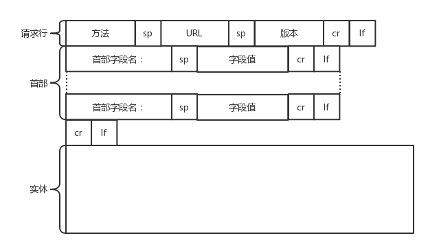

# HTTP

https://developer.mozilla.org/en-US/docs/Web/HTTP

HTTP协议(超文本传输协议HyperText Transfer Protocol)，它是<mark style="background: #BBFABBA6;">基于TCP协议</mark>的应用层传输协议，简单来说就是客户端和服务端进行数据传输的一种规则。客户端通过与服务器建立TCP连接，之后发送HTTP请求与接收HTTP响应都是通过访问Socket接口来调用TCP协议实现。

`HTTP` 是一种<mark style="background: #BBFABBA6;">**无状态** (stateless) 协议</mark>, `HTTP`协议本身不会对发送过的请求和相应的通信状态进行持久化处理。这样做的目的是为了保持HTTP协议的简单性，从而能够快速处理大量的事务, 提高效率。

HTTP： Hypertext transfer protocol. 超文本传输协议。<mark style="background: #BBFABBA6;">为了使超文本的链接能够高效率地完成，需要用 HTTP 协议来传送一切必须的信息</mark>。从层次的角度看，HTTP 是面向事务的(transaction-oriented)应用层协议，它是万维网上能够可靠地交换文件（包括文本、声音、图像等各种多媒体文件）的重要基础。 

## HTTP特点

**HTTP 的主要特点**：
* HTTP 是面向事务的客户服务器协议。**HTTP 1.0** 协议是无状态的\(stateless\)。HTTP 协议本身也是无连接的，虽然它使用了面向连接的 TCP 向上提供的服务。
* 请求一个万维网文档所需的时间
* 持续连接\(persistent connection\)
  * HTTP/1.1 协议使用持续连接。万维网服务器在发送响应后仍然在一段时间内保持这条连接，使同一个客户（浏览器）和该服务器可以继续在这条连接上传送后续的 HTTP 请求报文和响应报文。这并不局限于传送同一个页面上链接的文档，而是只要这些文档都在同一个服务器上就行。**目前一些流行的浏览器（例如，IE 6.0）的默认设置就是使用 HTTP/1.1**。
  * 持续连接的两种工作方式
    * 非流水线方式：客户在收到前一个响应后才能发出下一个请求。这比非持续连接的两倍 RTT 的开销节省了建立 TCP 连接所需的一个 RTT 时间。但服务器在发送完一个对象后，其 TCP 连接就处于空闲状态，浪费了服务器资源。
    * 流水线方式：客户在收到 HTTP 的响应报文之前就能够接着发送新的请求报文。一个接一个的请求报文到达服务器后，服务器就可连续发回响应报文。使用流水线方式时，客户访问所有的对象只需花费一个 RTT时间，使 TCP 连接中的空闲时间减少，提高了下载文档效率。


## HTTP 的操作过程
* HTTP请求的准备
	1. 用户在浏览器输入URL: www.tsinghua.edu.cn 并回车，
	2. 浏览器分析超链指向页面的URL。
	3. 浏览器向 DNS服务器 请求解析[www.tsinghua.edu.cn](www.tsinghua.edu.cn)的 IP 地址。
	4. 域名系统 DNS 解析出清华大学服务器的 IP 地址。
	5. HTTP是基于TCP协议的，浏览器与服务器先建立 TCP 连接(三次握手)。目前使用的HTTP协议大部分都是1.1。在1.1的协议里面，默认是开启了Keep-Alive的，这样建立的TCP连接，就可以在多次请求中复用。
* HTTP请求的构建
	* 建立了连接以后，浏览器就要发送HTTP的请求(取文件命令的**HTTP请求**：`GET /chn/yxsz/index.htm`)。请求的格式见HTTP的报文结构。
* HTTP请求的发送: 
	* 浏览器把构建的HTTP报文交给传输层。怎么交给传输层呢？其实也无非是用Socket这些东西，只不过用的浏览器里，这些程序不需要你自己写，有人已经帮你写好了。
	* HTTP协议是基于TCP协议的，所以它使用面向连接的方式发送请求，通过stream二进制流的方式传给对方。当然，到了TCP层，它会把二进制流变成一个的报文段发送给服务器。
	* 在发送给每个报文段的时候，都需要对方有一个回应ACK，来保证报文可靠地到达了对方。如果没有回应，那么TCP这一层会进行重新传输，直到可以到达。同一个包有可能被传了好多次，但是HTTP这一层不需要知道这一点，因为是TCP这一层在埋头苦干。
	* TCP层发送每一个报文的时候，都需要加上自己的地址（即源地址）和它想要去的地方（即目标地址），将这两个信息放到IP头里面，交给IP层进行传输。
	* IP层需要查看目标地址和自己是否是在同一个局域网。如果是，就发送ARP协议来请求这个目标地址对应的MAC地址，然后将源MAC和目标MAC放入MAC头，发送出去即可；如果不在同一个局域网，就需要发送到网关，还要需要发送ARP协议，来获取网关的MAC地址，然后将源MAC和网关MAC放入MAC头，发送出去。
	* 网关收到包发现MAC符合，取出目标IP地址，根据路由协议找到下一跳的路由器，获取下一跳路由器的MAC地址，将包发给下一跳路由器。
	* 这样路由器一跳一跳终于到达目标的局域网。这个时候，最后一跳的路由器能够发现，目标地址就在自己的某一个出口的局域网上。于是，在这个局域网上发送ARP，获得这个目标地址的MAC地址，将包发出去。
	* 目标的机器发现MAC地址符合，就将包收起来；发现IP地址符合，根据IP头中协议项，知道自己上一层是TCP协议，于是解析TCP的头，里面有序列号，需要看一看这个序列包是不是我要的，如果是就放入缓存中然后返回一个ACK，如果不是就丢弃。
	* TCP头里面还有端口号，HTTP的服务器正在监听这个端口号。于是，目标机器自然知道是HTTP服务器这个进程想要这个包，于是将包发给HTTP服务器。HTTP服务器的进程看到，原来这个请求是要访问一个网页，于是就把这个网页发给客户端。
* HTTP返回的构建
	* 服务器使用HTTP响应报文格式构建返回的HTTP报文
* HTTP返回的发送
	* 服务器交给socket去发给TCP层让TCP层将返回的HTML，也分成一个个小的段，并且保证每个段都可靠到达。这些段加上TCP头后会交给IP层，然后把刚才的发送过程反向走一遍。虽然两次不一定走相同的路径，但是逻辑过程是一样的，一直到达客户端。
	* 客户端发现MAC地址符合、IP地址符合，于是就会交给TCP层。根据序列号看是不是自己要的报文段，如果是，则会根据TCP头中的端口号，发给相应的进程。这个进程就是浏览器，浏览器作为客户端也在监听某个端口。
	* 当浏览器拿到了HTTP的报文。发现返回“200”，一切正常，于是就从正文中将HTML拿出来。HTML是一个标准的网页格式。浏览器只要根据这个格式，展示出一个绚丽多彩的网页。
	* 这就是一个正常的HTTP请求和返回的完整过程。


* 服务器给出响应，把文件 index.htm 发给浏览器。
* TCP 连接释放。
* 浏览器显示“清华大学院系设置”文件 index.htm 中的所有文本。


## HTTP 的报文结构

由于 HTTP 是面向正文的\(text-oriented\)，因此在报文中的每一个字段都是一些 ASCII 码串，因而每个字段的长度都是不确定的。

HTTP 有两类报文：
* 请求报文——从客户向服务器发送请求报文。
* 响应报文——从服务器到客户的回答。
报文由三个部分组成，即**开始行**、**首部**行和**正文实体**。


请求报文：
1. 开始行：在**请求报文**中，开始行就是**请求行**。
	* URL: 所请求的资源的 URL http://www.163.com ，
	* 版本: HTTP 的版本，HTTP 1.1
	* 方法：方法有几种类型。所谓“方法”就是对所请求的对象进行的操作，因此这些方法实际上也就是一些命令。因此，请求报文的类型是由它所采用的方法决定的。
		* **GET**：对于访问网页来讲，最常用的类型就是**GET**。顾名思义，GET就是去服务器获取一些资源。对于访问网页来讲，要获取的资源往往是一个页面。其实也有很多其他的格式，比如说返回一个JSON字符串，到底要返回什么，是由服务器端的实现决定的。例如，在云计算中，如果我们的服务器端要提供一个基于HTTP协议的API，获取所有云主机的列表，这就会使用GET方法得到，返回的可能是一个JSON字符串。字符串里面是一个列表，列表里面是一项的云主机的信息。
		* **POST**：另外一种类型叫做**POST**。它需要主动告诉服务端一些信息，而非获取。要告诉服务端什么呢？一般会放在正文里面。正文可以有各种各样的格式。常见的格式也是**JSON**。例如，我们下一节要讲的支付场景，客户端就需要把“我是谁？我要支付多少？我要买啥？”告诉服务器，这就需要通过POST方法。再如，在云计算里，如果我们的服务器端，要提供一个基于HTTP协议的创建云主机的API，也会用到POST方法。这个时候往往需要将“我要创建多大的云主机？多少CPU多少内存？多大硬盘？”这些信息放在JSON字符串里面，通过POST的方法告诉服务器端。
		* **PUT**：还有一种类型叫**PUT**，就是向指定资源位置上传最新内容。但是，HTTP的服务器往往是不允许上传文件的，所以PUT和POST就都变成了要传给服务器东西的方法。在实际使用过程中，这两者还会有稍许的区别。**POST往往是用来创建一个资源的，而PUT往往是用来修改一个资源的**。例如，云主机已经创建好了，我想对这个云主机打一个标签，说明这个云主机是生产环境的，另外一个云主机是测试环境的。那怎么修改这个标签呢？往往就是用PUT方法。
		* **DELETE**：再有一种常见的就是**DELETE**。这个顾名思义就是用来删除资源的。例如，我们要删除一个云主机，就会调用DELETE方法。
2. 首部行：
	* 首部字段： 首部是**key value**，通过冒号分隔。这里面，往往保存了一些非常重要的字段。例如，
		* **Accept-Charset**：表示**客户端可以接受的字符集**。防止传过来的是另外的字符集，从而导致出现乱码。
		* **Content-Type**：指**正文的格式**。例如，我们进行POST的请求，如果正文是**JSON**，那么我们就应该将这个值设置为JSON。
		* **Cache-control**：是用来**控制缓存**的。当客户端发送的请求中包含max-age指令时，如果判定缓存层中，资源的缓存时间数值比指定时间的数值小，那么客户端可以接受缓存的资源；当指定max-age值为0，那么缓存层通常需要将请求转发给应用集群。
		* **If-Modified-Since**：也是一个关于缓存的。也就是说，如果服务器的资源在某个时间之后更新了，那么客户端就应该下载最新的资源；如果没有更新，服务端会返回“304 Not Modified”的响应，那客户端就不用下载了，也会节省带宽。


这里需要重点说一下的就是**缓存**。为啥要使用缓存呢？那是因为一个非常大的页面有很多东西。例如，我浏览一个商品的详情，里面有这个商品的价格、库存、展示图片、使用手册等等。商品的展示图片会保持较长时间不变，而库存会根据用户购买的情况经常改变。如果图片非常大，而库存数非常小，如果我们每次要更新数据的时候都要刷新整个页面，对于服务器的压力就会很大。

对于这种高并发场景下的系统，在真正的业务逻辑之前，都需要有个接入层，将这些静态资源的请求拦在最外面。

这个架构的图就像这样。


其中DNS、CDN我在后面的章节会讲。和这一节关系比较大的就是Nginx这一层，它如何处理HTTP协议呢？对于静态资源，有Vanish缓存层。当缓存过期的时候，才会访问真正的Tomcat应用集群。

----


响应报文：
1. 状态行：**响应报文**的开始行是**状态行**。状态行包括三项内容，即 HTTP 的版本，状态码，以及解释状态码的简单短语。
	* 状态码：都是三位数字。状态码会反应HTTP请求的结果
		* 1xx 表示通知信息的，如请求收到了或正在进行处理。
		* 2xx 表示成功，如接受或知道了。
		* 3xx 表示重定向，表示要完成请求还必须采取进一步的行动。
		* 4xx 表示客户的差错，如请求中有错误的语法或不能完成。
			* 404: 服务端无法响应这个请求
		* 5xx 表示服务器的差错，如服务器失效无法完成请求。
			* 502
			* 503
1. 首部：首部是**key value**格式
	* 首部字段：
		* **Retry-After**：表示告诉客户端应该在多长时间以后再次尝试一下。“503错误”是说“服务暂时不再和这个值配合使用”。
		  * **Content-Type**，表示返回的是HTML，还是JSON。

状态码：https://developer.mozilla.org/zh-CN/docs/Web/HTTP/Status

## HTTP 2.0

**HTTP 2.0通过头压缩、分帧、二进制编码、多路复用等技术提升性能**

QUIC, a multiplexed transport over UDP：https://www.chromium.org/quic/

当然HTTP协议也在不断地进化过程中，在HTTP1.1基础上便有了HTTP 2.0。

HTTP 1.1在应用层以**纯文本**的形式进行通信。每次通信都要带完整的HTTP的头，而且不考虑http pipeline模式的话，每次的过程总是像上面描述的那样一去一回。这样在实时性、并发性上都存在问题。

为了解决这些问题，HTTP 2.0会**对HTTP的头进行一定的压缩**，将原来每次都要携带的大量key value在两端建立一个索引表，对相同的头只发送索引表中的索引。

另外，HTTP 2.0协议将一个TCP的连接中，**切分成多个流**，每个流都有自己的ID，而且流可以是客户端发往服务端，也可以是服务端发往客户端。它其实只是一个虚拟的通道。流是有优先级的。

HTTP 2.0还将所有的传输信息分割为**更小的消息和帧**，并对它们采用二进制格式编码。常见的帧有**Header帧**，用于传输Header内容，并且会开启一个新的流。再就是**Data帧**，用来传输正文实体。多个Data帧属于同一个流。

通过这两种机制，HTTP 2.0的客户端可以**将多个请求分到不同的流中**，然后将请求内容拆成帧，进行二进制传输。这些帧可以打散乱序发送， 然后根据每个帧首部的流标识符重新组装，并且可以根据优先级，决定优先处理哪个流的数据。

我们来举一个例子。

假设我们的一个页面要发送三个独立的请求，一个获取css，一个获取js，一个获取图片jpg。如果使用HTTP 1.1就是串行的，但是如果使用HTTP 2.0，就可以在一个连接里，客户端和服务端都可以同时发送多个请求或回应，而且不用按照顺序一对一对应。


HTTP 2.0其实是将三个请求变成三个流，将数据分成帧，乱序发送到一个TCP连接中。


HTTP 2.0成功解决了HTTP 1.1的**队首阻塞问题**，同时，也不需要通过HTTP 1.x的pipeline机制用多条TCP连接来实现并行请求与响应；减少了TCP连接数对服务器性能的影响，同时将页面的多个数据css、js、 jpg等通过一个数据链接进行传输，能够加快页面组件的传输速度。

## QUIC协议

**QUIC协议通过基于UDP自定义的类似TCP的连接、重试、多路复用、流量控制技术，进一步提升性能。**

HTTP 2.0虽然大大增加了并发性，但还是有问题的。因为HTTP 2.0也是基于TCP协议的，**TCP协议在处理包时是有严格顺序的。**

当其中一个数据包遇到问题，TCP连接需要等待这个包完成重传之后才能继续进行。虽然HTTP 2.0通过多个stream，使得逻辑上一个TCP连接上的并行内容，进行多路数据的传输，然而这中间并没有关联的数据。一前一后，前面stream 2的帧没有收到，后面stream 1的帧也会因此阻塞。

于是，就又到了从TCP切换到UDP，进行“城会玩”的时候了。这就是Google的QUIC协议，接下来我们来看它是如何“城会玩”的。

### 机制一：自定义连接机制

我们都知道，一条TCP连接是由四元组标识的，分别是源 IP、源端口、目的 IP、目的端口。一旦一个元素发生变化时，就需要断开重连，重新连接。在移动互联情况下，当手机信号不稳定或者在WIFI和 移动网络切换时，都会导致重连，从而进行再次的三次握手，导致一定的时延。

这在TCP是没有办法的，但是基于UDP，就可以在QUIC自己的逻辑里面维护连接的机制，不再以四元组标识，而是**以一个64位的随机数作为ID来标识**，而且UDP是无连接的，所以当IP或者端口变化的时候，**只要ID不变，就不需要重新建立连接**。

### 机制二：自定义重传机制

前面我们讲过，TCP为了保证可靠性，通过使用**序号**和**应答**机制，来解决顺序问题和丢包问题。

任何一个序号的包发过去，都要在一定的时间内得到应答，否则一旦超时，就会重发这个序号的包。那怎么样才算超时呢？还记得我们提过的**自适应重传算法**吗？这个超时是通过**采样往返时间RTT**不断调整的。

其实，**在TCP里面超时的采样存在不准确的问题**。例如，发送一个包，序号为100，发现没有返回，于是再发送一个100，过一阵返回一个ACK101。这个时候客户端知道这个包肯定收到了，但是往返时间是多少呢？是ACK到达的时间减去后一个100发送的时间，还是减去前一个100发送的时间呢？事实是，第一种算法把时间算短了，第二种算法把时间算长了。

QUIC也有个序列号，是递增的。任何一个序列号的包只发送一次，下次就要加一了。例如，发送一个包，序号是100，发现没有返回；再次发送的时候，序号就是101了；如果返回的ACK 100，就是对第一个包的响应。如果返回ACK 101就是对第二个包的响应，RTT计算相对准确。

但是这里有一个问题，就是怎么知道包100和包101发送的是同样的内容呢？QUIC定义了一个offset概念。**QUIC既然是面向连接的**，也就像TCP一样，是一个数据流，发送的数据在这个数据流里面有个**偏移量offset**，可以通过offset查看数据发送到了哪里，这样只要这个offset的包没有来，就要重发；如果来了，按照offset拼接，还是能够拼成一个流。


### 机制三：无阻塞的多路复用

有了自定义的连接和重传机制，我们就可以**解决上面HTTP 2.0的多路复用问题**。

同HTTP 2.0一样，同一条QUIC连接上可以创建多个stream，来发送多个 HTTP 请求。但是，QUIC是基于UDP的，一个连接上的多个stream之间没有依赖。这样，假如stream2丢了一个UDP包，后面跟着stream3的一个UDP包，虽然stream2的那个包需要重传，但是stream3的包无需等待，就可以发给用户。

### 机制四：自定义流量控制

TCP的流量控制是通过**滑动窗口协议**。QUIC的流量控制也是通过window_update，来告诉对端它可以接受的字节数。但是QUIC的窗口是适应自己的多路复用机制的，不但在一个连接上控制窗口，还在一个连接中的每个stream控制窗口。

还记得吗？在TCP协议中，接收端的窗口的起始点是下一个要接收并且ACK的包，即便后来的包都到了，放在缓存里面，窗口也不能右移，因为TCP的ACK机制是基于序列号的累计应答，一旦ACK了一个系列号，就说明前面的都到了，所以只要前面的没到，后面的到了也不能ACK，就会导致后面的到了，也有可能超时重传，浪费带宽。

QUIC的ACK是基于offset的，每个offset的包来了，进了缓存，就可以应答，应答后就不会重发，中间的空挡会等待到来或者重发即可，而窗口的起始位置为当前收到的最大offset，从这个offset到当前的stream所能容纳的最大缓存，是真正的窗口大小。显然，这样更加准确。


另外，还有整个连接的窗口，需要对于所有的stream的窗口做一个统计。


2. 在服务器上存放用户的信息

万维网站点使用 Cookie 来跟踪用户。Cookie 表示在 HTTP 服务器和客户之间传递的状态信息。使用 Cookie 的网站服务器为用户产生一个唯一的识别码。利用此识别码，网站就能够跟踪该用户在该网站的活动。


# Cookie

`HTTP` 是一种**无状态** (stateless) 协议, `HTTP`协议本身不会对发送过的请求和相应的通信状态进行持久化处理。这样做的目的是为了保持HTTP协议的简单性，从而能够快速处理大量的事务, 提高效率。

然而，在许多应用场景中，我们需要保持用户登录的状态或记录用户购物车中的商品。由于`HTTP`是无状态协议，所以必须引入一些技术来记录管理状态，例如`Cookie`。


## 万维网的文档HTML

1. 超文本标记语言 HTML

超文本标记语言 HTML 中的 Markup 的意思就是“设置标记”。HTML 定义了许多用于排版的命令（即标签）。HTML 把各种标签嵌入到万维网的页面中。这样就构成了所谓的 HTML 文档。HTML 文档是一种可以用任何文本编辑器创建的 ASCII 码文件。

HTML 文档

仅当 HTML 文档是以.html 或 .htm 为后缀时，浏览器才对此 文档的各种标签进行解释。如 HTML 文档改换以 .txt 为其后缀，则 HTML 解释程序就不对标签进行解释，而浏览器只能看见原来的文本文件。当浏览器从服务器读取 HTML 文档后，就按照 HTML 文档中的各种标签，根据浏览器所使用的显示器的尺寸和分辨率大小，重新进行排版并恢复出所读取的页面。


HTML 文档中标签的用法


两种不同的链接

远程链接：超链的终点是其他网点上的页面。本地链接：超链指向本计算机中的某个文件。

1. 动态万维网文档

静态文档是指该文档创作完毕后就存放在万维网服务器中，在被用户浏览的过程中，内容不会改变。动态文档是指文档的内容是在浏览器访问万维网服务器时才由应用程序动态创建。动态文档和静态文档之间的主要差别体现在服务器一端。这主要是文档内容的生成方法不同。而从浏览器的角度看，这两种文档并没有区别。

万维网服务器功能的扩充

\(1\) 应增加另一个应用程序，用来处理浏览器发来的数据，并创建动态文档。\(2\) 应增加一个机制，用来使万维网服务器把浏览器发来的数据传送给这个应用程序，然后万维网服务器能够解释这个应用程序的输出，并向浏览器返回 HTML 文档。


扩充了功能的万维网服务器


通用网关接口 CGI\(Common Gateway Interface\)

CGI 是一种标准，它定义了动态文档应如何创建，输入数据应如何提供给应用程序，以及输出结果应如何使用。万维网服务器与 CGI 的通信遵循 CGI 标准。“通用”：CGI 标准所定义的规则对其他任何语言都是通用的。“网关”：CGI 程序的作用像网关。“接口”：有一些已定义好的变量和调用等可供其他 CGI 程序使用。


CGI 程序

CGI 程序的正式名字是 CGI 脚本\(script\)。“脚本”指的是一个程序，它被另一个程序（解释程序）而不是计算机的处理机来解释或执行。脚本运行起来要比一般的编译程序要慢，因为它的每一条指令先要被另一个程序来处理（这就要一些附加的指令），而不是直接被指令处理器来处理。


1. 活动万维网文档

活动文档\(active document\)技术把所有的工作都转移给浏览器端。每当浏览器请求一个活动文档时，服务器就返回一段程序副本在浏览器端运行。活动文档程序可与用户直接交互，并可连续地改变屏幕的显示。由于活动文档技术不需要服务器的连续更新传送，对网络带宽的要求也不会太高。

活动文档在客户端创建


用 Java 技术创建活动文档

由美国 Sun 公司开发的 Java 语言是一项用于创建和运行活动文档的技术。在 Java 技术中使用 “小应用程序”\(applet\)来描述活动文档程序。用户从万维网服务器下载嵌入了 Java 小应用程序的 HTML 文档后，可在浏览器的屏幕上点击某个图像，就可看到动画效果，或在下拉式菜单中点击某个项目，就可看到计算结果。Java 技术是活动文档技术的一部分。


Java 技术装三个主要组成部分

\(1\) 程序设计语言。Java 包含一个新的程序设计语言，用来编写传统的计算机程序和 Java 小应用程序。\(2\) 运行\(runtime\)环境。这是运行 Java 程序所必须的运行环境，其中包括 Java 虚拟机（简称为 JVM），该软件定义了 Java 二进制代码的执行模型。\(3\) 类库\(class library\)。为了更容易编写 Java 小应用程序，Java 提供了强大的类库支持。


Java

Java 是一种面向对象的高级语言，从 C++ 派生出来的，它省略了 C++ 很多复杂的、很少用的语言特点。Java 的每一个数据项都有一个确定的类型。对数据的操作严格按照该数据的类型来进行。Java 的编译程序将源程序转换成 Java 字节码\(bytecode\)，这是一种与机器无关的二进制代码。计算机程序调用解释程序读取字节码，并解释执行。


计算机硬件无关

Java 语言、字节码以及 Java 运行系统都被设计成与计算机硬件无关。一旦形成了字节码，就可在任何计算机上运行并产生相同的输出。Java 小应用程序与机器无关可使在任何计算机上运行的浏览器程序能够下载并运行活动文档。可保证活动文档在所有的浏览器上产生同样的正确输出。可大大地降低活动文档的创建和测试费用，因为不必为每一种计算机都制作一个副本。


Java 解释程序

运行 Java 的浏览器需要有 HTML 解释程序和 Java 小应用程序解释程序。解释程序的核心是一个模仿计算机的简单循环。解释程序维持一个指令指针，在初始化时指在小应用程序的开始处。在每一次循环操作时，解释程序在指令指针指向的地址读取字节码。然后解释程序对字节码进行解码，并完成指明的操作。


1. 浏览器的结构


浏览器的主要组成部分

浏览器有一组客户、一组解释程序，以及管理这些客户和解释程序的控制程序。控制程序是其中的核心部件，它解释鼠标的点击和键盘的输入，并调用有关的组件来执行用户指定的操作。例如，当用户用鼠标点击一个超链的起点时，控制程序就调用一个客户从所需文档所在的远地服务器上取回该文档，并调用解释程序向用户显示该文档。


解释程序

HTML 解释程序是必不可少的，而其他的解释程序则是可选的。解释程序把 HTML 规格转换为适合用户显示硬件的命令来处理版面的细节。许多浏览器还包含 FTP 客户程序，用来获取文件传送服务。一些浏览器也包含电子邮件客户程序，使浏览器能够发送和接收电子邮件。


浏览器中的缓存

浏览器将它取回的每一个页面副本都放入本地磁盘的缓存中。当用户用鼠标点击某个选项时，浏览器首先检查磁盘的缓存。若缓存中保存了该项，浏览器就直接从缓存中得到该项副本而不必从网络获取，这样就明显地改善浏览器的运行特性。 。但缓存要占用磁盘大量的空间，而浏览器性能的改善只有在用户再次查看缓存中的页面时才有帮助。许多浏览器允许用户调整缓存策略。


# HTTPS

用HTTP协议，看个新闻还没有问题，但是换到更加严肃的场景中，就存在很多的安全风险。例如，你要下单做一次支付，如果还是使用普

通的HTTP协议，那你很可能会被黑客盯上。

你发送一个请求，说我要点个外卖，但是这个网络包被截获了，于是在服务器回复你之前，黑客先假装自己就是外卖网站，然后给你回复一个假的消息说：“好啊好啊，来来来，银行卡号、密码拿来。”如果这时候你真把银行卡密码发给它，那你就真的上套了。

那怎么解决这个问题呢？当然一般的思路就是**加密**。加密分为两种方式一种是**对称加密**，一种是**非对称加密**。

在对称加密算法中，加密和解密使用的密钥是相同的。也就是说，加密和解密使用的是同一个密钥。因此，对称加密算法要保证安全性的话，密钥要做好保密。只能让使用的人知道，不能对外公开。

在非对称加密算法中，加密使用的密钥和解密使用的密钥是不相同的。一把是作为公开的公钥，另一把是作为谁都不能给的私钥。公钥加密的信息，只有私钥才能解密。私钥加密的信息，只有公钥才能解密。

因为对称加密算法相比非对称加密算法来说，效率要高得多，性能也好，所以交互的场景下多用对称加密。

## 对称加密

假设你和外卖网站约定了一个密钥，你发送请求的时候用这个密钥进行加密，外卖网站用同样的密钥进行解密。这样就算中间的黑客截获了你的请求，但是它没有密钥，还是破解不了。

这看起来很完美，但是中间有个问题，你们两个怎么来约定这个密钥呢？如果这个密钥在互联网上传输，也是很有可能让黑客截获的。黑客一旦截获这个秘钥，它可以佯作不知，静静地等着你们两个交互。这时候你们之间互通的任何消息，它都能截获并且查看，就等你把银行卡账号和密码发出来。

我们在谍战剧里面经常看到这样的场景，就是特工破译的密码会有个密码本，截获无线电台，通过密码本就能将原文破解出来。怎么把密码本给对方呢？只能通过**线下传输**。

比如，你和外卖网站偷偷约定时间地点，它给你一个纸条，上面写着你们两个的密钥，然后说以后就用这个密钥在互联网上定外卖了。当然你们接头的时候，也会先约定一个口号，什么“天王盖地虎”之类的，口号对上了，才能把纸条给它。但是，“天王盖地虎”同样也是对称加密密钥，同样存在如何把“天王盖地虎”约定成口号的问题。而且在谍战剧中一对一接头可能还可以，在互联网应用中，客户太多，这样是不行的。

## 非对称加密

所以，只要是对称加密，就会永远在这个死循环里出不来，这个时候，就需要非对称加密介入进来。

非对称加密的私钥放在外卖网站这里，不会在互联网上传输，这样就能保证这个秘钥的私密性。但是，对应私钥的公钥，是可以在互联网上随意传播的，只要外卖网站把这个公钥给你，你们就可以愉快地互通了。

比如说你用公钥加密，说“我要定外卖”，黑客在中间就算截获了这个报文，因为它没有私钥也是解不开的，所以这个报文可以顺利到达外卖网站，外卖网站用私钥把这个报文解出来，然后回复，“那给我银行卡和支付密码吧”。

先别太乐观，这里还是有问题的。回复的这句话，是外卖网站拿私钥加密的，互联网上人人都可以把它打开，当然包括黑客。那外卖网站可以拿公钥加密吗？当然不能，因为它自己的私钥只有它自己知道，谁也解不开。

另外，这个过程还有一个问题，黑客也可以模拟发送“我要定外卖”这个过程的，因为它也有外卖网站的公钥。

为了解决这个问题，看来一对公钥私钥是不够的，客户端也需要有自己的公钥和私钥，并且客户端要把自己的公钥，给外卖网站。

这样，客户端给外卖网站发送的时候，用外卖网站的公钥加密。而外卖网站给客户端发送消息的时候，使用客户端的公钥。这样就算有黑客企图模拟客户端获取一些信息，或者半路截获回复信息，但是由于它没有私钥，这些信息它还是打不开。

## 数字证书

不对称加密也会有同样的问题，如何将不对称加密的公钥给对方呢？一种是放在一个公网的地址上，让对方下载；另一种就是在建立连接的时候，传给对方。

这两种方法有相同的问题，那就是，作为一个普通网民，你怎么鉴别别人给你的公钥是对的。会不会有人冒充外卖网站，发给你一个它的公钥。接下来，你和它所有的互通，看起来都是没有任何问题的。毕竟每个人都可以创建自己的公钥和私钥。

例如，我自己搭建了一个网站cliu8site，可以通过这个命令先创建私钥。

```
openssl genrsa -out cliu8siteprivate.key 1024
```

然后，再根据这个私钥，创建对应的公钥。

```
openssl rsa -in cliu8siteprivate.key -pubout -outcliu8sitepublic.pem
```

这个时候就需要权威部门的介入了，就像每个人都可以打印自己的简历，说自己是谁，但是有公安局盖章的，就只有户口本，这个才能证明你是你。这个由权威部门颁发的称为**证书**（**Certificate**）。

证书里面有什么呢？当然应该有**公钥**，这是最重要的；还有证书的**所有者**，就像户口本上有你的姓名和身份证号，说明这个户口本是你的；另外还有证书的**发布机构**和证书的**有效期**，这个有点像身份证上的机构是哪个区公安局，有效期到多少年。

这个证书是怎么生成的呢？会不会有人假冒权威机构颁发证书呢？就像有假身份证、假户口本一样。生成证书需要发起一个证书请求，然后将这个请求发给一个权威机构去认证，这个权威机构我们称为**CA**（ **Certificate Authority**）。

证书请求可以通过这个命令生成。

```
openssl req -key cliu8siteprivate.key -new -out cliu8sitecertificate.req
```

将这个请求发给权威机构，权威机构会给这个证书卡一个章，我们称为**签名算法。**问题又来了，那怎么签名才能保证是真的权威机构签名的呢？当然只有用只掌握在权威机构手里的东西签名了才行，这就是CA的私钥。

签名算法大概是这样工作的：一般是对信息做一个Hash计算，得到一个Hash值，这个过程是不可逆的，也就是说无法通过Hash值得出原来的信息内容。在把信息发送出去时，把这个Hash值加密后，作为一个签名和信息一起发出去。

权威机构给证书签名的命令是这样的。

```
openssl x509 -req -in cliu8sitecertificate.req -CA cacertificate.pem -CAkey caprivate.key -out cliu8sitecertificate.pem
```

这个命令会返回Signature ok，而cliu8sitecertificate.pem就是签过名的证书。CA用自己的私钥给外卖网站的公钥签名，就相当于给外卖网站背书，形成了外卖网站的证书。

我们来查看这个证书的内容。

```
openssl x509 -in cliu8sitecertificate.pem -noout -text 
```

这里面有个Issuer，也即证书是谁颁发的；Subject，就是证书颁发给谁；Validity是证书期限；Public-key是公钥内容；Signature Algorithm是签名算法。

这下好了，你不会从外卖网站上得到一个公钥，而是会得到一个证书，这个证书有个发布机构CA，你只要得到这个发布机构CA的公钥，去解密外卖网站证书的签名，如果解密成功了，Hash也对的上，就说明这个外卖网站的公钥没有啥问题。

你有没有发现，又有新问题了。要想验证证书，需要CA的公钥，问题是，你怎么确定CA的公钥就是对的呢？

所以，CA的公钥也需要更牛的CA给它签名，然后形成CA的证书。要想知道某个CA的证书是否可靠，要看CA的上级证书的公钥，能不能解开这个CA的签名。就像你不相信区公安局，可以打电话问市公安局，让市公安局确认区公安局的合法性。这样层层上去，直到全球皆知的几个著名大CA，称为**root CA**，做最后的背书。通过这种**层层授信背书**的方式，从而保证了非对称加密模式的正常运转。

除此之外，还有一种证书，称为**Self-Signed Certificate**，就是自己给自己签名。这个给人一种“我就是我，你爱信不信”的感觉。这里我就不多说了。

## HTTPS的工作模式

我们可以知道，非对称加密在性能上不如对称加密，那是否能将两者结合起来呢？例如，公钥私钥主要用于传输对称加密的秘钥，而真正的双方大数据量的通信都是通过对称加密进行的。

当然是可以的。这就是HTTPS协议的总体思路。


当你登录一个外卖网站的时候，由于是HTTPS，客户端会发送Client Hello消息到服务器，以明文传输TLS版本信息、加密套件候选列表、压缩算法候选列表等信息。另外，还会有一个随机数，在协商对称密钥的时候使用。

这就类似在说：“您好，我想定外卖，但你要保密我吃的是什么。这是我的加密套路，再给你个随机数，你留着。”

然后，外卖网站返回Server Hello消息, 告诉客户端，服务器选择使用的协议版本、加密套件、压缩算法等，还有一个随机数，用于后续的密钥协商。

这就类似在说：“您好，保密没问题，你的加密套路还挺多，咱们就按套路2来吧，我这里也有个随机数，你也留着。”

然后，外卖网站会给你一个服务器端的证书，然后说：“Server Hello Done，我这里就这些信息了。”

你当然不相信这个证书，于是你从自己信任的CA仓库中，拿CA的证书里面的公钥去解密外卖网站的证书。如果能够成功，则说明外卖网站是可信的。这个过程中，你可能会不断往上追溯CA、CA的CA、CA的CA的CA，反正直到一个授信的CA，就可以了。

证书验证完毕之后，觉得这个外卖网站可信，于是客户端计算产生随机数字Pre-master，发送Client Key Exchange，用证书中的公钥加密，再发送给服务器，服务器可以通过私钥解密出来。

到目前为止，无论是客户端还是服务器，都有了三个随机数，分别是：自己的、对端的，以及刚生成的Pre-Master随机数。通过这三个随机数，可以在客户端和服务器产生相同的对称密钥。

有了对称密钥，客户端就可以说：“Change Cipher Spec，咱们以后都采用协商的通信密钥和加密算法进行加密通信了。”

然后发送一个Encrypted Handshake Message，将已经商定好的参数等，采用协商密钥进行加密，发送给服务器用于数据与握手验证。

同样，服务器也可以发送Change Cipher Spec，说：“没问题，咱们以后都采用协商的通信密钥和加密算法进行加密通信了”，并且也发送Encrypted Handshake Message的消息试试。当双方握手结束之后，就可以通过对称密钥进行加密传输了。

这个过程除了加密解密之外，其他的过程和HTTP是一样的，过程也非常复杂。

上面的过程只包含了HTTPS的单向认证，也即客户端验证服务端的证书，是大部分的场景，也可以在更加严格安全要求的情况下，启用双向认证，双方互相验证证书。

## 重放与篡改

其实，这里还有一些没有解决的问题，例如重放和篡改的问题。

没错，有了加密和解密，黑客截获了包也打不开了，但是它可以发送N次。这个往往通过Timestamp和Nonce随机数联合起来，然后做一个不可逆的签名来保证。

Nonce随机数保证唯一，或者Timestamp和Nonce合起来保证唯一，同样的，请求只接受一次，于是服务器多次受到相同的Timestamp和Nonce，则视为无效即可。

如果有人想篡改Timestamp和Nonce，还有签名保证不可篡改性，如果改了用签名算法解出来，就对不上了，可以丢弃了。

## 小结

好了，这一节就到这里了，我们来总结一下。

- 加密分对称加密和非对称加密。对称加密效率高，但是解决不了密钥传输问题；非对称加密可以解决这个问题，但是效率不高。
- 非对称加密需要通过证书和权威机构来验证公钥的合法性。
- HTTPS是综合了对称加密和非对称加密算法的HTTP协议。既保证传输安全，也保证传输效率。

最后，给你留两个思考题：

1. HTTPS协议比较复杂，沟通过程太繁复，这样会导致效率问题，那你知道有哪些手段可以解决这些问题吗？
2. HTTP和HTTPS协议的正文部分传输个JSON什么的还好，如果播放视频，就有问题了，那这个时候，应该使用什么协议呢？


通过HTTPS访问的确复杂，至少经历四个阶段：DNS查询、TCP连接建立、TLS连接建立，最后才是HTTP发送数据。我们可以一项一项来优化这个过程。

首先如果使用基于UDP的QUIC，可以省略掉TCP的三次握手。至于TLS的建立，如果按文章中基于TLS 1.2的，双方要交换key，经过两个来回，也即两个RTT，才能完成握手。但是咱们讲IPSec的时候，讲过通过共享密钥、DH算法进行握手的场景。

在TLS 1.3中，握手过程中移除了ServerKeyExchange和ClientKeyExchange，DH参数可以通过key_share进行传输。这样只要一个来回，就可以搞定RTT了。

对于QUIC来讲，也可以这样做。当客户端首次发起QUIC连接时，会发送一个client hello消息，服务器会回复一个消息，里面包括server config，类似于TLS1.3中的key_share交换。当客户端获取到server config以后，就可以直接计算出密钥，发送应用数据了。


----

1.HTTPS的双向认证流程是什么样的？


2.随机数和premaster的含义是什么？


## 精选留言

- 

  万历十五年

  各大CA机构的公钥是默认安装在操作系统里的。所以不要安装来路不明的操作系统，否则相当于裸奔

  2018-06-22 20:52

  作者回复

  是的

  2018-06-22 23:07

- 

  monkay

  会不会存在浏览器第一次向外卖网站请求证书时就被黑客拦截了，然后黑客用自己服务器去权威机构请求正规的证书，然后发给用户，之后的交互，用户以为是跟外卖网站交互，其实背后是跟黑客的网站交互

  2018-06-21 07:03

- 

  沙亮亮

  https还是可以被抓包，可以讲下抓https包的原理

  2018-06-20 08:26

- 

  LEON

  这张SSL握手的图，真的棒！

  2018-06-20 08:30

  作者回复

  谢谢

  2018-06-20 13:25

- 

  郑一一

  新学到的一点，CA 证书的作用，是保证服务器的公钥的来历。其做法是对公钥进行哈希摘要算法，然后用 CA 私钥加密，伴随公钥一起发送出去。
  客户端收到后，用 CA 公钥解密，然后对公钥做哈希，比对哈希值是否一致来做到的。

  2018-06-29 23:47

- 

  飞龙在天

  老师你好：
  https协议中，客户端和服务端信息传输使用了对称加密，疑惑的是服务器端是怎样识别多个客户端的公钥呢？项目中并没有对此做特殊的处理，希望老师解惑o(^o^)o。

  2018-06-20 10:08

  作者回复

  会建立session

  2018-06-20 13:15

- 

  一步

  老师，可以补充一下https双向认证的流程图吗？

  2018-07-17 09:07

  作者回复

  好的，后期补充一下

  2018-07-17 10:01

- 

  烧饼

  这里两个 hello 信息都是用明文传输的，包括里面的随机数，真正加密传输的是 Pre-master 。就是说外界完全可以抓取这两个随机数，真正影响外界窃取对称密钥的是 Pre-master ，那是不是意味着其实这两个随机数作用不大，可以去掉？

  2018-06-29 08:51

  作者回复

  不是的，这几个都是计算对称密钥的材料

  2018-06-29 20:50

- 

  唐唐

  老师好，有个问题很疑惑，想请教一下。这个https是浏览器和服务器端的交互吧。那么这个证书对应安装到用户的浏览器了吗？服务器端怎么能知道用户安装的是什么证书，拿到该证书对应的公钥或私钥呢？浏览器是安装一个证书，还是对应不同服务器安装多个不同证书。

  2018-06-20 09:39

  作者回复

  证书会下载到浏览器本地，服务端不管，如果证书不对就验证失败

  2018-06-20 13:20

- 

  Michael

  看了好几遍，感觉算是明白 https 非对称加密通信的过程了，总结一下，大家看看是不是这样的：

  首先，服务端需要向证书颁发机构申请一个自己的证书，这个证书里面会包含此该站点的基本信息，个人啊，公司啊，组织什么呢，我记得CA证书好像分三类的，然后还有该证书的 签名 以及 hash 值用于在通信中客户端鉴别此证书是否合法。

  https 通信分为四个步骤：

  \1. c->s,客户端发起加密通信请求，这个请求通常叫做 ClientHello请求，告知自己支持的协议版本号，加密算法，压缩算法，以及一个用于生成后续通信密钥的随机数；
  \2. s->c,服务端响应，也叫作 ServerHello，确认加密通信协议，加密算法，以及一个用于生成后续通信密钥的随机数，还有网站证书；
  \3. c->s,客户端在收到上一步服务端的响应之后，首先会检查证书的颁发者是否可信任，是否过期，域名是否一致，并且从操作系统的证书链中找出该证书的上一级证书，并拿出服务端证书的公钥，然后验证签名和hash，如果验证失败，就会显示警告，我们经常在Chrome里面看到，“此网站有风险，是否继续什么的”。如果验证通过，客户端会向服务端发送一个称作 “pre-master-key” 的随机数，该随机数使用证书的公钥加密，以及编码改变通知（以后咋们就用协商的密钥堆成加密通信了），客户端完成握手。
  \4. 服务端在收到上一步客户端请求之后，也会确认我以后发给你的信息可就加密了哦，并且完成握手。

  此时，客户端有第一步自己生成的随机数，第二步收到服务端的随机数，第三步的 pre-master-key，服务端也是如此，他们就可以用这三个随机数使用约定的算法生成同一个密钥来加密以后的通信数据了。

  

  2018-12-11 13:50

- 

  无形

  之前的还能懂，这节好复杂，看懵了

  2018-09-24 21:24

- 

  shupian418

  https是要解决http中的问题：
  1 明文传输，很容易被窃听
  2 没有验证数据的完整性，容易被篡改
  3 没有验证对端的身份，容易被伪装

  2018-09-20 17:52

- 

  李简单

  证书解密后，hash怎么算对上了呢？

  2018-08-08 13:54

- 

  陈卓

  老师你好，我之前听说获取CA证书都是需要给钱的，这边怎么一条命令就能获取一个证书啊？望解惑，谢谢

  2018-07-17 22:17

  作者回复

  我自己做ca当然可以啊，只不过拿出去不算

  2018-07-18 12:19

- 

  Jaime

  https做请求缓存，来提高效率?视频要用udp协议，

  2018-07-14 18:56

- 

  洪宇舟

  刘老师，请问文章里面证书请求的命令行里面为什么是私钥呢？CA应该是对公钥做签名吧

  2018-06-23 10:45

  作者回复

  证书里面主要是公钥

  2018-06-23 18:28

- 

  Michael

  还有一个问题，最后的对称加密密钥是怎么算出来的，客护端和服务端最终协商后会选择一个加密算法，这个加密算法通常有哪些？

  2018-12-11 17:28

- 

  🌀🐑hfy🐣

  老师，请问https哪部分是对称加密？哪部分是非对称加密？

  2018-12-04 17:23

- 

  剧终

  老师的课讲的很不错，通俗易懂，如久旱逢甘雨，让我拨云见日，茅塞顿开，期待老师其他课程。

  2018-12-04 09:58

- 

  回家

  HTTPS是使用非对称加密来传输对称加密的秘钥。有些问题请教下，客户端和服务端在发送 change cipher spec 的时候使用的仍然是非对称加密的公私钥对吗？另外，服务端发给客户端的证书对客户端来说是非对称加密的公钥，对CA来说，其实是自己的私钥是吧？

  2018-11-29 09:39


## 5.2.1 WWW
WWW: (World Wide Web), 万维网。 并非某种特殊的计算机网络。万维网是一个大规模的、联机式的信息储藏所。万维网用链接的方法能非常方便地从因特网上的一个站点访问另一个站点，从而主动地按需获取丰富的信息。这种访问方式称为“**链接(超链)**”。万维网提供分布式服务，把大量信息分布在整个因特网上。由于万维网的出现，使因特网从仅由少数计算机专家使用变为普通百姓也能用的信息资源。是因特网发展的一个重要里程碑。

超媒体与超文本：万维网是分布式**超媒体**(hypermedia)系统，它是**超文本**(hypertext)系统的扩充。一个超文本由多个信息源链接成。利用一个链接可使用户找到另一个文档。这些文档可以位于世界上任何一个接在因特网上的超文本系统中。超文本是万维网的基础。超媒体与超文本的区别是文档内容不同。超文本文档仅包含文本信息，而超媒体文档还包含其他表示方式的信息，如图形、图像、声音、动画，甚至活动视频图像。

**万维网的工作方式**：万维网以客户服务器方式工作。**浏览器**就是在用户计算机上的**万维网客户程序**。万维网文档所驻留的计算机则运行**服务器程序**，因此这个计算机也称为万维网服务器。客户程序向服务器程序发出请求，服务器程序向客户程序送回客户所要的万维网文档。在一个客户程序主窗口上显示出的万维网文档称为页面(page)。
* 客户端程序实现：浏览器 chrome, firefox, Microsoft Edge, Safari
* 服务器端程序实现：web服务器 Apache Tomcat, Nginx, IIS

万维网必须解决的问题：
* (1) 怎样标志分布在整个因特网上的万维网文档？使用统一资源定位符 URL \(Uniform Resource Locator)来标志万维网上的各种文档。使每一个文档在整个因特网的范围内具有唯一的标识符 URL。
* (2) 用何协议实现万维网上各种超链的链接？在万维网客户程序与万维网服务器程序之间进行交互所使用的协议，是超文本传送协议 HTTP (HyperText Transfer Protocol)。HTTP 是一个应用层协议，它使用 TCP 连接进行可靠的传送。
* \(3\) 怎样使各种万维网文档都能在因特网上的各种计算机上显示出来，同时使用户清楚地知道在什么地方存在着超链？超文本标记语言 HTML \(HyperText Markup Language)使得万维网页面的设计者可以很方便地用一个超链从本页面的某处链接到因特网上的任何一个万维网页面，并且能够在自己的计算机屏幕上将这些页面显示出来。
* \(4\) 怎样使用户能够很方便地找到所需的信息？为了在万维网上方便地查找信息，用户可使用各种的搜索工具（即搜索引擎）。

**WWW的组成结构**：
* a)   统一资源标识符（URI）
* b)   超文本传输协议（HTTP）
* c)   超文本标记语言（HTML）

WWW应用：
* 看新闻

**万维网的工作过程**：例如看新闻
1. 用户在浏览器输入URL： www.tsinghua.edu.cn 并回车，
2. 浏览器分析超链指向页面的URL。
* (2\) 浏览器向 DNS服务器 请求解析[www.tsinghua.edu.cn](www.tsinghua.edu.cn)的 IP 地址。
* \(3\) 域名系统 DNS 解析出清华大学服务器的 IP 地址。
* \(4\) 浏览器与服务器建立 TCP 连接(三次握手)。目前使用的HTTP协议大部分都是1.1。在1.1的协议里面，默认是开启了Keep-Alive的，这样建立的TCP连接，就可以在多次请求中复用。
* \(5\) 浏览器**发送**取文件命令的**HTTP请求**：`GET /chn/yxsz/index.htm`  HTTP请求构建，请求格式
* \(6\) 服务器给出响应，把文件 index.htm 发给浏览器。
* \(7\) TCP 连接释放。
* \(8\) 浏览器显示“清华大学院系设置”文件 index.htm 中的所有文本。


万维网的信息检索系统

1. 全文检索搜索和分类目录搜索

在万维网中用来进行搜索的程序叫做搜索引擎。

全文检索搜索引擎是一种纯技术型的检索工具。它的工作原理是通过搜索软件到因特网上的各网站收集信息，找到一个网站后可以从这个网站再链接到另一个网站。然后按照一定的规则建立一个很大的在线数据库供用户查询。用户在查询时只要输入关键词，就从已经建立的索引数据库上进行查询（并不是实时地在因特网上检索到的信息）。

分类目录搜索：分类目录搜索引擎并不采集网站的任何信息，而是利用各网站向搜索引擎提交的网站信息时填写的关键词和网站描述等信息，经过人工审核编辑后，如果认为符合网站登录的条件，则输入到分类目录的数据库中，供网上用户查询。分类目录搜索也叫做分类网站搜索。

一些著名的搜索引擎

* 最著名的全文检索搜索引擎：[Google 谷歌 ](www.google.com)    [百度](www.baidu.com)
* 最著名的分类目录搜索引擎： [雅虎](www.yahoo.com)  [雅虎中国](cn.yahoo.com)  [新浪](www.sina.com) [搜狐](www.sohu.com) [网易](www.163.com)

垂直搜索引擎\(Vertical Search Engine\)：针对某一特定领域、特定人群或某一特定需求提供搜索服务。垂直搜索也是提供关键字来进行搜索的，但被放到了一个行业知识的上下文中，返回的结果更倾向于信息、消息、条目等。


### 代理服务器\(proxy server\)

代理服务器\(proxy server\)又称为万维网高速缓存\(Web cache\)，它代表浏览器发出 HTTP 请求。万维网高速缓存把最近的一些请求和响应暂存在本地磁盘中。当与暂时存放的请求相同的新请求到达时，万维网高速缓存就把暂存的响应发送出去，而不需要按 URL 的地址再去因特网访问该资源。

使用高速缓存可减少访问因特网服务器的时延

使用高速缓存的情况

\(1\) 浏览器访问因特网的服务器时，要先与校园网的高速缓存建立 TCP 连接，并向高速缓存发出 HTTP 请求报文 \]

\(2\) 若高速缓存已经存放了所请求的对象，则将此对象放入 HTTP 响应报文中返回给浏览器。

\(3\) 否则，高速缓存就代表发出请求的用户浏览器，与因特网上的源点服务器建立 TCP 连接，并发送 HTTP 请求报文。

\(4\) 源点服务器将所请求的对象放在 HTTP 响应报文中返回给校园网的高速缓存。

\(5\) 高速缓存收到此对象后，先复制在其本地存储器中（为今后使用），然后再将该对象放在 HTTP 响应报文中，通过已建立的 TCP 连接，返回给请求该对象的浏览器。

## 5.2.2 URL
URL: 统一资源定位符 
**统一资源定位符** URL 是对可以从因特网上得到的资源的位置和访问方法的一种简洁的表示。URL 给资源的位置提供一种抽象的识别方法，并用这种方法给资源定位。只要能够对资源定位，系统就可以对资源进行各种操作，如存取、更新、替换和查找其属性。**URL 相当于一个文件名在网络范围的扩展**。因此 **URL 是与因特网相连的机器上的任何可访问对象的一个指针**。正是因为这个东西是统一的，所以当你把这样一个字符串输入到浏览器的框里的时候，浏览器才知道如何进行统一处理。

URL 的**格式**：由以冒号隔开的两大部分组成，并且在 URL 中的字符对大写或小写没有要求
* <协议>://<主机>:<端口>/<路径>
  * 协议：指使用什么协议获取该万维网文档。常用的有http, ftp
  * 主机：该主机在因特网的域名，表示互联网上的一个位置。
  * 端口和路径有时可省略

使用 HTTP 的 URL 的一般形式：http://<主机>:<端口>/<路径>

有的URL会有更详细的位置标识，例如 http://www.163.com/index.html 。

HTTP默认端口号是80，通常可省略

URL和URI的区别及理解: https://blog.csdn.net/zhangzhanbin/article/details/115337251

