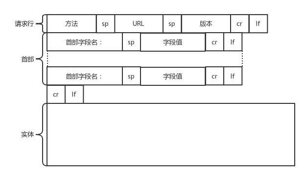

# 5.2 HTTP
## 5.2.1 WWW
WWW: (World Wide Web), 万维网。 并非某种特殊的计算机网络。万维网是一个大规模的、联机式的信息储藏所。万维网用链接的方法能非常方便地从因特网上的一个站点访问另一个站点，从而主动地按需获取丰富的信息。这种访问方式称为“**链接(超链)**”。万维网提供分布式服务，把大量信息分布在整个因特网上。由于万维网的出现，使因特网从仅由少数计算机专家使用变为普通百姓也能用的信息资源。是因特网发展的一个重要里程碑。

超媒体与超文本：万维网是分布式**超媒体**(hypermedia)系统，它是**超文本**(hypertext)系统的扩充。一个超文本由多个信息源链接成。利用一个链接可使用户找到另一个文档。这些文档可以位于世界上任何一个接在因特网上的超文本系统中。超文本是万维网的基础。超媒体与超文本的区别是文档内容不同。超文本文档仅包含文本信息，而超媒体文档还包含其他表示方式的信息，如图形、图像、声音、动画，甚至活动视频图像。

**万维网的工作方式**：万维网以客户服务器方式工作。**浏览器**就是在用户计算机上的**万维网客户程序**。万维网文档所驻留的计算机则运行**服务器程序**，因此这个计算机也称为万维网服务器。客户程序向服务器程序发出请求，服务器程序向客户程序送回客户所要的万维网文档。在一个客户程序主窗口上显示出的万维网文档称为页面(page)。
* 客户端程序实现：浏览器 chrome, firefox, Microsoft Edge, Safari
* 服务器端程序实现：web服务器 Apache Tomcat, Nginx, IIS

万维网必须解决的问题：
* (1) 怎样标志分布在整个因特网上的万维网文档？使用统一资源定位符 URL \(Uniform Resource Locator)来标志万维网上的各种文档。使每一个文档在整个因特网的范围内具有唯一的标识符 URL。
* (2) 用何协议实现万维网上各种超链的链接？在万维网客户程序与万维网服务器程序之间进行交互所使用的协议，是超文本传送协议 HTTP (HyperText Transfer Protocol)。HTTP 是一个应用层协议，它使用 TCP 连接进行可靠的传送。
* \(3\) 怎样使各种万维网文档都能在因特网上的各种计算机上显示出来，同时使用户清楚地知道在什么地方存在着超链？超文本标记语言 HTML \(HyperText Markup Language)使得万维网页面的设计者可以很方便地用一个超链从本页面的某处链接到因特网上的任何一个万维网页面，并且能够在自己的计算机屏幕上将这些页面显示出来。
* \(4\) 怎样使用户能够很方便地找到所需的信息？为了在万维网上方便地查找信息，用户可使用各种的搜索工具（即搜索引擎）。

**WWW的组成结构**：
* a)   统一资源标识符（URI）
* b)   超文本传输协议（HTTP）
* c)   超文本标记语言（HTML）

WWW应用：
* 看新闻

**万维网的工作过程**：例如看新闻
1. 用户在浏览器输入URL： www.tsinghua.edu.cn 并回车，
2. 浏览器分析超链指向页面的URL。
* (2\) 浏览器向 DNS服务器 请求解析[www.tsinghua.edu.cn](www.tsinghua.edu.cn)的 IP 地址。
* \(3\) 域名系统 DNS 解析出清华大学服务器的 IP 地址。
* \(4\) 浏览器与服务器建立 TCP 连接(三次握手)。目前使用的HTTP协议大部分都是1.1。在1.1的协议里面，默认是开启了Keep-Alive的，这样建立的TCP连接，就可以在多次请求中复用。
* \(5\) 浏览器**发送**取文件命令的**HTTP请求**：`GET /chn/yxsz/index.htm`  HTTP请求构建，请求格式
* \(6\) 服务器给出响应，把文件 index.htm 发给浏览器。
* \(7\) TCP 连接释放。
* \(8\) 浏览器显示“清华大学院系设置”文件 index.htm 中的所有文本。

万维网的信息检索系统

1. 全文检索搜索和分类目录搜索

在万维网中用来进行搜索的程序叫做搜索引擎。

全文检索搜索引擎是一种纯技术型的检索工具。它的工作原理是通过搜索软件到因特网上的各网站收集信息，找到一个网站后可以从这个网站再链接到另一个网站。然后按照一定的规则建立一个很大的在线数据库供用户查询。用户在查询时只要输入关键词，就从已经建立的索引数据库上进行查询（并不是实时地在因特网上检索到的信息）。

分类目录搜索：分类目录搜索引擎并不采集网站的任何信息，而是利用各网站向搜索引擎提交的网站信息时填写的关键词和网站描述等信息，经过人工审核编辑后，如果认为符合网站登录的条件，则输入到分类目录的数据库中，供网上用户查询。分类目录搜索也叫做分类网站搜索。

一些著名的搜索引擎

* 最著名的全文检索搜索引擎：[Google 谷歌 ](www.google.com)    [百度](www.baidu.com)
* 最著名的分类目录搜索引擎： [雅虎](www.yahoo.com)  [雅虎中国](cn.yahoo.com)  [新浪](www.sina.com) [搜狐](www.sohu.com) [网易](www.163.com)

垂直搜索引擎\(Vertical Search Engine\)：针对某一特定领域、特定人群或某一特定需求提供搜索服务。垂直搜索也是提供关键字来进行搜索的，但被放到了一个行业知识的上下文中，返回的结果更倾向于信息、消息、条目等。

### 代理服务器\(proxy server\)

代理服务器\(proxy server\)又称为万维网高速缓存\(Web cache\)，它代表浏览器发出 HTTP 请求。万维网高速缓存把最近的一些请求和响应暂存在本地磁盘中。当与暂时存放的请求相同的新请求到达时，万维网高速缓存就把暂存的响应发送出去，而不需要按 URL 的地址再去因特网访问该资源。

使用高速缓存可减少访问因特网服务器的时延

使用高速缓存的情况

\(1\) 浏览器访问因特网的服务器时，要先与校园网的高速缓存建立 TCP 连接，并向高速缓存发出 HTTP 请求报文 \]

\(2\) 若高速缓存已经存放了所请求的对象，则将此对象放入 HTTP 响应报文中返回给浏览器。

\(3\) 否则，高速缓存就代表发出请求的用户浏览器，与因特网上的源点服务器建立 TCP 连接，并发送 HTTP 请求报文。

\(4\) 源点服务器将所请求的对象放在 HTTP 响应报文中返回给校园网的高速缓存。

\(5\) 高速缓存收到此对象后，先复制在其本地存储器中（为今后使用），然后再将该对象放在 HTTP 响应报文中，通过已建立的 TCP 连接，返回给请求该对象的浏览器。

## 5.2.2 URL
URL: 统一资源定位符 
**统一资源定位符** URL 是对可以从因特网上得到的资源的位置和访问方法的一种简洁的表示。URL 给资源的位置提供一种抽象的识别方法，并用这种方法给资源定位。只要能够对资源定位，系统就可以对资源进行各种操作，如存取、更新、替换和查找其属性。**URL 相当于一个文件名在网络范围的扩展**。因此 **URL 是与因特网相连的机器上的任何可访问对象的一个指针**。正是因为这个东西是统一的，所以当你把这样一个字符串输入到浏览器的框里的时候，浏览器才知道如何进行统一处理。

URL 的**格式**：由以冒号隔开的两大部分组成，并且在 URL 中的字符对大写或小写没有要求
* <协议>://<主机>:<端口>/<路径>
  * 协议：指使用什么协议获取该万维网文档。常用的有http, ftp
  * 主机：该主机在因特网的域名，表示互联网上的一个位置。
  * 端口和路径有时可省略

使用 HTTP 的 URL 的一般形式：http://<主机>:<端口>/<路径>

有的URL会有更详细的位置标识，例如 http://www.163.com/index.html 。

HTTP默认端口号是80，通常可省略

URL和URI的区别及理解: https://blog.csdn.net/zhangzhanbin/article/details/115337251

## 5.2.3 HTTP
HTTP： Hypertext transfer protocol. 超文本传输协议。为了使超文本的链接能够高效率地完成，需要用 HTTP 协议来传送一切必须的信息。从层次的角度看，HTTP 是面向事务的(transaction-oriented)应用层协议，它是万维网上能够可靠地交换文件（包括文本、声音、图像等各种多媒体文件）的重要基础。 

**HTTP 的主要特点**：
* HTTP 是面向事务的客户服务器协议。**HTTP 1.0** 协议是无状态的\(stateless\)。HTTP 协议本身也是无连接的，虽然它使用了面向连接的 TCP 向上提供的服务。
* 请求一个万维网文档所需的时间
* 持续连接\(persistent connection\)
  * HTTP/1.1 协议使用持续连接。万维网服务器在发送响应后仍然在一段时间内保持这条连接，使同一个客户（浏览器）和该服务器可以继续在这条连接上传送后续的 HTTP 请求报文和响应报文。这并不局限于传送同一个页面上链接的文档，而是只要这些文档都在同一个服务器上就行。**目前一些流行的浏览器（例如，IE 6.0）的默认设置就是使用 HTTP/1.1**。
  * 持续连接的两种工作方式
    * 非流水线方式：客户在收到前一个响应后才能发出下一个请求。这比非持续连接的两倍 RTT 的开销节省了建立 TCP 连接所需的一个 RTT 时间。但服务器在发送完一个对象后，其 TCP 连接就处于空闲状态，浪费了服务器资源。
    * 流水线方式：客户在收到 HTTP 的响应报文之前就能够接着发送新的请求报文。一个接一个的请求报文到达服务器后，服务器就可连续发回响应报文。使用流水线方式时，客户访问所有的对象只需花费一个 RTT时间，使 TCP 连接中的空闲时间减少，提高了下载文档效率。

### HTTP 的操作过程
* HTTP请求的准备
	1. 用户在浏览器输入URL: www.tsinghua.edu.cn 并回车，
	2. 浏览器分析超链指向页面的URL。
	3. 浏览器向 DNS服务器 请求解析[www.tsinghua.edu.cn](www.tsinghua.edu.cn)的 IP 地址。
	4. 域名系统 DNS 解析出清华大学服务器的 IP 地址。
	5. HTTP是基于TCP协议的，浏览器与服务器先建立 TCP 连接(三次握手)。目前使用的HTTP协议大部分都是1.1。在1.1的协议里面，默认是开启了Keep-Alive的，这样建立的TCP连接，就可以在多次请求中复用。
* HTTP请求的构建
	* 建立了连接以后，浏览器就要发送HTTP的请求(取文件命令的**HTTP请求**：`GET /chn/yxsz/index.htm`)。请求的格式见HTTP的报文结构。
* HTTP请求的发送: 
	* 浏览器把构建的HTTP报文交给传输层。怎么交给传输层呢？其实也无非是用Socket这些东西，只不过用的浏览器里，这些程序不需要你自己写，有人已经帮你写好了。
	* HTTP协议是基于TCP协议的，所以它使用面向连接的方式发送请求，通过stream二进制流的方式传给对方。当然，到了TCP层，它会把二进制流变成一个的报文段发送给服务器。
	* 在发送给每个报文段的时候，都需要对方有一个回应ACK，来保证报文可靠地到达了对方。如果没有回应，那么TCP这一层会进行重新传输，直到可以到达。同一个包有可能被传了好多次，但是HTTP这一层不需要知道这一点，因为是TCP这一层在埋头苦干。
	* TCP层发送每一个报文的时候，都需要加上自己的地址（即源地址）和它想要去的地方（即目标地址），将这两个信息放到IP头里面，交给IP层进行传输。
	* IP层需要查看目标地址和自己是否是在同一个局域网。如果是，就发送ARP协议来请求这个目标地址对应的MAC地址，然后将源MAC和目标MAC放入MAC头，发送出去即可；如果不在同一个局域网，就需要发送到网关，还要需要发送ARP协议，来获取网关的MAC地址，然后将源MAC和网关MAC放入MAC头，发送出去。
	* 网关收到包发现MAC符合，取出目标IP地址，根据路由协议找到下一跳的路由器，获取下一跳路由器的MAC地址，将包发给下一跳路由器。
	* 这样路由器一跳一跳终于到达目标的局域网。这个时候，最后一跳的路由器能够发现，目标地址就在自己的某一个出口的局域网上。于是，在这个局域网上发送ARP，获得这个目标地址的MAC地址，将包发出去。
	* 目标的机器发现MAC地址符合，就将包收起来；发现IP地址符合，根据IP头中协议项，知道自己上一层是TCP协议，于是解析TCP的头，里面有序列号，需要看一看这个序列包是不是我要的，如果是就放入缓存中然后返回一个ACK，如果不是就丢弃。
	* TCP头里面还有端口号，HTTP的服务器正在监听这个端口号。于是，目标机器自然知道是HTTP服务器这个进程想要这个包，于是将包发给HTTP服务器。HTTP服务器的进程看到，原来这个请求是要访问一个网页，于是就把这个网页发给客户端。
* HTTP返回的构建
	* 服务器使用HTTP响应报文格式构建返回的HTTP报文
* HTTP返回的发送
	* 服务器交给socket去发给TCP层让TCP层将返回的HTML，也分成一个个小的段，并且保证每个段都可靠到达。这些段加上TCP头后会交给IP层，然后把刚才的发送过程反向走一遍。虽然两次不一定走相同的路径，但是逻辑过程是一样的，一直到达客户端。
	* 客户端发现MAC地址符合、IP地址符合，于是就会交给TCP层。根据序列号看是不是自己要的报文段，如果是，则会根据TCP头中的端口号，发给相应的进程。这个进程就是浏览器，浏览器作为客户端也在监听某个端口。
	* 当浏览器拿到了HTTP的报文。发现返回“200”，一切正常，于是就从正文中将HTML拿出来。HTML是一个标准的网页格式。浏览器只要根据这个格式，展示出一个绚丽多彩的网页。
	* 这就是一个正常的HTTP请求和返回的完整过程。

* 服务器给出响应，把文件 index.htm 发给浏览器。
* TCP 连接释放。
* 浏览器显示“清华大学院系设置”文件 index.htm 中的所有文本。

### HTTP 的报文结构

由于 HTTP 是面向正文的\(text-oriented\)，因此在报文中的每一个字段都是一些 ASCII 码串，因而每个字段的长度都是不确定的。

HTTP 有两类报文：
* 请求报文——从客户向服务器发送请求报文。
* 响应报文——从服务器到客户的回答。
报文由三个部分组成，即**开始行**、**首部**行和**正文实体**。

请求报文：
1. 开始行：在**请求报文**中，开始行就是**请求行**。
	* URL: 所请求的资源的 URL http://www.163.com ，
	* 版本: HTTP 的版本，HTTP 1.1
	* 方法：方法有几种类型。所谓“方法”就是对所请求的对象进行的操作，因此这些方法实际上也就是一些命令。因此，请求报文的类型是由它所采用的方法决定的。
		* **GET**：对于访问网页来讲，最常用的类型就是**GET**。顾名思义，GET就是去服务器获取一些资源。对于访问网页来讲，要获取的资源往往是一个页面。其实也有很多其他的格式，比如说返回一个JSON字符串，到底要返回什么，是由服务器端的实现决定的。例如，在云计算中，如果我们的服务器端要提供一个基于HTTP协议的API，获取所有云主机的列表，这就会使用GET方法得到，返回的可能是一个JSON字符串。字符串里面是一个列表，列表里面是一项的云主机的信息。
		* POST：另外一种类型叫做**POST**。它需要主动告诉服务端一些信息，而非获取。要告诉服务端什么呢？一般会放在正文里面。正文可以有各种各样的格式。常见的格式也是**JSON**。例如，我们下一节要讲的支付场景，客户端就需要把“我是谁？我要支付多少？我要买啥？”告诉服务器，这就需要通过POST方法。再如，在云计算里，如果我们的服务器端，要提供一个基于HTTP协议的创建云主机的API，也会用到POST方法。这个时候往往需要将“我要创建多大的云主机？多少CPU多少内存？多大硬盘？”这些信息放在JSON字符串里面，通过POST的方法告诉服务器端。
		* PUT：还有一种类型叫**PUT**，就是向指定资源位置上传最新内容。但是，HTTP的服务器往往是不允许上传文件的，所以PUT和POST就都变成了要传给服务器东西的方法。在实际使用过程中，这两者还会有稍许的区别。**POST往往是用来创建一个资源的，而PUT往往是用来修改一个资源的**。例如，云主机已经创建好了，我想对这个云主机打一个标签，说明这个云主机是生产环境的，另外一个云主机是测试环境的。那怎么修改这个标签呢？往往就是用PUT方法。
		* DELETE：再有一种常见的就是**DELETE**。这个顾名思义就是用来删除资源的。例如，我们要删除一个云主机，就会调用DELETE方法。
2. 首部行：
	* 首部字段： 首部是**key value**，通过冒号分隔。这里面，往往保存了一些非常重要的字段。例如，
		* **Accept-Charset**：表示**客户端可以接受的字符集**。防止传过来的是另外的字符集，从而导致出现乱码。
		* **Content-Type**：指**正文的格式**。例如，我们进行POST的请求，如果正文是**JSON**，那么我们就应该将这个值设置为JSON。
		* **Cache-control**：是用来**控制缓存**的。当客户端发送的请求中包含max-age指令时，如果判定缓存层中，资源的缓存时间数值比指定时间的数值小，那么客户端可以接受缓存的资源；当指定max-age值为0，那么缓存层通常需要将请求转发给应用集群。
		* **If-Modified-Since**：也是一个关于缓存的。也就是说，如果服务器的资源在某个时间之后更新了，那么客户端就应该下载最新的资源；如果没有更新，服务端会返回“304 Not Modified”的响应，那客户端就不用下载了，也会节省带宽。

这里需要重点说一下的就是**缓存**。为啥要使用缓存呢？那是因为一个非常大的页面有很多东西。例如，我浏览一个商品的详情，里面有这个商品的价格、库存、展示图片、使用手册等等。商品的展示图片会保持较长时间不变，而库存会根据用户购买的情况经常改变。如果图片非常大，而库存数非常小，如果我们每次要更新数据的时候都要刷新整个页面，对于服务器的压力就会很大。

对于这种高并发场景下的系统，在真正的业务逻辑之前，都需要有个接入层，将这些静态资源的请求拦在最外面。

这个架构的图就像这样。

其中DNS、CDN我在后面的章节会讲。和这一节关系比较大的就是Nginx这一层，它如何处理HTTP协议呢？对于静态资源，有Vanish缓存层。当缓存过期的时候，才会访问真正的Tomcat应用集群。

----

响应报文：
1. 状态行：**响应报文**的开始行是**状态行**。状态行包括三项内容，即 HTTP 的版本，状态码，以及解释状态码的简单短语。
	* 状态码：都是三位数字。状态码会反应HTTP请求的结果
		* 1xx 表示通知信息的，如请求收到了或正在进行处理。
		* 2xx 表示成功，如接受或知道了。
		* 3xx 表示重定向，表示要完成请求还必须采取进一步的行动。
		* 4xx 表示客户的差错，如请求中有错误的语法或不能完成。
			* 404: 服务端无法响应这个请求
		* 5xx 表示服务器的差错，如服务器失效无法完成请求。
			* 502
			* 503
1. 首部：首部是**key value**格式
	* 首部字段：
		* **Retry-After**：表示告诉客户端应该在多长时间以后再次尝试一下。“503错误”是说“服务暂时不再和这个值配合使用”。
		  * **Content-Type**，表示返回的是HTML，还是JSON。

### HTTP 2.0

**HTTP 2.0通过头压缩、分帧、二进制编码、多路复用等技术提升性能**

QUIC, a multiplexed transport over UDP：https://www.chromium.org/quic/

当然HTTP协议也在不断地进化过程中，在HTTP1.1基础上便有了HTTP 2.0。

HTTP 1.1在应用层以**纯文本**的形式进行通信。每次通信都要带完整的HTTP的头，而且不考虑http pipeline模式的话，每次的过程总是像上面描述的那样一去一回。这样在实时性、并发性上都存在问题。

为了解决这些问题，HTTP 2.0会**对HTTP的头进行一定的压缩**，将原来每次都要携带的大量key value在两端建立一个索引表，对相同的头只发送索引表中的索引。

另外，HTTP 2.0协议将一个TCP的连接中，**切分成多个流**，每个流都有自己的ID，而且流可以是客户端发往服务端，也可以是服务端发往客户端。它其实只是一个虚拟的通道。流是有优先级的。

HTTP 2.0还将所有的传输信息分割为**更小的消息和帧**，并对它们采用二进制格式编码。常见的帧有**Header帧**，用于传输Header内容，并且会开启一个新的流。再就是**Data帧**，用来传输正文实体。多个Data帧属于同一个流。

通过这两种机制，HTTP 2.0的客户端可以**将多个请求分到不同的流中**，然后将请求内容拆成帧，进行二进制传输。这些帧可以打散乱序发送， 然后根据每个帧首部的流标识符重新组装，并且可以根据优先级，决定优先处理哪个流的数据。

我们来举一个例子。

假设我们的一个页面要发送三个独立的请求，一个获取css，一个获取js，一个获取图片jpg。如果使用HTTP 1.1就是串行的，但是如果使用HTTP 2.0，就可以在一个连接里，客户端和服务端都可以同时发送多个请求或回应，而且不用按照顺序一对一对应。

HTTP 2.0其实是将三个请求变成三个流，将数据分成帧，乱序发送到一个TCP连接中。

HTTP 2.0成功解决了HTTP 1.1的**队首阻塞问题**，同时，也不需要通过HTTP 1.x的pipeline机制用多条TCP连接来实现并行请求与响应；减少了TCP连接数对服务器性能的影响，同时将页面的多个数据css、js、 jpg等通过一个数据链接进行传输，能够加快页面组件的传输速度。

## QUIC协议

**QUIC协议通过基于UDP自定义的类似TCP的连接、重试、多路复用、流量控制技术，进一步提升性能。**

HTTP 2.0虽然大大增加了并发性，但还是有问题的。因为HTTP 2.0也是基于TCP协议的，**TCP协议在处理包时是有严格顺序的。**

当其中一个数据包遇到问题，TCP连接需要等待这个包完成重传之后才能继续进行。虽然HTTP 2.0通过多个stream，使得逻辑上一个TCP连接上的并行内容，进行多路数据的传输，然而这中间并没有关联的数据。一前一后，前面stream 2的帧没有收到，后面stream 1的帧也会因此阻塞。

于是，就又到了从TCP切换到UDP，进行“城会玩”的时候了。这就是Google的QUIC协议，接下来我们来看它是如何“城会玩”的。

### 机制一：自定义连接机制

我们都知道，一条TCP连接是由四元组标识的，分别是源 IP、源端口、目的 IP、目的端口。一旦一个元素发生变化时，就需要断开重连，重新连接。在移动互联情况下，当手机信号不稳定或者在WIFI和 移动网络切换时，都会导致重连，从而进行再次的三次握手，导致一定的时延。

这在TCP是没有办法的，但是基于UDP，就可以在QUIC自己的逻辑里面维护连接的机制，不再以四元组标识，而是**以一个64位的随机数作为ID来标识**，而且UDP是无连接的，所以当IP或者端口变化的时候，**只要ID不变，就不需要重新建立连接**。

### 机制二：自定义重传机制

前面我们讲过，TCP为了保证可靠性，通过使用**序号**和**应答**机制，来解决顺序问题和丢包问题。

任何一个序号的包发过去，都要在一定的时间内得到应答，否则一旦超时，就会重发这个序号的包。那怎么样才算超时呢？还记得我们提过的**自适应重传算法**吗？这个超时是通过**采样往返时间RTT**不断调整的。

其实，**在TCP里面超时的采样存在不准确的问题**。例如，发送一个包，序号为100，发现没有返回，于是再发送一个100，过一阵返回一个ACK101。这个时候客户端知道这个包肯定收到了，但是往返时间是多少呢？是ACK到达的时间减去后一个100发送的时间，还是减去前一个100发送的时间呢？事实是，第一种算法把时间算短了，第二种算法把时间算长了。

QUIC也有个序列号，是递增的。任何一个序列号的包只发送一次，下次就要加一了。例如，发送一个包，序号是100，发现没有返回；再次发送的时候，序号就是101了；如果返回的ACK 100，就是对第一个包的响应。如果返回ACK 101就是对第二个包的响应，RTT计算相对准确。

但是这里有一个问题，就是怎么知道包100和包101发送的是同样的内容呢？QUIC定义了一个offset概念。**QUIC既然是面向连接的**，也就像TCP一样，是一个数据流，发送的数据在这个数据流里面有个**偏移量offset**，可以通过offset查看数据发送到了哪里，这样只要这个offset的包没有来，就要重发；如果来了，按照offset拼接，还是能够拼成一个流。

### 机制三：无阻塞的多路复用

有了自定义的连接和重传机制，我们就可以**解决上面HTTP 2.0的多路复用问题**。

同HTTP 2.0一样，同一条QUIC连接上可以创建多个stream，来发送多个 HTTP 请求。但是，QUIC是基于UDP的，一个连接上的多个stream之间没有依赖。这样，假如stream2丢了一个UDP包，后面跟着stream3的一个UDP包，虽然stream2的那个包需要重传，但是stream3的包无需等待，就可以发给用户。

### 机制四：自定义流量控制

TCP的流量控制是通过**滑动窗口协议**。QUIC的流量控制也是通过window_update，来告诉对端它可以接受的字节数。但是QUIC的窗口是适应自己的多路复用机制的，不但在一个连接上控制窗口，还在一个连接中的每个stream控制窗口。

还记得吗？在TCP协议中，接收端的窗口的起始点是下一个要接收并且ACK的包，即便后来的包都到了，放在缓存里面，窗口也不能右移，因为TCP的ACK机制是基于序列号的累计应答，一旦ACK了一个系列号，就说明前面的都到了，所以只要前面的没到，后面的到了也不能ACK，就会导致后面的到了，也有可能超时重传，浪费带宽。

QUIC的ACK是基于offset的，每个offset的包来了，进了缓存，就可以应答，应答后就不会重发，中间的空挡会等待到来或者重发即可，而窗口的起始位置为当前收到的最大offset，从这个offset到当前的stream所能容纳的最大缓存，是真正的窗口大小。显然，这样更加准确。

另外，还有整个连接的窗口，需要对于所有的stream的窗口做一个统计。

2. 在服务器上存放用户的信息

万维网站点使用 Cookie 来跟踪用户。Cookie 表示在 HTTP 服务器和客户之间传递的状态信息。使用 Cookie 的网站服务器为用户产生一个唯一的识别码。利用此识别码，网站就能够跟踪该用户在该网站的活动。

## 5.2.4 HTML
