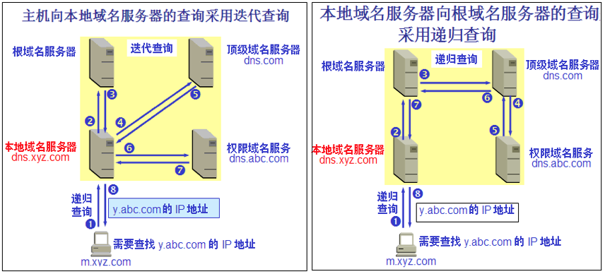

# DNS

httpdns

### 6.1.1 域名系统概述

1. DNS（Domain Name System）---&gt; 是因特网使用的命名系统，用来把机器名转换成IP地址。

   用户与因特网上某个主机通信时，显然不愿意使用难于记忆的长达32位二进制的IP地址。但由于域名长度不是固定的，机器处理起来比较困难。再者，若使用IP地址，意味着若邮件服务器迁移到另一台不同IP地址的机器上，其邮件地址必须改变。

   > 例如：若发送电子邮件到[cm\_grass@126.com](mailto:cm_grass@126.com)
   >
   > ∵[www.126.com](www.126.com)←→ 220.181.12.218
   >
   > ∴[cm\_grass@126.com](mailto:cm_grass@126.com)等价于cm\_grass@220.181.12.218

   1. 许多应用层软件经常直接使用域名系统 DNS \(Domain Name System\)，但计算机的用户只是间接而不是直接使用**域名系统**。

   2. 因特网采用层次结构的命名树作为主机的名字，并使用**分布式**的域名系统 DNS。

   3. 名字到 IP 地址的解析是由若干个域名服务器程序完成的。域名服务器程序在专设的结点上运行，运行该程序的机器称为**域名服务器**。

2. 域名到IP地址解析过程要点如下：

   当某一应用程序需要把主机名解析为IP地址时，该应用程程就调用**解析程序**，把待解析的域名放在域名放在**DNS请求报文**中，以**UDP**方式发给本地域名服务器，本地域名服务器在查找域名后，把对应的IP地址放在应答报文中返回。应用进程获得IP地址即可进行通话。

   若本地域名服务器不能回答该请求，则域名服务器再向其他域名服务器发出查询请求，直到查到为止。

### 6.1.2 因特网的域名结构

层次域名空间

1. 因特网采用了层次树状结构的命名方法。任何一个连接在因特网上的主机或路由器，都有一个唯一的层次结构的名字，即域名。域可以划分为若干个子域，子域可再分。

   > 例如：mail.cctv.com  每一域名都由标号序列组成，各标号间用点号隔开

   1. 域名的结构由标号序列组成，各标号之间用点隔开：… . 三级域名 . 二级域名 . 顶级域名

   2. 各标号分别代表不同级别的域名。

   3. 域名只是个逻辑概念，并不代表计算机所在的物理地点。

   4. 变长的域名和使用有助记忆的字符串，是为了便于人来使用。而 IP 地址是定长的 32 位二进制数字则非常便于机器进行处理。

   5. 域名中的“点”和点分十进制 IP 地址中的“点”并无一一对应的关系。点分十进制 IP 地址中一定是包含三个“点”，但每一个域名中“点”的数目则不一定正好是三个。

2. DNS规定---&gt; 域名标号都由字母或数字组成，不超过63个字符，域名总长不超过255个字符，域名级数不限，从左到右，级别升高。

   各级域名由其上一级域管理机构管理，可保证每一域保在因特网范围内唯一。

3. 顶级域名 TLD \(Top Level Domain\)可分为三大类：

   1. 国家顶级域名 nTLD：如: .cn 表示中国，.us 表示美国，.uk 表示英国，等等。

   2. 通用顶级域名 gTLD：  
      \(1\)最早的顶级域名是：

      ```
        .com  （公司和企业）
        .net  （网络服务机构）
        .org  （非赢利性组织）
        .edu  （美国专用的教育机构）
        .gov  （美国专用的政府部门）
        .mil  （美国专用的军事部门）
        .int  （国际组织）
      ```

      \(2\)新增加了下列的通用顶级域名

      ```
        .aero （航空运输企业）
        .biz  （公司和企业）
        .cat  （加泰隆人的语言和文化团体）
        .coop  （合作团体）
        .info  （各种情况）
        .jobs  （人力资源管理者）
        .mobi  （移动产品与服务的用户和提供者）
        .museum  （博物馆）
        .name  （个人）
        .pro  （有证书的专业人员）
        .travel  （旅游业）
      ```

   3. 基础结构域名\(infrastructure domain\)：这种顶级域名只有一个，即 arpa，用于反向域名解析，因此又称为反向域名。

   

4. 我国把二级域名划分为**类别域**和**行政区域**名两类

   1. 类别域名：ac、com、edu、gov、net、org、mil7个

   2. 行政区域名34个：bj，js（江苏），ah等；

5. 我国允许在cn顶级域下注册二级域名，各国管理方法可以不同，**例如**： cs.yale.eduè美国耶鲁大学计算机系；  
   cs.vu.nlè荷兰阿姆斯丹大学计算机系；  
   cs.chu.edu.cnè中国巢湖学院计算机系；

**※注意**：域名空间按机构的组织来划分的，与物理网络无关

### 6.1.3 域名服务器

* DNS 服务器的管辖范围不是以“域”为单位，而是以“区\(zone\)”为单位。每一个区设置相应的权限域名服务器，用来保存该区中的所有主机的域名到IP地址的映射。各单位根据具体情况来划分自己管辖范围的区。但在一个区中的所有节点必须是能够连通的。区小于等于城。


域名服务器有以下四种类型 ---&gt; 因特网上DNS服务器也是按层次安排

1. 根域名服务器——最高层次、最重要的的域名服务器

   所有的根域名服务器都知道所有的顶级域名服务器的域名和 IP 地址。  
   不管是哪一个本地域名服务器，若要对因特网上任何一个域名进行解析，只要自己无法解析，就首先求助于根域名服务器。  
   在因特网上共有13 个不同 IP 地址的根域名服务器，它们的名字是用一个英文字母命名，从a 一直到 m（前13 个字母）。根域名服务器数目并不是13个机器，而是13套装置。   
   这些根域名服务器相应的域名分别是

   ```
      a.rootservers.net
      b.rootservers.net
      … 
      m.rootservers.net
   ```

   注意：许多情况下，根域名服务器并不直接把待查询的域名直接转换成IP 地址，而是告诉本地域名服务器，下一步应该找哪个顶级域名服务器进行查询。

   到 2006 年底全世界已经安装了一百多个根域名服务器机器，分布在世界各地。这样做的目的是为了方便用户，使世界上大部分 DNS 域名服务器都能就近找到一个根域名服务器。

   举例：根域名服务器 f 的地点分布图

2. 顶级域名服务器（即 TLD 服务器）

   这些域名服务器负责管理在该顶级域名服务器注册的所有二级域名。当收到 DNS 查询请求时，就给出相应的回答（可能是最后的结果，也可能是下一步应当找的域名服务器的 IP 地址）。

3. 权限域名服务器 / 授权域名服务器

   这就是前面已经讲过的负责一个区的域名服务器。当一个权限域名服务器还不能给出最后的查询回答时，就会告诉发出查询请求的 DNS 客户，下一步应当找哪一个权限域名服务器。

4. 本地域名服务器

   本地域名服务器对域名系统非常重要。当一个主机发出 DNS 查询请求时，这个查询请求报文就发送给本地域名服务器。每一个因特网服务提供者 ISP，或一个大学，甚至一个大学里的系，都可以拥有一个本地域名服务器，这种域名服务器有时也称为默认域名服务器。

为了提高域名服务器的可靠性：  
   DNS 域名服务器都把数据复制到几个域名服务器来保存，其中的一个是主域名服务器，其他的是辅助域名服务器。当主域名服务器出故障时，辅助域名服务器可以保证 DNS 的查询工作不会中断。主域名服务器定期把数据复制到辅助域名服务器中，而更改数据只能在主域名服务器中进行。这样就保证了数据的一致性。

### 域名的解析过程

   * \(1\).递归过程：主机向本地域名服务器的查询一般都是采用递归查询 =&gt; 如果主机所询问的本地域名服务器不知道被查询域名的 IP 地址，那么本地域名服务器就以 DNS 客户的身份，向其他根域名服务器继续发出查询请求报文。

   * \(2\).迭代过程：本地域名服务器向根域名服务器的查询通常是采用迭代查询。当根域名服务器收到本地域名服务器的迭代查询请求报文时，要么给出所要查询的 IP 地址，要么告诉本地域名服务器：“你下一步应当向哪一个域名服务器进行查询”。然后让本地域名服务器进行后续的查询。



本地域名服务器采用迭代查询

本地域名服务器采用递归查询（比较少用）

名字的高速缓存

每个域名服务器都维护一个高速缓存，存放最近用过的名字以及从何处获得名字映射信息的记录。可大大减轻根域名服务器的负荷，使因特网上的 DNS 查询请求和回答报文的数量大为减少。为保持高速缓存中的内容正确，域名服务器应为每项内容设置计时器，并处理超过合理时间的项（例如，每个项目只存放两天）。当权限域名服务器回答一个查询请求时，在响应中都指明绑定有效存在的时间值。增加此时间值可减少网络开销，而减少此时间值可提高域名转换的准确性。

为了提高DNS效率，在域名服务中广泛使用了高速缓存，存放最近查询过的域名以及从何处获取域名映射信息的记录。由于域名改动并不频繁，大多数网点不需要花太多经历就能维护数据库的一致性。


所有最新极客时间课程请加QQ群170701297

# 第18讲讲DNS协议：网络世界的地址簿


前面我们讲了平时常见的看新闻、支付、直播、下载等场景，现在网站的数目非常多，常用的网站就有二三十个，如果全部用IP地址进行访问，恐怕很难记住。于是，就需要一个地址簿，根据名称，就可以查看具体的地址。

例如，我要去西湖边的“外婆家”，这就是名称，然后通过地址簿，查看到底是哪条路多少号。

## DNS服务器

在网络世界，也是这样的。你肯定记得住网站的名称，但是很难记住网站的IP地址，因而也需要一个地址簿，就是**DNS服务器**。

由此可见，DNS在日常生活中多么重要。每个人上网，都需要访问它，但是同时，这对它来讲也是非常大的挑战。一旦它出了故障，整个互联网都将瘫痪。另外，上网的人分布在全世界各地，如果大家都去同一个地方访问某一台服务器，时延将会非常大。因而，**DNS服务器，一定要设置成高可用、高并发和分布式的**。

于是，就有了这样**树状的层次结构**。



- 根DNS服务器 ：返回顶级域DNS服务器的IP地址
- 顶级域DNS服务器：返回权威DNS服务器的IP地址
- 权威DNS服务器 ：返回相应主机的IP地址

## DNS解析流程

为了提高DNS的解析性能，很多网络都会就近部署DNS缓存服务器。于是，就有了以下的DNS解析流程。

1. 电脑客户端会发出一个DNS请求，问www.163.com的IP是啥啊，并发给本地域名服务器 (本地DNS)。那本地域名服务器 (本地DNS) 是什么呢？如果是通过DHCP配置，本地DNS由你的网络服务商（ISP），如电信、移动等自动分配，它通常就在你网络服务商的某个机房。
2. 本地DNS收到来自客户端的请求。你可以想象这台服务器上缓存了一张域名与之对应IP地址的大表格。如果能找到 www.163.com，它直接就返回IP地址。如果没有，本地DNS会去问它的根域名服务器：“老大，能告诉我www.163.com的IP地址吗？”根域名服务器是最高层次的，全球共有13套。它不直接用于域名解析，但能指明一条道路。
3. 根DNS收到来自本地DNS的请求，发现后缀是 .com，说：“哦，www.163.com啊，这个域名是由.com区域管理，我给你它的顶级域名服务器的地址，你去问问它吧。”
4. 本地DNS转向问顶级域名服务器：“老二，你能告诉我www.163.com的IP地址吗？”顶级域名服务器就是大名鼎鼎的比如 .com、.net、 .org这些一级域名，它负责管理二级域名，比如 163.com，所以它能提供一条更清晰的方向。
5. 顶级域名服务器说：“我给你负责 www.163.com 区域的权威DNS服务器的地址，你去问它应该能问到。”
6. 本地DNS转向问权威DNS服务器：“您好，www.163.com 对应的IP是啥呀？”163.com的权威DNS服务器，它是域名解析结果的原出处。为啥叫权威呢？就是我的域名我做主。
7. 权限DNS服务器查询后将对应的IP地址X.X.X.X告诉本地DNS。
8. 本地DNS再将IP地址返回客户端，客户端和目标建立连接。

至此，我们完成了DNS的解析过程。现在总结一下，整个过程我画成了一个图。


## 负载均衡

站在客户端角度，这是一次**DNS递归查询过程。**因为本地DNS全权为它效劳，它只要坐等结果即可。在这个过程中，DNS除了可以通过名称映射为IP地址，它还可以做另外一件事，就是**负载均衡**。

还是以访问“外婆家”为例，还是我们开头的“外婆家”，但是，它可能有很多地址，因为它在杭州可以有很多家。所以，如果一个人想去吃“外婆家”，他可以就近找一家店，而不用大家都去同一家，这就是负载均衡。

DNS首先可以做**内部负载均衡**。

例如，一个应用要访问数据库，在这个应用里面应该配置这个数据库的IP地址，还是应该配置这个数据库的域名呢？显然应该配置域名，因为一旦这个数据库，因为某种原因，换到了另外一台机器上，而如果有多个应用都配置了这台数据库的话，一换IP地址，就需要将这些应用全部修改一遍。但是如果配置了域名，则只要在DNS服务器里，将域名映射为新的IP地址，这个工作就完成了，大大简化了运维。

在这个基础上，我们可以再进一步。例如，某个应用要访问另外一个应用，如果配置另外一个应用的IP地址，那么这个访问就是一对一的。但是当被访问的应用撑不住的时候，我们其实可以部署多个。但是，访问它的应用，如何在多个之间进行负载均衡？只要配置成为域名就可以了。在域名解析的时候，我们只要配置策略，这次返回第一个IP，下次返回第二个IP，就可以实现负载均衡了。

另外一个更加重要的是，DNS还可以做**全局负载均衡**。

为了保证我们的应用高可用，往往会部署在多个机房，每个地方都会有自己的IP地址。当用户访问某个域名的时候，这个IP地址可以轮询访问多个数据中心。如果一个数据中心因为某种原因挂了，只要在DNS服务器里面，将这个数据中心对应的IP地址删除，就可以实现一定的高可用。

另外，我们肯定希望北京的用户访问北京的数据中心，上海的用户访问上海的数据中心，这样，客户体验就会非常好，访问速度就会超快。这就是全局负载均衡的概念。

## 示例：DNS访问数据中心中对象存储上的静态资源

我们通过DNS访问数据中心中对象存储上的静态资源为例，看一看整个过程。

假设全国有多个数据中心，托管在多个运营商，每个数据中心三个可用区（Available Zone）。对象存储通过跨可用区部署，实现高可用性。在每个数据中心中，都至少部署两个内部负载均衡器，内部负载均衡器后面对接多个对象存储的前置服务器（Proxy-server）。



1. 当一个客户端要访问object.yourcompany.com的时候，需要将域名转换为IP地址进行访问，所以它要请求本地DNS解析器。
2. 本地DNS解析器先查看看本地的缓存是否有这个记录。如果有则直接使用，因为上面的过程太复杂了，如果每次都要递归解析，就太麻烦了。
3. 如果本地无缓存，则需要请求本地的DNS服务器。
4. 本地的DNS服务器一般部署在你的数据中心或者你所在的运营商的网络中，本地DNS服务器也需要看本地是否有缓存，如果有则返回，因为它也不想把上面的递归过程再走一遍。
5. 至 7. 如果本地没有，本地DNS才需要递归地从根DNS服务器，查到.com的顶级域名服务器，最终查到 yourcompany.com 的权威DNS服务器，给本地DNS服务器，权威DNS服务器按说会返回真实要访问的IP地址。

对于不需要做全局负载均衡的简单应用来讲，yourcompany.com的权威DNS服务器可以直接将 object.yourcompany.com这个域名解析为一个或者多个IP地址，然后客户端可以通过多个IP地址，进行简单的轮询，实现简单的负载均衡。

但是对于复杂的应用，尤其是跨地域跨运营商的大型应用，则需要更加复杂的全局负载均衡机制，因而需要专门的设备或者服务器来做这件事情，这就是**全局负载均衡器**（**GSLB**，**Global Server Load Balance**）。

在yourcompany.com的DNS服务器中，一般是通过配置CNAME的方式，给 object.yourcompany.com起一个别名，例如 object.vip.yourcomany.com，然后告诉本地DNS服务器，让它请求GSLB解析这个域名，GSLB就可以在解析这个域名的过程中，通过自己的策略实现负载均衡。

图中画了两层的GSLB，是因为分运营商和地域。我们希望不同运营商的客户，可以访问相同运营商机房中的资源，这样不跨运营商访问，有利于提高吞吐量，减少时延。

1. 第一层GSLB，通过查看请求它的本地DNS服务器所在的运营商，就知道用户所在的运营商。假设是移动，通过CNAME的方式，通过另一个别名 object.yd.yourcompany.com，告诉本地DNS服务器去请求第二层的GSLB。
2. 第二层GSLB，通过查看请求它的本地DNS服务器所在的地址，就知道用户所在的地理位置，然后将距离用户位置比较近的Region里面，六个**内部负载均衡**（**SLB**，S**erver Load Balancer**）的地址，返回给本地DNS服务器。
3. 本地DNS服务器将结果返回给本地DNS解析器。
4. 本地DNS解析器将结果缓存后，返回给客户端。
5. 客户端开始访问属于相同运营商的距离较近的Region 1中的对象存储，当然客户端得到了六个IP地址，它可以通过负载均衡的方式，随机或者轮询选择一个可用区进行访问。对象存储一般会有三个备份，从而可以实现对存储读写的负载均衡。

## 小结

好了，这节内容就到这里了，我们来总结一下：

- DNS是网络世界的地址簿，可以通过域名查地址，因为域名服务器是按照树状结构组织的，因而域名查找是使用递归的方法，并通过缓存的方式增强性能；
- 在域名和IP的映射过程中，给了应用基于域名做负载均衡的机会，可以是简单的负载均衡，也可以根据地址和运营商做全局的负载均衡。

最后，给你留两个思考题：

1. 全局负载均衡为什么要分地址和运营商呢？
2. 全局负载均衡使用过程中，常常遇到失灵的情况，你知道具体有哪些情况吗？对应应该怎么来解决呢？


全局负载均衡使用过程中，常常遇到失灵的情况，你知道具体有哪些情况吗？对应应该怎么来解决呢？
全局负载均衡失灵的时间，可以分情况来应对，
1，全局负载均衡器因为流量过大，而导致的失灵，
此情况，是因为流量已经超过了当前机器的极限所导致的，针对此只能通过扩容来解决。
2，全局负载均衡器因为机器故障了，导致的失灵。
此情况的发生，说明机器存在负载均衡器有单点问题，须通过增加备机，或者更为可靠的集群来解决。
3，全局负载均衡器因为网络故障，导致的失灵。
此情况，案例莫过于支付宝的光纤被挖掘机挖断，此问题可通过接入更多的线路来解决，


我能想到的只有这些，还请超哥来指证，谢谢


---

如果权威DNS连不上，怎么办？

在递归的时候。返回的授权ns如果链接不上。dns服务器怎么处理的？
比如dns服务器收到 www.163.com 解析请求 递归返回ns记录为 ns1.163.com 和ns2.163.com 但此时 ns1.163.com 网络不通。 此时dns服务器是一直等待？还是重试几次返回失败？还是其他？


一般情况下，DNS是基于UDP协议的。在应用层设置一个超时器，如果UDP发出没有回应，则会进行重试。

DNS服务器一般也是高可用的，很少情况下会挂。即便挂了，也会很快切换，重试一般就会成功。

对于客户端来讲，为了DNS解析能够成功，也会配置多个DNS服务器，当一个不成功的时候，可以选择另一个来尝试。

---


我们的专栏更新过半了，不知你掌握得如何？每节课后我留的思考题，你都有没有认真思考，并在留言区写下答案呢？我会从**已发布的文章中选出一批认真留言的同学**，赠送**学习奖励礼券**和我整理的**独家网络协议知识图谱**。

欢迎你留言和我讨论。趣谈网络协议，我们下期见！


## 精选留言

- 

  iiwoai

  图谱应该都给赠送才对啊

  2018-06-27 08:44

- 

  ^_^

  老师，独家网络协议知识图谱，这么好的东西，应该阳光普照，哈哈

  2018-06-27 07:32

- 

  知识改变命运

  感谢刘老师的讲解！这几次课的理解程度好多了！话说不是不愿意回答思考题，而是小白无力回答~最后，同求知识图谱~多谢多谢

  2018-06-27 10:22

- 

  coldfire

  从真名到别名怎么完成均衡负载，感觉没讲清楚，对于小白来说这就是一笔带过留了个影响

  2018-06-27 09:18

- 

  upstream

  虽然有了域名，但对于大多数人而言，能记住的就那么一两个网站地址。于是，打开baidu.com 搜索想要打开的网站，也就不奇怪了。打开baidu.com 搜索谷歌，再去访问Google 也就成为很多人的默认行为。说白了，也还是记不住域名。
  Baidu.com 搜索qq邮箱的大有人在

  2018-06-27 08:01

- 

  kel

  分地址和运营商主要是为了返回最优的ip，也就是离用户最近的ip，提高用户访问的速度，分运营商也是返回最快的一条路径。gslb失灵一般是因为一个ns请求gslb的时候，看不到用户真实的ip，从而不一定是最优的，而且这个返回的结果可能给一个用户或者一万个用户，可以通过流量监测来缓解。

  2018-08-19 14:11

  作者回复

  对的

  2018-08-20 09:59

- 

  upstream

  问题1，分成两级还是在于国内网络跨运营商访问慢
  问题2，如果用户是上海电信，用户本地dns不是用的电信dns服务器，负载均衡调度会不准确。针对app的可以httpdns
  针对网站的除非能支持edns协议才比较好。
  另外当用户使用阿里云这类anycast 地址时，不清楚gslb调度策略如何的

  2018-06-27 09:15

- 

  一粟

  要解析本地DNS缓存，需要启动DNS Sclient服务，此服务不开启hosts配置会失效。

  2018-07-15 16:26

- 

  selboo

  

  2018-07-09 09:51

- 

  灰灰

  写得太好了，刘超老师，你还有其他技术专栏吗？或者有其他推荐的技术专栏吗？

  2018-06-27 09:47

- 

  LongXiaJun

  😃😃😃现在一周三天都在期待专栏更新~

  2018-06-27 07:47

- 

  何磊

  我对dns解析后，把所有IP都返回给客户端，由客户端负责轮训达到负载均衡表示不解。这里不应该是dns服务器返回一个随机IP，然后客户端直接访问即可吗？

  2018-09-26 08:35

- 

  wlh2119

  刘老师的每一篇文章都认真的学习了，对上层HTTP到底层协议都有了更深的理解与认识，建立一个粗略而完整的协议框架。还要继续深入学习。谢谢。

  2018-07-04 08:10

- 

  wykkx

  

  2018-07-01 11:40

- 

  若水

  老师，CNAME那块有点没搞清楚，图里面没体现出来。

  2018-06-27 22:53

- 

  羽毛

  “我们希望不同运营商的客户，可以访问相同运营商机房中的资源”为什么不同运营商访问相同的运营商机房中的资源

  2018-06-27 09:54

- 

  Jobs

  1.防止单个地区或运营商的流量过爆而挂了。
  2.服务器故障，网络故障如中间路由器故障，SLB设备故障，断电故障等。Solution:返回多重A记录？

  2018-06-27 09:37

- 

  狗蛋儿

  您好 两层GLSB的例子中 第四步“本地 DNS 解析器将结果缓存后，返回给客户端。” 本地DNS解析器会把6个IP都返回给客户端？还有下次访问同样域名时候，假设客户端缓存失败，本地DNS解析器缓存，也是返回6个IP吗？

  2018-12-14 18:39

- 

  jim

  浏览器，路由器也有缓存吧？

  2018-11-28 22:47

  作者回复

  是的

  2018-11-30 09:42

- 

  MJ

  本地DNS服务器访问GLSB的时候，如何做到把原域名改为别名来访问呢？

  2018-11-28 09:03

  作者回复

  在dns服务器上可以配置别名

  2018-11-28 10:36
