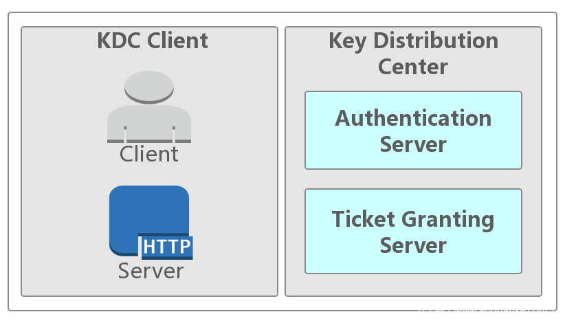

# Kerberos

## Kerberos功能

Kerberos是一种由MIT（麻省理工大学）提出的一种**网络身份验证协议**,并不提供授权功能或者审计功能。它旨在通过使用[密钥加密](https://www.zhihu.com/search?q=密钥加密&search_source=Entity&hybrid_search_source=Entity&hybrid_search_extra={"sourceType"%3A"answer"%2C"sourceId"%3A608947187})技术为客户端/服务器应用程序提供强身份验证。

1. 一个安全认证协议
2. 用tickets验证
3. 避免本地保存密码和在互联网上传输密码
4. 包含一个可信任的第三方
5. 使用对称加密
6. 客户端与服务器（非KDC）之间能够相互验证

**Kerberos** 作为**用户和服务的强身份验证和身份传播**的基础。

**Kerberos 是一种计算机网络认证协议，它允许某实体在非安全网络环境下通信，向另一个实体以一种安全的方式证明自己的身份。** Kerberos 是第三方认证机制，其中用户和服务依赖于第三方（Kerberos 服务器）来对彼此进行身份验证。 

**Kerberos服务器**本身称为**密钥分发中心或 KDC**。 在较高的层面上，它有三个部分：

- 它知道的用户和服务（称为**主体**）及其各自的 Kerberos 密码的数据库。
- 一个**认证服务器（Authentication Server，简称 AS）：验证Client端的身份（确定你是身份证上的本人），验证通过就会给一张票证授予票证（Ticket Granting Ticket，简称 TGT）给 Client。**
- 一个**票据授权服务器（Ticket Granting Server，简称 TGS）：通过 TGT（AS 发送给 Client 的票）获取访问 Server 端的票（Server Ticket，简称 ST）。ST（Service Ticket）也有资料称为 TGS Ticket。**

## Kerberos基本概念

1. Key Distribution Center：KDC，在启用Kerberos的环境中进行身份验证的受信任源。

2. Kerberos KDC Server：作为密钥分发中心（KDC）的计算机或服务器。
   1. the Authentication Server
   2. the Ticket Granting Server

3. Kerberos Client：集群中针对KDC进行身份验证的任何计算机。
   1. the Service or host machine that you’re wanting access to.

4. KDC Admin Account

Ambari用于在KDC中创建主体并生成密钥表的管理帐户。

5. Principal

## Kerberos原理

* 首次请求，三次通信方

- 每次通信，消息包含两部分，一部分可解码，一部分不可解码
- 服务端不会直接有KDC通信
- KDC保存所有机器的账户名和密码
- KDC本身具有一个密码

以获取服务器中的一张表（数据）的服务以为，这是一个http服务。

### 第1次通信:user(client)<-->AS

如果想要获取http服务，你首先要向KDC表名你自己的身份。这个过程可以在你的程序启动时进行。Kerberos可以通过kinit获取。介绍自己通过未加密的信息发送至KDC获取Ticket Granting Ticket (TGT)。

（1）信息包含

- 你的用户名/ID
- 你的IP地址
- TGT的有效时间

　　Authentication Server收到你的请求后，会去数据库中验证，你是否存在。注意，仅仅是验证是否存在，不会验证对错。

　　如果存在，Authentication Server会产生一个随机的Session key(可以是一个64位的字符串)。这个key用于你和Ticket Granting Server (TGS)之间通信。

（2）回送信息

　　Authentication Server同样会发送两部分信息给你，一部分信息为TGT，通过KDC自己的密码进行加密，包含：

- 你的name/ID
- TGS的name/ID
- 时间戳
- 你的IP地址
- TGT的生命周期
- **TGS session key**

另外一部分通过你的密码进行加密，包含的信息有

- TGS的name/ID
- 时间戳
- 生命周期
- **TGS session key**

 

图 2‑1 第一次通信

　　如果你的密码是正确的，你就能解密第二部分信息，获取到TGS session key。如果，密码不正确，无法解密，则认证失败。第一部分信息TGT，你是无法解密的，但需要展示缓存起来。

### 第2次通信:user(client)<-->TGS

如果第一部分你已经成功，你已经拥有无法解密的TGT和一个TGS Session Key。

（1）  请求信息

　a)  通过TGS Session Key加密的**认证器**部分：

- 你的name/ID
- 时间戳

b)    明文传输部分：

- 请求的Http服务名（就是请求信息）
- HTTP Service的Ticket生命周期

c)    TGT部分

　　Ticket Granting Server收到信息后，首先检查数据库中是否包含有你请求的Http服务名。如果无，直接返回错误信息。

　　如果存在，则通过KDC的密码解密TGT，这个时候。我们就能获取到TGS Session key。然后，通过TGS Session key去解密你传输的第一部分认证器，获取到你的用户名和时间戳。

**TGS再进行验证：**

1. 对比TGT中的用户名与认证器中的用户名
2. 比较时间戳（网上有说认证器中的时间错和TGT中的时间错，个人觉得应该是认证器中的时间戳和系统的时间戳），不能超过一定范围
3. 检查是否过期
4. 检查IP地址是否一致
5. 检查认证器是否已在TGS缓存中（避免应答攻击）
6. **可以在这部分添加权限认证服务**

　　TGS随机产生一个**Http Service Session Key**, 同时准备Http Service Ticket(ST)。

（2）  回答信息

　　a)    通过Http服务的密码进行加密的信息（ST）：

- 你的name/ID
- Http服务name/ID
- 你的IP地址
- 时间戳
- ST的生命周期
- **Http Service Session Key**

　　b)    通过**TGS Session Key**加密的信息

- Http服务name/ID
- 时间戳
- ST的生命周期
- **Http Service Session Key**

　　你收到信息后，通过**TGS Session Key**解密，获取到了**Http Service Session Key**，但是你无法解密ST。

 

图 2‑2 第二次通信

### 第3次通信:user(client)<-->Http服务

　　在前面两步成功后，以后每次获取Http服务，在Ticket没有过期，或者无更新的情况下，都可直接进行这一步。省略前面两个步骤。

（1）  请求信息

　　a)    通过**Http Service Session Key****，**加密部分

- 你的name/ID
- 时间戳

　　b)    ST

　　　Http服务端通过自己的密码解压ST（KDC是用Http服务的密码加密的），这样就能够获取到**Http Service Session Key**，解密第一部分。

**服务端解密好ST后，进行检查**

1. 对比ST中的用户名（KDC给的）与认证器中的用户名
2. 比较时间戳（网上有说认证器中的时间错和TGT中的时间错，个人觉得应该是认证器中的时间戳和系统的时间戳），不能超过一定范围
3. 检查是否过期
4. 检查IP地址是否一致
5. 检查认证器是否已在HTTP服务端的缓存中（避免应答攻击）

（2）  应答信息

a)    通过**Http Service Session Key**加密的信息

- Http服务name/ID
- 时间戳

 

图 2‑3 第三次通信

　　你在通过缓存的**Http Service Session Key**解密这部分信息，然后验证是否是你想要的服务器发送给你的信息。完成你的服务器的验证。

至此，整个过程全部完成。

## kerberos实现

https://www.kerberos.org/

## Kerberos的优缺点

#### 1. 优点

* 较高的Performance: 虽然我们一再地说Kerberos是一个涉及到3方的认证过程：Client、Server、KDC。但是一旦Client获得用过访问某个Server的Ticket，该Server就能根据这个Ticket实现对Client的验证，而无须KDC的再次参与。和传统的基于Windows NT 4.0的每个完全依赖Trusted Third Party的NTLM比较，具有较大的性能提升。
* 实现了双向验证（Mutual Authentication）: 传统的NTLM认证基于这样一个前提：Client访问的远程的Service是可信的、无需对于进行验证，所以NTLM不曾提供双向验证的功能。这显然有点理想主义，为此Kerberos弥补了这个不足：Client在访问Server的资源之前，可以要求对Server的身份执行认证。
* 对Delegation的支持: Impersonation和Delegation是一个分布式环境中两个重要的功能。Impersonation允许Server在本地使用Logon 的Account执行某些操作，Delegation需用Server将logon的Account带入到另过一个Context执行相应的操作。NTLM仅对Impersonation提供支持，而Kerberos通过一种双向的、可传递的（Mutual 、Transitive）信任模式实现了对Delegation的支持。
* 互操作性（Interoperability）: Kerberos最初由MIT首创，现在已经成为一行被广泛接受的标准。所以对于不同的平台可以进行广泛的互操作。

#### 2. 不足

- Kerberos身份认证采用的是对称加密机制，加密和解密使用的是相同的密钥，交换密钥时的安全性比较难以保障。
- Kerberos服务器与用户共享的服务会话密钥是用户的口令字，服务器在响应时不需验证用户的真实性，而是直接假设只有合法用户拥有了该口令字。如果攻击者截获了响应消息，就很容易形成密码攻击。
- Kerberos中的AS（身份认证服务）和TGS是集中式管理，容易形成瓶颈，系统的性能和安全也严重依赖于AS和TGS的性能和安全。在AS和TGS前应该有访问控制，以增强AS和TGS的安全。
- 随用户数量增加，密钥管理较复杂。Kerberos拥有每个用户的口令字的散列值，AS与TGS负责户间通信密钥的分配。假设有n个用户想同时通信，则需要维护n×（n-1）/2个密钥。

## Materials

[Kerberos原理--经典对话](https://mp.weixin.qq.com/s?__biz=MzU3MTc1NzU0Mg==&mid=2247483805&idx=1&sn=63a8910486a5dcbba011323269e7e190&scene=19#wechat_redirect)

[Kerberos安全体系详解---Kerberos的简单实现 ](https://www.cnblogs.com/wukenaihe/p/3732141.html)

看完您如果还不明白 Kerberos 原理，算我输！:https://juejin.cn/post/6844903955416219661

[【大数据安全】基于 Kerberos 的大数据安全验证方案](https://my.oschina.net/u/4268952/blog/3298280)

[内网渗透\] Kerberos 协议学习笔记](https://my.oschina.net/u/4339939/blog/3320023)

[HDFS 配置 Kerberos 认证](https://my.oschina.net/boltwu/blog/825955)

https://www.zhihu.com/question/22177404/answer/492680179

https://docs.microsoft.com/en-us/windows-server/security/kerberos/kerberos-authentication-overview