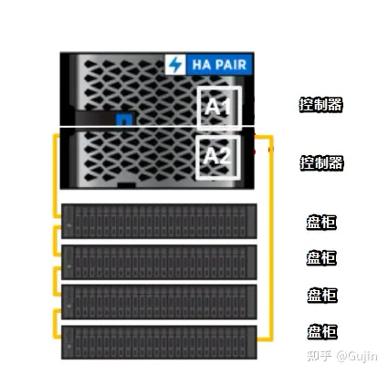

# Netapp
NetApp storage

## Arch
The NetApp storage architecture is organised into disks, aggregates, RAID groups, volumes, Qtrees and LUNs

* physical resources
	* node: 在NetApp存储中指的是每个控制器. Every node must have a root aggregate for storage system configuration file, 控制器也可称为节点，是一个物理设备，也是存储的核心部件，正常情况下，一台存储由两个组成HA的控制器，以及若干盘柜组成。两台控制器均能识别到所有盘柜中的磁盘。netapp存储划分磁盘的关键特点上 磁盘有归属，聚合及组成聚合的磁盘是归节点01管理还是节点02管理，是需要定义清楚的。这就形成一个现象，即便是构成同一台存储中的两个HA控制器，平时也像独立设备一样各管各盘，各做各事，只有故障时才会出现一台控制器接管另一条的业务。
	* disks：磁盘
	* aggregates: an aggregate is a set of physical disks, 由多个磁盘按某种raid形式组成的磁盘阵列，不直接参与存放数据. •Aggregates are containers for the disks managed by a node，Aggregates必须分配给唯一控制器(节点)管理。控制器管理Aggregates时才有负载，不管理Aggregates时没有负载。Aggregates中业务读写繁忙程度决定控制器负载大小。
		* RAID groups: an attribute of aggregates. Aggregates are containers for the disks managed by a node
* logic resources
	* 
	* volumes: an aggregate has one or multiple volumes, 用户可以存放数据的
	* qtrees: we have our Qtrees which go in volumes. Qtrees are an optional component. If the containing volume is being accessed by a [NAS](https://www.flackbox.com/nas-network-attached-storage-overview) client, it will see the Qtree as a directory in the volume. They’re called Qtrees because one of their main functions is for quotas. You can limit the total size that the Qtree itself can grow to, or limit the amount of space that a user or group can use in the Qtree.
	* LUNS: Logical Unit Numbers, A LUN is specific to [SAN protocols](https://www.flackbox.com/fibre-channel-san-part-1-fcp-wwpn), The LUNs can either go in a Qtree or a volume, Best practice is to have a dedicated volume or Qtree for each LUN (do not put multiple LUNs in the same volume or Qtree).  if we're using SAN protocols we'll need to configure LUNs. LUNs are for SAN Protocols only - you wouldn't have LUNs if you were using only NAS protocols.
	* Flex volumes: FlexVolumes/Files/Lun均是在aggregate的基础上建立而成并分别为NAS(vol)和SAN(lun)提供数据服务。•FlexVol volumes allow you to manage the logical layer of the file system independently of the physical layer of storage. •A FlexVol volume is a volume that is loosely coupled to its containing aggregate. •When a FlexVol volume is created, it reserves a small amount of extra space (approximately 0.5 percent of its nominal size) from the free space of its containing aggregate. This space is used to store volume metadata
	* SVM： Storage virtual machine, 存储虚拟设备,Vservers，存在于集群和控制器之间，提供逻辑存储和网络资源，实现存储的资源统一调度，并实现统一存储的场景，其次提供无中断操作实现集群内数据的调度分配，以及为整个集群提供数据服务和逻辑端口(LIF), An SVM serves data to clients and hosts from one or more volumes, through one or more network logical interfaces (LIFs).
		* 管理SVM：设置集群过程中会自动为集群创建管理SVM，管理SVM代表集群
		* 节点SVM：节点加入集群时会创建节点SVM，节点SVM代表集群中的各个节点
		* 系统SVM：系统会自动在IP空间中创建系统SVM以实现集群级别的通信
		* 数据SVM：数据SVM表示提供数据的SVM，设置集群后，集群管理员必须创建数据SVM并为这些SVM添加卷，以便于从集群进行数据访问。集群必须至少具有一个数据SVM，以便向器客户端提供数据。
	* export policy: Export policies enable you to restrict access to   volumes to clients that match specific IP addresses and specific authentication types. An export policy with export rules must exist on  a Vserver for clients to access data.Export policies consist of individual export rules.Export rules are processed in the order in which they appear in the export policy. Export rules specify the authentication types that are required for both read-only and read/write operations.
		* export policy rule example
		```sh
		-protocol nfs3
        -clientmatch 10.1.16.0/255.255.255.0
        -rorule any
        -rwrule krb5
	   ```
		

		


Netapp存储常用的协议
* NFS：network file system 网络文件系统，主要使用在linux环境中，能支持不同类型的系统之间通过网络进行文件访问共享(NAS)
* CIFS：common internet file system， 只在windows主机上提供网络文件共享(NAS)
* SNMP
* FC
* iSCSI
* FCoE
* NVMe/FC


![[Computer-Science/docs/5.Computer_Storage/Untitled Diagram.svg]]