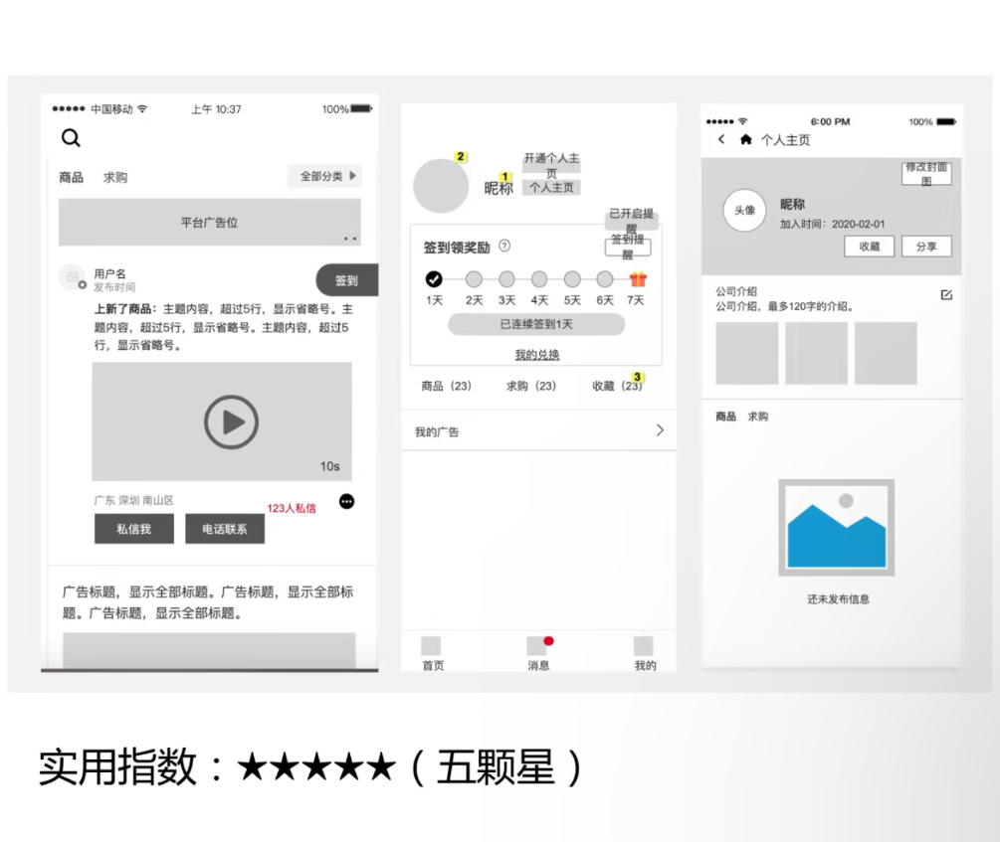
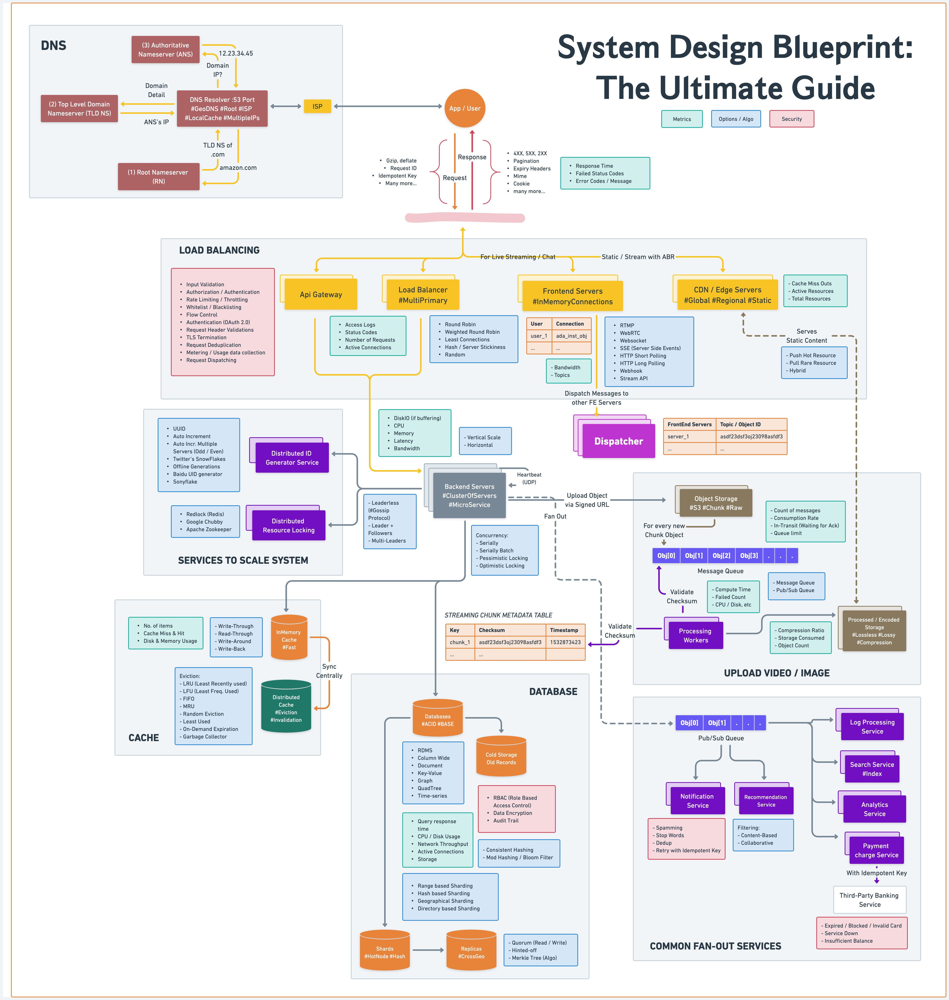

# 原型设计

Producer：产品经理
Tool：        Figma, 蓝湖, 墨刀, Axure, Sketch(收费)
原型图：描绘产品的界面长什么样，功能如何设计、摆放，有哪些内容

# 交互设计

# UI设计
Producer：UI设计师
Customer：前端开发
工具：Figma，PS，AI

# 架构图

总体架构
逻辑架构
网络架构

系统架构
信息架构

运行架构
部署架构

## 应用架构图
## 功能架构图
Producer： 产品经理
## 产品架构图

Producer： 产品经理
Customer：研发，基于此产出技术架构图

## 业务架构图

## 数据架构图

## 技术架构图
Producer：研发架构师

网站架构
