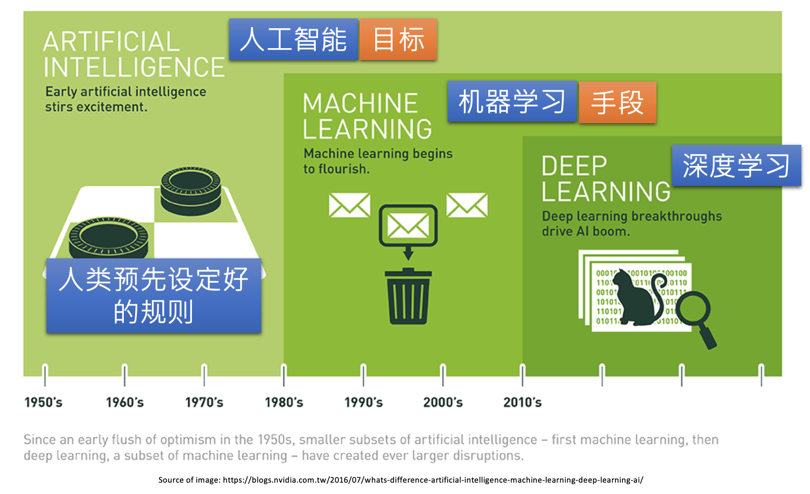
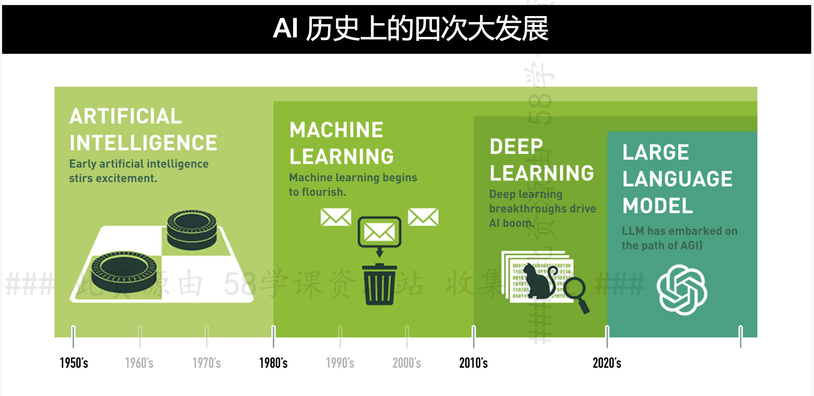
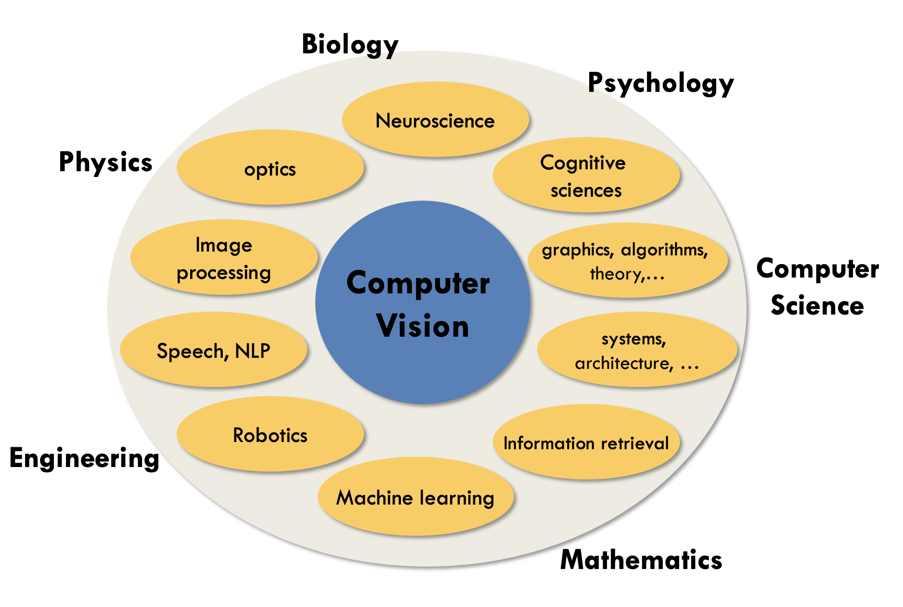

AI:
* Machine Learning
* Deep learning
* Foundation model


# AI & ML & DL





人工智能：模仿人类智能产生智能行为
机器学习：计算机自己从数据中学习并具备预测能力，是人工智能主要实现方式
深度学习：机器学习的一种独特学习方式，模拟大脑神经元
算法：机器学习的核心是算法，从数据中学习的方法，不同算法用不同的方法（优化程序）进行学习
模型：算法学习后的输出结果，是算法学到的知识
数据挖掘：从大量数据中挖掘隐含信息，它可以是通过机器学习，数据分析，甚至excel也可以

# 人工智能

人工智能（英语：Artificial Intelligence，缩写为 AI）亦称机器智能，指由人制造出来的机器所表现出来的智能。通常人工智能是指通过普通计算机程序的手段实现的人类智能技术。

- 数据
- 算法
- 计算平台

人工智能：
* 计算智能：快速计算，记忆和储存能力
* 感知智能：视觉、听觉、触觉等感知能力，如语音识别、语音合成、图像识别
* 认知智能：理解、解释的能力

人工智能也可以分成两类：
* 强人工智能：强人工智能观点认为“有可能”制造出“真正”能推理（Reasoning）和解决问题的智能机器，并且，这样的机器将被认为是具有知觉、有自我意识的。像绝大多数科幻电影中的机器人就是在这范畴弱人工智能：
* 弱人工智能观点认为“不可能”制造出能“真正”地推理和解决问题的智能机器，这些机器只不过“看起来”像是智能的，但是并不真正拥有智能，也不会有自主意识。我们目前阶段的人工智能，其实都是弱人工智能。

AI：
* 判别式AI：分类，回归
* 生成式AI/AIGC：Generative AI/AI-Generated Content; 给出的结果是全新内容，如自然语言，图像，音频；生成式AI与大语言模型都是深度学习模型的分支
	* 图像生成：EditGAN, Deepfake, DALL-E, Midjourney, Stable Diffusion, 文心一格
	* 视频生成：Deepfake, videoGPT, Gliacloud, Make-A-Video, Imagen video
	* 文本生成: JasperAI, Copy.ai, 移云小梦, AI dungeon, ChatGPT
	* 音频生成: DeepMusic, WaveNet, DeepVoice, MusicAutoBot
	* 游戏生成: rct AI, 超参数, 腾讯AI Lab
	* 代码生成: Github Copilot, Replit, CodeGeeX, Mintlify

# AI研究领域

AI研究领域：
* Voice Recognition/VC/语音: 理解人的听觉模块，从多个声音筛选你想要的声音
	* 语音识别 Speech Recognition
	* 语音增强
	* 语音生成
* NLP/自然语言处理：理解人的语言模块，语言的理解，认知
	* 基础研究：
		* 语法与句法分析
		* 语义分析
		* 篇章分析
		* 语言认知模型
		* 语言表示与深度学习
		* 知识图谱与计算：Knowledge Graph知识抽取、知识表示、知识融合、知识推理 
	* 应用研究
		* 文本分类与聚类
		* 中文自动分词
		* 信息抽取
		* 文本情感分析
		* 自动文摘/信息摘要
		* 信息检索
		* 信息推荐与过滤
		* 自动问答QA
		* 对话 dialog
		* 机器翻译
		* 社会媒体处理
		* 语音技术
			* 说话人识别
			* 语音合成
			* 语音识别
		* 文字识别
		* 多模态信息处理
		* 医疗健康信息处理
		* 多数民族语言信息处理
* **Computer Vision, CV**/计算机视觉：理解人的视觉模块，图像的识别、理解，目标跟踪、检测
	* 目标检测
	* 目标识别：人脸识别
	* 图像分类
	* 图像分割
	* 图像理解
	* 姿态估计
	* SLAM(定位和地图构建)
* AIGC


* **Recommender Systems**  / Recommendation
* 无人驾驶运动规划(路径规划)
* Expert Systems
* Multi-Agent systems
* Evolurionary Computation
* Fussy Logic and Rough Set
* Robotics and Perception
* Planning and Scheduling
* AI for Hybrid Cloud
* 模式识别
* 

人工智能应用领域：

* 人脸识别
* 指纹识别
* 虹膜识别
* 掌纹识别
* 情感识别
* 医学诊断
* Healthcare

图像预处理：

* 图像去燥
* 图像增强
* 图像分割

指纹识别
基于Haar的人脸检测
基于HoG特征的物体检测


## NLP
NLP：将自然语言转换为一种计算机能理解的形式。NLP底层原理涉及语言学，计算机科学和统计学，涉及对语言的结构，语义，语法和语用等方面的研究，对大规模语料库的统计分析和模型建立。
NLP应用：
* 机器翻译
* 问答系统
* 情感分析
* 文本摘要


large language models: 
* Chatgpt: OpenAI
* LlaMa: Meta & Microsoft, https://github.com/facebookresearch/llama

Text translation
* 百度翻译API：https://ai.baidu.com/ai-doc/MT/4kqryjku9
* 开源翻译API：https://github.com/LibreTranslate/LibreTranslate

NLP领域算法
* 朴素贝叶斯
* 隐马尔可夫模型HMM
* 条件随机场CRF
* 循环神经网络RNN
* LSTM
* NLP中的Attention机制
* 特征抽取器Tranformer
* BERT
* transformerXL
* GPT/GPR2.0
* XLnet


NLP的研究方向：
* 文本向量化embedding
* 序列标注任务
* 文本分类
* 信息提取任务
* 复杂应用场景任务

NLP一般流程：
* 获取语料：语料：是NLP任务所研究的内容。通常用一个文本集合作为语料库(Corpus)。来源：
	* 已有语料：积累的文档
	* 下载语料：
	* 抓取语料：
* 预料预处理
	* 语料清洗：留下有用的，删掉噪声数据。常见的数据清洗方式：
		* 人工去重、对齐、删除和标注等，
		* 或者规则提取内容、正则表达式匹配、根据词性和命名实体提取、编写脚本或代码批处理等
	* 分词：将文本分成词语，常见分词算法：
		* 基于字符串匹配的分词方法，基于理解的分词方法，基于统计的分词方法，基于规则的分词方法
	* 词性标注：给词语打词类标签：如形容词，动词，名称等，在情感分析，知识推理等任务中需要，常见词性标注方法：
		* 基于规则
		* 基于统计：如基于最大熵的词性标注，基于统计最大概率输出词性和基于HMM的词性标注
	* 去停用词：去掉文本特征没有任何贡献作用的字词，比如标点符号，语气，人称等
* 特征工程：把分词表示成计算机能够计算的类型，一般为向量。常用的表示模型：
	* 词袋模型(Bag of word, BOW): TF-IDF
	* 词向量:
		* One-bot
		* Word2Vec
* 特征选择选择合适的，表达能力强的特征。常见的特征选择方法：
	* DF，MI，IG，CHI，WLLR，WFO
* 模型训练
	* 机器学习模型：KNN，SVM，NaiveBayes，决策树，GBOT，K-means等
	* 深度学习模型：CNN，RNN，LSTM，Seq2seq，FastText，TextCNN
	* 注意过拟合，欠拟合问题：
		* 过拟合：在训练集上表现很好，但在测试集上表现很差，常见解决方法：
			* 增大数据等训练量
			* 增加正则化项，如L1正则和L2正则
			* 特征选取不合理，人工筛选特征和使用特征选择算法
			* 采用Dropout方法等
		* 欠拟合：模型不能很好地拟合数据。常用解决方法：
			* 添加其他特征项
			* 增加模型复杂度，比如神经网络加更多层，线性模型通过添加多项式使模型泛化能力更强
			* 减少正则化参数，正则化的目的是用来防止过拟合的，但是现在模型出现了欠拟合，则需要减少正则化参数
	* 注意梯度消失和梯度爆炸问题
* 评价指标
	* 错误率，精度，准确率，精确度，召回率，F1衡量
	* ROC曲线，AUC曲线
* 模型上线应用
	* 1. 线下训练模型，将模型做线上部署
	* 2。在线训练，在线训练完后把模型pickle持久化
## CV

* [jiajunhua/ahong007007-Awesome_Computer_Vision](https://github.com/jiajunhua/ahong007007-Awesome_Computer_Vision)
* [jbhuang0604/awesome-computer-vision](https://github.com/jbhuang0604/awesome-computer-vision)


Compuet Vision and other subject



* Computer Vision
	* object detection
		* face detection
	* object recognition
		* facial recognition
	* image classification
	* image captioning
	* action classification
	* Image Segmentation


Convolutional Neural Networks (CNN) have
become an important tool for object recognition

### Image Processing
opencv library using python

### Face application
* face detection
* facial recognition

# AI算法
要求：
* 掌握常见算法，理解算法原理+分析+代码，应用场景
* 知道什么场景下应用什么技术，解决什么问题，能实现什么效果
AI 算法： 算法独立于具体实现细节，是一种抽象概念
* Machine Learning/机器学习算法：
	* 线性回归/Linear Regression
	* 逻辑回归/Logistic Regression/LR
	* K邻近/KNN
	* K-均值算法/K-means
	* k均值聚类/K-means clustering
	* 朴素贝叶斯/Naive Bayes/NB
	* 决策树算法/Decision Tree/DT：用于分类和回归问题，通过递归将数据集分割成多个子集，并根据特征属性进行判断，最终生成一个决策树模型
	* 随机森林/Random Forest/RF
	* 支持向量机/Support Vector Machines/SVM
	* 支持向量回归/Support Vector Regression/SVR
	* 降低维度算法/
	* 判别分析DA
	* 提升算法boosting
	* 装袋算法bagging
	* 强化学习
	* Gradient Boost
	* Adaboost
	* 主成分分析/Principal Component Analysis
* 深度学习：原理+应用
	* 神经网络/Neural Network/NN
	* CNN/卷积神经网络/Convolutional
	* RNN/循环神经网络/Recurrent
	* GNN/图神经网络
	* GAN/生成对抗网络/Generative Adversarial nework
	* ANN/人工神经网络
	* FNN/前馈神经网络/Feedforward
	* DQN
	* LSTM/长短期记忆网格
	* DBN/深度置信网络
	* MLP/多层感知机
	* BM/玻尔兹曼机
	* AE/自编码器/Autoencoders
	* ResNet/残差神经网络/Residual Neural Nework
	* 注意力机制：Attention Mechanism
Transfer Learning/迁移学习
反向传播算法

# AI模型
要求：
* 模型构建
	* 掌握模型构架流程，涉及角色，每个角色工作内容
	* 清楚知道每个角色该做什么
	* 建模流程：
* 模型验收
	* 掌握模型类型，每个模型使用哪些评估标准，指标如何计算
	* 能自己去测试模型某些评估指标
* 知道模型相关名词，偏差方差，过拟合欠拟合，特征清洗和数据变换，训练集测试集验证集，跨时间测试于回溯测试，联合建模与联邦学习
AI model：AI模型，模型是算法在特定数据集上训练得到的结果，用于对新输入的数据进行预测或分类，模型是算法在实际问题中的具体应用。是算法的具体实例化，包括特定的参数，权重和偏置等。模型通过学习训练数据等模式和规律进行预测或推断。如基于决策树算法训练得到的具体决策树可被视为一个模型，通过输入新数据样本，该模型可以根据决策树的分支条件进行分类或预测；

* 机器学习模型
	* 生成模型
		* GDA/Gaussian discriminant analysis
		* GMM/Gaussian Mixture model
* 深度学习模型
	* 图像分类模型：AlexNet, vgg, resnet.mobilenet, efficient
	* Transformer：算法：注意力机制
	* 大语言模型/LLM
		* GPT-3：基于Transformer的思想
		* BERT：基于Transformer的思想
		* XLNet
		* LlaMa
	* 深度生成模型/Deep Generative Model/生成式AI/生成式模型：* AIGC/AI生成模型/
		* GAN/Generative adversarial nets
		* VAE/变分自编码器
		* Autoregressive model，Normalizing flow，Energy-based model
		* Flow-based model
		* Diffusion model/扩散模型：在CV和NLP有广泛应用
			* stable diffusion
	* 图像分割：Segment Anything
* Foundation model


# AI框架
AI framework：AI 框架，框架是一种软件工具集，提供开发和实现AI模型的基础设施和支持 ，框架包括一系列已实现的算法和模型，及相应工具和函数库，为开发者提供高级API和工具，使其能更便捷地构建，训练和评估AI模型。
* TensorFlow
* 深度学习框架
	* Caffe
	* CNTK：Microsoft；Lua, Python
	* **TensorFlow**：google；C++
	* **PyTorch**：facebook；C++


# 机器学习

* 数据科学的一个重要领域，通过数据分析使程序具有学习数据内在规律的能力，程序中没有明确的逻辑过程
* 技术：数理统计，概率论
* 目的：数据拟合

从广泛的概念来说，机器学习是人工智能的一个子集，是实现人工智能的重要方法。人工智能旨在使计算机更智能化，而机器学习已经证明了如何做到这一点。 简而言之，机器学习是人工智能的途径和应用 。 即以机器学习为手段解决人工智能中的问题。机器学习在近30多年已发展为一门多领域交叉学科，涉及概率论、统计学、逼近论、凸分析、计算复杂性理论等多门学科。通过使用从大量数据中反复学习到的算法，机器学习可以改进计算机的功能，而无需进行明确的编程。

机器学习和人工智能之间并不能画等号，毕竟机器学习实际上是研究算法的学科，而人工智能志在模拟人的思维和行为。

随着大数据的迅速发展，机器学习变得越来越重要，它有力地处理大量数据，做出准确的预测。机器学习中就有好多个经典的算法，其中就包含了神经网络(深度学习可看成是神经网络的升级版)。

机器学习是一种重在寻找数据中的模式并使用这些模式来做出预测的研究和算法的门类。机器学习是人工智能领域的一部分，并且和知识发现与数据挖掘有所交集。

# 深度学习

* 机器学习的分支，基于数据表达与信息传递，层层过滤和提取信息中的结构规律
* 技术：神经网络(NN)
* 目的：知识提取

深度学习是一个基于经验的领域。狭义地说就是“很多层”的神经网络，在若干测试和竞赛下，尤其涉及语音、图像等复杂对象的引用中，深度学习取得优越的性能。深度学习是一种实现机器学习的技术。

深度学习本来并不是一种独立的学习方法，其本身也会用到有监督和无监督的学习方法来训练深度神经网络。但由于近几年该领域发展迅猛，一些特有的学习手段相继被提出（如残差网络），因此越来越多的人将其单独看作一种学习的方法。最初的深度学习是利用深度神经网络来解决特征表达的一种学习过程。深度神经网络本身并不是一个全新的概念，可大致理解为包含多个隐含层的神经网络结构。为了提高深层神经网络的训练效果，人们对神经元的连接方法和激活函数等方面做出相应的调整。其实有不少想法早年间也曾有过，但由于当时训练数据量不足、计算能力落后，因此最终的效果不尽如人意。深度学习摧枯拉朽般地实现了各种任务，使得似乎所有的机器辅助功能都变为可能。无人驾驶汽车，预防性医疗保健，甚至是更好的电影推荐，都近在眼前，或者即将实现。当下深度学习在计算机视觉、自然语言处理领域的应用远超过传统的机器学习方法


科学不是战争而是合作，任何学科的发展从来都不是一条路走到黑，而是同行之间互相学习、互相借鉴、博采众长、相得益彰，站在巨人的肩膀上不断前行。

纵观机器学习发展历程，研究热点可以简单总结为2000-2006年的流形学习、2006年-2011年的稀疏学习、2012年至今的深度学习。未来哪种机器学习算法会成为热点呢？深度学习三大巨头之一吴恩达曾表示，“在继深度学习之后，迁移学习将引领下一波机器学习技术”。但最终机器学习的下一个热点是什么，谁又能说得准呢。

# 数据科学

数据科学(Data Science) 是一门基于数据**统计、分析、预测**的学科，**通过对数据的洞察**，来解释事物的**规律**。是AI的一个更加明确的表达。AI是一个相对宽泛的概念。在学科领域一般用数据科学

数据科学目前主要分为机器学习(Machine Learning)和深度学习(Deep Learning) 两个领域

* ML的内容比较传统，近年来变化不大，不同时期有不同叫法：数据统计、数据挖掘、商业智能、机器学习
* DL在近些年有巨大突破，由于神经网络的实用化，出现大量基于文字、图像、声音、生物特征的专业应用。

数据科学始于2011年。他需要：

* 计算机编程能力—— 能**处理**数据
* 数学和分析能力——能**分析**数据
* 行业知识——能**理解**数据


数据科学家(Data Scientist)学习路径：
* Fundamentals
* Statistics
* Programming
* Machine Learning
* Text Mining/Natural Language Processing
* Data VIsualization
* Big Data
* Data Ingestion
* Data Munging
* Toolbox

# References

* 作者：腾讯云技术社区, 链接：https://zhuanlan.zhihu.com/p/58449395

* 作者：育心, 链接：https://www.zhihu.com/question/57770020/answer/249708509


# 数据集
* ImageNet：100万张高分辨率图片，分为1000个类别，是目前最大图像分类数据集
* MNIST：手写数字识别数据集，包括60,000张训练图片和10,000张测试图片，用于识别手写数字0-9
* CIFAR-10: 包括60,000张32x32像素的彩色图片，分10类，每类6,000张图
* COCO：超过200000张标注图片，用于图像识别，目标检测，语义分割等
* VOC：20类多图片和标注，用于目标检测，分割和识别
* UCI：包括很多数据集，涉及到分类，回归，聚类，文本，图像等多领域，用于学习和研究
* Speech Commands：65000个1秒的语音样本，用于语音识别
* OpenAI Gvm：包括一些列强化学习环境，用于测试和评估深度强化学习算法
* Labeled Faces in the wild：13000张人脸图片，用于人脸识别
* Cityscapes: 5000张城市街景图，用于语义分割任务

数据集网站：
paper with code
# AI工具

## 1 Anaconda
Anaconda: 隔离不同AI项目所用到的库的版本，
Anaconda官网: https://www.anaconda.com/
conda:https://conda.io/projects/conda/en/stable/index.html
```sh
conda list # 列出所有已安装的库
pip install xgboost # 安装xgboost
conda install xgboost # pip 或者conda 都可以，pip安装成功率大一些
```

## 2 Python

Python官网：https://www.python.org/

* numpy
* pandas
* edge-tts

## 3 JupyterNotebook
JupyterNotebook：网页版python环境
官网：https://jupyter.org/
安装jupyter插件查看目录：https://blog.csdn.net/weixin_42521211/article/details/113784404
## 4 Huggingface
https://huggingface.co/

https://replicate.com/

Pycharm


包


## ffmpeg
处理视频，音频。应用：播放器，

视频文件格式：
.avi .mpg .vob .mov .flv .mkv 
视频封装格式
AVI、RMVB、MKV、ASF、WMV、MP4、3GP、FLV
有损压缩：MPEG、WMV、RMVB
无损压缩：

视频编码格式
H264、Xvid

MPEG-1/-2 < WMV/7/8 < RM/RMVB < Xvid/Divx < AVC/H.264

音频编码格式
MP3、AAC


换背景
利用ffmpeg实现rtmp推流：https://zhuanlan.zhihu.com/p/101960559

## opencv
官网：https://opencv.org/
opencv：开源计算机视觉库，提供大量图像处理和计算机视觉算法，可供C++，python，java语音使用。用途：
* 图像和视频处理：读取，写入，处理图像和视频，提供图像处理函数，如滤波，阈值处理，形态学处理和边缘检测等，提供视频处理函数，如视频捕获，视频压缩，视频编解码
* 特征检测和匹配：提供 特征检测和匹配函数，如SIFT，SURF，ORB等。用于图像检测和描述特征及不同图像之间匹配特征
* 目标检测和跟踪：提供目标检测和跟踪函数，如Haar特征检测器，HOG特征检测器和卡尔曼滤波器等，用与检测和跟踪图像中的目标，如人脸，行人，汽车等
* 三维重建：提供三维重建函数，如立体匹配和三维重建，用于从双目图像中计算深度信息，并重建三维场景
* 机器学习：机器学习函数，如支持向量机，随机森林，神经网络等。用于分类，回归，聚类
**应用**
* ***人脸识别**: OpenCV库提供了一些人脸识别函数，如Haar特征检测器和LBPH人脸识别器等。这些函数可以用于检测和识别图像中的人脸。
* ***视频监控**: OpenCV库可以用于视频监控系统中，例如安全监控和交通监控等。它可以用于检测和跟踪运动物体，并进行目标识别和分析。
* ***机器人视觉**: OpenCV库可以用于机器人视觉中，例如机器人导航和机器人抓取等。它可以用于计算机器人的位置和姿态，并执行目标追踪和物体抓取等任务。
* ***医学影像**: OpenCV库可以用于医学影像中，例如医学图像分析和医学诊断等。它可以用于图像分割、特征提取和分类等任务。
* ***虚拟现实**: OpenCV库可以用于虚拟现实中，例如虚拟现实游戏和虚拟现实培训等。它可以用于计算相机的位置和姿态，并生成虚拟场景。


## Dlib


## keras


## Colab


## 移动端DL框架
深度学习要落地，部署到手机等移动端平台的框架

* TensorFlow Lite(Google, 2017)：[TensorFlow Lite](https://tensorflow.google.cn/lite/) [Android-TensorFlow-Lite-Example](https://github.com/amitshekhariitbhu/Android-TensorFlow-Lite-Example)
* Core ML(Apple): 
	* https://developer.apple.com/documentation/coreml
	* https://github.com/likedan/Awesome-CoreML-Models
* Caffe2(Facebook)
	* https://github.com/facebookarchive/caffe2
	* https://caffe2.ai/docs/zoo.html
	* https://github.com/caffe2/models
* NCNN(腾讯)
	* https://github.com/Tencent/ncnn
	* https://github.com/BUG1989/caffe-int8-convert-tools.git
* Paddle-Mobile(百度)
	* https://github.com/PaddlePaddle/paddle-mobile
	* https://github.com/PaddlePaddle/Paddle
* QNNPACK(Facebook)
	* https://github.com/pytorch/QNNPACK
* MACE(小米)
	* https://github.com/XiaoMi/mace
	* https://github.com/XiaoMi/mace-models
* MNN(阿里)：
	* https://github.com/alibaba/MNN
Mediapipe: google, https://developers.google.com/mediapipe/solutions/guide
ExecuTorch: Meta, https://pytorch.org/executorch/stable/index.html


## 深度学习框架

用于训练模型的框架
各类框架快速入门：https://github.com/longpeng2008/yousan.ai


* Tensorflow(Google)
* Pytorch(Facebook.Meta)
* Caffe
* Mxnet(Amazon)
* Keras
* Paddlepaddle(百度)
* CNTK(微软)
* Matconvnet
* Deeplearning4j
* Chainer
* Lesagne/Theano
* Darknet
## Tensorflow

https://www.tensorflow.org/?hl=zh-cn
简单粗暴 TensorFlow 2: https://tf.wiki/zh_hans/
《TensorFlow Custom Layer》：https://www.tensorflow.org/tutorials/customization/custom_layers

《TensorFlow Text Vectorization》：https://www.tensorflow.org/api_docs/python/tf/keras/layers/experimental/preprocessing/TextVectorization
TensorFlow 的安装与环境配置：https://tf.wiki/zh_hans/basic/installation.html


TensorFlow 2 官方网站​ ：https://www.tensorflow.org/overview

OpenVINO 官方中文文档​ https://docs.openvinotoolkit.org/cn/latest/index.html：

了解 TF2 OD API 和 MobileNet-SSD 等​  ​：https://github.com/tensorflow/models/tree/master/research/object_detection

预装环境并验证运行：​

TensorFlow 2 CPU-only PIP安装

以下任选​

Windows 安装 OpenVINO 2021.1​ ：https://docs.openvinotoolkit.org/2021.1/openvino_docs_install_guides_installing_openvino_windows.html

Linux 安装 OpenVINO 2021.1​  ：https://docs.openvinotoolkit.org/2021.1/openvino_docs_install_guides_installing_openvino_linux.html

macOS 安装 OpenVINO 2021.1​：https://docs.openvinotoolkit.org/2021.1/openvino_docs_install_guides_installing_openvino_m
## Pytorch

## 部署工具
OpenVINO(Intel): 是一个Pipeline工具集，同时可以兼容各种开源框架训练好的模型，拥有算法模型上线部署的各种能力，只要掌握了该工具，你可以轻松的将预训练模型在Intel的CPU上快速部署起来。优化部署的框架
的[TensorRT](https://link.zhihu.com/?target=https%3A//developer.nvidia.com/nvidia-tensorrt-download)(Nvidia)
