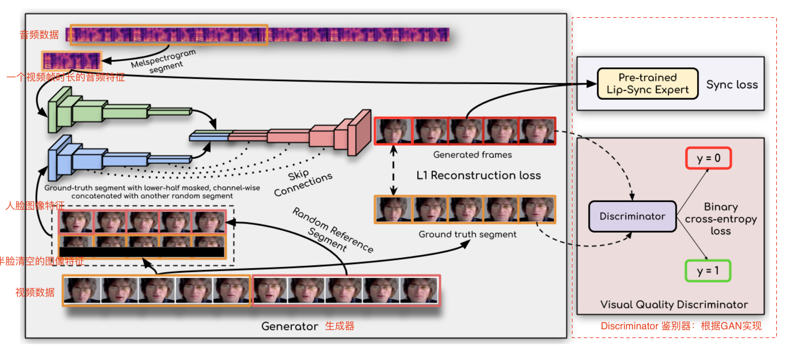

## 聊天机器人
* 商用产品
	* chatgpt
* 开源
	* chatGLM
	* 

## AI绘画(Text2Img / Img2Img)
### Stable Diffusion

论文：https://arxiv.org/pdf/2112.10752.pdf
代码：https://github.com/CompVis/stable-diffusion
stable-diffusion 2.0: https://github.com/Stability-AI/stablediffusion
stable-diffusion UI:  https://github.com:AUTOMATIC1111/stable-diffusion-webui.git

根据文本生成图片：文本 - 图像模型

https://zhuanlan.zhihu.com/p/609577723
1. Install anaconda: https://www.anaconda.com/download
2. source ~/.zshrc
3. brew install cmake protobuf rust git wget python@3.10
4. Install pytorch: https://pytorch.org/
5. Install stable-diffusion-webui: git clone git@github.com:AUTOMATIC1111/stable-diffusion-webui.git
6. 下载ai绘图基础模型：这里以stable diffusion 2.0训练模型为例，在[https://huggingface.co/stabilityai/stable-diffusion-2](https://link.zhihu.com/?target=https%3A//huggingface.co/stabilityai/stable-diffusion-2)页面的“file” tag里面找到并下载768-v-ema.ckpt。下载好后，把下载好的ckpt文件放在“你的用户名”> Stable-diffusion-webui>Models>Stable-diffusion文件夹里。
7. 运行 
	1. pip3 install gfpgan
	2. pip install ftfy regex tqdm; pip install git+https://github.com/openai/CLIP.git
	3. cd stable-diffusion-webui
	4. ./webui.sh

gfpgan 安装不上的问题：https://blog.csdn.net/GodGump/article/details/129278722

https://blog.csdn.net/lkhk2008/article/details/129624374

模型
stable diffusion 2.0:[https://huggingface.co/stabilityai/stable-diffusion-2](https://link.zhihu.com/?target=https%3A//huggingface.co/stabilityai/stable-diffusion-2)

二次元模型：Abyssorange mixs2

插件：
* 插件列表：https://gitee.com/akegarasu/sd-webui-extensions/raw/master/index.md
* 汉化插件：https://github.com/dtlnor/stable-diffusion-webui-localization-zh_CN
* ControlNet：
Lora

 VE

## Text2Audio
Text-To-Speech: TTS技术
https://ttsmaker.cn/
https://github.com/sekift/so-vits-models
https://github.com/VideoCrafter/VideoCrafter

https://github.com/sstzal/DiffTalk

https://github.com/rany2/edge-tts

# AI视频 (AI-driven media)

text + image -> video 
商业产品：
- Runway ML：https://runwayml.com/      quality and realism
- PikaLabs：https://pika.art/         more control and flexibility

## AI作曲

## AI换脸

图像换脸：
* insightface
* swapface
* roop: [stable diffusion 插件](https://github.com/s0md3v/sd-webui-roop)
视频换脸：
* suapface: 收费
* faceswap
* roop：开源 https://github.com/s0md3v/roop    hugging face [Google Colab](https://colab.research.google.com/drive/157RluIDQnvjQy9UBFXL8U5Q-UwgZPqAK) https://github.com/dream80/roop_colab
* deepfaceLab：[googleColab](https://colab.research.google.com/github/chervonij/DFL-Colab/blob/master/DFL_Colab.ipynb) https://github.com/chervonij/DFL-Colab https://github.com/iperov/DeepFaceLab
* deepfaceLive：https://github.com/iperov/DeepFaceLive  [论文](https://arxiv.org/pdf/2005.05535.pdf)
直播换脸
* deepface
* swapface

## Audio2Face
https://github.com/FACEGOOD/FACEGOOD-Audio2Face
https://github.com/Zz-ww/SadTalker-Video-Lip-Sync

# AI动作迁移
两个有趣的AI动作迁移(Motion Transfer)项目: Pose Animator，avatarify
https://wrong.wang/blog/20200516-%E4%B8%A4%E4%B8%AA%E6%9C%89%E8%B6%A3%E7%9A%84ai%E5%8A%A8%E4%BD%9C%E8%BF%81%E7%A7%BBmotion-transfer%E9%A1%B9%E7%9B%AE-pose-animatoravatarify/

# Awesome

https://github.com/zengyh1900/Awesome-Image-Inpainting
https://github.com/jbhuang0604/awesome-computer-vision

# 人脸修复
gfpgan: 
gfpgan是一种基于生成对抗网络的图像超分辨率算法，提升视频画质，gfpgan网络能增加视频细节和清晰度
https://zhuanlan.zhihu.com/p/617039643

## AI数字人(语音+图像->视频)

数字人类型：
* 卡通
* 2.5D：AI驱动(唇形驱动+动作驱动+TTS+高分辨率生成算法)
* 3D：动捕技术+真人驱动
* 超写实数字人：数字孪生，数字分身

Human-Video-Generation: https://github.com/yule-li/Human-Video-Generation
awesome-faceReenactment: https://github.com/DaddyJin/awesome-faceReenactment
awesome_talking_face_generation https://github.com/YunjinPark/awesome_talking_face_generation

现有商用产品：
* 国外
	* DID： https://www.d-id.com/
	* Heygen： https://app.heygen.com/guest/home
* 国内
	* 硅基
	* 腾讯智影

[**https://github.com/Zz-ww/SadTalker-Video-Lip-Sync**](https://github.com/Zz-ww/SadTalker-Video-Lip-Sync)

如需使用DAIN模型进行补帧需安装paddle

视频结果优化：
* ***视频防抖**
* **视频高清**
* **视频融合**
* **视频修复**
* 视频超分辨率: 
	* https://github.com/open-mmlab/mmagic
	* https://github.com/ckkelvinchan/RealBasicVSR
	* https://github.com/ckkelvinchan/BasicVSR_PlusPlus

  
动作迁移

faceRender：
* face-vid2vid

# Lip-Sync/Talking-Face/Audio2Lip

## 2D驱动
目前数字人项目基本基于GAN技术，现有项目基本基于wav2lip优化
2D驱动
基于wav2lip(GAN)
1. **wav2lip** 2020：(社区活跃高) 中文效果不好; 2D驱动 [Code](https://github.com/Rudrabha/Wav2Lip) [Colab](https://colab.research.google.com/github/ml4a/ml4a/blob/master/examples/models/Wav2Lip.ipynb) [Paper](https://arxiv.org/abs/2008.10010);2020  [论文解读](https://zhuanlan.zhihu.com/p/613996840)  [视频代码讲解](https://www.bilibili.com/video/BV1gs4y1P7Ve/?spm_id_from=333.337.search-card.all.click&vd_source=50ac7e35d44afea54a236dfa228f618f)
2. Wav2Lip-HD http://lihuaxi.xjx100.cn/news/1272759.html?action=onClick
3. Wav2Lip-GFPGAN： http://wed.xjx100.cn/news/282734.html?action=onClick ; https://yv2c3kamh3y.feishu.cn/docx/I8OLdvQSuoSRHXx5Hf2cJL32nE6
4. **video-retalking**：(改口型和内容) [**https://github.com/OpenTalker/video-retalking**](https://github.com/OpenTalker/video-retalking) ； 中文可能效果不太好； 2022；
5. **sadtalker**：(无限接近商用)  动作迁移 [github:SadTalker](https://github.com/OpenTalker/SadTalker); 图片+ 音频 = 视频 ； 2023; 2.5D驱动； [论文](https://arxiv.org/abs/2211.12194); [huggingface](https://huggingface.co/spaces/vinthony/SadTalker)
6. **DINET：**(改口型和内容) [github](https://github.com/MRzzm/DINet) ； 2023 清晰度比wav2lip高，但wav2lip比DINET快

8. 未来方向： **Talking face diffusion**
	1. DiffTalk: https://github.com/sstzal/DiffTalk
	2. DiffusionVideoEditing
9. https://arxiv.org/abs/2304.00471  [huggingface](https://huggingface.co/spaces/nota-ai/compressed-wav2lip)
基于NeRF
1. [AD-NeRF](https://github.com/YudongGuo/AD-NeRF): 2021
2. **RAD-NeRF(有UI界面)**: [Code](https://github.com/ashawkey/RAD-NeRF)2022
3. DFRF: 2022;  [Code](https://github.com/sstzal/DFRF)
4. GeneFace: 2023; [Code](https://github.com/yerfor/GeneFace) ; [Paper](https://arxiv.org/abs/2301.13430) [Project](https://geneface.github.io/)
5. GeneFace++: https://genefaceplusplus.github.io/
6. ER-NeRF: 2023 [Code](https://github.com/Fictionarry/ER-NeRF); 

7. **makeitalk**

MODA: https://github.com/DreamtaleCore/MODA

MCNET https://github.com/harlanhong/ICCV2023-MCNET 

### Wav2lip
[Peper](https://arxiv.org/abs/2008.10010) ｜  [Code](https://github.com/Rudrabha/Wav2Lip) ｜ [视频代码讲解](https://www.bilibili.com/video/BV1gs4y1P7Ve/?spm_id_from=333.337.search-card.all.click&vd_source=50ac7e35d44afea54a236dfa228f618f)

wav2lip是个两阶段模型。第一阶段是：训练一个能够判别声音与嘴型是否同步的判别器 ；第二阶段是：采用编码-解码模型结构（一个生成器 ，两个判别器）；也可基于GAN的训练方式，在一定程度上会影响同步性，但整体视觉效果稍好。

1. 对输入音频提取特征：MelFbank特征，维度80，帧率80帧/秒
2. 提取人脸图像特征：通过人脸检测模块从输入的图像/视频中提取人脸区域或人工指定一个区域作为人脸区域
3. 生成音频**特征块**与人脸图像的特征的特征对
	1. 特征块：块移(一张图片对应多少语音帧)：80/fps (80除以fps；80表示1秒钟有80个音频特征帧，fps表示1秒钟有多少视频帧)；  帧长16
	2. 人脸图片：3通道缩放到96x96 + 去掉下半张脸  [6x96x96]
4. 输入wav2lip网络生成带有口型的人脸
5. 将带有口型的人脸贴回输入图像，逐帧写成视频
6. 有ffmpeg将生成的视频与输入的音频融合生成最终的带有音频的视频

损失函数：
- L1Loss：像素级
- VggLoss：高维语义特征
- GANLoss
- SyncNetLoss

优势:
- 嘴型与声音的同步性好，得益于嘴型判别器
- 的强有力监督信号。
- 任意人脸对象、不同语种音频也能正常驱动。
- 推理速度还行。

不足:
- 虽然同步性好，但整体清晰度偏低，英文音频下的测试效果还好，中文音频中的牙齿部分还原度稍差，对中文的支持不够友好。
- Wav2Lip在发某些音的时候，嘴巴张开幅度忽然变大。
- 参考人脸图片侧脸时，脸部会不协调。主要是因为训练时将下半脸全都置0（显示是全黑区域），模型在预测时对于被mask掉的区域是没有参考信息的，上下半脸衔接就会出现瑕疵。

可优化的方向:
- 预处理用于训练的视频数据的清晰度。LRS2数据集的清晰度低（本人也没有LRS2/LRW数据集），如果训练数据都是模糊的，极大地限制模型复原牙齿部分。具体操作是利用超分模型提升脸部的清晰度，特别是嘴巴区域，可参考腾讯的超分模型[GFPGAN](https://link.zhihu.com/?target=https%3A//github.com/TencentARC/GFPGAN)。
- 增加模型输入的分辨率，但会增加训练时间和推理时间。
- 制作精细的下半脸mask，而不是像原论文直接mask掉下半脸的操作。具体操作是经过人脸关键点检测，然后根据关键点的点位得到固定大小的bbox，一个n帧视频中所有下半脸的点位的最大最小值（如68个关键点，点位2、点位14、点位8），对于大批量数据，似乎又不太合适。
- 对于驱动的人像，说话时频率过快，通过增加静默视频数据即可。静默视频是指嘴巴紧闭且不发出声音的视频片段。
- 修改网络结构，可能更容易训练。

收集视频:
- 各大短视频平台：B站、抖音、快手、小红书、youtube等；
- 类型：演讲、介绍、电视剧、新闻联播等；
- 编写批处理脚本：筛选、裁剪、图像增强、音频处理。

**数据集**: 
- [CMLR](https://link.zhihu.com/?target=https%3A//www.vipazoo.cn/CMLR.html)
- [HDTF](https://link.zhihu.com/?target=https%3A//github.com/MRzzm/HDTF)：
- [MEAD](https://link.zhihu.com/?target=https%3A//github.com/uniBruce/Mead)
- [VOX](https://link.zhihu.com/?target=https%3A//pan.baidu.com/s/1wBL34jZRSMq4aJX-l3_pBw)：xkfj
- HDTF：[elej](https://link.zhihu.com/?target=https%3A//pan.baidu.com/s/1UQ0I3L3FKxhA_PcS3YrL6w)
- 
### ER-NeRF

训练视频：25fps, 说话人出现在所有帧，分辨率512x512, 1-5分钟
预处理视频：
* extract audio：提取音频
* extract audio features: 提取音频特征  wav2vec or deepspeech
* extract images： 视频转图像
* extract semantics/face parsing：
* extract background image
* extract torso images and gt_images 提取躯干和
* extract face landmarks
* face tracking
* save transforms.json
## 3D Avatar 直播

X-Avatar: Expressive Human Avatars (CVPR2023) [Code](https://github.com/Skype-line/X-Avatar) [Paper](https://arxiv.org/abs/2305.04789) [Project](https://liuyebin.com/AvatarRex/)

Build an avatar with ASR, Sentence-transformer, Similarity Search, TTS and Omniverse Audio2Face： https://github.com/metaiintw/build-an-avatar-with-ASR-TTS-Transformer-Omniverse-Audio2Face

7. audio2face：[github](https://github.com/FACEGOOD/FACEGOOD-Audio2Face); 3D实时驱动

9. 建模工具(三维软件)：
	* 3DMax(建筑, 机械, 工业), Maya(影视动画, 电影特效), ZBrush(高模), C4D(栏目包装, 影视后期, 三维电商海报设计, 平面设计, UI设计, 工业设计)
	* Agisoft Metashape：360度人脸图片
	* RealityCapture：360度人脸图片, 收费
	* [MetaPerson Creator](https://metaperson.avatarsdk.com/): 只需一种图片
	* blender
10. 虚拟引擎:
	* Unreal Engine 5: https://www.unrealengine.com/zh-CN/download
		* 插件：
		* 模型编辑：
			* MetaHuman Creator: https://www.unrealengine.com/zh-CN/metahuman
	* unity
11. 面部驱动
	* Omniverse audio2face：https://www.nvidia.com/en-us/omniverse/apps/audio2face/
12. 身体驱动，动作捕捉
	* 道乐师动作捕捉软件：http://sunnyview.tech/
13. 文字转语音 Text2Audio
	* https://github.com/PaddlePaddle/PaddleSpeech
	* [Gtts API](https://pypi.org/project/gTTS/),
14. 对话模型
	* https://github.com/THUDM/ChatGLM2-6B
# 人脸关键点检测
https://zhuanlan.zhihu.com/p/514393887

### 人脸复原
### 去噪、超分辨率、去模糊和伪影去除

https://github.com/arlosefj/github_interest/blob/master/Face.md

# 人脸检测

安防监控、人证比对、人机交互、社交等领域都有重要的应用价值。数码相机、智能手机等端上的设备已经大量使用人脸检测技术实现成像时对人脸的对焦、图集整理分类等功能，各种虚拟美颜相机也需要人脸检测技术定位人脸，然后才能根据人脸对齐的技术确定人脸皮肤、五官的范围然后进行美颜。在人脸识别的流程中，人脸检测是整个人脸识别算法的第一步。

# 人脸识别
Openface：深度学习人脸识别**开源**库，聚焦于**移动设备**上实时人脸识别，旨在用少量数据实现高准确率 [Paper](https://www.cv-foundation.org/openaccess/content_cvpr_2015/html/Schroff_FaceNet_A_Unified_2015_CVPR_paper.html) [Code](https://github.com/TadasBaltrusaitis/OpenFace)
FaceNet: Google 
DeepFace：Facebook

# ffmpeg循环推流

https://lala.im/4816.html

# 语音识别
Automatic Speech Recognition：ASR
Upon receiving user's request, the [SpeechRecognition API](https://pypi.org/project/SpeechRecognition/) records the frequencies and sound waves from user's voice and translates them into text.

# Image/Video human Matting
抠图/抠视频应用：
* 直播场景：氛围营造，如教育直播，线上年会
* 实时通讯场景：用于保护用户隐私，如视频会议；
* 互动娱乐场景：增加趣味性，如影视编辑，抖音人物特效
基础技术：
* 实时语义分割
* 人像分割技术
* 人像抠图
* 视频人像抠图
算法探索：
* 优化边缘
* 无监督学习
* 多任务学习
* 知识蒸馏
* 模型轻量化
* 策略优化
* 

https://www.zhihu.com/question/68146993/answers/updated

https://blog.csdn.net/weixin_46737755/article/details/112553608?utm_medium=distribute.pc_relevant.none-task-blog-2~default~baidujs_baidulandingword~default-0-112553608-blog-104738652.235^v38^pc_relevant_sort_base1&spm=1001.2101.3001.4242.1&utm_relevant_index=3

Deep Image Matting:  (2017) 首个端到端预测alpha的算法，需要提供trimap图，现实中不太方便
Semantic Image Matting: 需要提供trimap图
BackgroundMatting: https://github.com/senguptaumd/Background-Matting (非实时视频抠图) 2020; 不需要Trimap图，但需提供一张无前景的纯背景图，不支持高分辨率
BackgroundMattingV2: https://github.com/PeterL1n/BackgroundMattingV2  (实时视频抠图) 2021；不需要Trimap图，需提供一张无前景的纯背景图
Semantic Human Matting: 首个无需trimap生成alpha图
HAttMatting: 仅有效果图，无测试模型，存在很大质疑
MMNet：(2017) 无需Trimap，在移动设备上实现实时自动抠图，网络体积小，效果有待验证
Fast Deep Matting: 无需Trimap, 效果有待验证 
MODNet： 无需Trimap
RobustVideoMatting: https://github.com/PeterL1n/RobustVideoMatting (实时视频抠图) 2021

## 声音克隆

VALL-E-X: https://github.com/Plachtaa/VALL-E-X
real-time-voice-cloning: https://github.com/CorentinJ/Real-Time-Voice-Cloning
MockingBird: https://github.com/babysor/MockingBird
bark: https://github.com/suno-ai/bark
so-vits-svc: https://github.com/svc-develop-team/so-vits-svc 
Bert-VITS2: https://github.com/fishaudio/Bert-VITS2; 基于中文训练的底模，所以中文表现很好
elevenlabs: https://github.com/elevenlabs/elevenlabs-python

# object/Image dection

# Image Classification 图像分类
图像分类即模式分类问题
应用：
* 10分类的灰度图像手写数字识别任务mnist
* 10分类的cifar10，100分类的cifar100
* imagenet: 超1000万图像，超2万数据集
单标签图像分类：
* 跨物种语义级别图像分类：如识别猫，狗
* 子类细粒度图像分类：识别一个大类中的子类，如不同的鸟类，狗类，不同车型
* 实例级图像分类：区分不同的个体，不仅是物种或子类，这就是一个识别问题，如人脸识别，坚定一个人的身份从而完成考勤任务。人脸识别已经发展几十年，仍没有完全解决问题，如遮挡，光照，大姿态等经典难题
图像分类模型：
* SVM和k-nearest neighbors: 90年代末到20世纪初被使用的比较多
* MNIST和LeNet5：90年代效果不如SVM，但为后续深度学习奠定基础，很快赶超
* ImageNet和AlexNet：2009，2012， alexnet是第一个真正意义上的深度网络
* Clarifai，zfnet （2013）；Google,VGGNet（2014）；ResNet(2015); ResNext，DenseNet(2016); SeNet(2017)
图像分类挑战
* 类别不均衡的分类任务
* 类内方差非常大的细粒度分类任务
* 包含无穷负样本的分类任务

# Image Segmentation 图像分割

# 人脸表情识别
# 人脸年龄估计

# 文本分类

# 文本到语音生成

# 手写生成和预测

