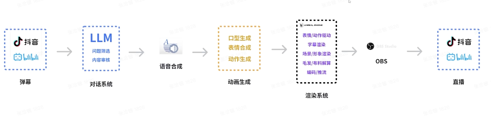

## 聊天机器人
* 商用产品
	* chatgpt
* 开源
	* chatGLM
	* 

## AI绘画(Text2Img / Img2Img)
### Stable Diffusion

论文：https://arxiv.org/pdf/2112.10752.pdf
代码：https://github.com/CompVis/stable-diffusion
stable-diffusion 2.0: https://github.com/Stability-AI/stablediffusion
stable-diffusion UI:  https://github.com:AUTOMATIC1111/stable-diffusion-webui.git

根据文本生成图片：文本 - 图像模型

https://zhuanlan.zhihu.com/p/609577723
1. Install anaconda: https://www.anaconda.com/download
2. source ~/.zshrc
3. brew install cmake protobuf rust git wget python@3.10
4. Install pytorch: https://pytorch.org/
5. Install stable-diffusion-webui: git clone git@github.com:AUTOMATIC1111/stable-diffusion-webui.git
6. 下载ai绘图基础模型：这里以stable diffusion 2.0训练模型为例，在[https://huggingface.co/stabilityai/stable-diffusion-2](https://link.zhihu.com/?target=https%3A//huggingface.co/stabilityai/stable-diffusion-2)页面的“file” tag里面找到并下载768-v-ema.ckpt。下载好后，把下载好的ckpt文件放在“你的用户名”> Stable-diffusion-webui>Models>Stable-diffusion文件夹里。
7. 运行 
	1. pip3 install gfpgan
	2. pip install ftfy regex tqdm; pip install git+https://github.com/openai/CLIP.git
	3. cd stable-diffusion-webui
	4. ./webui.sh

gfpgan 安装不上的问题：https://blog.csdn.net/GodGump/article/details/129278722

https://blog.csdn.net/lkhk2008/article/details/129624374

模型
stable diffusion 2.0:[https://huggingface.co/stabilityai/stable-diffusion-2](https://link.zhihu.com/?target=https%3A//huggingface.co/stabilityai/stable-diffusion-2)

二次元模型：Abyssorange mixs2

插件：
* 插件列表：https://gitee.com/akegarasu/sd-webui-extensions/raw/master/index.md
* 汉化插件：https://github.com/dtlnor/stable-diffusion-webui-localization-zh_CN
* ControlNet：
Lora

 VE

## Text2Audio
Text-To-Speech: TTS技术
https://ttsmaker.cn/
https://github.com/sekift/so-vits-models
https://github.com/VideoCrafter/VideoCrafter

https://github.com/sstzal/DiffTalk

## AI数字人(语音+图像->视频)

数字人类型：
* 卡通
* 2.5D：AI驱动(唇形驱动+动作驱动+TTS+高分辨率生成算法)
* 3D：动捕技术+真人驱动
* 超写实数字人：数字孪生，数字分身

Human-Video-Generation: https://github.com/yule-li/Human-Video-Generation
awesome-faceReenactment: https://github.com/DaddyJin/awesome-faceReenactment
awesome_talking_face_generation https://github.com/YunjinPark/awesome_talking_face_generation

现有商用产品：
* 国外
	* DID： https://www.d-id.com/
	* Heygen： https://app.heygen.com/guest/home
* 国内
	* 硅基
	* 

[**https://github.com/Zz-ww/SadTalker-Video-Lip-Sync**](https://github.com/Zz-ww/SadTalker-Video-Lip-Sync)

如需使用DAIN模型进行补帧需安装paddle

视频结果优化：
* ***视频防抖**
* **视频高清**
* **视频融合**
* **视频修复**
* 视频超分辨率: 
	* https://github.com/open-mmlab/mmagic
	* https://github.com/ckkelvinchan/RealBasicVSR
	* https://github.com/ckkelvinchan/BasicVSR_PlusPlus

  
动作迁移

faceRender：
* face-vid2vid
* 

## AI作曲

## AI换脸

图像换脸：
* insightface
* swapface
* roop: [stable diffusion 插件](https://github.com/s0md3v/sd-webui-roop)
视频换脸：
* suapface: 收费
* faceswap
* roop：开源 https://github.com/s0md3v/roop    hugging face [Google Colab](https://colab.research.google.com/drive/157RluIDQnvjQy9UBFXL8U5Q-UwgZPqAK) https://github.com/dream80/roop_colab
* deepfaceLab：[googleColab](https://colab.research.google.com/github/chervonij/DFL-Colab/blob/master/DFL_Colab.ipynb) https://github.com/chervonij/DFL-Colab https://github.com/iperov/DeepFaceLab
* deepfaceLive：https://github.com/iperov/DeepFaceLive  [论文](https://arxiv.org/pdf/2005.05535.pdf)
直播换脸
* deepface
* swapface

## Audio2Face
https://github.com/FACEGOOD/FACEGOOD-Audio2Face
https://github.com/Zz-ww/SadTalker-Video-Lip-Sync

## Audio2Lip / Talking-Face-Generation

1. **wav2lip**：(社区活跃高) 中文效果不好; 2D实时驱动 [github](https://github.com/Rudrabha/Wav2Lip) [googleColab](https://colab.research.google.com/github/ml4a/ml4a/blob/master/examples/models/Wav2Lip.ipynb) [paper](https://arxiv.org/abs/2008.10010);2020 [论文解读](https://zhuanlan.zhihu.com/p/613996840)
3. **video-retalking**：(改口型和内容) [**https://github.com/OpenTalker/video-retalking**](https://github.com/OpenTalker/video-retalking) ； 中文可能效果不太好； 2022；

# AI动作迁移
两个有趣的AI动作迁移(Motion Transfer)项目: Pose Animator，avatarify
https://wrong.wang/blog/20200516-%E4%B8%A4%E4%B8%AA%E6%9C%89%E8%B6%A3%E7%9A%84ai%E5%8A%A8%E4%BD%9C%E8%BF%81%E7%A7%BBmotion-transfer%E9%A1%B9%E7%9B%AE-pose-animatoravatarify/

# Awesome

https://github.com/zengyh1900/Awesome-Image-Inpainting
https://github.com/jbhuang0604/awesome-computer-vision

# 人脸修复
gfpgan: 
gfpgan是一种基于生成对抗网络的图像超分辨率算法，提升视频画质，gfpgan网络能增加视频细节和清晰度
https://zhuanlan.zhihu.com/p/617039643

# Lip-Sync/Talking-Face
目前数字人项目基本基于GAN技术，现有项目基本基于wav2lip优化
2D驱动
基于wav2lip
1. **wav2lip**：(社区活跃高) 中文效果不好; 2D驱动 [github](https://github.com/Rudrabha/Wav2Lip) [googleColab](https://colab.research.google.com/github/ml4a/ml4a/blob/master/examples/models/Wav2Lip.ipynb) [paper](https://arxiv.org/abs/2008.10010);2020
2. Wav2Lip-HD http://lihuaxi.xjx100.cn/news/1272759.html?action=onClick
3. ## Wav2Lip-GFPGAN： http://wed.xjx100.cn/news/282734.html?action=onClick ; https://yv2c3kamh3y.feishu.cn/docx/I8OLdvQSuoSRHXx5Hf2cJL32nE6
4. **video-retalking**：(改口型和内容) [**https://github.com/OpenTalker/video-retalking**](https://github.com/OpenTalker/video-retalking) ； 中文可能效果不太好； 2022；
5. **sadtalker**：(无限接近商用)  动作迁移 [github:SadTalker](https://github.com/OpenTalker/SadTalker); 图片+ 音频 = 视频 ； 2023; 2.5D驱动； [论文](https://arxiv.org/abs/2211.12194); [huggingface](https://huggingface.co/spaces/vinthony/SadTalker)
6. **DINET：**(改口型和内容) [github](https://github.com/MRzzm/DINet) ； 2023 清晰度比wav2lip高
7. audio2face：[github](https://github.com/FACEGOOD/FACEGOOD-Audio2Face); 3D实时驱动
8. 未来方向： **Talking face diffusion**
	1. DiffTalk: https://github.com/sstzal/DiffTalk
	2. DiffusionVideoEditing
基于NeRF
1. [AD-NeRF](https://github.com/YudongGuo/AD-NeRF): 2021
2. **RAD-NeRF(有UI界面)**: [Code](https://github.com/ashawkey/RAD-NeRF)2022
3. DFRF: 2022;  [Code](https://github.com/sstzal/DFRF)
4. GeneFace: 2023; [Code](https://github.com/yerfor/GeneFace) ; [Papaer](https://arxiv.org/abs/2301.13430) [Project](https://geneface.github.io/)
5. GeneFace++: https://genefaceplusplus.github.io/
6. ER-NeRF: 2023 [Code](https://github.com/Fictionarry/ER-NeRF); 

7. **makeitalk**

MODA: https://github.com/DreamtaleCore/MODA

MCNET https://github.com/harlanhong/ICCV2023-MCNET 

## 3D Avatar 直播

X-Avatar: Expressive Human Avatars (CVPR2023) [Code](https://github.com/Skype-line/X-Avatar) [Paper](https://arxiv.org/abs/2305.04789) [Project](https://liuyebin.com/AvatarRex/)

Build an avatar with ASR, Sentence-transformer, Similarity Search, TTS and Omniverse Audio2Face： https://github.com/metaiintw/build-an-avatar-with-ASR-TTS-Transformer-Omniverse-Audio2Face

1. 建模工具(三维软件)：
	* 3DMax(建筑, 机械, 工业), Maya(影视动画, 电影特效), ZBrush(高模), C4D(栏目包装, 影视后期, 三维电商海报设计, 平面设计, UI设计, 工业设计)
	* Agisoft Metashape：360度人脸图片
	* RealityCapture：360度人脸图片, 收费
	* [MetaPerson Creator](https://metaperson.avatarsdk.com/): 只需一种图片
	* blender
2. 虚拟引擎:
	* Unreal Engine 5: https://www.unrealengine.com/zh-CN/download
		* 插件：
		* 模型编辑：
			* MetaHuman Creator: https://www.unrealengine.com/zh-CN/metahuman
	* unity
3. 面部驱动
	* Omniverse audio2face：https://www.nvidia.com/en-us/omniverse/apps/audio2face/
1. 身体驱动，动作捕捉
	* 道乐师动作捕捉软件：http://sunnyview.tech/
1. 文字转语音 Text2Audio
	* https://github.com/PaddlePaddle/PaddleSpeech
	* [Gtts API](https://pypi.org/project/gTTS/),
2. 对话模型
	* https://github.com/THUDM/ChatGLM2-6B
# 人脸关键点检测
https://zhuanlan.zhihu.com/p/514393887

### 人脸复原
### 去噪、超分辨率、去模糊和伪影去除

https://github.com/arlosefj/github_interest/blob/master/Face.md

# 人脸识别
Openface：深度学习人脸识别**开源**库，聚焦于**移动设备**上实时人脸识别，旨在用少量数据实现高准确率 [Paper](https://www.cv-foundation.org/openaccess/content_cvpr_2015/html/Schroff_FaceNet_A_Unified_2015_CVPR_paper.html) [Code](https://github.com/TadasBaltrusaitis/OpenFace)
FaceNet: Google 
DeepFace：Facebook

## ffmpeg循环推流

https://lala.im/4816.html

# 语音识别
Automatic Speech Recognition：ASR
Upon receiving user's request, the [SpeechRecognition API](https://pypi.org/project/SpeechRecognition/) records the frequencies and sound waves from user's voice and translates them into text.