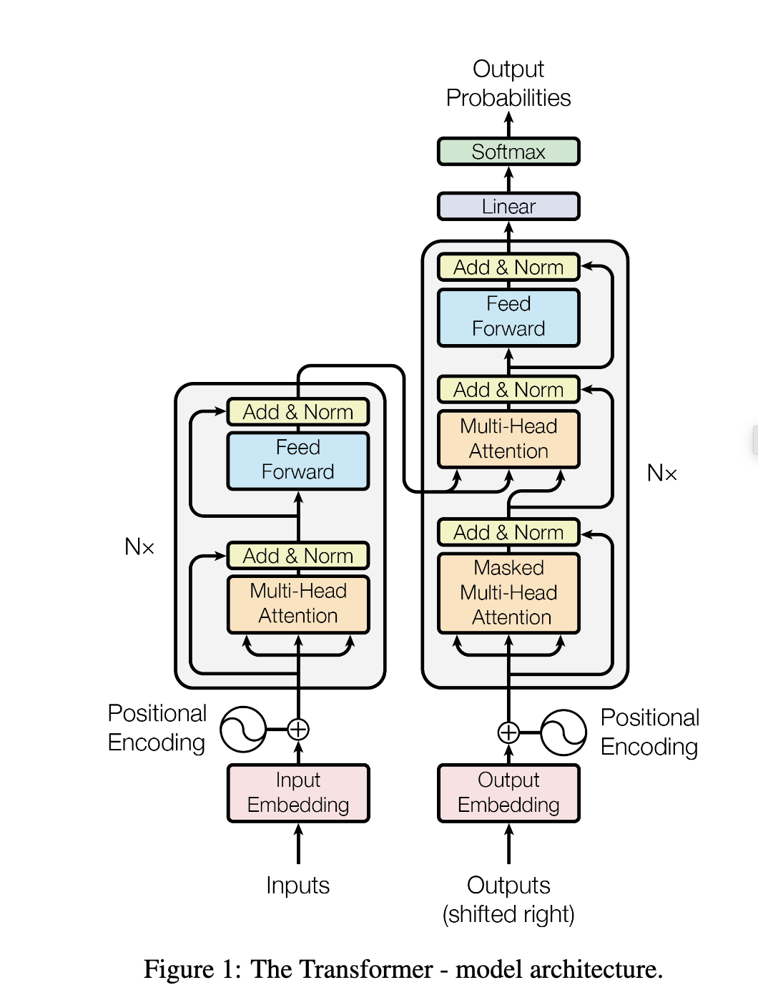

# AI模型

# CNN相关模型
## LeNet-5
2019：第一个成功应用于数字识别问题的卷积神经网络模型；
论文：

## AlexNet
2012：第二个经典CNN网络模型，是CNN向大规模应用的起点，宣告神经网络的归来；

## VGG
证明用很小的卷积核并增加网络深度也可有效提升模型效果，对其他数据集有较好泛化能力
## ResNet
网络深度增加时网络准确度出现饱和甚至下降，ResNet提出残差学习解决退化问题

# RNN模型

# 生成式模型
## Diffusion Model
综述：https://m.thepaper.cn/baijiahao_19930487
马尔可夫链

Prompt: 生成式AI模型的输入源，能够控制输入的内容

foundation model

应用
* CV：图像补全修复Repaint
* NLP
* 多模态：从文本生成图像
* 分子图生成：药物分子和蛋白质分子生成

# Transformer
https://pypi.org/project/transformers/
论文：[Attention is all your need](https://arxiv.org/abs/1706.03762),是谷歌TPU推荐的参考模型。
Project; Code
NLP领域主要存在三种特征处理器：CNN，RNN和Transformer。当前Transformer流行程序已大过CNN和RNN，它抛弃传统CNN，RNN的神经网络，整个网络结构完全由Attention机制及前馈神经网络组成。
Transformer
应用：GPT
最早是用于机器翻译
https://zhuanlan.zhihu.com/p/82312421

**输入层：** Encoder(编码) 和 Decoder(解码) 的输入都是**单词的 Embedding 向量** 和 **位置编码**（Positional Encoding，为了像 RNN 那样捕获输入序列的顺序信息）；不同的是，Encoder 的**初始输入**是训练集的 X ，Decoder 的**初始输入**是训练集的标签 Y ，并且需要整体右移（Shifted Right）一位（原因后文具体介绍）。此外在 Decoder 中，**第二子层**的输入为 **Encoder 的输出**（key 向量和 value 向量）以及**前一子层的输出**（query 向量）。

**Encoder**：该模块可以分为两部分： **Self-Attention 层和全连接层**；此外又加了一些额外的处理，如**残差连接（residual connection）、Layer Normalization层**。为了便于残差连接，作者将所有层的输出维度都定义为 ������=512 （包括 Embedding 层的输出和位置编码的维度）。这个结构可以循环 � 次（文中 �=6 ）。

**Decoder**：该模块可以分成三部分：第一部分是 Self-Attention 层 （这里添加了masking 操作，以防止时间穿越，后文会详细讲解），第二部分是 **Encoder-Decoder Attention**（这是因为输入中 key，value 向量来源于 Encoder，query 向量来源于Decoder），第三部分是全连接层；也用了残差连接和 Normalization。同样，该结构可以循环 � 次。

**输出层**：最后的输出要通过Linear层（全连接层），再通过 softmax 做预测。

## GPT
GPT：Generative Pre-trained Transformer，即预训练生成模型。
GPT是一种基于Transformer模型的生成式预训练语言模型，旨在通过学习大量语料库来生成合理、连贯的文本。
应用：chatgpt。ChatGPT的应用场景非常广泛，比如对话机器人、自动翻译、自动摘要、文本生成等等。

chatglm
**Github:[https://github.com/THUDM/ChatGLM-6B](https://github.com/THUDM/ChatGLM-6B)**  
**Hugging Face Hub(模型地址):[https://huggingface.co/THUDM/chatglm-6b](https://huggingface.co/THUDM/chatglm-6b)**

## 大语言模型
中文通用大模型综合性基准: https://github.com/CLUEbenchmark/SuperCLUE

## 大语言模型微调方法
* Adapter Tuning \[2019\]
* **LoRA** \[2021\] 🌟
* Prefix-tuning \[2021\]
* Prompt-tuning \[2021\]
* p-tuning \[2022\]
* p-tuning v2 \[2022\]
* AdaLora \[2023\]
## LlaMa

https://github.com/facebookresearch/llama
https://github.com/michael-wzhu/Chinese-LlaMA2
https://github.com/ymcui/Chinese-LLaMA-Alpaca-2

