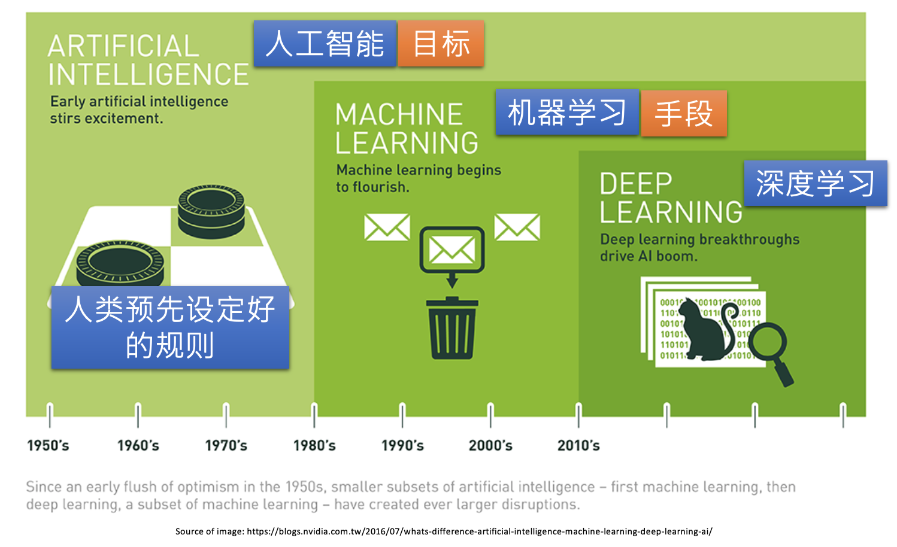

# AI & ML & DL

# 人工智能

人工智能（英语：Artificial Intelligence，缩写为 AI）亦称机器智能，指由人制造出来的机器所表现出来的智能。通常人工智能是指通过普通计算机程序的手段实现的人类智能技术。

- 数据
- 算法
- 计算平台

人工智能：
* 计算智能：快速计算，记忆和储存能力
* 感知智能：视觉、听觉、触觉等感知能力，如语音识别、语音合成、图像识别
* 认知智能：理解、解释的能力

人工智能也可以分成两类：
* 强人工智能：强人工智能观点认为“有可能”制造出“真正”能推理（Reasoning）和解决问题的智能机器，并且，这样的机器将被认为是具有知觉、有自我意识的。像绝大多数科幻电影中的机器人就是在这范畴弱人工智能：
* 弱人工智能观点认为“不可能”制造出能“真正”地推理和解决问题的智能机器，这些机器只不过“看起来”像是智能的，但是并不真正拥有智能，也不会有自主意识。我们目前阶段的人工智能，其实都是弱人工智能。

人工智能研究领域：

* **Recommender Systems**  / Recommendation
* **Computer Vision, CV**
* Speech Recognition
* NLP 自然语言处理 
* **Knowledge Graph**:Knowledge Representation 知识抽取、知识表示、知识融合、知识推理 
* 强化学习
* 无人驾驶运动规划(路径规划)
* Expert Systems
* Multi-Agent systems
* Evolurionary Computation
* Fussy Logic and Rough Set
* Robotics and Perception
* Planning and Scheduling
* Machine Learning 机器学习
* AI for Hybrid Cloud
* 模式识别
* 深度学习

人工智能应用领域：

* 人脸识别
* 指纹识别
* 虹膜识别
* 掌纹识别
* 情感识别
* 医学诊断
* Healthcare

图像预处理：

* 图像去燥
* 图像增强
* 图像分割

指纹识别
基于Haar的人脸检测
基于HoG特征的物体检测

# 机器学习

* 数据科学的一个重要领域，通过数据分析使程序具有学习数据内在规律的能力，程序中没有明确的逻辑过程
* 技术：数理统计，概率论
* 目的：数据拟合

从广泛的概念来说，机器学习是人工智能的一个子集，是实现人工智能的重要方法。人工智能旨在使计算机更智能化，而机器学习已经证明了如何做到这一点。 简而言之，机器学习是人工智能的途径和应用 。 即以机器学习为手段解决人工智能中的问题。机器学习在近30多年已发展为一门多领域交叉学科，涉及概率论、统计学、逼近论、凸分析、计算复杂性理论等多门学科。通过使用从大量数据中反复学习到的算法，机器学习可以改进计算机的功能，而无需进行明确的编程。

机器学习和人工智能之间并不能画等号，毕竟机器学习实际上是研究算法的学科，而人工智能志在模拟人的思维和行为。

随着大数据的迅速发展，机器学习变得越来越重要，它有力地处理大量数据，做出准确的预测。机器学习中就有好多个经典的算法，其中就包含了神经网络(深度学习可看成是神经网络的升级版)。

机器学习是一种重在寻找数据中的模式并使用这些模式来做出预测的研究和算法的门类。机器学习是人工智能领域的一部分，并且和知识发现与数据挖掘有所交集。

# 深度学习

* 机器学习的分支，基于数据表达与信息传递，层层过滤和提取信息中的结构规律
* 技术：神经网络(NN)
* 目的：知识提取

深度学习是一个基于经验的领域。狭义地说就是“很多层”的神经网络，在若干测试和竞赛下，尤其涉及语音、图像等复杂对象的引用中，深度学习取得优越的性能。深度学习是一种实现机器学习的技术。

深度学习本来并不是一种独立的学习方法，其本身也会用到有监督和无监督的学习方法来训练深度神经网络。但由于近几年该领域发展迅猛，一些特有的学习手段相继被提出（如残差网络），因此越来越多的人将其单独看作一种学习的方法。最初的深度学习是利用深度神经网络来解决特征表达的一种学习过程。深度神经网络本身并不是一个全新的概念，可大致理解为包含多个隐含层的神经网络结构。为了提高深层神经网络的训练效果，人们对神经元的连接方法和激活函数等方面做出相应的调整。其实有不少想法早年间也曾有过，但由于当时训练数据量不足、计算能力落后，因此最终的效果不尽如人意。深度学习摧枯拉朽般地实现了各种任务，使得似乎所有的机器辅助功能都变为可能。无人驾驶汽车，预防性医疗保健，甚至是更好的电影推荐，都近在眼前，或者即将实现。当下深度学习在计算机视觉、自然语言处理领域的应用远超过传统的机器学习方法

科学不是战争而是合作，任何学科的发展从来都不是一条路走到黑，而是同行之间互相学习、互相借鉴、博采众长、相得益彰，站在巨人的肩膀上不断前行。

纵观机器学习发展历程，研究热点可以简单总结为2000-2006年的流形学习、2006年-2011年的稀疏学习、2012年至今的深度学习。未来哪种机器学习算法会成为热点呢？深度学习三大巨头之一吴恩达曾表示，“在继深度学习之后，迁移学习将引领下一波机器学习技术”。但最终机器学习的下一个热点是什么，谁又能说得准呢。

# 数据科学

数据科学(Data Science) 是一门基于数据**统计、分析、预测**的学科，**通过对数据的洞察**，来解释事物的**规律**。是AI的一个更加明确的表达。AI是一个相对宽泛的概念。在学科领域一般用数据科学

数据科学目前主要分为机器学习(Machine Learning)和深度学习(Deep Learning) 两个领域

* ML的内容比较传统，近年来变化不大，不同时期有不同叫法：数据统计、数据挖掘、商业智能、机器学习
* DL在近些年有巨大突破，由于神经网络的实用化，出现大量基于文字、图像、声音、生物特征的专业应用。

数据科学始于2011年。他需要：

* 计算机编程能力—— 能**处理**数据
* 数学和分析能力——能**分析**数据
* 行业知识——能**理解**数据

# 数据科学家(Data Scientist)学习路径

* Fundamentals
* Statistics
* Programming
* Machine Learning
* Text Mining/Natural Language Processing
* Data VIsualization
* Big Data
* Data Ingestion
* Data Munging
* Toolbox

# References

* 作者：腾讯云技术社区, 链接：https://zhuanlan.zhihu.com/p/58449395

* 作者：育心, 链接：https://www.zhihu.com/question/57770020/answer/249708509