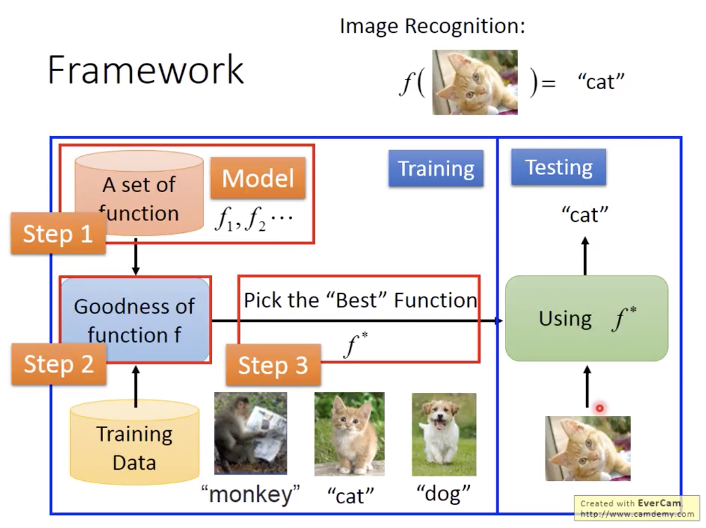

# 1.1 What is Machine Learning
## 1.1.1 What is Machine Learning

### Learning

> acquiring skill with experience accumulated from observations.
> observations-->learning-->skil

### Machine Learning

> acquiring skill with experience accumulated/computed from data.
> data-->ML-->skill
> Machine Learning ≈ Looking for a Function from Data

Machine Learning Step:
1. 

> Arthur Samuel(1959): Machine Learning: Filed of study that gives computers the ability to learn without being explicity programmed.

> Tom Mitchell(1998): Well-posed Learning Problem: A computer program is said to learn from experience E with respect to some task T and some performance measure P, if its performance on T, as measured by P, improves with experience E.

### An application of Computational Finance
    stock data-->ML-->more investment gain

## 1.1.2 什么时候可以用ML
ML: an alternative route to build complicated systems

Some use scenarios
- when human cannot program the system manually -- Navigating on Mars -- 需要自适应
- when human cannot define the solution easily --- speech/visual recognition -- 很难define the solution
- when needing rapid decisions that humans cannot do --- high-frequency trading -- 需要快速决策
- when needing to be user-oriented in a massive scale --- consumer-targeted marketing -- 需要个性化

Key essence of ML
- exists some 'underlying pattern' to be learned --- so 'performance measure' can be improved
- but no programmable (easy) definition --- so 'ML' is needed
- somehow there is data about the pattern --- so ML has some 'inputs' to learn from 

