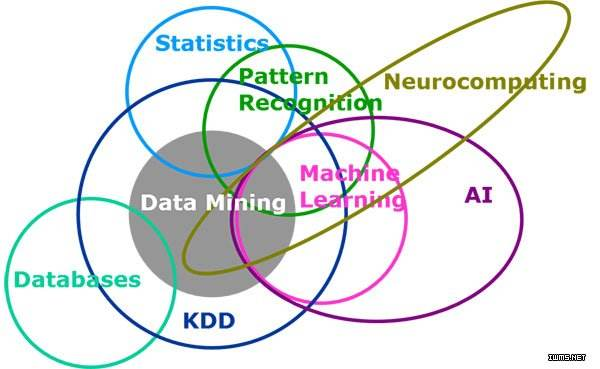

# 1.4 Machine learning and other fields
## 1.4.1 Machine learning和Data Mining 的关系
  Machine Learning：use data to compute hypothesis g that approximates target f;

  Data Mining: use (huge) data to find property that is interesting。

  当这里的'interesting property' 指的是 ‘hypothesis that approximates target’，那ML = DM（每年的KDDCup就是这种情况）；

  当'interesting property' 与 ‘hypothesis that approximates target’相关时，则DM与ML可以相辅相成；
  
  传统的DM主要聚焦于efficient computation in large database。

## 1.4.2. Machine Learning和Artificial Intelligence的关系
  Artificial Intelligence: compute something that shows intelligent behavior
  当ML中的target f 是something that shows intelligent behavior，那么ML是实现AI的一种途径；例如对下象棋来说，传统的AI是game tree；而ML for AI则是learning from board data。

## 1.4.3. Machine Learning和Statistics的关系

  Statistics: use data to make inference about an unknown process

  ML中的g就是一个inference的结果，f则是unknown的，因此statistics 能用来实现ML

  传统的statistics聚焦于provable results with math assumptions，对于computation不怎么关心。

  Statistics: many tools for ML

## 1.4.4. 总结一下：

