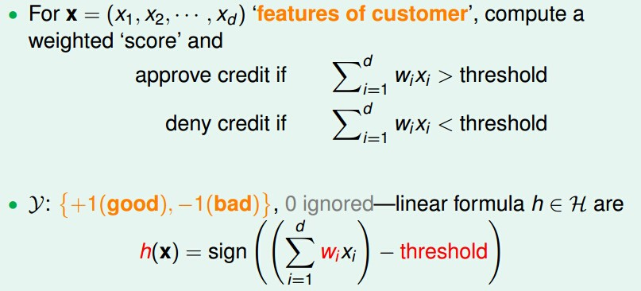
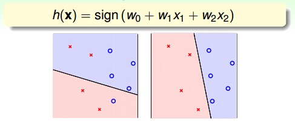

对于信用卡的问题，每个人可以使用一个向量X，X中每个分量代表一个维度，比如年龄，薪资，工龄等。为了数学简化起见，我们用+1代表给信用卡；-1代表不给信用卡。则抽象为数学问题为：

> W 为权重，threshold为阀值。

called 'perceptron' hypothesis historically.历史上将这个H叫做感知机。

整理一下：

举个例子，对于二维feature的情况来说，输入x \(x1, x2\) 表示申请者的两个feature，如下图分别代表x、y坐标轴；输出y则为+1或者-1，如下图分别的叉叉和圈圈；hypothesis则为下图中的直线（多维情况下则为超平面）。

从几何的角度来看，感知机perceptron实际上就是平面上的每一条线，所以有时候也叫做线性分类器linear classifier。

如何找到一条合适的直线？先找到错误的点，在逐渐学习，调整权值，最后达到最优。

H = all possible perceptrons, g = ?

want: g ≈ f \(hard when f unknown\)

almost necessary: g ≈ f on D,ideally g\(Xn\)=f\(Xn\)=yn

difficult: H is of infinite size

idea: start from some g0,and 'correct' its mistakes on D

start from some w0\(say,0\), and 'correct ' its mistakes on D

图 PLA算法流程以及形象化表示

如图所示，对于二分类问题，上图展示了两个错误的例子，对于Y=1，W和X 的夹角应该是锐角，所以为了优化更新权值为W’=W+YX，这样就调整到了锐角。具体说来：

一种是希望的y=+1，而当前线w预测为负。代表目前w跟x的方向的角度太大，所以将w转向x的方向，即w用w+x来替换；

另一种是希望的y=-1，而当前线w预测为正。代表目前w跟x的方向的角度太小，所以将w转向x的另外一个方向，即w用w-x来替换。

