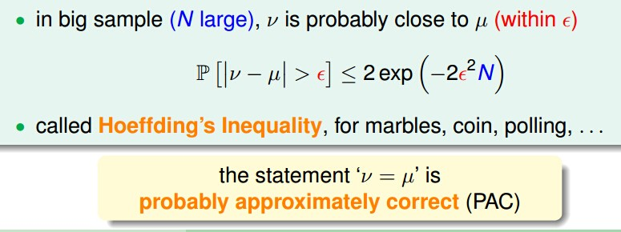

现在从抽弹珠转到Learning,target f(x)是未知的，f在X上的每一个地方都进行估计是比较困难的，把弹珠想成X，取一个h(x)，看h(x)与f(x)是否一样，如果不一样就把弹珠漆成橘色，如果一样漆成绿色(注意这里的h(x)是从hypothesis set中取定的其中一个，在与f(x)比较的过程中是一直不变的)。如果抓100个弹珠相当于有100个X，如果输监督学习那么还有100个y。我们知道这100个弹珠中有多少橘色和多少绿色。

 
h代表一个假设hypothesis，那我们假设现有一个规则，即现有一个假设h，Ein(h)代表我们从罐子中取了N个弹珠，这些弹珠和样本标签的误差，是已知的，相当于v。Eout(h)表示罐子中所有弹珠在假设h上的误差，是未知的,相当于u。那么问题是我们能否通过N个弹珠推出整个罐子弹珠的情况，也即我们能够用h来预测整个样本，能否学习到规律？
根据hoeffding不等式，如下：

 

用Ein(h)、Eout(h)代换上面的不等式，有：

 

上述不等式说明了什么呢？

说明了对于各确定的假设h，当样本足够大的时候，Ein(h)=Eout(h)，那么就可以通过输入判断输出。尤其当Ein(h)很小的时候说明取出的样本在h上接近真实的f，那么也能得到整个罐子里（整个数据集）的样本都可以用h来预测，这就达到了学习的目的。

，因为之前h(x)和f(x)比较的过程中，是选定了一个h(x),这个h是否能成为g？我们并没有在所有h set中选一个最好的作为g,而是随机选了一个h与f进行比较。这样并没有达到一个真正的学习，真正的学习是有选择的，并不是每次都回传同一个h，我们之前的理论只是证明如果选了同一个h时发生了什么事。PLA是给他不同的资料就选不同的线，不是每次都回传同一条线。

所以我们要做一个事:verfication验证，要确认我们的表现好不好

can now use 'historical records(data)' to verify 'one candidate formula' h