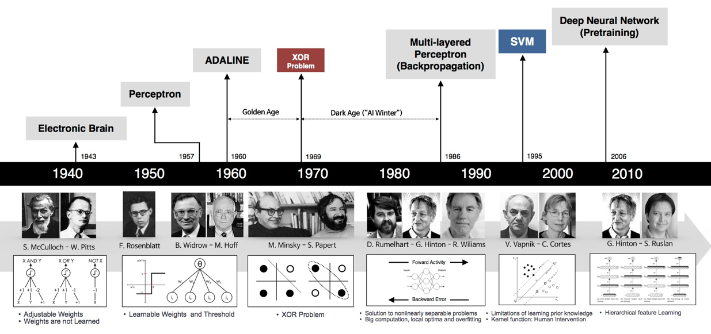

# COURSE SYLLABUS
* Module 1 - Introduction to Deep Learning
    1. Why Deep Learning?
    2. What is a neural network?
    3. Three reasons to go Deep
    4. Your choice of Deep Net
    5. An old problem: The Vanishing Gradient
* Module 2 - Deep Learning Models
    1. Restricted Boltzmann Machines
    2. Deep Belief Nets
    3. Convolutional Networks
    4. Recurrent Nets
* Module 3 - Additional Deep Learning Models
    1. Autoencoders
    2. Recursive Neural Tensor Nets
    3. Deep Learning Use Cases
* Module 4 - Deep Learning Platforms and Software Libraries
    1. What is a Deep Learning Platform?
    2. H2O.ai
    3. Dato GraphLab
    4. What is a Deep Learning Library?
    5. Theano
    6. Caffe
    7. TensorFlow

Note: This course is an introductory course and does not have any hands-on lab. After completing this course, it is recommended to take "Deep learning with TensorFlow" course. 

Note: Though this course does not have any hands-on lab, still you can try PowerAI to understand different deep learning libraries better. PowerAI speeds up deep learning and AI. Built on IBM's Power Systems, PowerAI is a scalable software platform that accelerates deep learning and AI with blazing performance for individual users or enterprises. The PowerAI platform supports popular machine learning libraries and dependencies including Tensorflow, Caffe, Torch, and Theano. You can download a free version of PowerAI here.

哺乳动物视觉处理机理：
图像分割
基于特征的目标识别 SIFT特征
1998
2012年ImageNet大赛 AlexNet 卷积神经网络胜出

googleNet vgg
msra

* CNN
* RNN
* 

# What is Deep Learning?

Deep-learning methods are **representation-learning** methods with multiple levels of representation, obtained by composing simple but **non-linear modules** that each transform the representation at one level (starting with the raw input) into a representation at a higher, slightly more **abstract level**. With the composition of enough such transformations, very complex functions can be learned. 

# What are neural networks and how they work?

Deep learning is about neural networks.
The structure of a neural network is like any other kind of network; there is an interconnected web of nodes, which are called neurons,and the edges that join them together.
A neural network's main function is to receive a set of inputs, perform progressively complex calculations,
and then use the output to solve a problem.
Neural networks are used for lots of different applications, but in this series we will focus on classification.

If you wanna learn about neural nets in a bit more detail, including the math, my two favourite resources are Michael Nielsen's book, and Andrew Ng's class.

Classification is the process of categorizing a group of objects, while only using some basic data features that describe them. There are lots of classifiers available today - like Logistic Regression, Support Vector Machines, Naive Bayes, and of course, neural networks.
The firing of a classifier, or activation as its commonly called, produces a score.
For example, say you needed to predict if a patient is sick or healthy, and all you have are their height, weight, and body temperature. The classifier would receive this data about the patient, process it, and fire out a confidence score. A high score would mean a high confidence that the patient is sick, and a low score would suggest that they are healthy.
Neural nets are used for classification tasks where an object can fall into one of at least two different categories.
Unlike other networks like a social network, a neural network is highly structured and comes in layers.
The first layer is the input layer, the final layer is the output layer, and all layers in between are referred to as hidden layers.
A neural net can be viewed as the result of spinning classifiers together in a layered web.
This is because each node in the hidden and output layers has its own classifier.
Take that node for example - it gets its inputs from the input layer, and activates.
Its score is then passed on as input to the next hidden layer for further activation.
So, let’s see how this plays out end to end across the entire network.
A set of inputs is passed to the first hidden layer, the activations from that layer are passed to the next layer and so on, until you reach the output layer, where the results of the classification are determined by the scores at each node.
This happens for each set of inputs.
Here's another one...
like so.
This series of events starting from the input where each activation is sent to the next layer,
and then the next, all the way to the output,
is known as forward propagation, or forward prop.
Forward prop is a neural net's way of classifying a set of inputs.
Have you wanted to learn more about neural nets?
Please comment and let me know your thoughts?
The first neural nets were born out of the need to address the inaccuracy of an early classifier, the perceptron.
It was shown that by using a layered web of perceptrons,
the accuracy of predictions could be improved.
As a result, this new breed of neural nets was called a Multi-Layer Perceptron or MLP.
Since then, the nodes inside neural nets have replaced perceptrons with more powerful classifiers,
but the name MLP has stuck.
Here's forward prop again.
Each node has the same classifier, and none of them fire randomly;
if you repeat an input, you get the same output.
So if every node in the hidden layer received the same input,
why didn’t they all fire out the same value?
The reason is that each set of inputs is modified by unique weights and biases.
For example, for that node,
the first input is modified by a weight of 10,
the second by 5, the third by 6 and then a bias of 9 is added on top.
Each edge has a unique weight, and each node has a unique bias.
This means that the combination used for each activation is also unique,
which explains why the nodes fire differently.
You may have guessed that the prediction accuracy of a neural net depends on its weights and biases.
We want that accuracy to be high,
meaning we want the neural net to predict a value that is as close to the actual output as possible,
every single time.
The process of improving a neural net’s accuracy is called training,
just like with other machine learning methods.
Here's that forward prop again -
to train the net, the output from forward prop is compared to the output that is known to be correct,
and the cost is the difference of the two.
The point of training is to make that cost as small as possible, across millions of training examples.
To do this, the net tweaks the weights and biases step by step until the prediction closely matches the correct output.
Once trained well, a neural net has the potential to make accurate predictions each time.
This is a neural net in a nutshell.
At this point you might be wondering; why create and train a web of classifiers for a task like classification,
when an individual classifier can do the job quite well?
The answer involves the problem of pattern complexity, which we will see in the next video.

# What are are convolutional neural networks?

Conventional machine-learning techniques were **limited** in their ability to process **natural
data in their raw form**. For decades, constructing a pattern-recognition or machine-learning system **required careful engineering** and **considerable domain expertise** to design a feature extractor that transformed the raw data (such as the pixel values of an image) into a suitable internal representation or feature vector from which the learning subsystem, often a classifier, could detect or classify patterns in the input. 

# Why is deep learning so powerful and what can it be used for?
Be part of a rapidly growing field in data science; there's no better time than now to get started with neural networks.

gradient and vanishing gradient a

Deep Belief Nets
Convolutional Nets
Backpropagation
non-linearity
Image recognition

Big deep learning researchers
* Andrew Ng
* Geoff Hinton
* Yann LeCUn
* Yoshua Bengio
* Andrej Karpathy

# 应用：
* 计算机视觉：
    * 图像分类
    * 计算机视觉的历史
* 自然语言处理
* 语音识别

## 深度学习模型的主要组成部分

1. 数据的输入

2. 神经元模拟，其中包含参数的初始化和存储

3. 正向传播，对于给定的输入向前传播，得到最终预测输出

4. 损失计算，根据标准输出的结果计算损失的大小

5. 反向传播，根据损失量调整各个参数的值

6. 训练，不断的用给定数据重复正向传播，损失计算和反响传播调整参数的过程

7. 预测，在模型训练完成之后，通过正向传播来应用模型

8. 超参选择

# history

1. 

# Open courses
* [李宏毅2017深度学习 ](https://www.bilibili.com/video/av9770302?from=search&seid=8726738433477857991) [ppt](http://speech.ee.ntu.edu.tw/~tlkagk/courses_MLDS17.html)

* [李宏毅2019深度学习](https://www.bilibili.com/video/av48285039?from=search&seid=18412288318936573886)

# LiHongYi 2017

## Three steps for deep learning

1. **Neural Network**: A neural network is a function composed of simple functions(neurons);

   usually we design the network structure, and let machine find parameters from data

2. **Cost Function**: Cost function evaluates how good a set of parameters is; 

   We design the cost function based on the task

3. **Optimization**: Find the best function set (e.g. gradient descent)

## Basic structures

### 1. Fully Connected Layer

# CNN

CNN: Convolutional neural network

## 卷积
https://zhuanlan.zhihu.com/p/440893420

**复变函数中的定义**：设f(x)和g(x) 是定义在无穷区间上的两个连续时间信号，则将积分$\int_{−\infty}^{+\infty}f(\tau)g(t-\tau)d\tau$   定义为 f(x)和g(x)的卷积（Convolution），记为 $f(x)\ast g(x)$

**物理含义**：系统某一时刻的输出是由多个输入共同作用（叠加）的结果。系统对当前时刻之前的所有输入的响应的叠加。函数 f和 g 在 t时刻的卷积表征为函数 f与经过翻转和平移的 g 的重叠部分的面积。卷积即为面积、面积就是积分、积分便为叠加。所以卷积即为叠加，这解释了卷积为什么叫“积”。

图中重叠部分的面积就相当于t处的卷积

放在图像分析里，f(x) 可以理解为**原始像素点(source pixel)**，所有的原始像素点叠加起来，就是原始图了。g(x)可以称为作用点，所有作用点合起来我们称为**卷积核（Convolution kernel）** 卷积核上所有作用点依次作用于原始像素点后（即乘起来），线性叠加的输出结果，即是最终卷积的输出，也是我们想要的结果，我们称为destination pixel.

# GAN

# Foundation model

foundation model :  广泛使用的基础模型，用海量数据金额计算资源基础上训练出来的通用性较强的深度学习模型