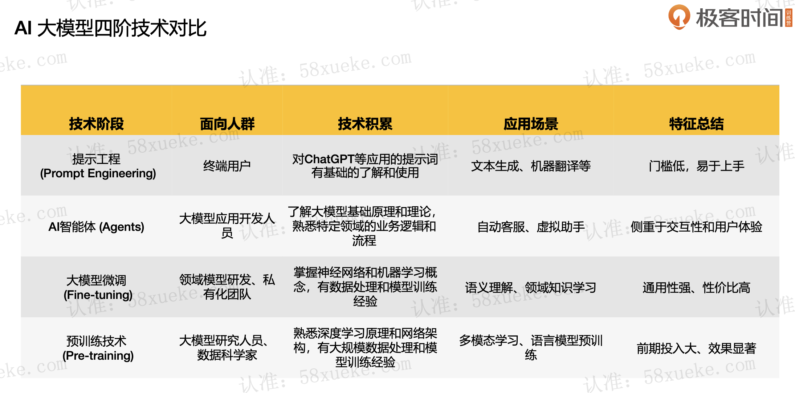

LLM: Large Language Model

AIGC 知识 Wiki 沉淀库（包含最新 AIGC 动态资讯、实际应用案例、工具大全等）：https://geek-agi.feishu.cn/wiki/B9rYwwg6xidZYJkbrlscxTQFnOc

https://pan.baidu.com/disk/main?_at_=1718950434120#/index?category=all&path=%2F%E8%AE%A1%E7%AE%97%E6%9C%BA%2F%E6%9E%81%E5%AE%A2%E6%97%B6%E9%97%B4%20575%20%E5%BD%AD%E9%9D%96%E7%94%B0AI%20%E5%A4%A7%E6%A8%A1%E5%9E%8B%E5%BE%AE%E8%B0%83%E8%AE%AD%E7%BB%83%E8%90%A5%20-%20cn

https://pan.quark.cn/s/1c04bac2eb4d#/list/share

## 现有大语言模型

# 大模型四阶技术

## 提示工程
Prompt Engineering

## AI智能体
Agents

## 大模型微调技术
Fine-tuning

### Full fine-tuning (FFT)
全量微调
微调是一种快速迁移学习的方法
大模型微调（Fine-tuning）是指在已经预训练好的大型语言模型基础上，使用特定的数据集进行进一步的训练，以使模型适应特定任务或领域。

全量微调问题：
* 训练成本高
* 灾难性遗忘   (Openai 等大公司解决了这个问题)

### parameter-efficient fine-tuning(PEFT)
parameter-efficient fine-tuning技术 参数高效的fine-tuning，简称PEFT，旨在在尽可能减少所需的参数和计算资源的情况下，实现对预训练语言模型的有效微调。它是自然语言处理（NLP）中一组用于将预训练语言模型适应特定任务的方法，其所需参数和计算资源比传统的fine-tuning方法更少。

PEFT:
* 有监督微调(Supervised FIne-tune, SFT)
* 基于人类反馈的强化学习 (RLHF)
* 基于AI反馈的强化学习(RLAIF)

PEFT 主流技术方案：
* 围绕token做文章：语言模型(PLM)不变
	* Prompt Tuning
	* Prefix Tuning
	* P-Tuning
* 特定场景任务：训练“本质”的低维模型
	* LoRA：Low-Rank Adaptation of Large Language Models
	* QLoRA
	* AdaLoRA
* 新思路：少量数据，统一框架
	* IA3
	* UniPELT

#### Prompt Tuning

#### Prefix Tuning

### Prompt-tuning

prompt-tuning是一种更近期的精调预训练语言模型的方法，重点是调整输入提示（input prompt）而非修改模型参数。这意味着预训练模型保持不变，只有输入提示被修改以适应下游的任务。通过设计和优化一组提示，可以使预训练模型执行特定任务。

Zero shot
One shot
Few shot

## 预训练技术
Pre-training

# 模型压缩
