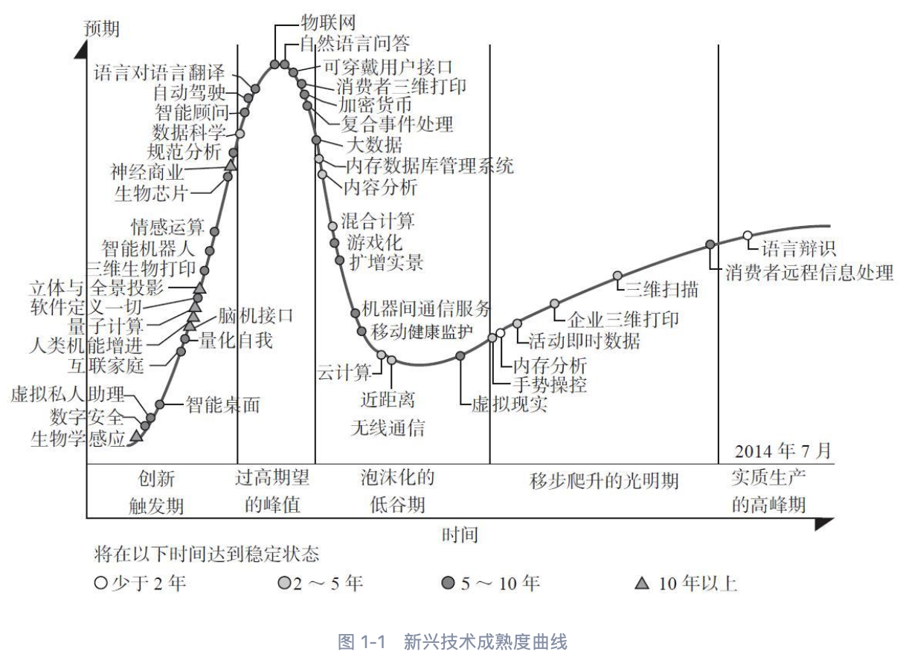
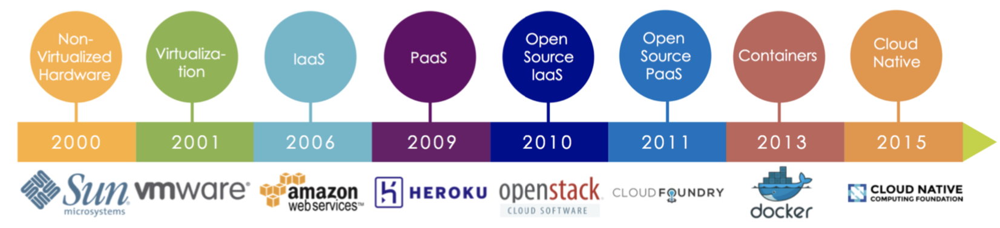
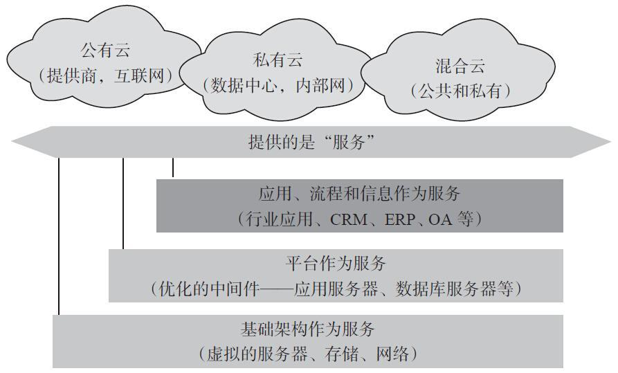
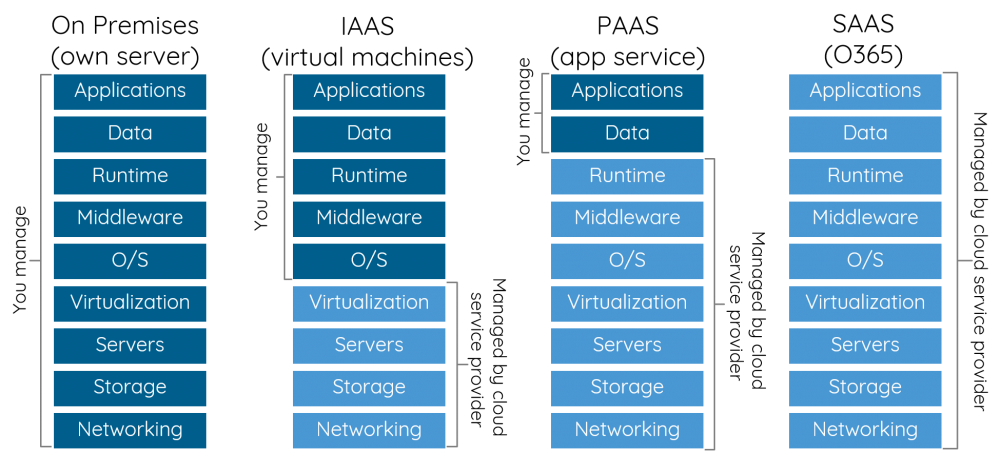
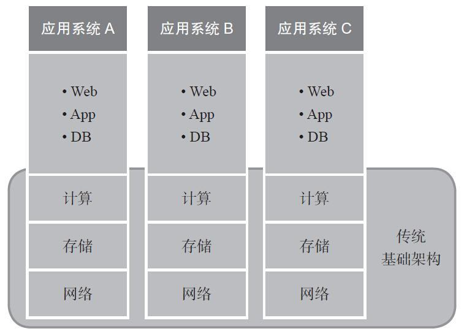

# 1. 云计算概念

## 1.1 云计算定义

### 1.1.1 云计算起源

云计算是继个人计算机、互联网变革后的第三次IT浪潮。

云计算(Cloud Computing)是由分布式计算(Distributed Computing)、并行处理(Parallel Computing)、网格计算(Grid Computing)发展来的，是一种新兴的商业计算模型。

### 1.1.2 云计算定义

总结：**一种独特的IT技术和服务模式**

对于云计算的定义，不同的人有不同的理解，在云计算的不同发展阶段，云计算核心技术和服务方式也在不停变化。

**美国国家标准与技术研究院(NIST)**的定义：
云计算是一种按使用量付费的服务提供模式，这种模式提供可用的、便捷的、随时、随地、按需的网络访问，进入可配置的计算资源共享池（资源包括网络、服务器、存储、应用软件、服务），这些资源能够被快速地提供，动态地分配和调整，在不同用户之间灵活地划分。只需投入很少的管理工作，或与服务供应商进行很少的交互。

从技术角度看，云计算是分布式计算的一种，通过网络将大量计算机组成系统，提供强大且廉价的计算能力，从而达到“超级计算机”的服务能力。
从商业角度看，云计算是一种新型的商业计算模型，它将计算任务分布在大量计算机构成的资源池上，使用户能够按需获取计算、存储、网络和数据等服务。
中国云计算专家咨询委员会副主任、秘书长刘鹏教授：云计算是通过网络提供可伸缩的廉价的分布式计算能力。

广义：服务的交付和使用模式，通过网络以按需、易扩展的方式获得所有服务，通常通过互联网提供动态的、易扩展到且经常是虚拟化的资源，这种服务可以是提供IT基础设施、软件或互联网相关的各种服务，也可以是其他类型的服务，如IaaS，PaaS，SaaS都属于广义云计算

狭义：IT基础设施的交付和使用模式，通过网络以按需、易扩展的方式获得所需资源，对应云计算IaaS服务。

### 1.1.3 云计算发展历史

1955年，time sharing，分时操作系统。

1983年，Sun公司就提出"网络是计算机"(The Network is the Computer)的概念， 并推出了相关的工作站产品。

1990年，Grid Computing 网格计算

1996， cloud computing

1999年，VMware推出了针对X86系统的虚拟化技术，旨在解决提升资源利用率方面存在的很多难题，并将X86系统转变成通用的共享硬件基础架构，以便使应用程序环境在完全隔离、移动性和操作系统方面有选择的空间，为云计算技术的发展和推广打下了基础。

2002年，Amazon推出AWS

2003年，VMware服务器虚拟化

2006年，亚马逊公有云

2006年8月9日，Google首席执行官埃里克•施密特(EricSchmidt)在搜索引擎大会(SES San Jose 2006)上首次提出"云计算〃的概念。Google"云端计算"源于Google工程师克里斯托弗•比希利亚所做的Google 101项目。

云计算的概念和理论基础首次出现在学术界。2007年10月，Google与IBM开始在美国大学校园，包括卡内基梅隆大学、麻省理工学院、斯坦福大学、加州大学柏克莱 分校及马里兰大学等，推广云计算的计划，这项计划希望能降低分布式计算技术在学术研究方面的成本，并为这些大学提供相关的软硬件设备及技术支持(包括数百台个人电脑、BladeCenter与Systemx服务器，这些计算平台提供了1600个处理器，支 持Linux、Xen、Hadoop等开放源代码平台)，而学生则可以通过网络开发各项以大规模计算为基础的研究计划。

2008年1月30日，Google宣布在中国台湾地区启动"云计算学术计划〃，与台湾台大、交大等学校合作，将这种先进的云计算技术大规模、快速地推广到校园。

2008年2月1日，IBM公司宣布在中国无锡太湖新城科教产业园为中国的软件公司建立全球第一个云计算中心(Cloud Computing Center)。

2008年7月29日，雅虎、惠普和英特尔宣布一项包括美国、德国和新加坡在内的联合研究计划，推出云计算研究测试床，以推进云计算。该计划要与合作伙伴创建6个数据中心作为研究试验平台，每个数据中心配置1400〜4000个处理器。这些合作伙伴包括新加坡资讯通信发展管理局、德国卡尔斯鲁厄大学Steinbuch计算中心、美国伊利诺伊大学香槟分校、英特尔研究院、惠普实验室和雅虎公司。

2008年8月3日，美国专利商标局网站信息显示，戴尔申请了"云计算"（Cloud Computing)商标，此举旨在加强对这一未来可能重塑技术架构的术语的控制权。

2010年3月5日，Novell与云安全联盟（CSA)共同宣布_项供应商中立计划，名为"可信任云计算计划〃（Trusted Cloud Initiative)。

2010年4月8日，甶剑桥大学发起的开源虚拟机Xen项目发布了4.0.0正式版。它支持64个虚拟CPU，主机支持1TB RAM和128个物理CPU，推动云计算的加速发展。

2010年7月，美国国家航空航天局以及Rackspace、AMD、英特尔、戴尔等支持厂商共同宣布了 OpenStack开放源代码计划。微软在2010年10月表示，支持Open-stack 与 Windows Server 2008 R2 的集成； 而 Ubuntu 已把 OpenStack 加至其 11.04版本中。

2014年，混合云

观察图1-1所示的Gartner 2014新兴技术成熟度曲线，我们可以发现，云计算技术 已经进入泡沬化的低谷期，即将进入爬升和高峰期。据业内预计，Gartner 2015新兴 技术成熟度曲线中将不再出现云计算技术，这表示云计算已不再是"新兴"技术，而成 为"主流"技术了。随着云计算技术的成熟，OpenStack、KVM等开源项目的不断成 熟，VMware、BM、惠普等云计算产品在行业市场的不断推广，以及Google、腾讯、 百度、阿里巴巴等互联网企业对云计算的广泛应用，云计算作为主流技术，正无时无 刻改变和影响着人们的生活，已经成为我们生活中必不可少的一部分。

A short history of cloud

### 1.1.4 云计算核心

云计算的核心是资源池和调度，

### 1.1.5 云计算五大特征：

800-145标准定义云计算具备五种基本元素：

* **通过网络分发服务**：打破地理位置限制、打破硬件部署环境限制——ipad登陆Google Docs即可进行文学创作，无需买PC
* **自助服务**：用户通过自助方式获取服务——WebEx在线会议系统
* **可衡量的服务**：对计算资源进行衡量。一个完整的原计算平台会对存储、CPU、带宽等资源保持实时跟踪，并将这些信息以可量化的指标反映出来。基于这些指标，云计算平台运营商或管理企业内部私有云的IT部门，能快速对后台资源进行调整和优化。
* **资源的灵活调度**：云计算服务提供商可快速将新设备添加到资源池，
* **资源池化**：计算资源不再以单台服务器为单位，云计算打破服务器机箱的限制，将所有CPU和内存等资源释放出来，汇集在一起，形成一个个CPU池、内存池、网络池当用户产生需求时，便从这个池中配置能够满足需求的组合。使用户不再关心计算资源的物理位置和存在形式

只有同时具备这五点的IT架构才被称为云服务架构。

### 1.1.6 云计算目的：

云计算：提高CPU利用率和系统易维护性

### 1.1.7 参考资料：

云计算的概念和内涵
云计算的概念和原理
云计算基本概念

[https://lin23871.gitbooks.io/cloud-compute-learning/content/ch01/ch01\_01.html](https://lin23871.gitbooks.io/cloud-compute-learning/content/ch01/ch01_01.html)

## 1.2 云计算分类

### 1.2.1按服务模式分类，云服务模式：

* On-Premise:  本地部署. (物理主机)。（买所有原材料包饺子）
* IaaS：基础设施及服务 （阿里云、亚马逊AWS）（买速冻饺子）
* PaaS：平台及服务（外卖饺子，自己提供桌子）
* SaaS：软件及服务 （北森tita）（去店里吃饺子）

#### 1.2.1.1 IaaS 

Infrastructure as a service ——AWS\(Amazon Wed Service\)

提供用户之间访问底层计算资源、存储资源和网络资源的能力。

将基础架构进行云化，形成计算、存储和网络的虚拟化资源池，从而更好地为应用系统的上线、部署和运维提供支撑、提升效率、降低TCO。

通过虚拟化技术将服务器等计算平台同存储和网络资源打包，通过API接口等形式提供给用户。用户不用再租用机房，不用自己维护服务器和交换机，只需要购买IAAS服务就能够获得这些资源。Amazon是目前最大的IaaS服务提供商之一。

例：虚拟机、服务器、存储空间、网络带宽、安全防护

公司：Amazon，Microsoft，VMWare。Rackspace，Red Hat , 阿里云

传统IT业务部署架构：

云基础业务部署架构：

相较于传统基础架构，云基础架构通过虚拟化整合与自动化，应用系统共享基础架构资源池，实现高利用率、高可用性、低成本、低能耗，并且通过云平台层的自动化管理，实现快速部署、易于扩展、智能管理，帮助用户构建Iaas云业务模式。

#### 1.2.1.2 PaaS 

Platform as a service —— Google App Engine，Microsoft Azure

提供软件业务运行的环境

PaaS在基础架构之外提供了业务软件的运行环境，通常还具备相应的存储接口，这些资源可以直接通过FTP等方式调用，用户无需从头进行裸盘的初始化工作。PAAS面向的用户是没有能力或不愿维护一个完整运行环境的开发人员和企事业单位，通过PaaS服务，他们可以从繁琐的环境搭建中抽身出来，将更多精力投入到业务软件开发中。个人网站常用到的“虚拟主机”实际属于PaaS范畴，个人站长只需将源码上传到“虚拟主机”的地址，“虚拟主机”会自动运行这些代码生成对应的web页面。PaaS平台包括网页的应用管理、应用设计、应用虚拟主机、存储、安全以及应用开发协作工具等功能。

例：数据库、开发工具、web服务器、软件运行环境

公司：Google App Engine, Microsoft Azure, Force.com, Heroku, Engine Yard, AppFog, Mendix, Stanging Cloud. 新浪云 

#### 1.2.1.3 SaaS 

Software as a service —— Salesforce.com

将软件以服务的形式提过网络传递到客户端

例：Saleforce的CRM、ADP、Workday、SuccessFactors，Citrix的GoToMeeting，电子邮件、虚拟桌面、统一通信、在线游戏，Cisco的Webex，Netflix，Dropbox, Office 365

SaaS目标是将一切业务运行的后台环境放入云端，通过将一个瘦客户端——通常是web浏览器——向最终用户直接提供服务。最终用户按需向云端请求服务，而本地无需维护任何基础架构或软件运行环境。

SaaS和PaaS的区别：使用SaaS的不是软件的开发人员，而是软件的最终用户。一个PaaS用户如果提供web方式向外分发其服务，则其提供的也就是SaaS服务。

### 1.2.2 按部署模式\(交付模式\)分类，云交付模式：

- **私有云**：部署于企业内部，服务于内部用户的云计算类型。例：企业的软件开发部门
- **公有云**：由云服务运营商搭建，面向公众、企业的云计算类型。例：Microsoft office 365，Amazon Elastic cloud computing，Dropbox
- **社区云**：由数个有共同利益关系或目标的企业和组织共同构建的云计算业务，服务面向这几个组织的内部人员。例：大学等教育机构维护的教育云，用户除在校学生，还包括在职进修学生，其他科研机构研究人员。社区云和公有云虽都面向公众提供服务，但与公有云的区别在云，社区云目的性更强，其发起者往往有着共同的目的和利益机构。公有云面向公众提供特定类型的服务，这个服务被用于不同的目的，一般没有限制。所以社区云规模通常比公有云小。
- **混合云**：包含两种以上类型的云计算形式。当企业既有私有云又采用公有云计算服务时，这两种云形成一种内外数据相互流动的形态，就是混合云的模式。

## 1.4 云计算优劣势

### 1.4.1 优势

相较传统IT架构，云计算具有鲜明的特点和独有的优势：

* 将低成本：让IT资源随业务需求的增长而增长，减少而减少
* 扩展性：无需担心带宽不足，存储空间不够。随时添加减少计算资源，增减底层资源对上层业务的影响被限制在最小的范围
* 高可靠性：为没有能力建设高等级灾备设施的用户提供了另一个选择
* 远程访问
* 模块化：用户可在邮件、CRM、OFFICE等多种服务类型之间自由组合
* 高等级服务：服务质量，专业级服务，大批经验丰富的技术专家
* 按需部署

### 1.4.2 劣势

尽管云计算模式具有许多优点，但是也存在的一些问题，如数据隐私问题、安全问题、软件许可证问题、网络传输问题等。

* 数据隐私问题：如何保证存放在云服务提供商的数据隐私，不被非法利用，不仅需要技术的改进，也需要法律的进一步完善。
* 数据安全性：有些数据是企业的商业机密，数据的安全性关系到企业的生存和发展。云计算数据的安全性问题解决不了会影响
* 云计算在企业中的应用。
  * 用户使用习惯：如何改变用户的使用习惯，使用户适应网络化的软硬件应用是长期而艰巨的挑战。
  * 网络传输问题：云计算服务依赖网络，目前网速低且不稳定，使云应用的性能不高。云计算的普及依赖网络技术的发展。

## 1.5 云计算平台

openstack

K8s

## 2 云计算组件

计算机的计算、通信、存储是信息相关的三个学科：

* compute(cpu计算速度) ———— 信息处理和展示
* storage(存储大小) ———— 将数据放到合适的物理介质，增加生命周期 。
* network(网络性能) ———— 信息传输（高带宽、低延迟），通信—&gt;交换机、路由器（cisco、华为、Juniper、华三通信）

大规模的分布式计算、云计算增强信息处理设备的计算能力，以挖掘和处理大数据中蕴含的信息，这些数据和处理后的信息不仅需要拥有大存储量的存储介质，还需要有传递迅速和保障安全的传输网络。

* 5.1 计算组件
* 5.2 网络组件
* 5.3 存储组件
* 5.4 身份认证组件
* 5.5 容器集成

## 1.6 云计算厂商

* 4.1 [Amazon: AWS(Amazon Web Services)](https://docs.aws.amazon.com/index.html)
  * [Amazon EC2 (Amazon Elastic Compute Cloud)](https://docs.aws.amazon.com/AWSEC2/latest/UserGuide/concepts.html): scalable computing capacity 
  * [Amazone VPC(Amazon Virtual Private Cloud)](https://docs.aws.amazon.com/vpc/?id=docs_gateway): enables you to provision a logically isolated section of the AWS Cloud where you can launch AWS resources in a virtual network that you've defined
  * S3
  * ELB
  * RDS
  
* 4.2 Microsoft Azure: office 365, CRM, ERP
* 4.3 Google
* 4.4 阿里云
* 4.5 华为云
* 4.6 OpenStack
* 4.7 Salesforce
* 4.8 VMware
* [4.9 IBMCloud](Cloud_Computing/4-云计算厂商/IBMCloud.md)

## 1.7 云计算解决方案

* 7.1 公有云解决方案
* 7.2 私有云解决方案
* 7.3 混合云解决方案
* 7.4 电商云解决方案
* 7.5 金融云解决方案
* 7.6 游戏云解决方案

## 1.8 云计算应用场景

* 6.1 通用型应用场景
* 6.2 计算密集型应用场景
* 6.3 高负载存储型应用场景
* 6.4 高吞吐网络型应用场景
* 6.5 混合型应用场景
* 6.6 跨地域多点型应用场景
* 6.7 大规模可扩展型应用场景
* 6.8 其他应用场景

# 3 云计算技术

云计算系统运用了许多技术，其中以**编程模型**、**数据管理技术**、**数据存储技术**、**虚拟化技术**、**云计算平台管理技术**最为关键。

## 3.1 编码

* 数据结构、算法
* 编程语言：Java python Shell C nodejs
* 框架
* 设计模式

## 3.2 操作系统

* Linux 操作系统原理
* Linux 常用命令

## 3.3 虚拟化技术

虚拟化技术是云计算的基石。通过虚拟化技术可实现软件应用与底层硬件相隔离，它包括将单个资源划分成多个虚拟资源的裂分模式，也包括将多个资源整合成一个虚拟资源的聚合模式，实现**资源高效利用**。虚拟化技术根据对象可分成存储虚拟化、计算虚拟化、网络虚拟化等，计算虚拟化又分为系统级虚拟化、应用级虚拟化和桌面虚拟化。

* 计算虚拟化
  * 系统级虚拟化
  * 应用级虚拟化
  * 桌面虚拟化
* 网络虚拟化
* 存储虚拟化

## 3.4 计算虚拟化

**计算虚拟化技术**主要包括Hypervisor虚拟化(KVM，XEN，VMWare)和容器虚拟化(Docker)。

计算虚拟化通过虚拟化技术将一台计算机虚拟为多台逻辑计算机，每个逻辑计算机可运行不同的操作系统，并且应用程序可以在相互独立的空间内运行而互不影响，从而显著提高计算机的工作效率。CPU的虚拟化技术可以用单CPU模拟多CPU运行。

计算虚拟化使用软件的方法重新定义、划分IT资源，可以实现IT资源的动态分配、灵活调度、跨域共享、提高IT资源利用率，使IT资源能够真正成为社会基础设施，服务于各行各业中灵活多变的应用需求。

虚拟化技术的核心是运行在硬件服务器上的**Hypervisor**软件。Hypervisor是一种运行在物理服务器和操作系统之间的中间软件层，允许多个操作系统和应用共享一套基础物理硬件，因此也可以看作虚拟环境中的"元"操作系统，它可以协调访问服务器上的所有物理设备和虚拟机，也叫虚拟机监视器(Virtual Machine Monitor) ₒ **Hypervisor是所有虚拟化技术的核心**，非中断地支持多工作负载迁移的能力是Hypervisor的基本功能。**当服务器启动并执行Hypervisor时，它会给每一台虚拟机分配适量的内存、CPU、网络和磁盘，并加载所有虚拟机的客户操作系统。**

**虚拟化实现方式**:

* Hypervisor 虚拟化
  * Kvm
  * Xen
  * VMware
* 容器虚拟化: Docker

#### 3.3.1.1 Hypervisor虚拟化

Hypervisor虚拟化表达了服务请求与底层物理交付的分离。通过在物理硬件与操作系统间增加一层逻辑虚拟化层，计算机的各种实体资源，如CPU、内存、网络及存储等，得以被抽象分割，形成多个虚拟机实体。对于上层服务，虚拟机就是真实的计算机，它拥有独立的计算环境，拥有自己的虚拟硬件。

Hypervisor虚拟化基本原理图如下，**其中Hypervisor 层负责服务器硬件和虚拟机操作系统之间的通信**。

随着桌面和服务器处理能力逐年持续增长，Hypervisor虚拟化也被证明是一种强大的技术。虚拟化可以简化软件开发、测试，有助于服务器整合，提高数据中心的敏捷性和业务的连续性。事实表明，把操作系统和应用程序从硬件中完全抽象出来，封装成具有可移植性的虚拟机，可以带来很多单纯硬件所不具备的虚拟化特性。最常见的例子是，通过虚拟化提供的在线迁移特性，服务可以7x24小时不间断运行，即使在数据备份和硬件维护时也不需要中断服务。事实上，在一些真实的虚拟化生产环境中，客户服务器已经运行数年而没有发生宕机。

对于x86系统，按照其虚拟化实现方式，可分为两种类型：

* **裸金属架构**

  裸金属架构的虚拟化是运行在服务器硬件之上，如图2-1所示。虚拟机运行在Hypervisor层之上，而Hypervisor层直接安装在硬件之上。由于不需要通过操作系统就可以直接访问硬件资源，这种虚拟化类型更高效，并且具有更好的可扩展性和更高的安全性。目前在市场上使用这种虚拟化架构的产品有微软的**Hyper-V**、VMware vSphere的**ESXi**和Citrix的 **XenServerₒ**
* **寄居架构**

  寄居架构虚拟化层将虚拟化层以一种应用程序的方式运行在操作系统之上，只要是操作系统能支持的硬件，虚拟化层都能支持，具有很好的兼容性。

  

无论采用裸金属架构还是寄居架构，虚拟化层都负责运行和管理所有虚拟机。虚拟化层为每个虚拟机实现虚拟机硬件抽象，并负责运行客户操作系统，通过分割和共享CPU、内存和I/O设备等来实现系统的虚拟化。

因内部体系结构和具体实现不同，Hypervisor所呈现的功能会有很大的差异。以下从CPU、内存、设备虚拟化3个方面，简单介绍Hypervisor内部的实现方式。

* **CPU虚拟化**

  X86操作系统被设计为直接在硬件上运行，很自然，操作系统会认为它们拥有硬件的所有控制权。x86架构为操作系统和应用程序提供了 4个权限级别（ring 0、ring，ring 2和ring 3）来管理对硬件的访问。用户程序一般运行在ring 3,而操作系统需要直接访问内存和硬件，所以必须在ring 0执行特权指令。虚拟化X86架构需要在操作系统（原本运行于最高权限ring 0）与硬件之间再增加一个虚拟层，用于为创建和管理虚拟机提供共享资源。某些敏感指令在非ringO下执行时具有不同的语义，而不能很好地被虚拟化，这使得x86虚拟化的实现更加复杂。运行时陷入并翻译这些敏感指令和特权指令是一个巨大的挑战，这使得X86架构的虚拟化起初看起来像是"不可完成的任务"。

  虚拟化发展多年，但业界还没有一个开放的标准来定义和管理虚拟化。每个公司可以根据自己的情况，设计不同的虚拟化方案来应对虚拟化的技术挑战。而处理敏感和特权指令，以实现X86架构上CPU虚拟化的技术，大体可归纳为以下3种：

  * 使用二进制翻译的全虚拟化
  * 操作系统辅助或半虚拟化
  * 硬件辅助的虚拟化

  （1）使用二进制翻译的全虚拟化
  这种方法对内核代码进行翻译，将不可虚拟化的指令替换为一串新的指令，而这串指令对虚拟化硬件可达到预期效果，如图2・3所示。同时，将用户级的代码直接运行在物理处理器上以保证虚拟化的高性能。虚拟机监控器为虚拟机提供真实的物理系统的所有服务，包括虚拟BIOS.虚拟设备和虚拟内存管理等。

  

  由于虚拟机操作系统被完全抽象，通过虚拟化层与底层硬件彻底解耦，所以，二进制翻译和直接指令执行的结合提供了全虚拟化。虚拟机操作系统完全意识不到虚拟化，不需要对虚拟机系统做任何的修改。Hypervisor在运行过程中动态翻译操作系统指令，并将结果缓存以备后续使用。而用户级指令无需修改就可以运行，具有和物理机一样的执行速度。

  全虚拟化为虚拟机提供最佳的隔离性和安全性。由于同样的虚拟机实例可以运行在虚拟化环境或真实物理硬件上，所以全虚拟化也简化了虚拟机的可移植性。VMware的虚拟化产品和微软的Virtual Server就采用了全虚拟化。

  (2)操作系统辅助虚拟化或半虚拟化

  相对于全虚拟化，半虚拟化是指通过虚拟机系统和Hypervisor间的交互来改善性能和效率。半虚拟化涉及修改虚拟机操作系统内核，将不可虚拟化的指令替换为超级调用Hypercall,以便直接与虚拟化层通信，如图2-4所示。Hypervisor也为其他关键的系统操作，如内存管理、中断处理、计时等，提供超级调用接口。

  

  在全虚拟化中，未经修改的虚拟机系统并不知道自身被虚拟化，敏感系统调用陷入进行二进制翻译。与全虚拟化不同，半虚拟化的价值在于减少了虚拟化开销。但是半虚拟化相对于全虚拟化的性能优势与工作负载有很大的关系。由于半虚拟化不支持未经修改的操作系统(如 Windows 2OOO/XP),它的兼容性和可移植性较差。由于需要对系统内核进行深度修改，很明显，在生产环境中半虚拟化在技术支持和维护上会引入很多问题。开源的Xen项目是半虚拟化的一个例子，它使用一个经过修改的Linux内核来虚拟化处理器，而用另外一个定制的虚拟机系统的设备驱动来虚拟化l/0ₒ

  (3)硬件辅助虚拟化

  硬件厂商也迅速拥抱虚拟化并开发出硬件的新特性来简化虚拟化技术，这其中包括Intel虚拟化技术(VT-x)和AMD的AMD-V两者都为特权指令增加了新的CPU执行模式，以允许VMM在ring 0新增根模式下运行。如图2-5所示，特权和敏感调用自动陷入Hypervisor,而不需要进行二进制翻译或半虚拟化。虚拟机状态保存在虚拟机控制结构(VMCS, VT-x)或虚拟机控制块(VMCB, AMD-V)中。支持VT-x和AMD-V特性的第一代硬件辅助特性处理器在2006年发布，但第一代硬件辅助的实现采用的编程模型僵化，导致Hypervisor到虚拟机的切换开销很高，以至于硬件辅助虚拟化性能低于某些优化后的二进制翻译性能。

  

  第二代硬件辅助技术做了很大的改进，包括硬件支持的内存虚拟化，如AMD的NPT(Nested Page Table)和 Intel 的 EPT (Extended Page Table),以及硬件支持的设备，和 I/O 虚拟化 Intel VT-d、AMD l0MMUₒ
* **内存虚拟化**

  内存虚拟化涉及共享系统物理内存和为虚拟机动态分配物理内存。内存虚拟化和现代操作系统对虚拟内存的支持很相似。应用程序看到的连续地址空间与底层真实物理内存并不一一对应，操作系统在页表中保存了虚拟页号与物理页号的映射关系。当前，所有的x86 CPU都采用内存管理单元(MMU)和页表缓存部件(TLB),以优化虚拟内存的性能。

  为了在一个系统上运行多个虚拟机，还需要另外一层内存虚拟化。换句话说，需要虚拟化MMU来支持虚拟机系统。虚拟机系统仍然控制虚拟机中虚拟地址到内存物理地址的映射，但虚拟机系统不能直接访问真实物理机器内存。

  在硬件辅助虚拟化出现之前，Hypervisor负责将虚拟机物理内存映射到真实的机器内存，并使用影子页表来加速映射过程。Hypervisor使用硬件中的TLB将虚拟内存直接映射到机器内存，以避免每次访问时所进行的两级转换。影子页表的引入意味着Hypervisor需要为每个客户机的每个进程的页表都维护一套相应的影子页表，这会带来内存上较大的额外开销。此外，客户机页表和和影子页表的同步也比较复杂。当虚拟机改变了虚拟内存到物理内存的映射时，Hypervisor需要更新影子页表，以备后续可以直接查找。

  Intel EPT技术和AMD NPT技术都对内存虚拟化提供了硬件支持。这两种技术原理类似，都是通过硬件方式加速客户机虚拟地址到宿主机物理地址之间的转换。以EPT为例，EPT页表实现客户机物理地址到宿主机物理地址的映射，这样就将客户机虚拟地址到宿主机物理地址的转换分解为客户机虚拟地址到客户机物理地址映射和客户机物理地址到宿主机物理地址的映射，而这两步映射都由硬件自动完成。当客户机运行时，客户机页表被载入CR3,而EPT页表被载入专门的EPT页表指针寄存器EPTPO EPT页表对地址的映射机制与客户机页表对地址的映射机制相同。EPT实现方式不需要为每个客户机的每个进程维护一套页表来进行转换映射，EPT比影子页表实现简单，且由于采用硬件实现，虚拟化性能、效率也得到大幅提升。
* **设备虚拟化**

  设备和I/O虚拟化涉及对虚拟设备和共享物理设备之间的I/O请求路径的管理。

  相较于物理硬件直通(direct pass-through),基于软件的I/O虚拟化和管理提供了更丰富的特性和更简化的管理方式。以网络为例，虚拟网卡和虚拟交换机在虚拟机之间创建虚拟网络，而不需要消耗物理网络的带宽。网卡绑定允许将多个物理网卡展现为一块网卡，在网卡故障时可以对虚拟机做到透明切换，并且，虚拟机可以通过热迁移在不同的系统间无缝迁移，而保持MAC地址不变。高效I/O虚拟化的关键是要在维持虚拟化优势的同时，最小化CPU消耗。

  Hypervisor虚拟化物理硬件为每个虚拟机呈现标准的虚拟设备。这些虚拟设备有效地模拟了所熟知的硬件，并将虚拟机的请求转换到系统物理硬件。所有虚拟机可以配置为运行在相同的虚拟硬件上，而与底层真实的系统物理硬件无关。设备驱动的一致性和标准化也进一步推动了虚拟机的标准化，增强了虚拟机在不同平台间的可移植性。

#### 3.3.1s.2 容器虚拟化

容器虚拟化：充分利用操作系统自身机制和特性

容器技术：新一代虚拟化技术

- Docker(工具：Machine、Compose、Swarm，容器平台：Kubernetes，Mesos，CoreOS)
- chroot(1982,UNIX) -> Linux Container(LXC,集成到Linux内核中) -> Docker(提供容器管理工具，分层文件系统，镜像；早起Docker完全基于LXC，之后开发了libcontainer，之后Dokcer推动runC项目，使容器不局限于Linux操作系统，而是更安全、更具扩展性。)

容器也是对服务器资源进行隔离，包括CPU份额、网络I/O、带宽、存储I/O、内存等。同一台主机上的多台容器之间可以公平友好地共享资源，而不互相影响。

如今，容器是云计算的一个热门话题。在同一台服务器上部署容器，其密度相较于虚拟机可以提升约10倍。但是容器并不是一个新的技术，它至少可以追溯到2000年FreeBSD jails 的出现，而 FreeBSD jails 则是基于 1982 年 BSD UNIX 的 chroot C 命令。再往前，chroot最早源于1979年UNIX7版本。通过chroot可以改变进程和子进程所能看到的根目录，这意味着可以在指定的根目录下独立运行程序，所以说从早期的chroot中就可以看出容器的踪迹。但是chroot仅适合于运行简单的应用，往往只是一个shell程序。虽然chroot会为程序创造一个jail, jail通过虚拟对文件系统、网络等的访问，限制用户的行为，但是还是有些方法很容易发生"越狱"这使得chroot很难应用于大型复杂系统。

SUN利用了 jail的概念，将其演化成Solaris Zones。但这一技术是Solaris特有的，所以虽然我们可以在Zone中运行Solaris应用或者一个更早版本的Solaris,但是无法在AIX或者Linux中运用这一技术。

在 Solaris 基于 FreeBSD jail 开发 Solaris Zone 的同时，Google、RedHat、 Canonical等公司也基于Linux进行了容器的相关研究。Parallels在2001年研发了 Virtuozzo,并获得了一定的商业成功。Parallels Virtuozzo在2005年演变为OpenVZ 其后又作为LXC开源进入Linux内核。而Google于2013年开源了 Imctfy项目，虽然Google容器项目开源得很晚，但事实上，Parallels. RedHat以及Google自身的Imctfy项目都是依托于Google的cgroup技术。cgroup技术使得开发者可以进一步抽象系统资源，增强了 Linux系统安全性。Google内部也一直在使用容器支持日常的公司运作，甚至支持Google Doc、Gmailₛ Google Search等商业应用。Google每周要运行约20亿个容器。

但是，对于大部分公司，容器还是一个神秘甚至有些令人畏惧的技术。直到Docker的出现才改变了业界开发、运维模式。Docker使得人们认识了又一个开源容器项目libcontainer, Docker自身也成为了 Linux容器的事实标准。

容器虚拟化和Hypervisor虚拟化的差别在于，容器虚拟化没有Hypervisor层，容器间相互隔离，但是容器共享操作系统，甚至bins/libs,如图2·6所示。每个容器不是独立的操作系统，所以容器虚拟化没有冗余的操作系统内核及相应的二进制库等，这使得容器部署、启动的开销几乎为零，且非常迅速。

容器是非常轻量的。容器内进程可以是一个Linux操作系统，可以是一个三层架构的Web应用，也可以是一个数据库后端，甚至是一个简单的hello world程序。

容器使用的主要内核特性如下。

* namespace

  容器虚拟化利用namespace提供容器间的隔离。当运行容器时，容器虚拟化为容器创建一组namespaceₒ容器在namespace中运行，不会超出namespace指定的范围。

  容器使用了以下namespaceₒ

  * Pid namespace：提供进程隔离。
  * Net namespace：管理容器网络接口，实现网络隔离。
  * IPC namespace：提供容器进程间通信隔离，例如不同的容器采用不同的消息队列。
  * Mnt namespace：允许不同的容器看到的文件目录不同。
  * Uts namespace：允许容器有独立的hostname和domain nmme,这使得容器在网络上可以作为一个独立节点而非一个进程呈现。
* cgroup

  cgroup是Google贡献的一个项目，目的是通过内核技术对共享资源进行分配、限制及管理。容器利用cgroup为每个容器分配CPU、内存以及blkio等资源，并对其使用容量进行限制。通过引入cgroup,可以在同一主机的多台容器间公平、友好地共享资源，避免了因某些容器资源滥用而导致其他虚拟机甚至主机性能受到显著影响。

容器得到了一些初创公司的关注，如Docker. CoreOS. Shippable等公司，同时也受到了很多大公司的热捧。Google基于之前Borg系统的经验开发了 Kubernetes容器管理系统，IBM在其BlueMix PaaS平台支持Docker, Amazon在其弹性云上开放容器服务，HP、微软、RedHat也在容器领域做了相应工作。

容器面临的最大的挑战是安全问题。目前已经有一些安全产品，如RedHat的SELinux增强Linux安全级别，Ubuntu的AppArmor针对应用设定访问控制属性。但是还需要进一步加强内核安全，在多租户环境中将入侵者阻挡在容器外。

#### 3.1.2.3 大型主机虚拟化：IBM

### 3.1.3 KVM

KVM最初是由一个名为Qumranet的以色列小公司开发的，2008年9月由RedHat收购。但当时的虚拟化市场上主要以VMware为主，KVM没有受到太多关注。2011年，为了避免VMware 一家独大, IBM和RedHat,联合惠普和英特尔成立了开放虚拟化联盟(Open Virtualization Alliance),使得KVM快速发展起来。

KVM全称为Kernel based virtual machine,如图2-7所示。从命名可以看出，KVM采用的是裸金属架构，并且是基于Linux内核的。KVM利用Linux操作系统 并在其上扩展了一个**kvm.ko内核模块，由它提供虚拟化能力。**

通过KVM可以创建和运行多个虚拟机。而在KVM架构中，虚拟机被实现为一个普通的**Qemu-kvm进程**，由Linux标准调度器进行调度。事实上**每个虚拟CPU都呈现为一个常规Linux进程**，这就使得KVM可以使用Linux内核的所有特性。

**设备模拟通过一个修改后的Qemu提供**，包括对BIOS、PCI总线、USB总线，以及标准设备集如IDE和SCSI磁盘控制器、网卡等的模拟。

在KVM中通过用户态与内核协作完成虚拟化。从用户角度看，KVM是一个典型的Linux字符设备。用户可以通过ioctl函数对/dev/kvm设备节点进行操作，如创建、运行虚拟机。

通过/dev/kvm提供的操作如下：

* 创建虚拟机。
* 为虚拟机分配内存。
* 读写虚拟CPU寄存器。
* 向虚拟CPU注入中断。
* 运行虚拟机。

KVM采用硬件辅助虚拟化技术，CPU运行时有3种模式：用户模式、内核模式和客户模式。

客户操作流程如图2-8所示。描述如下：

1） 在最外层，用户首先通过ioctl （）调用内核，触发CPU进入客户（Guest）模式，执行客户机代码，直到I/O指令或者外部事件（如网络包到达、定时器超时等）发生。对于CPU,外部事件表现为中断。

2） 在内核层，内核引起硬件进入客户模式。如果由于外部中断、影子页表缺失等事件，CPU退出客户模式，内核执行必要的处理，之后继续客户机执行。如果退出原因为I/O指令或者队列中断信号，则内核退出到用户态。

3） 在最内层，CPU执行客户代码，直到由于指令退出客户态。

KVM在Linux内核的基础上添加了虚拟机管理模块，由于**借用原生Linux CPU调度和内存管理机制，KVM实现非常轻量**。并且在kernel机制向前发展的同时，KVM也能获益。**由于采用了最新的Linux机制，并且依赖于x86硬件辅助虚拟化，通过CPU vt-x、内存ept技术等，KVM的性能也呈现出了较好的表现。**

### 3.1.4 Xen

Xen最初由英国剑桥大学的研究人员以GNU的GPL授权发布的开源软件，其架构如图2-9所示。

Xen虚拟化环境由以下组件组成。

1. Xen Hypervisor

   Xen Hypervisor直接部署在硬件上，负责服务器上多台虚拟机的CPU调度和内存分配。由于所有虚拟机共享同一个处理环境，所以Hypervisor不仅为虚拟机抽象硬件，还控制虚拟机的执行。Hypervisor不负责网络、外部存储设备和其他I/O功能。
2. Dom0虚拟机

   Dom0是一个以经过修改的以Linux内核作为操作系统的特权虚拟机。Dom0虚拟机运行在Xen Hypervisor 上ₒ Dom0拥有访问物理I/O资源的特权，和同一服务器上的其他虚拟机进行交互。所有Xen虚拟化环境，在启动其他虚拟机前，需要保证Dom0处于运行态。
3. DomU虚拟机

   DomU虚拟机不是特权虚拟机，没有访问物理I/O资源的权限。DomU虚拟机对I/O资源的访问必须通过Dom0虚拟机。DomU支持半虚拟化和全虚拟化，目前主要采用全虚拟化，以保障虚拟机性能。

处理器半虚拟化最大的问题在于它需要修改虚拟机操作系统，这使得虚拟机系统的运行依赖于特定的Hypervisor。例如，Xen接口实现的深度半虚拟化对Hypervisor有很强的依赖性。虚拟机操作系统和Hypervisor实现舸譽纟吉构有强耦合。Xen的Linux内核不能运行在裸机或其他的Hypervisor上，这带来了不兼容性，使kernel的发布和需要维护的版本数增加了 2倍。另外，对新的开源操纵系统来说有限制，因为对虚拟机操作系统的修改需要得到操作系统厂商的支持。最后，对Hypervisor的强依赖性阻碍了内核的独立进化。

### 3.1.5 VMware

VMware成立于1998年，是全球領先的虚拟化解决方案提供商。 VMware在1998年就开发了二进制翻译技术，使得VMM运行在ring 0以达到隔离和性能的要求，而将操作系统转移到比应用程序所在ring 3权限高，但比虚拟机监控器所在ring 0权限低的用户级。2001年，VMware发布了第一个针对x86服务器的虚拟化产品。

VMwareESXi是其底层虚拟化管理程序，目前最新版本为ESXi6。它采 用一种裸金属虚拟化架构，直接安装在物理服务器之上，并将物理服务器划 分成多个虚拟机。

VMware ESXi具有如下特性。

* 安全性高：ESXi支持内存加固、内核模块完整性校验、可信平台模
  块。
* 磁盘footprint占用空间小。
* 可以安装在硬盘、SAN设备LUN、USB设备、SD卡、无磁盘主机上。

VMware虚拟化层为每个虚拟机实现虚拟机硬件抽象，并负责运行客户 操作系统，通过分割和共享CPU、内存和I/O设备等来实现系统的虚拟化， 同时负责主机服务器的资源共享。

VMware虚拟化层最主要的部件是VMkerneU。VMkernel负责其上所有 进程，包括管理应用和代理、虚拟机的运行。VMkemel控制服务器上所有 硬件设备，为应用管理分配资源。

VMkemel是VMware开发的一个类Posix操作系统，和其他操作系统相同，VMkemel提供一些必要的系统功能，包括进程创建和控制、信号、文件系统和线程等。对于虚拟化，VMkemel着重设计、支持运行多虚拟机，并提供资源调度、I/O堆栈、设备驱动等核心功能。

在VMkemel中，每一个虚拟机对应一个虚拟机监视器（Virtual Machine Monitor, VMM)。VMM提供虚拟机执行环境和一个VMX进程。

如图所示为ESXi 5组件架构的框图。
``

与其他虚拟化管理程序不同，其所有管理功能都可以通过远程管理工具 实现。VMwareESXi采用无代理方法，通过一种基于API的合作伙伴集成模 型来进行硬件监控和系统管理。管理任务通过vSphere Command Line Interface (vCLI)和PowerCLI提供的远程命令行执行，而Power CLI使用 Windows PowerShell cmdlet和脚本实现自动化管理。

甶于没有底层操作系统和任何服务控制台，VMwareESXi非常轻量，安 装空间低至144 MB。有些制造商直接将ESXi集成到服务器内部存储、USB key或者SD卡上。VMware ESXi的轻量性也极大地缩小了恶意软件和网络 威胁的攻击面，从而提高了可靠性和安全性。

VMware—直致力于和一些领头的技术厂商合作定义虚拟化的开放标 准。任何一个行业，开放接口和格式被证明是产品被广泛采用的一个保证， 虚拟化也不例外。VMware通过推动标准制定，带动虚拟化的增长，加速客户解决方案的交付最终形成虚拟化技术的广泛采用。虚拟化用户可以使用的
不同虚拟化方案的产品在不断地增加，只要虚拟化解决方案兼容，客户就可以进行更大范围的访问从而受益。开放接口和格式对业界的好处是，它促进虚拟化生态系统中厂商的合作和创新，并为大家扩大了市场机会。

VMware贡献了自己现有的框架和API。这些开放接口和格式是基于VMware多年虚拟真实部署的经验，不断演进提炼出的。
这些开放接口和格式包括：

* 虚拟机接口 ： Hypervisor和虚拟机之间的API。
* 管理接口：一套致力于管理独立主机和高度变化数据中心规模虚拟化系统的标准化操作的框架
* 虚拟机磁盘格式：虚拟机磁盘格式使得虚拟机可以跨平台部署、迁移和维护。

### 3.1.6 Docker

随着互联网的发展，分布式应用越来越普遍，应用提供商们期望，不管有多少用户，不论在何种设备上，这些程序都能随时随地可用和运行。至于应用程序，它们必须具备足够的弹性、互操作性，并可以被大规模扩展。此外，越来越多的应用提供商不仅要求满足当前需求，还期望建立复杂且可
被广泛采用的下一代应用程序。

这个工作最大的挑战在于一应用程序不再只运行在一台计算机上。解 决方案层面要求将逻辑软件组件和底层基础设施拆分。当主机故障、升级或 者在其他环境中重新部署时，服务独立于之前的基础设施环境，始终随处可 用。

而其首要解决的问题就是封装和分发，若没有一致的封装方法，将同一个软件部署在各类不同的操作系统、设备、数据中心，必然会产生大量不稳定因素。因此，需要通过现存技术打造一个标准格式：一个始终一致的容器 —可以移动，可随时运行的Docker容器。第二个问题就是如何在不同的机器上执行这些容器，并产生一致的、可预期的结果。这两个问题定义了Docker发布前的大部分工作，也说明了 Docker成功带来的价值。

Docker 采用 Client-Server 架构，如图 2-11 所示。Docker Deamon 作为服务器，部署在每台主机上，支持主机上所有容器的分发、创建和运行。Docker客户端与Docker Deamon通过Socket或者Restful API进行交互。Docker客户端和Daemon可以部署在同一台主机上，也可以甶Docker客户
端远程访问Docker Daemon。
``

Docker包括以下主要部件。

1. Docker Daemon
   Docker Daemon运行在服务器上，但用户并不直接和Docker Daemon通信，而是通过
   Docker 客户端与 Docker Daemon 交互。
2. Docker客户端
   Docker客户端是Docker的主要用户接口，Docker客户端接收用户请求，交给后端Docker Daemon，并将响应返回给用户。
3. Docker 镜像
   Docker镜像和虛拟机镜像一样，是一个只读模板。一个Web迨用的Docker锖像可以是一个已经安装了 Apache和Web应用的Ubuntu操作系统。Docker镜像可以用于创建Docker容器。Docker提供了简单的方式构建新镜像和更新已有镜像，ffl户也可以从Docker Registry下载其用户已创建好的镜像。Docker镜像是Docker的构建组件。
4. Docker Registry
   Docker Registry存储并管理Docker镜像。用户可以M公共或者私有存储上传或T载Docker镜像。公共 Docker Registry 成为 Docker Hub。Docker Registry提供大量已构建好的镜像供用户使用，这些镜像可以是由用户自己创建的，也可以是由其他用户创建并共享的。 Docker Registry是Docker的分发部件。
5. Docker 容器
   Docker容器像一个目录。Docker容器包含了运行一个应用需要的所有环境。每个容器从
   Docker镜像创建而产生。Docker容器的生命周期包括运行、启动、停止、移动和删除。每个容器是一个隔离的、安全的应用平台。Docker容器是Docker的运行部件。

下面，我们以Docker run命令为例对Docker流程进行描述。

1. 用 户 在Docker客户端执行以下命令：
   ``$ docker run -i -t ubuntu /bin/bash`` Docker 客户端与 Docker Daemon 交互。
2. Docker Daemon检查宿主机上是否有Ubuntu镜像，如果没有则从Docker registries下载 Docker Ubuntu 镜像
3. Docker Daemon 从 Ubuntu 镜像创建Docker容器，并为其分配文件系统， mount —个可读写镜像层，之后Docker Daemon为容器分配网卡资源，设置IP。
4. Docker Daemon 启动应用，自此 Docker容器完成启动过程。

用户通过Docker客户端管理容器，也可以与容器中的应用进行交互。当容器运行结束后，用户通过Docker客户端删除容器。

Docker所依赖的底层技术除了 namespace、cgroup特性，还有Netlink、Capability等其他内核特性。所以，Docker本质上是一个上层管理工具，如图2-12所示。通过对Linux内核的namespace、cgroup、netlink 等特性的调用和整合，实现了应用逻辑与底层基础设施的解耦。
``

Docker让容器虚拟化真正走入人们的视线，而Docker的成功离不开对联合文件系统（union file system)的引入。联合文件系统通过创建镜像层，将具有不同文件结构的镜像层进行叠加挂载，使它们看上去像一个文件系统。由于通过多个镜像层叠加挂载，所以联合文件系统非常轻量。通过联合文件系统，在大规模部署场景，Docker可以对容器快速复制、重建及更新。Docker可利用的联合文件系统包括AUFS、btrfs、vfs、devicemapper等。目前AUFS提供的功能最全面，使用最广泛。

### 3.1.7 计算虚拟化技术对比及应用场景

Hypervisor虚拟化技术对比：

容器与hypervisor虚拟化技术的核心技术相去甚远

### 3.1.8 计算虚拟化作用

存储虚拟化技术可以扩大硬件的容量，简化软件的重新配置过程。CPU的虚拟化技术可以用单CPU模拟多CPU并行，允许一个平台同时运行多个操作系统，应用程序可以在相互独立的空间内运行而互不影响，从而显著提高计算机的工作效率。

虚拟化技术与多任务及超线程技术是完全不同的。多任务是指在一个操作系统中多个程序同时并行运行，而在虚拟化技术中，则可以同时运行多个操作系统，而且每一个操作系统中都有多个程序运行，每一个操作系统都运行在一个虚拟CPU或者虚拟主机上；而超线程技术只是用单CPU模拟双CPU的工作，来平衡程序运行性能，这两个模拟出来的CPU是不能分离的，只能协同工作。

### 3.1.9 计算虚拟化厂家

当前，虚拟化应用变得越来越热门，下面简单分析几大虚拟化厂商各自的优缺点。

* Citrix 公司

  Citrix公司是近两年业务增长非常快的一家公司，这得益于云计算的兴起。Citrix公司主要有三大产品：服务器虚拟化XenServer,优点是便宜，管理一般；应用虚拟化XenAPP；桌面虚拟Xendesktop ₒ后两者是目前为止最成熟的桌面虚拟化与应用虚拟化产品。企业级VDI解决方案中不少都是Citrix公司的Xendesktop与XenApp的结合使用。
* IBM
  在2007年11月的IBM虚拟科技大会上，IBM就提出了"新一代虚拟化"的概念。只是时之今日，成功的案例却并不多见，像陕西榆林地区的中国神华分公司那样的失败案例倒是不少。不过，IBM虚拟化还是具备以下两点优势：第一，IBM丰富的产品线，对自有品牌有良好的兼容性；第二，强大的研发实力，可以提供较全面的咨询方案，只是成本过高，不是每一个客户都这么富有的。加上其对第三方支持兼容较差，运维操作也比较复杂，其对于企业来说就像是把双刃剑。并且IBM所谓的虚拟化只是服务器虚拟化，而非真正的虚拟化。
* VMware
  作为业内虚拟化领先厂商的VMware公司，一直以其易用性和管理性得到广泛的认同。只是受其架构的影响限制，VMware主要是在x86平台服务器上有较大优势，而非真正的IT信息虚拟化。加上其本身只是软件方案解决商，而非像IBM与微软那样拥有各自的用户基础的厂商。所以当前，对于VMware公司来说将面临着多方面的挑战，其中包括微软、XenSource（被Citrix收购）、Parallels. IBM公司。所以，未来对于V Mware公司来说这条虚拟化之路能否继续顺风顺水下去还真不好说。
* 微软
  2008年，随着微软V irtualization的正式推出，微软已经拥有了从桌面虚拟化、服务器虚拟化到应用虚拟化、展现层虚拟化的完备的产品线。至此，其全面出击的虚拟化战略已经完全浮出水面。因为，在微软眼中虚拟化绝非简单的加固服务器和降低数据中心的成本，还意味着帮助更多的IT部门最大化R0I,并在整个企业范围内降低成本，同时强化业务的可持续性。所以微软研发了一系列的产品，用以支持整个物理和虚拟基础架构。
* KVM
  这是一个开源的系统虚拟化模块，自Linux 2.6.20之后集成在Linux的各个主要发行版本中。它使用Linux自身的调度器进行管理，所以相对于Xen,其核心源码很少。KVM目前已成为学术界的主流VMM之一。目前，大量云供应商都以KVM作为其虚拟化的底层核心，大规模使用，从而使
  KVM的影响力空前巨大。

近两年，随着虚拟化技术的快速发展，虚拟化技术已经走出了局域网，进而延伸到了整个广域网。几大厂商的代理商业越来越重视客户对虚拟化解决方案需求的分析，因此也不局限于仅代理一家厂商的虚拟化产品。

### 3.3.2 网络虚拟化

* SDN
* NFV

### 1.3.3.3 存储虚拟化

## 1.3.4 网络

* 网络虚拟化

  * SDN
  * NFV
* TCP/IP
* Socket
* 交换机
* CDN
* 安全

## 1.3.5 分布式数据存储技术

* 分布式存储
  1. ceph
* NFS/SMB
* ISCSI
* 本地存储
* 存储虚拟化

## 1.3.6 数据库

1. mysql
2. Mongo

1.3.7 消息队列

1. rabitMq

1.3.8 高可用

1. Keepalived

## 1.3.9 监控

1. Nagios

## 

云计算资源规模庞大，服务器数量众多并分布在不同的地点，同时运行着数百种应用，如何有效的管理这些服务器，
保证整个系统提供不间断的服务是巨大的挑战。云计算系统的平台管理技术能够使大量的服务器协同工作，方便的
进行业务部署和开通，快速发现和恢复系统故障，通过自动化、智能化的手段实现大规模系统的可靠运营。

1. SDK

1.3.1 虚拟化
1.3.2 分布式
1.3.3 资源调度

**(1)编程模型**
**MapReduce****是Google开发的java、Python、C++编程模型，它是一种简化的分布式编程模型和高效的任务调度模型，用于大规模数据集（大于1TB）的并行运算。**严格的编程模型使云计算环境下的编程十分简单。**MapReduce**
模式的思想是将要执行的问题分解成Map(映射)和Reduce(化简)的方式，先通过Map程序将数据切割成不相关的
区块，分配（调度）给大量计算机处理，达到分布式运算的效果，再通过**Reduce**程序将结果汇整输出。
**(2) 海量数据分布存储技术**
云计算系统由大量服务器组成，同时为大量用户服务，因此云计算系统采用分布式存储的方式存储数据，用冗
余存储的方式保证数据的可靠性。云计算系统中广泛使用的数据存储系统是**Google**的**GFS**和**Hadoop**团队开发的
**GFS**的开源实现**HDFS**。GFS即Google文件系统（Google File System），是一个可扩展的分布式文件系统，用于
大型的、分布式的、对大量数据进行访问的应用。GFS的设计思想不同于传统的文件系统，是针对大规模数据处
理和Google应用特性而设计的。它运行于廉价的普通硬件上，但可以提供容错功能。它可以给大量的用户提供
总体性能较高的服务。一个GFS集群由一个主服务器（master）和大量的块服务器(chunkserver)构成，并被许
多客户（Client）访问。主服务器存储文件系统所以的元数据，包括名字空间、访问控制信息、从文件到块的
映射以及块的当前位置。它也控制系统范围的活动，如块租约（lease）管理，孤儿块的垃圾收集，块服务器间
的块迁移。主服务器定期通过HeartBeat消息与每一个块服务器通信，给块服务器传递指令并收集它的状态。
GFS中的文件被切分为64MB的块并以冗余存储，每份数据在系统中保存3个以上备份。客户与主服务器的交换只
限于对元数据的操作，所有数据方面的通信都直接和块服务器联系，这大大提高了系统的效率，防止主服务器负
载过重。
(3) 海量数据管理技术
云计算需要对分布的、海量的数据进行处理、分析，因此，数据管理技术必需能够高效的管理大量的数据。云计
算系统中的数据管理技术主要是Google的BT(BigTable)数据管理技术和Hadoop团队开发的开源数据管理模块HBase。
BT是建立在GFS, Scheduler, Lock Service和MapReduce之上的一个大型的分布式数据库，与传统的关系数据库不同，
它把所有数据都作为对象来处理，形成一个巨大的表格，用来分布存储大规模结构化数据。Google的很多项目使用BT
来存储数据，包括网页查询，Google earth和Google金融。这些应用程序对BT的要求各不相同：数据大小（从URL到
网页到卫星图象）不同，反应速度不同（从后端的大批处理到实时数据服务）。对于不同的要求，BT都成功的提供了
灵活高效的服务。

## 1.3.10 云计算平台管理技术

（5）云计算平台管理技术
云计算资源规模庞大，服务器数量众多并分布在不同的地点，同时运行着数百种应用，如何有效的管理这些服务器，
保证整个系统提供不间断的服务是巨大的挑战。云计算系统的平台管理技术能够使大量的服务器协同工作，方便的
进行业务部署和开通，快速发现和恢复系统故障，通过自动化、智能化的手段实现大规模系统的可靠运营。

openstack

## 数据中心联网

## 并行编程技术

## 云计算平台体系结构

用户界面：用于云用户传递信息，是双方互动界面

服务目录：提供用户选择列表

管理系统：对应用价值高的资源进行管理

部署工具：根据用户请求对资源进行有效部署与匹配

监控：对云系统上的资源进行管理与控制并制定措施

服务器集群：服务器集群包括虚拟服务器与物理服务器，隶属于管理系统。

## 自动化部署
