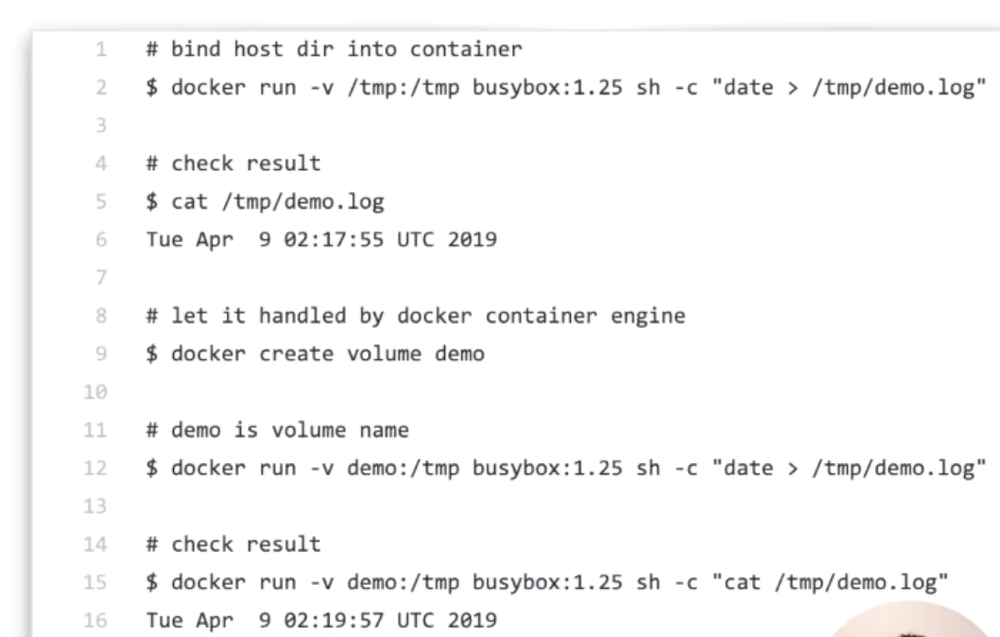
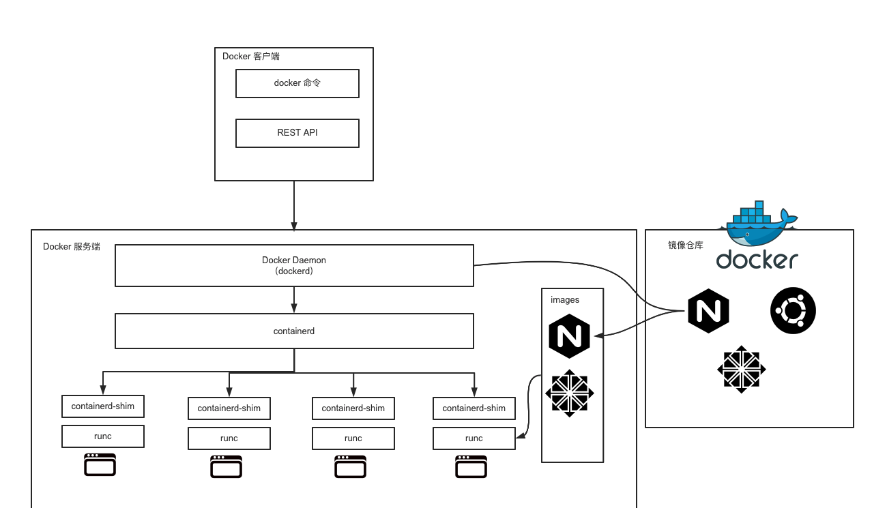
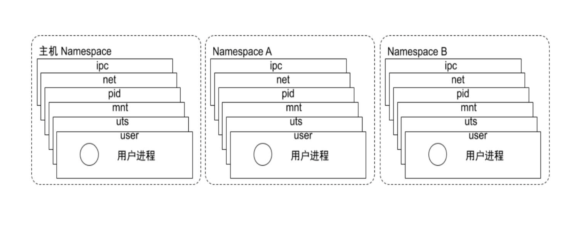
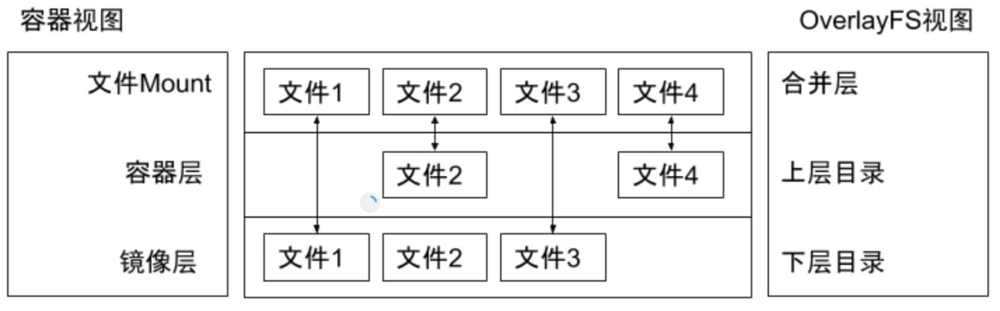
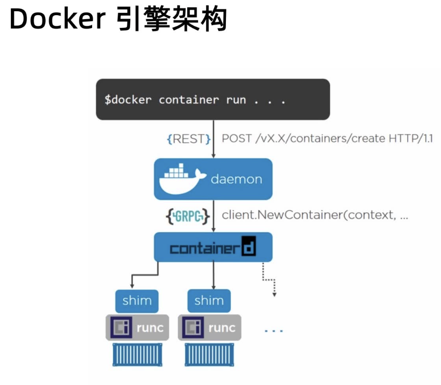
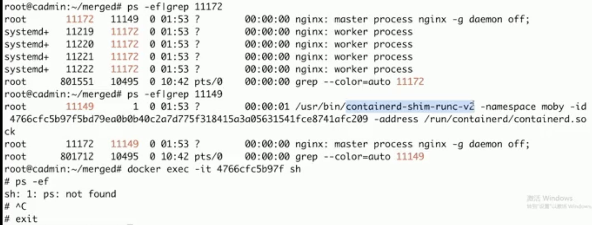
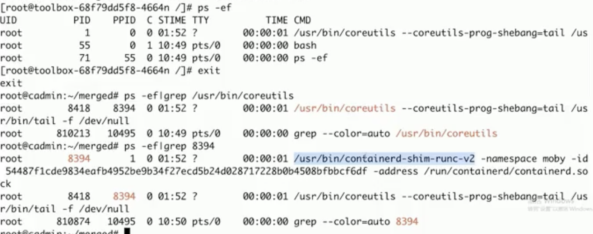
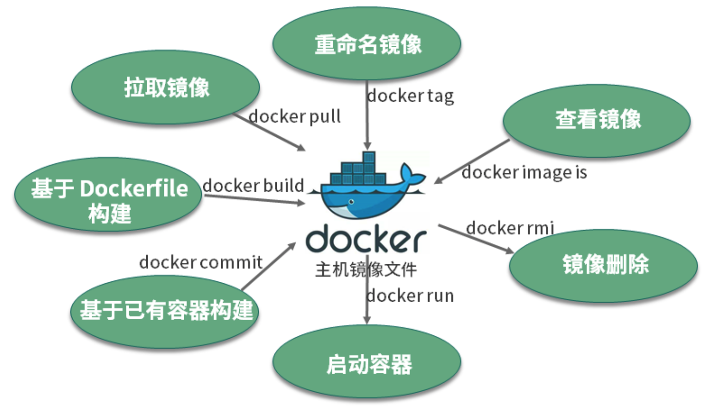
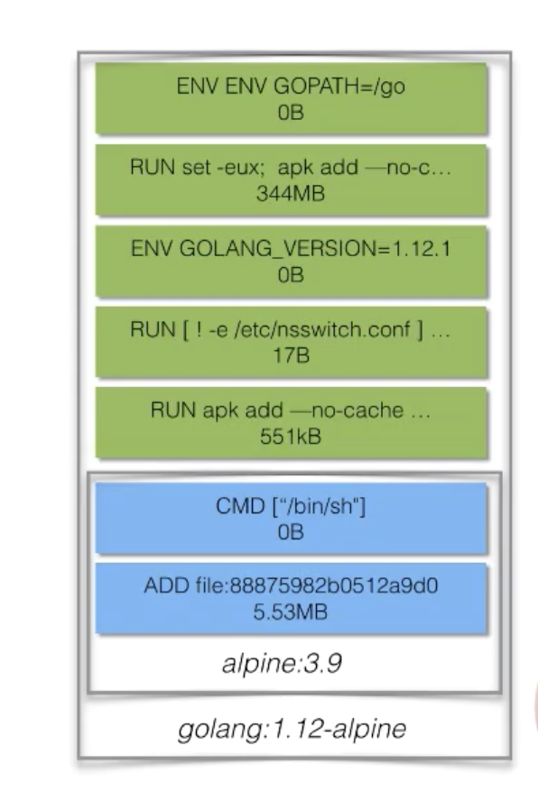
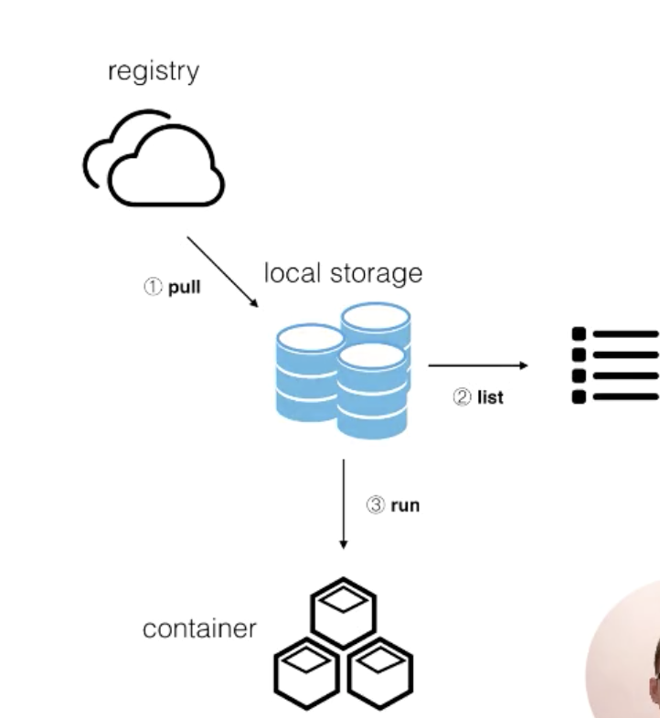

# Container

## 1. Container Overview

Container ecosystem layers


### **1.1 What** is Container (容器)?

* A group of processes run in isolaAon
  * Similar to VMs but managed at the **process level**
  * All processes MUST be able to run on the **shared kernel**
* Each container has its own set of "namespaces" (isolated view)
  * PID - process IDs
  * USER - user and group IDs
  * UTS - hostname and domain name
  * NS - mount points
  * NET - Network devices, stacks, ports
  * IPC - inter-process communications, message queues
  * cgroups - controls limits and monitoring of resources
* Docker gives it its own root filesystem

linux container技术

容器技术：容器有效地将由单个操作系统管理的资源划分到孤立的组中，以更好地在孤立的组之间平衡有冲突的资源使用需求。于虚拟化相比，这样既不需要指令级模拟，也不需要即使编译。容器可以在核心CPU本地运行指令，而不需要任何专门的解释机制。此外，也避免了准虚拟化和系统调用替换中的复杂性。

容器虚拟化：充分利用操作系统自身机制和特性

容器技术：新一代虚拟化技术

- chroot(1982,UNIX) -> Linux Container(LXC,集成到Linux内核中) -> Docker(提供容器管理工具，分层文件系统，镜像；早起Docker完全基于LXC，之后开发了libcontainer，之后Dokcer推动runC项目，使容器不局限于Linux操作系统，而是更安全、更具扩展性。)
- Docker(工具：Machine、Compose、Swarm，容器平台：Kubernetes，Mesos，CoreOS)

容器也是对服务器资源进行隔离，包括CPU份额、网络I/O、带宽、存储I/O、内存等。同一台主机上的多台容器之间可以公平友好地共享资源，而不互相影响。

容器就是和系统其它部分隔离开来的进程集合，具有自己独特的视图视角；这里的其他部分包括进程、网络资源以及文件系统等.

在介绍容器的具体概念之前，先简单回顾一下操作系统是如何管理进程的。

首先，当我们登录到操作系统之后，可以通过 ps 等操作看到各式各样的进程，这些进程包括系统自带的服务和用户的应用进程。那么，这些进程都有什么样的特点？

- 第一，这些进程可以相互看到、相互通信；
- 第二，它们使用的是同一个文件系统，可以对同一个文件进行读写操作；
- 第三，这些进程会使用相同的系统资源。

这样的三个特点会带来什么问题呢？

- 因为这些进程能够相互看到并且进行通信，高级权限的进程可以攻击其他进程；
- 因为它们使用的是同一个文件系统，因此会带来两个问题：这些进程可以对于已有的数据进行增删改查，具有高级权限的进程可能会将其他进程的数据删除掉，破坏掉其他进程的正常运行；此外，进程与进程之间的依赖可能会存在冲突，如此一来就会给运维带来很大的压力；
- 因为这些进程使用的是同一个宿主机的资源，应用之间可能会存在资源抢占的问题，当一个应用需要消耗大量 CPU 和内存资源的时候，就可能会破坏其他应用的运行，导致其他应用无法正常地提供服务。

针对上述的三个问题，如何为进程提供一个独立的运行环境呢？

- 针对不同进程使用同一个文件系统所造成的问题而言，Linux 和 Unix 操作系统可以通过 **chroot 系统调用**将子目录变成根目录，达到视图级别的隔离；进程在 chroot 的帮助下可以具有独立的文件系统，对于这样的文件系统进行增删改查不会影响到其他进程；
- 因为进程之间相互可见并且可以相互通信，使用 Namespace 技术来实现进程在资源的视图上进行隔离。在 **chroot** 和 **Namespace** 的帮助下，进程就能够运行在一个独立的环境下了；
- 但在独立的环境下，进程所使用的还是同一个操作系统的资源，一些进程可能会侵蚀掉整个系统的资源。为了减少进程彼此之间的影响，可以通过 **Cgroup** 来限制其资源使用率，设置其能够使用的 CPU 以及内存量。

那么，应该如何定义这样的进程集合呢？

其实，容器就是一个视图隔离、资源可限制、独立文件系统的进程集合。**所谓“视图隔离”就是能够看到部分进程以及具有独立的主机名等；控制资源使用率则是可以对于内存大小以及 CPU 使用个数等进行限制。容器就是一个进程集合，它将系统的其他资源隔离开来，具有自己独立的资源视图。

容器具有一个独立的文件系统，因为使用的是系统的资源，所以在独立的文件系统内不需要具备内核相关的代码或者工具，我们只需要提供容器所需的二进制文件、配置文件以及依赖即可。只要容器运行时所需的文件集合都能够具备，那么这个容器就能够运行起来。

容器的核心技术：

namesapce

cgroup

### **1.2 Why** Containers?

* Fast startup Ame - only takes milliseconds to:
  * Create a new directory
  * Lay-down the container's filesystem
  * Setup the networks, mounts, ...
  * Start the process
* Better resource uAlizaAon
  * Can fit far more containers than VMs into a host

### 容器特性

- 安全性：天然隔离
- 隔离性：namespce
- 便携性：overlay FS + namespace
- 可配额：cgroup

### 1.3 容器的发展历史

Linux Container容器技术的诞生（2008年）就解决了IT世界里“集装箱运输”的问题。**Linux Container**（简称LXC）它是一种**内核轻量级的操作系统层**虚拟化技术。Linux Container主要由**Namespace**和**Cgroup**两大机制来保证实现。那么Namespace和Cgroup是什么呢？刚才我们上面提到了集装箱，集装箱的作用当然是可以对货物进行打包隔离了，不让A公司的货跟B公司的货混在一起，不然卸货就分不清楚了。那么Namespace也是一样的作用，做隔离。光有隔离还没用，我们还需要对货物进行资源的管理。同样的，航运码头也有这样的管理机制：货物用什么样规格大小的集装箱，货物用多少个集装箱，货物哪些优先运走，遇到极端天气怎么暂停运输服务怎么改航道等等... 通用的，与此对应的Cgroup就负责资源管理控制作用，比如进程组使用CPU/MEM的限制，进程组的优先级控制，进程组的挂起和恢复等等。

容器的本质，一句话解释，就是**一组受到资源限制，彼此间相互隔离的进程**。隔离所用到的技术都是由linux内核本身提供的（所以说目前绝大部分的容器都是必须要跑在linux里面的）。其中namespace用来做访问隔离（每个容器进程都有自己独立的进程空间，看不到其他进程），cgroups用来做资源限制（cpu、内存、存储、网络的使用限制）。

P
在同一台服务器上部署容器，其密度相较于虚拟机可以提升约10倍。

但是容器并不是一个新的技术，它至少可以追溯到2000年FreeBSD jails 的出现，而 FreeBSD jails 则是基于 1982 年 BSD UNIX 的 **chroot C** 命令。再往前，chroot最早源于1979年UNIX7版本。通过chroot可以改变进程和子进程所能看到的根目录，这意味着可以在指定的根目录下独立运行程序，所以说从早期的chroot中就可以看出容器的踪迹。但是chroot仅适合于运行简单的应用，往往只是一个shell程序。虽然chroot会为程序创造一个jail, jail通过虚拟对文件系统、网络等的访问，限制用户的行为，但是还是有些方法很容易发生"越狱"，这使得chroot很难应用于大型复杂系统。

SUN利用了 jail的概念，将其演化成Solaris Zones。但这一技术是Solaris特有的，所以虽然我们可以在Zone中运行Solaris应用或者一个更早版本的Solaris,但是无法在AIX或者Linux中运用这一技术。

在 Solaris 基于 FreeBSD jail 开发 Solaris Zone 的同时，Google、RedHat、 Canonical等公司也基于Linux进行了容器的相关研究。Parallels在2001年研发了 **Virtuozzo**,并获得了一定的商业成功。Parallels Virtuozzo在2005年演变为**OpenVZ** 其后又作为**LXC**开源进入Linux内核。而Google于2013年开源了 Imctfy项目，虽然Google容器项目开源得很晚，但事实上，Parallels. RedHat以及Google自身的Imctfy项目都是依托于Google的**cgroup**技术。cgroup技术使得开发者可以进一步抽象系统资源，增强了 Linux系统安全性。Google内部也一直在使用容器支持日常的公司运作，甚至支持Google Doc、Gmailₛ Google Search等商业应用。Google每周要运行约20亿个容器。

但是，对于大部分公司，容器还是一个神秘甚至有些令人畏惧的技术。直到Docker的出现才改变了业界开发、运维模式。Docker使得人们认识了又一个开源容器项目libcontainer, Docker自身也成为了 Linux容器的事实标准。早期docker代码实现是直接基于LXC的。自0.9版本后，docker开发了**libcontainer**项目作为更广泛的容器驱动实现。目前docker还积极推动成立了runC标准项目。并贡献给开发容器联盟，试图让容器的支持不再局限于linux操作系统，而是更安全、更开放、更具扩展性。

## 3. 容器运行时的生命周期

容器是一组具有隔离特性的进程集合，在使用 docker run 的时候会选择一个镜像来提供独立的文件系统并指定相应的运行程序。这里指定的运行程序称之为 initial 进程，这个 initial 进程启动的时候，容器也会随之启动，当 initial 进程退出的时候，容器也会随之退出。

因此，可以认为**容器的生命周期和 initial 进程的生命周期是一致的**。当然，因为容器内不只有这样的一个 initial 进程，initial 进程本身也可以产生其他的子进程或者通过 docker exec 产生出来的运维操作，也属于 initial 进程管理的范围内。当 initial 进程退出的时候，所有的子进程也会随之退出，这样也是为了防止资源的泄漏。

但是这样的做法也会存在一些问题，首先应用里面的程序往往是有状态的，其可能会产生一些重要的数据，当一个容器退出被删除之后，数据也就会丢失了，这对于应用方而言是不能接受的，所以需要将容器所产生出来的重要数据持久化下来**。容器能够直接将数据持久化到指定的目录上，这个目录就称之为数据卷。

数据卷有一些特点，其中非常明显的就是数据卷的生命周期是独立于容器的生命周期的，也就是说容器的创建、运行、停止、删除等操作都和数据卷没有任何关系，因为它是一个特殊的目录，是用于帮助容器进行持久化的。简单而言，我们会将数据卷挂载到容器内，这样一来容器就能够将数据写入到相应的目录里面了，而且容器的退出并不会导致数据的丢失。

通常情况下，数据卷管理主要有两种方式：

- 第一种是通过 bind 的方式，直接将宿主机的目录直接挂载到容器内；这种方式比较简单，但是会带来运维成本，因为其依赖于宿主机的目录，需要对于所有的宿主机进行统一管理。
- 第二种是将目录管理交给运行引擎。



## 5. Container Runtime

对container runtime而言，“为了运行特定语言而提供的特定实现和设计”的这种理解方式无疑是更恰当的。Container runtime需要为运行一个container的方方面面的行为而负责。尽管不同层次runtimes的实现可谓迥异，但一个运行期的container就是一个实际意义上的container runtime。

Container Runtime(容器运行时)就是要掌控容器运行的整个生命周期, 以 docker 为例，其作为一个整体的系统，主要提供的功能如下：

* 制定容器镜像格式

- 构建容器镜像 `docker build`
- 管理容器镜像 `docker images`
- 管理容器实例 `docker ps`
- 运行容器 `docker run`
- 实现容器镜像共享 `docker pull/push`
  这些功能均可由小的组件单独实现，且没有相互依赖。

### 5.1 OCI 容器标准

OCI: 容器标准
OCI组织于2015年创建，是一个致力于定义容器镜像标准和运行时标准的开放式组织。
Open Container Initiative，是由多家公司(Docker, google, CoreOS)共同成立的项目，并由linux基金会进行管理，致力于container runtime的标准的制定和runc的开发等工作。所谓container runtime，主要负责的是容器的生命周期的管理。OCI的runtime spec标准中对于容器的状态描述，以及对于容器的创建、删除、查看等操作进行了定义。

OCI主要定义两个规范

* Runtime Specification:  运行时规范(https://github.com/opencontainers/runtime-spec) 描述如何运行 `filesystem bundle` ；文件系统包如何解压至硬盘供运行时运行。运行时标准定义如何解压应用包并运行
* Image Specification：镜像规范(https://github.com/opencontainers/image-spec) 制定镜像格式、操作等；如何通过构建系统打包，生成镜像清单（Manifest）、文件系统序列化文件、镜像配置。镜像标准定义应用如何打包
* DistributionSpecification: 分发标准。分发标准定义如何分发容器镜像

> filesystem bundle(文件系统束): 定义了一种将容器编码为文件系统束的格式，即以某种方式组织的一组文件，并包含所有符合要求的运行时对其执行所有标准操作的必要数据和元数据，即config.json 与 根文件系统。

容器运行时分成 low-level 和 high-level :

low-level runtime 关注如何与操作系统交互，创建并运行容器。目前常见的 low-level runtime有：

- lmctfy -- 是Google的一个项目，它是Borg使用的容器运行时
- runc -- 目前使用最广泛的容器运行时。它最初是作为Docker的一部分开发的，后来被提取出来作为一个单独的工具和库。其实现了 OCI 规范，包含config.json文件和容器的根文件系统。
- rkt -- CoreOS开发的Docker/runc的一个流行替代方案，提供了其他 low-level runtimes (如runc)所提供的所有特性。

容器在 linux 中使用 namesapce 实现资源隔离，使用 cgroup 实现资源限制，这里我们详细介绍下如何创建一个简单的 runtime。

我们以 busybox 镜像作为运行时的一个根文件系统，首先创建一个临时目录并将 busybox 中的所有文件解压缩到目录中

### 5.2 runC

runc是对于OCI标准的一个参考实现，是一个由Docker和Google开源的可以用于创建和运行容器的CLI(command-line interface)工具和库。runc直接与容器所依赖的cgroup/linux kernel等进行交互，负责为容器配置cgroup/namespace等启动容器所需的环境，创建启动容器的相关进程。runC基本上就是一个命令行小工具，它可以不用通过Docker引擎，直接就可以创建容器。这是一个独立的二进制文件，使用OCI容器就可以运行它。

在此之后，各种运行时工具和库也慢慢出现，例如 rkt、containerd、cri-o 等，然而这些工具所拥有的功能却不尽相同，有的只有运行容器(runc、lxc)，而有的除此之外也可以对镜像进行管理(containerd、cri-o)。目前较为流行的说法是将容器运行时分成了 low-level 和 high-level 两类。

* low-level: 指的是仅关注运行容器的容器运行时，调用操作系统，使用 namespace 和 cgroup 实现资源隔离和限制。
* high-level: 指包含了更多上层功能，例如 grpc调用，镜像存储管理等。

不同工具的关系如下图：


### 5.3 containerd

containerd 是一个守护进程，它可以使用runC管理容器，并使用gRPC暴露容器的其他功能。相比较Docker引擎，使用 gRPC ，containerd暴露出针对容器的增删改查的接口，Docker engine调用这些接口完成对于容器的操作。

## 6. Container vs VM

VM 利用 **Hypervisor 虚拟化技术**来模拟 CPU、内存等硬件资源，这样就可以在宿主机上建立一个 Guest OS，这是常说的安装一个虚拟机。

每一个 Guest OS 都有一个独立的内核，比如 Ubuntu、CentOS 甚至是 Windows 等，在这样的 Guest OS 之下，每个应用都是相互独立的，VM 可以提供一个更好的隔离效果。但这样的隔离效果需要付出一定的代价，因为需要把一部分的计算资源交给虚拟化，这样就很难充分利用现有的计算资源，并且每个 Guest OS 都需要占用大量的磁盘空间，比如 Windows 操作系统的安装需要 10~30G 的磁盘空间，Ubuntu 也需要 5~6G，同时这样的方式启动很慢。正是因为虚拟机技术的缺点，催生出了容器技术。

容器是针对于进程而言的，因此无需 Guest OS，只需要一个独立的文件系统提供其所需要文件集合即可。所有的文件隔离都是进程级别的，因此启动时间快于 VM，并且所需的磁盘空间也小于 VM。当然了，进程级别的隔离并没有想象中的那么好，隔离效果相比 VM 要差很多。

总体而言，容器和 VM 相比，各有优劣，因此容器技术也在向着**强隔离**方向发展。

## 7. Container vs Hypervisor虚拟化

容器虚拟化和Hypervisor虚拟化的差别在于，容器虚拟化没有Hypervisor层，容器间相互隔离，但是容器共享操作系统，甚至bins/libs,如图2·6所示。每个容器不是独立的操作系统，所以容器虚拟化没有冗余的操作系统内核及相应的二进制库等，这使得容器部署、启动的开销几乎为零，且非常迅速。总的来说容器就是一种**基于操作系统能力的隔离技术**，这和基于hypervisor的虚拟化技术（能完整模拟出虚拟硬件和客户机操作系统）复杂度不可同日而语。


## 8. LinuxContainer vs Docker

Docker技术是否与传统的 Linux 容器相同？否。Docker 技术最初是基于 [LXC ](https://www.redhat.com/zh/topics/containers/whats-a-linux-container)技术构建（大多数人都会将这一技术与“传统的”Linux 容器联系在一起），但后来它逐渐摆脱了对这种技术的依赖。就轻量级 [虚拟化](https://www.redhat.com/zh/topics/virtualization) 这一功能来看，LXC 非常有用，但它无法提供出色的开发人员或用户体验。除了运行容器之外，Docker 技术还具备其他多项功能，包括简化用于构建容器、传输镜像以及控制镜像版本的流程。


容器引擎，https://docs.docker.com/

为什么使用Docker？

传统虚拟机技术是虚拟出一套硬件后，在其上运行一个完整操作系统，在该系统上再运行所需应用进程；而容器内的应用进程直接运行于宿主的内核，容器内没有自己的内核，而且也没有进行硬件虚拟。因此容器要比传统虚拟机更为轻便。

# Docker

https://www.cnblogs.com/phpphp/p/18133729


Reference：

* https://docs.docker.com/get-started/overview/
* https://yeasy.gitbooks.io/docker_practice/
* https://docs.docker.com/
* Install Docker: https://docs.docker.com/get-docker/

## 1. Docker Overview

**What**: Docker - an open platform for developing, shipping, and running applications. Docker provides the ability to package and run an application in a loosely isolated environment called a container

Docker creates and manages the lifecycle of containers* Setup filesystem

* CRUD container
  * Setup networks
  * Setup volumes / mounts
  * Create: start new process telling OS to run it in isolaAon

Docker 使用 Google 公司推出的 Go 语言 进行开发实现，基于 Linux 内核的 cgroup，namespace，以及 AUFS 类的 Union FS 等技术，对进程进行封装隔离，属于 操作系统层面的虚拟化技术。由于隔离的进程独立于宿主和其它的隔离的进程，因此也称其为容器。最初实现是基于 LXC，从 0.7 版本以后开始去除 LXC，转而使用自行开发的 libcontainer，从 1.11 开始，则进一步演进为使用 runC 和 containerd。

Docker 在容器的基础上，进行了进一步的封装，从文件系统、网络互联到进程隔离等等，极大的简化了容器的创建和维护。使得 Docker 技术比虚拟机技术更为轻便、快捷。

**Why**:

* separate applications from infrastructure, deliver software quickly, .
* manage infratructure in the same ways you manage applications
* shippping, testing and deploying code quickly,
* reduce the delay between writing code and runnig it in production.
* Containers are lightweight and contain everything needed to run the application, so you do not need to rely on what is currently installed on the host.
* easily share containers while you work, and be sure that everyone you share with gets the same container that works in the same way.
* **Fast, consistent delivery of your applications**:  Containers are great for CI/CD workflows.
* **Responsive deployment and scaling**： Docker’s container-based platform allows for highly portable workloads. Docker containers can run on a developer’s local laptop, on physical or virtual machines in a data center, on cloud providers, or in a mixture of environments. Docker’s portability and lightweight nature also make it easy to dynamically manage workloads, scaling up or tearing down applications and services as business needs dictate, in near real time.
* **Running more workloads on the same hardware**： Docker is lightweight and fast. It provides a viable, cost-effective alternative to hypervisor-based virtual machines, so you can use more of your compute capacity to achieve your business goals. Docker is perfect for high density environments and for small and medium deployments where you need to do more with fewer resources.

## 2. Docker architecture





Docker daemon: The Docker daemon (`dockerd`) listens for Docker API requests and manages Docker objects such as images, containers, networks, and volumes. A daemon can also communicate with other daemons to manage Docker services.

Docker client: The Docker client (`docker`) is the primary way that many Docker users interact with Docker. When you use commands such as `docker run`, the client sends these commands to `dockerd`, which carries them out. The `docker` command uses the Docker API. The Docker client can communicate with more than one daemon.

Docker desktop: Docker Desktop is an easy-to-install application for your Mac or Windows environment that enables you to build and share containerized applications and microservices. Docker Desktop includes the Docker daemon (`dockerd`), the Docker client (`docker`), Docker Compose, Docker Content Trust, Kubernetes, and Credential Helper. For more information, see [Docker Desktop](https://docs.docker.com/desktop/).

docker registries: A Docker *registry* stores Docker images. Docker Hub is a public
registry that anyone can use, and Docker is configured to look for images on
Docker Hub by default. You can even run your own private registry.

When you use the `docker pull` or `docker run` commands, the required images are pulled from your configured registry. When you use the `docker push` command, your image is pushed to your configured registry.

Docker objects

Image

Docker images

* Tar file containing a container's filesystem + metadata
* For sharing and redistribuAon
  * Global/public registry for sharing: DockerHub
* Similar, in concept, to a VM image

Containers

## 3. Docker 核心技术

* Namespce: linux原生技术，将应用进程放到一个隔离的环境里，单独的运行环境
* cgroup：linux原生技术，给进程分配一定的配额
* 文件系统：容器的文件系统，Docker的创新点在此，namespace和cgroup都是已有技术

### 3.1 Namespace

Linux Namespace是一种Linux Kernel提供的资源隔离方案：

* 系统可以为进程分配不同的Namespace；
* 并保证不同的Namespace资源独立分配、进程彼此隔离，即不同的Namespace下的进程互不干扰。

Linux 内核代码中Namespace的实现：无论线程还是进程在linux里都是一个task

* 进程数据结构

  ```c
  struct task_struct{
    ...
    /* namespace */
    struct nsproxy *nsproxy;
    ...
  }
  ```
* Namespace 数据结构

  ```c
  struct nsproxy{
    atomic_t count;
    struct uts_namespace *uts_ns;
    struct ipc_namespace *ipc_ns;
    struct mnt_namespace *mnt_ns;
    struct pid_namespace *pid_ns_for_chileren;
    struct net * net_ns;
  }
  ```

Linux对Namespace操作方法：

第一个进程是systemd，pid=1，会分一个默认的namespace，systemd起其他进程时有以下几种方式：

* clone：在创建新进程的系统调用时，可以通过flags参数指定需要新建的Namespace类型：

  ```c
  // CLONE_NEWCGROUP/ CLONE_NEWIPC/ CLONE_NEWNET/ CLONE_NEWNS/CLONE_NEWPID/CLONE_NEWUSER/ CLONE_NEWUTS
  int clone(int (*fn)(void *), void *child_stack, int flags, void *arg)
  ```
* setns：该系统调用可以让调用进程加入某个已经存在的Namespace中：

  ```c
  Int setns(int fd, int nstype)
  ```
* unshare：该系统调用可以将调用进程移动到新的Namespace下：

  ```c
  int unshare(int flags)
  ```

隔离性 —— Linux Namespace

| Namespace类型 | 隔离资源                     | kernel版本 |
| ----------- | ------------------------ | -------- |
| IPC         | System V IPC 和POSIX 消息队列 | 2.6.19   |
| Network     | 网络设备，网络协议。网络接口等          | 2.6.29   |
| PID         | 进程                       | 2.6.14   |
| Mount       | 挂载点                      | 2.4.19   |
| UTS         | 主机名和域名                   | 2.6.19   |
| USR         | 用户和用户组                   | 3.8      |



不同namespace之间是相互隔离的:

* Pid namespace:
  * 不同用户的**进程**就是通过Pid namespace隔离开的，且不同namespace 中**可以有相同Pid**。
  * 有了Pid namespace, 每个namespace中的Pid能够相互隔离。
* net namespace
  * 网络隔离是通过net namespace实现的，每个net namespace有独立的network devices, IPaddresses, IP routing tables, /proc/net 目录。
  * Docker默认采用veth的方式将container中的虚拟网卡同host上的一个docker bridge: docker0连接在一起。
* ipc namespace
  * Container中进程交互还是采用linux常见的进程间交互方法（interprocess communication –IPC）, 包括常见的信号量、消息队列和共享内存。
  * container 的进程间交互实际上还是host上具有相同Pid namespace中的进程间交互，因此需要在IPC资源申请时加入namespace信息-每个IPC资源有一个唯一的32 位ID。
* mnt namespace
  * mnt namespace允许不同namespace的进程看到的文件结构不同，这样每个namespace 中的进程所看到的文件目录就被隔离开了。
* utsnamespace
  * UTS(“UNIX Time-sharing System”) namespace允许每个container拥有独立的hostname和domain name, 使其在网络上可以被视作一个独立的节点而非Host上的一个进程。
* user namespace
  * 每个container可以有不同的user 和group id, 也就是说可以在container内部用container内部的用户执行程序而非Host上的用户。

关于namespace的常用操作:

* 查看当前系统的namespace：lsns –t `<type>` e.g: lsns -t net
* 查看某进程的namespace：ls -la /proc/`<pid>`/ns/
* 进入某namespace运行命令：nsenter -t `<pid>` -n ip addr

unshare -fn sleep 60 # 在新network namespace 执行sleep指令

p s

### 3.2 Cgroup

Cgroups（Control Groups）是Linux下用于对一个或一组进程进行资源控制和监控的机制；

可以对诸如CPU使用时间、内存、磁盘I/O等进程所需的资源进行限制；

不同资源的具体管理工作由相应的Cgroup子系统（Subsystem）来实现；

针对不同类型的资源限制，只要将限制策略在不同的的子系统上进行关联即可；

Cgroups在不同的系统资源管理子系统中以层级树（Hierarchy）的方式来组织管理：每个Cgroup都可以包含其他的子Cgroup，因此子Cgroup能使用的资源除了受本Cgroup配置的资源参数限制，还受到父Cgroup设置的资源限制。

Linux内核代码中Cgroups的实现

进程数据结构

```c
struct task_struct
{
	#ifdef CONFIG_CGROUPS
	struct css_set__rcu *cgroups;
	struct list_head cg_list;
	#endif
}
```

css_set是cgroup_subsys_state对象的集合数据结构

```c
struct css_set
{
	/*
	* Set of subsystem states, one for each subsystem. This array is
	* immutable after creation apart from the init_css_set during
	* subsystem registration (at boot time).
	*/
	struct cgroup_subsys_state *subsys[CGROUP_SUBSYS_COUNT];
};
```

可配额/可度量-Control Groups (cgroups)

cgroups实现了对资源的配额和度量

* blkio：这个子系统设置限制每个块设备的输入输出控制。例如:磁盘，光盘以及USB等等。
* CPU：这个子系统使用调度程序为cgroup任务提供CPU的访问。
* cpuacct：产生cgroup任务的CPU资源报告。
* cpuset：如果是多核心的CPU，这个子系统会为cgroup任务分配单独的CPU和内存。
* devices：允许或拒绝cgroup任务对设备的访问。
* freezer：暂停和恢复cgroup任务。
* memory：设置每个cgroup的内存限制以及产生内存资源报告。
* net_cls：标记每个网络包以供cgroup方便使用。
* ns：名称空间子系统。•pid:进程标识子系统。

CPU子系统

* cpu.shares：可出让的能获得CPU使用时间的相对值。
* cpu.cfs_period_us：cfs_period_us用来配置时间周期长度，单位为us（微秒）。
* cpu.cfs_quota_us：cfs_quota_us用来配置当前Cgroup在cfs_period_us时间内最多能使用的CPU时间数，单位为us（微秒）。
* cpu.stat：Cgroup内的进程使用的CPU时间统计。
* nr_periods：经过cpu.cfs_period_us的时间周期数量。
* nr_throttled：在经过的周期内，有多少次因为进程在指定的时间周期内用光了配额时间而受到限制。
* throttled_time：Cgroup中的进程被限制使用CPU的总用时，单位是ns（纳秒）。

Linux调度器:

内核默认提供了5个调度器，Linux内核使用struct sched_class来对调度器进行抽象：•

* Stop调度器，stop_sched_class：优先级最高的调度类，可以抢占其他所有进程，不能被其他进程抢占；•
* Deadline调度器，dl_sched_class：使用红黑树，把进程按照绝对截止期限进行排序，选择最小进程进行调度运行；•
* RT调度器，rt_sched_class：实时调度器，为每个优先级维护一个队列；•
* CFS调度器，cfs_sched_class：完全公平调度器，采用完全公平调度算法，引入虚拟运行时间概念；•
* IDLE-Task调度器，idle_sched_class：空闲调度器，每个CPU都会有一个idle线程，当没有其他进程可以调度时，调度运行idle线程。

CFS调度器•

* CFS是Completely Fair Scheduler简称，即完全公平调度器。•
* CFS 实现的主要思想是维护为任务提供处理器时间方面的平衡，这意味着应给进程分配相当数量的处理器。•
* 分给某个任务的时间失去平衡时，应给失去平衡的任务分配时间，让其执行。•
* CFS通过虚拟运行时间（vruntime）来实现平衡，维护提供给某个任务的时间量。•
  * vruntime= 实际运行时间*1024 / 进程权重•
* 进程按照各自不同的速率在物理时钟节拍内前进，优先级高则权重大，其虚拟时钟比真实时钟跑得慢，但获得比较多的运行时间。

### 3.3 文件系统

Union FS： 联合文件系统，本质是将多个文件目录mount成一个合并好的文件目录。容器文件系统本质是为容器准备多个文件目录，然后把这多个目录联合到一起放到一个目录，然后将这个目录打包称为容器的文件系统，对容器来说就是根目录/rootfs

* 将不同目录挂载到同一个虚拟文件系统下（unite several directories into a single virtual filesystem）的文件系统•
* 支持为每一个成员目录（类似GitBranch）设定readonly、readwrite和whiteout-able 权限•
* 文件系统分层, 对readonly权限的branch 可以逻辑上进行修改(增量地, 不影响readonly部分的)。•
* 通常Union FS 有两个用途, 一方面可以将多个disk挂到同一个目录下, 另一个更常用的就是将一个readonly的branch 和一个writeable 的branch 联合在一起。


Docker镜像是通过Dockerfile build出来的，对每条指令构建一个镜像层。pull镜像时对每个镜像层进判断checksum，如果结果一致，则不需要拉取，只pull不相同的层。只做了增量分发。**在容器拉取时复用**

**Docker的文件系统实现**

典型的Linux文件系统组成：•

* Bootfs（boot file system）•
  * Bootloader：引导加载kernel，•
  * Kernel：当kernel被加载到内存中后umountbootfs。•
* rootfs（root file system）•
  * /dev，/proc，/bin，/etc等标准目录和文件。•
  * 对于不同的linux发行版, bootfs基本是一致的，但rootfs会有差别。

Docker启动

* Linux：在启动后，首先将rootfs设置为readonly, 进行一系列检查, 然后将其切换为“readwrite”供用户使用。
* Docker启动•

  * 初始化时也是将rootfs以readonly方式加载并检查，然而接下来利用union mount 的方式将一个readwrite文件系统挂载在readonly的rootfs之上；Docker没有bootfs，它复用主机的kernel，有自己的rootfs。**在容器启动时复用**
  * 并且允许再次将下层的FS（file system）设定为readonly并且向上叠加。•
  * 这样一组readonly和一个writeable的结构构成一个container的运行时态, 每一个FS被称作一个FS层。

写操作：由于镜像具有共享特性，所以对容器可写层的操作需要依赖存储驱动提供的写时复制和用时分配机制，以此来支持对容器可写层的修改，进而提高对存储和内存资源的利用率。•

* 写时复制•

  * 写时复制，即Copy-on-Write。•
  * 一个镜像可以被多个容器使用，但是不需要在内存和磁盘上做多个拷贝。•
  * 在需要对镜像提供的文件进行修改时，该文件会从镜像的文件系统被复制到容器的可写层的文件系统进行修改，而镜像里面的文件不会改变。•
  * 不同容器对文件的修改都相互独立、互不影响。•
* 用时分配：按需分配空间，而非提前分配，即当一个文件被创建出来后，才会分配空间。

**容器存储驱动**：每个容器进程有一个自己的mnt namespace，mnt namespace是容器的的mount namespace，容器进程看到的文件系统与主机不一样是隔离的空间。

| 存储驱动      | Docker                                                 | Containerd |
| ------------- | ------------------------------------------------------ | ---------- |
| AUFS          | 在Ubuntu或者Debian上支持                               | 不支持     |
| OverlayFS     | 支持                                                   | 支持       |
| Device Mapper | 支持                                                   | 支持       |
| Btrfs         | 社区版本在Ubuntu或者Debian上支持，企业版本在SLES上支持 | 支持       |
| ZFS           | 支持                                                   | 不支持     |

| 存储驱动               | 优点                                           | 缺点                                                                        | 应用场景                 |
| ------------------ | -------------------------------------------- | ------------------------------------------------------------------------- | -------------------- |
| AUFS               | Docker最早支持的驱动类型，稳定性高                         | 并未进入主线的内核，因此只能在有限的场合下使用。另外在实现上具有多层结构，在层比较多的场景下，做写时复制有时会需要比较长的时间           | 少I/O的场景              |
| **OverlayFS** (主流) | 并入主线内核，可以在目前几乎所有发行版本上使用。实现上只有两层，因此性能比AUFS高   | 写时复制机制需要复制整个文件，而不能只针对修改部分进行复制，因此对大文件操作会需要比较长的时间。其中Overlay在Docker的后续版本中被移除 | 少I/O的场景              |
| Device Mapper      | 并入主线内核，针对块操作，性能比较高。修改文件时只需复制需要修改的块，效率高       | 不同容器之间不能共享缓存。在Docker的后续版本中会被移除                                            | I/O密集场景              |
| Btrfs              | 并入主线内核，虽然是文件级操作系统，但是可以对块进行操作。                | 需要消耗比较多的内存，稳定性相对比较差                                                       | 需要支持Snapshot等比较特殊的场景 |
| ZFS                | 不同的容器之间可以共享缓存，多个容器访问相同的文件能够共享一个单一的PageCache。 | 在频繁写操作的场景下，会产生比较严重的磁盘碎片。需要消耗比较多的内存，另外稳定性相对比较差                             | 容器高密度部署的场景           |

**以OverlayFS为例**：
OverlayFS也是一种与AUFS类似的联合文件系统，同样属于文件级的存储驱动，包含了最初的Overlay和更新更稳定的overlay2。Overlay只有两层：upper层和lower层，Lower层代表镜像层，upper层代表容器可写层。通过mont构建overlay的目录，一条mount命令指定两个层级：upper层和lower层，这两个层最后被合并成同一个目录。有同名文件时以上层为主。



```sh
# OverlayFS 文件系统练习
$ mkdir upper lower merged work
$ echo "from lower" > lower/in_lower.txt
$ echo "from upper" > upper/in_upper.txt
$ echo "from lower" > lower/in_both.txt
$ echo "from upper" > upper/in_both.txt
$ sudo mount -t overlay overlay -o lowerdir=`pwd`/lower,upperdir=`pwd`/upper,workdir=`pwd`/work `pwd`/merged
$ cat merged/in_both.txt
$ delete merged/in_both.txt
$ delete merged/in_lower.txt
$ delete merged/in_upper.txt
```

Docker起初以docker daemon为主，后来集成了containerd。创建container时，docker daemon调用contaiernd，containerd fork 出shim，shim之后是runc container，然后将shim的父进程由containerd转为systems(pid=1). shim和container一一对应。 以前docker demon fork出shim，shim的父进程为docker daemon，如果docker daemon升级，container将不能用。





在主机上是可以看到container 的 pid=1的进程，只是此时pid不等于1，而是8418. pid namespace



### 3.4 网络

网络有独立的namespce，容器有独立的网络配置，可以有独立的网卡，可以给网卡配ip，为主机配路由，防火墙规则。

Docker提供多种网络模式：‘

* dokcer网络驱动：解决统一主机下容器间网络互通问题，从主机访问容器，容器间互相访问。

  - Bridge(--net=bridge),默认设置

    - 使用Linux网桥和iptables提供容器互联，Docker在每台主机上创建一个名叫docker0的网桥，通过vethpair来连接该主机的每一个EndPoint。
  - Null(--net=None)： 适用场景：需要自己配网络时用，如k8s

    - 把容器放入独立的网络空间但不做任何网络配置；
    - 用户需要通过运行docker network命令来完成网络配置。

  * Host：(--net=host) 不新建namespace，复用主机的

    * 使用主机网络名空间，复用主机网络。
  * Container: 使用--net=container:容器名称或ID指定。（如：--net=container:30b668ccb630）

    * 重用其他容器的网络。
* 当容器网络扩展到多个机器上，容器网络与物理网络是隔离的。

  * Overlay(libnetwork, libkv)

    * 通过网络封包实现。
  * Remote(work with remote drivers)

    * Underlay：•使用现有底层网络，为每一个容器配置可路由的网络IP。•
    * Overlay：•通过网络封包实现。

**Null模式**

Null模式是一个空实现，不建namespace；可以通过Null模式启动容器并在宿主机上通过命令为容器配置网络。

```sh
mkdir -p /var/run/netns
find -L /var/run/netns -type l -delete
ln -s /proc/$pid/ns/net /var/run/netns/$pid
ip link add A type veth peer name B
brctl addif br0 A
ip link set A up
ip link set B netns $pid
ip netns exec $pid ip link set dev B name eth0
ip netns exec $pid ip link set eth0 up
ip netns exec $pid ip addr add
$SETIP/$SETMASK dev eth0
ip netns exec $pid iproute add default via
$GATEWAY
```

Docker网络默认模式–网桥和NAT：

* 为主机eth0分配IP192.168.0.101；
* 启动dockerdaemon，查看主机iptables；

  * POSTROUTING -A POSTROUTING -s 172.17.0.0/16 ! -o docker0 -j MASQUERADE
  * docker0是网桥，可以把docker0看作一个交换机，网桥是linux上的一个设备，命令bridge show
* 在主机启动容器：

  * docker run -d --name ssh-p 2333:22 centos-ssh
  * Docker会以标准模式配置网络：

    * 创建vethpair；又驱动cnm(docker)或cni(k8s)构建vethpait叫veth，是linux上的一个虚拟设备，可以看作一条网线, vethpair可以跨namespace。
    * 将vethpair的一端连接到docker0网桥；
    * vethpair的另外一端设置为容器名空间的eth0；这端作为容器的虚拟网口
    * 为容器名空间的eth0分配ip；172.17.0.2    由驱动cnm(docker中是container network manager，k8s里是cni, container network interface) 分配ip
    * 主机上的Iptables 规则：PREROUTING -A DOCKER ! -idocker0 -p tcp-m tcp --dport 2333 -j DNAT --to-destination 172.17.0.2:22。
* 容器1和容器2连在同一个网桥上，所以网络是联通的

## 4 容器镜像

**容器镜像(Docker Image)** 就是容器运行时所需要的所有文件集合，其具备一次构建、到处运行的特点。镜像是一个只读的 Docker 容器模板，包含启动容器所需要的所有文件系统结构和内容。简单来讲， **镜像是一个特殊的文件系统** ，它提供了容器运行时所需的程序、软件库、资源、配置等静态数据。即镜像不包含任何动态数据，镜像内容在构建后不会被改变。



通常采用 **Dockerfile** **来构建镜像**，因为 Dockerfile 提供了非常便利的语法糖，能够帮助我们很好地描述构建的每个步骤。当然，每个构建步骤都会对已有的文件系统进行操作，这样就会带来文件系统内容的变化，我们将这些变化称之为 **changeset**。当我们把构建步骤所产生的变化依次作用到一个空文件夹上，就能够得到一个完整的镜像。



changeset 的分层以及复用特点能够带来几点优势：

- 第一，能够提高分发效率，简单试想一下，对于大的镜像而言，如果将其拆分成各个小块就能够提高镜像的分发效率，这是因为镜像拆分之后就可以并行下载这些数据；
- 第二，因为这些数据是相互共享的，也就意味着当本地存储上包含了一些数据的时候，只需要下载本地没有的数据即可，举个简单的例子就是 golang 镜像是基于 alpine 镜像进行构建的，当本地已经具有了 alpine 镜像之后，在下载 golang 镜像的时候只需要下载本地 alpine 镜像中没有的部分即可；
- 第三，因为镜像数据是共享的，因此可以节约大量的磁盘空间，简单设想一下，当本地存储具有了 alpine 镜像和 golang 镜像，在没有复用的能力之前，alpine 镜像具有 5M 大小，golang 镜像有 300M 大小，因此就会占用 305M 空间；而当具有了复用能力之后，只需要 300M 空间即可。

### 4.1 Dockerfile

最常用的镜像构建方式：Dockerfile。Dockerfile 是一个包含了用户所有构建命令的文本。**通过docker build命令可以从 Dockerfile 生成镜像。**

使用 Dockerfile 构建镜像具有以下特性：

* Dockerfile 的每一行命令都会生成一个独立的镜像层，并且拥有唯一的 ID；
* Dockerfile 的命令是完全透明的，通过查看 Dockerfile 的内容，就可以知道镜像是如何一步步构建的；
* Dockerfile 是纯文本的，方便跟随代码一起存放在代码仓库并做版本管理。

先学习下 Dockerfile 常用的指令。

Dockerfile 指令	指令简介

* FROM	Dockerfile 除了注释第一行必须是 FROM ，FROM 后面跟镜像名称，代表我们要基于哪个基础镜像构建我们的容器。（  **默认会先从本地去查找镜像** ）
* RUN	RUN 后面跟一个具体的命令，类似于 Linux 命令行执行命令。
* ADD	拷贝本机文件或者远程文件到镜像内
* COPY	拷贝本机文件到镜像内
* USER	指定容器启动的用户
* ENTRYPOINT	容器的启动命令
* CMD	CMD 为 ENTRYPOINT 指令提供默认参数，也可以单独使用 CMD 指定容器启动参数
* ENV	指定容器运行时的环境变量，格式为 key=value
* ARG	定义外部变量，构建镜像时可以使用 build-arg = 的格式传递参数用于构建
* EXPOSE	指定容器监听的端口，格式为 [port]/tcp 或者 [port]/udp
* WORKDIR	为 Dockerfile 中跟在其后的所有 RUN、CMD、ENTRYPOINT、COPY 和 ADD 命令设置工作目录。

先分析下如下Dockerfile文件中的含义：

```dockerfile
FROM centos:7
COPY nginx.repo /etc/yum.repos.d/nginx.repo
RUN yum install -y nginx
EXPOSE 80
ENV HOST=mynginx
CMD ["nginx","-g","daemon off;"]
  
```

* 第一行表示我要基于 centos:7 这个镜像来构建自定义镜像。这里需要注意，每个 Dockerfile 的第一行除了注释都必须以 FROM 开头。
* 第二行表示拷贝本地文件 nginx.repo 文件到容器内的 /etc/yum.repos.d 目录下。这里拷贝 nginx.repo 文件是为了添加 nginx 的安装源。
* 第三行表示在容器内运行yum install -y nginx命令，安装 nginx 服务到容器内，执行完第三行命令，容器内的 nginx 已经安装完成。
* 第四行声明容器内业务（nginx）使用 80 端口对外提供服务。
* 第五行定义容器启动时的环境变量 HOST=mynginx，容器启动后可以获取到环境变量 HOST 的值为 mynginx。
* 第六行定义容器的启动命令，命令格式为 json 数组。这里设置了容器的启动命令为 nginx ，并且添加了 nginx 的启动参数 -g 'daemon off;' ，使得 nginx 以前台的方式启动。

上面这个 Dockerfile 的例子基本涵盖了常用的镜像构建指令。

**Dockerfile编写遵循的原则:**

遵循以下 Dockerfile 书写原则，不仅可以使得我们的 Dockerfile 简洁明了，让协作者清楚地了解镜像的完整构建流程，还可以帮助我们减少镜像的体积，加快镜像构建的速度和分发速度。

**（1）单一职责**
	由于容器的本质是进程，一个容器代表一个进程，因此不同功能的应用应该尽量拆分为不同的容器，每个容器只负责单一业务进程。

**（2）提供注释信息**
	Dockerfile 也是一种代码，我们应该保持良好的代码编写习惯，晦涩难懂的代码尽量添加注释，让协作者可以一目了然地知道每一行代码的作用，并且方便扩展和使用。

**（3）保持容器最小化**
	应该避免安装无用的软件包，比如在一个 nginx 镜像中，我并不需要安装 vim 、gcc 等开发编译工具。这样不仅可以加快容器构建速度，而且可以避免镜像体积过大。

**（4）合理选择基础镜像**
	容器的核心是应用，因此只要基础镜像能够满足应用的运行环境即可。例如一个Java类型的应用运行时只需要JRE，并不需要JDK，因此我们的基础镜像只需要安装JRE环境即可。

**（5）使用 .dockerignore 文件**
	在使用git时，我们可以使用.gitignore文件忽略一些不需要做版本管理的文件。同理，使用.dockerignore文件允许我们在构建时，忽略一些不需要参与构建的文件，从而提升构建效率。.dockerignore的定义类似于.gitignore。

.dockerignore的本质是文本文件，Docker 构建时可以使用换行符来解析文件定义，每一行可以忽略一些文件或者文件夹。具体使用方式如下：

```
规则			   含义
# 开头的表示注释，# 后面所有内容将会被忽略
/tmp			匹配当前目录下任何以 tmp 开头的文件或者文件夹
*.md			匹配以 .md 为后缀的任意文件
tem?			匹配以 tem 开头并且以任意字符结尾的文件，？代表任意一个字符
!README.md  	! 表示排除忽略。
```

**（6）尽量使用构建缓存**
	Docker 构建过程中，每一条 Dockerfile 指令都会提交为一个镜像层，下一条指令都是基于上一条指令构建的。如果构建时发现要构建的镜像层的父镜像层已经存在，并且下一条命令使用了相同的指令，即可命中构建缓存。

Docker 构建时判断是否需要使用缓存的规则如下：

* 从当前构建层开始，比较所有的子镜像，检查所有的构建指令是否与当前完全一致，如果不一致，则不使用缓存；
* 一般情况下，只需要比较构建指令即可判断是否需要使用缓存，但是有些指令除外（例如ADD和COPY）；
* 对于ADD和COPY指令不仅要校验命令是否一致，还要为即将拷贝到容器的文件计算校验和（根据文件内容计算出的一个数值，如果两个文件计算的数值一致，表示两个文件内容一致 ），命令和校验和完全一致，才认为命中缓存。
* 因此，基于 Docker 构建时的缓存特性，我们可以把不轻易改变的指令放到 Dockerfile 前面（例如安装软件包），而可能经常发生改变的指令放在 Dockerfile 末尾（例如编译应用程序）。
* 例如，我们想要定义一些环境变量并且安装一些软件包，可以按照如下顺序编写 Dockerfile：

```
FROM centos:7
# 设置环境变量指令放前面
ENV PATH /usr/local/bin:$PATH
# 安装软件指令放前面
RUN yum install -y make
# 把业务软件的配置,版本等经常变动的步骤放最后
```

按照上面原则编写的 Dockerfile 在构建镜像时，前面步骤命中缓存的概率会增加，可以大大缩短镜像构建时间。

**（7）正确设置时区**
	我们从 Docker Hub 拉取的官方操作系统镜像大多数都是 UTC 时间（世界标准时间）。如果你想要在容器中使用中国区标准时间（东八区），请根据使用的操作系统修改相应的时区信息，下面我介绍几种常用操作系统的修改方式：

**Ubuntu 和Debian 系统**

Ubuntu 和Debian 系统可以向 Dockerfile 中添加以下指令：

```
RUN ln -sf /usr/share/zoneinfo/Asia/Shanghai /etc/localtime
RUN echo "Asia/Shanghai" >> /etc/timezone
```

**CentOS系统**

CentOS 系统则向 Dockerfile 中添加以下指令：

```
RUN ln -sf /usr/share/zoneinfo/Asia/Shanghai /etc/localtime
```

**（8）使用国内软件源加快镜像构建速度**
	由于我们常用的官方操作系统镜像基本都是国外的，软件服务器大部分也在国外，所以我们构建镜像的时候想要安装一些软件包可能会非常慢。

**（9）最小化镜像层数**
在构建镜像时尽可能地减少 Dockerfile 指令行数。例如我们要在 CentOS 系统中安装make和net-tools两个软件包，应该在 Dockerfile 中使用以下指令：

```
RUN yum install -y make net-tools
```

而不应该写成这样：

```
RUN yum install -y make
RUN yum install -y make
```

了解完 Dockerfile 的书写原则后，我们再来具体了解下这些原则落实到具体的 Dockerfile 指令应该如何书写。

**Dockerfile 指令书写建议:**

下面是我们常用的一些指令:

**（1）RUN**
RUN指令在构建时**将会生成一个新的镜像层**并且执行RUN指令后面的内容。

使用RUN指令时应该尽量遵循以下原则：

* 当RUN指令后面跟的内容比较复杂时，建议使用反斜杠（\） 结尾并且换行；
* RUN指令后面的内容尽量按照字母顺序排序，提高可读性。

例如，在官方的 CentOS 镜像下安装一些软件，一个建议的 Dockerfile 指令如下：

```
FROM centos:7
RUN yum install -y automake \
                   curl \
                   python \
                   vim
```

**（2）CMD 和 ENTRYPOINT**

    **CMD和ENTRYPOINT指令都是容器运行的命令入口** 。

这两个指令的相同之处，CMD和ENTRYPOINT的基本使用格式分为两种。

* 第一种为CMD/ENTRYPOINT["command" , "param"]。这种格式是使用 **Linux 的exec**实现的， 一般称为exec模式，这种书写格式为CMD/ENTRYPOINT后面跟 json 数组，也是Docker 推荐的使用格式。
* 另外一种格式为CMD/ENTRYPOINTcommand param ，这种格式是**基于 shell 实现**的， 通常称为shell模式。当使用shell模式时，Docker 会以 /bin/sh -c command 的方式执行命令。

区别：

* Dockerfile 中如果使用了ENTRYPOINT指令，启动 Docker 容器时需要使用 --entrypoint 参数才能覆盖 Dockerfile 中的ENTRYPOINT指令
* 使用CMD设置的命令则可以被docker run后面的参数直接覆盖。
* ENTRYPOINT指令可以结合CMD指令使用，也可以单独使用，而CMD指令只能单独使用。

例如：dockerfiler如下定义

```
FROM python:3

CMD ["python3", "hello.py"]
```

执行启动命令为：docker run python3 xxx.py -itd
xxxx，表示下拉python:3镜像，并执行python3 xxx.py命令，如果用docker run -itd
xxxx，表示下拉python:3镜像，并执行Dockerfile中定义的python3 hello.py命令。

**疑问🤔️：**

什么时候应该使用ENTRYPOINT,什么时候使用CMD呢？

如果你希望你的镜像足够灵活，推荐使用CMD指令。如果你的镜像只执行单一的具体程序，并且不希望用户在执行docker run时覆盖默认程序，建议使用ENTRYPOINT。

最后再强调一下，无论使用CMD还是ENTRYPOINT，都 **尽量使用exec模式** 。

如果**在Dockerfile中有多条CMD指令，那么永远只会执行最后一条CMD指令，最好将执行的命令通过&&进行连接。**

**（3）ADD 和 COPY**
	ADD和COPY指令功能类似，都是从外部往容器内添加文件。

* COPY指令只支持**基本的文件和文件夹**拷贝功能
* ADD则支持更多 **文件来源类型** ，比如自动提取 tar 包，并且可以支持源文件为 URL 格式。

那么在日常应用中，我们应该使用哪个命令向容器里添加文件呢？既然ADD指令支持的功能更多，当然应该使用ADD指令了。然而事实恰恰相反，其实更推荐使用COPY指令，因为COPY指令更加透明，仅支持本地文件向容器拷贝，而且使用COPY指令可以更好地利用构建缓存，有效减小镜像体积。

如果使用ADD向容器中添加 URL 文件时，请尽量考虑使用其他方式替代。例如你想要在容器中安装 memtester（一种内存压测工具），你应该避免使用以下格式：

```
ADD http://pyropus.ca/software/memtester/old-versions/memtester-4.3.0.tar.gz /tmp/
RUN tar -xvf /tmp/memtester-4.3.0.tar.gz -C /tmp
RUN make -C /tmp/memtester-4.3.0 && make -C /tmp/memtester-4.3.0 install
```

下面是推荐写法：

```
RUN wget -O /tmp/memtester-4.3.0.tar.gz http://pyropus.ca/software/memtester/old-versions/memtester-4.3.0.tar.gz \
&& tar -xvf /tmp/memtester-4.3.0.tar.gz -C /tmp \
&& make -C /tmp/memtester-4.3.0 && make -C /tmp/memtester-4.3.0 install
```

**（4）WORKDIR**
	WORKDIR： 指定容器的工作路径，应该尽量避免使用 RUN cd /work/path && do some work 这样的指令。

### 4.2 镜像的实现原理

#### 2.1 Bootfs和Rootfs

先下拉ubuntu镜像和python:3镜像：

```python
root@iZ2ze1lioikou185atzucgZ:~# docker pull ubuntu

Using default tag: latest

latest: Pulling from library/ubuntu

54ee1f796a1e: Pull complete 

f7bfea53ad12: Pull complete 

46d371e02073: Pull complete 

b66c17bbf772: Pull complete 

Digest: sha256:31dfb10d52ce76c5ca0aa19d10b3e6424b830729e32a89a7c6eee2cda2be67a5

Status: Downloaded newer image for ubuntu:latest

docker.io/library/ubuntu:latest

root@iZ2ze1lioikou185atzucgZ:~# docker images

REPOSITORY          TAG                 IMAGE ID            CREATED             SIZE

python              3                   28a4c88cdbbf        15 hours ago        882MB

ubuntu              latest              4e2eef94cd6b        3 weeks ago         73.9MB
  
```

大家可能注意到上面命令输出的最后一列， 它显示 ubuntu 这个镜像才 73.9MB ！但是大家应该都知道，安装一个 ubuntu 系统怎么也不可能就几十兆，那么 Docker 是怎么做到的呢？

**典型的Linux文件系统由** `bootfs`和 `rootfs`组成，`bootfs`会在 `Kernel`加载到内存后 `umount`掉，所以我们进入系统看到的都是 `rootfs`，比如/etc，/prod，/bin等标准目录。

这是因为典型的 Linux 运行需要两个 FS:  **bootfs 和 rootfs** ，Linux
 刚启动时会加载 bootfs 文件系统，之后 bootfs 会被卸载掉。对于不同的 Linux 发行版, bootfs 基本是一致的, 但
rootfs 会有差别，其包含我们熟悉的 /dev, /proc, /bin 等目录。对于 ubuntu 镜像来说，其底层直接使用 Host 的
  **kernel内核** ，自己只需要提供 rootfs 就行了。如下图所示：

[](https://github.com/coco369/docker-depth-learning/blob/master/images/3docker-bootfs-rootfs.png)

为了确定 ubuntu 镜像使用的是 Host 的Kernel内核，我们可以使用 **uname -a命令查看内核版本** ：

[](https://github.com/coco369/docker-depth-learning/blob/master/images/3docker-kernel.png)

说明如下：

```
第一个组数字：4, 主版本号
第二个组数字：15, 次版本号，当前为稳定版本
第三个组数字：0, 修订版本号
第四个组数字：111，当前内核版本（4.15.0）的第111次微调patch
generic：当前内核版本为通用版本，另有表示不同含义的server（针对服务器）、i386（针对老式英特尔处理器）
pae（Physical Address Extension）：物理地址扩展，为了弥补32位地址在PC服务器应用上的不足而推出，表示此32位系统可以支持超过4G的内存
x86_64：采用的是64位的CPU
SMP：对称多处理机，表示内核支持多核、多处理器
Tue Jul 15 17:46:11 UTC 2014：内核的编译时间（build date）为 2014/07/15 17:46:11  
```

**重点：** 如果我们在同一个 host 上下载不同 Linux 发行版镜像，如python:3和Ubuntu，可以从上图中发现其都是使用的公用 host 的 bootfs。抽象一下，如下图所示：

[](https://github.com/coco369/docker-depth-learning/blob/master/images/3docker-bootfs.png)

理解到bootfs和rootfs后，就可以解释什么是镜像分层了。

#### 2.2 镜像分层

每个镜像都是通过 DockerFile 文本文件定义的，Dockerfile 中的每条指令最终都会成为镜像中的 Layer。Layer 是按顺序构成的，**最底层的 Layer 是基础镜像（base image），最上层是最终镜像（final image）** 。当一个镜像被更新或重新构建时，只有更新的层需要修改，其他没有更新的层可以直接复用本地缓存。这就是 Docker 镜像如此快速和轻量级的部分原因，每一层的大小加起来等于最终镜像的大小。

理解上面的设计之后，我们现在来解释最上面关于 Layer 这个概念。假设我们的 Dockerfile 定义如下：

```
FROM debian
RUN apt-get update && apt-get -y -f install emacs
RUN apt-get update && apt-get -y -f install apache2
```

上面一共有三条指令，如果编译这个 Dockerfile，其会生成三个镜像：

```
[root@iteblog.com ~]$ docker build -t iteblog-docker ./
Sending build context to Docker daemon  2.048kB
Step 1/3: FROM debian
---> a8797652cfd9
Step 2/3: RUN apt-get update && apt-get -y -f install emacs
---> Using cache
---> 4b2cc711d0f1
Step 3/3: RUN apt-get update && apt-get -y -f installapache2
---> Using cache
---> 48ec647c89a1
Successfully built 48ec647c89a1
Successfully tagged iteblog-docker:latest
```

如果用图片表示的话，这个过程如下：

[](https://github.com/coco369/docker-depth-learning/blob/master/images/3docker-%E9%95%9C%E5%83%8F%E5%88%86%E5%B1%82.png)

#### 2.3 容器层

如果多个镜像共用一个基础镜像，内存中也只需加载一份基础镜像，就可以为所有容器服务了。那么问题来了，如果我们需要修改基础镜像里面的东西咋办呢？Docker 很好的处理了这个问题， **当容器启动时，一个新的可写层被加载到镜像的顶部，这一层通常被称作容器层（container layer），容器层之下的都叫镜像层（image layer）** ，所有的修改（比如删除文件、添加文件）都是在容器层进行的，如下图所示：

[](https://github.com/coco369/docker-depth-learning/blob/master/images/3docker-container1.png)

可以从图中看出Container layer容器可读层和Image layers镜像层。用户对容器中的添加、修改等数据都存放在container layer层，当容器被删除时，也只是container
layer层被删除。底层的image layers镜像层是不动的。因此 **不同容器都有自己独有的容器层，所有的修改只会存在自己的容器层，也就是说不同容器之间的修改都互不影响，这也就使得不同容器可以共享一个镜像层** ，具体图解如下：

[](https://github.com/coco369/docker-depth-learning/blob/master/images/3docker-container2.png)

**重点：不同容器之间的修改是互不影响的，但是如果不同容器之间需要做数据传递，可以使用network进行网络通信。**

### 4.3 镜像存储方式

**在说镜像的存储方式之前，先简单介绍一个** `UnionFS`（联合文件系统，Union File System）。

**所谓** `UnionFS`就是把不同物理位置的目录合并mount到 `同一个目录`中，然后形成一个虚拟的文件系统。一个最典型的应用就是将一张CD/DVD和一个硬盘的目录联合mount在一起，然后用户就可以对这个只读的CD/DVD进行修改了。

**Docker就是充分利用** `UnionFS`技术，将镜像设计成分层存储，现在使用的就是 `OverlayFS`文件系统，它是众多 `UnionFS`中的一种。

`OverlayFS`只有 `lower`和 `upper`两层。顾名思义，`upper`层在上面，`lower`层在下面，`upper`层的优先级高于 `lower`层。

**在使用** `mount`挂载 `overlay`文件系统的时候，遵守以下规则。

* **lower和upper两个目录存在同名文件时，lower的文件将会被隐藏，用户只能看到upper的文件。**
* **lower低优先级的同目录同名文件将会被隐藏。**
* **如果存在同名目录，那么lower和upper目录中的内容将会合并。**
* **当用户修改merge中来自upper的数据时，数据将直接写入upper中原来目录中，删除文件也同理。**
* **当用户修改merge中来自lower的数据时，lower中内容均不会发生任何改变。因为lower是只读的，用户想修改来自lower数据时，overlayfs会首先拷贝一份lower中文件副本到upper中。后续修改或删除将会在upper下的副本中进行，lower中原文件将会被隐藏。**
* **如果某一个目录单纯来自lower或者lower和upper合并，默认无法进行rename系统调用。但是可以通过mv重命名。如果要支持rename，需要CONFIG_OVERLAY_FS_REDIRECT_DIR。**

**下面以** `OverlayFS`为例，直面感受一下这种文件系统的效果。

> **系统：CentOS 7.9 Kernel：3.10.0**

**（1）创建两个目录** `lower`、`upper`、`merge`、`work`四个目录

```
# # mkdir lower upper work merge
```


**其中：**

* `<span class="lake-fontsize-1515" data-mce-style="font-size: 15px">lower</span>`目录用于存放lower层文件
* `<span class="lake-fontsize-1515" data-mce-style="font-size: 15px">upper</span>`目录用于存放upper层文件
* `<span class="lake-fontsize-1515" data-mce-style="font-size: 15px">work</span>`目录用于存放临时或者间接文件
* `<span class="lake-fontsize-1515" data-mce-style="font-size: 15px">merge</span>`目录就是挂载目录


**2）在** `<span class="lake-fontsize-1515" data-mce-style="font-size: 15px">lower</span>`和 `<span class="lake-fontsize-1515" data-mce-style="font-size: 15px">upper</span>`两个目录中都放入一些文件，如下：

```
# echo "From lower." > lower/common-file
 # echo "From upper." > upper/common-file
 # echo "From lower." > lower/lower-file
 # echo "From upper." > upper/upper-file
 # tree 
.
├── lower
│   ├── common-file
│   └── lower-file
├── merge
├── upper
│   ├── common-file
│   └── upper-file
└── work
```


**可以看到** `<span class="lake-fontsize-1515" data-mce-style="font-size: 15px">lower</span>`和 `<span class="lake-fontsize-1515" data-mce-style="font-size: 15px">upper</span>`目录中有相同名字的文件 `<span class="lake-fontsize-1515" data-mce-style="font-size: 15px">common-file</span>`，但是他们的内容不一样。

**（3）将这两个目录进行挂载，命令如下：**

```
# mount -t overlay -o lowerdir=lower,upperdir=upper,workdir=work overlay merge
```


**挂载的结果如下：**

```
# tree 
.
├── lower
│   ├── common-file
│   └── lower-file
├── merge
│   ├── common-file
│   ├── lower-file
│   └── upper-file
├── upper
│   ├── common-file
│   └── upper-file
└── work
    └── work
# cat merge/common-file 
From upper.
```


**可以看到两者共同目录common-dir内容进行了合并，重复文件common-file为uppderdir中的common-file。**

**（4）在merge目录中创建一个文件，查看效果**

```
# echo "Add file from merge" > merge/merge-file
# tree 
.
├── lower
│   ├── common-file
│   └── lower-file
├── merge
│   ├── common-file
│   ├── lower-file
│   ├── merge-file
│   └── upper-file
├── upper
│   ├── common-file
│   ├── merge-file
│   └── upper-file
└── work
    └── work
```


**可以看到** `<span class="lake-fontsize-1515" data-mce-style="font-size: 15px">lower</span>`层没有变化，新增的文件会新增到 `<span class="lake-fontsize-1515" data-mce-style="font-size: 15px">upper</span>`层。

**（5）修改** `<span class="lake-fontsize-1515" data-mce-style="font-size: 15px">merge</span>`层的 `<span class="lake-fontsize-1515" data-mce-style="font-size: 15px">lower-file</span>`，效果如下

```
# echo "update lower file from merge" > merge/lower-file 
# tree 
.
├── lower
│   ├── common-file
│   └── lower-file
├── merge
│   ├── common-file
│   ├── lower-file
│   ├── merge-file
│   └── upper-file
├── upper
│   ├── common-file
│   ├── lower-file
│   ├── merge-file
│   └── upper-file
└── work
    └── work
# cat upper/lower-file 
update lower file from merge
# cat lower/lower-file 
From lower.
```


**可以看到** `<span class="lake-fontsize-1515" data-mce-style="font-size: 15px">lower</span>`层同样没有变化，所有的修改都发生在 `<span class="lake-fontsize-1515" data-mce-style="font-size: 15px">upper</span>`层。

**从上面的实验就可以看到比较有意思的一点：**`<span class="lake-fontsize-1515" data-mce-style="font-size: 15px">不论上层怎么变，底层都不会变</span>`。

**Docker镜像就是存在联合文件系统的，在构建镜像的时候，会一层一层的向上叠加，每一层构建完就不会再改变了，后一层上的任何改变都只会发生在自己的这一层，不会影响前面的镜像层。**

**我们通过一个例子来进行阐述，如下图。**


* **基础L1层有file1和file2两个文件，这两个文件都有具体的内容。**
* **到L2层的时候需要修改file2的文件内容并且增加file3文件。在修改file2文件的时候，系统会先判定这个文件在L1层有没有，从上图可知L1层是有file2文件，这时候就会把file2复制一份到L2层，然后修改L2层的file2文件，这就是用到了联合文件系统** `<span class="lake-fontsize-1515" data-mce-style="font-size: 15px">写时复制</span>`机制，新增文件也是一样。
* **到L3层修改file3的时候也会使用** `<span class="lake-fontsize-1515" data-mce-style="font-size: 15px">写时复制</span>`机制，从L2层拷贝file3到L3层 ，然后进行修改。
* **然后我们在视图层看到的file1、file2、file3都是最新的文件。**

**上面的镜像层是** `<span class="lake-fontsize-1515" data-mce-style="font-size: 15px">死</span>`的。当我们运行容器的时候，Docker Daemon还会动态生成一个读写层，用于修改容器里的文件，如下图。


**比如我们要修改file2，就会使用** `<span class="lake-fontsize-1515" data-mce-style="font-size: 15px">写时复制</span>`机制将file2复制到读写层，然后进行修改。同样，在容器运行的时候也会有一个视图，当我们把容器停掉以后，视图层就没了，但是读写层依然保留，当我们下次再启动容器的时候，还可以看到上次的修改。

**值得一提的是，当我们在删除某个文件的时候，其实并不是真的删除，只是将其标记为删除然后隐藏掉，虽然我们看不到这个文件，实际上这个文件会一直跟随镜像。**

**到此对镜像的分层存储有一定的认识了？这种分层存储还使得镜像的复用、定制变得更容易，就像文章开头基于ubuntu定制nginx镜像。**

## 3. Using CICD with Docker


### 如何构建镜像？

如下图所示的 Dockerfile 适用于描述如何构建 golang 应用的。


如图所示：

1. FROM 行表示以下的构建步骤基于什么镜像进行构建，正如前面所提到的，镜像是可以复用的；
2. WORKDIR 行表示会把接下来的构建步骤都在哪一个相应的具体目录下进行，其起到的作用类似于 Shell 里面的 cd；
3. COPY 行表示的是可以将宿主机上的文件拷贝到容器镜像内；
4. RUN 行表示在具体的文件系统内执行相应的动作。当我们运行完毕之后就可以得到一个应用了；
5. CMD 行表示使用镜像时的默认程序名字。

当有了 Dockerfile 之后，就可以通过 **docker build 命令**构建出所需要的应用。构建出的结果存储在本地，一般情况下，镜像构建会在打包机或者其他的隔离环境下完成。

那么，这些镜像如何运行在生产环境或者测试环境上呢？这时候就需要一个中转站或者中心存储，我们称之为 **docker registry**，也就是镜像仓库，其负责存储所有产生的镜像数据。我们只需要通过 docker push 就能够将本地镜像推动到镜像仓库中，这样一来，就能够在生产环境上或者测试环境上将相应的数据下载下来并运行了。

### 如何运行容器？

运行一个容器一般情况下分为三步：

- 第一步：从镜像仓库中将相应的镜像下载下来；
- 第二步：当镜像下载完成之后就可以通过 docker images 来查看本地镜像，这里会给出一个完整的列表，我们可以在列表中选中想要的镜像；
- 第三步：当选中镜像之后，就可以通过 docker run 来运行这个镜像得到想要的容器，当然可以通过多次运行得到多个容器。一个镜像就相当于是一个模板，一个容器就像是一个具体的运行实例，因此镜像就具有了一次构建、到处运行的特点。



## manifest
## Docker 文件系统

## Demo

Our First Container
$ docker run ubuntu echo Hello World
Hello World
•  What happened?
•  Docker created a directory with a "ubuntu" filesystem (image) •  Docker created a new set of namespaces
•  Ran a new process: echo Hello World
•  Using those namespaces to isolate it from other processes
•  Using that new directory as the "root" of the filesystem (chroot)
•  That's it!
•  NoAce as a user I never installed "ubuntu"
•  Run it again - noAce how quickly it ran

ssh-ing into a container - fake it...
$ docker run -ti ubuntu bash
root@62deec4411da:/# pwd
/
•  Now the process is "bash" instead of "echo"
•  But it’s sAll just a process
•  Look around, mess around, it’s totally isolated •  rm /etc/passwd – no worries!
•  MAKE SURE YOU'RE IN A CONTAINER!

A look under the covers
$ docker run ubuntu ps -ef
UID         PID   PPID  C STIME TTY
root          1      0  0 14:33 ?
•  Things to noAce with these examples
•  Each container only sees its own process(es) •  Each container only sees its own filesystem •  Running as "root"
•  Running as PID 1
    TIME CMD
00:00:00 ps -ef

# Containerd

An industry-standard container runtime with an emphasis on **simplicity**, **robustness** and **portability**
https://containerd.io/


cat /etc/containerd/config.toml

## 架构图


功能：
* 容易管理：管理容器整个生命周期，创建，启动，停止，删除
* 镜像管理：镜像拉取，存储，分发
* 网络管理：网络配置，网络隔离
* 存储支持：存储插件，持久化存储
* 资源管理：资源隔离与限制，资源监控
* 插件系统：
## 容器管理 