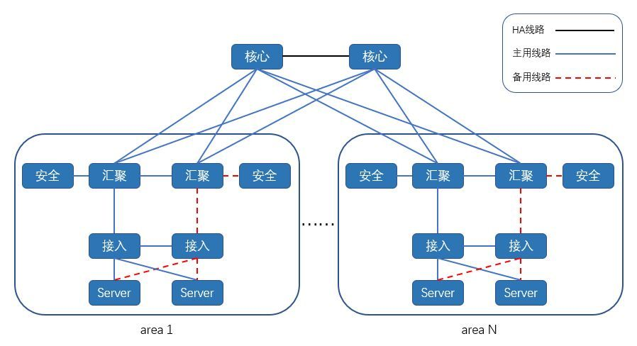

# 数据中心网络架构

不论我们在讨论SDN，NFV或者其他的虚拟网络技术，有一点需要明确，网络数据包最终都是跑在物理网络上。物理网络的特性，例如带宽，MTU，延时等，最终直接或者间接决定了虚拟虚拟网络的特性。可以说物理网络决定了虚拟网络的“天花板”。在Mirantis对[OpenStack Neutron的性能测试](https://zhuanlan.zhihu.com/p/24766892)报告中可以看出，网络设备的升级和调整，例如采用高速网卡，配置MTU9000，可以明显提高虚拟网络的传输效率。**在对网络性能进行优化时，有些物理网络特性可以通过升级设备或线路来提升，但是有些与网络架构有关。**升级或者改动网络架构带来的风险和成本是巨大的，因此在架设数据中心初始，网络架构的选择和设计尤其需要谨慎。另一方面，在设计虚拟网络时，不可避免的需要考虑实际的物理网络架构，理解物理网络架构对于最终理解虚拟网络是不可缺少的。

接下来我将分几次说一说自己对数据中心网络架构的认识，想到哪说到哪，不对的地方请大家指正。

数据中心网络架构时代划分：

2008以前：经典时代。

2008-2011：纷争时代。各个厂商为数据中心推出了各种技术和解决方案。

2011以后：无限时代。1.厂商越来越弱化，数据中心网络

## **传统数据中心网络架构**

在传统的大型数据中心，网络通常是三层结构。Cisco称之为：分级的互连网络模型（hierarchical inter-networking model）。这个模型包含了以下三层：

* Access Layer（接入层）：有时也称为Edge Layer。接入交换机通常位于机架顶部，所以它们也被称为**ToR（Top of Rack）**交换机，它们物理连接服务器。
* Aggregation Layer（汇聚层）：有时候也称为Distribution Layer。汇聚交换机连接Access交换机，同时提供其他的服务，例如防火墙，SSL offload，入侵检测，网络分析等。
* Core Layer（核心层）：核心交换机为进出数据中心的包提供高速的转发，为多个汇聚层提供连接性，核心交换机为通常为整个网络提供一个弹性的L3路由网络。

一般情况下，传统网络还存在着一些优点：

精确的过滤器/策略创建和应用：由于区域、终端地址网段明确，可以精细控制网络策略，保证流量的安全。

稳定的网络：区域的明确划分，网络设备的稳定架构，使网络更具有稳定性。

广播域的有效控制：由于三层架构中间采用L3模式设计，有效控制广播域的大小。

传统网络架构虽然稳定，但随着技术的不断发展，应用不断的多元化以及对业务的高冗余化的需求，暴露出了一些传统网络的弊端。

随着公司的发展，传统网络架构渐渐开始无法跟上步伐，逐渐出现了以下问题：

**1业务流量模型不清晰**

随着网络的发展、各种新技术的产生，数据中心内部、服务器之间协同处理、计算，导致由东向西的流量逐渐增大，超过了由南向北的流量。而传统三层架构服务器间交换，都要过三层核心，多层转发，增大了网络的延迟，还浪费了核心宝贵的资源。与此同时，我们将业务拆分成多个模块，并部署在不同的区域中，由于应用的不断发展，模块的数量越来越多，模块之间的调用越来越频繁，可能一次完整的应用流程需要经历数十个模块，模块之间的频繁调用大大消耗了网络设备的资源。

**2横向扩展能力不足**

传统数据中心使用STP技术，虽然上联多根链路，但都是主备关系，仅有一根链路能跑流量，无法承载数据中心日益增长的业务。尽管后续使用了有相关的Ethernet Channel、堆叠、VSS等技术，来达到链路冗余的需求，但是堆叠、Ethernet Channel不可能无限地进行扩展。

**3广播域过于庞大**

随着业务的发展，计算资源被池化。为了使得计算资源可以任意分配，需要一个巨大的二层网络架构。整个数据中心网络都是多个L2广播域，这样，服务器可以在规定的区域地点创建、迁移，而不需要对IP地址或者默认网关做修改。不断地业务扩展，造就了一个巨大的二层广播域，一旦出现一点问题就造成巨大的网络问题，导致业务中断，业务的高可用性就无法保证。

**4计算资源无法快速上线**

随着业务的不断发展，计算资源的虚拟化。当需要进行虚拟资源部署时，严格安全防护的要求下，需要进行安全设备的策略开通。从部署到正式上线使用之间的耗时会长达1小时之久。无法满足在突发情况下，快速增加计算资源。

由于安全设备以及设备上联位置的限制，无法在任意的计算资源池中随意的创建、迁移；无法合理分配资源池的各种硬件资源，造成资源的分配不均衡。一旦某资源池已达阈值，就无法继续计算资源的横向扩展。

**5网络延时过大**

在使用传统网络架构时，每个业务模块都是一个烟囱结构，业务模块互相调用需要经过多个三层设备（平均需要经过6次物理设备）其中还可能包括防火墙等安全设备。受限于设备的性能，网络架构的主备方案。数据流量每经过一次设备都会增加一点延迟。虽然每一次延时都是微乎其微，但是累计次数多了，对于业务来说这个延时可能就导致用户体检较差。

一个三层网络架构示意图如下所示：  

通常情况下，汇聚交换机是L2和L3网络的分界点，汇聚交换机以下的是L2网络，以上是L3网络。每组汇聚交换机管理一个**POD（Point Of Delivery）**，每个POD内都是独立的VLAN网络。服务器在POD内迁移不必修改IP地址和默认网关，因为一个POD对应一个L2广播域。

汇聚交换机和接入交换机之间通常使用STP（Spanning Tree Protocol）。**STP使得对于一个VLAN网络只有一个汇聚层交换机可用，**其他的汇聚层交换机在出现故障时才被使用（上图中的虚线）。也就是说汇聚层是一个active-passive的HA模式。这样在汇聚层，做不到水平扩展，因为就算加入多个汇聚层交换机，仍然只有一个在工作。一些私有的协议，例如Cisco的vPC（Virtual Port Channel）可以提升汇聚层交换机的利用率，但是一方面，这是私有协议，另一方面，vPC也不能真正做到完全的水平扩展。下图是一个汇聚层作为L2/L3分界线，且采用vPC的网络架构。

随着云计算的发展，**计算资源被池化**，为了使得计算资源可以任意分配，需要一个**大二层的网络架构**。即整个数据中心网络都是一个L2广播域，这样，服务器可以在任意地点创建，迁移，而不需要对IP地址或者默认网关做修改。大二层网络架构，L2/L3分界在核心交换机，核心交换机以下，也就是整个数据中心，是L2网络（当然，可以包含多个VLAN，VLAN之间通过核心交换机做路由进行连通）。大二层的网络架构如下图所示：

大二层网络架构虽然使得虚机网络能够灵活创建，但是带来的问题也是明显的。共享的L2广播域带来的BUM（Broadcast·，Unknown Unicast，Multicast）风暴随着网络规模的增加而明显增加，最终将影响正常的网络流量。

传统三层网络架构已经存在几十年，并且现在有些数据中心中仍然使用这种架构。这种架构提出的最初原因是什么？一方面是因为早期L3路由设备比L2桥接设备贵得多。即使是现在，核心交换机也比汇聚接入层设备贵不少。采用这种架构，使用一组核心交换机可以连接多个汇聚层POD，例如上面的图中，一对核心交换机连接了多个汇聚层POD。另一方面，**早期的数据中心，大部分流量是南北向流量**。例如，一个服务器上部署了WEB应用，供数据中心之外的客户端使用。使用这种架构可以在核心交换机统一控制数据的流入流出，添加负载均衡器，为数据流量做负载均衡等。

## **技术发展对网络架构的影响**

数据中心是为了数据服务。随着技术的发展，数据的内容和形式也发生了变化。

* 虚拟化的流行。传统的数据中心中，服务器的利用率并不高，采用三层网络架构配合一定的超占比（oversubscription），能够有效的共享利用核心交换机和一些其他网络设备的性能。但是虚拟化的流行使得服务器的利用率变高，一个物理服务器可以虚拟出多个虚拟机，分别运行各自的任务，走自己的网络路径。因此，高的服务器利用率要求更小的超占比。Gartner的一份报告：
  [Forecast: x86 Server Virtualization, Worldwide, 2012-2018, 2014 Update](https://link.zhihu.com/?target=https%3A//www.gartner.com/doc/2911617/forecast-x-server-virtualization-worldwide)
  指出，在2018年，82%的服务器将是虚拟服务器。虚拟化对数据中心网络架构的影响是巨大的。
* 软件架构的解耦。传统的软件架构，采用专用模式进行部署，软件系统通常跑在一个物理服务器，与其他的系统做物理隔离。但是，模块化，分层的软件架构设计已经成为了现在的主流。一个系统的多个组件通常分布在多个虚机/容器中。最典型的就是三层WEB应用，包含了Client/Application/DB。一次请求，不再是由一个虚机/物理机完成，而是由多个服务器协同完成。这对网络的影响是，东西向流量变多了。
* 新的应用的兴起。传统数据中心是为.com应用设计的，这些流量大多是客户端和服务器之间的通信。而分布式计算，大数据渐渐兴起，这些应用会在数据中心的服务器之间产生大量的流量。例如Hadoop，将数据分布在数据中心中成百上千个服务器中，进行并行计算。据说Facebook的一个Hadoop集群有着超过100 petabytes的数据。可见对于某些应用，数据中心的东西向流量是巨大的。
* 软件定义数据中心（SDDC，Software Defined Data Center）的提出。SDDC提出软件定义的数据中心，这要求数据中心的计算存储网络都是可以软件定义的。对应于网络，就是SDN。传统的三层网络架构在设计之初并没有考虑SDN。

总结起来，**技术发展要求新的数据中心有更小的超占比，甚至没有超占比；更高的东西向流量带宽；支持SDN。**

在这些需求里面，更高的东西向流量支持尤为重要。前面说了南北向流量，东西向流量，这些分别是什么东东？数据中心的流量总的来说可以分为以下几种：

* 南北向流量：数据中心之外的客户端到数据中心服务器之间的流量，或者数据中心服务器访问互联网的流量。
* 东西向流量：数据中心内的服务器之间的流量。
* 跨数据中心流量：跨数据中心的流量，例如数据中心之间的灾备，私有云和公有云之间的通讯。

根据[Cisco Global Cloud Index: Forecast and Methodology, 2015–2020](https://link.zhihu.com/?target=https%3A//www.cisco.com/c/dam/en/us/solutions/collateral/service-provider/global-cloud-index-gci/white-paper-c11-738085.pdf)，到2020年77%的数据中心流量将会是数据中心内部的流量，也就是东西向流量，这与上面的技术发展对网络架构的影响分析相符，这也是为什么东西向流量尤其重要。

那传统三层网络架构下的东西向流量是怎么样的？

前面说过传统三层网络架构的诞生是在.com时代，主要是也为了南北向流量设计的。但是传统的网络架构并非不支持东西向流量，下面来分析一下传统三层网络架构中东西向流量走向。

首先，东西向流量分为L2和L3流量。

东西向的L2流量，如果源和目的主机都在同一个接入层交换机下，那么可以达到全速，因为接入交换机就能完成转发。

如果需要跨机架，但仍然是在一个汇聚层POD内，则需要通过汇聚层交换机进行转发，带宽取决于汇聚层交换机的转发速率，端口带宽和同时有多少个接入层交换机共享汇聚层交换机。前面说过汇聚层和接入层之间一般使用STP，这使得一个汇聚层POD只能有一个汇聚层交换机在工作。为了满足跨机架的L2转发，汇聚层交换机的性能，例如带宽，转发速率必然要大于接入层交换机。

如果L2流量需要跨汇聚层POD（大二层架构），那必须经过核心交换机。同样的问题仍然存在，对核心交换机的要求会更高。

东西向的L3流量，不论是不是在一个接入层交换机下，都需要走到具有L3功能的核心交换机才能完成转发。如下图所示：

这是一种发卡（hair-pin）流量，它不仅浪费了宝贵的核心交换机资源，而且多层的转发增加了网络传输的延时。同样，由于超占比的存在，它也不能保证全速的L3流量。

总的来说，为了保证任意的东西向流量带宽，势必需要更高性能的汇聚层交换机和核心交换机。另一方面，也可以小心的进行设计，尽量将有东西向流量的服务器置于同一个接入交换机下。不管怎么样，这都增加了成本，降低了可用性。

## **市场需求变化对网络架构的影响**

由于成本和运维因素，数据中心一般是大企业才有能力部署。但是随着技术的发展，一些中小型企业也需要部署数据中心。不同的是，中小型企业的需求一般是，以一个小规模启动，随着自身业务的增长再逐步的扩展数据中心。数据中心的规模很大程度上取决于网络的规模，对应网络的需求就是，以一个低成本，小规模的网络架构启动，但是要能够水平扩展到较大规模。

传统三层网络架构的规模取决于核心层设备的性能和规模，取决于交换机的端口密度。最大的数据中心对应着体积最大和性能最高的网络设备，这种规模的设备并非所有的网络设备商都能提供，并且对应的资金成本和运维成本也较高。采用传统三层网络架构，企业将面临成本和可扩展性的两难选择。

## **最后**

传统的三层网络架构必然不会在短期内消失，但是由于技术和市场的发展，其短板也越来越明显。基于现有网络架构的改进显得非常有必要，新的网络架构最好是：由相对较小规模的交换机构成，可以方便的水平扩展，较好的支持HA（active-active模式），支持全速的东西向流量，不采购高性能的核心交换机也能去除超占比，支持SDN等等。

# Fabric网络架构

Fabric一词来源于网络交换机。网络交换机就是将输入端口的数据，经过判断，转发到输出端口。其架构大体如下图所示：

交换机内部连接输入输出端口的是Switch Fabric。最简单的Switch Fabric架构是crossbar模型，这是一个开关矩阵，每一个crosspoint（交点）都是一个开关，交换机通过控制开关来完成输入到特定输出的转发。一个crossbar模型如下所示：

可以看出，这里的开关矩阵类似于一块布的纤维，所以交换机内的架构被称为Switch Fabric（纤维）。这是Fabric一词在网络中的起源。

## **Clos架构**

Charles Clos曾经是贝尔实验室的研究员。他在1953年发表了一篇名为“A Study of Non-blocking Switching Networks”的文章。文章里介绍了一种**用多级设备来实现无阻塞电话交换的方法**，这是Clos架构的起源。

简单的Clos架构是一个三级互连架构，包含了输入级，中间级，输出级，如下图所示：

图中的矩形是规模小得多的转发单元，相应的成本小得多。**Clos架构的核心思想是：用多个小规模、低成本的单元构建复杂，大规模的架构。**上图中，m是每个子模块的输入端口数，n是每个子模块的输出端口数，r是每一级的子模块数，经过合理的重排，只要满足r2≥max\(m1,n3\)，那么，对于任意的输入到输出，总是能找到一条无阻塞的通路。

回到交换机架构，随着网络规模的发展，交换机的端口数量逐渐增多。crossbar模型的交换机的开关密度，随着交换机端口数量N呈")增长。相应的功耗，尺寸，成本也急剧增长。在高密度端口的交换机上，继续采用crossbar模型性价比越来越低。大约在1990年代，Clos架构被应用到Switch Fabric。应用Clos架构的交换机的开关密度，与交换机端口数量N的关系是")，所以在N较大时，Clos模型能降低交换机内部的开关密度。这是Clos架构的第二次应用。

## **Clos网络架构**

由于传统三层网络架构存在的问题，在2008年一篇文章[A scalable, commodity data center network architecture](https://link.zhihu.com/?target=http%3A//ccr.sigcomm.org/online/files/p63-alfares.pdf)，提出将Clos架构应用在网络架构中。2014年，在[Juniper的白皮书](https://link.zhihu.com/?target=http%3A//www.juniper.net/us/en/local/pdf/whitepapers/2000565-en.pdf)中，也提到了Clos架构。这一回，Clos架构应用到了数据中心网络架构中来。这是Clos架构的第三次应用。

现在流行的Clos网络架构是一个二层的spine/leaf架构，如下图所示。spine交换机之间或者leaf交换机之间不需要链接同步数据（不像三层网络架构中的汇聚层交换机之间需要同步数据）。每个leaf交换机的上行链路数等于spine交换机数量，同样的每个spine交换机的下行链路数等于leaf交换机的数量。可以这样说，spine交换机和leaf交换机之间是以full-mesh方式连接。

可前面不是说Clos架构是三级设备架构吗？为什么这里只有两层网络设备？这是因为前面讨论Clos架构的时候，都是讨论输入到输出的单向流量。网络架构中的设备基本都是双向流量，输入设备同时也是输出设备。因此三级Clos架构沿着中间层对折，就得到了二层spine/leaf网络架构。由于这种网络架构来源于交换机内部的Switch Fabric，因此这种网络架构也被称为Fabric网络架构。

在spine/leaf架构中，每一层的作用分别是：

* leaf switch：相当于传统三层架构中的接入交换机，作为TOR（Top Of Rack）直接连接物理服务器。与接入交换机的区别在于，L2/L3网络的分界点现在在leaf交换机上了。leaf交换机之上是三层网络。
* spine switch：相当于核心交换机。spine和leaf交换机之间通过ECMP（Equal Cost Multi Path）动态选择多条路径。区别在于，spine交换机现在只是为leaf交换机提供一个弹性的L3路由网络，数据中心的南北流量可以不用直接从spine交换机发出，一般来说，南北流量可以从与leaf交换机并行的交换机（edge switch）再接到WAN router出去。

对比spine/leaf网络架构和传统三层网络架构

可以看出传统的三层网络架构是垂直的结构，而spine/leaf网络架构是扁平的结构，从结构上看，spine/leaf架构更易于水平扩展。

## **Facebook Fabric Datacenter**

Fabric网络架构最具有代表性的就是Facebook在2014年公开的其数据中心架构：[Introducing data center fabric, the next-generation Facebook data center network](https://link.zhihu.com/?target=https%3A//code.facebook.com/posts/360346274145943/introducing-data-center-fabric-the-next-generation-facebook-data-center-network/)。Facebook使用了一个五级Clos架构，前面说过实际的网络设备即是输入又是输出，因此五级Clos架构对折之后是一个三层网络架构，虽然这里也是三层，但是跟传统的三层网络架构完全是两回事。对应于上面介绍的架构，Facebook将leaf交换机叫做TOR，间添加了一层交换机称为fabric交换机。fabric交换机和TOR构成了一个三级Clos结构，如下图所示，这与前面介绍的spine/leaf架构是一样的。Facebook将一组fabric交换机，TOR和对应的服务器组成的集群称为一个POD（Point Of Delivery）。POD是Facebook数据中心的最小组成单位，每个POD由48个TOR和4个fabric交换机组成，下图就是一个POD的示意图。

在Facebook的Fabric架构中，spine交换机与多个fabric交换机连接，为多个POD提供连通性。其整体网络架构如下图所示。下图中用三种方式表示了同一种网络架构。最上层是spine交换机，中间是fabric交换机，最下面是TOR。

在Fabric架构中，存在着两个切面，左右切面是一个个POD，前后切面被称为Spine Plane。总共有4个Spine Plane，每个Spine Plane也是一个三级Clos架构。在Spine Plane中，leaf是Fabric交换机，Spine就是Spine交换机。每个Spine Plane中，由48个spine交换机和N个fabric交换机相连组成，N等于当前数据中心接入的POD数。Spine Plane的三级Clos架构和POD的三级Clos架构，共同构成了数据中心的五级Clos架构。因为在POD内，fabric交换机通过48个口与TOR连接，所以在Spine Plane的Clos架构中，fabric交换机的输入输出端口数都是48，对应上面的公式，m1=n3=48。根据Clos架构的特性，在Spine plane中，Spine交换机只要大于等于48个，不论N（POD数）等于多少，都可以保证网络架构无阻塞。当然实际中N还受限于spine交换机的端口密度。

由于每个POD有4个fabric交换机，所以总共有4个Spine Plane。完整的架构如下图所示：

除了前面描述的POD和Spine Plane，上图中还有黄色的Edge Plane，这是为数据中心提供南北向流量的模块。它们与Spine交换机的连接方式，与二层的spine/leaf架构一样。并且它们也是可以水平扩展的。

采用Clos架构的数据中心网络架构的优势：

* 弹性可扩展。数据中心可以以POD为单位构建，随着规模的增加，增加相应的POD即可。在Spine交换机端口数可承受的范围内，增删POD并不需要修改网络架构。
* 模块化设计。不论是POD，Spine Plane还是Edge Plane，都是一个个相同的模块，在水平扩展的时候，不需要新的设计，只是将原有的结构复制一份即可。
* 灵活。当对网络带宽要求不高的时候，Spine交换机和Edge交换机可以适当减少。例如Facebook表示，在数据中心的初期，只提供4：1的东西向流量超占比，这样每个Spine Plane只需要12个Spine交换机。当需要更多带宽时，再增加相应的Spine交换机即可。同样的模式也适用于Edge交换机。这符合“小规模启动，最终适用大规模”的思想。
* 硬件依赖性小。传统三层网络架构中，大的网络规模意味着高端的核心汇聚交换机。但是在Fabric架构中，交换机都是中等交换机，例如所有的fabric交换机只需要96个端口，中等规模的交换机简单，稳定，成本低，并且大多数网络厂商都能制造。
* 高度高可用。传统三层网络架构中，尽管汇聚层和核心层都做了高可用，但是汇聚层的高可用由于是基于STP（Spanning Tree Protocol），并不能充分利用多个交换机的性能，并且，如果所有的汇聚层交换机（一般是两个）都出现故障，那么整个汇聚层POD网络就瘫痪。但是在Fabric架构中，跨POD的两个服务器之间有多条通道（4\*48=192），除非192条通道都出现故障，否则网络能一直保持连通，下图是一个跨POD服务器之间多通道示意图。

需要指出的是，这种网络架构并非Facebook独有（是不是原创无从考证），例如Cisco的[Massively Scalable Data Center \(MSDC\)](https://link.zhihu.com/?target=https%3A//www.cisco.com/c/dam/en/us/td/docs/solutions/Enterprise/Data_Center/MSDC/1-0/MSDC_AAG_1.pdf)，Brocade的[Optimized 5-Stage L3 Clos Topology](https://link.zhihu.com/?target=http%3A//www.brocade.com/content/html/en/brocade-validated-design/brocade-ip-fabric-bvd/GUID-9A1F41B0-3917-422C-BE88-5F16B1828EDC.html)都是类似的5级Clos架构。其中一些组成元素，各家叫法不一样，不过原理都是类似的。

## **最后**

技术发展的过程中，有一些技术提出，应用，流行，消逝，过了一段时间，在新的领域，被人又重新提出，应用，流行，这本身就是一种非常有意思的现象。Clos架构就是这么一种技术，从最开始的电话交换架构，到交换机内部模型，到现在的网络架构，它在不同的领域解决着同样的问题。

构建一个数据中心网络时，除了考虑网络硬件设备的架构，2-7层网络设计也需要考虑。这两者其实不能完全分开，硬件架构有时候决定了网络设计，网络设计有时候又限制了硬件架构。从应用场景，例如SDN/NFV来看，网络设计是最直接需要考虑的。所以这部分说说网络设计。

## **传统三层网络架构中的网络设计**

## L3架构

前面几部分说过，传统的三层网络架构中，通常是在汇聚层做L2/L3的分隔。这样可以在每个汇聚层POD构建一个L2广播域，跨汇聚层的通信通过核心交换机做L3路由完成。例如，在划分VLAN时，将VLAN200划分在POD A，VLAN300划分在POD B，VLAN400划分在POD C。这样设计的好处是BUM（Broadcase，Unknown Unicast，Multicast）被限制在每个POD。

由于L2广播域被限制了在汇聚层POD，所以服务器的迁移一般在POD内部完成。因为跨POD迁移，对应二层网络会变化，相应的服务器需要做一些变化，例如IP地址，默认网关。也就是说，服务器所在的网络，限制了服务器的部署范围（只能在POD内）。

## 大二层架构

为了更灵活的管理服务器，需要服务器可以部署在数据中心任意位置，在任意位置做迁移，可以使用大二层架构。在这种架构下，整个核心交换机以下都是一个L2广播域，L2广播域中的不同L2网络，通过核心交换机的路由功能转发，同一个L2网络，服务器可以任意迁移部署。

这种架构的缺点就是，BUM会在整个数据中心传播，这最终限制了网络的规模。因为网络规模大到一定程度，BUM会严重影响正常的网络通讯。

## **Spine/Leaf架构中的网络设计**

Spine/Leaf网络架构中，L2/L3的分隔通常在Leaf交换机。也就是说每个Leaf交换机下面都是个独立的L2广播域。如果说两个Leaf交换机下的服务器需要通讯，需要通过L3路由，经由Spine交换机转发。

与传统三层网络架构类似，这样的设计，能分隔L2广播域，适用的网络规模更大。但是对应的问题就是，服务器的部署不能在数据中心的任意位置。我们来进一步看这个问题。

当服务器（虚拟的或者物理的）需要被部署在数据中心时，一般需要指定特定的网络分段（Segment）中，或者说特定的L2广播域。如果Segment被局限在了某些特定的交换机下，那么服务器只能在这些交换机的管理范围内部署。也就是说，网络限制了计算资源的部署和分配。但是实际中，真正与计算资源相关的资源，例如对于物理服务器来说，机架的空间，电源，散热等，或者对于虚拟服务器来说，服务器的CPU，内存，硬盘等，这些因素才应该是决定服务器是否部署的因素。如果说对应的机架或者计算资源已经被使用了80%，而其他的机架或者计算资源还基本是空置的，但是网络只在这个高负荷的位置可用，服务器再向这个高负荷的位置进行部署明显不合适。

有什么解决办法能打破网络的限制？例如给空置的机架对应的交换机也配置上相应的网络，让新的服务器部署在它们之上，这样可行吗？举个例子，看一个最简单的spine/leaf架构：

例如左边的leaf配置了VLAN200，管理的CIDR是192.168.1.0/24，右边的leaf交换机配置VLAN300，管理的CIDR是10.11.11.0/24。左右的服务器可以通过L3路由进行转发，这没问题。但是这种情况下，服务器的部署需要考虑网络的可用性。VLAN200的服务器只能在左边，VLAN300的服务器只能在右边，这部分上面说过。

那直接给右边leaf交换机也配上VLAN200，IP地址也配上192.168.1.0/24。看起来似乎可以打破网络的限制，但是实际上，这会导致：

* 两边的服务器的广播域是不通的，左边发出来的广播，Spine上的L3路由不会转发，所以右边是收不到的。
* 左边的服务器不能到达右边的服务器，因为从IP地址来看，左右服务器在一个二层网络，但是实际上两边服务器又不在一个L2广播域中，数据不会发向L3路由，本地也找不到。
* Spine交换机会感到困惑，因为当它收到目的地址是192.168.1.0/24的数据包时，它不知道该路由给左边还是右边。

实际效果如下图所示：

这里相当于，在左右两个Leaf交换机上，创建了两个（而不是一个）VLAN200的网络。而由于CIDR重复，这两个网络之间还不能路由。

## **Overlay网络**

Overlay网络技术可以很好的解决上面的问题。Overlay技术有很多中，GRE，NVGRE，Geneva，VXLAN。这里就不说谁好谁不好，只以VXLAN为例说明，但是大部分内容其他的Overlay技术同样适用。

Overlay网络是在现有的网络（Underlay网络）基础上构建的一个虚拟网络。所谓的现有网络，就是之前的交换机所在的网络，只要是IP网络就行。而新构建的Overlay网络，用来作为服务器通讯的网络。Overlay网络是一个在L3之上的L2网络。也就是说，只要L3网络能覆盖的地方，那Overlay的L2网络也能覆盖。例如下图中，原有的交换机网络不变，服务器之间通过Overlay网络实现了跨Leaf交换机的L2网络。这样，在Overlay网络中，服务器可以任意部署，而不用考虑现有网络的架构。

当提起VXLAN解决了什么问题时，很多人想到的是解决了VLAN ID数量有限的问题，这的确也是VXLAN[RFC7348](http://link.zhihu.com/?target=https%3A//tools.ietf.org/html/rfc7348)明确说明的。但是现实中解决VLAN ID数量不够还有别的方法，例如QinQ。以VXLAN为代表的Overlay技术解决的，更多是（个人观点）提供了一个不受物理网络限制的，可软件定义的网络环境。

一个完整的Spine/Leaf网络架构配合VXLAN示意图如下所示，这个图里面以虚拟服务器（VM）为例说明，但是实际上并不局限于虚拟的服务器。对于VM来说，并不知道什么VXLAN，VM只是把Ethernet Frame发出来。Leaf交换机（或者说VTEP）将VM的Ethernet Frame封装成VXLAN（也就是一个UDP包），在原有的Spine/Leaf的Underlay网络传输。因为是一个UDP包，所以可以在原有的L3网络中任意传输。

采用Overlay，需要在Leaf交换机上集成VTEP。有时候，将这种网络架构称为VXLAN Fabric。为什么是Fabric，上一篇说过了。

VXLAN Fabric网络架构通常有两种实现，一种是基于Flood-Learn的模式，与传统的L2网络类似，另一种是基于MP-BGP EVPN作为控制层。有关数据中心内的EVPN，我在之前的多篇文章有介绍，感兴趣可以去看看，这里就不再重复了。

## **最后**

Overlay技术并非为Spine/Leaf网络架构设计，早在传统的三层网络架构中，也有应用Overlay技术构建虚拟网络。只是说Spine/Leaf架构作为一种相对较新的网络架构，配合VXLAN或者其他Overlay技术，能够设计出更灵活的数据中心网络。在SDDC（Software Defined Data Center）架构或者SDN中，这种Overlay更是非常重要的一个部分。

最后的最后，这个系列的浅谈就先说到这里了。这个系列有一部分是受到[@阿布](https://www.zhihu.com/people/f6e0595e9f329dd94b550cfd8964eab1)同学的[数据中心网络架构演进（一）](https://zhuanlan.zhihu.com/p/26804617)和[数据中心网络架构演进（二）](https://zhuanlan.zhihu.com/p/26815851)的启发，在此感谢。之所以也写一次，是想提供一个非网工的，云计算从业人员的视角，希望对大家有帮助。

