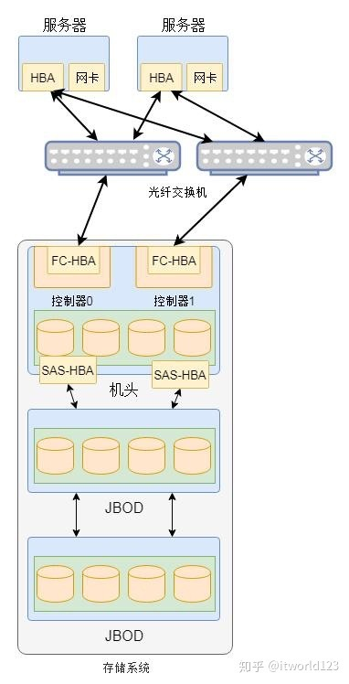

数据在整个计算机系统是最重要的一部分，也是最珍贵的。数据的存储一直是一个热议的话题，在没有云计算之前数据存储已经发展了很久，可以说和云计算没有特别关系，云计算存储通常指的是亚马逊的S3存储或者EBS存储等，将统一的资源池划分给多个用户。

### 3.3 存储虚拟化

存储虚拟化(Storage VIrtualizaton) 对存储硬件资源进行抽象化，将底层存储设备统一管理，为用户提供一个统一的存储空间。

存储虚拟化(StorageVirtualization )最通俗的理解就是对存储硬件资
源进行抽象化表现。这种虚拟化可以将用户与存储资源中大量的物理特性隔
绝开来，就好像我们去仓库存放或者提取物品一样，只要跟仓库管理员打交
道，而不必关心我们的物品究竟存放在仓库内的哪一个角落。对于用户来
说，虚拟化的存储资源就像是一个巨大的"存储池"，用户不会看到具体的存
储磁盘、磁带，也不必关心自己的数据经过哪一条路径通往哪一个具体的存
储设备。

  存储虚拟化减少了物理存储设备的配置和管理任务，同时还能够充分利
用现有的存储资源。如果没有存储虚拟化，那只能对物理存储设备进行单个
管理，无疑这种管理的难度是很大的，并且非常容易造成存储资源的浪费。

  存储虚拟化的方式是将整个云系统的存储资源进行统一整合管理，为用
户提供一个统一的存储空间。如图1-6所示，存储虚拟化技术的核心就是将
底层的存储设备统一管理，将存储物理设备中的存储资源抽象成一个个虚拟
资源，并且可以根据用户的需求来分配用户所需的存储空间和存储类型给用
户使用。

存储虚拟化特点：

* 集中存储
* 分布式扩展
* 按需分配
* 节能减排
* 虚拟本地硬盘
* 安全认证
* 数据加密
* 级层管理

#### 3.3.1 分布式文件系统（如HDFS）

#### 3.3.2 分布式块存储（如Ceph）

#### 3.3.3 存储网关（如IBM的SVC）

集中式存储：整个存储集中在一个系统中，但集中式存储不是一个单独的设备，是集中在一套系统当中的多个设备。整个存储系统可能需要几个机柜来存放。

集中式存储架构：除了机头(控制器)，磁盘阵列(JBOD), 和交换机等设备外，还有管理设备等辅助信息

分布式存储

直连存储(DAS): 存储与数据直连，拓展性差、灵活性差

中心化存储(SAN,NAS):

分布式存储架构

分布式块存储

* Ceph

分布式对象存储

* Swift
* Ceph

分布式文件存储

* HDFS
* Ceph

分布式数据库

分布式缓存