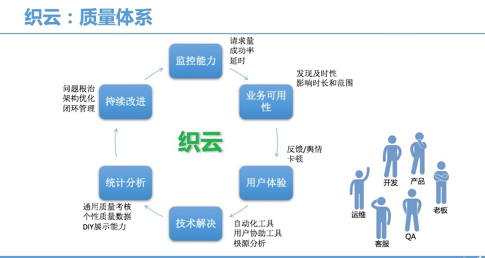

# 3.8 监控 Monitoring

garafana

https://zhuanlan.zhihu.com/p/26369145

监控体系是云计算基础架构最重要的组成部分之一。有两个视角：运维自己的集群监控体系，用户视角的监控产品。

Monitoring：收集数据中心各组件的telemetry data (包括metrics，metering，billing events) 等。

监控采集对象：

* Host 
* Service Container
* Hardware device
* Control plane
* operational
* metering events
* billing events

监控采集工具：

* zabbix
* sysdig
* Prometheus
* Collectd

## 1 监控的定义
通过技术手段发现服务异常，持续优化业务**可用性**与**用户体验**。这句话的关键词是 **发现**  **持续优化** **可用性与体验**。事前及时预警发现故障，事后提供详实的数据用于追查定位问题。

## 2. 监控目标
1. 对系统不间断实时监控:实际上是对系统不间断的实时监控(这就是监控)

2. 实时反馈系统当前状态:我们监控某个硬件、或者某个系统，都是需要能实时看到当前系统的状态，是正常、异常、或者故障

3. 保证服务**可靠性**安全性:我们监控的目的就是要保证系统、服务、业务正常运行

4. 保证业务持续稳定运行(可用性):如果我们的监控做得很完善，即使出现故障，能第一时间接收到故障报警，在第一时间处理解决，从而保证业务持续性的稳定运行。

5. 持续优化业务服务质量，并建构质量体系

## 3. 监控方法
1. 了解监控对象:我们要监控的对象你是否了解呢？比如CPU到底是如何工作的？

2. 性能基准指标:我们要监控这个东西的什么属性？比如CPU的使用率、负载、用户态、内核态、上下文切换。

3. 报警阈值定义:怎么样才算是故障，要报警呢？比如CPU的负载到底多少算高，用户态、内核态分别跑多少算高？

4. 故障处理流程:收到了故障报警，那么我们怎么处理呢？有什么更高效的处理流程吗？

## 4. 监控核心
1. 发现问题:当系统发生故障报警，我们会收到故障报警的信息

2. 定位问题:故障邮件一般都会写某某主机故障、具体故障的内容，我们需要对报警内容进行分析，比如一台服务器连不上:我们就需要考虑是网络问题、还是负载太高导致长时间无法连接，又或者某开发触发了防火墙禁止的相关策略等等，我们就需要去分析故障具体原因。

3. 解决问题:当然我们了解到故障的原因后，就需要通过故障解决的优先级去解决该故障。

4. 总结问题:当我们解决完重大故障后，需要对故障原因以及防范进行总结归纳，避免以后重复出现。

## 5. 监控流程
1. 数据采集:Zabbix通过SNMP、Agent、ICMP、SSH、IPMI等对系统进行数据采集

2. 数据存储:Zabbix存储在MySQL上，也可以存储在其他数据库服务

3. 数据分析:当我们事后需要复盘分析故障时，zabbix能给我们提供图形以及时间等相关信息，方面我们确定故障所在。

4. 数据展示:web界面展示、(移动APP、java_php开发一个web界面也可以)

5. 监控报警:电话报警、邮件报警、微信报警、短信报警、报警升级机制等（无论什么报警都可以）

6. 报警处理:当接收到报警，我们需要根据故障的级别进行处理，比如:重要紧急、重要不紧急，等。根据故障的级别，配合相关的人员进行快速处理。

## 6. 监控指标
### 6.1 硬件监控

* CPU温度
* 物理磁盘
* 虚拟磁盘
* 主板温度
* 磁盘阵列
早期我们通过机房巡检的方式，查看硬件设备灯光闪烁情况判断是否故障，这样非常浪费人力，并且是重复性无技术含量的工作。
当然我们现在可以通过IPMI对硬件详细情况进行监控，并对CPU、内存、磁盘、温度、风扇、电压等设置报警设置报警阈值(自行对监控报警内容编写合理的报警范围)

IPMI工具无法获取到硬件的状态，可以借助MegaCli工具探测Raid磁盘队列状态

zabbix提供IPMI监控模板：Zabbix IPMI Interface

系统自带的IPMI模板只能监控，风扇，电源，和部分温度

[IPMI监控硬件服务参考资料](https://www.ibm.com/developerworks/cn/linux/l-ipmi/)

### 6.2 系统监控

应用监控

网络监控

流量分析

日志监控

安全监控

API监控

性能监控

业务监控

## 7. 监控工具
### 老牌监控
* MRTG（Multi Route Trffic Grapher）是一套可用来绘制网络流量图的软件，由瑞士奥尔滕的Tobias Oetiker与Dave Rand所开发，以GPL授权。

    MRTG最好的版本是1995年推出的，用perl语言写成，可跨平台使用，数据采集用SNMP协议，MRTG将手机到的数据通过Web页面以GIF或者PNG格式绘制出图像。

* Grnglia是一个跨平台的、可扩展的、高性能的分布式监控系统，如集群和网格。它基于分层设计，使用广泛的技术，用RRDtool存储数据。具有可视化界面，适合对集群系统的自动化监控。其精心设计的数据结构和算法使得监控端到被监控端的连接开销非常低。目前已经有成千上万的集群正在使用这个监控系统，可以轻松的处理2000个节点的集群环境。

* Cacti（英文含义为仙人掌）是一套基于PHP、MySQL、SNMP和RRDtool开发的网络流量监测图形分析工具，它通过snmpget来获取数据使用RRDtool绘图，但使用者无须了解RRDtool复杂的参数。提供了非常强大的数据和用户管理功能，可以指定每一个用户能查看树状结构、主机设备以及任何一张图，还可以与LDAP结合进行用户认证，同时也能自定义模板。在历史数据展示监控方面，其功能相当不错。

    Cacti通过添加模板，使不同设备的监控添加具有可复用性，并且具备可自定义绘图的功能，具有强大的运算能力（数据的叠加功能）

* Nagios是一个企业级监控系统，可监控服务的运行状态和网络信息等，并能监视所指定的本地或远程主机状态以及服务，同时提供异常告警通知功能等。

    Nagios可运行在Linux和UNIX平台上。同时提供Web界面，以方便系统管理人员查看网络状态、各种系统问题、以及系统相关日志等

    Nagios的功能侧重于监控服务的可用性，能根据监控指标状态触发告警。

    目前Nagios也占领了一定的市场份额，不过Nagios并没有与时俱进，已经不能满足于多变的监控需求，架构的扩展性和使用的便捷性有待增强，其高级功能集成在商业版Nagios XI中。

* Smokeping主要用于监视网络性能，包括常规的ping、www服务器性能、DNS查询性能、SSH性能等。底层也是用RRDtool做支持，特点是绘制图非常漂亮，网络丢包和延迟用颜色和阴影来标示，支持将多张图叠放在一起，其作者还开发了MRTG和RRDtll等工具。

    Smokeping的站点为：http://tobi.oetiker.cn/hp

* 开源监控系统OpenTSDB用Hbase存储所有时序（无须采样）的数据，来构建一个分布式、可伸缩的时间序列数据库。它支持秒级数据采集，支持永久存储，可以做容量规划，并很容易地接入到现有的告警系统里。

    OpenTSDB可以从大规模的集群（包括集群中的网络设备、操作系统、应用程序）中获取相应的采集指标，并进行存储、索引和服务，从而使这些数据更容易让人理解，如Web化、图形化等。

### 王牌监控 Zabbix
https://www.cnblogs.com/kevingrace/p/5737139.html
Zabbix是一个分布式监控系统，支持多种采集方式和采集客户端，有专用的Agent代理，也支持SNMP、IPMI、JMX、Telnet、SSH等多种协议，它将采集到的数据存放到数据库，然后对其进行分析整理，达到条件触发告警。其灵活的扩展性和丰富的功能是其他监控系统所不能比的。相对来说，它的总体功能做的非常优秀。

从以上各种监控系统的对比来看，Zabbix都是具有优势的，其丰富的功能、可扩展的能力、二次开发的能力和简单易用的特点，读者只要稍加学习，即可构建自己的监控系统。

小米的监控系统：open-falcon。open-falcon的目标是做最开放、最好用的互联网企业级监控产品。

OWL是TalkingData公司推出的一款开源分布式监控系统OWLgithub地址

* 物理机监控
* 集群监控
* 云主机监控

运维1.0
* Zabbix 1998
* Nagios 1999
运维2.0
* StatsD: 指标集成、可视化、数据托管、时间序列数据库、事件引擎处理、一体化解决方案

数据可视化
* Graphite: 可视化、存储
* Grafana
* Signal FX

可视化数据托管
* Host Graphite

### 云监控

而国内的淘宝、小米都开始使用时间序列数据库，来解决这个云监控和集群监控的难题：

淘宝使用 OpenTSDB 案例：OpenTSDB监控系统的研究和介绍
小米开源项目：Open-Falcon|互联网企业级监控系统

事件处理引擎方面，Riemann 

一体化解决方案
* Datadog
* Librato
* Cloud Insight：采用 StatsD 的采集技术，对接 MySQL、Redis、MongoDB，以及 CentOS、RedHat、Windows 等操作系统，利用 Hbase 存储和 OpenTSDB 的数据聚合、切片等功能，最终流向 Cloud Insight 进行展现。

目前被使用比较多的国内云监控产品应该是阿里云自身的监控、小米的 Open-Falcon|、和专门提供一体化解决方案的 OneAPM 的云监控产品 Cloud Insight。

#### 云监控主要监控方式

2.2.1 Agent方式

Agent方式是最常用监控方式，很多监控架构都采用Agent方式监控。

采用Agent方式监控优点是安全可靠，研发人员自己定义服务端和Agent的通信方式，只需要在被监控端安装Agent即可。

缺点是当监控规模较大时，如果每台设备都安装Agent需要人力成本较大，升级的时也很麻烦，还有就是针对不同的操作系统可能需要开发适应不同系统的Agent。

2.2.2 SNMP方式

SNMP(Simple Network Management Protocol  简单网络协议) 由一组网络管理的标准组成，包含一个应用层协议（application layer protocol）、数据库模型（database schema）和一组资源对象。

采用SNMP监控的好处是不需要在被监控端安装Agent，开发人员只需要专注于服务端代码的开发即可，并且可以监控网络设备、存储等设备。

2.2.3 SSH方式

SSH监控是通过SSH登录被监控操作系统(一般是Linux系统)，通过远程执行脚本获取监控数据，一般用于监控Linux系统的性能数据采集。

2.2.4 IPMI方式

IPMI是智能型平台管理接口（Intelligent Platform Management Interface）的缩写，是一种开放标准的硬件管理接口规格。

IPMI方式监控主要用于硬件信息的采集，采用这种方式监控有一定的局限性，因为不是所有的物理服务器都支持IPMI。

2.2.5 TELNET方式

采用TELNET方式监控是运行telnet命令，远程登录被监控的主机，执行命令来采集数据，然后解析数据得到采集结果

2.2.6 PING方式

PING方式监控是指对指定的服务器进行ICMP Ping检测，获得可用率报告以及响应时间、丢包率等的监控。

阿里云监控主要监控网站或服务器，结合阿里云云计算平台，为阿里云用户提供阿里云各种云产品的监控。目前提供两类监控：站点可用性监控和服务器监控。

1、可用性监控8种：

| 监控类型    | 内容                                                         |
| ----------- | ------------------------------------------------------------ |
| Http监控    | 监控Web站点中任何指定的URL，获得可用性监控以及响应时间。     |
| Ping监控    | 对指定的服务器进行ICMP Ping检测，获得可用性监控以及响应时间、丢包率等。 |
| TCP端口监控 | 监控服务器TCP端口的可用性和响应时间。                        |
| UDP监控     | 监控服务器UDP端口的可用性和响应时间。                        |
| DNS监控     | 监控DNS服务器的可用性和响应时间，并获得各种DNS记录列表，支持DNS轮询(RR)。 |
| POP3监控    | 监控POP3服务器的可用性和响应时间。                           |
| SMTP监控    | 监控SMTP服务器的可用性和响应时间。                           |
| FTP监控     | 监控FTP服务器的可用性和响应时间。                            |

2、服务器监控10种：

| 监控类型                         | 内容                                        |
| -------------------------------- | ------------------------------------------- |
| CPU利用率监控                    | ECS服务器CPU利用率监控。                    |
| Windows, Linux内存利用率监控     | ECS服务器内存利用率监控。                   |
| Windows, Linux虚拟内存利用率监控 | ECS服务器虚拟内存利用率监控。               |
| Windows, Linux磁盘利用率监控     | ECS服务器磁盘空间利用率监控。               |
| Windows, Linux磁盘读写监控       | ECS服务器磁盘I/O的监控（读速率与写速率）。  |
| Windows, Linux网络流量监控       | ECS服务器网络流量监控(上行流量与下行流量)。 |
| Windows, Linux进程数量监控       | ECS服务器进程数量监控。                     |
| Windows, LinuxTCP连接数监控      | ECS服务器TCP连接数监控。                    |
| Windows, LinuxCPU负载(load)监控  | ECS服务器CPU负载(load)监控。                |
| Windows, Linux用户自定义监控     | 用户自己定义监控内容，包括配置、阈值等      |

Linux

1.硬件监控。

通过SNMP来进行路由器交换机的监控(这些可以跟一些厂商沟通来了解如何做)、服务器的温度以及其他，可以通过IPMI来实现。当然如果没有硬件全都是云，直接跳过这一步骤。

2.系统监控。

如CPU的负载，上下文切换、内存使用率、磁盘读写、磁盘使用率、磁盘inode使用率。当然这些都是需要配置触发器，因为默认太低会频繁报警。

3.服务监控。

比如公司用的LNMP架构，nginx自带Status模块、PHP也有相关的Status、MySQL的话可以通过percona官方工具来进行监控。Redis这些通过自身的info获取信息进行过滤等。方法都类似。要么服务自带。要么通过脚本来实现想监控的内容，以及报警和图形功能。

4.网络监控。

如果是云主机又不是跨机房，那么可以选择不监控网络。当然你说我们是跨机房以及如何如何。推荐使用smokeping来做网络相关的监控。或者直接交给你们的网络工程师来做，因为术业有专攻。

5.安全监控。

如果是云主机可以考虑使用自带的安全防护。当然也可以使用iptables。如果是硬件，那么推荐使用硬件防火墙。使用云可以购买防DDOS，避免出现故障导致down机一天。如果是系统，那么权限、密码、备份、恢复等基础方案要做好。web同时也可以使用Nginx+Lua来实现一个web层面的防火墙。当然也可以使用集成好的openresty。

6.Web监控。

web监控的话题其实还是很多。比如可以使用自带的web监控来监控页面相关的延迟、js响应时间、下载时间、等等。这里我推荐使用专业的商业软件,监控宝或听云来实现。毕竟人家全国各地都有机房。（如果本身是多机房那就另说了）

7.日志监控。

如果是web的话可以使用监控Nginx的50x、40x的错误日志，PHP的ERROR日志。其实这些需求无非是，收集、存储、查询、展示，我们其实可以使用开源的ELKstack来实现。Logstash（收集）、elasticsearch（存储+搜索）、kibana（展示）

8.业务监控。

我们上面做了那么多，其实最终还是保证业务的运行。这样我们做的监控才有意义。所以业务层面这块的监控需要和开发以及总监开会讨论，监控比较重要的业务指标，（需要开会确认）然后通过简单的脚本就可以实现，最后设置触发器即可

9.流量分析。

平时我们分析日志都是拿awk sed xxx一堆工具来实现。这样对我们统计ip、pv、uv不是很方便。那么可以使用百度统计、google统计、商业，让开发嵌入代码即可。为了避免隐私也可以使用piwik来做相关的流量分析。

10.可视化。

通过screen以及引入一些第三方的库来美化界面，同时我们也需要知道，订单量突然增加、突然减少。或者说突然来了一大波流量，这流量从哪儿来，是不是推广了，还是被攻击了。可以结合监控平来梳理各个系统之间的业务关系。

11.自动化监控。

如上我们做了那么多的工作，当然不能是一台一台的来加key实现。可以通过Zabbix的主动模式以及被动模式来实现。当然最好还是通过API来实现。

12.分布式监控

5.1 硬件监控

#### Sysdig

https://docs.sysdig.com/en/docs/administration/on-premises-deployments/architecture-system-requirements/architecture/

