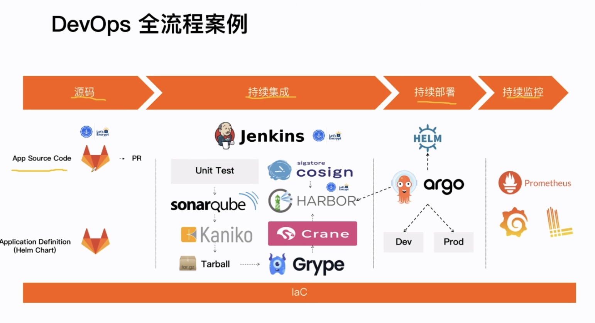
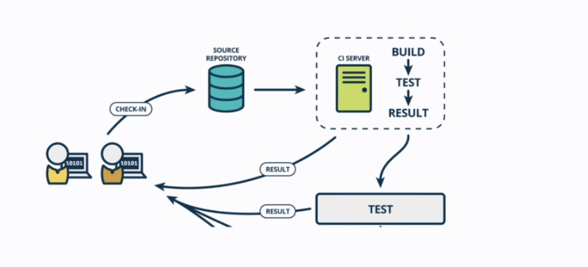
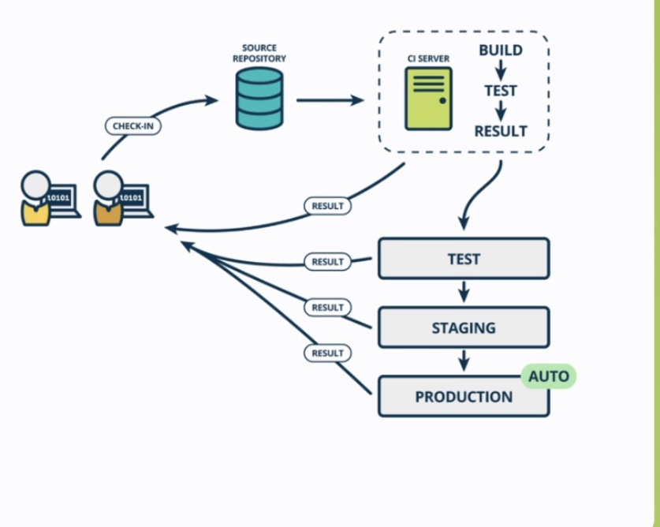

# DevOps

DevOps"一词是由英文 Development（开发）和 Operations （运维）组合而成，但它所代表的理念和实践要比这广阔的多。DevOps 涵盖了安全、协作方式、数据分析等许多方面。

DevOps 的核心在于，在应用的整个生命周期中，都要确保日常运维任务自动化和环境的标准化。容器可以提供标准化的环境

DevOps 十分依赖协作文化，需要与[开源原则](https://www.redhat.com/zh/topics/open-source/what-is-open-source)和透明[敏捷](https://www.redhat.com/zh/devops/what-is-agile-methodology)的工作方法协同一致

* **Continuous Integration (CI)**: Continuous Integration is a practice by which developers frequently integrate their code into version control and an automated build, unit test, and package of the build occurs.

* **[Continuous Delivery](https://pages.github.ibm.com/CloudEngineering/system_architecture/GLOSSARY.html#continuous-delivery) (CD)**: [Continuous Delivery](https://pages.github.ibm.com/CloudEngineering/system_architecture/GLOSSARY.html#continuous-delivery) is a practice by which automated build and test validate that your software so that it is automatically released into production at any time. Could also be called Continuous Release…

- **Change Management**: Change Management, according to ITIL definition, is the process of requesting, analyzing, approving, developing, implementing and reviewing a planned or unplanned change within the IT Infrastructure. The process begins with the creation of a Change Request and ends with the satisfactory implementation of the change and the communication of the results of that change to all interested parties.

- **Continuous Compliance**

- [Microservices](https://aws.amazon.com/devops/what-is-devops/#microservices)

- [Infrastructure as Code](https://aws.amazon.com/devops/what-is-devops/#iac)

- [Monitoring and Logging](https://aws.amazon.com/devops/what-is-devops/#monitoring)

- [Communication and Collaboration](https://aws.amazon.com/devops/what-is-devops/#communication)

- Devops/DevSecOps

  

DevOps Practices：The following are DevOps best practices: 

- [Continuous Integration](https://aws.amazon.com/devops/what-is-devops/#integration)
- [Continuous Delivery](https://aws.amazon.com/devops/what-is-devops/#cd)
- 

https://aws.amazon.com/devops/what-is-devops/

https://www.redhat.com/zh/topics/devops

Jump Server/Bastion Server

Teleport https://goteleport.com/docs/

[Slack](https://slack.com): Transform the way you work with one place for everyone and everything you need to get stuff done

GP-VPN: Global Protect VPN

[Service Now](https://www.servicenow.com/):

[pagerduty](https://www.pagerduty.com/):

TOTP: Time-based one-time password: https://www.wikiwand.com/en/Time-based_One-Time_Password

TOTP tools:

razee

swagger editor

jaeger

jmeter

- [Git](https://git-scm.com/) version control system
- [Containers](https://opencontainers.org/) as the means of delivering applications and services
- [Kubernetes](https://kubernetes.io/) as the container orchestration platform
- [Helm](https://helm.sh/) as the kubernetes package manager

[https://github.com/awesome-soft/awesome-devops](https://github.com/awesome-soft/awesome-devops)
https://github.com/wmariuss/awesome-devopsand

one more for devsecopshttps://github.com/devsecops/awesome-devsecops

Continuous delivery tools[¶](https://cloudnativetoolkit.dev/overview/overview/#continuous-delivery-tools)

| Capability               | Tool                                                         | Bitnami | Description                                        |
| :----------------------- | ------------------------------------------------------------ | :------ | :------------------------------------------------- |
|                          |                                                              |         |                                                    |
|                          |                                                              |         |                                                    |
| API Contract Testing     | [Pact](https://cloudnativetoolkit.dev/reference/tools/pact/) |         | Pact enables API contract testing                  |
|                          |                                                              |         |                                                    |
| Container Image Registry | [IBM Cloud Container Registry](https://cloudnativetoolkit.dev/reference/tools/ibm-cloud-container-registry/) |         | Stores container images to be deployed             |
|                          |                                                              |         |                                                    |
| Continuous Delivery      | [ArgoCD](https://cloudnativetoolkit.dev/reference/tools/argocd/) |         | ArgoCD support Continuous Delivery with GitOps     |
| Web IDE                  | [Code Ready Workspace](https://developers.redhat.com/products/codeready-workspaces/overview) |         | IDE for editing and managing code in a web browser |

 

[Vault](https://www.vaultproject.io/): Manage Secrets & Protect Sensitive Data

[Vagrant](https://www.vagrantup.com/):: https://www.vagrantup.com/docs, Development Environments Made Easy; a tool for building and managing virtual machine environments in a single workflow

Json: https://www.json.org/json-en.html  a lightweight data-interchange format

Vault: Manage Secrets & Protect Sensitive Data

YAML: https://yaml.org/.    a human-friendly data serialization language for all programming languages

conda: Package, dependency and environment management for any language* https://docs.conda.io/en/latest/

## Version Control

## CICD

在为软件开发工作流程选择CI/CD 服务器时需要注意以下几点：
- 易于安装和配置
- 与其他问题跟踪工具和版本控制工具集成
- 安全性和合规性
- 价格

CI/CD的好处
1. Reduced Deployment Risk，降低部署风险。快速提交小部分修改进行部署和集成，从而降低了出现错误的概率，即使出现错误也能快速定位问题并修复。
2. Believable Progress，可信的进度。如果直接部署到线上环境中，项目进展以及完成度相对于开发人员自己声称已经完成要更加的有可信度。
3. User Feedback，用户反馈。众所周知，项目开发中最大的风险就是开发的软件不被用户接受，这样的软件是没有太大的用处和意义的，尽早和更加频繁地交付给用户并且快速获得用户反馈来获取有价值的内容，从而保证了开发的软件是被用户接受的。

### Continuous Integration

Continuous Integration(持续集成)：持续集成指的是，频繁地（一天多次）将代码集成到主干，包括 Integrating, building, and testing code within the development environment. 持续集成的目的，就是让产品可以快速迭代，同时还能保持高质量。它的核心措施是，代码集成到主干之前，必须通过自动化测试。只要有一个测试用例失败，就不能集成。持续集成并不能消除Bug，而是让它们非常容易发现和改正。
* 代码提交时自动触发构建
* 包括：编译，单元测试，代码安全扫描，质量扫描，构建制品等
* CI工具：Jenkins，Travis CI, Github Action，GitLab CI
* 

CI的好处主要有两个：
1. 快速发现错误。**每完成一点更新，就集成到主干，可以快速发现错误，定位错误也比较容易。
2. 防止分支大幅偏离主干。**如果不是经常集成，主干又在不断更新，会导致以后集成的难度变大，甚至难以集成。

CI工作流：
* Submit Code to a branch 
* Create a Pull Request
* Unit Test
* Code coverage
* Code scan: 对提交的代码进行安全性、代码质量、文档标准等方面的自动审核。 SonarQube
	* static code scan: SAST（静态应用程序安全性测试）：SAST是一种白盒测试方法，可以使用SonarQube，Veracode，Appscan等SAST工具从内部检查代码，以发现软件缺陷，漏洞和弱点（例如SQL注入等）。这是一个快速检查过程，其中检查代码是否存在语法错误。尽管此阶段缺少检查运行时错误的功能，但该功能将在以后的阶段中执行。
	* 
* Build artifacts
* 构建验证测试（BVT）/冒烟测试/单元测试
* Artifact management：upload artifact
* 团队成员的手动代码审查: 不同的开发人员会有不同的代码审查方式。但是我建议您从基础方面做起，例如，您可以参考：代码审查到底要查什么？（[https://leanpub.com/whattolookforinacodereview](https://link.zhihu.com/?target=https%3A//leanpub.com/whattolookforinacodereview)）。
* 标记artifact版本： 标准的版本控制方案和命名规则（如使用数字编号），通过遵循规范的语义版本，来区分和定义 major、minor 和 bugfix 版本。如你想了解更多信息，请参见 [http://semver.org](https://link.zhihu.com/?target=http%3A//semver.org)。

* 
* 
代码管理工具
构建工具

 

### Continuous Delivery

Continuous Delivery(持续交付). A software development discipline, build software that can be released to production at any time.
* 自动部署到测试环境
* 运行自动化测试：Selenium自动化测试，GUI测试，白盒测试，黑盒测试
* 由于工作流是连续发生的，所以当持续交付过程出错时可立即找到对应的git commit

Continuous Delivery 工具：
* [Razee](https://razee.io/): A multi-cluster continuous delivery tool for Kubernete
* [Argo](https://argoproj.github.io/): Get stuff done with Kubernetes.
	- Argo Workflows：基于容器的任务编排工具。
	- Argo CD：基于GitOps声明的持续交付工具。
	- Argo Events：事件驱动工具。
	- Argo Rollouts：支持金丝雀以及蓝绿发布的应用渐进式发布工具。

**持续交付（CD）：反馈和协作工具**
- 参与者：站点可靠性工程师（SRE）、运营和维护团队。
- 技术：JIRA、ServiceNow、Slack、电子邮件、Hipchat。
- 过程：DevOps团队的目标是更快地持续发布，然后不断减少错误和性能问题。这是通过不时地通过发送电子邮件向开发人员、项目经理提供有关新版本的质量和性能的反馈。通常情况下，反馈系统是整个软件交付过程的一部分。因此，交付中的任何更改都会频繁地录入系统，以便交付团队可以对它采取行动。

### Continuous Deployment
持续部署：
* 自动部署到生产环境
* 常见工具：FluxCD，Argo CD，Harness，Spinnaker
* 复杂的发布策略：分批次发布，A/B Test，灰度，自动金丝雀发布等

[Helm](https://helm.sh/zh/): kubernetes 包管理器，是查找、分享和使用软件构建 Kubernetes的最优方式。
[Argo](https://argoproj.github.io/): Declarative continuous delivery with a fully-loaded UI.

### CI/CD tools

Jira: Issues for dev/test/operations and source change control

Confluence: Dev/test/operations documentation

Github: Source repository, dev/test docs and ops runbooks, and issues for dev/test/operations and source change control

* in data-flow: Deployment configuration parameters for CI test environments, deployment as code

* Out data-flowIssue updates

Pipeline automation: 

* Tekton: CD Pipeline automation, supports pipelines and code packaged in container images; Tekton is an emerging tool for Continuous Integration with Kubernetes and OpenShift
* Concourse.ci: CI/CD Pipeline automation, supports multiple stages, integrates with [Jenkins](https://pages.github.ibm.com/CloudEngineering/system_architecture/GLOSSARY.html#jenkins)/UCD/Bosh

* [Jenkins](https://cloudnativetoolkit.dev/reference/tools/jenkins/): CI Pipeline automation, build/deploy/test processes; usually deploy processes but also used to implement runbooks; Jenkins is a common tool for Continuous Integration
* Travis: CI Pipeline automation, build/deploy/test processes

Artifact Management: 

* JFrog Artifactory: Binary/compiled code repository, supports "staged DevOps"; Universal Artifact Management, enterprise Universal repository management https://jfrog.com/artifactory/.   Doc: https://www.jfrog.com/confluence/display/JFROG/JFrog+Artifactory;  Artifactory is an artifact storage and Helm chart repository

Container Registry: 

* Helm: Packaging of Kubernetes based applications and deployment automation
* Kubernetes Operators: Packaging of Kubernetes based applications and deployment automation
* Terraform: Should we use Schematics
* Ansible: Deployment and configuration automation; https://docs.ansible.com/ansible/latest/index.html
* Chef: Configuration automation
* SaltStack: Configuration automation mainly for networking devices

Deployment control

* LaunchDarkly: SaaS; SaaS third party service. Rule engine to control what feature are deployed to which [region](https://pages.github.ibm.com/CloudEngineering/system_architecture/GLOSSARY.html#region)

Code Analysis:

* [SonarQube](https://cloudnativetoolkit.dev/reference/tools/sonar-qube/): SonarQube can scan code and display the results in a dashboard

| Tools              | Jenkins                    | Travis                | Concourse | Tekton                                   |
| ------------------ | -------------------------- | --------------------- | --------- | ---------------------------------------- |
| 编程语言           | Java                       | Ruby                  | Golang    | Golang                                   |
| 开发插件语言       | Java                       |                       |           | Shell、Yaml                              |
| 流水线描述语言     | Groovy、Shell              | Yaml                  |           | Shell、Yaml                              |
| 插件生态           | 很多插件，LDAP、GitLab     |                       |           | 不足                                     |
| 插件数量           | 1500+                      |                       |           | 100+                                     |
| 插件之间的兼容性   | 可能会有冲突，不能随便升级 |                       |           | 完全兼容                                 |
| 二次开发           | 封装 Api                   |                       |           | 组合 Task                                |
| 是否高可用         | 集成 Gearman、主从模式     |                       |           | 依赖 Kuberntes 的高可用                  |
| 单实例并发构建规模 | 几百并发                   |                       |           | 依赖 Kuberntes 的 Pod 管理能力，可以很大 |
| 数据存储           | 本地磁盘                   |                       |           | Etcd                                     |
| 是否支持自动触发   | 支持                       |                       |           | 支持                                     |
| 是否有商业支持     | 无，免费                   | 有，对企业收费        |           | 无                                       |
| 是否开源           | 开源                       | 部分开源              |           |                                          |
| 支持的操作系统     | all                        | linux, macos, windows |           |                                          |
| 支持的版控系統     | all                        | github                |           |                                          |
| 支持的架构         |                            | X86, power, s390x     | X86       |                                          |
| 配置文件           | Jenkinsfile                | .travis.yml           | yaml      |                                          |
| 是否直接支持CD     |     不直接支持CD,需要插件完成                       |                       | 是        |                                          |
| pipeline运行环境 |                          |                      |   container   | |

#### Concourse

Concourse CI 介绍:https://blog.waterstrong.me/concourse-ci/

Concourse CI doc: https://concourse-ci.org/put-step.html

#### Tekton
https://tekton.dev/docs/

Tekton系列之安装篇: https://zhuanlan.zhihu.com/p/474124575

Tekton系列之理论篇: https://zhuanlan.zhihu.com/p/477393232

Tekton系列之实践篇-我的第一条Pipeline: https://zhuanlan.zhihu.com/p/478713169

一篇文章说清楚云原生时代 CI/CD Tekton:https://www.homedt.net/121381.html

Tekton之三：快速理解 Tekton 是如何工作的:https://blog.csdn.net/davidullua/article/details/124324349

#### Artifactory
https://jfrog.com/help/r/jfrog-artifactory-documentation/jfrog-artifactory

#### Jenkins
User guide: https://www.jenkins.io/doc/
Jenkins architecture: https://www.jenkins.io/doc/developer/architecture/

## Change Management

|                                           | Consumption | Scope | Description                                                  | in data-flow                                            | out data-flow |
| ----------------------------------------- | ----------- | ----- | ------------------------------------------------------------ | ------------------------------------------------------- | ------------- |
| Jira                                      | Tool        | IaaS  | Change Management processes: Change request, approval and tracking. Deployment record of region(s) deployed to and when | -                                                       | -             |
| **External Services**                     | -           | -     | -                                                            | -                                                       | -             |
| [ServiceNow](https://www.servicenow.com/) | SaaS/OSS    | All   | SaaS third party service. Change Management processes: Change request, approval and tracking. Deployment record of region(s) deployed to and when |                                                         |               |
| GitHub Enterprise                         | Tool/CIO    | All   | Source repository, dev/test docs and ops runbooks, and issues for dev/test/operations and change control | Deployment configuration parameters, deployment as code | Issue updates |
| Public Package Repositories               | SaaS        | All   | Repositories for language libraries (go, node.js, java, python, etc.), automation packages (Chef Recipes, Ansible Playbooks, SaltStack Modules, etc.), OS Packages (RHEL, CentOS, Ubuntu, Alpine, etc.) | Packages to install/update                              | None          |
| Public Container Images Repositories      | SaaS        | All   | Repositories for base container images                       | Images                                                  | None          |

## Compliance

NIST SP800-53: https://csrc.nist.gov/publications/detail/sp/800-53/rev-5/final

FedRAMP: https://www.fedramp.gov/

GDPR: https://gdpr.eu/; EU's new data protection law

ISO/IEC 27001

ISO/IEC 27017

ISO/IEC 27018

ISO/IEC 22301

ISO/IEC 9001

AICPA SOC1, SOC2, SOC3

Germany C5

US DEPT of DEFENSE DISA IL-2

Executive Order on Improving the Nation’s Cybersecurityhttps://www.whitehouse.gov/briefing-room/presidential-actions/2021/05/12/executive-order-on-improving-the-nations-cybersecurity

https://www.ibm.com/cloud/compliance

## Monitoring & Logging
持续监控
logdna 

activity tracker

prometheus 

sysdig

grafana

fluentd

