视频课程：https://www.youtube.com/watch?v=92S4zgXN17o&list=PL2_aWCzGMAwI3W_JlcBbtYTwiQSsOTa6P

# Introduction

A **data structure** is a way to store and organize data in a computer, so that it can be used efficiently. 数据存储、整理、分组。 We take about data structures as :

1. Mathematical/ logical models  ——> abstract data types (ADTs) ; ex: List
2. Concrete Implementation

**Abstract data types** (ADTs) define data and operations, but no implementation.

We will study data struction: Arrays, LinkedList, Stack, Queue, Tree, Graph.... , and we will study

1. Logical view
2. operations
3. cost of operations
4. Implementation.

# List

## List (basic)

static list: a static collection of fixed size.

**ADT**:

* store a give number of elements of a given data-type
* Write/modify element of a position
* Read element at a position

**Implementation**:

* array
  * ```c
    int A[10];
    A[i] = 2;
    print A[i];
    ```

## Dynamic List

size grow as per my need.

**ADT**:

* empty list has size 0
* insert
* remove
* count
* read/modify element at a position
* specify data type

**Implementation**:

```c
int A[MAXSIZE];
int end = -1;
insert(2)
insert(4)
insert(6)
insert(7)
insert(9)
insert(5,2)
remove(0)
```


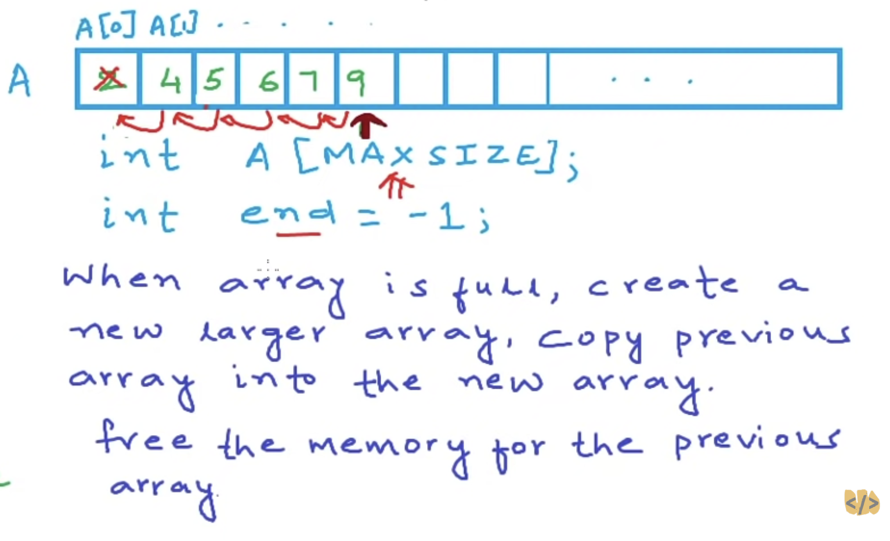

**cost**:

* access - read/write element at an index: O(1)
* Insert: O(n)
* Remove: O(n)
* Add: O(n)

Disadvantage: not efficient in terms of memory consumption, 创建一个max_size的数组，但是并没有全用完

## Linked List

array has some limitation. array stored in contiguous memory.

Linked List stored in multiple non-contiguous blocks of memory

Linked list are collections of entities that we call Nodes.

**Implementation**:

```c
struct Node{
	int daya; // 4 bytes
	Node* next; // 4 bytes
}

// C,  empty list
Node* A;
A = NULL; 

// C, create a node
Node* temp = (Node*)malloc(sizeof(Node))    // C++: Node* temp = new Node();
(*temp).data = 2;                           //      temp --> data =2;
(*temp).next = NULL;                        //      temp --> next = NULL;
A = temp;

// C++, create a node
temp = new Node();
temp --> data =4;
temp --> next = NULL;

// traversal list to reach the last node
Node* temp1 = A;
while (temp1 --> link != NULL){
	temp1 = temp1 --> next;
	print(temp1 --> data);
}

// insert a node at the end of linked list
temp1 --> next = temp;
```

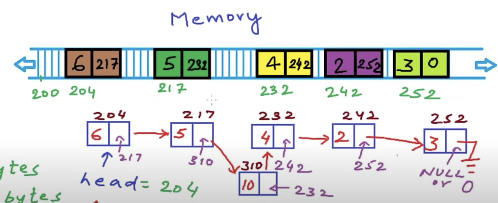

**Cost**:

* Access to element: O(n)
* Insertion: O(n)

### Implementation of Operations

#### **1. Inserting a node at begining**


```c
// Linked list: Inserting a node at begining using C
#include <stdlib.h>
#include <stdio.h>

struct Node {
	int data;
	struct Node* next;
};

struct Node* head; // global variable, can be accessed anywhere
void Inser(int x){
	Node* temp = (Node*)malloc(sizeof(struct Node));
	temp->data = x;
	temp->next = head;
	head = temp;

}
void Print(){
	struct Node* temp = head;
	printf("List is: ");
	while(temp != NULL){
		printf(" %d", temp->data);
		temp = temp->next;
	}
	printf("\n");
}

int main(){
	head = NULL; // empty list
	printf("How many numbers?\n");
	int n, i, x;
	scanf("%d", &n);
	for (i=0; i<n; i++){
		printf("Enter the number \n");
		scanf("%d", &x);
		Insert(x);
		Print();
	}
}
```

```c++
// Linked list: Inserting a node at begining using C++
#include <stdlib.h>
#include <stdio.h>

struct Node {
	int data;
	struct Node* next;
};

// struct Node* head; // global variable, can be accessed anywhere
void Inser(Node** head, int x){
	Node* temp = (Node*)malloc(sizeof(struct Node));
	temp->data = x;
	temp->next = NULL;
	if (*head != NULL) head->next = head
	head = temp;
	return head;

}
void Print(Node* head){  这个head和main中的head不是一个变量，this head is just a copy
	// struct Node* temp = head; 
	printf("List is: ");
	while(head != NULL){
		printf(" %d", head->data);
		head = head->next;
	}
	printf("\n");
}

int main(){
	Node* head = NULL; // empty list
	printf("How many numbers?\n");
	int n, i, x;
	scanf("%d", &n);
	for (i=0; i<n; i++){
		printf("Enter the number \n");
		scanf("%d", &x);
		head = Insert(&head, x);
		Print(head);
	}
}
```

#### **2. Inserting a node at nth position**

```c++
// Linked list: Inserting a node at nth position
#include <stdlib.h>
#include <stdio.h>

struct Node {
	int data;
	struct Node* next;
};

struct Node* head; // global variable, can be accessed anywhere
void Insert(int data, int n){
	Node* temp1 = new Node();
	temp1->data = data;
	temp1->next = NULL;
	if(n==1){
		temp1->next = head;
		head = temp1;
		return;
	}
	Node* temp2 = head;
	for(int i=0; i<n-2; i++){
		temp2 = temp2->next;
	}
	temp1->next = temp2->next;
	temp2->next = temp1;
	 
}
void Print(){
	Node* temp = head;
	printf("List is: ");
	while(temp != NULL){
		printf(" %d", temp->data);
		temp = temp->next;
	}
	printf("\n");
}

int main(){
	head = NULL; // empty list
	Insert(2,1); // List: 2
	Insert(3,2); // List: 2, 3
	Insert(4,1); // List: 4, 2, 3
	Insert(5,2); // List: 4, 5, 2, 3
	Print();
}
```

application's memory is used to store all the instructions and global variables that live for the entire lifetime of the program.

memory: stack(store info about function all executions, all local variables),

 stack, static/global, Code(Text) are fixed in size, their size is decided at compile time.

heap or we called free store is not fixed and we can request memory from heap during runtime and that's what we do when we use malloc or new operator.

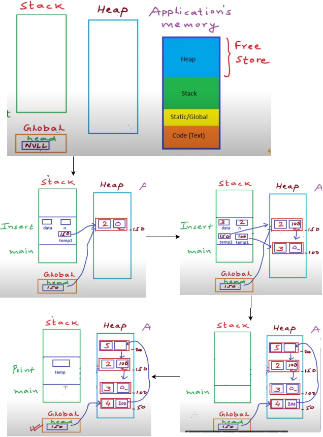

#### **3. Delete a node at nth position**

```c++
// Linked list: Delete a node at nth position
1): fix the links
2): free the space

#include <stdlib.h>
#include <stdio.h>

struct Node {
	int data;
	struct Node* next;
};

struct Node* head; // global variable, can be accessed anywhere
void Insert(int data); // insert an integer at end of list
void Print(); // print all elements in the list

void Delete(int n){ // Delete node at position n
	struct Node* temp1 = head;
	if (n==1){
		head = temp1->next; // head now points to the second node
		free(temp1);
		return;
	}
	int i;
	for(i=0; i<n-2; i++){
		temp1 = temp1->next; // temp1 points to (n-1)th position
	}
	struct Node* temp2 = temp1->next; // nth position
	temp1->next = temp2->next; // (n+1)th position
	free(temp2) // c++: delete(temp2)
}
int main(){
	head = NULL; // empty list
	Insert(2); // List: 2
	Insert(4); // List: 2, 4
	Insert(6); // List: 2, 4, 6
	Insert(5); // List: 2, 4, 6, 5
	Print();
	int n;
	printf("Enter a position \n");
	scanf("%d", &n);
	Delete(n);
	Print();
}
```

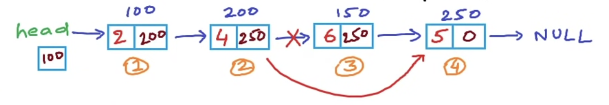

#### **4. reverse a linked list**

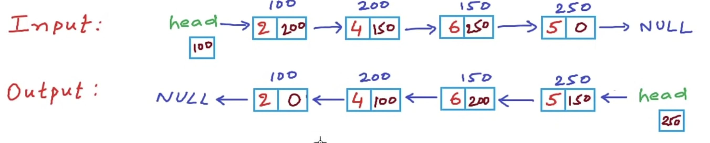

```c
// Reverse a nexted list
// solution 1: Iterative method
 
struct Node {
	int data;
	struct Node* next;
};

struct Node* head;

struct Node* Reverse(struct Node* head){
	struct Node *current, *prev, *next;
	current = head;
	prev = NULL;
	while(current != NULL){
		next = current->next;
		current->next = prev;
		prev = current;
		current = next;
	}
	head = prev;
	return head;
}
int main(){
	struct Node* head = NULL; // local variable
	head = Insert(head, 2); // Insert: struct Node* Insert(struct Node* head, int data)
	head = Insert(head, 4);
	head = Insert(head, 6);
	head = Insert(head, 8);
	Print(head);
	head = Reverse(head);
	Print(head);
}
```

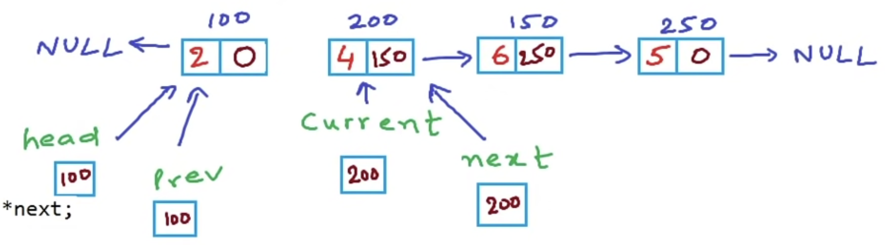

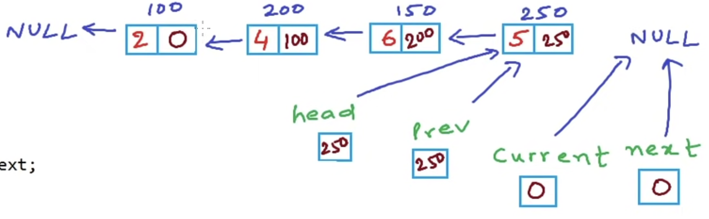

#### 5. Print linked list using recursion

recursion is a function calling itself

For normal Print, not ReversePrint, iterative approach is a lot more efficient than recursion approach. Iterative just uses one temporary variable, while recursion will use space in the stack section of memory for so many function calls.

For ReversePrint operation, iterative approach need to store elements in some struct, so if we use recursion it's still okay.

```c
// Print Linked list using recursion
#include <stdlib.h>
#include <stdio.h>

struct Node {
	int data;
	struct Node* next;
};

void Print(struct Node* P){
	if (p == NULL){
		printf("\n");
		return; // Exit condition
	} 
	printf("%d ", p->data); // First print the value in the node
	Print(p->next); // Recursive call
}

void ReversePrint(struct Node* P){
	if (p == NULL){
		printf("\n");
		return; // Exit condition
	}
	Print(p->next); // Recursive call
	printf("%d ", p->data); // First print the value in the node
}

struct Node* Insert(Node* head, int data){
	Node *temp = (struct Node*)malloc(sizeof(struct Node));
	temp->data = data;
	temp->next = NULL;
	if (head == NULL) head = temp;
	else {
		Node* temp1 = head;
		while(temp1->next !=NULL) temp1 = temp1->next;
		temp1->next = temp;
	}
	return head;
}

int main(){
	struct Node* head = NULL; // local variable
	head = Insert(head,2);
	head = Insert(head,4);
	head = Insert(head,6);
	head = Insert(head,5);
	Print(head);
	ReversePrint(head);

```

!we

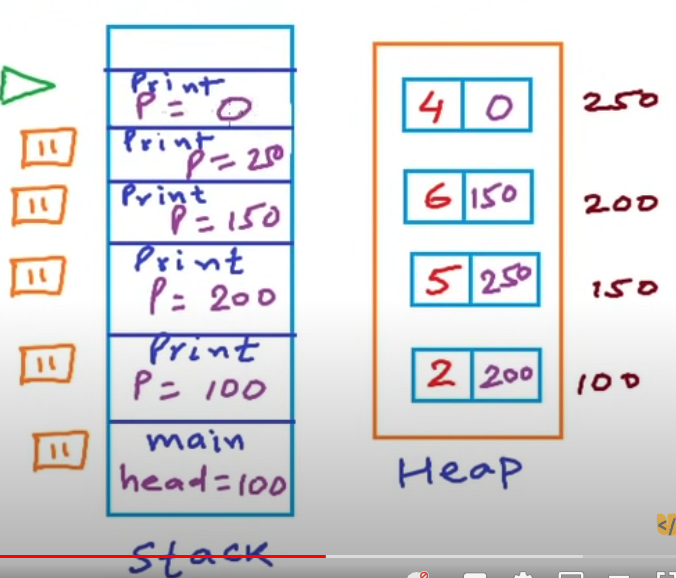

#### 6. Reverse a linked list using recursion

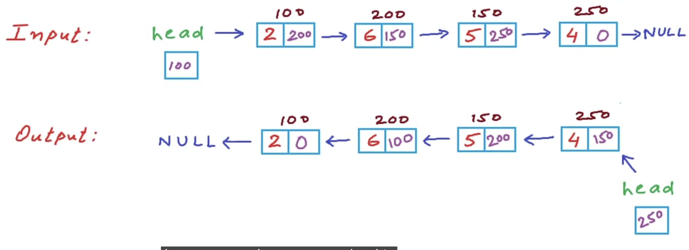

```c
#include <stdlib.h>
#include <stdio.h>

struct Node {
	int data;
	struct Node* next;
};

struct Node* head;

void Reverse(struct Node* p){
	if (p->next==NULL){
		head = p;
		return;
	}
	Reverse(p->next);
	struct Node* q = p->next; // 
	qt->next = p;             // p->next->next = p;
	p->next = NULL;
}

```

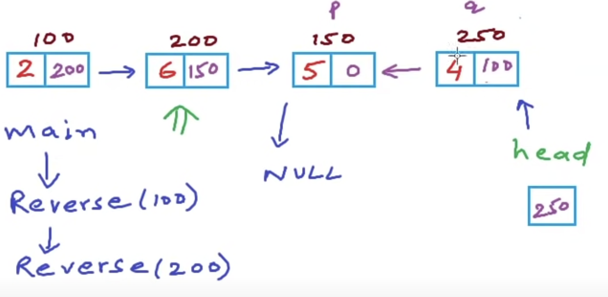

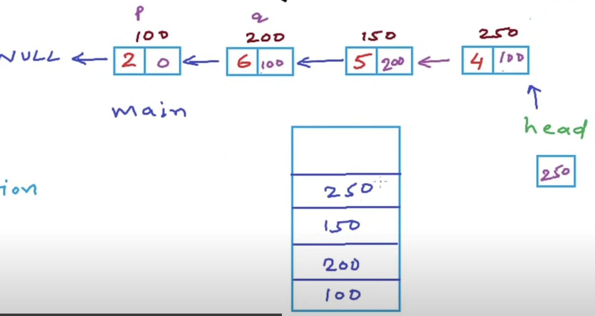

## Array vs Linked List

|                     | Array                                                                                               | Linked Listcol                                                |
| ------------------- | --------------------------------------------------------------------------------------------------- | ------------------------------------------------------------- |
| Access to element   | O(1)                                                                                                | O(n)                                                          |
| memory requirements |                                                                                                     |                                                               |
| insertion           | at begining: O(n)<br />at end: O(1) (array isn't full); O(n) (array full)<br />at ith position O(n) | at begining:O(1)<br />at end: O(n)<br />at ith position: O(n) |
| ease of use         | yes                                                                                                 | no                                                            |


## Doubly Linked List

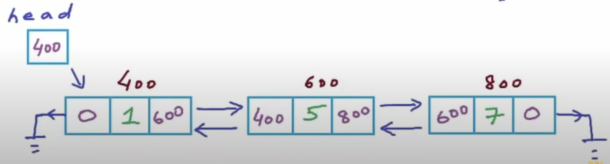

```
struct Node {
	int data;
	struct Node* next;
	struct Node* prev;
};
```

# Array

# Stack

# Queue

# HashTable

# Heap

# Tree

# Grahps
