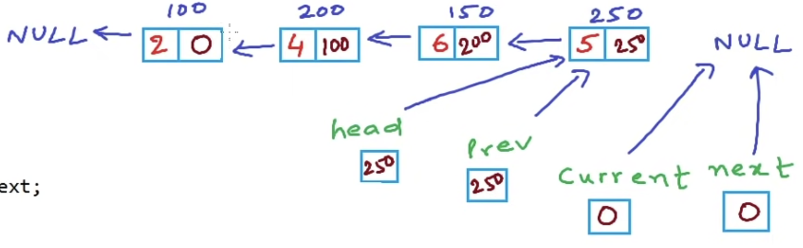
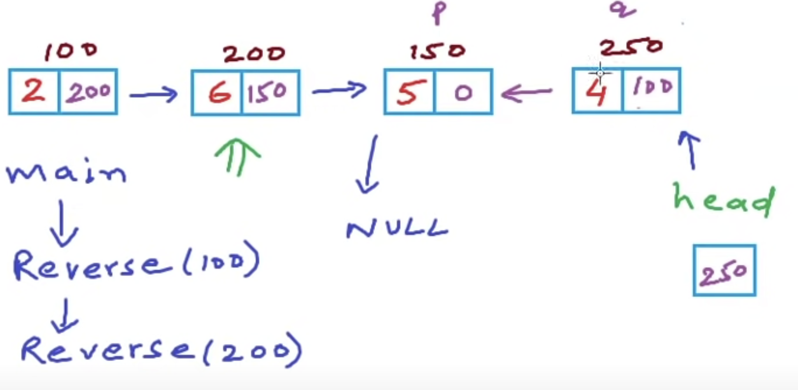

视频课程：
https://www.youtube.com/watch?v=jos1Flt21is&list=PL2_aWCzGMAwI3W_JlcBbtYTwiQSsOTa6P&index=19

# Introduction
A **data structure** is a way to store and organize data in a computer, so that it can be used efficiently. 数据存储、整理、分组。 We take about data structures as :

1. Mathematical/ logical models  ——> abstract data types (ADTs) ; ex: List
2. Concrete Implementation

**Abstract data types** (ADTs) define data and operations, but no implementation.

We will study data struction: Arrays, LinkedList, Stack, Queue, Tree, Graph.... , and we will study
1. Logical view
2. operations: Insertion, Deletion, Traverse, Reverse, Read/Modify, Count
3. cost of operations
4. Implementation.

# 1. Array
#数据结构/array

# 2. List
#数据结构/List

## List (basic)

static list: a static collection of fixed size.

**ADT**:

* store a give number of elements of a given data-type
* Write/modify element of a position
* Read element at a position

**Implementation**:
* array
```c
    int A[10];
    A[i] = 2;
    print A[i];
```


## Dynamic List

size grow as per my need.

**ADT**:
* empty list has size 0
* insert
* remove
* count
* read/modify element at a position
* specify data type

**Implementation**:

```c
int A[MAXSIZE];
int end = -1;
insert(2)
insert(4)
insert(6)
insert(7)
insert(9)
insert(5,2)
remove(0)
```


**cost**:

* access - read/write element at an index: O(1)
* Insert: O(n)
* Remove: O(n)
* Add: O(n)

Disadvantage: not efficient in terms of memory consumption, 创建一个max_size的数组，但是并没有全用完

## Linked List

array has some limitation. array stored in contiguous memory.

Linked List stored in multiple non-contiguous blocks of memory

Linked list are collections of entities that we call Nodes.

**Implementation**:

```c
struct Node{
	int daya; // 4 bytes
	Node* next; // 4 bytes
}

// C,  empty list
Node* A;
A = NULL; 

// C, create a node
Node* temp = (Node*)malloc(sizeof(Node))    // C++: Node* temp = new Node();
(*temp).data = 2;                           //      temp --> data =2;
(*temp).next = NULL;                        //      temp --> next = NULL;
A = temp;

// C++, create a node
temp = new Node();
temp --> data =4;
temp --> next = NULL;

// traversal list to reach the last node
Node* temp1 = A;
while (temp1 --> link != NULL){
	temp1 = temp1 --> next;
	print(temp1 --> data);
}

// insert a node at the end of linked list
temp1 --> next = temp;
```


**Cost**:

* Access to element: O(n)
* Insertion: O(n)

### Implementation of Operations

#### Insertion at begin
**1. Inserting a node at begining**


```c
// Linked list: Inserting a node at begining using C
#include <stdlib.h>
#include <stdio.h>

struct Node {
	int data;
	struct Node* next;
};

struct Node* head; // global variable, can be accessed anywhere
void Inser(int x){
	Node* temp = (Node*)malloc(sizeof(struct Node));
	temp->data = x;
	temp->next = head;
	head = temp;

}
void Print(){
	struct Node* temp = head;
	printf("List is: ");
	while(temp != NULL){
		printf(" %d", temp->data);
		temp = temp->next;
	}
	printf("\n");
}

int main(){
	head = NULL; // empty list
	printf("How many numbers?\n");
	int n, i, x;
	scanf("%d", &n);
	for (i=0; i<n; i++){
		printf("Enter the number \n");
		scanf("%d", &x);
		Insert(x);
		Print();
	}
}
```

```cpp
// Linked list: Inserting a node at begining using C++
#include <stdlib.h>
#include <stdio.h>

struct Node {
	int data;
	struct Node* next;
};

// struct Node* head; // global variable, can be accessed anywhere
void Inser(Node** head, int x){
	Node* temp = (Node*)malloc(sizeof(struct Node));
	temp->data = x;
	temp->next = NULL;
	if (*head != NULL) head->next = head
	head = temp;
	return head;

}
void Print(Node* head){  这个head和main中的head不是一个变量，this head is just a copy
	// struct Node* temp = head; 
	printf("List is: ");
	while(head != NULL){
		printf(" %d", head->data);
		head = head->next;
	}
	printf("\n");
}

int main(){
	Node* head = NULL; // empty list
	printf("How many numbers?\n");
	int n, i, x;
	scanf("%d", &n);
	for (i=0; i<n; i++){
		printf("Enter the number \n");
		scanf("%d", &x);
		head = Insert(&head, x);
		Print(head);
	}
}
```

#### Insertion at nth
**2. Inserting a node at nth position**

```c++
// Linked list: Inserting a node at nth position
#include <stdlib.h>
#include <stdio.h>

struct Node {
	int data;
	struct Node* next;
};

struct Node* head; // global variable, can be accessed anywhere
void Insert(int data, int n){
	Node* temp1 = new Node();
	temp1->data = data;
	temp1->next = NULL;
	if(n==1){
		temp1->next = head;
		head = temp1;
		return;
	}
	Node* temp2 = head;
	for(int i=0; i<n-2; i++){
		temp2 = temp2->next;
	}
	temp1->next = temp2->next;
	temp2->next = temp1;
	 
}
void Print(){
	Node* temp = head;
	printf("List is: ");
	while(temp != NULL){
		printf(" %d", temp->data);
		temp = temp->next;
	}
	printf("\n");
}

int main(){
	head = NULL; // empty list
	Insert(2,1); // List: 2
	Insert(3,2); // List: 2, 3
	Insert(4,1); // List: 4, 2, 3
	Insert(5,2); // List: 4, 5, 2, 3
	Print();
}
```

application's memory is used to store all the instructions and global variables that live for the entire lifetime of the program.

memory: stack(store info about function all executions, all local variables),

 stack, static/global, Code(Text) are fixed in size, their size is decided at compile time.

heap or we called free store is not fixed and we can request memory from heap during runtime and that's what we do when we use malloc or new operator.


#### Deletion
**3. Delete a node at nth position**

```cpp
// Linked list: Delete a node at nth position
1): fix the links
2): free the space

#include <stdlib.h>
#include <stdio.h>

struct Node {
	int data;
	struct Node* next;
};

struct Node* head; // global variable, can be accessed anywhere
void Insert(int data); // insert an integer at end of list
void Print(); // print all elements in the list

void Delete(int n){ // Delete node at position n
	struct Node* temp1 = head;
	if (n==1){
		head = temp1->next; // head now points to the second node
		free(temp1);
		return;
	}
	int i;
	for(i=0; i<n-2; i++){
		temp1 = temp1->next; // temp1 points to (n-1)th position
	}
	struct Node* temp2 = temp1->next; // nth position
	temp1->next = temp2->next; // (n+1)th position
	free(temp2) // c++: delete(temp2)
}
int main(){
	head = NULL; // empty list
	Insert(2); // List: 2
	Insert(4); // List: 2, 4
	Insert(6); // List: 2, 4, 6
	Insert(5); // List: 2, 4, 6, 5
	Print();
	int n;
	printf("Enter a position \n");
	scanf("%d", &n);
	Delete(n);
	Print();
}
```


#### Tranverse
5. Print linked list using recursion

recursion is a function calling itself

For normal Print, not ReversePrint, iterative approach is a lot more efficient than recursion approach. Iterative just uses one temporary variable, while recursion will use space in the stack section of memory for so many function calls.

For ReversePrint operation, iterative approach need to store elements in some struct, so if we use recursion it's still okay.

```c
// Print Linked list using recursion
#include <stdlib.h>
#include <stdio.h>

struct Node {
	int data;
	struct Node* next;
};

void Print(struct Node* P){
	if (p == NULL){
		printf("\n");
		return; // Exit condition
	} 
	printf("%d ", p->data); // First print the value in the node
	Print(p->next); // Recursive call
}

void ReversePrint(struct Node* P){
	if (p == NULL){
		printf("\n");
		return; // Exit condition
	}
	Print(p->next); // Recursive call
	printf("%d ", p->data); // First print the value in the node
}

struct Node* Insert(Node* head, int data){
	Node *temp = (struct Node*)malloc(sizeof(struct Node));
	temp->data = data;
	temp->next = NULL;
	if (head == NULL) head = temp;
	else {
		Node* temp1 = head;
		while(temp1->next !=NULL) temp1 = temp1->next;
		temp1->next = temp;
	}
	return head;
}

int main(){
	struct Node* head = NULL; // local variable
	head = Insert(head,2);
	head = Insert(head,4);
	head = Insert(head,6);
	head = Insert(head,5);
	Print(head);
	ReversePrint(head);

```

!we


#### Reverse linkedList

##### Reverse using Iterative
**4. reverse a linked list**


```c
// Reverse a nexted list
// solution 1: Iterative method
 
struct Node {
	int data;
	struct Node* next;
};

struct Node* head;

struct Node* Reverse(struct Node* head){
	struct Node *current, *prev, *next;
	current = head;
	prev = NULL;
	while(current != NULL){
		next = current->next;
		current->next = prev;
		prev = current;
		current = next;
	}
	head = prev;
	return head;
}
int main(){
	struct Node* head = NULL; // local variable
	head = Insert(head, 2); // Insert: struct Node* Insert(struct Node* head, int data)
	head = Insert(head, 4);
	head = Insert(head, 6);
	head = Insert(head, 8);
	Print(head);
	head = Reverse(head);
	Print(head);
}
```




##### Reverse using recursion
6. Reverse a linked list using recursion


```c
#include <stdlib.h>
#include <stdio.h>

struct Node {
	int data;
	struct Node* next;
};

struct Node* head;

void Reverse(struct Node* p){
	if (p->next==NULL){
		head = p;
		return;
	}
	Reverse(p->next);
	struct Node* q = p->next; // 
	qt->next = p;             // p->next->next = p;
	p->next = NULL;
}

```




## Array vs Linked List

|                     | Array                                                                                               | Linked Listcol                                                |
| ------------------- | --------------------------------------------------------------------------------------------------- | ------------------------------------------------------------- |
| Access to element   | O(1)                                                                                                | O(n)                                                          |
| memory requirements |                                                                                                     |                                                               |
| insertion           | at begining: O(n)<br />at end: O(1) (array isn't full); O(n) (array full)<br />at ith position O(n) | at begining:O(1)<br />at end: O(n)<br />at ith position: O(n) |
| ease of use         | yes                                                                                                 | no                                                            |


## Doubly Linked List


```c
struct Node {
	int data;
	struct Node* next;
	struct Node* prev;
};
```

**Operations**:

* Insertion
* Traversal
* Deletion

**Advantages**:

* Reverse look-up: temp->next; temp->prev; , 更容易找前一个节点
* 容易实现deletion操作

**Disadvantage**:

* extra memory for pointer to previous node: int 占4bytes, linked list占8bytes, double linked list占12bytes
* reset couple of more link than a single linked list when inserting, deleting a node

**Implementation**
https://gist.github.com/mycodeschool/7429492

```c

#include <stdlib.h>
#include <stdio.h>
struct Node {
	int data;
	struct Node* next;
	struct Node* prev;
};
struct Node* head; //global variable - pointer to head node
struct Node* GetNewNode(int x){
	// strucy Node myNode // local variable, store in stack,will be cleared from memory when function call will finish
	struct Node* newNode = (struct Node*)malloc(sizeof(struct Node)); // store in dynamic memory, called Heap, is not cleared unless  we explicity free it.
	newNode->data = x;  // (*newNode).data = x;
	newNode->prev = NULL;
	newNode->next = NULL;
	return newNode;
}
void InsertAtHead(int x){
	struct Node* newNode = GetNewNode(x);
	if(head == NULL){
		head = newNode;
		return;
	}
	head->prev = newNode;
	newHead->next = head;
	head = newNode;

}
void InsertAtTail(){

}
void Print(){
	struct Node* temp = head;
	printf("Forward: ");
	while(temp!=NULL){
		printf("%d ", temp->data);
		temp = temp->next;	
	}
	printf("\n");
}
void ReversePrint(){
	struct Node* temp = head;
	if(temp == NULL) return; //empty list, exit
	// Going to last node
	while (temp=>next != NULL){
		temp = temp->next;
	}
	//Traversing backward using prev pointer
	printf("Reverse: ");
	while(temp !=NULL){
		printf("%d ", temp->data);
		temp = temp->prev;
	}
	printf("\n");
}
int main(){
	head = NULL; // empty list
	InsertAtHead(2); Print(); ReversePrint();
	InsertAtHead(4); Print(); ReversePrint();
	InsertAtHead(6); Print(); ReversePrint();
}

```

如果GetNewNode 函数里使用strucy Node myNode, 当GetNewNode结束，存在stack的myNode会被删，导致returnh后newNode找不到地址50的值

使用heap不会出现这个问题，heap是dynamic memory


## Application
* 应用广泛：学生名单，活动清单
链表以及它的变种可以作为实现堆栈，队列，和双向队列抽象数据类型
单向链表的变种是栈和队列
双向链表的变种是双端队列

# 3. Stack
#数据结构/stack

Last-In-First-Out(LIFO)) Structure

## ADT

List with the restriction that insertion and deletion can be performed only from one end, called thr top.

Operation: 所有操作时间复杂度O(1),

* Push(x)
* Pop
* Top()
* IsEmpty()


## Implemetation

插入和删除从 list的一端进行就得到一个stack

We can implement stack using

* Arrays
* Linked list

### Array based
https://gist.github.com/mycodeschool/6878252
https://gist.github.com/mycodeschool/6878628


```伪代码
// Array implementation
int A[10]
top <- -1
Push(x){
	top <- top+1
	A[top] <- x
}
Pop(){
	top >- top-1
}
Top(){
	return A[top]
}
IsEmpty(){
	if(top == -1){
		return true
	}else{
		return false
	}
}

Push(2)
Push(10)
Push(5)
Pop() // Pop的时候不需要释放内存，下次push会覆盖掉
Push(7)

// Limitation
当top=数组的最大索引，stack占满数组，此时再push会导致溢出，为避免溢出需要创建足够大的数组，需要思考设置一个合理的数组大小值，不管怎样需要考虑溢出的处理方法

// Overflow
create a larger array copy all elememts in new array: 时间复杂度O(n) , 优化策略是创建的新数组=旧数组大小*2
Push:时间复杂度O(1)~O(n)
```

```c
// Stack - Array based Implementation
// 这是一个最基本的实现，真正的实现还需定义一个stack，，，可以使用C++来实现
#include<stdio.h>
#define MAX_SIZE 101 //宏
int A[MAX_SIZE];
int top = -1;
void Push(int x){
	if (top == MAX_SIZE-1) {
		printf("Error: stack overflow\n)");
	}
	A[++top] = x;
}
void Pop(){
	if (top == -1){
		printf("Error: No element to pop\n)");
		return;
	}
	top--;
}
int Top(){
	return A[top];
}

void Print(){
	int i;
	printf("STack: ")
	for(i=0; i<=top; i++)
		printf("%d ", A[i])
	printf("\n")
}
int main(){
	Push(2);Print();
	Push(5);Print();
	Push(10);Print();
	Pop();Print();
	Push(12);Print();
}
```

### LinkedList based
Insert/delete 
* at end of list(tail) : 时间复杂度O(n)
* at begining (head): 时间复杂度O(1)
LinkedList based相比array based的优势：
* 不用担心overflow
* array based 分配的内存不一定占满。造成浪费，LinkedList based 不会有这个问题
```c
// Insert/delete at begining (head)
struct Node{
	int data;
	struct Node* link;
};
struct Node* top = NULL;
void Push(int x){
	struct Node* temp = (struct Node*)malloc(sizeof(struct Node*));
	temp->data = x;
	temp->link = top;
	top = temp;
}
void Pop(){
	struct Node *temp;
	if(top == NULL) return;
	temp = top;
	top = top->link;
	free(temp);
}

```


## Applications

Stack的应用场景
* Function calls / Recursion
* undo operation in an editor
* balanced parentheses, 编译器用stack验证源代码中括号是否匹配
* reserve a list or collection: reserve a string or LinkedList
* 计算器
* 单调栈
* 设计类
* 移除重复字母
栈类型题目通常与字符串一同出现。

### Using stack to reverse
**reverse a string** 


```cpp
// string reversal using stack
// 时间复杂度：O(n)
// 空间复杂度：O(n)

#include<iostream>
#include<srtack> // stack from standard template library(STL)
using namespace std;
// class Stack{
//     private:
//         char A[101];
//         int top;
//     public:
//         void Push(int x);
//         void Pop();
//         int Top();
//         bool IsEmpty();
// }
void Reverse(char *C, int n){
	Stack<char> S;
	// loop for push
	for(int i=0;i<n;i++){
		S.push(C[i]);
		
	}
	// loop for pop
	for(int i=0;i<n;i++){
		C[i] = S.top();
		S.pop()
	}
	
}
int main(){
	char C[51];
	printf("Enter a string");
	gets(C);
	Reverse(C,strlen(C));
	printf("Output = %s", C);
}
```

```
另一种方式，定义两个变量i,j分别指向stck首尾，交换i,j的值后i++,j--,此方法
时间复杂度O(n)
空间复杂度O(1)
```

**reverse a linked list**
使用stack反转链表会容易些

solution:
1. using some varibale , iterative method: 时间复杂度O(n),空间复杂度O(1)
2. Recursive method: 时间复杂度O(n),空间复杂度O(n)
```
struct Node{
	int data;
	Node* next;
}

void Reverse(){
	/* to push all references */
	if(head == NULL) return;
	stack<struct Node*> S;
	Node* temp = head;
	while(temp!=NULL){
		S.push(temp);
		temp = temp->next;
	}
	temp = S.top();
	head = temp;
	S.pop()
	while(!S.empty()){
		temp->next = S.top();
		S.pop();
		temp = temp->next;
	}
	temp->next = NULL;
}
```

### Check for balanced parenttheses
parenttheses: [] or () or {}
括号匹配：Last unclosed, first closed


Solution:
* scan from left to right
* if opening symbol, add it to a list
* if closing symbol, remove last opening symbol in list
https://gist.github.com/mycodeschool/7207410


### Infix postfix prefix

# 4. Queue
#数据结构/Queue

队列

序列

# 5. HashTable
#数据结构/Hashtable

# 6. Heap
#数据结构/Heap

二叉堆

二项式堆

斐波那契堆

配对堆

# 7. Tree
#数据结构/Tree

二叉树

红黑树

AVL树

Trie

Patrica

后缀树

B树

# 8. Graphs
#数据结构/Graphs

# 9. 字符串

# 10. 位图
（1）定义

位图[数据结构](http://lib.csdn.net/base/datastructure)，就是用一块内存区域的每个比特表示一个对象的数据结构，叫做 bitmap 或者 bitplane。

优点是速度快，内存空间占用小，能表示大范围的数据。

《Programming Pearls》里面举了一个例子，假设要对0到一千万范围内的、没有重复元素的正整数排序，

则利用位图数据结构很合适。

Abitsetstores bits \(elements with only two possible values: 0 or 1,`true`or`false`, ...\).

The class emulates an array of`bool`elements, but optimized for space allocation: generally, each element occupies only one bit \(which, on most systems, is eight times less than the smallest elemental type:`char`\).

Each bit position can be accessed individually: for example, for a given bitset named`foo`, the expression`foo[3]`accesses its fourth bit, just like a regular array accesses its elements. But because no elemental type is a single bit in most C++ environments, the individual elements are accessed as special references type \([http://www.cplusplus.com/reference/bitset/bitset/\](http://www.cplusplus.com/reference/bitset/bitset/\)\)

（2）适用范围

位图数据结构在排序算法中的特殊应用是利用排序问题中不常见的三个属性：

第一：输入数据限制在相对较小的范围内 （这也是编写软件时最多的设计方法）；

第二：数据没有重复；

第三：对于每条记录而言，除了单一数据外（此题为单一的整数），没有任何其他关联数据。

从而达到写算法时能根据实际问题实现最有效的时间─空间折中与双赢。

\(3\)位图数据结构的实现

（a）比特的编号机制

下面过一个示例来帮助大家理解比特的编号方法，在这里，从低字节的高位比特位开始，第一个bit为0，最后一个bit为 n-1（大端模式）

例如：现有数组为int a\[3\]表示一块内存区域，共3*4=12个字节，共12*8=96个比特，因此a\[0\]对应的bit位0-31，a\[1\]对应32-63，a\[2\]对应64-95。a[0]的高比特（从左边数，第1个字节，第1个比特）为第0个比特。
因此，上述程序与机器是大端还是小端模式无关。

从低字节的低位比特位开始，第一个bit为0，最后一个bit为 n-1（大端模式）

    #include<iostream>
    using namespace std;  
    int main(int argc,char *argv)  
    {  
        int a[3];  
        for(int i=0;i=3;i++)  
        {  
            a[i]=1;  
        }  
        for(int i=0;i<3;i++)  
        {  
            a[i]=a[i]<<5;  //左移5位
            cout<<a[i]<<endl;  
        }  
        return 0;  
    }  

输出结果如下图所示


**由此可知原来数据存放如下    
**

| 0 | 0 | 0 | 0 | 0 | 0 | 0 | 0 | 0 | 0 | 0 | 0 | 0 | 0 | 0 | 0 | 0 | 0 | 0 | 0 | 0 | 0 | 0 | 0 | 0 | 0 | 0 | 0 | 0 | 0 | 0 | 0 |
| :--- | :--- | :--- | :--- | :--- | :--- | :--- | :--- | :--- | :--- | :--- | :--- | :--- | :--- | :--- | :--- | :--- | :--- | :--- | :--- | :--- | :--- | :--- | :--- | :--- | :--- | :--- | :--- | :--- | :--- | :--- | :--- |


经过经过位运算后，也即左移5位后为，即对应的数为32

| 0 | 0 | 0 | 0 | 0 | 0 | 0 | 0 | 0 | 0 | 0 | 0 | 0 | 0 | 0 | 0 | 0 | 0 | 0 | 0 | 0 | 0 | 0 | 0 | 0 | 0 | 1 | 0 | 0 | 0 | 0 | 0 |
| :--- | :--- | :--- | :--- | :--- | :--- | :--- | :--- | :--- | :--- | :--- | :--- | :--- | :--- | :--- | :--- | :--- | :--- | :--- | :--- | :--- | :--- | :--- | :--- | :--- | :--- | :--- | :--- | :--- | :--- | :--- | :--- |


\(b\)位图实现

要使用位图数据结构，就必须熟悉位操作。

以下是已经写好的操作位图数据结构的实用函数

	#define BITS_PER_BYTE 8
	#define BITS_PER_INT (BITS_PER_BYTE * 4)
	// set the bit of the int specified by index to 1.
	// the index is zero-based, counting from the left(the higher end)
	inline void pearl_int_set(int* data, int index)
	{
		int mask = 1 << (BITS_PER_INT - 1 - index);
		*data |= mask;
	}
	
	// test whether a bit of the int specified by index is 1.
	// the index is zero-based, counting from the left(the higher end)
	inline int pearl_int_test(int* data, int index)
	{
		int mask = 1 << (BITS_PER_INT - 1 - index);
		return (*data) & mask;
	}
	
	// set a bit of the int specified by bit_index to 0.
	// the index is zero-based, counting from the left(the higher end)
	inline void pearl_int_clear(int *data, int bit_index)
	{
		int mask = ~(1 << (BITS_PER_INT - 1 - bit_index));
		*data &= mask;
	}
	
	// get the right(lower) part of the int.
	inline int pearl_int_right(int *data, int count)
	{
		int mask = 1;
		while(count > 0) {
			mask = mask << 1 + 1;
		}
		return *data & mask;	
	}
	
	// get the left(upper) part of the int value
	inline int pearl_int_left(int *data, int count)
	{
		int mask = 1;
		count = BITS_PER_BYTE - count;
		while (count > 0) {
			mask = mask << 1 + 1;
		}
	
		mask = ~mask;
		return *data & mask;
	}
	
	// set a bit of the speicified memory area to 1.
	// @warning this function does NOT perform error checking.
	inline void pearl_set(int *bitplane, int index)
	{
		int offset = index / BITS_PER_INT;
		int pos = index - offset * BITS_PER_INT;
	
		pearl_int_set(bitplane + offset, pos);
	}
	
	// set a bit of the specified memory area to 0.
	// @warning this function does NOT perform error checking.
	inline void pearl_clear(int *bitplane, int index)
	{
		int offset = index / BITS_PER_INT;
		int pos = index - offset * BITS_PER_INT;
	
		pearl_int_clear(bitplane + offset, pos);
	}
	
	// test if a bit of the specified memory area is 1.
	// @warning this function does NOT perform error checking.
	inline int pearl_test(int *bitplane, int index)
	{
		int offset = index / BITS_PER_INT;
		int pos = index - offset * BITS_PER_INT;
	
		return pearl_int_test(bitplane + offset, pos);
	}

用法举例：
	
	int main(int argc, char* argv[]) {
	    int* bitplane = (int*)malloc(sizeof(int)*SIZE);
	    pearl_set(bitplane, n); // 0 <= n <= SIZE * 4 * 8 - 1
	    if ( pearl_test(bitplane, n) ) {
	        printf("bit(%d) is set\n", n);
	    }
	    pearl_clear(bitplane, n);
	    if ( pearl_test(bitplane, n) ) {
	        printf("bit(%d) is cleared\n", n);
	    }
	    return 0;
	}