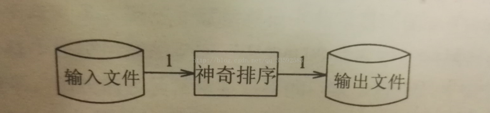

# 磁盘文件排序问题

## 准确问题描述 （不要请求不可知，要由已知推未知，根据需求建立问题）

**输入**：一个最多包含n个正整数（电话号码）的文件，每个数都小于n，其中n= $$10^7$$ 。如果在输入文件中有任何整数重复出现就是致命错误。没有其他数据与该整数相关联。

**输出**：按升序排列的输入整数的列表

**约束**：最多有（大约）1MB的内存空间可用，有充足的磁盘存储空间可用。运行时间最多几分钟，运行时间为10秒就不需要进一步优化了。

## 程序设计（解决方案分析）

#### approach \#1 基于磁盘的归并排序

分析：通过调整归并排序，由于是对整数排序，因此可以使程序由原来的200行减少到几十行，运行速度会加快，但是完成程序并使之运行仍然需要几天时间

#### approach \#2利用问题的特殊性

如果每个号码用7个字节来存储，则1MB存储空间里大约可以存143000个号码，如果每个号码用32为整数来存储，则1MB存储空间可存250000个号码。因此可使用遍历输入文件$$10^7$$/250000=40趟的程序来完成排序。第一趟遍历中，将0~249999之间的任何整数读入内存，并对这（最多）250000个整数进行排序，然后写到输出文件中，第二趟遍历排序250000至499999之间的整数，以此类推，至第40趟遍历时对9750000至9999999之间的整数进行排序。

对内存中的排序，快速排序是相当高效的。仅需20行代码，不必考虑使用中间磁盘文件，但需要读取输入文件40次。

图1：归并排序：读入输入文件一次，然后在工作文件帮助下完成排序并写入输出文件一次。工作文件需要多次读写。

图2：40趟算法读入输入文件多次，写输出文件仅一次，不使用中间文件。

图3：下面方案结合上述两种方法的优点，读输入文件一次，且不使用中间文件只有在输入文件中所有整数都可以在可用的1MB内存中表示的时候才能够实现该方案，于是问题就归结为用大约800万个可用为来表示最多1000万个互异的整数。

#### approach \#3 使用位图

位图[数据结构](http://lib.csdn.net/base/datastructure)：该数据结构描述了一个有限定义域内的稠密集合，其中的每一个元素最多出现一次并且没有其他任何数据与该元素相关联。即使这些条件没有完全满足（例如，存在重复元素或额外的数据），也可以用有限定义域内的键作为一个表项更复杂的表格的索引。

使用位图或位向量表示集合：
可用一个20位长的字符串来表示一个所有元素都小于20的简单的非负整数集合。例如，可用如下字符串来表示集合{1,2,3,5,8,13}：0 1 1 1 0 1 0 0 1 0 0 0 0 1 0 0 0 0 0 0，代表集合中的数据都设置为1,其他的位置都设置为0。

可以使用1000万个位（1000万/8=1.19MB&gt;1MB，可以使用2趟来完成排序）的字符串来表示这个文件，其中，当且仅当整数i在文件中存在时，第i位为1，可以用如下的伪代码实现之

**step1：.将所有的位都置为0，从而将集合初始化为空**

    /*****initialize set to empty****/
    for i=[0,n) 
        bit[i]=0

**step2:通过读入文件中的每个整数来建立集合，将每个对应位都置为1。**

    /*****insert present elements into the set****/  
    for each i in the input file   
        bit[i]=1  

**step3:检验每一位如果该位为1，就输出对应的整数，由此产生有序的输出文件**

    /******write sorted output****/  
    for i=[0,n)  
        if bit[i]==1  
            write i on the output file
注：for i=[0,n)表示从0到n-1的范围内对i进行迭代

其中的位图数据结构实现：

    #define BITPERWORD 32
    #define SHIFT 5
    #define MASK 0x1F
    #define N 10000000
    int a[1+N/BITPERWORD];
    void set(int i){a[i>>SHIFT] |= (1 << (i & MASK));}
    void clear(int i){a[i>>SHIFT] |= ~(1 << (i & MASK));}
    int test(int i){return a[i>>SHIFT] & (1 << (i & MASK));}

问题一：如果存在重复整数，比如每个整数最多出现10次，该肿么办？
                       可以用4位的半字节统计每个整数数出现的次数
问题二：当输入整数小于0大于n时，怎么办？当输入不是数值又该怎么办？